# Tidy data and its friends {#tidy_data}


## Setup

-   Check your `dplyr` package is up-to-date by typing `packageVersion("dplyr")`. If the current installed version is less than 1.0, then update by typing `update.packages("dplyr")`. You may need to restart R to make it work.


```r
ifelse(packageVersion("dplyr") > 1,
  "The installed version of dplyr package is greater than or equal to 1.0.0", update.packages("dplyr")
)
```

```
## [1] "The installed version of dplyr package is greater than or equal to 1.0.0"
```

```r
if (!require("pacman")) install.packages("pacman")
```

```
## Loading required package: pacman
```

```r
pacman::p_load(
  tidyverse, # for the tidyverse framework
  here, # for computational reproducibility
  gapminder, # toy data
  nycflights13, # for exercise
  ggthemes, # additional themes
  ggrepel, # arranging ggplots
  patchwork, # arranging ggplots
  broom # tidying model outputs
)
```

The rest of the chapter follows the basic structure in [the Data Wrangling Cheat Sheet](https://rstudio.com/wp-content/uploads/2015/02/data-wrangling-cheatsheet.pdf) created by RStudio.

## R Data structures 

To make the best use of the R language, you'll need a strong understanding of the basic data types and data structures and how to operate on those. R is an **object-oriented** language, so the importance of this cannot be understated. 

It is **critical** to understand because these are the objects you will manipulate on a day-to-day basis in R, and they are not always as easy to work with as they sound at the outset. Dealing with object conversions is one of the most common sources of frustration for beginners.

> To understand computations in R, two slogans are helpful:
  - Everything that exists is an object.
  - Everything that happens is a function call.
  
> __John Chambers__the creator of S (the mother of R)

1. [Main Classes](#main-classes) introduces you to R's one-dimensional or atomic classes and data structures. R has five basic atomic classes: logical, integer, numeric, complex, character. Social scientists don't use complex class. (Also, remember that we rarely use trigonometry.)

2. [Attributes](#attributes) takes a small detour to discuss attributes, R's flexible metadata specification. Here you'll learn about factors, an important data structure created by setting attributes of an atomic vector. R has many data structures: vector, list, matrix, data frame, factors, tables.

## 1D data: Vectors 

### Atomic classes

`R`'s main atomic classes are:

* character (or a "string" in Python and Stata)
* numeric (integer or float)
* integer (just integer)
* logical (booleans)

| Example | Type |
| ------- | ---- |
| "a", "swc" | character |
| 2, 15.5 | numeric | 
| 2 (Must add a `L` at end to denote integer) | integer |
| `TRUE`, `FALSE` | logical |

Like Python, R is dynamically typed. There are a few differences in terminology, however, that are pertinent. 

- First, "types" in Python are referred to as "classes" in R. 

What is a class?


- Second, R has some different names for the types string, integer, and float --- specifically **character**, **integer** (not different), and **numeric**. Because there is no "float" class in R, users tend to default to the "numeric" class when they want to work with numerical data.

The function for recovering object classes is ```class()```. L suffix to qualify any number with the intent of making it an explicit integer. See more from the [R language definition](https://cran.r-project.org/doc/manuals/R-lang.html).


```r
class(3)
```

```
## [1] "numeric"
```

```r
class(3L)
```

```
## [1] "integer"
```

```r
class("Three")
```

```
## [1] "character"
```

```r
class(F)
```

```
## [1] "logical"
```

### Data structures

R's base data structures can be organized by their dimensionality (1d, 2d, or nd) and whether they're homogeneous (all contents must be of the same type) or heterogeneous (the contents can be of different types). This gives rise to the five data types most often used in data analysis: 

|    | Homogeneous   | Heterogeneous |
|----|---------------|---------------|
| 1d | Atomic vector | List          |
| 2d | Matrix        | Data frame    |
| nd | Array         |               |

Each data structure has its own specifications and behavior. For our purposes, an important thing to remember is that R is always **faster** (more efficient) working with homogeneous (**vectorized**) data.

#### Vector properties

Vectors have three common properties:

* Class, `class()`, or what type of object it is (same as `type()` in Python).
* Length, `length()`, how many elements it contains (same as `len()` in Python).
* Attributes, `attributes()`, additional arbitrary metadata.

They differ in the types of their elements: all elements of an atomic vector must be the same type, whereas the elements of a list can have different types.

#### Creating different types of atomic vectors

Remember, there are four common types of vectors: 
* `logical` 
* `integer` 
* `numeric` (same as `double`)
* `character`.

You can create an empty vector with `vector()` (By default the mode is `logical`. You can be more explicit as shown in the examples below.) It is more common to use direct constructors such as `character()`, `numeric()`, etc.


```r
x <- vector()

# with a length and type
vector("character", length = 10)
```

```
##  [1] "" "" "" "" "" "" "" "" "" ""
```

```r
## character vector of length 5
character(5)
```

```
## [1] "" "" "" "" ""
```

```r
numeric(5)
```

```
## [1] 0 0 0 0 0
```

```r
logical(5)
```

```
## [1] FALSE FALSE FALSE FALSE FALSE
```

Atomic vectors are usually created with `c()`, which is short for concatenate:


```r
x <- c(1, 2, 3)

x
```

```
## [1] 1 2 3
```

```r
length(x)
```

```
## [1] 3
```

`x` is a numeric vector. These are the most common kind. You can also have logical vectors. 


```r
y <- c(TRUE, TRUE, FALSE, FALSE)

y
```

```
## [1]  TRUE  TRUE FALSE FALSE
```

Finally you can have character vectors:


```r
kim_family <- c("Jae", "Sun", "Jane")

is.integer(kim_family) # integer?
```

```
## [1] FALSE
```

```r
is.character(kim_family) # character?
```

```
## [1] TRUE
```

```r
is.atomic(kim_family) # atomic?
```

```
## [1] TRUE
```

```r
typeof(kim_family) # what's the type?
```

```
## [1] "character"
```

**Short exercise: Create and examine your vector**  

Create a character vector called `fruit` that contain 4 of your favorite fruits. Then evaluate its structure using the commands below.


```r
# First create your fruit vector
# YOUR CODE HERE
fruit <-

  # Examine your vector
  length(fruit)
class(fruit)
str(fruit)
```

**Add elements**

You can add elements to the end of a vector by passing the original vector into the `c` function, like so:


```r
z <- c("Beyonce", "Kelly", "Michelle", "LeToya")

z <- c(z, "Farrah")

z
```

```
## [1] "Beyonce"  "Kelly"    "Michelle" "LeToya"   "Farrah"
```

More examples of vectors


```r
x <- c(0.5, 0.7)

x <- c(TRUE, FALSE)

x <- c("a", "b", "c", "d", "e")

x <- 9:100
```

You can also create vectors as a sequence of numbers:


```r
series <- 1:10

series
```

```
##  [1]  1  2  3  4  5  6  7  8  9 10
```

```r
seq(10)
```

```
##  [1]  1  2  3  4  5  6  7  8  9 10
```

```r
seq(1, 10, by = 0.1)
```

```
##  [1]  1.0  1.1  1.2  1.3  1.4  1.5  1.6  1.7  1.8  1.9  2.0  2.1  2.2  2.3  2.4
## [16]  2.5  2.6  2.7  2.8  2.9  3.0  3.1  3.2  3.3  3.4  3.5  3.6  3.7  3.8  3.9
## [31]  4.0  4.1  4.2  4.3  4.4  4.5  4.6  4.7  4.8  4.9  5.0  5.1  5.2  5.3  5.4
## [46]  5.5  5.6  5.7  5.8  5.9  6.0  6.1  6.2  6.3  6.4  6.5  6.6  6.7  6.8  6.9
## [61]  7.0  7.1  7.2  7.3  7.4  7.5  7.6  7.7  7.8  7.9  8.0  8.1  8.2  8.3  8.4
## [76]  8.5  8.6  8.7  8.8  8.9  9.0  9.1  9.2  9.3  9.4  9.5  9.6  9.7  9.8  9.9
## [91] 10.0
```

Atomic vectors are always flat, even if you nest `c()`'s:


```r
c(1, c(2, c(3, 4)))
```

```
## [1] 1 2 3 4
```

```r
# the same as
c(1, 2, 3, 4)
```

```
## [1] 1 2 3 4
```

**Types and Tests**

Given a vector, you can determine its class with `class`, or check if it's a specific type with an "is" function: `is.character()`, `is.numeric()`, `is.integer()`, `is.logical()`, or, more generally, `is.atomic()`.


```r
char_var <- c("harry", "sally")

class(char_var)
```

```
## [1] "character"
```

```r
is.character(char_var)
```

```
## [1] TRUE
```

```r
is.atomic(char_var)
```

```
## [1] TRUE
```

```r
num_var <- c(1, 2.5, 4.5)

class(num_var)
```

```
## [1] "numeric"
```

```r
is.numeric(num_var)
```

```
## [1] TRUE
```

```r
is.atomic(num_var)
```

```
## [1] TRUE
```

NB: `is.vector()` does not test if an object is a vector. Instead it returns `TRUE` only if the object is a vector with no attributes apart from names. Use `is.atomic(x) || is.list(x)` to test if an object is actually a vector.

**Coercion**

All elements of an atomic vector must be the same type, so when you attempt to combine different types they will be __coerced__ to the most flexible type. Types from least to most flexible are: logical, integer, double, and character. 

For example, combining a character and an integer yields a character:


```r
str(c("a", 1))
```

```
##  chr [1:2] "a" "1"
```

**Guess what the following do without running them first**


```r
c(1.7, "a")

c(TRUE, 2)

c("a", TRUE)
```

Notice that when a logical vector is coerced to an integer or double, `TRUE` becomes 1 and `FALSE` becomes 0. This is very useful in conjunction with `sum()` and `mean()`


```r
x <- c(FALSE, FALSE, TRUE)

as.numeric(x)
```

```
## [1] 0 0 1
```

```r
# Total number of TRUEs
sum(x)
```

```
## [1] 1
```

```r
# Proportion that are TRUE
mean(x)
```

```
## [1] 0.3333333
```

Coercion often happens automatically. This is called implicit coercion. Most mathematical functions (`+`, `log`, `abs`, etc.) will coerce to a numeric or integer, and most logical operations (`&`, `|`, `any`, etc) will coerce to a logical. You will usually get a warning message if the coercion might lose information. 


```r
1 < "2"
```

```
## [1] TRUE
```

```r
"1" > 2
```

```
## [1] FALSE
```

You can also coerce vectors explicitly coerce with `as.character()`, `as.numeric()`, `as.integer()`, or `as.logical()`. Example:


```r
x <- 0:6

as.numeric(x)
```

```
## [1] 0 1 2 3 4 5 6
```

```r
as.logical(x)
```

```
## [1] FALSE  TRUE  TRUE  TRUE  TRUE  TRUE  TRUE
```

```r
as.character(x)
```

```
## [1] "0" "1" "2" "3" "4" "5" "6"
```

Sometimes coercions, especially nonsensical ones, won’t work.


```r
x <- c("a", "b", "c")

as.numeric(x)
```

```
## Warning: NAs introduced by coercion
```

```
## [1] NA NA NA
```

```r
as.logical(x)
```

```
## [1] NA NA NA
```

**Short Exercise**


```r
# 1. Create a vector of a sequence of numbers between 1 to 10.

# 2. Coerce that vector into a character vector

# 3. Add the element "11" to the end of the vector

# 4. Coerce it back to a numeric vector.
```

#### Lists

Lists are also vectors, but different from atomic vectors because their elements can be of any type. In short, they are generic vectors. You construct lists by using `list()` instead of `c()`: 

Lists are sometimes called recursive vectors, because a list can contain other lists. This makes them fundamentally different from atomic vectors. 


```r
x <- list(1, "a", TRUE, c(4, 5, 6))

x
```

```
## [[1]]
## [1] 1
## 
## [[2]]
## [1] "a"
## 
## [[3]]
## [1] TRUE
## 
## [[4]]
## [1] 4 5 6
```

You can coerce other objects using `as.list()`. You can test for a list with `is.list()`


```r
x <- 1:10

x <- as.list(x)

is.list(x)
```

```
## [1] TRUE
```

```r
length(x)
```

```
## [1] 10
```

`c()` will combine several lists into one. If given a combination of atomic vectors and lists, `c()` (con**c**atenate) will coerce the vectors to lists before combining them. Compare the results of `list()` and `c()`:


```r
x <- list(list(1, 2), c(3, 4))

y <- c(list(1, 2), c(3, 4))

str(x)
```

```
## List of 2
##  $ :List of 2
##   ..$ : num 1
##   ..$ : num 2
##  $ : num [1:2] 3 4
```

```r
str(y)
```

```
## List of 4
##  $ : num 1
##  $ : num 2
##  $ : num 3
##  $ : num 4
```

You can turn a list into an atomic vector with `unlist()`. If the elements of a list have different types, `unlist()` uses the same coercion rules as `c()`.


```r
x <- list(list(1, 2), c(3, 4))

x
```

```
## [[1]]
## [[1]][[1]]
## [1] 1
## 
## [[1]][[2]]
## [1] 2
## 
## 
## [[2]]
## [1] 3 4
```

```r
unlist(x)
```

```
## [1] 1 2 3 4
```

Lists are used to build up many of the more complicated data structures in R. For example, both data frames and linear models objects (as produced by `lm()`) are lists:


```r
is.list(mtcars)
```

```
## [1] TRUE
```

```r
mod <- lm(mpg ~ wt, data = mtcars)

is.list(mod)
```

```
## [1] TRUE
```

For this reason, lists are extremely useful inside functions. You can "staple" together lots of different kinds of results into a single object that a function can return.

A list does not print to the console like a vector. Instead, each element of the list starts on a new line.


```r
x.vec <- c(1, 2, 3)
x.list <- list(1, 2, 3)
x.vec
```

```
## [1] 1 2 3
```

```r
x.list
```

```
## [[1]]
## [1] 1
## 
## [[2]]
## [1] 2
## 
## [[3]]
## [1] 3
```

For lists, elements are **indexed by double brackets**. Single brackets will still return a(nother) list. (We'll talk more about subsetting and indexing in the fourth lesson.)

**Exercises**

1. What are the four basic types of atomic vector? How does a list differ from an
   atomic vector?

2. Why is `1 == "1"` true? Why is `-1 < FALSE` true? Why is `"one" < 2` false?

3. Create three vectors and then combine them into a list.

4.  If `x` is a list, what is the class of `x[1]`?  How about `x[[1]]`?


### Attributes

Attributes provide additional information about the data to you, the user, and to R. We've already seen the following three attributes in action:

* Names (`names(x)`), a character vector giving each element a name. 

* Dimensions (`dim(x)`), used to turn vectors into matrices.

* Class (`class(x)`), used to implement the S3 object system.

**Tips**
In an object-oriented system, a [class](https://www.google.com/search?q=what+is+class+programming&oq=what+is+class+programming&aqs=chrome.0.0l6.3543j0j4&sourceid=chrome&ie=UTF-8) (an extensible problem-code-template) defines a type of objects like what its properties are, how it behaves, and how it relates to other types of objects. Therefore, technically, an object is an [instance](https://en.wikipedia.org/wiki/Instance_(computer_science)) (or occurrence) of a class. A method is a function associated with a particular type of object.

#### Names

You can name a vector when you create it:


```r
x <- c(a = 1, b = 2, c = 3)
```

You can also modifying an existing vector: 


```r
x <- 1:3

names(x)
```

```
## NULL
```

```r
names(x) <- c("e", "f", "g")

names(x)
```

```
## [1] "e" "f" "g"
```

Names don't have to be unique. However, character subsetting, described in the next lesson, is the most important reason to use names and it is most useful when the names are unique. (For Python users: when names are unique, a vector behaves kind of like a Python dictionary key.)

Not all elements of a vector need to have a name. If some names are missing, `names()` will return an empty string for those elements. If all names are missing, `names()` will return `NULL`.


```r
y <- c(a = 1, 2, 3)

names(y)
```

```
## [1] "a" ""  ""
```

```r
z <- c(1, 2, 3)

names(z)
```

```
## NULL
```

You can create a new vector without names using `unname(x)`, or remove names in place with `names(x) <- NULL`.

#### Factors

Factors are special vectors that represent categorical data. Factors can be ordered (ordinal variable) or unordered (nominal or categorical variable) and are important for modeling functions such as `lm()` and `glm()` and also in plot methods.

**Quiz**
1. If you want to enter dummy variables (Democrats = 1, Non-democrats = 0) in your regression model, should you use numeric or factor variable?

Factors can only contain pre-defined values. Set allowed values using the `levels()` attribute. Note that a factor's levels will always be character values. 


```r
x <- c("a", "b", "b", "a")

x <- factor(c("a", "b", "b", "a"))

x
```

```
## [1] a b b a
## Levels: a b
```

```r
class(x)
```

```
## [1] "factor"
```

```r
levels(x)
```

```
## [1] "a" "b"
```

```r
# You can't use values that are not in the levels
x[2] <- "c"
```

```
## Warning in `[<-.factor`(`*tmp*`, 2, value = "c"): invalid factor level, NA
## generated
```

```r
# NB: you can't combine factors
c(factor("a"), factor("b"))
```

```
## [1] 1 1
```

```r
rep(1:5, rep(6, 5))
```

```
##  [1] 1 1 1 1 1 1 2 2 2 2 2 2 3 3 3 3 3 3 4 4 4 4 4 4 5 5 5 5 5 5
```

Factors are pretty much integers that have labels on them. Underneath, it's really numbers (1, 2, 3...). 


```r
x <- factor(c("a", "b", "b", "a"))

str(x)
```

```
##  Factor w/ 2 levels "a","b": 1 2 2 1
```

They are better than using simple integer labels because factors are what are called self describing. For example, `democrat` and `republican` is more descriptive than `1`s and `2`s. 

Factors are useful when you know the possible values a variable may take, even if you don't see all values in a given dataset. Using a factor instead of a character vector makes it obvious when some groups contain no observations:


```r
party_char <- c("democrat", "democrat", "democrat")

party_char
```

```
## [1] "democrat" "democrat" "democrat"
```

```r
party_factor <- factor(party_char, levels = c("democrat", "republican"))

party_factor
```

```
## [1] democrat democrat democrat
## Levels: democrat republican
```

```r
table(party_char) # shows only democrats
```

```
## party_char
## democrat 
##        3
```

```r
table(party_factor) # shows republicans too
```

```
## party_factor
##   democrat republican 
##          3          0
```

Sometimes factors can be left unordered. Example: `democrat`, `republican`.

Other times you might want factors to be ordered (or ranked). Example: `low`, `medium`, `high`. 


```r
x <- factor(c("low", "medium", "high"))

str(x)
```

```
##  Factor w/ 3 levels "high","low","medium": 2 3 1
```

```r
is.ordered(x)
```

```
## [1] FALSE
```

```r
y <- ordered(c("low", "medium", "high"), levels = c("high", "medium", "low"))

is.ordered(y)
```

```
## [1] TRUE
```

While factors look (and often behave) like character vectors, they are actually integers. Be careful when treating them like strings. Some string methods (like `gsub()` and `grepl()`) will coerce factors to strings, while others (like `nchar()`) will throw an error, and still others (like `c()`) will use the underlying integer values. 


```r
x <- c("a", "b", "b", "a")

x
```

```
## [1] "a" "b" "b" "a"
```

```r
is.factor(x)
```

```
## [1] FALSE
```

```r
x <- as.factor(x)

x
```

```
## [1] a b b a
## Levels: a b
```

```r
c(x, "c")
```

```
## [1] "1" "2" "2" "1" "c"
```

For this reason, it's usually best to explicitly convert factors to character vectors if you need string-like behavior. In early versions of R, there was a memory advantage to using factors instead of character vectors, but this is no longer the case.

Unfortunately, most data loading functions in R automatically convert character vectors to factors. This is suboptimal, because there's no way for those functions to know the set of all possible levels or their optimal order. If this becomes a problem, use the argument `stringsAsFactors = FALSE` to suppress this behavior, and then manually convert character vectors to factors using your knowledge of the data.

**More attributes**

All R objects can have arbitrary additional attributes, used to store metadata about the object. Attributes can be thought of as a named list (with unique names). Attributes can be accessed individually with `attr()` or all at once (as a list) with `attributes()`. 


```r
y <- 1:10

attr(y, "my_attribute") <- "This is a vector"

attr(y, "my_attribute")
```

```
## [1] "This is a vector"
```

```r
# str returns a new object with modified information
str(attributes(y))
```

```
## List of 1
##  $ my_attribute: chr "This is a vector"
```

**Exercises**

1.  What happens to a factor when you modify its levels? 
    

```r
f1 <- factor(letters)

levels(f1) <- rev(levels(f1))

f1
```

```
##  [1] z y x w v u t s r q p o n m l k j i h g f e d c b a
## Levels: z y x w v u t s r q p o n m l k j i h g f e d c b a
```

2.  What does this code do? How do `f2` and `f3` differ from `f1`?


```r
f2 <- rev(factor(letters))

f3 <- factor(letters, levels = rev(letters))
```

## 2D data: matrices and dataframes 

1. Matrices:  data structures for storing 2d data that is all the same class.
2. Dataframes: teaches you about the dataframe, the most important data structure for storing data in R, because it stores different kinds of (2d) data.

### Matrices

Matrices are created when we combine multiple vectors that all have the same class (e.g., numeric). This creates a dataset with rows and columns. By definition, if you want to combine multiple classes of vectors, you want a dataframe. You can coerce a matrix to become a dataframe, and vice-versa, but as with all vector coercions, the results can be unpredictable, so be sure you know how each variable (column) will convert.


```r
m <- matrix(nrow = 2, ncol = 2)

m
```

```
##      [,1] [,2]
## [1,]   NA   NA
## [2,]   NA   NA
```

```r
dim(m)
```

```
## [1] 2 2
```

Matrices are filled column-wise. 


```r
m <- matrix(1:6, nrow = 2, ncol = 3)

m
```

```
##      [,1] [,2] [,3]
## [1,]    1    3    5
## [2,]    2    4    6
```

Other ways to construct a matrix


```r
m <- 1:10

dim(m) <- c(2, 5)

m
```

```
##      [,1] [,2] [,3] [,4] [,5]
## [1,]    1    3    5    7    9
## [2,]    2    4    6    8   10
```

```r
dim(m) <- c(5, 2)

m
```

```
##      [,1] [,2]
## [1,]    1    6
## [2,]    2    7
## [3,]    3    8
## [4,]    4    9
## [5,]    5   10
```

You can transpose a matrix (or dataframe) with `t()`


```r
m <- 1:10

dim(m) <- c(2, 5)

m
```

```
##      [,1] [,2] [,3] [,4] [,5]
## [1,]    1    3    5    7    9
## [2,]    2    4    6    8   10
```

```r
t(m)
```

```
##      [,1] [,2]
## [1,]    1    2
## [2,]    3    4
## [3,]    5    6
## [4,]    7    8
## [5,]    9   10
```

Another way is to bind columns or rows using `cbind()` and `rbind()`.


```r
x <- 1:3

y <- 10:12

cbind(x, y)
```

```
##      x  y
## [1,] 1 10
## [2,] 2 11
## [3,] 3 12
```

```r
# or

rbind(x, y)
```

```
##   [,1] [,2] [,3]
## x    1    2    3
## y   10   11   12
```

You can also use the `byrow` argument to specify how the matrix is filled. From R's own documentation:


```r
mdat <- matrix(c(1, 2, 3, 11, 12, 13),
  nrow = 2,
  ncol = 3,
  byrow = TRUE,
  dimnames = list(
    c("row1", "row2"),
    c("C.1", "C.2", "C.3")
  )
)
mdat
```

```
##      C.1 C.2 C.3
## row1   1   2   3
## row2  11  12  13
```

Notice that we gave `names` to the dimensions in `mdat`.


```r
dimnames(mdat)
```

```
## [[1]]
## [1] "row1" "row2"
## 
## [[2]]
## [1] "C.1" "C.2" "C.3"
```

```r
rownames(mdat)
```

```
## [1] "row1" "row2"
```

```r
colnames(mdat)
```

```
## [1] "C.1" "C.2" "C.3"
```

### Dataframes 

A data frame is a very important data type in R. It's pretty much the **de facto** data structure for most tabular data and what we use for statistics. 

#### Creation

You create a data frame using `data.frame()`, which takes named vectors as input:


```r
vec1 <- 1:3
vec2 <- c("a", "b", "c")
df <- data.frame(vec1, vec2)
df
```

```
##   vec1 vec2
## 1    1    a
## 2    2    b
## 3    3    c
```

```r
str(df)
```

```
## 'data.frame':	3 obs. of  2 variables:
##  $ vec1: int  1 2 3
##  $ vec2: chr  "a" "b" "c"
```

Beware: `data.frame()`'s default behavior which turns strings into factors. Remember to use `stringAsFactors = FALSE` to suppress this behavior as needed:


```r
df <- data.frame(
  x = 1:3,
  y = c("a", "b", "c"),
  stringsAsFactors = FALSE
)
str(df)
```

```
## 'data.frame':	3 obs. of  2 variables:
##  $ x: int  1 2 3
##  $ y: chr  "a" "b" "c"
```

In reality, we rarely type up our datasets ourselves, and certainly not in R. The most common way to make a data.frame is by calling a file using `read.csv` (which relies on the `foreign` package), `read.dta` (if you're using a Stata file), or some other kind of data file input.

#### Structure and Attributes

Under the hood, a data frame is a list of equal-length vectors. This makes it a 2-dimensional structure, so it shares properties of both the matrix and the list. 


```r
vec1 <- 1:3
vec2 <- c("a", "b", "c")
df <- data.frame(vec1, vec2)

str(df)
```

```
## 'data.frame':	3 obs. of  2 variables:
##  $ vec1: int  1 2 3
##  $ vec2: chr  "a" "b" "c"
```

This means that a dataframe has `names()`, `colnames()`, and `rownames()`, although `names()` and `colnames()` are the same thing. 

** Summary **

- Set column names: `names()` in data frame, `colnames()` in matrix 
- Set row names: `row.names()` in data frame, `rownames()` in matrix


```r
vec1 <- 1:3
vec2 <- c("a", "b", "c")
df <- data.frame(vec1, vec2)

# these two are equivalent
names(df)
```

```
## [1] "vec1" "vec2"
```

```r
colnames(df)
```

```
## [1] "vec1" "vec2"
```

```r
# change the colnames
colnames(df) <- c("Number", "Character")
df
```

```
##   Number Character
## 1      1         a
## 2      2         b
## 3      3         c
```


```r
names(df) <- c("Number", "Character")
df
```

```
##   Number Character
## 1      1         a
## 2      2         b
## 3      3         c
```


```r
# change the rownames
rownames(df)
```

```
## [1] "1" "2" "3"
```

```r
rownames(df) <- c("donut", "pickle", "pretzel")
df
```

```
##         Number Character
## donut        1         a
## pickle       2         b
## pretzel      3         c
```

The `length()` of a dataframe is the length of the underlying list and so is the same as `ncol()`; `nrow()` gives the number of rows. 


```r
vec1 <- 1:3
vec2 <- c("a", "b", "c")
df <- data.frame(vec1, vec2)

# these two are equivalent - number of columns
length(df)
```

```
## [1] 2
```

```r
ncol(df)
```

```
## [1] 2
```

```r
# get number of rows
nrow(df)
```

```
## [1] 3
```

```r
# get number of both columns and rows
dim(df)
```

```
## [1] 3 2
```

#### Testing and coercion

To check if an object is a dataframe, use `class()` or test explicitly with `is.data.frame()`:


```r
class(df)
```

```
## [1] "data.frame"
```

```r
is.data.frame(df)
```

```
## [1] TRUE
```

You can coerce an object to a dataframe with `as.data.frame()`:

* A vector will create a one-column dataframe.

* A list will create one column for each element; it's an error if they're 
  not all the same length.
  
* A matrix will create a data frame with the same number of columns and rows as the matrix.

#### Combining dataframes

You can combine dataframes using `cbind()` and `rbind()`:


```r
df <- data.frame(
  x = 1:3,
  y = c("a", "b", "c"),
  stringsAsFactors = FALSE
)

cbind(df, data.frame(z = 3:1))
```

```
##   x y z
## 1 1 a 3
## 2 2 b 2
## 3 3 c 1
```

```r
rbind(df, data.frame(x = 10, y = "z"))
```

```
##    x y
## 1  1 a
## 2  2 b
## 3  3 c
## 4 10 z
```

When combining column-wise, the number of rows must match, but row names are ignored. When combining row-wise, both the number and names of columns must match. (If you want to combine rows that don't have the same columns, there are other functions / packages in R that can help.)

It's a common mistake to try and create a dataframe by `cbind()`ing vectors together. This doesn't work because `cbind()` will create a matrix unless one of the arguments is already a dataframe. Instead use `data.frame()` directly:


```r
bad <- (cbind(x = 1:2, y = c("a", "b")))
bad
```

```
##      x   y  
## [1,] "1" "a"
## [2,] "2" "b"
```

```r
str(bad)
```

```
##  chr [1:2, 1:2] "1" "2" "a" "b"
##  - attr(*, "dimnames")=List of 2
##   ..$ : NULL
##   ..$ : chr [1:2] "x" "y"
```

```r
good <- data.frame(
  x = 1:2, y = c("a", "b"),
  stringsAsFactors = FALSE
)
good
```

```
##   x y
## 1 1 a
## 2 2 b
```

```r
str(good)
```

```
## 'data.frame':	2 obs. of  2 variables:
##  $ x: int  1 2
##  $ y: chr  "a" "b"
```

The conversion rules for `cbind()` are complicated and best avoided by ensuring all inputs are of the same type.

#### List columns (TBD)

**Other objects**

Missing values are specified with `NA`, which is a logical vector of length 1. `NA` will always be coerced to the correct type if used inside `c()`


```r
x <- c(NA, 1)
x
```

```
## [1] NA  1
```

```r
typeof(NA)
```

```
## [1] "logical"
```

```r
typeof(x)
```

```
## [1] "double"
```

`Inf` is infinity. You can have either positive or negative infinity.


```r
1 / 0
```

```
## [1] Inf
```

```r
1 / Inf
```

```
## [1] 0
```

`NaN` means Not a number. It's an undefined value.


```r
0 / 0
```

```
## [1] NaN
```

## Subset

When working with data, you'll need to subset objects early and often. Luckily, R's subsetting operators are powerful and fast. Mastery of subsetting allows you to succinctly express complex operations in a way that few other languages can match. Subsetting is hard to learn because you need to master a number of interrelated concepts:

* The three subsetting operators, `[`, `[[`, and `$`.

* Important differences in behavior for different objects (e.g., vectors, lists, factors, matrices, and data frames).

* The use of subsetting in conjunction with assignment.

This unit helps you master subsetting by starting with the simplest type of subsetting: subsetting an atomic vector with `[`. It then gradually extends your knowledge, first to more complicated data types (like dataframes and lists), and then to the other subsetting operators, `[[` and `$`. You'll then learn how subsetting and assignment can be combined to modify parts of an object, and, finally, you'll see a large number of useful applications.

### Atomic vectors

Let's explore the different types of subsetting with a simple vector, `x`. 


```r
x <- c(2.1, 4.2, 3.3, 5.4)
```

Note that the number after the decimal point gives the original position in the vector.

**NB:** In R, positions start at 1, unlike Python, which starts at 0. Fun!**

There are five things that you can use to subset a vector: 

#### Positive integers


```r
x <- c(2.1, 4.2, 3.3, 5.4)
x
```

```
## [1] 2.1 4.2 3.3 5.4
```

```r
x[1]
```

```
## [1] 2.1
```

```r
x[c(3, 1)]
```

```
## [1] 3.3 2.1
```

```r
# `order(x)` gives the positions of smallest to largest values.
order(x)
```

```
## [1] 1 3 2 4
```

```r
x[order(x)]
```

```
## [1] 2.1 3.3 4.2 5.4
```

```r
x[c(1, 3, 2, 4)]
```

```
## [1] 2.1 3.3 4.2 5.4
```

```r
# Duplicated indices yield duplicated values
x[c(1, 1)]
```

```
## [1] 2.1 2.1
```

#### Negative integers


```r
x <- c(2.1, 4.2, 3.3, 5.4)
x[-1]
```

```
## [1] 4.2 3.3 5.4
```

```r
x[-c(3, 1)]
```

```
## [1] 4.2 5.4
```

You can't mix positive and negative integers in a single subset:


```r
x <- c(2.1, 4.2, 3.3, 5.4)
x[c(-1, 2)]
```

```
## Error in x[c(-1, 2)]: only 0's may be mixed with negative subscripts
```

#### Logical vectors


```r
x <- c(2.1, 4.2, 3.3, 5.4)

x[c(TRUE, TRUE, FALSE, FALSE)]
```

```
## [1] 2.1 4.2
```

This is probably the most useful type of subsetting because you write the expression that creates the logical vector


```r
x <- c(2.1, 4.2, 3.3, 5.4)

# this returns a logical vector
x > 3
```

```
## [1] FALSE  TRUE  TRUE  TRUE
```

```r
x
```

```
## [1] 2.1 4.2 3.3 5.4
```

```r
# use a conditional statement to create an implicit logical vector
x[x > 3]
```

```
## [1] 4.2 3.3 5.4
```

You can combine conditional statements with `&` (and), `|` (or), and `!` (not)


```r
x <- c(2.1, 4.2, 3.3, 5.4)

# combing two conditional statements with &
x > 3 & x < 5
```

```
## [1] FALSE  TRUE  TRUE FALSE
```

```r
x[x > 3 & x < 5]
```

```
## [1] 4.2 3.3
```

```r
# combing two conditional statements with |
x < 3 | x > 5
```

```
## [1]  TRUE FALSE FALSE  TRUE
```

```r
x[x < 3 | x > 5]
```

```
## [1] 2.1 5.4
```

```r
# combining conditional statements with !
!x > 5
```

```
## [1]  TRUE  TRUE  TRUE FALSE
```

```r
x[!x > 5]
```

```
## [1] 2.1 4.2 3.3
```

Another way to generate implicit conditional statements is using the `%in%` operator, which works like the `in` keywords in Python.


```r
# generate implicit logical vectors through the %in% operator
x %in% c(3.3, 4.2)
```

```
## [1] FALSE  TRUE  TRUE FALSE
```

```r
x
```

```
## [1] 2.1 4.2 3.3 5.4
```

```r
x[x %in% c(3.3, 4.2)]
```

```
## [1] 4.2 3.3
```

#### Character vectors


```r
x <- c(2.1, 4.2, 3.3, 5.4)

# apply names
names(x) <- c("a", "b", "c", "d")
x
```

```
##   a   b   c   d 
## 2.1 4.2 3.3 5.4
```

```r
# subset using names
x[c("d", "c", "a")]
```

```
##   d   c   a 
## 5.4 3.3 2.1
```

```r
# Like integer indices, you can repeat indices
x[c("a", "a", "a")]
```

```
##   a   a   a 
## 2.1 2.1 2.1
```

```r
# Careful! names are always matched exactly
x <- c(abc = 1, def = 2)
x
```

```
## abc def 
##   1   2
```

```r
x[c("a", "d")]
```

```
## <NA> <NA> 
##   NA   NA
```

###### More on string operations 


```r
firstName <- "Jae Yeon"
lastName <- "Kim"
```

Unlike in Python, R does not have a reserved operator for string concatenation such as `+`.  Furthermore, using the usual concatenation operator ```c()``` on two or more character strings will not create a single character string, but rather a **vector** of character strings. 


```r
fullName <- c(firstName, lastName)

print(fullName)
```

```
## [1] "Jae Yeon" "Kim"
```

```r
length(fullName)
```

```
## [1] 2
```

In order to combine two or more character strings into one larger character string, we use the ```paste()``` function.  This function takes character strings or vectors and collapses their values into a single character string, with each value separated by a character string selected by the user.


```r
fullName <- paste(firstName, lastName)

print(fullName)

fullName <- paste(firstName, lastName, sep = "+")

print(fullName)

fullName <- paste(firstName, lastName, sep = "___")
print(fullName)
```

As with Python, R can also extract substrings based on the index position of its characters.  There are, however, two critical differences.  First, **index positions in R start at 1**.  This is in contrast to Python, where indexation starts at 0.  

Second, **object subsets using index positions in R contain all the elements in the specified range**.  If some object called ```data``` contains five elements, ```data[2:4]``` will return the elements at the second, third, and fourth positions.  By contrast, the same subset in Python would return the objects at the third and fourth positions (or second and third positions, depending upon whether your index starts at 0 or 1).  

Third, **R does not allow indexing of character strings***. Instead, you must use the ```substr()``` function.  Note that this function must receive both the ```start``` and ```stop``` arguments.  So if you want to get all the characters between some index and the end of the string, you must make use of the ```nchar()``` function, which will tell you the length of a character string.


```r
fullName <- paste(firstName, lastName)

# this won't work like in Python
fullName[1] # R sees the string as a unitary object - it can't be indexed this way
```

```
## [1] "Jae Yeon Kim"
```

```r
fullName[1:4]
```

```
## [1] "Jae Yeon Kim" NA             NA             NA
```

```r
# So use this instead
substr(x = fullName, start = 1, stop = 2)
```

```
## [1] "Ja"
```

```r
substr(x = fullName, start = 5, stop = 5)
```

```
## [1] "Y"
```

```r
substr(x = fullName, start = 1, stop = 10)
```

```
## [1] "Jae Yeon K"
```

```r
substr(x = fullName, start = 11, stop = nchar(fullName))
```

```
## [1] "im"
```

Like Python, R has a number of string methods, though these exist as individual rather than "mix-and-match" functions. For example:


```r
toupper(x = fullName)
```

```
## [1] "JAE YEON KIM"
```

```r
tolower(x = fullName)
```

```
## [1] "jae yeon kim"
```

```r
strsplit(x = fullName, split = " ")
```

```
## [[1]]
## [1] "Jae"  "Yeon" "Kim"
```

```r
strsplit(x = fullName, split = "n")
```

```
## [[1]]
## [1] "Jae Yeo" " Kim"
```

```r
gsub(pattern = "Kim", replacement = "Choi", x = fullName)
```

```
## [1] "Jae Yeon Choi"
```

```r
gsub(pattern = "Jae Yeon", replacement = "Danny", x = fullName)
```

```
## [1] "Danny Kim"
```

```r
# Note the importance of cases! This doesn't throw an error, so you won't realize your function didn't work unless you double-check several entries

gsub(pattern = " ", replacement = "", x = fullName) # The same function is used for replacements and stripping
```

```
## [1] "JaeYeonKim"
```

### Lists

Subsetting a list works in the same way as subsetting an atomic vector. Using `[` will always return a list; `[[` and `$`, as described below, let you pull out the components of the list.


```r
l <- list("a" = 1, "b" = 2)
l
```

```
## $a
## [1] 1
## 
## $b
## [1] 2
```

```r
l[1]
```

```
## $a
## [1] 1
```

```r
l[[1]]
```

```
## [1] 1
```

```r
l["a"]
```

```
## $a
## [1] 1
```

### Matrices

The most common way of subsetting matrices (2d) is a simple generalization of 1d subsetting: you supply a 1d index for each dimension, separated by a comma. Blank subsetting is now useful because it lets you keep all rows or all columns.


```r
a <- matrix(1:9, nrow = 3)
colnames(a) <- c("A", "B", "C")
a
```

```
##      A B C
## [1,] 1 4 7
## [2,] 2 5 8
## [3,] 3 6 9
```

```r
# rows come first, then columns
a[c(1, 2), ]
```

```
##      A B C
## [1,] 1 4 7
## [2,] 2 5 8
```

```r
a[c(T, F, T), c("B", "A")]
```

```
##      B A
## [1,] 4 1
## [2,] 6 3
```

```r
a[0, -2]
```

```
##      A C
```

```r
a[c(1, 2), -2]
```

```
##      A C
## [1,] 1 7
## [2,] 2 8
```

### Data frames

Data from data frames can be addressed like matrices (with row and column indicators separated by a comma).


```r
df <- data.frame(x = 4:6, y = 3:1, z = letters[1:3])
df
```

```
##   x y z
## 1 4 3 a
## 2 5 2 b
## 3 6 1 c
```

```r
# return only the rows where x == 6
df[df$x == 6, ]
```

```
##   x y z
## 3 6 1 c
```

```r
# return the first and third row
df[c(1, 3), ]
```

```
##   x y z
## 1 4 3 a
## 3 6 1 c
```

```r
# return the first and third row, and the first and second column
df[c(1, 3), c(1, 2)]
```

```
##   x y
## 1 4 3
## 3 6 1
```

Data frames possess the characteristics of both lists and matrices: if you subset with a single vector, they behave like lists, and return only the columns.


```r
# There are two ways to select columns from a data frame
# Like a list:
df[c("x", "z")]
```

```
##   x z
## 1 4 a
## 2 5 b
## 3 6 c
```

```r
# Like a matrix
df[, c("x", "z")]
```

```
##   x z
## 1 4 a
## 2 5 b
## 3 6 c
```

But there's an important difference when you select a single column: matrix subsetting simplifies by default, list subsetting does not.


```r
(df["x"])
```

```
##   x
## 1 4
## 2 5
## 3 6
```

```r
class((df["x"]))
```

```
## [1] "data.frame"
```

```r
(df[, "x"])
```

```
## [1] 4 5 6
```

```r
class((df[, "x"]))
```

```
## [1] "integer"
```

See the bottom section on [Simplying and Preserving to know more](#simplify-preserve)

### Subsetting operators 

There are two other subsetting operators: `[[` and `$`. 

* `[[` is similar to `[`, except it can only return a single value and it allows you to pull pieces out of a list. 
* `$` is a useful shorthand for `[[` combined with character subsetting. 

##### `[[`

You need `[[` when working with lists. This is because when `[` is applied to a list it always returns a list: it never gives you the contents of the list. To get the contents, you need `[[`:

>  "If list `x` is a train carrying objects, then `x[[5]]` is
> the object in car 5; `x[4:6]` is a train of cars 4-6." 
>
> --- @RLangTip

Because data frames are lists of columns, you can use `[[` to extract a column from data frames:


```r
mtcars
```

```
##                      mpg cyl  disp  hp drat    wt  qsec vs am gear carb
## Mazda RX4           21.0   6 160.0 110 3.90 2.620 16.46  0  1    4    4
## Mazda RX4 Wag       21.0   6 160.0 110 3.90 2.875 17.02  0  1    4    4
## Datsun 710          22.8   4 108.0  93 3.85 2.320 18.61  1  1    4    1
## Hornet 4 Drive      21.4   6 258.0 110 3.08 3.215 19.44  1  0    3    1
## Hornet Sportabout   18.7   8 360.0 175 3.15 3.440 17.02  0  0    3    2
## Valiant             18.1   6 225.0 105 2.76 3.460 20.22  1  0    3    1
## Duster 360          14.3   8 360.0 245 3.21 3.570 15.84  0  0    3    4
## Merc 240D           24.4   4 146.7  62 3.69 3.190 20.00  1  0    4    2
## Merc 230            22.8   4 140.8  95 3.92 3.150 22.90  1  0    4    2
## Merc 280            19.2   6 167.6 123 3.92 3.440 18.30  1  0    4    4
## Merc 280C           17.8   6 167.6 123 3.92 3.440 18.90  1  0    4    4
## Merc 450SE          16.4   8 275.8 180 3.07 4.070 17.40  0  0    3    3
## Merc 450SL          17.3   8 275.8 180 3.07 3.730 17.60  0  0    3    3
## Merc 450SLC         15.2   8 275.8 180 3.07 3.780 18.00  0  0    3    3
## Cadillac Fleetwood  10.4   8 472.0 205 2.93 5.250 17.98  0  0    3    4
## Lincoln Continental 10.4   8 460.0 215 3.00 5.424 17.82  0  0    3    4
## Chrysler Imperial   14.7   8 440.0 230 3.23 5.345 17.42  0  0    3    4
## Fiat 128            32.4   4  78.7  66 4.08 2.200 19.47  1  1    4    1
## Honda Civic         30.4   4  75.7  52 4.93 1.615 18.52  1  1    4    2
## Toyota Corolla      33.9   4  71.1  65 4.22 1.835 19.90  1  1    4    1
## Toyota Corona       21.5   4 120.1  97 3.70 2.465 20.01  1  0    3    1
## Dodge Challenger    15.5   8 318.0 150 2.76 3.520 16.87  0  0    3    2
## AMC Javelin         15.2   8 304.0 150 3.15 3.435 17.30  0  0    3    2
## Camaro Z28          13.3   8 350.0 245 3.73 3.840 15.41  0  0    3    4
## Pontiac Firebird    19.2   8 400.0 175 3.08 3.845 17.05  0  0    3    2
## Fiat X1-9           27.3   4  79.0  66 4.08 1.935 18.90  1  1    4    1
## Porsche 914-2       26.0   4 120.3  91 4.43 2.140 16.70  0  1    5    2
## Lotus Europa        30.4   4  95.1 113 3.77 1.513 16.90  1  1    5    2
## Ford Pantera L      15.8   8 351.0 264 4.22 3.170 14.50  0  1    5    4
## Ferrari Dino        19.7   6 145.0 175 3.62 2.770 15.50  0  1    5    6
## Maserati Bora       15.0   8 301.0 335 3.54 3.570 14.60  0  1    5    8
## Volvo 142E          21.4   4 121.0 109 4.11 2.780 18.60  1  1    4    2
```

```r
# these two are equivalent
mtcars[[1]]
```

```
##  [1] 21.0 21.0 22.8 21.4 18.7 18.1 14.3 24.4 22.8 19.2 17.8 16.4 17.3 15.2 10.4
## [16] 10.4 14.7 32.4 30.4 33.9 21.5 15.5 15.2 13.3 19.2 27.3 26.0 30.4 15.8 19.7
## [31] 15.0 21.4
```

```r
mtcars[, 1]
```

```
##  [1] 21.0 21.0 22.8 21.4 18.7 18.1 14.3 24.4 22.8 19.2 17.8 16.4 17.3 15.2 10.4
## [16] 10.4 14.7 32.4 30.4 33.9 21.5 15.5 15.2 13.3 19.2 27.3 26.0 30.4 15.8 19.7
## [31] 15.0 21.4
```

```r
# which differs from this:
mtcars[1]
```

```
##                      mpg
## Mazda RX4           21.0
## Mazda RX4 Wag       21.0
## Datsun 710          22.8
## Hornet 4 Drive      21.4
## Hornet Sportabout   18.7
## Valiant             18.1
## Duster 360          14.3
## Merc 240D           24.4
## Merc 230            22.8
## Merc 280            19.2
## Merc 280C           17.8
## Merc 450SE          16.4
## Merc 450SL          17.3
## Merc 450SLC         15.2
## Cadillac Fleetwood  10.4
## Lincoln Continental 10.4
## Chrysler Imperial   14.7
## Fiat 128            32.4
## Honda Civic         30.4
## Toyota Corolla      33.9
## Toyota Corona       21.5
## Dodge Challenger    15.5
## AMC Javelin         15.2
## Camaro Z28          13.3
## Pontiac Firebird    19.2
## Fiat X1-9           27.3
## Porsche 914-2       26.0
## Lotus Europa        30.4
## Ford Pantera L      15.8
## Ferrari Dino        19.7
## Maserati Bora       15.0
## Volvo 142E          21.4
```

##### `$`

`$` is a shorthand operator, where `x$y` is equivalent to `x[["y", exact = FALSE]]`.  It's often used to access variables in a data frame:


```r
# these two are equivalent
mtcars[["cyl"]]
```

```
##  [1] 6 6 4 6 8 6 8 4 4 6 6 8 8 8 8 8 8 4 4 4 4 8 8 8 8 4 4 4 8 6 8 4
```

```r
mtcars$cyl
```

```
##  [1] 6 6 4 6 8 6 8 4 4 6 6 8 8 8 8 8 8 4 4 4 4 8 8 8 8 4 4 4 8 6 8 4
```

One common mistake with `$` is to try and use it when you have the name of a column stored in a variable:


```r
var <- "cyl"
# Doesn't work - mtcars$var translated to mtcars[["var"]]
mtcars$var
```

```
## NULL
```

```r
# Instead use [[
mtcars[[var]]
```

```
##  [1] 6 6 4 6 8 6 8 4 4 6 6 8 8 8 8 8 8 4 4 4 4 8 8 8 8 4 4 4 8 6 8 4
```

### Subassignment

All subsetting operators can be combined with assignment to modify selected values of the input vector.


```r
x <- 1:5
x
```

```
## [1] 1 2 3 4 5
```

```r
x[c(1, 2)] <- 2:3
x
```

```
## [1] 2 3 3 4 5
```

```r
# The length of the LHS needs to match the RHS!
x[-1] <- 4:1
x
```

```
## [1] 2 4 3 2 1
```

```r
x[1] <- 4:1
```

```
## Warning in x[1] <- 4:1: number of items to replace is not a multiple of
## replacement length
```

```r
# This is mostly useful when conditionally modifying vectors
df <- data.frame(a = c(1, 10, NA))
df
```

```
##    a
## 1  1
## 2 10
## 3 NA
```

```r
df$a[df$a < 5] <- 0
df
```

```
##    a
## 1  0
## 2 10
## 3 NA
```

## Tidyverse

* I adapted the following content from Wickham's [R for Data Science](https://r4ds.had.co.nz/tidy-data.html), his [earlier paper](http://www.jstatsoft.org/v59/i10/paper) published in the Journal of Statistical Software, [Efficient R Programming](https://csgillespie.github.io/efficientR/) by Gillespie and Lovelace, and [R Programming for Data Science](https://bookdown.org/rdpeng/rprogdatascience/) by Roger P. Peng.

-   [Tidyverse design guide](https://design.tidyverse.org/unifying-principles.html)

    -   Human centered

    -   Consistent

    -   Composable (modualized)

    -   Inclusive

    -   Influenced by the [Basics of the Unix Philosophy](https://homepage.cs.uri.edu/~thenry/resources/unix_art/ch01s06.html), [The Zen of Python](https://www.python.org/dev/peps/pep-0020/), and the [Design Principles Behind Smalltalk](https://refs.devinmcgloin.com/smalltalk/Design-Principles-Behind-Smalltalk.pdf)

## Tidy data

> "Tidy data sets are easy to manipulate, model and visualize, and have a specific structure: each variable is a column, each observation is a row, and each type of observational unit is a table." - Hadley Wickham

1.  Variables -\> **Columns**
2.  Observations -\> **Rows**
3.  Values -\> **Cells**


If dataframes are tidy, it's easy to transform, visualize, model, and program them using tidyverse packages (a whole workflow).


-   Nevertheless, don't be **religious**.

> In summary, tidy data is a useful conceptual idea and is often the right way to go for general, small data sets, but may not be appropriate for all problems. - Jeff Leek

For instance, in many data science applications, linear algebra-based computations are essential (e.g., [Principal Component Analysis](https://www.math.upenn.edu/~kazdan/312S13/JJ/PCA-JJ.pdf)). These computations are optimized to work on matrices, not tidy data frames (for more information, read [Jeff Leek's blog post](https://simplystatistics.org/2016/02/17/non-tidy-data/)).

This is what a tidy data looks like.


```r
library(tidyverse)

table1
```

```
## # A tibble: 6 x 4
##   country      year  cases population
##   <chr>       <int>  <int>      <int>
## 1 Afghanistan  1999    745   19987071
## 2 Afghanistan  2000   2666   20595360
## 3 Brazil       1999  37737  172006362
## 4 Brazil       2000  80488  174504898
## 5 China        1999 212258 1272915272
## 6 China        2000 213766 1280428583
```

- The big picture 
    - Tidying data with **tidyr**
    - Processing data with **dplyr**
    
These two packages don't do anything new, but simplify most common tasks in data manipulation. Plus, they are fast, consistent, and more readable.

Practically, this approach is good because you're going to have consistency in the format of data across all the projects you're working on. Also, tidy data works well with key packages (e.g., dplyr, ggplot2) in R.

Computationally, this approach is useful for vectorized programming because "different variables from the same observation are always paired". To remind you, vectorized means a function applies to a vector treats each element individually.

## tidyr 

### Reshaping

**Signs of messy datasets**

* 1. Column headers are values, not variable names.
* 2. Multiple variables are not stored in one column.
* 3. Variables are stored in both rows and columns.
* 4. Multiple types of observational units are stored in the same table.
* 5. A single observational unit is stored in multiple tables.

Let's take a look at the cases of untidy data.


-   Make It Longer

    | Col1 | Col2 | Col3 |
    |------|------|------|
    |      |      |      |
    |      |      |      |
    |      |      |      |

**Challenge**: Why this data is not tidy?


```r
table4a
```

```
## # A tibble: 3 x 3
##   country     `1999` `2000`
## * <chr>        <int>  <int>
## 1 Afghanistan    745   2666
## 2 Brazil       37737  80488
## 3 China       212258 213766
```

-   Let's pivot (rotate by 90 degree).

-   [`pivot_longer()`](https://tidyr.tidyverse.org/reference/pivot_longer.html) increases the number of rows (longer) and decreases the number of columns. The inverse function is `pivot_wider()`. These functions improve the usability of `gather()` and `spread()`.


- The pipe operator `%>%` originally comes from the `magrittr` package. The idea behind the pipe operator is [similar to](https://www.datacamp.com/community/tutorials/pipe-r-tutorial) what we learned about chaining functions in high school. f: B -> C and g: A -> B can be expressed as $f(g(x))$. Basically, the pipe operator chains operations. 


```r
# Old way, less intuitive
table4a %>%
  gather(
    key = "cases", # Current column names
    value = "year", # The values matched to cases
    c("1999", "2000")
  ) # Selected columns
```

```
## # A tibble: 6 x 3
##   country     cases   year
##   <chr>       <chr>  <int>
## 1 Afghanistan 1999     745
## 2 Brazil      1999   37737
## 3 China       1999  212258
## 4 Afghanistan 2000    2666
## 5 Brazil      2000   80488
## 6 China       2000  213766
```


```r
# New way, more intuitive
table4a %>%
  pivot_longer(
    cols = c("1999", "2000"), # Selected columns
    names_to = "year", # Shorter columns (the columns going to be in one column called year)
    values_to = "cases"
  ) # Longer rows (the values are going to be in a separate column called named cases)
```

```
## # A tibble: 6 x 3
##   country     year   cases
##   <chr>       <chr>  <int>
## 1 Afghanistan 1999     745
## 2 Afghanistan 2000    2666
## 3 Brazil      1999   37737
## 4 Brazil      2000   80488
## 5 China       1999  212258
## 6 China       2000  213766
```

-   There's another problem, did you catch it?

-   The data type of `year` variable should be `numeric` not `character`. By default, `pivot_longer()` transforms uninformative columns to character.

-   You can fix this problem by using `names_transform` argument.


```r
table4a %>%
  pivot_longer(
    cols = c("1999", "2000"), # Put two columns together
    names_to = "year", # Shorter columns (the columns going to be in one column called year)
    values_to = "cases", # Longer rows (the values are going to be in a separate column called named cases)
    names_transform = list(year = readr::parse_number)
  ) # Transform the variable
```

```
## # A tibble: 6 x 3
##   country      year  cases
##   <chr>       <dbl>  <int>
## 1 Afghanistan  1999    745
## 2 Afghanistan  2000   2666
## 3 Brazil       1999  37737
## 4 Brazil       2000  80488
## 5 China        1999 212258
## 6 China        2000 213766
```

**Additional tips**

`parse_number()` also keeps only numeric information in a variable.


```r
parse_number("reply1994")
```

```
## [1] 1994
```

A flat file (e.g., CSV) is a rectangular shaped combination of strings. [Parsing](https://cran.r-project.org/web/packages/readr/vignettes/readr.html) determines the type of each column and turns into a vector of a more specific type. Tidyverse has `parse_` functions (from `readr` package) that are flexible and fast (e.g., `parse_integer()`, `parse_double()`, `parse_logical()`, `parse_datetime()`, `parse_date()`, `parse_time()`, `parse_factor()`, etc).

-   Let's do another practice.

**Challenge**

1.  Why this data is not tidy? (This exercise comes from [`pivot` function vigenette](https://tidyr.tidyverse.org/articles/pivot.html).) Too long or too wide?


```r
billboard
```

```
## # A tibble: 317 x 79
##    artist track date.entered   wk1   wk2   wk3   wk4   wk5   wk6   wk7   wk8
##    <chr>  <chr> <date>       <dbl> <dbl> <dbl> <dbl> <dbl> <dbl> <dbl> <dbl>
##  1 2 Pac  Baby… 2000-02-26      87    82    72    77    87    94    99    NA
##  2 2Ge+h… The … 2000-09-02      91    87    92    NA    NA    NA    NA    NA
##  3 3 Doo… Kryp… 2000-04-08      81    70    68    67    66    57    54    53
##  4 3 Doo… Loser 2000-10-21      76    76    72    69    67    65    55    59
##  5 504 B… Wobb… 2000-04-15      57    34    25    17    17    31    36    49
##  6 98^0   Give… 2000-08-19      51    39    34    26    26    19     2     2
##  7 A*Tee… Danc… 2000-07-08      97    97    96    95   100    NA    NA    NA
##  8 Aaliy… I Do… 2000-01-29      84    62    51    41    38    35    35    38
##  9 Aaliy… Try … 2000-03-18      59    53    38    28    21    18    16    14
## 10 Adams… Open… 2000-08-26      76    76    74    69    68    67    61    58
## # … with 307 more rows, and 68 more variables: wk9 <dbl>, wk10 <dbl>,
## #   wk11 <dbl>, wk12 <dbl>, wk13 <dbl>, wk14 <dbl>, wk15 <dbl>, wk16 <dbl>,
## #   wk17 <dbl>, wk18 <dbl>, wk19 <dbl>, wk20 <dbl>, wk21 <dbl>, wk22 <dbl>,
## #   wk23 <dbl>, wk24 <dbl>, wk25 <dbl>, wk26 <dbl>, wk27 <dbl>, wk28 <dbl>,
## #   wk29 <dbl>, wk30 <dbl>, wk31 <dbl>, wk32 <dbl>, wk33 <dbl>, wk34 <dbl>,
## #   wk35 <dbl>, wk36 <dbl>, wk37 <dbl>, wk38 <dbl>, wk39 <dbl>, wk40 <dbl>,
## #   wk41 <dbl>, wk42 <dbl>, wk43 <dbl>, wk44 <dbl>, wk45 <dbl>, wk46 <dbl>,
## #   wk47 <dbl>, wk48 <dbl>, wk49 <dbl>, wk50 <dbl>, wk51 <dbl>, wk52 <dbl>,
## #   wk53 <dbl>, wk54 <dbl>, wk55 <dbl>, wk56 <dbl>, wk57 <dbl>, wk58 <dbl>,
## #   wk59 <dbl>, wk60 <dbl>, wk61 <dbl>, wk62 <dbl>, wk63 <dbl>, wk64 <dbl>,
## #   wk65 <dbl>, wk66 <lgl>, wk67 <lgl>, wk68 <lgl>, wk69 <lgl>, wk70 <lgl>,
## #   wk71 <lgl>, wk72 <lgl>, wk73 <lgl>, wk74 <lgl>, wk75 <lgl>, wk76 <lgl>
```

2.  How can you fix it? Which pivot?


```r
# Old way
billboard %>%
  gather(
    key = "week",
    value = "rank",
    starts_with("wk")
  ) %>% # Use regular expressions
  drop_na() # Drop NAs
```

```
## # A tibble: 5,307 x 5
##    artist         track                   date.entered week   rank
##    <chr>          <chr>                   <date>       <chr> <dbl>
##  1 2 Pac          Baby Don't Cry (Keep... 2000-02-26   wk1      87
##  2 2Ge+her        The Hardest Part Of ... 2000-09-02   wk1      91
##  3 3 Doors Down   Kryptonite              2000-04-08   wk1      81
##  4 3 Doors Down   Loser                   2000-10-21   wk1      76
##  5 504 Boyz       Wobble Wobble           2000-04-15   wk1      57
##  6 98^0           Give Me Just One Nig... 2000-08-19   wk1      51
##  7 A*Teens        Dancing Queen           2000-07-08   wk1      97
##  8 Aaliyah        I Don't Wanna           2000-01-29   wk1      84
##  9 Aaliyah        Try Again               2000-03-18   wk1      59
## 10 Adams, Yolanda Open My Heart           2000-08-26   wk1      76
## # … with 5,297 more rows
```

-   Note that `pivot_longer()` is more versatile than `gather()`.


```r
# New way
billboard %>%
  pivot_longer(
    cols = starts_with("wk"), # Use regular expressions
    names_to = "week",
    values_to = "rank",
    values_drop_na = TRUE # Drop NAs
  )
```

```
## # A tibble: 5,307 x 5
##    artist  track                   date.entered week   rank
##    <chr>   <chr>                   <date>       <chr> <dbl>
##  1 2 Pac   Baby Don't Cry (Keep... 2000-02-26   wk1      87
##  2 2 Pac   Baby Don't Cry (Keep... 2000-02-26   wk2      82
##  3 2 Pac   Baby Don't Cry (Keep... 2000-02-26   wk3      72
##  4 2 Pac   Baby Don't Cry (Keep... 2000-02-26   wk4      77
##  5 2 Pac   Baby Don't Cry (Keep... 2000-02-26   wk5      87
##  6 2 Pac   Baby Don't Cry (Keep... 2000-02-26   wk6      94
##  7 2 Pac   Baby Don't Cry (Keep... 2000-02-26   wk7      99
##  8 2Ge+her The Hardest Part Of ... 2000-09-02   wk1      91
##  9 2Ge+her The Hardest Part Of ... 2000-09-02   wk2      87
## 10 2Ge+her The Hardest Part Of ... 2000-09-02   wk3      92
## # … with 5,297 more rows
```

-   Make It Wider

-   Why this data is not tidy?


```r
table2
```

```
## # A tibble: 12 x 4
##    country      year type            count
##    <chr>       <int> <chr>           <int>
##  1 Afghanistan  1999 cases             745
##  2 Afghanistan  1999 population   19987071
##  3 Afghanistan  2000 cases            2666
##  4 Afghanistan  2000 population   20595360
##  5 Brazil       1999 cases           37737
##  6 Brazil       1999 population  172006362
##  7 Brazil       2000 cases           80488
##  8 Brazil       2000 population  174504898
##  9 China        1999 cases          212258
## 10 China        1999 population 1272915272
## 11 China        2000 cases          213766
## 12 China        2000 population 1280428583
```

-   Each observation is spread across two rows.

-   How can you fix it?: `pivot_wider()`.

**Two differences between `pivot_longer()` and `pivot_wider()`**

-   In `pivot_longer()`, the arguments are named `names_to` and `values_to` (*to*).

-   In `pivot_wider()`, this pattern is opposite. The arguments are named `names_from` and `values_from` (*from*).

-   The number of required arguments for `pivot_longer()` is 3 (col, names\_to, values\_to).

-   The number of required arguments for `pivot_wider()` is 2 (names\_from, values\_from).


```r
# Old way
table2 %>%
  spread(
    key = type,
    value = count
  )
```

```
## # A tibble: 6 x 4
##   country      year  cases population
##   <chr>       <int>  <int>      <int>
## 1 Afghanistan  1999    745   19987071
## 2 Afghanistan  2000   2666   20595360
## 3 Brazil       1999  37737  172006362
## 4 Brazil       2000  80488  174504898
## 5 China        1999 212258 1272915272
## 6 China        2000 213766 1280428583
```


```r
# New way
table2 %>%
  pivot_wider(
    names_from = type, # first
    values_from = count # second
  )
```

```
## # A tibble: 6 x 4
##   country      year  cases population
##   <chr>       <int>  <int>      <int>
## 1 Afghanistan  1999    745   19987071
## 2 Afghanistan  2000   2666   20595360
## 3 Brazil       1999  37737  172006362
## 4 Brazil       2000  80488  174504898
## 5 China        1999 212258 1272915272
## 6 China        2000 213766 1280428583
```

Sometimes, a consultee came to me and asked: "I don't have missing values in my original dataframe. Then R said that I have missing values after I've done some data transformations. What happened?"

Here's an answer.

R defines missing values in two ways.

-   *Implicit missing values*: simply not present in the data.

-   *Explicit missing values*: flagged with NA

**Challenge**

The example comes from [*R for Data Science*](https://r4ds.had.co.nz/tidy-data.html).


```r
stocks <- tibble(
  year = c(2019, 2019, 2019, 2020, 2020, 2020),
  qtr = c(1, 2, 3, 2, 3, 4),
  return = c(1, 2, 3, NA, 2, 3)
)

stocks
```

```
## # A tibble: 6 x 3
##    year   qtr return
##   <dbl> <dbl>  <dbl>
## 1  2019     1      1
## 2  2019     2      2
## 3  2019     3      3
## 4  2020     2     NA
## 5  2020     3      2
## 6  2020     4      3
```

-   Where is explicit missing value?

-   Does `stocks` have implicit missing values?


```r
# implicit missing values become explicit
stocks %>%
  pivot_wider(
    names_from = year,
    values_from = return
  )
```

```
## # A tibble: 4 x 3
##     qtr `2019` `2020`
##   <dbl>  <dbl>  <dbl>
## 1     1      1     NA
## 2     2      2     NA
## 3     3      3      2
## 4     4     NA      3
```

**Challenge**

-   This exercise comes from [`pivot` function vigenette](https://tidyr.tidyverse.org/articles/pivot.html).

-   Could you make `station` a series of dummy variables using `pivot_wider()`?


```r
fish_encounters
```

```
## # A tibble: 114 x 3
##    fish  station  seen
##    <fct> <fct>   <int>
##  1 4842  Release     1
##  2 4842  I80_1       1
##  3 4842  Lisbon      1
##  4 4842  Rstr        1
##  5 4842  Base_TD     1
##  6 4842  BCE         1
##  7 4842  BCW         1
##  8 4842  BCE2        1
##  9 4842  BCW2        1
## 10 4842  MAE         1
## # … with 104 more rows
```

1.  Which pivot you should use?

2.  Are there explicit missing values?

3.  How could you turn these NAs into 0s? Check `values_fill` argument in the `pivot_wider()` function.

-   Separate


```r
# Toy example
df <- data.frame(x = c(NA, "Dad.apple", "Mom.orange", "Daughter.banana"))

df
```

```
##                 x
## 1            <NA>
## 2       Dad.apple
## 3      Mom.orange
## 4 Daughter.banana
```


```r
# Separate
df %>%
  separate(x, into = c("Name", "Preferred_fruit"))
```

```
##       Name Preferred_fruit
## 1     <NA>            <NA>
## 2      Dad           apple
## 3      Mom          orange
## 4 Daughter          banana
```

```r
# Don't need the first variable

df %>%
  separate(x, into = c(NA, "Preferred_fruit"))
```

```
##   Preferred_fruit
## 1            <NA>
## 2           apple
## 3          orange
## 4          banana
```

**Practice**


```r
table3
```

```
## # A tibble: 6 x 3
##   country      year rate             
## * <chr>       <int> <chr>            
## 1 Afghanistan  1999 745/19987071     
## 2 Afghanistan  2000 2666/20595360    
## 3 Brazil       1999 37737/172006362  
## 4 Brazil       2000 80488/174504898  
## 5 China        1999 212258/1272915272
## 6 China        2000 213766/1280428583
```

-   Note `sep` argument. You can specify how to separate joined values.


```r
table3 %>%
  separate(rate,
    into = c("cases", "population"),
    sep = "/"
  )
```

```
## # A tibble: 6 x 4
##   country      year cases  population
##   <chr>       <int> <chr>  <chr>     
## 1 Afghanistan  1999 745    19987071  
## 2 Afghanistan  2000 2666   20595360  
## 3 Brazil       1999 37737  172006362 
## 4 Brazil       2000 80488  174504898 
## 5 China        1999 212258 1272915272
## 6 China        2000 213766 1280428583
```

-   Note `convert` argument. You can specify whether automatically convert the new values or not.


```r
table3 %>%
  separate(rate,
    into = c("cases", "population"),
    sep = "/",
    convert = TRUE
  ) # cases and population become integers
```

```
## # A tibble: 6 x 4
##   country      year  cases population
##   <chr>       <int>  <int>      <int>
## 1 Afghanistan  1999    745   19987071
## 2 Afghanistan  2000   2666   20595360
## 3 Brazil       1999  37737  172006362
## 4 Brazil       2000  80488  174504898
## 5 China        1999 212258 1272915272
## 6 China        2000 213766 1280428583
```

-   Unite

`pivot_longer()` \<-\> `pivot_wider()`

`separate()` \<-\> `unite()`


```r
# Create a toy example
df <- data.frame(
  name = c("Jae", "Sun", "Jane", NA),
  birthmonth = c("April", "April", "June", NA)
)

# Include missing values
df %>% unite(
  "contact",
  c("name", "birthmonth")
)
```

```
##     contact
## 1 Jae_April
## 2 Sun_April
## 3 Jane_June
## 4     NA_NA
```

```r
# Do not include missing values
df %>% unite("contact",
  c("name", "birthmonth"),
  na.rm = TRUE
)
```

```
##     contact
## 1 Jae_April
## 2 Sun_April
## 3 Jane_June
## 4
```

### Filling (TBD)

## dplyr 

dplyr is better than the base R approaches to data processing:

- fast to run (due to the C++ backed) and intuitive to type
- works well with tidy data and databases

### Rearranging

-   Arrange

-   Order rows


```r
dplyr::arrange(mtcars, mpg) # Low to High (default)
```

```
##                      mpg cyl  disp  hp drat    wt  qsec vs am gear carb
## Cadillac Fleetwood  10.4   8 472.0 205 2.93 5.250 17.98  0  0    3    4
## Lincoln Continental 10.4   8 460.0 215 3.00 5.424 17.82  0  0    3    4
## Camaro Z28          13.3   8 350.0 245 3.73 3.840 15.41  0  0    3    4
## Duster 360          14.3   8 360.0 245 3.21 3.570 15.84  0  0    3    4
## Chrysler Imperial   14.7   8 440.0 230 3.23 5.345 17.42  0  0    3    4
## Maserati Bora       15.0   8 301.0 335 3.54 3.570 14.60  0  1    5    8
## Merc 450SLC         15.2   8 275.8 180 3.07 3.780 18.00  0  0    3    3
## AMC Javelin         15.2   8 304.0 150 3.15 3.435 17.30  0  0    3    2
## Dodge Challenger    15.5   8 318.0 150 2.76 3.520 16.87  0  0    3    2
## Ford Pantera L      15.8   8 351.0 264 4.22 3.170 14.50  0  1    5    4
## Merc 450SE          16.4   8 275.8 180 3.07 4.070 17.40  0  0    3    3
## Merc 450SL          17.3   8 275.8 180 3.07 3.730 17.60  0  0    3    3
## Merc 280C           17.8   6 167.6 123 3.92 3.440 18.90  1  0    4    4
## Valiant             18.1   6 225.0 105 2.76 3.460 20.22  1  0    3    1
## Hornet Sportabout   18.7   8 360.0 175 3.15 3.440 17.02  0  0    3    2
## Merc 280            19.2   6 167.6 123 3.92 3.440 18.30  1  0    4    4
## Pontiac Firebird    19.2   8 400.0 175 3.08 3.845 17.05  0  0    3    2
## Ferrari Dino        19.7   6 145.0 175 3.62 2.770 15.50  0  1    5    6
## Mazda RX4           21.0   6 160.0 110 3.90 2.620 16.46  0  1    4    4
## Mazda RX4 Wag       21.0   6 160.0 110 3.90 2.875 17.02  0  1    4    4
## Hornet 4 Drive      21.4   6 258.0 110 3.08 3.215 19.44  1  0    3    1
## Volvo 142E          21.4   4 121.0 109 4.11 2.780 18.60  1  1    4    2
## Toyota Corona       21.5   4 120.1  97 3.70 2.465 20.01  1  0    3    1
## Datsun 710          22.8   4 108.0  93 3.85 2.320 18.61  1  1    4    1
## Merc 230            22.8   4 140.8  95 3.92 3.150 22.90  1  0    4    2
## Merc 240D           24.4   4 146.7  62 3.69 3.190 20.00  1  0    4    2
## Porsche 914-2       26.0   4 120.3  91 4.43 2.140 16.70  0  1    5    2
## Fiat X1-9           27.3   4  79.0  66 4.08 1.935 18.90  1  1    4    1
## Honda Civic         30.4   4  75.7  52 4.93 1.615 18.52  1  1    4    2
## Lotus Europa        30.4   4  95.1 113 3.77 1.513 16.90  1  1    5    2
## Fiat 128            32.4   4  78.7  66 4.08 2.200 19.47  1  1    4    1
## Toyota Corolla      33.9   4  71.1  65 4.22 1.835 19.90  1  1    4    1
```

```r
dplyr::arrange(mtcars, desc(mpg)) # High to Row
```

```
##                      mpg cyl  disp  hp drat    wt  qsec vs am gear carb
## Toyota Corolla      33.9   4  71.1  65 4.22 1.835 19.90  1  1    4    1
## Fiat 128            32.4   4  78.7  66 4.08 2.200 19.47  1  1    4    1
## Honda Civic         30.4   4  75.7  52 4.93 1.615 18.52  1  1    4    2
## Lotus Europa        30.4   4  95.1 113 3.77 1.513 16.90  1  1    5    2
## Fiat X1-9           27.3   4  79.0  66 4.08 1.935 18.90  1  1    4    1
## Porsche 914-2       26.0   4 120.3  91 4.43 2.140 16.70  0  1    5    2
## Merc 240D           24.4   4 146.7  62 3.69 3.190 20.00  1  0    4    2
## Datsun 710          22.8   4 108.0  93 3.85 2.320 18.61  1  1    4    1
## Merc 230            22.8   4 140.8  95 3.92 3.150 22.90  1  0    4    2
## Toyota Corona       21.5   4 120.1  97 3.70 2.465 20.01  1  0    3    1
## Hornet 4 Drive      21.4   6 258.0 110 3.08 3.215 19.44  1  0    3    1
## Volvo 142E          21.4   4 121.0 109 4.11 2.780 18.60  1  1    4    2
## Mazda RX4           21.0   6 160.0 110 3.90 2.620 16.46  0  1    4    4
## Mazda RX4 Wag       21.0   6 160.0 110 3.90 2.875 17.02  0  1    4    4
## Ferrari Dino        19.7   6 145.0 175 3.62 2.770 15.50  0  1    5    6
## Merc 280            19.2   6 167.6 123 3.92 3.440 18.30  1  0    4    4
## Pontiac Firebird    19.2   8 400.0 175 3.08 3.845 17.05  0  0    3    2
## Hornet Sportabout   18.7   8 360.0 175 3.15 3.440 17.02  0  0    3    2
## Valiant             18.1   6 225.0 105 2.76 3.460 20.22  1  0    3    1
## Merc 280C           17.8   6 167.6 123 3.92 3.440 18.90  1  0    4    4
## Merc 450SL          17.3   8 275.8 180 3.07 3.730 17.60  0  0    3    3
## Merc 450SE          16.4   8 275.8 180 3.07 4.070 17.40  0  0    3    3
## Ford Pantera L      15.8   8 351.0 264 4.22 3.170 14.50  0  1    5    4
## Dodge Challenger    15.5   8 318.0 150 2.76 3.520 16.87  0  0    3    2
## Merc 450SLC         15.2   8 275.8 180 3.07 3.780 18.00  0  0    3    3
## AMC Javelin         15.2   8 304.0 150 3.15 3.435 17.30  0  0    3    2
## Maserati Bora       15.0   8 301.0 335 3.54 3.570 14.60  0  1    5    8
## Chrysler Imperial   14.7   8 440.0 230 3.23 5.345 17.42  0  0    3    4
## Duster 360          14.3   8 360.0 245 3.21 3.570 15.84  0  0    3    4
## Camaro Z28          13.3   8 350.0 245 3.73 3.840 15.41  0  0    3    4
## Cadillac Fleetwood  10.4   8 472.0 205 2.93 5.250 17.98  0  0    3    4
## Lincoln Continental 10.4   8 460.0 215 3.00 5.424 17.82  0  0    3    4
```

-   Rename

-   Rename columns


```r
df <- tibble(y = c(2011, 2012, 2013))

df
```

```
## # A tibble: 3 x 1
##       y
##   <dbl>
## 1  2011
## 2  2012
## 3  2013
```

```r
df %>% rename(
  Year = # OLD name
  y
) # NEW name
```

```
## # A tibble: 3 x 1
##    Year
##   <dbl>
## 1  2011
## 2  2012
## 3  2013
```

### Subset observations (rows)

-   Choose row by logical condition

-   Single condition


```r
starwars %>%
  filter(gender == "female") %>%
  arrange(desc(height))
```

```
## # A tibble: 0 x 14
## # … with 14 variables: name <chr>, height <int>, mass <dbl>, hair_color <chr>,
## #   skin_color <chr>, eye_color <chr>, birth_year <dbl>, sex <chr>,
## #   gender <chr>, homeworld <chr>, species <chr>, films <list>,
## #   vehicles <list>, starships <list>
```

The following filtering example was inspired by [the suzanbert's dplyr blog post](https://suzan.rbind.io/2018/02/dplyr-tutorial-3/).

-   Multiple conditions (numeric)


```r
# First example
starwars %>%
  filter(height < 180, height > 160) %>%
  nrow()
```

```
## [1] 24
```

```r
# Same as above
starwars %>%
  filter(height < 180 & height > 160) %>%
  nrow()
```

```
## [1] 24
```

```r
# Not same as above
starwars %>%
  filter(height < 180 | height > 160) %>%
  nrow()
```

```
## [1] 81
```

**Challenge**

(1) Use `filter(between())` to find characters whose heights are between 180 and 160 and (2) count the number of these observations.

-   Minimum reproducible example


```r
df <- tibble(
  heights = c(160:180),
  char = rep("none", length(c(160:180)))
)

df %>%
  filter(between(heights, 161, 179))
```

```
## # A tibble: 19 x 2
##    heights char 
##      <int> <chr>
##  1     161 none 
##  2     162 none 
##  3     163 none 
##  4     164 none 
##  5     165 none 
##  6     166 none 
##  7     167 none 
##  8     168 none 
##  9     169 none 
## 10     170 none 
## 11     171 none 
## 12     172 none 
## 13     173 none 
## 14     174 none 
## 15     175 none 
## 16     176 none 
## 17     177 none 
## 18     178 none 
## 19     179 none
```

-   Multiple conditions (character)


```r
# Filter names include ars; `grepl` is a base R function

starwars %>%
  filter(grepl("ars", tolower(name)))
```

```
## # A tibble: 4 x 14
##   name  height  mass hair_color skin_color eye_color birth_year sex   gender
##   <chr>  <int> <dbl> <chr>      <chr>      <chr>          <dbl> <chr> <chr> 
## 1 Owen…    178   120 brown, gr… light      blue              52 male  mascu…
## 2 Beru…    165    75 brown      light      blue              47 fema… femin…
## 3 Quar…    183    NA black      dark       brown             62 <NA>  <NA>  
## 4 Clie…    183    NA brown      fair       blue              82 male  mascu…
## # … with 5 more variables: homeworld <chr>, species <chr>, films <list>,
## #   vehicles <list>, starships <list>
```

```r
# Or, if you prefer dplyr way

starwars %>%
  filter(str_detect(tolower(name), "ars"))
```

```
## # A tibble: 4 x 14
##   name  height  mass hair_color skin_color eye_color birth_year sex   gender
##   <chr>  <int> <dbl> <chr>      <chr>      <chr>          <dbl> <chr> <chr> 
## 1 Owen…    178   120 brown, gr… light      blue              52 male  mascu…
## 2 Beru…    165    75 brown      light      blue              47 fema… femin…
## 3 Quar…    183    NA black      dark       brown             62 <NA>  <NA>  
## 4 Clie…    183    NA brown      fair       blue              82 male  mascu…
## # … with 5 more variables: homeworld <chr>, species <chr>, films <list>,
## #   vehicles <list>, starships <list>
```

```r
# Filter brown and black hair_color

starwars %>%
  filter(hair_color %in% c("black", "brown"))
```

```
## # A tibble: 31 x 14
##    name  height  mass hair_color skin_color eye_color birth_year sex   gender
##    <chr>  <int> <dbl> <chr>      <chr>      <chr>          <dbl> <chr> <chr> 
##  1 Leia…    150  49   brown      light      brown           19   fema… femin…
##  2 Beru…    165  75   brown      light      blue            47   fema… femin…
##  3 Bigg…    183  84   black      light      brown           24   male  mascu…
##  4 Chew…    228 112   brown      unknown    blue           200   male  mascu…
##  5 Han …    180  80   brown      fair       brown           29   male  mascu…
##  6 Wedg…    170  77   brown      fair       hazel           21   male  mascu…
##  7 Jek …    180 110   brown      fair       blue            NA   male  mascu…
##  8 Boba…    183  78.2 black      fair       brown           31.5 male  mascu…
##  9 Land…    177  79   black      dark       brown           31   male  mascu…
## 10 Arve…     NA  NA   brown      fair       brown           NA   male  mascu…
## # … with 21 more rows, and 5 more variables: homeworld <chr>, species <chr>,
## #   films <list>, vehicles <list>, starships <list>
```

**Challenge**

Use `str_detect()` to find characters whose names include "Han".

-   Choose row by position (row index)


```r
starwars %>%
  arrange(desc(height)) %>%
  slice(1:6)
```

```
## # A tibble: 6 x 14
##   name  height  mass hair_color skin_color eye_color birth_year sex   gender
##   <chr>  <int> <dbl> <chr>      <chr>      <chr>          <dbl> <chr> <chr> 
## 1 Yara…    264    NA none       white      yellow            NA male  mascu…
## 2 Tarf…    234   136 brown      brown      blue              NA male  mascu…
## 3 Lama…    229    88 none       grey       black             NA male  mascu…
## 4 Chew…    228   112 brown      unknown    blue             200 male  mascu…
## 5 Roos…    224    82 none       grey       orange            NA male  mascu…
## 6 Grie…    216   159 none       brown, wh… green, y…         NA male  mascu…
## # … with 5 more variables: homeworld <chr>, species <chr>, films <list>,
## #   vehicles <list>, starships <list>
```

-   Sample by fraction


```r
# For reproducibility
set.seed(1234)

# Old way

starwars %>%
  sample_frac(0.10,
    replace = FALSE
  ) # Without replacement
```

```
## # A tibble: 9 x 14
##   name  height  mass hair_color skin_color eye_color birth_year sex   gender
##   <chr>  <int> <dbl> <chr>      <chr>      <chr>          <dbl> <chr> <chr> 
## 1 Arve…     NA    NA brown      fair       brown           NA   male  mascu…
## 2 Sly …    178    48 none       pale       white           NA   <NA>  <NA>  
## 3 IG-88    200   140 none       metal      red             15   none  mascu…
## 4 Bigg…    183    84 black      light      brown           24   male  mascu…
## 5 Leia…    150    49 brown      light      brown           19   fema… femin…
## 6 Watto    137    NA black      blue, grey yellow          NA   male  mascu…
## 7 Jabb…    175  1358 <NA>       green-tan… orange         600   herm… mascu…
## 8 Dart…    202   136 none       white      yellow          41.9 male  mascu…
## 9 Taun…    213    NA none       grey       black           NA   fema… femin…
## # … with 5 more variables: homeworld <chr>, species <chr>, films <list>,
## #   vehicles <list>, starships <list>
```

```r
# New way

starwars %>%
  slice_sample(
    prop = 0.10,
    replace = FALSE
  )
```

```
## # A tibble: 8 x 14
##   name  height  mass hair_color skin_color eye_color birth_year sex   gender
##   <chr>  <int> <dbl> <chr>      <chr>      <chr>          <dbl> <chr> <chr> 
## 1 Raym…    188  79   brown      light      brown           NA   male  mascu…
## 2 Tarf…    234 136   brown      brown      blue            NA   male  mascu…
## 3 Han …    180  80   brown      fair       brown           29   male  mascu…
## 4 Mas …    196  NA   none       blue       blue            NA   male  mascu…
## 5 Barr…    166  50   black      yellow     blue            40   fema… femin…
## 6 Dart…    202 136   none       white      yellow          41.9 male  mascu…
## 7 Finn      NA  NA   black      dark       dark            NA   male  mascu…
## 8 Boba…    183  78.2 black      fair       brown           31.5 male  mascu…
## # … with 5 more variables: homeworld <chr>, species <chr>, films <list>,
## #   vehicles <list>, starships <list>
```

-   Sample by number


```r
# Old way

starwars %>%
  sample_n(20,
    replace = FALSE
  ) # Without replacement
```

```
## # A tibble: 20 x 14
##    name  height  mass hair_color skin_color eye_color birth_year sex   gender
##    <chr>  <int> <dbl> <chr>      <chr>      <chr>          <dbl> <chr> <chr> 
##  1 Quar…    183    NA black      dark       brown             62 <NA>  <NA>  
##  2 Poe …     NA    NA brown      light      brown             NA male  mascu…
##  3 Mas …    196    NA none       blue       blue              NA male  mascu…
##  4 Zam …    168    55 blonde     fair, gre… yellow            NA fema… femin…
##  5 Leia…    150    49 brown      light      brown             19 fema… femin…
##  6 Jang…    183    79 black      tan        brown             66 male  mascu…
##  7 Ben …    163    65 none       grey, gre… orange            NA male  mascu…
##  8 Padm…    165    45 brown      light      brown             46 fema… femin…
##  9 Mace…    188    84 none       dark       brown             72 male  mascu…
## 10 R2-D2     96    32 <NA>       white, bl… red               33 none  mascu…
## 11 Shmi…    163    NA black      fair       brown             72 fema… femin…
## 12 Ratt…     79    15 none       grey, blue unknown           NA male  mascu…
## 13 Nute…    191    90 none       mottled g… red               NA male  mascu…
## 14 Dart…    175    80 none       red        yellow            54 male  mascu…
## 15 Bib …    180    NA none       pale       pink              NA male  mascu…
## 16 C-3PO    167    75 <NA>       gold       yellow           112 none  mascu…
## 17 Yara…    264    NA none       white      yellow            NA male  mascu…
## 18 Ki-A…    198    82 white      pale       yellow            92 male  mascu…
## 19 BB8       NA    NA none       none       black             NA none  mascu…
## 20 Eeth…    171    NA black      brown      brown             NA male  mascu…
## # … with 5 more variables: homeworld <chr>, species <chr>, films <list>,
## #   vehicles <list>, starships <list>
```

```r
# New way

starwars %>%
  slice_sample(
    n = 20,
    replace = FALSE
  ) # Without replacement
```

```
## # A tibble: 20 x 14
##    name  height  mass hair_color skin_color eye_color birth_year sex   gender
##    <chr>  <int> <dbl> <chr>      <chr>      <chr>          <dbl> <chr> <chr> 
##  1 Owen…    178   120 brown, gr… light      blue              52 male  mascu…
##  2 Ki-A…    198    82 white      pale       yellow            92 male  mascu…
##  3 Capt…     NA    NA unknown    unknown    unknown           NA <NA>  <NA>  
##  4 Greg…    185    85 black      dark       brown             NA male  mascu…
##  5 R5-D4     97    32 <NA>       white, red red               NA none  mascu…
##  6 Ackb…    180    83 none       brown mot… orange            41 male  mascu…
##  7 Wedg…    170    77 brown      fair       hazel             21 male  mascu…
##  8 Dormé    165    NA brown      light      brown             NA fema… femin…
##  9 Rey       NA    NA brown      light      hazel             NA fema… femin…
## 10 IG-88    200   140 none       metal      red               15 none  mascu…
## 11 Roos…    224    82 none       grey       orange            NA male  mascu…
## 12 Shmi…    163    NA black      fair       brown             72 fema… femin…
## 13 R2-D2     96    32 <NA>       white, bl… red               33 none  mascu…
## 14 Poe …     NA    NA brown      light      brown             NA male  mascu…
## 15 Obi-…    182    77 auburn, w… fair       blue-gray         57 male  mascu…
## 16 Plo …    188    80 none       orange     black             22 male  mascu…
## 17 Tarf…    234   136 brown      brown      blue              NA male  mascu…
## 18 Lobot    175    79 none       light      blue              37 male  mascu…
## 19 San …    191    NA none       grey       gold              NA male  mascu…
## 20 Kit …    196    87 none       green      black             NA male  mascu…
## # … with 5 more variables: homeworld <chr>, species <chr>, films <list>,
## #   vehicles <list>, starships <list>
```

-   Top 10 rows orderd by height


```r
# Old way
starwars %>%
  top_n(10, height)
```

```
## # A tibble: 10 x 14
##    name  height  mass hair_color skin_color eye_color birth_year sex   gender
##    <chr>  <int> <dbl> <chr>      <chr>      <chr>          <dbl> <chr> <chr> 
##  1 Dart…    202   136 none       white      yellow          41.9 male  mascu…
##  2 Chew…    228   112 brown      unknown    blue           200   male  mascu…
##  3 Roos…    224    82 none       grey       orange          NA   male  mascu…
##  4 Rugo…    206    NA none       green      orange          NA   male  mascu…
##  5 Yara…    264    NA none       white      yellow          NA   male  mascu…
##  6 Lama…    229    88 none       grey       black           NA   male  mascu…
##  7 Taun…    213    NA none       grey       black           NA   fema… femin…
##  8 Grie…    216   159 none       brown, wh… green, y…       NA   male  mascu…
##  9 Tarf…    234   136 brown      brown      blue            NA   male  mascu…
## 10 Tion…    206    80 none       grey       black           NA   male  mascu…
## # … with 5 more variables: homeworld <chr>, species <chr>, films <list>,
## #   vehicles <list>, starships <list>
```

```r
# New way
starwars %>%
  slice_max(height, n = 10) # Variable first, Argument second
```

```
## # A tibble: 10 x 14
##    name  height  mass hair_color skin_color eye_color birth_year sex   gender
##    <chr>  <int> <dbl> <chr>      <chr>      <chr>          <dbl> <chr> <chr> 
##  1 Yara…    264    NA none       white      yellow          NA   male  mascu…
##  2 Tarf…    234   136 brown      brown      blue            NA   male  mascu…
##  3 Lama…    229    88 none       grey       black           NA   male  mascu…
##  4 Chew…    228   112 brown      unknown    blue           200   male  mascu…
##  5 Roos…    224    82 none       grey       orange          NA   male  mascu…
##  6 Grie…    216   159 none       brown, wh… green, y…       NA   male  mascu…
##  7 Taun…    213    NA none       grey       black           NA   fema… femin…
##  8 Rugo…    206    NA none       green      orange          NA   male  mascu…
##  9 Tion…    206    80 none       grey       black           NA   male  mascu…
## 10 Dart…    202   136 none       white      yellow          41.9 male  mascu…
## # … with 5 more variables: homeworld <chr>, species <chr>, films <list>,
## #   vehicles <list>, starships <list>
```

### Subset variables (columns)


```r
names(msleep)
```

```
##  [1] "name"         "genus"        "vore"         "order"        "conservation"
##  [6] "sleep_total"  "sleep_rem"    "sleep_cycle"  "awake"        "brainwt"     
## [11] "bodywt"
```

-   Select only numeric columns


```r
# Only numeric
msleep %>%
  select(where(is.numeric))
```

```
## # A tibble: 83 x 6
##    sleep_total sleep_rem sleep_cycle awake  brainwt  bodywt
##          <dbl>     <dbl>       <dbl> <dbl>    <dbl>   <dbl>
##  1        12.1      NA        NA      11.9 NA        50    
##  2        17         1.8      NA       7    0.0155    0.48 
##  3        14.4       2.4      NA       9.6 NA         1.35 
##  4        14.9       2.3       0.133   9.1  0.00029   0.019
##  5         4         0.7       0.667  20    0.423   600    
##  6        14.4       2.2       0.767   9.6 NA         3.85 
##  7         8.7       1.4       0.383  15.3 NA        20.5  
##  8         7        NA        NA      17   NA         0.045
##  9        10.1       2.9       0.333  13.9  0.07     14    
## 10         3        NA        NA      21    0.0982   14.8  
## # … with 73 more rows
```

**Challenge**

Use `select(where())` to find only non-numeric columns

-   Select the columns that include "sleep" in their names


```r
msleep %>%
  select(contains("sleep"))
```

```
## # A tibble: 83 x 3
##    sleep_total sleep_rem sleep_cycle
##          <dbl>     <dbl>       <dbl>
##  1        12.1      NA        NA    
##  2        17         1.8      NA    
##  3        14.4       2.4      NA    
##  4        14.9       2.3       0.133
##  5         4         0.7       0.667
##  6        14.4       2.2       0.767
##  7         8.7       1.4       0.383
##  8         7        NA        NA    
##  9        10.1       2.9       0.333
## 10         3        NA        NA    
## # … with 73 more rows
```

-   Select the columns that include either "sleep" or "wt" in their names

-   Basic R way

`grepl` is one of the R base pattern matching functions.


```r
msleep[grepl("sleep|wt", names(msleep))]
```

```
## # A tibble: 83 x 5
##    sleep_total sleep_rem sleep_cycle  brainwt  bodywt
##          <dbl>     <dbl>       <dbl>    <dbl>   <dbl>
##  1        12.1      NA        NA     NA        50    
##  2        17         1.8      NA      0.0155    0.48 
##  3        14.4       2.4      NA     NA         1.35 
##  4        14.9       2.3       0.133  0.00029   0.019
##  5         4         0.7       0.667  0.423   600    
##  6        14.4       2.2       0.767 NA         3.85 
##  7         8.7       1.4       0.383 NA        20.5  
##  8         7        NA        NA     NA         0.045
##  9        10.1       2.9       0.333  0.07     14    
## 10         3        NA        NA      0.0982   14.8  
## # … with 73 more rows
```

**Challenge**

Use `select(match())` to find columns whose names include either "sleep" or "wt".

-   Select the columns that starts with "b"


```r
msleep %>%
  select(starts_with("b"))
```

```
## # A tibble: 83 x 2
##     brainwt  bodywt
##       <dbl>   <dbl>
##  1 NA        50    
##  2  0.0155    0.48 
##  3 NA         1.35 
##  4  0.00029   0.019
##  5  0.423   600    
##  6 NA         3.85 
##  7 NA        20.5  
##  8 NA         0.045
##  9  0.07     14    
## 10  0.0982   14.8  
## # … with 73 more rows
```

-   Select the columns that ends with "wt"


```r
msleep %>%
  select(ends_with("wt"))
```

```
## # A tibble: 83 x 2
##     brainwt  bodywt
##       <dbl>   <dbl>
##  1 NA        50    
##  2  0.0155    0.48 
##  3 NA         1.35 
##  4  0.00029   0.019
##  5  0.423   600    
##  6 NA         3.85 
##  7 NA        20.5  
##  8 NA         0.045
##  9  0.07     14    
## 10  0.0982   14.8  
## # … with 73 more rows
```

-   Select the columns using both beginning and end string patterns

The key idea is you can use Boolean operators (`!`, `&`, `|`)to combine different string pattern matching statements.


```r
msleep %>%
  select(starts_with("b") & ends_with("wt"))
```

```
## # A tibble: 83 x 2
##     brainwt  bodywt
##       <dbl>   <dbl>
##  1 NA        50    
##  2  0.0155    0.48 
##  3 NA         1.35 
##  4  0.00029   0.019
##  5  0.423   600    
##  6 NA         3.85 
##  7 NA        20.5  
##  8 NA         0.045
##  9  0.07     14    
## 10  0.0982   14.8  
## # … with 73 more rows
```

-   Select order and move it before everything


```r
# By specifying a column
msleep %>%
  select(order, everything())
```

```
## # A tibble: 83 x 11
##    order name  genus vore  conservation sleep_total sleep_rem sleep_cycle awake
##    <chr> <chr> <chr> <chr> <chr>              <dbl>     <dbl>       <dbl> <dbl>
##  1 Carn… Chee… Acin… carni lc                  12.1      NA        NA      11.9
##  2 Prim… Owl … Aotus omni  <NA>                17         1.8      NA       7  
##  3 Rode… Moun… Aplo… herbi nt                  14.4       2.4      NA       9.6
##  4 Sori… Grea… Blar… omni  lc                  14.9       2.3       0.133   9.1
##  5 Arti… Cow   Bos   herbi domesticated         4         0.7       0.667  20  
##  6 Pilo… Thre… Brad… herbi <NA>                14.4       2.2       0.767   9.6
##  7 Carn… Nort… Call… carni vu                   8.7       1.4       0.383  15.3
##  8 Rode… Vesp… Calo… <NA>  <NA>                 7        NA        NA      17  
##  9 Carn… Dog   Canis carni domesticated        10.1       2.9       0.333  13.9
## 10 Arti… Roe … Capr… herbi lc                   3        NA        NA      21  
## # … with 73 more rows, and 2 more variables: brainwt <dbl>, bodywt <dbl>
```

-   Select variables from a character vector.


```r
msleep %>%
  select(any_of(c("name", "order"))) %>%
  colnames()
```

```
## [1] "name"  "order"
```

-   Select the variables named in the character + number pattern


```r
msleep$week8 <- NA

msleep$week12 <- NA

msleep$week_extra <- 0

msleep %>%
  select(num_range("week", c(1:12)))
```

```
## # A tibble: 83 x 2
##    week8 week12
##    <lgl> <lgl> 
##  1 NA    NA    
##  2 NA    NA    
##  3 NA    NA    
##  4 NA    NA    
##  5 NA    NA    
##  6 NA    NA    
##  7 NA    NA    
##  8 NA    NA    
##  9 NA    NA    
## 10 NA    NA    
## # … with 73 more rows
```

### Create variables (TBD)

### Rename variables (TBD)

#### Clean names (TBD)

### Recode values (TBD)

### Counting

-   How may countries in each continent?


```r
gapminder %>%
  count(continent)
```

```
## # A tibble: 5 x 2
##   continent     n
##   <fct>     <int>
## 1 Africa      624
## 2 Americas    300
## 3 Asia        396
## 4 Europe      360
## 5 Oceania      24
```

-   Let's arrange the result.


```r
# Just add a new argument `sort = TRUE`
gapminder %>%
  count(continent, sort = TRUE)
```

```
## # A tibble: 5 x 2
##   continent     n
##   <fct>     <int>
## 1 Africa      624
## 2 Asia        396
## 3 Europe      360
## 4 Americas    300
## 5 Oceania      24
```

```r
# Same as above; How nice!
gapminder %>%
  count(continent) %>%
  arrange(desc(n))
```

```
## # A tibble: 5 x 2
##   continent     n
##   <fct>     <int>
## 1 Africa      624
## 2 Asia        396
## 3 Europe      360
## 4 Americas    300
## 5 Oceania      24
```

**Challenge**

Count the number of observations per `continent` as well as `year` and arrange them with descending order.

Let's take a deeper look at how things work under the hood.

-   `tally()` works similar to `nrow()`: Calculate the total number of cases in a dataframe

-   `count` = `group_by()` + `tally()`


```r
gapminder %>%
  tally()
```

```
## # A tibble: 1 x 1
##       n
##   <int>
## 1  1704
```

-   `add_tally()` = `mutate(n = n())`

**Challenge**

What does n in the below example represent?


```r
gapminder %>%
  select(continent, country) %>%
  add_tally()
```

```
## # A tibble: 1,704 x 3
##    continent country         n
##    <fct>     <fct>       <int>
##  1 Asia      Afghanistan  1704
##  2 Asia      Afghanistan  1704
##  3 Asia      Afghanistan  1704
##  4 Asia      Afghanistan  1704
##  5 Asia      Afghanistan  1704
##  6 Asia      Afghanistan  1704
##  7 Asia      Afghanistan  1704
##  8 Asia      Afghanistan  1704
##  9 Asia      Afghanistan  1704
## 10 Asia      Afghanistan  1704
## # … with 1,694 more rows
```

-   `add_count`

Add count as a column


```r
# Add count as a column
gapminder %>%
  group_by(continent) %>%
  add_count(year)
```

```
## # A tibble: 1,704 x 7
## # Groups:   continent [5]
##    country     continent  year lifeExp      pop gdpPercap     n
##    <fct>       <fct>     <int>   <dbl>    <int>     <dbl> <int>
##  1 Afghanistan Asia       1952    28.8  8425333      779.    33
##  2 Afghanistan Asia       1957    30.3  9240934      821.    33
##  3 Afghanistan Asia       1962    32.0 10267083      853.    33
##  4 Afghanistan Asia       1967    34.0 11537966      836.    33
##  5 Afghanistan Asia       1972    36.1 13079460      740.    33
##  6 Afghanistan Asia       1977    38.4 14880372      786.    33
##  7 Afghanistan Asia       1982    39.9 12881816      978.    33
##  8 Afghanistan Asia       1987    40.8 13867957      852.    33
##  9 Afghanistan Asia       1992    41.7 16317921      649.    33
## 10 Afghanistan Asia       1997    41.8 22227415      635.    33
## # … with 1,694 more rows
```

**Challenge**

Do the cases 1 and 2 in the below code chunk produce same outputs? If so, why?


```r
# Case 1
gapminder %>%
  group_by(continent, year) %>%
  count()
```

```
## # A tibble: 60 x 3
## # Groups:   continent, year [60]
##    continent  year     n
##    <fct>     <int> <int>
##  1 Africa     1952    52
##  2 Africa     1957    52
##  3 Africa     1962    52
##  4 Africa     1967    52
##  5 Africa     1972    52
##  6 Africa     1977    52
##  7 Africa     1982    52
##  8 Africa     1987    52
##  9 Africa     1992    52
## 10 Africa     1997    52
## # … with 50 more rows
```

```r
# Case 2
gapminder %>%
  group_by(continent) %>%
  count(year)
```

```
## # A tibble: 60 x 3
## # Groups:   continent [5]
##    continent  year     n
##    <fct>     <int> <int>
##  1 Africa     1952    52
##  2 Africa     1957    52
##  3 Africa     1962    52
##  4 Africa     1967    52
##  5 Africa     1972    52
##  6 Africa     1977    52
##  7 Africa     1982    52
##  8 Africa     1987    52
##  9 Africa     1992    52
## 10 Africa     1997    52
## # … with 50 more rows
```

### Summarizing

#### Basic

-   Create a summary


```r
gapminder %>%
  group_by(continent) %>%
  summarise(
    n = n(),
    mean_gdp = mean(gdpPercap),
    sd_gdp = sd(gdpPercap)
  )
```

```
## `summarise()` ungrouping output (override with `.groups` argument)
```

```
## # A tibble: 5 x 4
##   continent     n mean_gdp sd_gdp
##   <fct>     <int>    <dbl>  <dbl>
## 1 Africa      624    2194.  2828.
## 2 Americas    300    7136.  6397.
## 3 Asia        396    7902. 14045.
## 4 Europe      360   14469.  9355.
## 5 Oceania      24   18622.  6359.
```

```r
tablea <- gapminder %>%
  group_by(continent) %>%
  summarise(
    n = n(),
    mean_gdp = mean(gdpPercap),
    sd_gdp = sd(gdpPercap)
  )
```

```
## `summarise()` ungrouping output (override with `.groups` argument)
```

-   Produce publishable tables


```r
# For HTML and LaTeX
tablea %>% kableExtra::kable()
```

<table>
 <thead>
  <tr>
   <th style="text-align:left;"> continent </th>
   <th style="text-align:right;"> n </th>
   <th style="text-align:right;"> mean_gdp </th>
   <th style="text-align:right;"> sd_gdp </th>
  </tr>
 </thead>
<tbody>
  <tr>
   <td style="text-align:left;"> Africa </td>
   <td style="text-align:right;"> 624 </td>
   <td style="text-align:right;"> 2193.755 </td>
   <td style="text-align:right;"> 2827.930 </td>
  </tr>
  <tr>
   <td style="text-align:left;"> Americas </td>
   <td style="text-align:right;"> 300 </td>
   <td style="text-align:right;"> 7136.110 </td>
   <td style="text-align:right;"> 6396.764 </td>
  </tr>
  <tr>
   <td style="text-align:left;"> Asia </td>
   <td style="text-align:right;"> 396 </td>
   <td style="text-align:right;"> 7902.150 </td>
   <td style="text-align:right;"> 14045.373 </td>
  </tr>
  <tr>
   <td style="text-align:left;"> Europe </td>
   <td style="text-align:right;"> 360 </td>
   <td style="text-align:right;"> 14469.476 </td>
   <td style="text-align:right;"> 9355.213 </td>
  </tr>
  <tr>
   <td style="text-align:left;"> Oceania </td>
   <td style="text-align:right;"> 24 </td>
   <td style="text-align:right;"> 18621.609 </td>
   <td style="text-align:right;"> 6358.983 </td>
  </tr>
</tbody>
</table>

```r
# For HTML and MS Office suite
tablea %>% flextable::flextable()
```

<!--html_preserve--><div class="tabwid"><style>.cl-a3f3d52a{font-family:'Roboto';font-size:11px;font-weight:normal;font-style:normal;text-decoration:none;color:rgba(17, 17, 17, 1.00);background-color:transparent;}.cl-a3f3efc4{margin:0;text-align:left;border-bottom: 0 solid rgba(0, 0, 0, 1.00);border-top: 0 solid rgba(0, 0, 0, 1.00);border-left: 0 solid rgba(0, 0, 0, 1.00);border-right: 0 solid rgba(0, 0, 0, 1.00);padding-bottom:2px;padding-top:2px;padding-left:5px;padding-right:5px;line-height: 1.00;background-color:transparent;}.cl-a3f3efec{margin:0;text-align:right;border-bottom: 0 solid rgba(0, 0, 0, 1.00);border-top: 0 solid rgba(0, 0, 0, 1.00);border-left: 0 solid rgba(0, 0, 0, 1.00);border-right: 0 solid rgba(0, 0, 0, 1.00);padding-bottom:2px;padding-top:2px;padding-left:5px;padding-right:5px;line-height: 1.00;background-color:transparent;}.cl-a3f423b8{width:54px;background-color:transparent;vertical-align: middle;border-bottom: 0 solid rgba(0, 0, 0, 1.00);border-top: 0 solid rgba(0, 0, 0, 1.00);border-left: 0 solid rgba(0, 0, 0, 1.00);border-right: 0 solid rgba(0, 0, 0, 1.00);margin-bottom:0;margin-top:0;margin-left:0;margin-right:0;}.cl-a3f423e0{width:54px;background-color:transparent;vertical-align: middle;border-bottom: 0 solid rgba(0, 0, 0, 1.00);border-top: 0 solid rgba(0, 0, 0, 1.00);border-left: 0 solid rgba(0, 0, 0, 1.00);border-right: 0 solid rgba(0, 0, 0, 1.00);margin-bottom:0;margin-top:0;margin-left:0;margin-right:0;}.cl-a3f423ea{width:54px;background-color:transparent;vertical-align: middle;border-bottom: 2.00px solid rgba(0, 0, 0, 1.00);border-top: 0 solid rgba(0, 0, 0, 1.00);border-left: 0 solid rgba(0, 0, 0, 1.00);border-right: 0 solid rgba(0, 0, 0, 1.00);margin-bottom:0;margin-top:0;margin-left:0;margin-right:0;}.cl-a3f42408{width:54px;background-color:transparent;vertical-align: middle;border-bottom: 2.00px solid rgba(0, 0, 0, 1.00);border-top: 0 solid rgba(0, 0, 0, 1.00);border-left: 0 solid rgba(0, 0, 0, 1.00);border-right: 0 solid rgba(0, 0, 0, 1.00);margin-bottom:0;margin-top:0;margin-left:0;margin-right:0;}.cl-a3f42412{width:54px;background-color:transparent;vertical-align: middle;border-bottom: 2.00px solid rgba(0, 0, 0, 1.00);border-top: 2.00px solid rgba(0, 0, 0, 1.00);border-left: 0 solid rgba(0, 0, 0, 1.00);border-right: 0 solid rgba(0, 0, 0, 1.00);margin-bottom:0;margin-top:0;margin-left:0;margin-right:0;}.cl-a3f42426{width:54px;background-color:transparent;vertical-align: middle;border-bottom: 2.00px solid rgba(0, 0, 0, 1.00);border-top: 2.00px solid rgba(0, 0, 0, 1.00);border-left: 0 solid rgba(0, 0, 0, 1.00);border-right: 0 solid rgba(0, 0, 0, 1.00);margin-bottom:0;margin-top:0;margin-left:0;margin-right:0;}</style><table style='border-collapse:collapse;'><thead><tr style="overflow-wrap:break-word;"><td class="cl-a3f42412"><p class="cl-a3f3efc4"><span class="cl-a3f3d52a">continent</span></p></td><td class="cl-a3f42426"><p class="cl-a3f3efec"><span class="cl-a3f3d52a">n</span></p></td><td class="cl-a3f42426"><p class="cl-a3f3efec"><span class="cl-a3f3d52a">mean_gdp</span></p></td><td class="cl-a3f42426"><p class="cl-a3f3efec"><span class="cl-a3f3d52a">sd_gdp</span></p></td></tr></thead><tbody><tr style="overflow-wrap:break-word;"><td class="cl-a3f423b8"><p class="cl-a3f3efc4"><span class="cl-a3f3d52a">Africa</span></p></td><td class="cl-a3f423e0"><p class="cl-a3f3efec"><span class="cl-a3f3d52a">624</span></p></td><td class="cl-a3f423e0"><p class="cl-a3f3efec"><span class="cl-a3f3d52a">2193.755</span></p></td><td class="cl-a3f423e0"><p class="cl-a3f3efec"><span class="cl-a3f3d52a">2827.930</span></p></td></tr><tr style="overflow-wrap:break-word;"><td class="cl-a3f423b8"><p class="cl-a3f3efc4"><span class="cl-a3f3d52a">Americas</span></p></td><td class="cl-a3f423e0"><p class="cl-a3f3efec"><span class="cl-a3f3d52a">300</span></p></td><td class="cl-a3f423e0"><p class="cl-a3f3efec"><span class="cl-a3f3d52a">7136.110</span></p></td><td class="cl-a3f423e0"><p class="cl-a3f3efec"><span class="cl-a3f3d52a">6396.764</span></p></td></tr><tr style="overflow-wrap:break-word;"><td class="cl-a3f423b8"><p class="cl-a3f3efc4"><span class="cl-a3f3d52a">Asia</span></p></td><td class="cl-a3f423e0"><p class="cl-a3f3efec"><span class="cl-a3f3d52a">396</span></p></td><td class="cl-a3f423e0"><p class="cl-a3f3efec"><span class="cl-a3f3d52a">7902.150</span></p></td><td class="cl-a3f423e0"><p class="cl-a3f3efec"><span class="cl-a3f3d52a">14045.373</span></p></td></tr><tr style="overflow-wrap:break-word;"><td class="cl-a3f423b8"><p class="cl-a3f3efc4"><span class="cl-a3f3d52a">Europe</span></p></td><td class="cl-a3f423e0"><p class="cl-a3f3efec"><span class="cl-a3f3d52a">360</span></p></td><td class="cl-a3f423e0"><p class="cl-a3f3efec"><span class="cl-a3f3d52a">14469.476</span></p></td><td class="cl-a3f423e0"><p class="cl-a3f3efec"><span class="cl-a3f3d52a">9355.213</span></p></td></tr><tr style="overflow-wrap:break-word;"><td class="cl-a3f423ea"><p class="cl-a3f3efc4"><span class="cl-a3f3d52a">Oceania</span></p></td><td class="cl-a3f42408"><p class="cl-a3f3efec"><span class="cl-a3f3d52a">24</span></p></td><td class="cl-a3f42408"><p class="cl-a3f3efec"><span class="cl-a3f3d52a">18621.609</span></p></td><td class="cl-a3f42408"><p class="cl-a3f3efec"><span class="cl-a3f3d52a">6358.983</span></p></td></tr></tbody></table></div><!--/html_preserve-->

#### Scoped summaries

-   Old way

-   `summarise_all()`


```r
# Create a wide-shaped data example
wide_gapminder <- gapminder %>%
  filter(continent == "Europe") %>%
  pivot_wider(
    names_from = country,
    values_from = gdpPercap
  )

# Apply summarise_all
wide_gapminder %>%
  select(-c(1:4)) %>%
  summarise_all(mean, na.rm = TRUE)
```

```
## # A tibble: 1 x 30
##   Albania Austria Belgium `Bosnia and Her… Bulgaria Croatia `Czech Republic`
##     <dbl>   <dbl>   <dbl>            <dbl>    <dbl>   <dbl>            <dbl>
## 1   3255.  20412.  19901.            3485.    6384.   9332.           13920.
## # … with 23 more variables: Denmark <dbl>, Finland <dbl>, France <dbl>,
## #   Germany <dbl>, Greece <dbl>, Hungary <dbl>, Iceland <dbl>, Ireland <dbl>,
## #   Italy <dbl>, Montenegro <dbl>, Netherlands <dbl>, Norway <dbl>,
## #   Poland <dbl>, Portugal <dbl>, Romania <dbl>, Serbia <dbl>, `Slovak
## #   Republic` <dbl>, Slovenia <dbl>, Spain <dbl>, Sweden <dbl>,
## #   Switzerland <dbl>, Turkey <dbl>, `United Kingdom` <dbl>
```

-   `summarise_if()`: using a logical condition


```r
wide_gapminder %>%
  summarise_if(is.double, mean, na.rm = TRUE)
```

```
## # A tibble: 1 x 31
##   lifeExp Albania Austria Belgium `Bosnia and Her… Bulgaria Croatia
##     <dbl>   <dbl>   <dbl>   <dbl>            <dbl>    <dbl>   <dbl>
## 1    71.9   3255.  20412.  19901.            3485.    6384.   9332.
## # … with 24 more variables: `Czech Republic` <dbl>, Denmark <dbl>,
## #   Finland <dbl>, France <dbl>, Germany <dbl>, Greece <dbl>, Hungary <dbl>,
## #   Iceland <dbl>, Ireland <dbl>, Italy <dbl>, Montenegro <dbl>,
## #   Netherlands <dbl>, Norway <dbl>, Poland <dbl>, Portugal <dbl>,
## #   Romania <dbl>, Serbia <dbl>, `Slovak Republic` <dbl>, Slovenia <dbl>,
## #   Spain <dbl>, Sweden <dbl>, Switzerland <dbl>, Turkey <dbl>, `United
## #   Kingdom` <dbl>
```

-   `summarise_at()`

-   `vars() = select()`


```r
wide_gapminder %>%
  summarise_at(vars(-c(1:4)),
    mean,
    na.rm = TRUE
  )
```

```
## # A tibble: 1 x 30
##   Albania Austria Belgium `Bosnia and Her… Bulgaria Croatia `Czech Republic`
##     <dbl>   <dbl>   <dbl>            <dbl>    <dbl>   <dbl>            <dbl>
## 1   3255.  20412.  19901.            3485.    6384.   9332.           13920.
## # … with 23 more variables: Denmark <dbl>, Finland <dbl>, France <dbl>,
## #   Germany <dbl>, Greece <dbl>, Hungary <dbl>, Iceland <dbl>, Ireland <dbl>,
## #   Italy <dbl>, Montenegro <dbl>, Netherlands <dbl>, Norway <dbl>,
## #   Poland <dbl>, Portugal <dbl>, Romania <dbl>, Serbia <dbl>, `Slovak
## #   Republic` <dbl>, Slovenia <dbl>, Spain <dbl>, Sweden <dbl>,
## #   Switzerland <dbl>, Turkey <dbl>, `United Kingdom` <dbl>
```

```r
wide_gapminder %>%
  summarise_at(vars(contains("life")),
    mean,
    na.rm = TRUE
  )
```

```
## # A tibble: 1 x 1
##   lifeExp
##     <dbl>
## 1    71.9
```

-   New way

-   `summarise()` + `across()`

-   If you find using `summarise_all()`, `summarise_if()` and `summarise_at()` confusing, here's a solution: use `summarise()` with `across()`.

-   `summarise_all()`


```r
wide_gapminder %>%
  summarise(across(Albania:`United Kingdom`, mean, na.rm = TRUE))
```

```
## # A tibble: 1 x 30
##   Albania Austria Belgium `Bosnia and Her… Bulgaria Croatia `Czech Republic`
##     <dbl>   <dbl>   <dbl>            <dbl>    <dbl>   <dbl>            <dbl>
## 1   3255.  20412.  19901.            3485.    6384.   9332.           13920.
## # … with 23 more variables: Denmark <dbl>, Finland <dbl>, France <dbl>,
## #   Germany <dbl>, Greece <dbl>, Hungary <dbl>, Iceland <dbl>, Ireland <dbl>,
## #   Italy <dbl>, Montenegro <dbl>, Netherlands <dbl>, Norway <dbl>,
## #   Poland <dbl>, Portugal <dbl>, Romania <dbl>, Serbia <dbl>, `Slovak
## #   Republic` <dbl>, Slovenia <dbl>, Spain <dbl>, Sweden <dbl>,
## #   Switzerland <dbl>, Turkey <dbl>, `United Kingdom` <dbl>
```

```r
wide_gapminder %>%
  summarise(across(-c(1:4), mean, na.rm = TRUE))
```

```
## # A tibble: 1 x 30
##   Albania Austria Belgium `Bosnia and Her… Bulgaria Croatia `Czech Republic`
##     <dbl>   <dbl>   <dbl>            <dbl>    <dbl>   <dbl>            <dbl>
## 1   3255.  20412.  19901.            3485.    6384.   9332.           13920.
## # … with 23 more variables: Denmark <dbl>, Finland <dbl>, France <dbl>,
## #   Germany <dbl>, Greece <dbl>, Hungary <dbl>, Iceland <dbl>, Ireland <dbl>,
## #   Italy <dbl>, Montenegro <dbl>, Netherlands <dbl>, Norway <dbl>,
## #   Poland <dbl>, Portugal <dbl>, Romania <dbl>, Serbia <dbl>, `Slovak
## #   Republic` <dbl>, Slovenia <dbl>, Spain <dbl>, Sweden <dbl>,
## #   Switzerland <dbl>, Turkey <dbl>, `United Kingdom` <dbl>
```

-   `summarise_if()`


```r
wide_gapminder %>%
  summarise(across(is.double, mean, na.rm = TRUE))
```

```
## Warning: Predicate functions must be wrapped in `where()`.
## 
##   # Bad
##   data %>% select(is.double)
## 
##   # Good
##   data %>% select(where(is.double))
## 
## ℹ Please update your code.
## This message is displayed once per session.
```

```
## # A tibble: 1 x 31
##   lifeExp Albania Austria Belgium `Bosnia and Her… Bulgaria Croatia
##     <dbl>   <dbl>   <dbl>   <dbl>            <dbl>    <dbl>   <dbl>
## 1    71.9   3255.  20412.  19901.            3485.    6384.   9332.
## # … with 24 more variables: `Czech Republic` <dbl>, Denmark <dbl>,
## #   Finland <dbl>, France <dbl>, Germany <dbl>, Greece <dbl>, Hungary <dbl>,
## #   Iceland <dbl>, Ireland <dbl>, Italy <dbl>, Montenegro <dbl>,
## #   Netherlands <dbl>, Norway <dbl>, Poland <dbl>, Portugal <dbl>,
## #   Romania <dbl>, Serbia <dbl>, `Slovak Republic` <dbl>, Slovenia <dbl>,
## #   Spain <dbl>, Sweden <dbl>, Switzerland <dbl>, Turkey <dbl>, `United
## #   Kingdom` <dbl>
```

-   `summarise_at()`


```r
wide_gapminder %>%
  summarise(across(-c(1:4),
    mean,
    na.rm = TRUE
  ))
```

```
## # A tibble: 1 x 30
##   Albania Austria Belgium `Bosnia and Her… Bulgaria Croatia `Czech Republic`
##     <dbl>   <dbl>   <dbl>            <dbl>    <dbl>   <dbl>            <dbl>
## 1   3255.  20412.  19901.            3485.    6384.   9332.           13920.
## # … with 23 more variables: Denmark <dbl>, Finland <dbl>, France <dbl>,
## #   Germany <dbl>, Greece <dbl>, Hungary <dbl>, Iceland <dbl>, Ireland <dbl>,
## #   Italy <dbl>, Montenegro <dbl>, Netherlands <dbl>, Norway <dbl>,
## #   Poland <dbl>, Portugal <dbl>, Romania <dbl>, Serbia <dbl>, `Slovak
## #   Republic` <dbl>, Slovenia <dbl>, Spain <dbl>, Sweden <dbl>,
## #   Switzerland <dbl>, Turkey <dbl>, `United Kingdom` <dbl>
```

```r
wide_gapminder %>%
  summarise(across(contains("life"),
    mean,
    na.rm = TRUE
  ))
```

```
## # A tibble: 1 x 1
##   lifeExp
##     <dbl>
## 1    71.9
```

```r
wide_gapminder %>%
  summarise(across(contains("A", ignore.case = FALSE)))
```

```
## # A tibble: 360 x 2
##    Albania Austria
##      <dbl>   <dbl>
##  1   1601.      NA
##  2   1942.      NA
##  3   2313.      NA
##  4   2760.      NA
##  5   3313.      NA
##  6   3533.      NA
##  7   3631.      NA
##  8   3739.      NA
##  9   2497.      NA
## 10   3193.      NA
## # … with 350 more rows
```

Note that this workshop does not cover creating and manipulating variables using `mutate()` because many techniques you learned from playing with `summarise()` can be directly applied to `mutate()`.

**Challenge**

1.  Summarize average GDP of countries whose names starting with alphabet "A".

2.  Turn the summary dataframe into a publishable table using either `kableExtra` or `flextable` package.

#### Tabulation (TBD)

### Grouping

#### Grouped summaries

- Calculate the mean of `gdpPercap`.

- Some functions are designed to work together. For instance, the group_by
function defines the strata that you're going to use for summary statistics. Then, use summarise() or summarize() for producing summary statistics.


```r
gapminder %>%
  group_by(continent) %>% #
  summarise(mean_gdp = mean(gdpPercap))
```

```
## `summarise()` ungrouping output (override with `.groups` argument)
```

```
## # A tibble: 5 x 2
##   continent mean_gdp
##   <fct>        <dbl>
## 1 Africa       2194.
## 2 Americas     7136.
## 3 Asia         7902.
## 4 Europe      14469.
## 5 Oceania     18622.
```

-   Calculate multiple summary statistics.


```r
gapminder %>%
  group_by(continent) %>% #
  summarise(
    mean_gdp = mean(gdpPercap),
    count = n()
  )
```

```
## `summarise()` ungrouping output (override with `.groups` argument)
```

```
## # A tibble: 5 x 3
##   continent mean_gdp count
##   <fct>        <dbl> <int>
## 1 Africa       2194.   624
## 2 Americas     7136.   300
## 3 Asia         7902.   396
## 4 Europe      14469.   360
## 5 Oceania     18622.    24
```

**Optional**

-   Other summary statistics

1.  Measures of spread: `median(x)`, `sd(x)`, `IQR(x)`, `mad(x)` (the median absolute deviation)


```r
# The Interquartile Range = The Difference Between 75t and 25t Percentiles

gapminder %>%
  group_by(continent) %>% #
  summarise(IQR_gdp = IQR(gdpPercap))
```

```
## `summarise()` ungrouping output (override with `.groups` argument)
```

```
## # A tibble: 5 x 2
##   continent IQR_gdp
##   <fct>       <dbl>
## 1 Africa      1616.
## 2 Americas    4402.
## 3 Asia        7492.
## 4 Europe     13248.
## 5 Oceania     8072.
```

2.  Measures of rank: `min(x)`, `quantile(x, 0.25)`, `max(x)`


```r
gapminder %>%
  group_by(continent) %>% #
  summarise(
    min_gdp = min(gdpPercap),
    max_gdp = max(gdpPercap)
  )
```

```
## `summarise()` ungrouping output (override with `.groups` argument)
```

```
## # A tibble: 5 x 3
##   continent min_gdp max_gdp
##   <fct>       <dbl>   <dbl>
## 1 Africa       241.  21951.
## 2 Americas    1202.  42952.
## 3 Asia         331  113523.
## 4 Europe       974.  49357.
## 5 Oceania    10040.  34435.
```

3.  Measures of position: `first(x)`, `last(x)`, `nth(x, 2)`


```r
gapminder %>%
  group_by(continent) %>%
  summarise(
    first_gdp = first(gdpPercap),
    last_gdp = last(gdpPercap)
  )
```

```
## `summarise()` ungrouping output (override with `.groups` argument)
```

```
## # A tibble: 5 x 3
##   continent first_gdp last_gdp
##   <fct>         <dbl>    <dbl>
## 1 Africa        2449.     470.
## 2 Americas      5911.   11416.
## 3 Asia           779.    2281.
## 4 Europe        1601.   33203.
## 5 Oceania      10040.   25185.
```

```r
gapminder %>%
  group_by(continent) %>%
  arrange(gdpPercap) %>% # Adding arrange
  summarise(
    first_gdp = first(gdpPercap),
    last_gdp = last(gdpPercap)
  )
```

```
## `summarise()` ungrouping output (override with `.groups` argument)
```

```
## # A tibble: 5 x 3
##   continent first_gdp last_gdp
##   <fct>         <dbl>    <dbl>
## 1 Africa         241.   21951.
## 2 Americas      1202.   42952.
## 3 Asia           331   113523.
## 4 Europe         974.   49357.
## 5 Oceania      10040.   34435.
```

4.  Measures of counts: `n(x)` (all rows), `sum(!is.na(x))` (only non-missing rows) = `n_distinct(x)`


```r
gapminder %>%
  group_by(continent) %>%
  summarise(ns = n())
```

```
## `summarise()` ungrouping output (override with `.groups` argument)
```

```
## # A tibble: 5 x 2
##   continent    ns
##   <fct>     <int>
## 1 Africa      624
## 2 Americas    300
## 3 Asia        396
## 4 Europe      360
## 5 Oceania      24
```

5.  Counts and proportions of logical values: `sum(condition about x)` (the number of TRUEs in x), `mean(condition about x)` (the proportion of TRUEs in x)


```r
gapminder %>%
  group_by(continent) %>%
  summarise(rich_countries = mean(gdpPercap > 20000))
```

```
## `summarise()` ungrouping output (override with `.groups` argument)
```

```
## # A tibble: 5 x 2
##   continent rich_countries
##   <fct>              <dbl>
## 1 Africa           0.00481
## 2 Americas         0.05   
## 3 Asia             0.111  
## 4 Europe           0.261  
## 5 Oceania          0.333
```

### Joining

#### Mutating joins

> Add new variables to one data frame from matching observations in another"

Using a simple toy example is great because it is easy to see how things work in that much narrow context.

-   Toy example


```r
# Table 1
x <- tibble(
  key = c(1:4),
  val_x = c("x1", "x2", "x3", "x4")
)

# Table 2
y <- tibble(
  key = c(1:5),
  val_y = c("y1", "y2", "y3", "y4", "y5")
)
```

-   Inner Join

`inner_join()` keeps the matched values in both tables. If the left table is a subset of the right table, then the result of `left_join()` is same as `inner_join()`.

**Challenge**

What are going to be the shared keys?


```r
inner_join(x, y)
```

```
## Joining, by = "key"
```

```
## # A tibble: 4 x 3
##     key val_x val_y
##   <int> <chr> <chr>
## 1     1 x1    y1   
## 2     2 x2    y2   
## 3     3 x3    y3   
## 4     4 x4    y4
```


-   Left Join

`left_join()`, `right_join()` and `full_join()` are outer join functions. Unlike `inner_join()`, outer join functions keep observations that appear in at least one of the tables.

`left_join()` keeps only the matched observations in the right table.


```r
left_join(x, y)
```

```
## Joining, by = "key"
```

```
## # A tibble: 4 x 3
##     key val_x val_y
##   <int> <chr> <chr>
## 1     1 x1    y1   
## 2     2 x2    y2   
## 3     3 x3    y3   
## 4     4 x4    y4
```

-   Right Join

`right_join()` does the opposite.


```r
right_join(x, y)
```

```
## Joining, by = "key"
```

```
## # A tibble: 5 x 3
##     key val_x val_y
##   <int> <chr> <chr>
## 1     1 x1    y1   
## 2     2 x2    y2   
## 3     3 x3    y3   
## 4     4 x4    y4   
## 5     5 <NA>  y5
```

-   Full Join

`full_join()` keeps the observations from both tables. If they were unmatched, then NAs were recoded in one of the two tables.


```r
full_join(x, y)
```

```
## Joining, by = "key"
```

```
## # A tibble: 5 x 3
##     key val_x val_y
##   <int> <chr> <chr>
## 1     1 x1    y1   
## 2     2 x2    y2   
## 3     3 x3    y3   
## 4     4 x4    y4   
## 5     5 <NA>  y5
```

#### Filtering joins

> Filter observations from one data frame based on whether or not they match an observation in the other table.

-   Semi Join

In SQL, this type of query is also called subqueries.

-   Filtering without joining


```r
# Create the list of the top 10 destinations
top_dest <- flights %>%
  count(dest, sort = TRUE) %>%
  top_n(10)
```

```
## Selecting by n
```

```r
# Filter
filtered <- flights %>%
  filter(dest %in% top_dest$dest)
```

-   Using semi join: only keep (INCLUDE) the rows that were matched between the two tables


```r
joined <- flights %>%
  semi_join(top_dest)
```

```
## Joining, by = "dest"
```

```r
head(filtered == joined)
```

```
##      year month  day dep_time sched_dep_time dep_delay arr_time sched_arr_time
## [1,] TRUE  TRUE TRUE     TRUE           TRUE      TRUE     TRUE           TRUE
## [2,] TRUE  TRUE TRUE     TRUE           TRUE      TRUE     TRUE           TRUE
## [3,] TRUE  TRUE TRUE     TRUE           TRUE      TRUE     TRUE           TRUE
## [4,] TRUE  TRUE TRUE     TRUE           TRUE      TRUE     TRUE           TRUE
## [5,] TRUE  TRUE TRUE     TRUE           TRUE      TRUE     TRUE           TRUE
## [6,] TRUE  TRUE TRUE     TRUE           TRUE      TRUE     TRUE           TRUE
##      arr_delay carrier flight tailnum origin dest air_time distance hour minute
## [1,]      TRUE    TRUE   TRUE    TRUE   TRUE TRUE     TRUE     TRUE TRUE   TRUE
## [2,]      TRUE    TRUE   TRUE    TRUE   TRUE TRUE     TRUE     TRUE TRUE   TRUE
## [3,]      TRUE    TRUE   TRUE    TRUE   TRUE TRUE     TRUE     TRUE TRUE   TRUE
## [4,]      TRUE    TRUE   TRUE    TRUE   TRUE TRUE     TRUE     TRUE TRUE   TRUE
## [5,]      TRUE    TRUE   TRUE    TRUE   TRUE TRUE     TRUE     TRUE TRUE   TRUE
## [6,]      TRUE    TRUE   TRUE    TRUE   TRUE TRUE     TRUE     TRUE TRUE   TRUE
##      time_hour
## [1,]      TRUE
## [2,]      TRUE
## [3,]      TRUE
## [4,]      TRUE
## [5,]      TRUE
## [6,]      TRUE
```

-   Anti Join

`anti_join()` dose the opposite. Exclude the rows that were matched between the two tables. Great technique to filter stopwords when you do a computational text analysis.


```r
flights %>%
  anti_join(planes, by = "tailnum") %>%
  count(tailnum, sort = TRUE)
```

```
## # A tibble: 722 x 2
##    tailnum     n
##    <chr>   <int>
##  1 <NA>     2512
##  2 N725MQ    575
##  3 N722MQ    513
##  4 N723MQ    507
##  5 N713MQ    483
##  6 N735MQ    396
##  7 N0EGMQ    371
##  8 N534MQ    364
##  9 N542MQ    363
## 10 N531MQ    349
## # … with 712 more rows
```

## broom 

### Nesting

#### nest

The following example comes from [R for Data Science](https://r4ds.had.co.nz/many-models.html) by by Garrett Grolemund and Hadley Wickham.

-   How can you run multiple models simultaneously? Using a nested data frame.

-   **Grouped data: each row = an observation**

-   **Nested data: each row = a group**

**Challenge**

In the following example, why did we use `country` and `continent` for nesting variables?


```r
nested <- gapminder %>%
  group_by(country, continent) %>%
  nest()

head(nested)
```

```
## # A tibble: 6 x 3
## # Groups:   country, continent [6]
##   country     continent data             
##   <fct>       <fct>     <list>           
## 1 Afghanistan Asia      <tibble [12 × 4]>
## 2 Albania     Europe    <tibble [12 × 4]>
## 3 Algeria     Africa    <tibble [12 × 4]>
## 4 Angola      Africa    <tibble [12 × 4]>
## 5 Argentina   Americas  <tibble [12 × 4]>
## 6 Australia   Oceania   <tibble [12 × 4]>
```

```r
nested$data[[1]]
```

```
## # A tibble: 12 x 4
##     year lifeExp      pop gdpPercap
##    <int>   <dbl>    <int>     <dbl>
##  1  1952    28.8  8425333      779.
##  2  1957    30.3  9240934      821.
##  3  1962    32.0 10267083      853.
##  4  1967    34.0 11537966      836.
##  5  1972    36.1 13079460      740.
##  6  1977    38.4 14880372      786.
##  7  1982    39.9 12881816      978.
##  8  1987    40.8 13867957      852.
##  9  1992    41.7 16317921      649.
## 10  1997    41.8 22227415      635.
## 11  2002    42.1 25268405      727.
## 12  2007    43.8 31889923      975.
```

-   Custom function


```r
lm_model <- function(df) {
  lm(lifeExp ~ year, data = df)
}
```

-   Apply function to the nested data


```r
# Apply m_model to the nested data

nested <- nested %>%
  mutate(models = map(data, lm_model)) # Add the list object as a new column

head(nested)
```

```
## # A tibble: 6 x 4
## # Groups:   country, continent [6]
##   country     continent data              models
##   <fct>       <fct>     <list>            <list>
## 1 Afghanistan Asia      <tibble [12 × 4]> <lm>  
## 2 Albania     Europe    <tibble [12 × 4]> <lm>  
## 3 Algeria     Africa    <tibble [12 × 4]> <lm>  
## 4 Angola      Africa    <tibble [12 × 4]> <lm>  
## 5 Argentina   Americas  <tibble [12 × 4]> <lm>  
## 6 Australia   Oceania   <tibble [12 × 4]> <lm>
```

S3 is part of R's object oriented systems. If you need more information, check [this section](http://adv-r.had.co.nz/S3.html) in Hadley's Advanced R out.

#### unnest

`glance()` function from `broom` package inspects the quality of a statistical model.

**Additional tips**

-   `broom::glance(model)`: for evaluating model quality and/or complexity
-   `broom::tidy(model)`: for extracting each coefficient in the model (the estimates + its variability)
-   `broom::augment(model, data)`: for getting extra values (residuals, and influence statistics)


```r
glanced <- nested %>%
  mutate(glance = map(models, broom::glance))

glanced$glance[[1]]
```

```
## # A tibble: 1 x 12
##   r.squared adj.r.squared sigma statistic p.value    df logLik   AIC   BIC
##       <dbl>         <dbl> <dbl>     <dbl>   <dbl> <dbl>  <dbl> <dbl> <dbl>
## 1     0.948         0.942  1.22      181. 9.84e-8     1  -18.3  42.7  44.1
## # … with 3 more variables: deviance <dbl>, df.residual <int>, nobs <int>
```

`unnest()` unpacks the list objects stored in glance column


```r
glanced %>%
  unnest(glance) %>%
  arrange(BIC) # Low to High; Lower BIC indicates a better model fit
```

```
## # A tibble: 142 x 16
## # Groups:   country, continent [142]
##    country continent data  models r.squared adj.r.squared sigma statistic
##    <fct>   <fct>     <lis> <list>     <dbl>         <dbl> <dbl>     <dbl>
##  1 Sweden  Europe    <tib… <lm>       0.995         0.995 0.212     2203.
##  2 Switze… Europe    <tib… <lm>       0.997         0.997 0.215     3823.
##  3 France  Europe    <tib… <lm>       0.998         0.997 0.220     4200.
##  4 Canada  Americas  <tib… <lm>       0.996         0.996 0.249     2757.
##  5 Argent… Americas  <tib… <lm>       0.996         0.995 0.292     2246.
##  6 Belgium Europe    <tib… <lm>       0.995         0.994 0.293     1822.
##  7 Brazil  Americas  <tib… <lm>       0.998         0.998 0.326     5111.
##  8 Equato… Africa    <tib… <lm>       0.997         0.997 0.329     3184.
##  9 Nether… Europe    <tib… <lm>       0.982         0.980 0.348      552.
## 10 Finland Europe    <tib… <lm>       0.994         0.993 0.354     1613.
## # … with 132 more rows, and 8 more variables: p.value <dbl>, df <dbl>,
## #   logLik <dbl>, AIC <dbl>, BIC <dbl>, deviance <dbl>, df.residual <int>,
## #   nobs <int>
```

```r
glanced %>%
  unnest(glance) %>%
  ggplot(aes(continent, BIC)) +
  geom_jitter(width = 0.5)
```

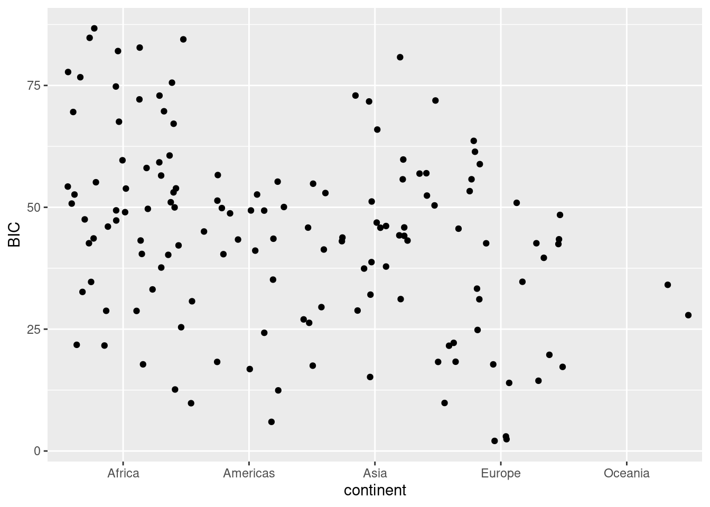

### Mapping

We tasted a little bit about how `map()` function works. Let's dig into it deeper as this family of functions is really useful. For more information, see Rebecca Barter's wonderful tutorial on the `purrr` package. In her words, this is "the tidyverse's answer to apply functions for iteration". `map()` function can take a vector (of any type), a list, and a dataframe for input.


```r
multiply <- function(x) {
  x * x
}

df <- list(
  first_obs = rnorm(7, 1, sd = 1),
  second_obs = rnorm(7, 2, sd = 2)
) # normal distribution
```

**Challenge**

Try `map_df(.x = df, .f = multiply)` and tell me what's the difference between the output you got and what you saw earlier.

If you want to know more about the power and joy of functional programming in R (e.g., `purrr::map()`), then please take ["How to Automate Repeated Things in R"](https://github.com/dlab-berkeley/R-functional-programming) workshop.

## ggplot2 

- The following material is adapted from Kieran Healy's wonderful book (2019) on [data visualization](https://socviz.co/) and Hadley Wickham's equally wonderful book on [ggplot2](https://link.springer.com/content/pdf/10.1007%2F978-0-387-98141-3.pdf). For more theoretical discussions, I recommend you to read [The Grammar of Graphics](https://link.springer.com/book/10.1007%2F0-387-28695-0) by Leland Wilkinson.

- Why should we care data visualization? More precisely, why should we learn the grammar of statistical graphics?
- Sometimes, pictures are better tools than words in 1) exploring, 2) understanding, and 3) explaining data.

### Motivation 

[Anscombe](https://en.wikipedia.org/wiki/Frank_Anscombe)'s quarter comprises four datasets, which are so alike in terms of their descriptive statistics but quite different when presented graphically.


```r
# Set theme 
theme_set(theme_minimal())
```


```r
# Data
anscombe
```

```
##    x1 x2 x3 x4    y1   y2    y3    y4
## 1  10 10 10  8  8.04 9.14  7.46  6.58
## 2   8  8  8  8  6.95 8.14  6.77  5.76
## 3  13 13 13  8  7.58 8.74 12.74  7.71
## 4   9  9  9  8  8.81 8.77  7.11  8.84
## 5  11 11 11  8  8.33 9.26  7.81  8.47
## 6  14 14 14  8  9.96 8.10  8.84  7.04
## 7   6  6  6  8  7.24 6.13  6.08  5.25
## 8   4  4  4 19  4.26 3.10  5.39 12.50
## 9  12 12 12  8 10.84 9.13  8.15  5.56
## 10  7  7  7  8  4.82 7.26  6.42  7.91
## 11  5  5  5  8  5.68 4.74  5.73  6.89
```


```r
# Correlation
cor(anscombe)[c(1:4), c(5:8)]
```

```
##            y1         y2         y3         y4
## x1  0.8164205  0.8162365  0.8162867 -0.3140467
## x2  0.8164205  0.8162365  0.8162867 -0.3140467
## x3  0.8164205  0.8162365  0.8162867 -0.3140467
## x4 -0.5290927 -0.7184365 -0.3446610  0.8165214
```


```r
# gather and select
anscombe_processed <- anscombe %>%
  gather(x_name, x_value, x1:x4) %>%
  gather(y_name, y_value, y1:y4)

# plot
anscombe_processed %>%
  ggplot(aes(x = x_value, y = y_value)) +
  geom_point() +
  geom_smooth(method = lm, se = FALSE) +
  facet_grid(x_name ~ y_name) +
  theme_bw() +
  labs(
    x = "X values",
    y = "Y values",
    title = "Anscombe's quartet"
  )
```

```
## `geom_smooth()` using formula 'y ~ x'
```


### The grammar of graphics 

- the grammar of graphics 

    - data
    - aesthetic attributes (color, shape, size)
    - geometric objects (points, lines, bars)
    - stats (summary stats)
    - scales (map values in the data space)
    - coord (data coordinates)
    - facet (facetting specifications)
    
No worries for new terms. We're going to learn them by actually plotting. 

- Workflow: 

    1. Tidy data 
    2. Mapping 
    3. Geom 
    4. Cor_ordinates and scales 
    5. Labels and guides
    6. Themes
    7. Save files 

### mapping and geom

- `aes` (aesthetic mappings or aesthetics) tells which variables (x, y) in your data should be represented by which visual elements (color, shape, size) in the plot.

- `geom_` tells the type of plot you are going to use 

### basic aes (x , y)


```r
p <- ggplot(
  data = gapminder,
  mapping = aes(x = gdpPercap, y = lifeExp)
) # ggplot or R in general takes positional arguments too. So, you don't need to name data, mapping each time you use ggplot2.

p
```

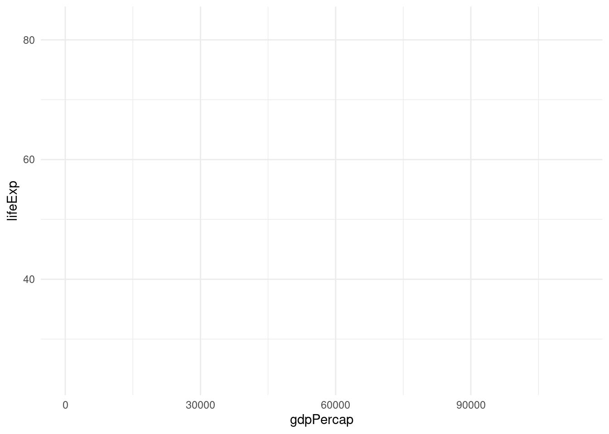

```r
p + geom_point()
```


```r
p + geom_point() + geom_smooth() # geom_smooth has calculated a smoothed line;
```

```
## `geom_smooth()` using method = 'gam' and formula 'y ~ s(x, bs = "cs")'
```


```r
# the shaded area is the standard error for the line
```

### Univariate distribution

- `geom_histogram()`: For the probability distribution of a continuous variable. Bins divide the entire range of values into a series of intervals (see [the Wiki entry](https://en.wikipedia.org/wiki/Histogram)). 
- `geom_density()`: Also for the probability distribution of a continuous variable. It calculates a [kernel density estimate](https://en.wikipedia.org/wiki/Kernel_density_estimation) of the underlying distribution. 

#### Histogram 

```r
data(midwest) # load midwest dataset

midwest
```

```
## # A tibble: 437 x 28
##      PID county state  area poptotal popdensity popwhite popblack popamerindian
##    <int> <chr>  <chr> <dbl>    <int>      <dbl>    <int>    <int>         <int>
##  1   561 ADAMS  IL    0.052    66090      1271.    63917     1702            98
##  2   562 ALEXA… IL    0.014    10626       759      7054     3496            19
##  3   563 BOND   IL    0.022    14991       681.    14477      429            35
##  4   564 BOONE  IL    0.017    30806      1812.    29344      127            46
##  5   565 BROWN  IL    0.018     5836       324.     5264      547            14
##  6   566 BUREAU IL    0.05     35688       714.    35157       50            65
##  7   567 CALHO… IL    0.017     5322       313.     5298        1             8
##  8   568 CARRO… IL    0.027    16805       622.    16519      111            30
##  9   569 CASS   IL    0.024    13437       560.    13384       16             8
## 10   570 CHAMP… IL    0.058   173025      2983.   146506    16559           331
## # … with 427 more rows, and 19 more variables: popasian <int>, popother <int>,
## #   percwhite <dbl>, percblack <dbl>, percamerindan <dbl>, percasian <dbl>,
## #   percother <dbl>, popadults <int>, perchsd <dbl>, percollege <dbl>,
## #   percprof <dbl>, poppovertyknown <int>, percpovertyknown <dbl>,
## #   percbelowpoverty <dbl>, percchildbelowpovert <dbl>, percadultpoverty <dbl>,
## #   percelderlypoverty <dbl>, inmetro <int>, category <chr>
```


```r
midwest %>%
  ggplot(aes(x = area)) +
  geom_point() # not working.
```


```r
midwest %>%
  ggplot(aes(x = area)) +
  geom_histogram() # stat_bin argument picks up 30 bins (or "bucket") by default.
```

```
## `stat_bin()` using `bins = 30`. Pick better value with `binwidth`.
```

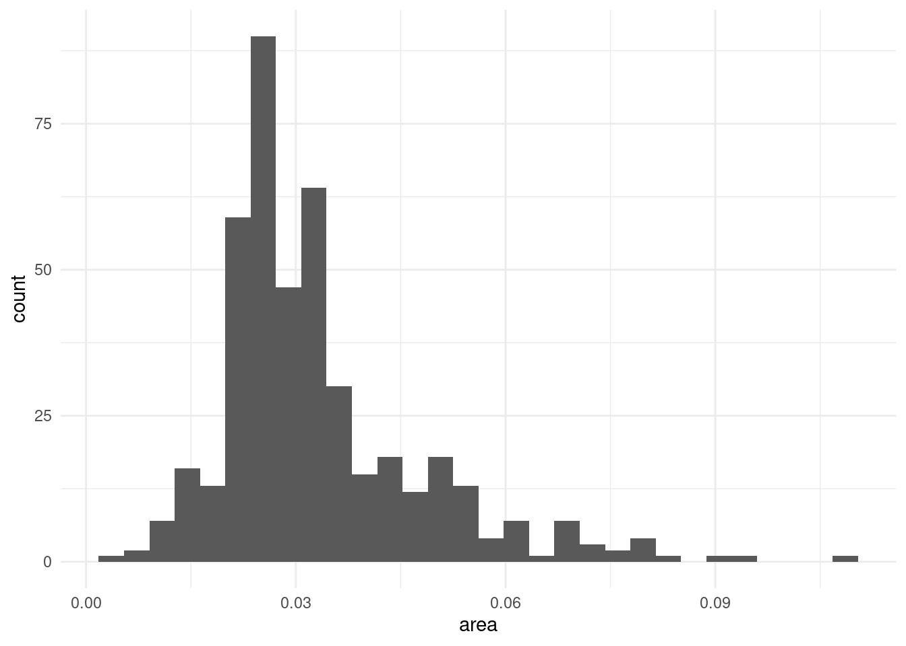

```r
midwest %>%
  ggplot(aes(x = area)) +
  geom_histogram(bins = 10) # only 10 bins.
```

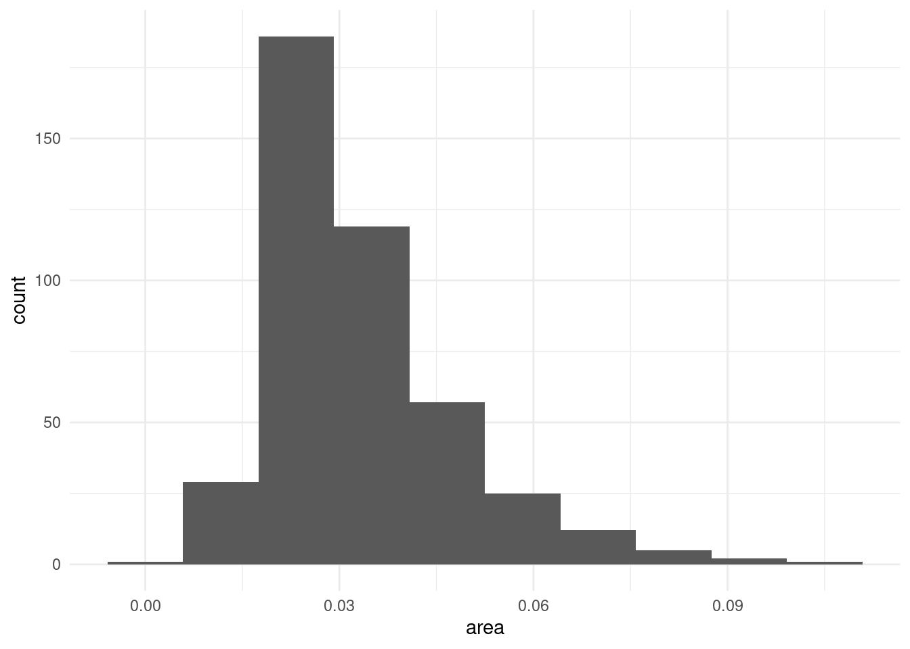

```r
ggplot(
  data = subset(midwest, state %in% c("OH", "IN")),
  mapping = aes(x = percollege, fill = state)
) +
  geom_histogram(alpha = 0.7, bins = 20) +
  scale_fill_viridis_d()
```


#### Density 


```r
midwest %>%
  ggplot(aes(x = area, fill = state, color = state)) +
  geom_density(alpha = 0.3) +
  scale_color_viridis_d() +
  scale_fill_viridis_d()
```

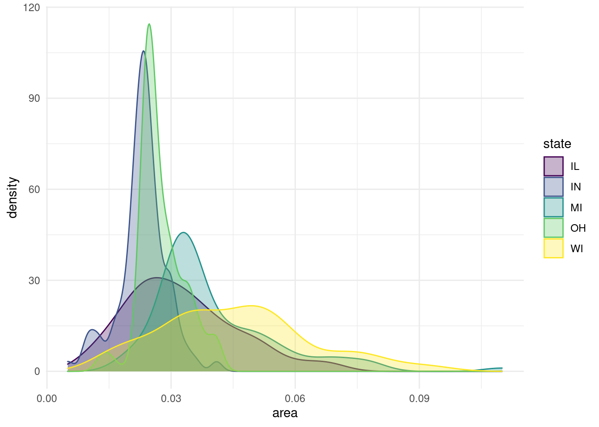

### Advanced aes (size, color)

- There's also fill argument (mostly used in `geom_bar()`). Color `aes` affects the appearance of lines and points, fill is for the filled areas of bars, polygons, and in some cases, the interior of a smoother's standard error ribbon.

- The property size/color/fill represents... 


```r
ggplot(
  data = gapminder,
  mapping = aes(
    x = gdpPercap, y = lifeExp,
    size = pop
  )
) +
  geom_point() 
```

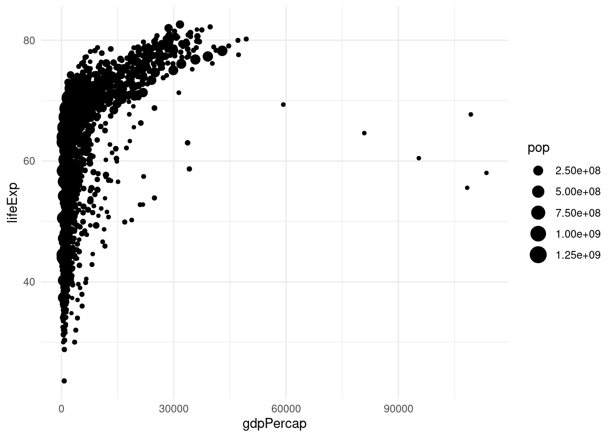


```r
ggplot(
  data = gapminder,
  mapping = aes(
    x = gdpPercap, y = lifeExp,
    size = pop,
    color = continent
  )
) +
  geom_point() +
  scale_color_viridis_d()
```

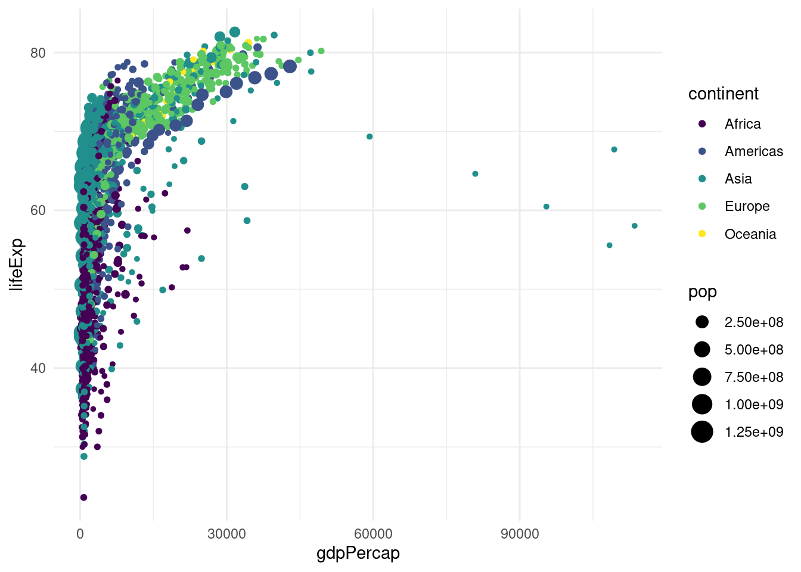


```r
# try red instead of "red"
ggplot(
  data = gapminder,
  mapping = aes(
    x = gdpPercap, y = lifeExp,
    size = pop,
    color = "red"
  )
) +
  geom_point() 
```

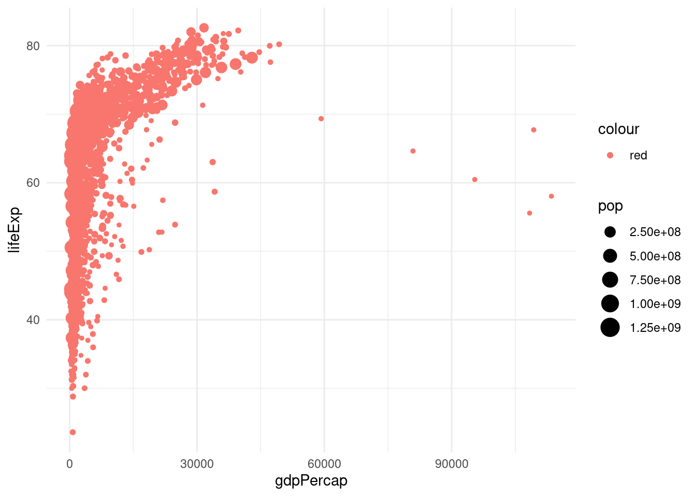

Aesthetics also can be mapped per Geom. 


```r
p + geom_point() +
  geom_smooth()
```

```
## `geom_smooth()` using method = 'gam' and formula 'y ~ s(x, bs = "cs")'
```

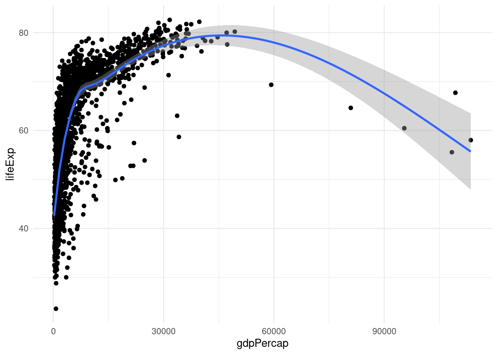

```r
p + geom_point(alpha = 0.3) + # alpha controls transparency
  geom_smooth(color = "red", se = FALSE, size = 2)
```

```
## `geom_smooth()` using method = 'gam' and formula 'y ~ s(x, bs = "cs")'
```

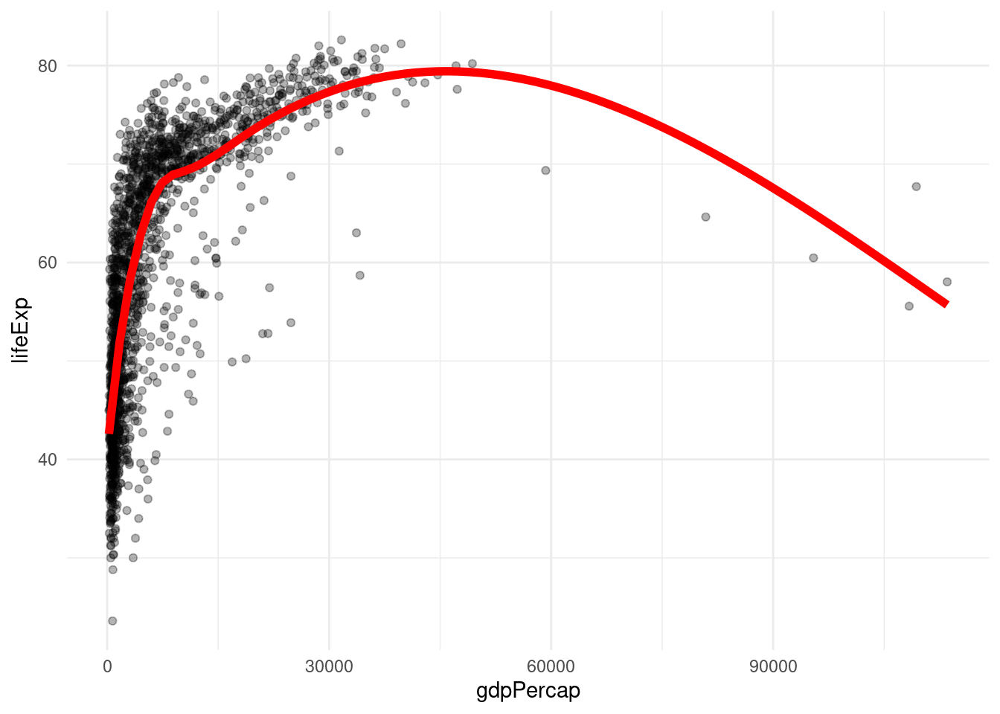

```r
p + geom_point(alpha = 0.3) + # alpha controls transparency
  geom_smooth(color = "red", se = FALSE, size = 2, method = "lm")
```

```
## `geom_smooth()` using formula 'y ~ x'
```

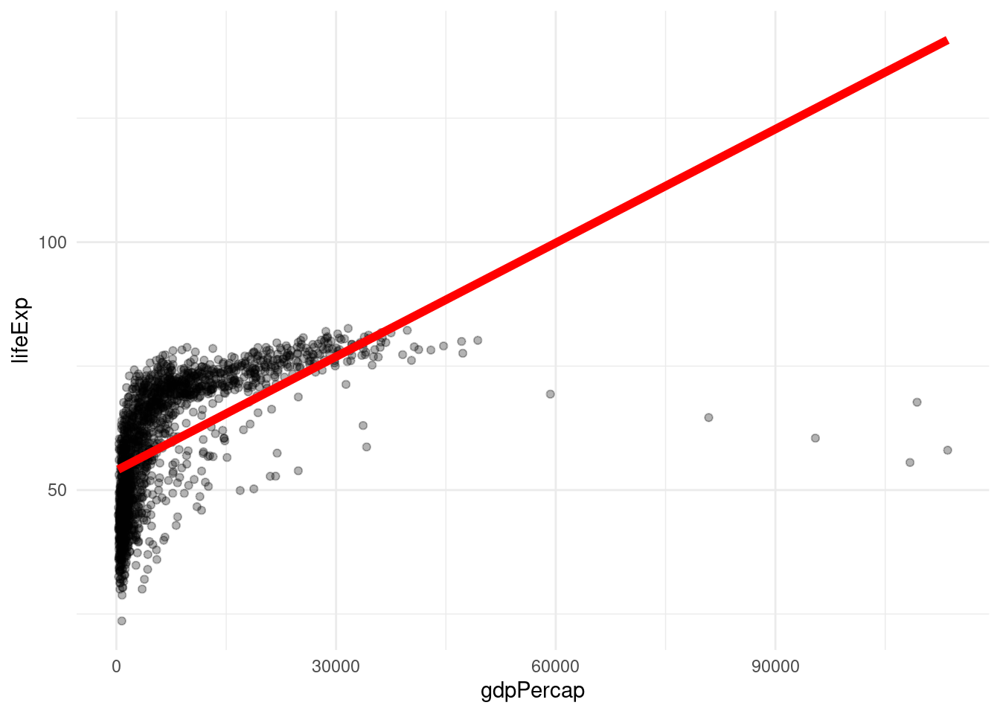


```r
ggplot(
  data = gapminder,
  mapping = aes(
    x = gdpPercap, y = lifeExp,
    color = continent
  )
) +
  geom_point(alpha = 0.3) +
  geom_smooth(method = "loess", color = "red") +
  labs(
    x = "log GDP",
    y = "Life Expectancy",
    title = "A Gapminder Plot",
    subtitle = "Data points are country-years",
    caption = "Source: Gapminder"
  )
```

```
## `geom_smooth()` using formula 'y ~ x'
```

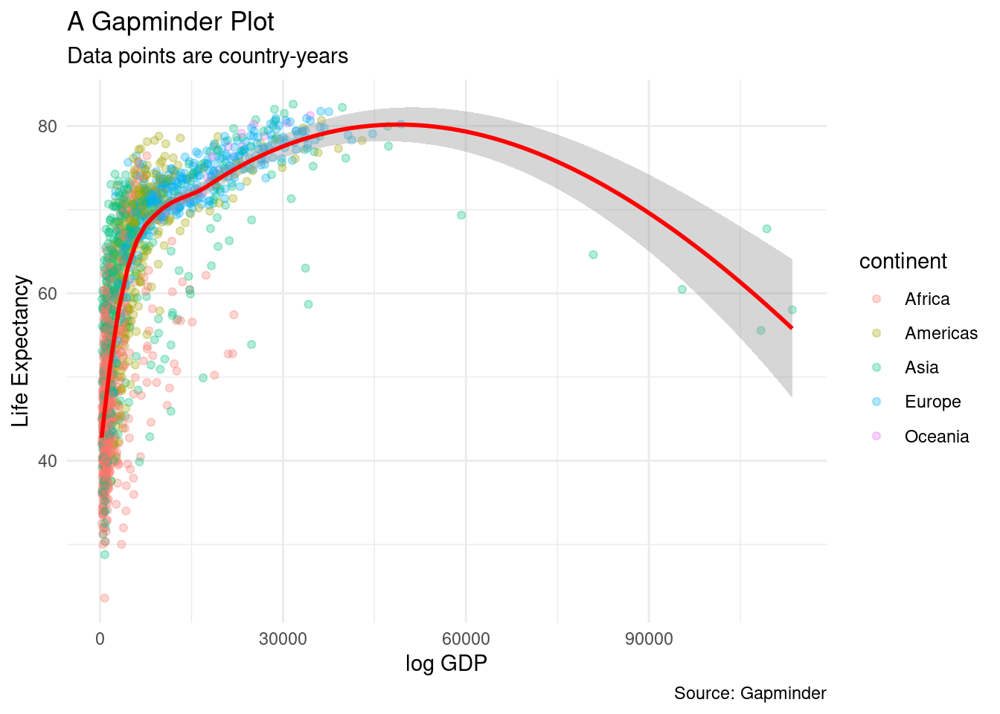

```r
ggplot(
  data = gapminder,
  mapping = aes(
    x = gdpPercap, y = lifeExp,
    color = continent,
    fill = continent
  )
) +
  geom_point(alpha = 0.3) +
  geom_smooth(method = "loess", color = "red") +
  labs(
    x = "log GDP",
    y = "Life Expectancy",
    title = "A Gapminder Plot",
    subtitle = "Data points are country-years",
    caption = "Source: Gapminder"
  ) +
  scale_color_viridis_d() +
  scale_fill_viridis_d()
```

```
## `geom_smooth()` using formula 'y ~ x'
```

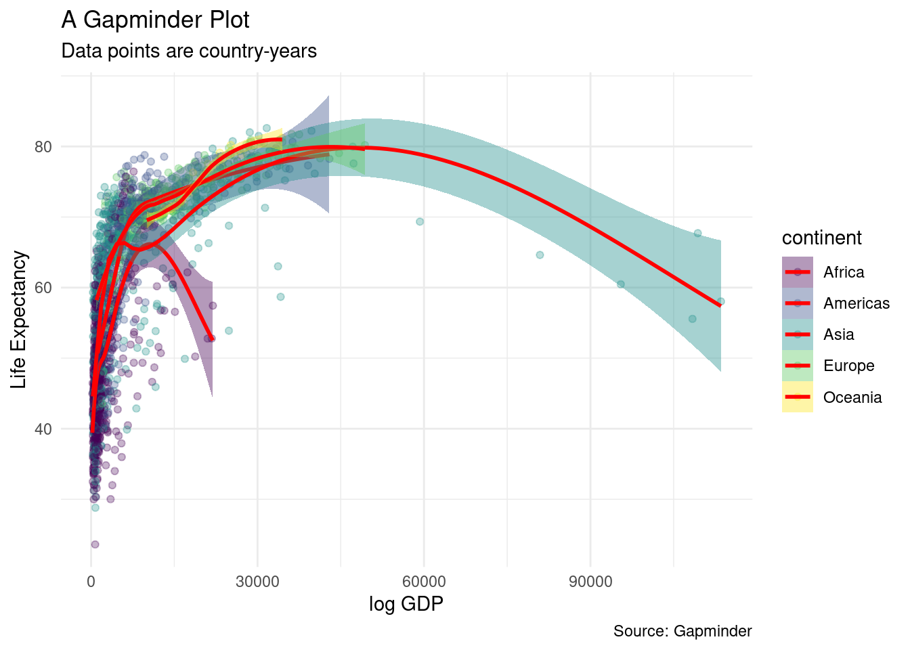

### Co-ordinates and scales 


```r
p + geom_point() +
  coord_flip() # coord_type
```

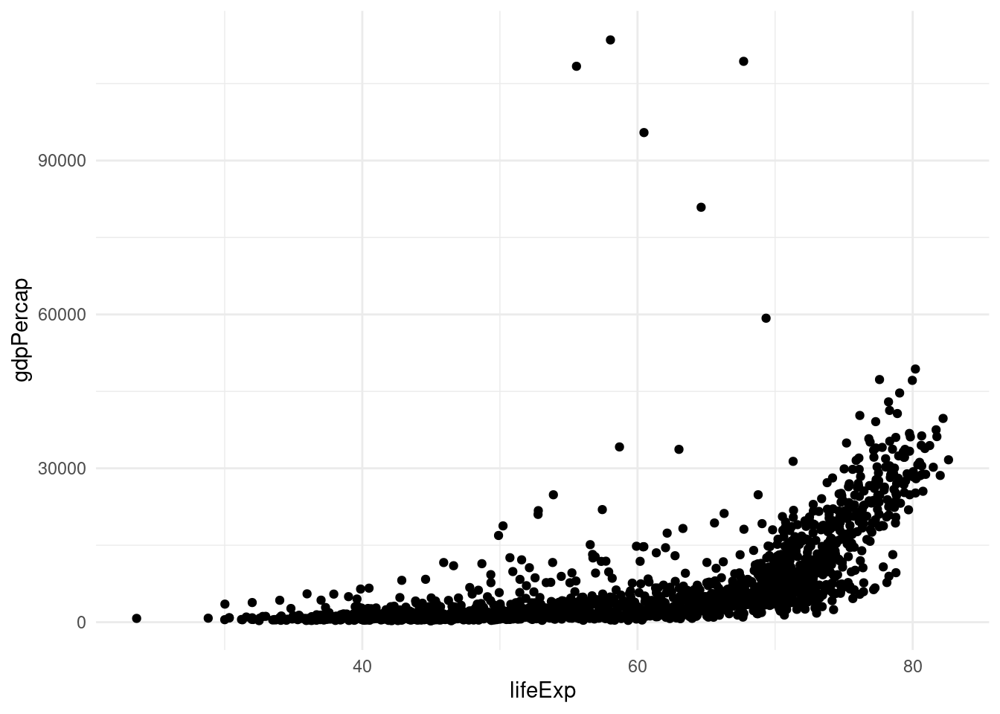

The data is heavily bunched up against the left side. 

```r
p + geom_point() # without scaling
```


```r
p + geom_point() +
  scale_x_log10() # scales the axis of a plot to a log 10 basis
```

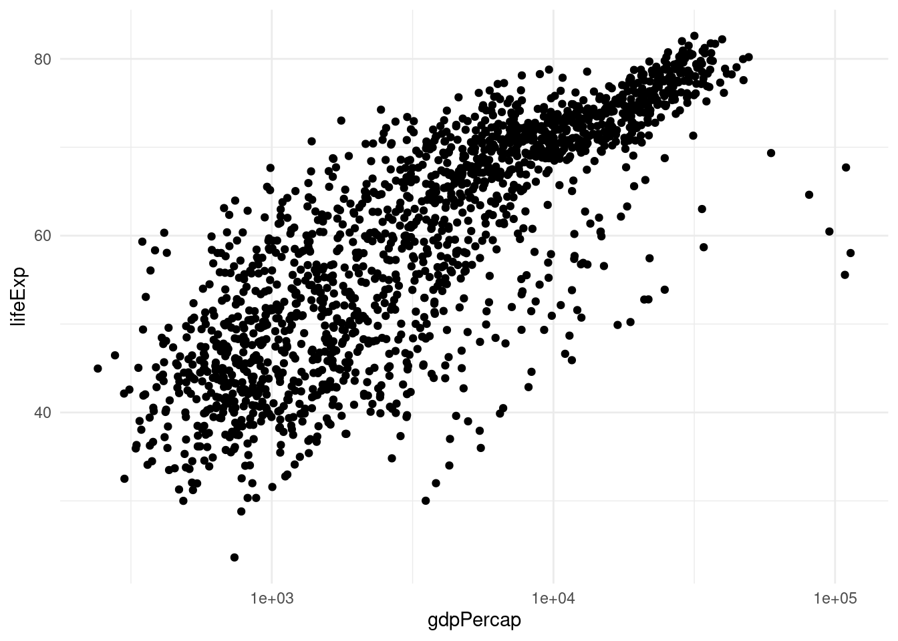

```r
p + geom_point() +
  geom_smooth(method = "lm") +
  scale_x_log10()
```

```
## `geom_smooth()` using formula 'y ~ x'
```

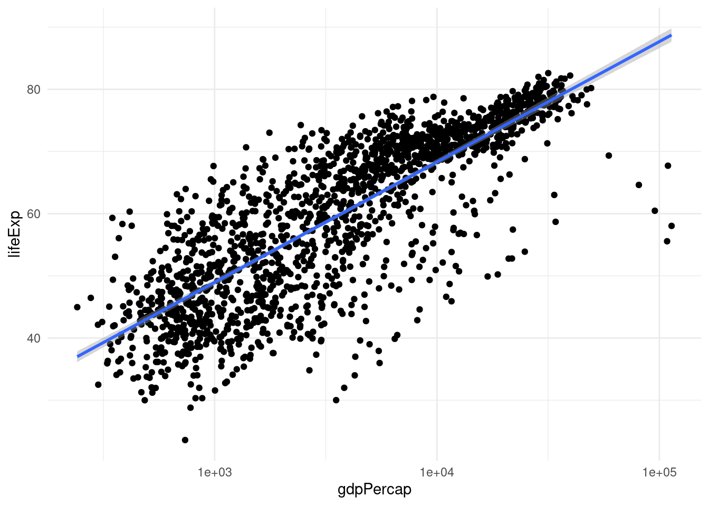


### Labels and guides 

`scales` package has some useful premade formatting functions. You can either load scales or just grab the function you need from the library using `scales::` 


```r
p + geom_point(alpha = 0.3) +
  geom_smooth(method = "loess", color = "red") +
  scale_x_log10(labels = scales::dollar) +
  labs(
    x = "log GDP",
    y = "Life Expectancy",
    title = "A Gapminder Plot",
    subtitle = "Data points are country-years",
    caption = "Source: Gapminder"
  )
```

```
## `geom_smooth()` using formula 'y ~ x'
```

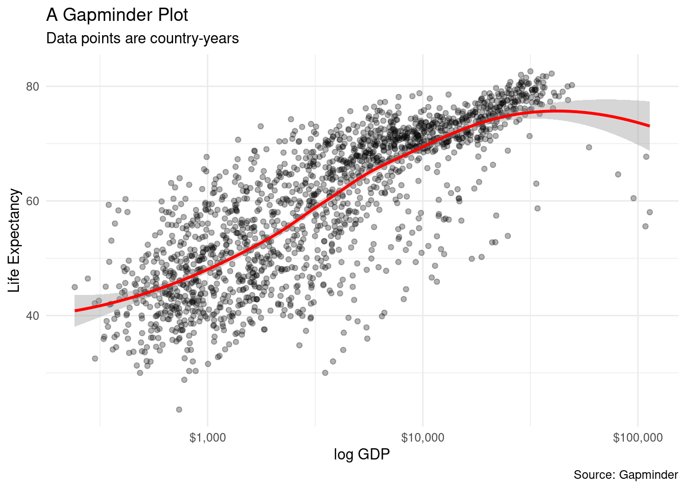

6. Themes

```r
p + geom_point(alpha = 0.3) +
  geom_smooth(method = "loess", color = "red") +
  scale_x_log10(labels = scales::dollar) +
  labs(
    x = "log GDP",
    y = "Life Expectancy",
    title = "A Gapminder Plot",
    subtitle = "Data points are country-years",
    caption = "Source: Gapminder"
  ) +
  theme_economist()
```

```
## `geom_smooth()` using formula 'y ~ x'
```

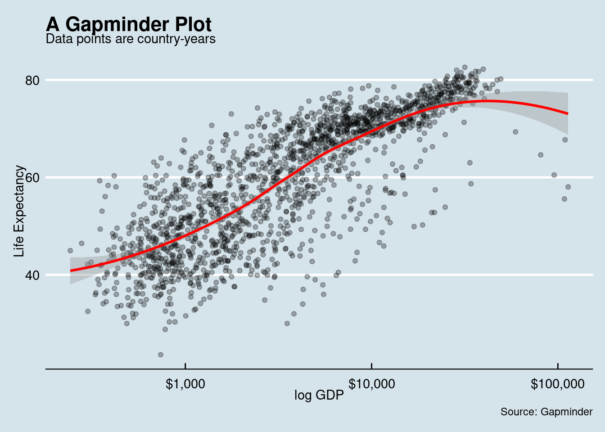

### ggsave 


```r
figure_example <- p + geom_point(alpha = 0.3) +
  geom_smooth(method = "gam", color = "red") +
  scale_x_log10(labels = scales::dollar) +
  labs(
    x = "log GDP",
    y = "Life Expectancy",
    title = "A Gapminder Plot",
    subtitle = "Data points are country-years",
    caption = "Source: Gapminder"
  ) +
  theme_economist()

ggsave(figure_example, here("outputs", "figure_example.png"))
```

### Many plots 

Basic ideas:

- Grouping: tell `ggplot2` about the structure of your data 
- Facetting: break up your data into pieces for a plot 

#### Grouping

- Can you guess what's wrong?


```r
p <- ggplot(gapminder, aes(x = year, y = gdpPercap))

p + geom_point()
```


```r
p + geom_line()
```

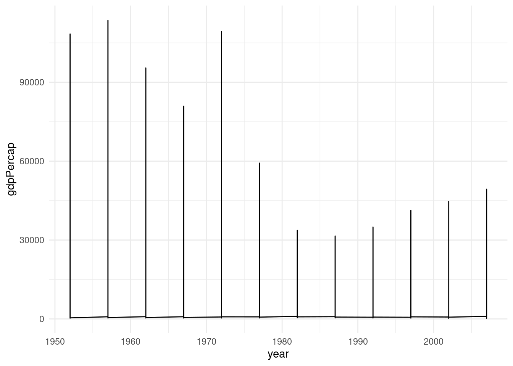

`geom_line` joins up all the lines for each particular year in the order they appear in the dataset. `ggplot2` does not know the yearly observations in your data are grouped by country. 

Note that you need grouping when the grouping information you need to tell is not built into the varaibles being mapped (like continent).


```r
gapminder
```

```
## # A tibble: 1,704 x 6
##    country     continent  year lifeExp      pop gdpPercap
##    <fct>       <fct>     <int>   <dbl>    <int>     <dbl>
##  1 Afghanistan Asia       1952    28.8  8425333      779.
##  2 Afghanistan Asia       1957    30.3  9240934      821.
##  3 Afghanistan Asia       1962    32.0 10267083      853.
##  4 Afghanistan Asia       1967    34.0 11537966      836.
##  5 Afghanistan Asia       1972    36.1 13079460      740.
##  6 Afghanistan Asia       1977    38.4 14880372      786.
##  7 Afghanistan Asia       1982    39.9 12881816      978.
##  8 Afghanistan Asia       1987    40.8 13867957      852.
##  9 Afghanistan Asia       1992    41.7 16317921      649.
## 10 Afghanistan Asia       1997    41.8 22227415      635.
## # … with 1,694 more rows
```

#### Facetting 

Facetting is to make small multiples. 

- `facet_wrap`: based on a single categorical variable like `facet_wrap(~single_categorical_variable)`. Your panels will be laid out in order and then wrapped into a grid.

- `facet_grid`: when you want to cross-classify some data by two categorical variables like `facet_grid(one_cat_variable ~ two_cat_variable)`. 


```r
p <- ggplot(gapminder, aes(x = year, y = gdpPercap))

p + geom_line(aes(group = country)) # group by, # The outlier is Kuwait.
```


```r
p + geom_line(aes(group = country)) + facet_wrap(~continent) # facetting
```

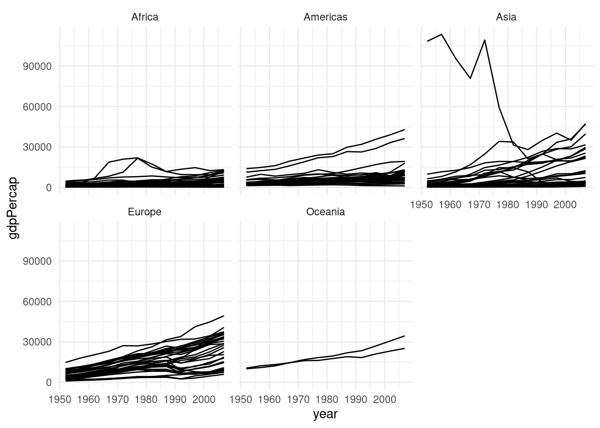

```r
p + geom_line(aes(group = country), color = "gray70") +
  geom_smooth(size = 1.1, method = "loess", se = FALSE) +
  scale_y_log10(labels = scales::dollar) +
  facet_wrap(~continent, ncol = 5) + # for single categorical variable; for multiple categorical variables use facet_grid()
  labs(
    x = "Year",
    y = "GDP per capita",
    title = "GDP per capita on Five continents"
  ) +
  theme(axis.text.x = element_text(angle = 90, hjust = 1))
```

```
## `geom_smooth()` using formula 'y ~ x'
```

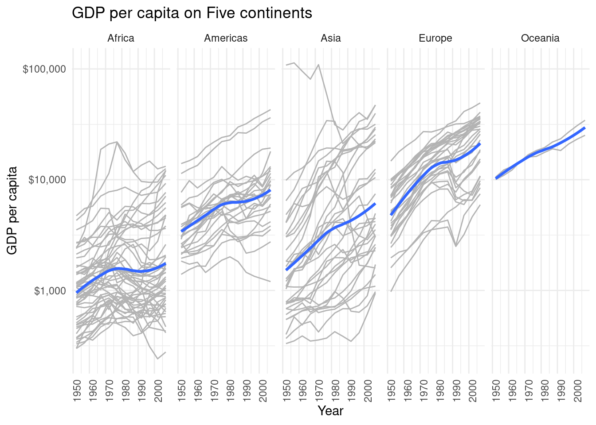


```r
p + geom_line(aes(group = country), color = "gray70") +
  geom_smooth(size = 1.1, method = "loess", se = FALSE) +
  scale_y_log10(labels = scales::dollar) +
  facet_grid(~continent) + # for single categorical variable; for multiple categorical variables use facet_grid()
  labs(
    x = "Year",
    y = "GDP per capita",
    title = "GDP per capita on Five continents"
  ) +
  theme(axis.text.x = element_text(angle = 90, hjust = 1))
```

```
## `geom_smooth()` using formula 'y ~ x'
```


### Transforming

- Transforming: perform some calculations on or summarize your data before producing the plot 

#### Use pipes to summarize data

Also, we experiment bar charts here. By default, `geom_bar` [uses](https://www.rdocumentation.org/packages/ggplot2/versions/1.0.1/topics/geom_bar) stat = "bins", which makes the height of each bar equal to the number of cases in each group. If you have a y column, then you should use `stat = "identity"` argument. Alternatively, you can use `geom_col()`.


```r
gapminder_formatted <- gapminder %>%
  group_by(continent, year) %>%
  summarize(
    gdp_mean = mean(gdpPercap),
    lifeExp_mean = mean(lifeExp)
  )
```

```
## `summarise()` regrouping output by 'continent' (override with `.groups` argument)
```

```r
ggplot(data = gapminder_formatted, aes(x = year, y = lifeExp_mean, color = continent)) +
  geom_point() +
  labs(
    x = "Year",
    y = "Life expectancy",
    title = "Life expectancy on Five continents"
  )
```

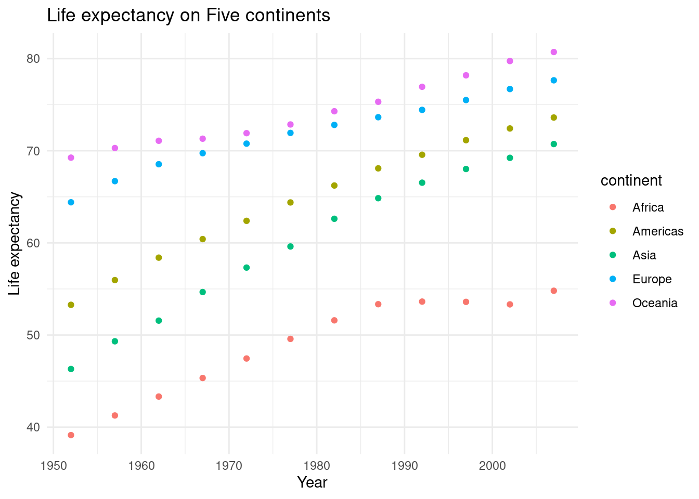

```r
gapminder %>%
  filter(continent == "Europe") %>%
  group_by(country, year) %>%
  summarize(
    gdp_mean = mean(gdpPercap),
    lifeExp_mean = mean(lifeExp)
  ) %>%
  ggplot(aes(x = year, y = lifeExp_mean, color = country)) +
  geom_point() +
  labs(
    x = "Year",
    y = "Life expectancy",
    title = "Life expectancy in Europe"
  )
```

```
## `summarise()` regrouping output by 'country' (override with `.groups` argument)
```

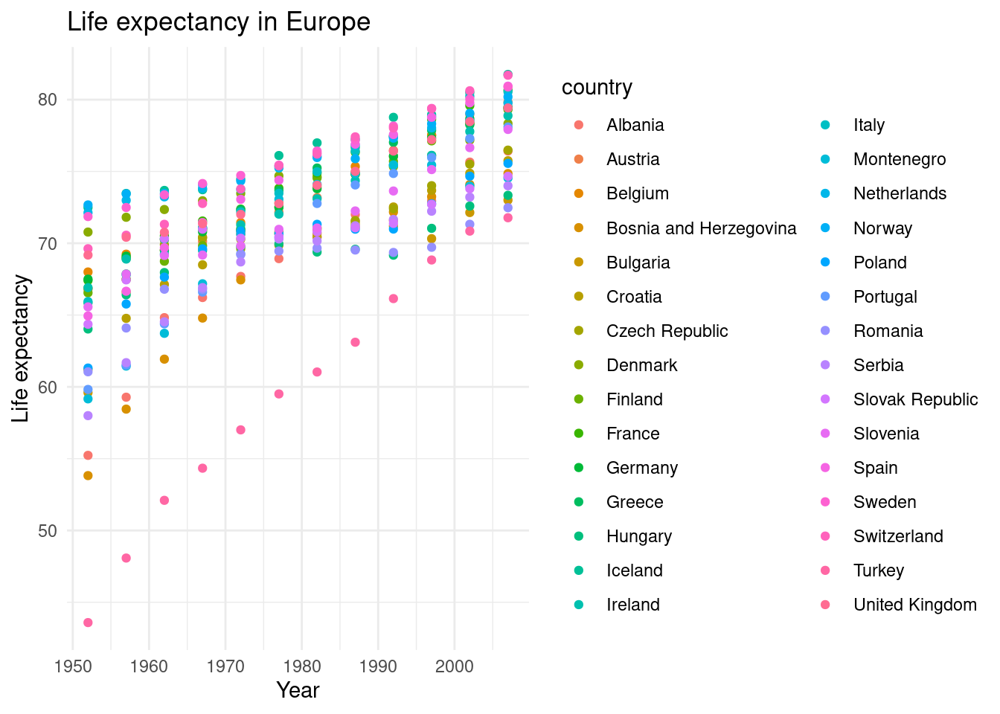


```r
# geom point
gapminder %>%
  filter(continent == "Europe") %>%
  group_by(country, year) %>%
  summarize(
    gdp_mean = mean(gdpPercap),
    lifeExp_mean = mean(lifeExp)
  ) %>%
  ggplot(aes(x = year, y = lifeExp_mean)) +
  geom_point() +
  labs(
    x = "Year",
    y = "Life expectancy",
    title = "Life expectancy in Europe"
  ) +
  facet_wrap(~country)
```

```
## `summarise()` regrouping output by 'country' (override with `.groups` argument)
```

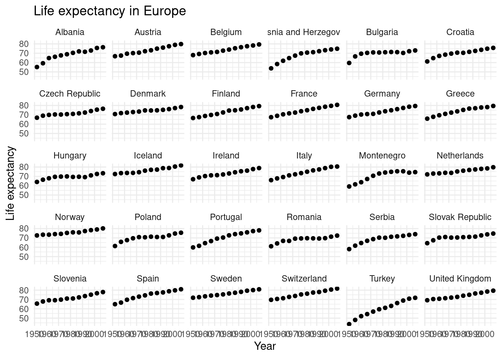

```r
# geom bar
gapminder %>%
  filter(continent == "Europe") %>%
  group_by(country, year) %>%
  summarize(
    gdp_mean = mean(gdpPercap),
    lifeExp_mean = mean(lifeExp)
  ) %>%
  ggplot(aes(x = year, y = lifeExp_mean)) +
  geom_bar(stat = "identity") +
  labs(
    x = "Year",
    y = "Life expectancy",
    title = "Life expectancy in Europe"
  ) +
  facet_wrap(~country)
```

```
## `summarise()` regrouping output by 'country' (override with `.groups` argument)
```

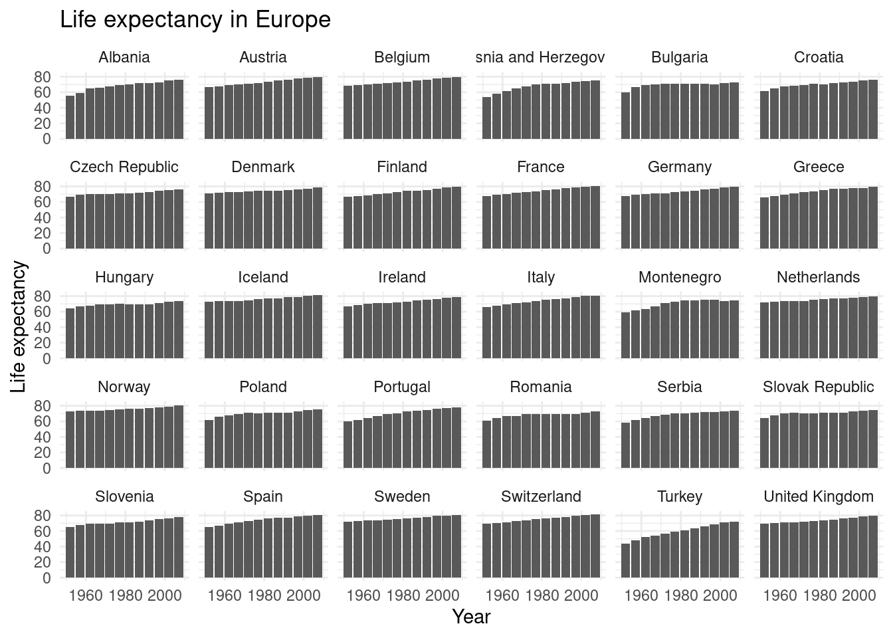

```r
# no facet
gapminder %>%
  filter(continent == "Europe") %>%
  group_by(country, year) %>%
  summarize(
    gdp_mean = mean(gdpPercap),
    lifeExp_mean = mean(lifeExp)
  ) %>%
  ggplot(aes(x = year, y = lifeExp_mean, fill = country)) +
  geom_bar(stat = "identity") + # even if you not stack, still the plot looks messy or you can use geom_col()
  labs(
    x = "Year",
    y = "Life expectancy",
    title = "Life expectancy in Europe"
  )
```

```
## `summarise()` regrouping output by 'country' (override with `.groups` argument)
```

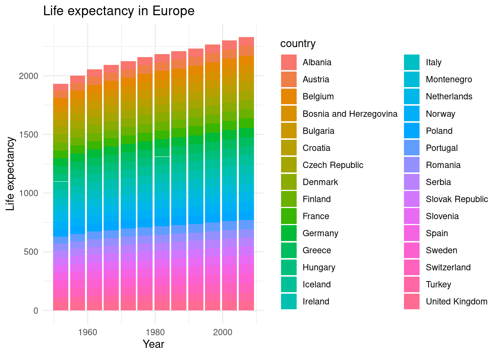


```r
gapminder %>%
  filter(continent == "Europe") %>%
  group_by(country, year) %>%
  summarize(
    gdp_mean = mean(gdpPercap),
    lifeExp_mean = mean(lifeExp)
  ) %>%
  ggplot(aes(x = country, y = lifeExp_mean)) +
  geom_boxplot() +
  labs(
    x = "Country",
    y = "Life expectancy",
    title = "Life expectancy in Europe"
  ) +
  coord_flip()
```

```
## `summarise()` regrouping output by 'country' (override with `.groups` argument)
```

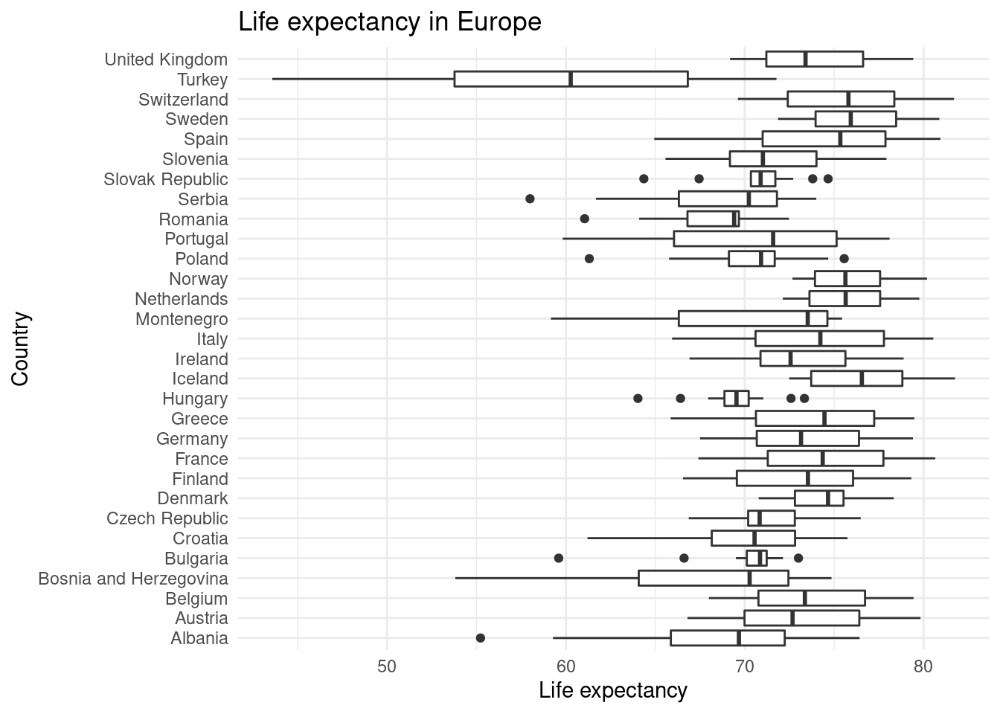


```r
# without ordering
gapminder %>%
  filter(continent == "Europe") %>%
  group_by(country, year) %>%
  summarize(
    gdp_mean = mean(gdpPercap),
    lifeExp_mean = mean(lifeExp)
  ) %>%
  ggplot(aes(x = reorder(country, lifeExp_mean), y = lifeExp_mean)) +
  geom_boxplot() +
  labs(
    x = "Country",
    y = "Life expectancy",
    title = "Life expectancy in Europe"
  ) +
  coord_flip()
```

```
## `summarise()` regrouping output by 'country' (override with `.groups` argument)
```

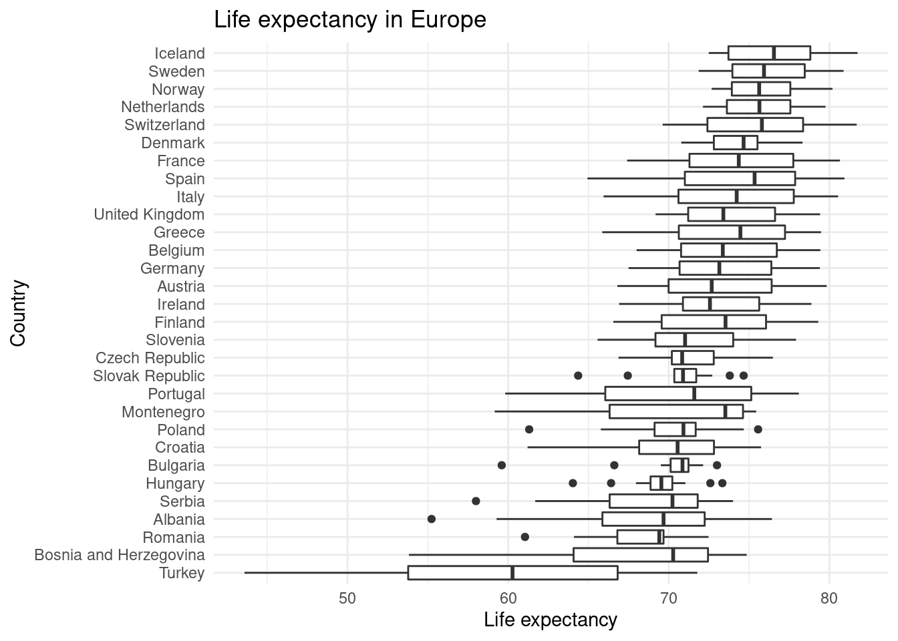

```r
# reorder
gapminder %>%
  filter(continent == "Europe") %>%
  group_by(country, year) %>%
  summarize(
    gdp_mean = mean(gdpPercap),
    lifeExp_mean = mean(lifeExp)
  ) %>%
  ggplot(aes(x = reorder(country, -lifeExp_mean), y = lifeExp_mean)) +
  geom_boxplot() +
  labs(
    x = "Country",
    y = "Life expectancy",
    title = "Life expectancy in Europe"
  ) +
  coord_flip()
```

```
## `summarise()` regrouping output by 'country' (override with `.groups` argument)
```


#### Plotting text


```r
gapminder %>%
  filter(continent == "Asia" | continent == "Americas") %>%
  group_by(continent, country) %>%
  summarize(
    gdp_mean = mean(gdpPercap),
    lifeExp_mean = mean(lifeExp)
  ) %>%
  ggplot(aes(x = gdp_mean, y = lifeExp_mean)) +
  geom_point() +
  geom_text(aes(label = country)) +
  scale_x_log10() +
  facet_grid(~continent)
```

```
## `summarise()` regrouping output by 'continent' (override with `.groups` argument)
```

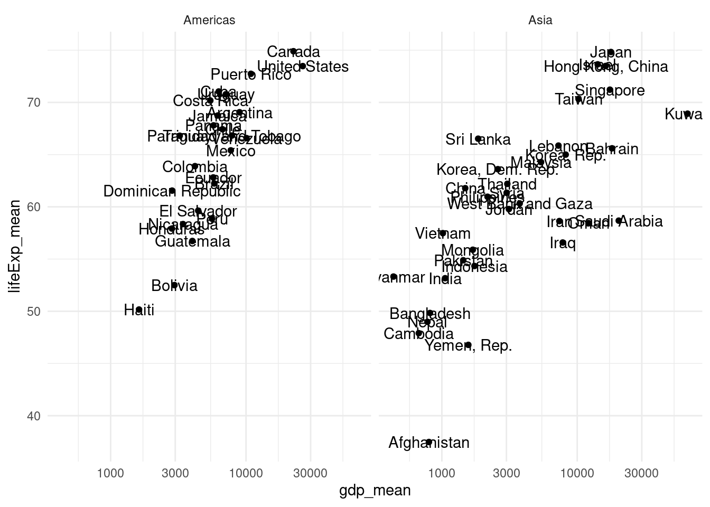


```r
# with label
gapminder %>%
  filter(continent == "Asia" | continent == "Americas") %>%
  group_by(continent, country) %>%
  summarize(
    gdp_mean = mean(gdpPercap),
    lifeExp_mean = mean(lifeExp)
  ) %>%
  ggplot(aes(x = gdp_mean, y = lifeExp_mean)) +
  geom_point() +
  geom_label(aes(label = country)) +
  scale_x_log10() +
  facet_grid(~continent)
```

```
## `summarise()` regrouping output by 'continent' (override with `.groups` argument)
```

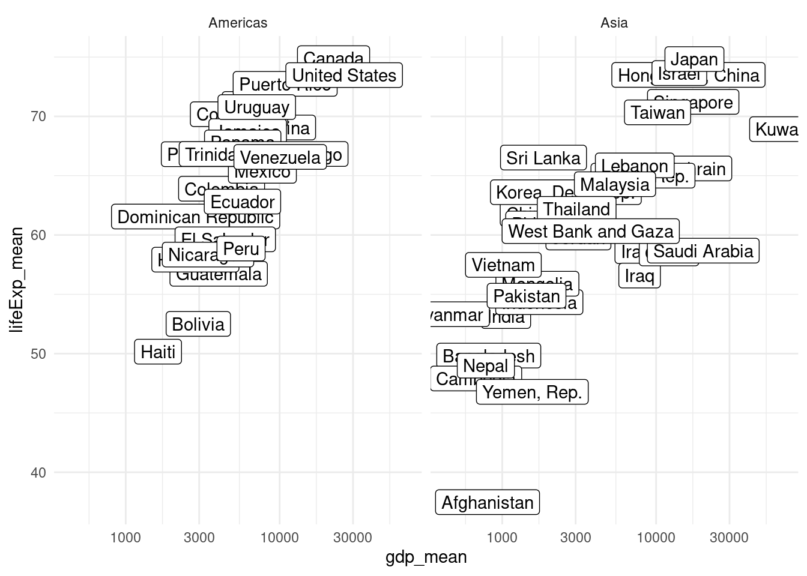


```r
# no overlaps
gapminder %>%
  filter(continent == "Asia" | continent == "Americas") %>%
  group_by(continent, country) %>%
  summarize(
    gdp_mean = mean(gdpPercap),
    lifeExp_mean = mean(lifeExp)
  ) %>%
  ggplot(aes(x = gdp_mean, y = lifeExp_mean)) +
  geom_point() +
  geom_text_repel(aes(label = country)) + # there's also geom_label_repel
  scale_x_log10() +
  facet_grid(~continent)
```

```
## `summarise()` regrouping output by 'continent' (override with `.groups` argument)
```

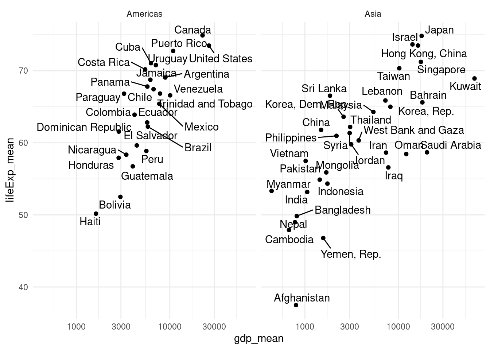

### Ploting models 

In plotting models, we extensively use David Robinson's [broom package](https://cran.r-project.org/web/packages/broom/vignettes/broom.html) in R. The idea is to transform model outputs (i.e., predictions and estimations) into tidy objects so that we can easily combine, separate, and visualize these elements. 

#### Plotting several fits at the same time

```r
model_colors <- RColorBrewer::brewer.pal(3, "Set1") # select three qualitatively different colors from a larger palette.

gapminder %>%
  ggplot(aes(x = log(gdpPercap), y = lifeExp)) +
  geom_point(alpha = 0.2) +
  geom_smooth(method = "lm", aes(color = "OLS", fill = "OLS")) +
  geom_smooth(
    method = "lm", formula = y ~ splines::bs(x, df = 3),
    aes(color = "Cubic Spline", fill = "Cubic Spline")
  ) +
  geom_smooth(method = "loess", aes(color = "LOESS", fill = "LOESS")) +
  theme(legend.position = "top") +
  scale_color_manual(name = "Models", values = model_colors) +
  scale_fill_manual(name = "Models", values = model_colors)
```

```
## `geom_smooth()` using formula 'y ~ x'
## `geom_smooth()` using formula 'y ~ x'
```

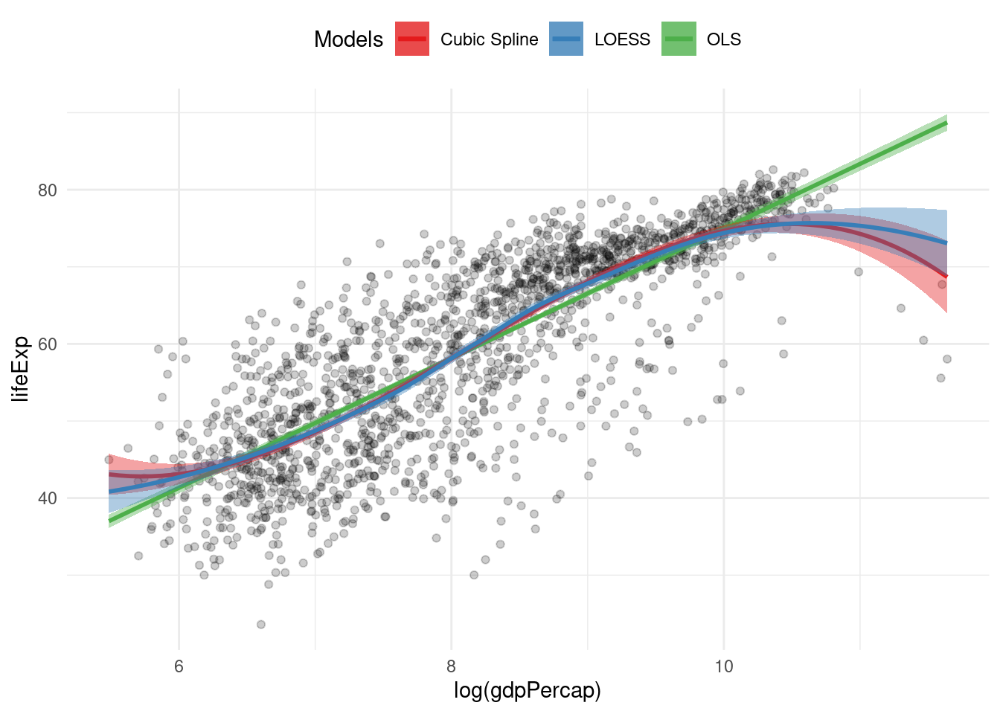

#### Extracting model outcomes 

```r
# regression model
out <- lm(
  formula = lifeExp ~ gdpPercap + pop + continent,
  data = gapminder
)
```

`tidy()` is a method in the `broom` package. It "constructs a dataframe that summarizes the model's statistical findings". As the description states, tidy is a function that can be used for various models. For instance, a tidy can extract following information from a regression model.

- `Term`: a term being estimated 
- `p.value`
- `statistic`: a test statistic used to compute p-value
- `estimate` 
- `conf.low`: the low end of a confidence interval 
- `conf.high`: the high end of a confidence interval
- `df`: degrees of freedom

**Challege**

Try glance(out), what did you get from these commands? If you're curious, you can try ?glance.

The followings are to show your degree of confidence.

##### Coeffficients

```r
# estimates
out_comp <- tidy(out)

p <- out_comp %>%
  ggplot(aes(x = term, y = estimate))

p + geom_point() +
  coord_flip() +
  theme_bw()
```


##### Confidence intervals


```r
# plus confidence intervals
out_conf <- tidy(out, conf.int = TRUE)

# plotting coefficients using ggplot2 (pointrange)
out_conf %>%
  ggplot(aes(x = reorder(term, estimate), y = estimate, ymin = conf.low, ymax = conf.high)) +
  geom_pointrange() +
  coord_flip() +
  labs(x = "", y = "OLS Estimate") +
  theme_bw()
```

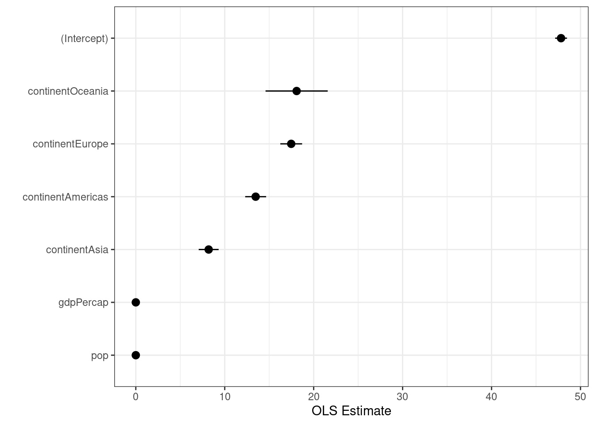

```r
# another way to do it (errorbar)
out_conf %>%
  ggplot(aes(x = estimate, y = reorder(term, estimate))) +
  geom_point() +
  geom_errorbarh(aes(xmin = conf.low, xmax = conf.high)) +
  labs(y = "", x = "OLS Estimate") +
  theme_bw()
```

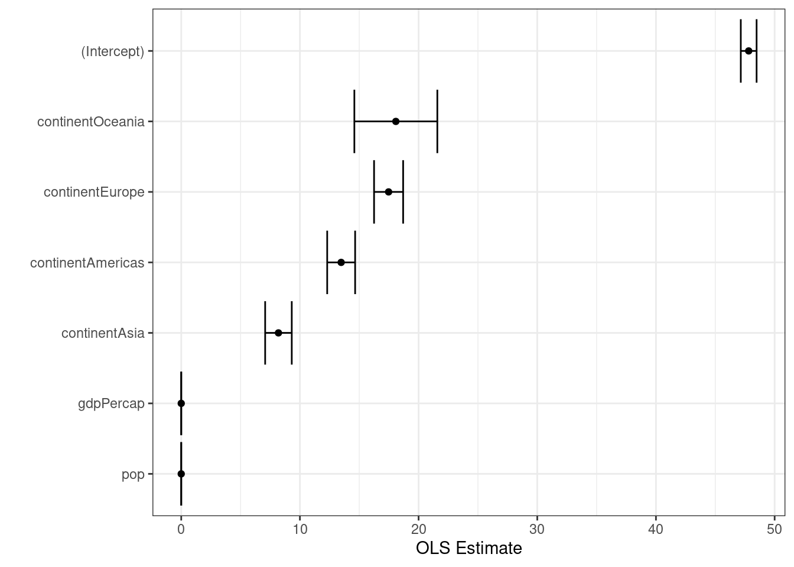

You can calculate marginal effects using `margins` package. For the sake of time, I'm not covering that here.
