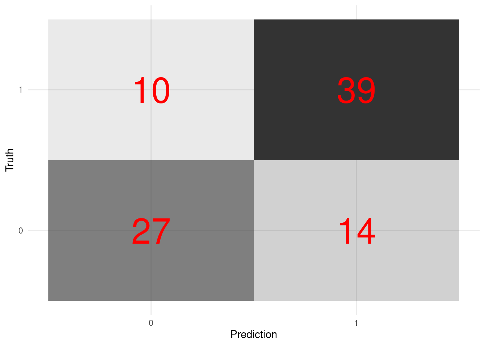

# High-dimensional data {#machine_learning}


## Overview 

- The rise of high-dimensional data. The new data frontiers in social sciences---text ([Gentzkow et al. 2019](https://web.stanford.edu/~gentzkow/research/text-as-data.pdf); [Grimmer and Stewart 2013](https://www.jstor.org/stable/pdf/24572662.pdf?casa_token=SQdSI4R_VdwAAAAA:4QiVLhCXqr9f0qNMM9U75EL5JbDxxnXxUxyIfDf0U8ZzQx9szc0xVqaU6DXG4nHyZiNkvcwGlgD6H0Lxj3y0ULHwgkf1MZt8-9TPVtkEH9I4AHgbTg)) and and image ([Joo and Steinert-Threlkeld 2018](https://arxiv.org/pdf/1810.01544))---are all high-dimensional data. 

    - 1000 common English words for 30-word tweets: $1000^{30}$ similar to N of atoms in the universe ([Gentzkow et al. 2019](https://web.stanford.edu/~gentzkow/research/text-as-data.pdf))

    - Belloni, Alexandre, Victor Chernozhukov, and Christian Hansen. ["High-dimensional methods and inference on structural and treatment effects."](https://pubs.aeaweb.org/doi/pdfplus/10.1257/jep.28.2.29) *Journal of Economic Perspectives 28*, no. 2 (2014): 29-50.

- The rise of new approach: statistics + computer science = machine learning 

- Statistical inference 

    - $y$ <- some probability models (e.g., linear regression, logistic regression) <- $x$
       
    - $y$ = $X\beta$ + $\epsilon$
        
    - The goal is to estimate $\beta$

- Machine learning 

    - $y$ <- unknown <- $x$ 
    
    - $y$ <-> decision trees, neutral nets <-> $x$
        
    - For the main idea behind prediction modeling, see Breiman, Leo (Berkeley stat faculty who passed away in 2005). ["Statistical modeling: The two cultures (with comments and a rejoinder by the author)."](https://projecteuclid.org/euclid.ss/1009213726) *Statistical science* 16, no. 3 (2001): 199-231.
    
    - "The problem is to find an algorithm $f(x)$ such that for future $x$ in a test set, $f(x)$ will be a good predictor of $y$."
    
    - "There are **two cultures** in the use of statistical modeling to reach conclusions from data. One assumes that the data are generated by a **given** **stochastic data model**. The other uses **algorithmic models** and treats the data mechanism as **unknown**."


- How ML differs from econometrics? 

- A review by Athey, Susan, and Guido W. Imbens. ["Machine learning methods that economists should know about."](https://www.annualreviews.org/doi/full/10.1146/annurev-economics-080217-053433) *Annual Review of Economics* 11 (2019): 685-725.
        
- Stat:
  
    - Specifying a target (i.e., an estimand)

    - Fitting a model to data using an objective function (e.g., the sum of squared errors)

    - Reporting point estimates (effect size) and standard errors (uncertainty)

    - Validation by yes-no using goodness-of-fit tests and residual examination

- ML: 

    - Developing algorithms (estimating *f(x)*)

    - Prediction power not structural/causal parameters

    - Basically, high-dimensional data statistics (N < P)

    - The major problem is to avoid ["the curse of dimensionality"](https://en.wikipedia.org/wiki/Curse_of_dimensionality) ([too many features - > overfitting](https://towardsdatascience.com/the-curse-of-dimensionality-50dc6e49aa1e))

    - Validation: out-of-sample comparisons (cross-validation) not in-sample goodness-of-fit measures

    - So, it's curve-fitting but the primary focus is unseen (test data) not seen data (training data)

- A quick review on ML lingos for those trained in econometrics 

    - Sample to estimate parameters = Training sample
  
    - Estimating the model = Being trained 
    - Regressors, covariates, or predictors = Features 
  
    - Regression parameters = weights 
  
    - Prediction problems = Supervised (some $y$ are known) + Unsupervised ($y$ unknown)
    
. Many images in this chapter come from vas3k blog.](https://i.vas3k.ru/7w9.jpg)

](https://i.vas3k.ru/7vz.jpg)

](https://i.vas3k.ru/7vx.jpg)

](https://i.vas3k.ru/7w1.jpg)

## Dataset  

- [Heart disease data from UCI](https://archive.ics.uci.edu/ml/datasets/heart+Disease)

- One of the popular datasets used in machine learning competitions 


```r
# Load packages 

## CRAN packages 
pacman::p_load(here,
               tidyverse, 
               tidymodels,
               doParallel, # parallel processing 
               patchwork, # arranging ggplots
               ck37r, 
               SuperLearner, 
               vip, 
               tidymodels)

## Jae's custom functions 
source(here("functions", "ml_utils.r"))

# Import the dataset 

data_original <- read_csv(here("data", "heart.csv"))
```

```
## 
## ── Column specification ─────────────────────────────────────────────────────────────────────────────────────────────
## cols(
##   age = col_double(),
##   sex = col_double(),
##   cp = col_double(),
##   trestbps = col_double(),
##   chol = col_double(),
##   fbs = col_double(),
##   restecg = col_double(),
##   thalach = col_double(),
##   exang = col_double(),
##   oldpeak = col_double(),
##   slope = col_double(),
##   ca = col_double(),
##   thal = col_double(),
##   target = col_double()
## )
```

```r
glimpse(data_original)
```

```
## Rows: 303
## Columns: 14
## $ age      <dbl> 63, 37, 41, 56, 57, 57, 56, 44, 52, 57, 54, 48, 49, 64, 58, …
## $ sex      <dbl> 1, 1, 0, 1, 0, 1, 0, 1, 1, 1, 1, 0, 1, 1, 0, 0, 0, 0, 1, 0, …
## $ cp       <dbl> 3, 2, 1, 1, 0, 0, 1, 1, 2, 2, 0, 2, 1, 3, 3, 2, 2, 3, 0, 3, …
## $ trestbps <dbl> 145, 130, 130, 120, 120, 140, 140, 120, 172, 150, 140, 130, …
## $ chol     <dbl> 233, 250, 204, 236, 354, 192, 294, 263, 199, 168, 239, 275, …
## $ fbs      <dbl> 1, 0, 0, 0, 0, 0, 0, 0, 1, 0, 0, 0, 0, 0, 1, 0, 0, 0, 0, 0, …
## $ restecg  <dbl> 0, 1, 0, 1, 1, 1, 0, 1, 1, 1, 1, 1, 1, 0, 0, 1, 1, 1, 1, 1, …
## $ thalach  <dbl> 150, 187, 172, 178, 163, 148, 153, 173, 162, 174, 160, 139, …
## $ exang    <dbl> 0, 0, 0, 0, 1, 0, 0, 0, 0, 0, 0, 0, 0, 1, 0, 0, 0, 0, 0, 0, …
## $ oldpeak  <dbl> 2.3, 3.5, 1.4, 0.8, 0.6, 0.4, 1.3, 0.0, 0.5, 1.6, 1.2, 0.2, …
## $ slope    <dbl> 0, 0, 2, 2, 2, 1, 1, 2, 2, 2, 2, 2, 2, 1, 2, 1, 2, 0, 2, 2, …
## $ ca       <dbl> 0, 0, 0, 0, 0, 0, 0, 0, 0, 0, 0, 0, 0, 0, 0, 0, 0, 0, 0, 2, …
## $ thal     <dbl> 1, 2, 2, 2, 2, 1, 2, 3, 3, 2, 2, 2, 2, 2, 2, 2, 2, 2, 2, 2, …
## $ target   <dbl> 1, 1, 1, 1, 1, 1, 1, 1, 1, 1, 1, 1, 1, 1, 1, 1, 1, 1, 1, 1, …
```

```r
# Createa a copy 
data <- data_original

theme_set(theme_minimal())
```

- For more information on the Iowa housing data, read [Cook (2011)](http://jse.amstat.org/v19n3/decock.pdf). This is one of the famous datastets used in many prediction modeling competitions.

## Workflow 

- 1. Preprocessing
- 2. Model building
- 3. Model fitting
- 4. Model evaluation
- 5. Model tuning
- 6. Prediction


## tidymodels 

- Like `tidyverse`, `tidymodels` is a collection of packages.

    - [`rsample`](https://rsample.tidymodels.org/): for data splitting 
    
    - [`recipes`](https://recipes.tidymodels.org/index.html): for pre-processing
    
    - [`parsnip`](https://www.tidyverse.org/blog/2018/11/parsnip-0-0-1/): for model building 
    
        - [`tune`](https://github.com/tidymodels/tune): hyperparameter tuning 
    
    - [`yardstick`](https://github.com/tidymodels/yardstick): for model evaluations 
    
    - [`workflows`](https://github.com/tidymodels/workflows): for bundling a pieplne that bundles together pre-processing, modeling, and post-processing requests 
    
- Why taking a tidyverse approach to machine learning?

- Benefits 

    - Readable code 
    
    - Reusable data structures 
    
    - Extendable code


> tidymodels are an **integrated, modular, extensible** set of packages that implement a framework that facilitates creating predicative stochastic models. - Joseph Rickert@RStudio

- Currently, 238 models are [available](https://topepo.github.io/caret/available-models.html) 

- The following materials are based on [the machine learning with tidymodels workshop](https://github.com/dlab-berkeley/Machine-Learning-with-tidymodels) I developed for D-Lab. [The original workshop](https://github.com/dlab-berkeley/Machine-Learning-in-R) was designed by [Chris Kennedy](https://ck37.com/) and [Evan Muzzall](https://dlab.berkeley.edu/people/evan-muzzall.

## Pre-processing

- [`recipes`](https://recipes.tidymodels.org/index.html): for pre-processing

- [`textrecipes`](https://github.com/tidymodels/textrecipes) for text pre-processing

- Step 1: `recipe()` defines target and predictor variables (ingredients).

- Step 2: `step_*()` defines preprocessing steps to be taken (recipe).

    The list of the preprocessing steps draws on the vignette of the [`parsnip`](https://www.tidymodels.org/find/parsnip/) package.

    - dummy: Also called one-hot encoding

    - zero variance: Removing columns (or features) with a single unique value  

    - impute: Imputing missing values

    - decorrelate: Mitigating correlated predictors (e.g., principal component analysis)

    - normalize: Centering and/or scaling predictors (e.g., log scaling). Scaling matters because many algorithms (e.g., lasso) are scale-variant (except tree-based algorithms). Remind you that normalization (sensitive to outliers) = $\frac{X - X_{min}}{X_{max} - X_{min}}$ and standardization (not sensitive to outliers) = $\frac{X - \mu}{\sigma}$

    - transform: Making predictors symmetric 

- Step 3: `prep()` prepares a dataset to base each step on.

- Step 4: `bake()` applies the pre-processing steps to your datasets. 

In this course, we focus on two preprocessing tasks. 

- One-hot encoding (creating dummy/indicator variables)


```r
# Turn selected numeric variables into factor variables 
data <- data %>%
  dplyr::mutate(across(c("sex", "ca", "cp", "slope", "thal"), as.factor)) 

glimpse(data) 
```

```
## Rows: 303
## Columns: 14
## $ age      <dbl> 63, 37, 41, 56, 57, 57, 56, 44, 52, 57, 54, 48, 49, 64, 58, …
## $ sex      <fct> 1, 1, 0, 1, 0, 1, 0, 1, 1, 1, 1, 0, 1, 1, 0, 0, 0, 0, 1, 0, …
## $ cp       <fct> 3, 2, 1, 1, 0, 0, 1, 1, 2, 2, 0, 2, 1, 3, 3, 2, 2, 3, 0, 3, …
## $ trestbps <dbl> 145, 130, 130, 120, 120, 140, 140, 120, 172, 150, 140, 130, …
## $ chol     <dbl> 233, 250, 204, 236, 354, 192, 294, 263, 199, 168, 239, 275, …
## $ fbs      <dbl> 1, 0, 0, 0, 0, 0, 0, 0, 1, 0, 0, 0, 0, 0, 1, 0, 0, 0, 0, 0, …
## $ restecg  <dbl> 0, 1, 0, 1, 1, 1, 0, 1, 1, 1, 1, 1, 1, 0, 0, 1, 1, 1, 1, 1, …
## $ thalach  <dbl> 150, 187, 172, 178, 163, 148, 153, 173, 162, 174, 160, 139, …
## $ exang    <dbl> 0, 0, 0, 0, 1, 0, 0, 0, 0, 0, 0, 0, 0, 1, 0, 0, 0, 0, 0, 0, …
## $ oldpeak  <dbl> 2.3, 3.5, 1.4, 0.8, 0.6, 0.4, 1.3, 0.0, 0.5, 1.6, 1.2, 0.2, …
## $ slope    <fct> 0, 0, 2, 2, 2, 1, 1, 2, 2, 2, 2, 2, 2, 1, 2, 1, 2, 0, 2, 2, …
## $ ca       <fct> 0, 0, 0, 0, 0, 0, 0, 0, 0, 0, 0, 0, 0, 0, 0, 0, 0, 0, 0, 2, …
## $ thal     <fct> 1, 2, 2, 2, 2, 1, 2, 3, 3, 2, 2, 2, 2, 2, 2, 2, 2, 2, 2, 2, …
## $ target   <dbl> 1, 1, 1, 1, 1, 1, 1, 1, 1, 1, 1, 1, 1, 1, 1, 1, 1, 1, 1, 1, …
```
- Imputation 


```r
# Check missing values 

map_df(data, ~ is.na(.) %>% sum())
```

```
## # A tibble: 1 x 14
##     age   sex    cp trestbps  chol   fbs restecg thalach exang oldpeak slope
##   <int> <int> <int>    <int> <int> <int>   <int>   <int> <int>   <int> <int>
## 1     0     0     0        0     0     0       0       0     0       0     0
## # … with 3 more variables: ca <int>, thal <int>, target <int>
```

```r
# Add missing values 

data$oldpeak[sample(seq(data), size = 10)] <- NA

# Check missing values 

# Check the number of missing values 
data %>%
  map_df(~is.na(.) %>% sum())
```

```
## # A tibble: 1 x 14
##     age   sex    cp trestbps  chol   fbs restecg thalach exang oldpeak slope
##   <int> <int> <int>    <int> <int> <int>   <int>   <int> <int>   <int> <int>
## 1     0     0     0        0     0     0       0       0     0      10     0
## # … with 3 more variables: ca <int>, thal <int>, target <int>
```

```r
# Check the rate of missing values
data %>%
  map_df(~is.na(.) %>% mean())
```

```
## # A tibble: 1 x 14
##     age   sex    cp trestbps  chol   fbs restecg thalach exang oldpeak slope
##   <dbl> <dbl> <dbl>    <dbl> <dbl> <dbl>   <dbl>   <dbl> <dbl>   <dbl> <dbl>
## 1     0     0     0        0     0     0       0       0     0  0.0330     0
## # … with 3 more variables: ca <dbl>, thal <dbl>, target <dbl>
```
 
### Regression setup 

#### Outcome variable 


```r
# Continuous variable 
data$age %>% class()
```

```
## [1] "numeric"
```
#### Data splitting using random sampling 


```r
# for reproducibility 
set.seed(1234) 

# split 
split_reg <- initial_split(data, prop = 0.7)

# training set 
raw_train_x_reg <- training(split_reg)

# test set 
raw_test_x_reg <- testing(split_reg)
```

#### recipe 


```r
# Regression recipe 
rec_reg <- raw_train_x_reg %>%
  # Define the outcome variable 
  recipe(age ~ .) %>%
  # Median impute oldpeak column 
  step_medianimpute(oldpeak) %>%
  # Expand "sex", "ca", "cp", "slope", and "thal" features out into dummy variables (indicators). 
  step_dummy(c("sex", "ca", "cp", "slope", "thal"))

# Prepare a dataset to base each step on
prep_reg <- rec_reg %>% prep(retain = TRUE) 
```


```r
# x features 
train_x_reg <- juice(prep_reg, all_predictors())

test_x_reg <- bake(object = prep_reg, 
                   new_data = raw_test_x_reg, all_predictors())

# y variables 
train_y_reg <- juice(prep_reg, all_outcomes())$age %>% as.numeric()
test_y_reg <- bake(prep_reg, raw_test_x_reg, all_outcomes())$age %>% as.numeric()

# Checks
names(train_x_reg) # Make sure there's no age variable!
```

```
##  [1] "trestbps" "chol"     "fbs"      "restecg"  "thalach"  "exang"   
##  [7] "oldpeak"  "target"   "sex_X1"   "ca_X1"    "ca_X2"    "ca_X3"   
## [13] "ca_X4"    "cp_X1"    "cp_X2"    "cp_X3"    "slope_X1" "slope_X2"
## [19] "thal_X1"  "thal_X2"  "thal_X3"
```

```r
class(train_y_reg) # Make sure this is a continuous variable!
```

```
## [1] "numeric"
```
- Note that other imputation methods are also available. 


```r
grep("impute", ls("package:recipes"), value = TRUE)
```

```
## [1] "step_bagimpute"     "step_impute_linear" "step_knnimpute"    
## [4] "step_lowerimpute"   "step_meanimpute"    "step_medianimpute" 
## [7] "step_modeimpute"    "step_rollimpute"
```

- You can also create your own `step_` functions. For more information, see [tidymodels.org](https://www.tidymodels.org/learn/develop/recipes/).

### Classification setup 

#### Outcome variable 


```r
data$target %>% class() 
```

```
## [1] "numeric"
```

```r
data$target <- as.factor(data$target)

data$target %>% class()
```

```
## [1] "factor"
```

#### Data splitting using stratified random sampling


```r
# split 
split_class <- initial_split(data %>%
                             mutate(target = as.factor(target)), 
                             prop = 0.7, 
                             strata = target)

# training set 
raw_train_x_class <- training(split_class)

# testing set 
raw_test_x_class <- testing(split_class)
```

#### recipe 


```r
# Classification recipe 
rec_class <- raw_train_x_class %>% 
  # Define the outcome variable 
  recipe(target ~ .) %>%
  # Median impute oldpeak column 
  step_medianimpute(oldpeak) %>%
  # Expand "sex", "ca", "cp", "slope", and "thal" features out into dummy variables (indicators).
  step_normalize(age) %>%
  step_dummy(c("sex", "ca", "cp", "slope", "thal")) 

# Prepare a dataset to base each step on
prep_class <- rec_class %>%prep(retain = TRUE) 
```


```r
# x features 
train_x_class <- juice(prep_class, all_predictors()) 
test_x_class <- bake(prep_class, raw_test_x_class, all_predictors())

# y variables 
train_y_class <- juice(prep_class, all_outcomes())$target %>% as.factor()
test_y_class <- bake(prep_class, raw_test_x_class, all_outcomes())$target %>% as.factor()

# Checks 
names(train_x_class) # Make sure there's no target variable!
```

```
##  [1] "age"      "trestbps" "chol"     "fbs"      "restecg"  "thalach" 
##  [7] "exang"    "oldpeak"  "sex_X1"   "ca_X1"    "ca_X2"    "ca_X3"   
## [13] "ca_X4"    "cp_X1"    "cp_X2"    "cp_X3"    "slope_X1" "slope_X2"
## [19] "thal_X1"  "thal_X2"  "thal_X3"
```

```r
class(train_y_class) # Make sure this is a factor variable!
```

```
## [1] "factor"
```

## Supervised learning

x -> f - > y (defined)

### OLS and Lasso

#### parsnip 

- Build models (`parsnip`)

1. Specify a model 
2. Specify an engine 
3. Specify a mode 


```r
# OLS spec 
ols_spec <- linear_reg() %>% # Specify a model 
  set_engine("lm") %>% # Specify an engine: lm, glmnet, stan, keras, spark 
  set_mode("regression") # Declare a mode: regression or classification 

# Lasso spec 
lasso_spec <- linear_reg(penalty = 0.1, # tuning hyperparameter 
                         mixture = 1) %>% # 1 = lasso, 0 = ridge 
  set_engine("glmnet") %>%
  set_mode("regression") 

# If you don't understand parsnip arguments 
lasso_spec %>% translate() # See the documentation
```

```
## Linear Regression Model Specification (regression)
## 
## Main Arguments:
##   penalty = 0.1
##   mixture = 1
## 
## Computational engine: glmnet 
## 
## Model fit template:
## glmnet::glmnet(x = missing_arg(), y = missing_arg(), weights = missing_arg(), 
##     alpha = 1, family = "gaussian")
```

- Fit models 


```r
ols_fit <- ols_spec %>%
  fit_xy(x = train_x_reg, y= train_y_reg) 
  # fit(train_y_reg ~ ., train_x_reg) # When you data are not preprocessed 

lasso_fit <- lasso_spec %>%
  fit_xy(x = train_x_reg, y= train_y_reg) 
```

#### yardstick 

- Visualize model fits 


```r
map2(list(ols_fit, lasso_fit), c("OLS", "Lasso"), visualize_fit) 
```

```
## [[1]]
```


```
## 
## [[2]]
```


```r
# Define performance metrics 
metrics <- yardstick::metric_set(rmse, mae, rsq)

# Evaluate many models 
evals <- purrr::map(list(ols_fit, lasso_fit), evaluate_reg) %>%
  reduce(bind_rows) %>%
  mutate(type = rep(c("OLS", "Lasso"), each = 3))

# Visualize the test results 
evals %>%
  ggplot(aes(x = fct_reorder(type, .estimate), y = .estimate)) +
    geom_point() +
    labs(x = "Model",
         y = "Estimate") +
    facet_wrap(~glue("{toupper(.metric)}"), scales = "free_y") 
```


- For more information, read [Tidy Modeling with R](https://www.tmwr.org/) by Max Kuhn and Julia Silge.

#### tune 

**Hyper**parameters are parameters which control the learning process.

##### tune ingredients 


```r
# tune() = placeholder 

tune_spec <- linear_reg(penalty = tune(), # tuning hyperparameter 
                        mixture = 1) %>% # 1 = lasso, 0 = ridge 
  set_engine("glmnet") %>%
  set_mode("regression") 

tune_spec
```

```
## Linear Regression Model Specification (regression)
## 
## Main Arguments:
##   penalty = tune()
##   mixture = 1
## 
## Computational engine: glmnet
```

```r
# penalty() searches 50 possible combinations 

lambda_grid <- grid_regular(penalty(), levels = 50)

# 10-fold cross-validation

set.seed(1234) # for reproducibility 

rec_folds <- vfold_cv(train_x_reg %>% bind_cols(tibble(age = train_y_reg)))
```

##### Add these elements to a workflow 


```r
# Workflow 
rec_wf <- workflow() %>%
  add_model(tune_spec) %>%
  add_formula(age~.)
```


```r
# Tuning results 
rec_res <- rec_wf %>%
  tune_grid(
    resamples = rec_folds, 
    grid = lambda_grid
  )
```

```
## 
## Attaching package: 'rlang'
```

```
## The following objects are masked from 'package:purrr':
## 
##     %@%, as_function, flatten, flatten_chr, flatten_dbl, flatten_int,
##     flatten_lgl, flatten_raw, invoke, list_along, modify, prepend,
##     splice
```

```
## 
## Attaching package: 'vctrs'
```

```
## The following object is masked from 'package:dplyr':
## 
##     data_frame
```

```
## The following object is masked from 'package:tibble':
## 
##     data_frame
```

```
## Loading required package: Matrix
```

```
## 
## Attaching package: 'Matrix'
```

```
## The following objects are masked from 'package:tidyr':
## 
##     expand, pack, unpack
```

```
## Loaded glmnet 4.0-2
```

##### Visualize 


```r
# Visualize

rec_res %>%
  collect_metrics() %>%
  ggplot(aes(penalty, mean, col = .metric)) +
  geom_errorbar(aes(
    ymin = mean - std_err,
    ymax = mean + std_err
  ),
  alpha = 0.3
  ) +
  geom_line(size = 2) +
  scale_x_log10() +
  labs(x = "log(lambda)") +
  facet_wrap(~glue("{toupper(.metric)}"), 
             scales = "free",
             nrow = 2) +
  theme(legend.position = "none")
```


##### Select 


```r
top_rmse <- show_best(rec_res, metric = "rmse")

best_rmse <- select_best(rec_res, metric = "rmse")

best_rmse 
```

```
## # A tibble: 1 x 2
##   penalty .config
##     <dbl> <chr>  
## 1   0.153 Model46
```

```r
glue('The RMSE of the intiail model is 
     {evals %>%
  filter(type == "Lasso", .metric == "rmse") %>%
  select(.estimate) %>%
  round(2)}')
```

```
## The RMSE of the intiail model is 
##    7.89
```

```r
glue('The RMSE of the tuned model is {rec_res %>%
  collect_metrics() %>%
  filter(.metric == "rmse") %>%
  arrange(mean) %>%
  dplyr::slice(1) %>%
  select(mean) %>%
  round(2)}')
```

```
## The RMSE of the tuned model is 7.7
```

- Finalize your workflow and visualize [variable importance](https://koalaverse.github.io/vip/articles/vip.html)


```r
finalize_lasso <- rec_wf %>%
  finalize_workflow(best_rmse)

finalize_lasso %>%
  fit(train_x_reg %>% bind_cols(tibble(age = train_y_reg))) %>%
  pull_workflow_fit() %>%
  vip::vip()
```


##### Test fit 

- Apply the tuned model to the test dataset 


```r
test_fit <- finalize_lasso %>% 
  fit(test_x_reg %>% bind_cols(tibble(age = test_y_reg)))

evaluate_reg(test_fit)
```

```
## # A tibble: 3 x 3
##   .metric .estimator .estimate
##   <chr>   <chr>          <dbl>
## 1 rmse    standard       7.09 
## 2 mae     standard       5.84 
## 3 rsq     standard       0.414
```

### Decision tree 

#### parsnip 

- Build a model 

1. Specify a model 
2. Specify an engine 
3. Specify a mode 


```r
# workflow 
tree_wf <- workflow() %>% add_formula(target~.)

# spec 
tree_spec <- decision_tree(
  
           # Mode 
           mode = "classification",
           
           # Tuning hyperparameters
           cost_complexity = NULL, 
           tree_depth = NULL) %>%
  set_engine("rpart") # rpart, c5.0, spark

tree_wf <- tree_wf %>% add_model(tree_spec)
```

- Fit a model


```r
tree_fit <- tree_wf %>% fit(train_x_class %>% bind_cols(tibble(target = train_y_class)))
```

#### yardstick 

- Let's formally test prediction performance. 

**Metrics**

- `accuracy`: The proportion of the data predicted correctly 

- `precision`: Positive predictive value

- `recall` (specificity): True positive rate (e.g., healthy people really healthy)


- To learn more about other metrics, check out the yardstick package [references](https://yardstick.tidymodels.org/reference/index.html). 


```r
# Define performance metrics 

metrics <- yardstick::metric_set(accuracy, precision, recall)

# Visualize

tree_fit_viz_metr <- visualize_class_eval(tree_fit)

tree_fit_viz_metr
```


```r
tree_fit_viz_mat <- visualize_class_conf(tree_fit)

tree_fit_viz_mat
```


#### tune 

##### tune ingredients 

Decisions trees tend to overfit. Broadly speaking, there are two things we need to consider to reduce this problem: how to split and when to stop a tree.

- **complexity parameter**: a high CP means a simple decision tree with few splits. 

- **tree_depth** 


```r
tune_spec <- 
  decision_tree(
    cost_complexity = tune(), # how to split 
    tree_depth = tune(), # when to stop 
    mode = "classification"
  ) %>%
  set_engine("rpart")

tree_grid <- grid_regular(cost_complexity(),
                          tree_depth(),
                          levels = 5) # 2 hyperparameters -> 5*5 = 25 combinations 

tree_grid %>%
  count(tree_depth)
```

```
## # A tibble: 5 x 2
##   tree_depth     n
##        <int> <int>
## 1          1     5
## 2          4     5
## 3          8     5
## 4         11     5
## 5         15     5
```

```r
# 10-fold cross-validation

set.seed(1234) # for reproducibility 

tree_folds <- vfold_cv(train_x_class %>% bind_cols(tibble(target = train_y_class)),
                       strata = target)
```

##### Add these elements to a workflow 


```r
# Update workflow 
tree_wf <- tree_wf %>% update_model(tune_spec)

# Determine the number of cores
no_cores <- detectCores() - 1

# Initiate
cl <- makeCluster(no_cores)

registerDoParallel(cl)

# Tuning results 
tree_res <- tree_wf %>%
  tune_grid(
    resamples = tree_folds, 
    grid = tree_grid,
    metrics = metrics
  )
```

##### Visualize 

- The following plot draws on the [vignette](https://www.tidymodels.org/start/tuning/) of the tidymodels package. 


```r
tree_res %>%
  collect_metrics() %>%
  mutate(tree_depth = factor(tree_depth)) %>%
  ggplot(aes(cost_complexity, mean, col = .metric)) +
  geom_point(size = 3) +
  # Subplots 
  facet_wrap(~ tree_depth, 
             scales = "free", 
             nrow = 2) +
  # Log scale x 
  scale_x_log10(labels = scales::label_number()) +
  # Discrete color scale 
  scale_color_viridis_d(option = "plasma", begin = .9, end = 0) +
  labs(x = "Cost complexity",
       col = "Tree depth",
       y = NULL) +
  coord_flip()
```


##### Select 


```r
# Optimal hyperparameter
best_tree <- select_best(tree_res, "recall")

# Add the hyperparameter to the workflow 
finalize_tree <- tree_wf %>%
  finalize_workflow(best_tree)
```


```r
tree_fit_tuned <- finalize_tree %>% 
  fit(train_x_class %>% bind_cols(tibble(target = train_y_class)))

# Metrics 
(tree_fit_viz_metr + labs(title = "Non-tuned")) / (visualize_class_eval(tree_fit_tuned) + labs(title = "Tuned"))
```


```r
# Confusion matrix 
(tree_fit_viz_mat + labs(title = "Non-tuned")) / (visualize_class_conf(tree_fit_tuned) + labs(title = "Tuned"))
```


- Visualize variable importance 


```r
tree_fit_tuned %>%
  pull_workflow_fit() %>%
  vip::vip()
```


##### Test fit

- Apply the tuned model to the test dataset 


```r
test_fit <- finalize_tree %>% 
  fit(test_x_class %>% bind_cols(tibble(target = test_y_class)))

evaluate_class(test_fit)
```

```
## # A tibble: 3 x 3
##   .metric   .estimator .estimate
##   <chr>     <chr>          <dbl>
## 1 accuracy  binary         0.744
## 2 precision binary         0.705
## 3 recall    binary         0.756
```

In the next subsection, we will learn variants of ensemble models that improve decision tree model by putting models together.

### Bagging (Random forest)

Key idea applied across all ensemble models (bagging, boosting, and stacking): 
single learner -> N learners (N > 1) 

Many learners could perform better than a single learner as this approach reduces the **variance** of a single estimate and provides more stability.

Here we focus on the difference between bagging and boosting. In short, boosting may reduce bias while increasing variance. Bagging may reduce variance but has nothing to do with bias. For more information, please check out [What is the difference between Bagging and Boosting?](https://quantdare.com/what-is-the-difference-between-bagging-and-boosting/) by aporras.

**bagging**

- Data: Training data will be random sampled with replacement (bootstrapping samples + drawing random **subsets** of features for training individual trees)

- Learning: Building models in parallel (independently)

- Prediction: Simple average of the estimated responses (majority vote system)


**boosting** 


- Data: Weighted training data will be random sampled

- Learning: Building models sequentially (mispredicted cases would receive more weights) 

- Prediction: Weighted average of the estimated responses 


#### parsnip 

- Build a model 

1. Specify a model 
2. Specify an engine 
3. Specify a mode 


```r
# workflow 
rand_wf <- workflow() %>% add_formula(target~.)

# spec 
rand_spec <- rand_forest(
  
           # Mode 
           mode = "classification",
           
           # Tuning hyperparameters
           mtry = NULL, # The number of predictors to available for splitting at each node  
           min_n = NULL, # The minimum number of data points needed to keep splitting nodes
           trees = 500) %>% # The number of trees
  set_engine("ranger", 
             # We want the importance of predictors to be assessed.
             seed = 1234, 
             importance = "permutation") 

rand_wf <- rand_wf %>% add_model(rand_spec)
```

- Fit a model


```r
rand_fit <- rand_wf %>% fit(train_x_class %>% bind_cols(tibble(target = train_y_class)))
```

#### yardstick 

- Let's formally test prediction performance. 

**Metrics**

- `accuracy`: The proportion of the data predicted correctly 

- `precision`: Positive predictive value

- `recall` (specificity): True positive rate (e.g., healthy people really healthy)


```r
# Define performance metrics 
metrics <- yardstick::metric_set(accuracy, precision, recall)

rand_fit_viz_metr <- visualize_class_eval(rand_fit)

rand_fit_viz_metr
```


- Visualize the confusion matrix. 
  

```r
rand_fit_viz_mat <- visualize_class_conf(rand_fit)

rand_fit_viz_mat
```


#### tune 

##### tune ingredients 

We focus on the following two hyperparameters:

- `mtry`: The number of predictors to available for splitting at each node.

- `min_n`: The minimum number of data points needed to keep splitting nodes. 


```r
tune_spec <- 
  rand_forest(
           mode = "classification",
           
           # Tuning hyperparameters
           mtry = tune(), 
           min_n = tune()) %>%
  set_engine("ranger",
             seed = 1234, 
             importance = "permutation")

rand_grid <- grid_regular(mtry(range = c(1, 10)),
                          min_n(range = c(2, 10)),
                          levels = 5)

rand_grid %>%
  count(min_n)
```

```
## # A tibble: 5 x 2
##   min_n     n
##   <int> <int>
## 1     2     5
## 2     4     5
## 3     6     5
## 4     8     5
## 5    10     5
```


```r
# 10-fold cross-validation

set.seed(1234) # for reproducibility 

rand_folds <- vfold_cv(train_x_class %>% bind_cols(tibble(target = train_y_class)),
                       strata = target)
```

##### Add these elements to a workflow 


```r
# Update workflow 
rand_wf <- rand_wf %>% update_model(tune_spec)

# Tuning results 
rand_res <- rand_wf %>%
  tune_grid(
    resamples = rand_folds, 
    grid = rand_grid,
    metrics = metrics
  )
```

##### Visualize 


```r
rand_res %>%
  collect_metrics() %>%
  mutate(min_n = factor(min_n)) %>%
  ggplot(aes(mtry, mean, color = min_n)) +
  # Line + Point plot 
  geom_line(size = 1.5, alpha = 0.6) +
  geom_point(size = 2) +
  # Subplots 
  facet_wrap(~ .metric, 
             scales = "free", 
             nrow = 2) +
  # Log scale x 
  scale_x_log10(labels = scales::label_number()) +
  # Discrete color scale 
  scale_color_viridis_d(option = "plasma", begin = .9, end = 0) +
  labs(x = "The number of predictors to be sampled",
       col = "The minimum number of data points needed for splitting",
       y = NULL) +
  theme(legend.position="bottom")
```


```r
# Optimal hyperparameter
best_tree <- select_best(rand_res, "accuracy")

best_tree
```

```
## # A tibble: 1 x 3
##    mtry min_n .config
##   <int> <int> <chr>  
## 1     1     2 Model01
```

```r
# Add the hyperparameter to the workflow 
finalize_tree <- rand_wf %>%
  finalize_workflow(best_tree)
```


```r
rand_fit_tuned <- finalize_tree %>% 
  fit(train_x_class %>% bind_cols(tibble(target = train_y_class)))

# Metrics 
(rand_fit_viz_metr + labs(title = "Non-tuned")) / (visualize_class_eval(rand_fit_tuned) + labs(title = "Tuned"))
```


```r
# Confusion matrix 
(rand_fit_viz_mat + labs(title = "Non-tuned")) / (visualize_class_conf(rand_fit_tuned) + labs(title = "Tuned"))
```


- Visualize variable importance 


```r
rand_fit_tuned %>%
  pull_workflow_fit() %>%
  vip::vip()
```


##### Test fit

- Apply the tuned model to the test dataset 


```r
test_fit <- finalize_tree %>%
  fit(test_x_class %>% bind_cols(tibble(target = test_y_class)))

evaluate_class(test_fit)
```

```
## # A tibble: 3 x 3
##   .metric   .estimator .estimate
##   <chr>     <chr>          <dbl>
## 1 accuracy  binary         0.933
## 2 precision binary         0.973
## 3 recall    binary         0.878
```

### Boosting (XGboost)

#### parsnip 

- Build a model 

1. Specify a model 
2. Specify an engine 
3. Specify a mode 


```r
# workflow 
xg_wf <- workflow() %>% add_formula(target~.)

# spec 
xg_spec <- boost_tree(
  
           # Mode 
           mode = "classification",
           
           # Tuning hyperparameters
           
           # The number of trees to fit, aka boosting iterations
           trees = c(100, 300, 500, 700, 900),
           # The depth of the decision tree (how many levels of splits).
	         tree_depth = c(1, 6), 
           # Learning rate: lower means the ensemble will adapt more slowly.
           learn_rate = c(0.0001, 0.01, 0.2),
           # Stop splitting a tree if we only have this many obs in a tree node.
	         min_n = 10L
          ) %>% 
  set_engine("xgboost") 

xg_wf <- xg_wf %>% add_model(xg_spec)
```

- Fit a model


```r
xg_fit <- xg_wf %>% fit(train_x_class %>% bind_cols(tibble(target = train_y_class)))
```

```
## Warning in begin_iteration:end_iteration: numerical expression has 5 elements:
## only the first used
```

#### yardstick 

- Let's formally test prediction performance. 

**Metrics**

- `accuracy`: The proportion of the data predicted correctly 

- `precision`: Positive predictive value

- `recall` (specificity): True positive rate (e.g., healthy people really healthy)


```r
metrics <- metric_set(yardstick::accuracy, 
                      yardstick::precision, 
                      yardstick::recall)

evaluate_class(xg_fit)
```

```
## # A tibble: 3 x 3
##   .metric   .estimator .estimate
##   <chr>     <chr>          <dbl>
## 1 accuracy  binary         0.733
## 2 precision binary         0.730
## 3 recall    binary         0.659
```


```r
xg_fit_viz_metr <- visualize_class_eval(xg_fit)

xg_fit_viz_metr
```



- Visualize the confusion matrix. 
  

```r
xg_fit_viz_mat <- visualize_class_conf(xg_fit)

xg_fit_viz_mat
```


#### tune 

##### tune ingredients 

- We focus on the following hyperparameters: `trees,` `tree_depth,` `learn_rate,` `min_n,` `mtry,` `loss_reduction,` and `sample_size`


```r
tune_spec <- 
  xg_spec <- boost_tree(
  
           # Mode 
           mode = "classification",
           
           # Tuning hyperparameters
           
           # The number of trees to fit, aka boosting iterations
           trees = tune(),
           # The depth of the decision tree (how many levels of splits).
	         tree_depth = tune(), 
           # Learning rate: lower means the ensemble will adapt more slowly.
           learn_rate = tune(),
           # Stop splitting a tree if we only have this many obs in a tree node.
	         min_n = tune(),
           loss_reduction = tune(),
           # The number of randomly selected hyperparameters 
           mtry = tune(), 
           # The size of the data set used for modeling within an iteration
           sample_size = tune()
          ) %>% 
  set_engine("xgboost") 

# Space-filling hyperparameter grids 
xg_grid <- grid_latin_hypercube(
  trees(),
  tree_depth(),
  learn_rate(),
  min_n(),
  loss_reduction(), 
  sample_size = sample_prop(),
  finalize(mtry(), train_x_class),
  size = 30
  )

# 10-fold cross-validation

set.seed(1234) # for reproducibility 

xg_folds <- vfold_cv(train_x_class %>% bind_cols(tibble(target = train_y_class)),
                     strata = target)
```

##### Add these elements to a workflow 


```r
# Update workflow 
xg_wf <- xg_wf %>% update_model(tune_spec)

# Tuning results 
xg_res <- xg_wf %>%
  tune_grid(
    resamples = xg_folds, 
    grid = xg_grid,
    control = control_grid(save_pred = TRUE)
  )
```

##### Visualize 


```r
xg_res %>%
  collect_metrics() %>% 
  filter(.metric == "roc_auc") %>%
  pivot_longer(mtry:sample_size,
               values_to = "value",
               names_to = "parameter") %>%
  ggplot(aes(x = value, y = mean, color = parameter)) +
    geom_point(alpha = 0.8, show.legend = FALSE) +
    facet_wrap(~parameter, scales = "free_x") +
    labs(y = "AUC",
         x = NULL)
```


```r
# Optimal hyperparameter
best_xg <- select_best(xg_res, "roc_auc")

best_xg 
```

```
## # A tibble: 1 x 8
##    mtry trees min_n tree_depth  learn_rate loss_reduction sample_size .config
##   <int> <int> <int>      <int>       <dbl>          <dbl>       <dbl> <chr>  
## 1     6    98     4         13 0.000000211  0.00000000336       0.422 Model26
```

```r
# Add the hyperparameter to the workflow 
finalize_xg <- xg_wf %>%
  finalize_workflow(best_xg)
```


```r
xg_fit_tuned <- finalize_xg %>% 
  fit(train_x_class %>% bind_cols(tibble(target = train_y_class)))

# Metrics 
(xg_fit_viz_metr + labs(title = "Non-tuned")) / (visualize_class_eval(xg_fit_tuned) + labs(title = "Tuned"))
```


```r
# Confusion matrix 
(xg_fit_viz_mat + labs(title = "Non-tuned")) / (visualize_class_conf(xg_fit_tuned) + labs(title = "Tuned"))
```


- Visualize variable importance 


```r
xg_fit_tuned %>%
  pull_workflow_fit() %>%
  vip::vip()
```

```
## Warning: `as.tibble()` is deprecated as of tibble 2.0.0.
## Please use `as_tibble()` instead.
## The signature and semantics have changed, see `?as_tibble`.
## This warning is displayed once every 8 hours.
## Call `lifecycle::last_warnings()` to see where this warning was generated.
```


##### Test fit

- Apply the tuned model to the test dataset 


```r
test_fit <- finalize_xg %>%
  fit(test_x_class %>% bind_cols(tibble(target = test_y_class)))

evaluate_class(test_fit)
```

```
## # A tibble: 3 x 3
##   .metric   .estimator .estimate
##   <chr>     <chr>          <dbl>
## 1 accuracy  binary         0.8  
## 2 precision binary         0.795
## 3 recall    binary         0.756
```

### Stacking (SuperLearner)

This stacking part of the book heavily relies on [Chris Kennedy's notebook](https://github.com/dlab-berkeley/Machine-Learning-in-R/blob/master/07-ensembles.Rmd).

#### Overview

##### Stacking

Wolpert, D.H., 1992. [Stacked generalization](http://citeseerx.ist.psu.edu/viewdoc/summary?doi=10.1.1.56.1533). *Neural networks*, 5(2), pp.241-259.

Breiman, L., 1996. [Stacked regressions]((https://statistics.berkeley.edu/sites/default/files/tech-reports/367.pdf). *Machine learning*, 24(1), pp.49-64.

##### SuperLearner 

The ["SuperLearner" R package](https://cran.r-project.org/web/packages/SuperLearner/index.html) is a method that simplifies ensemble learning by allowing you to simultaneously evaluate the cross-validated performance of multiple algorithms and/or a single algorithm with differently tuned hyperparameters. This is a generally advisable approach to machine learning instead of fitting single algorithms.

Let's see how the four classification algorithms you learned in this workshop (1-lasso, 2-decision tree, 3-random forest, and 4-gradient boosted trees) compare to each other and also to 5-binary logistic regression (`glm`) and to the 6-mean of Y as a benchmark algorithm, in terms of their cross-validated error!

A "wrapper" is a short function that adapts an algorithm for the SuperLearner package. Check out the different algorithm wrappers offered by SuperLearner:

#### Choose algorithms


```r
# Review available models 
SuperLearner::listWrappers()
```

```
## All prediction algorithm wrappers in SuperLearner:
```

```
##  [1] "SL.bartMachine"      "SL.bayesglm"         "SL.biglasso"        
##  [4] "SL.caret"            "SL.caret.rpart"      "SL.cforest"         
##  [7] "SL.earth"            "SL.extraTrees"       "SL.gam"             
## [10] "SL.gbm"              "SL.glm"              "SL.glm.interaction" 
## [13] "SL.glmnet"           "SL.ipredbagg"        "SL.kernelKnn"       
## [16] "SL.knn"              "SL.ksvm"             "SL.lda"             
## [19] "SL.leekasso"         "SL.lm"               "SL.loess"           
## [22] "SL.logreg"           "SL.mean"             "SL.nnet"            
## [25] "SL.nnls"             "SL.polymars"         "SL.qda"             
## [28] "SL.randomForest"     "SL.ranger"           "SL.ridge"           
## [31] "SL.rpart"            "SL.rpartPrune"       "SL.speedglm"        
## [34] "SL.speedlm"          "SL.step"             "SL.step.forward"    
## [37] "SL.step.interaction" "SL.stepAIC"          "SL.svm"             
## [40] "SL.template"         "SL.xgboost"
```

```
## 
## All screening algorithm wrappers in SuperLearner:
```

```
## [1] "All"
## [1] "screen.corP"           "screen.corRank"        "screen.glmnet"        
## [4] "screen.randomForest"   "screen.SIS"            "screen.template"      
## [7] "screen.ttest"          "write.screen.template"
```


```r
# Compile the algorithm wrappers to be used.
sl_lib <- c("SL.mean", # Marginal mean of the outcome () 
            "SL.glmnet", # GLM with lasso/elasticnet regularization 
            "SL.rpart", # Decision tree 
            "SL.ranger", # Random forest  
            "SL.xgboost") # Xgbboost 
```

#### Fit model

Fit the ensemble!


```r
# This is a seed that is compatible with multicore parallel processing.
# See ?set.seed for more information.
set.seed(1, "L'Ecuyer-CMRG") 

# This will take a few minutes to execute - take a look at the .html file to see the output!
cv_sl <-  SuperLearner::CV.SuperLearner(
  Y = as.numeric(as.character(train_y_class)),
  X = train_x_class,
  family = binomial(),
  # For a real analysis we would use V = 10.
  cvControl = list(V = 5L, stratifyCV = TRUE),
  SL.library = sl_lib,
  verbose = FALSE)
```

```
## Loading required namespace: ranger
```

```
## Loading required namespace: xgboost
```

```
## [14:57:15] WARNING: amalgamation/../src/learner.cc:1061: Starting in XGBoost 1.3.0, the default evaluation metric used with the objective 'binary:logistic' was changed from 'error' to 'logloss'. Explicitly set eval_metric if you'd like to restore the old behavior.
## [14:57:16] WARNING: amalgamation/../src/learner.cc:1061: Starting in XGBoost 1.3.0, the default evaluation metric used with the objective 'binary:logistic' was changed from 'error' to 'logloss'. Explicitly set eval_metric if you'd like to restore the old behavior.
## [14:57:17] WARNING: amalgamation/../src/learner.cc:1061: Starting in XGBoost 1.3.0, the default evaluation metric used with the objective 'binary:logistic' was changed from 'error' to 'logloss'. Explicitly set eval_metric if you'd like to restore the old behavior.
## [14:57:17] WARNING: amalgamation/../src/learner.cc:1061: Starting in XGBoost 1.3.0, the default evaluation metric used with the objective 'binary:logistic' was changed from 'error' to 'logloss'. Explicitly set eval_metric if you'd like to restore the old behavior.
## [14:57:18] WARNING: amalgamation/../src/learner.cc:1061: Starting in XGBoost 1.3.0, the default evaluation metric used with the objective 'binary:logistic' was changed from 'error' to 'logloss'. Explicitly set eval_metric if you'd like to restore the old behavior.
## [14:57:18] WARNING: amalgamation/../src/learner.cc:1061: Starting in XGBoost 1.3.0, the default evaluation metric used with the objective 'binary:logistic' was changed from 'error' to 'logloss'. Explicitly set eval_metric if you'd like to restore the old behavior.
## [14:57:19] WARNING: amalgamation/../src/learner.cc:1061: Starting in XGBoost 1.3.0, the default evaluation metric used with the objective 'binary:logistic' was changed from 'error' to 'logloss'. Explicitly set eval_metric if you'd like to restore the old behavior.
## [14:57:19] WARNING: amalgamation/../src/learner.cc:1061: Starting in XGBoost 1.3.0, the default evaluation metric used with the objective 'binary:logistic' was changed from 'error' to 'logloss'. Explicitly set eval_metric if you'd like to restore the old behavior.
## [14:57:20] WARNING: amalgamation/../src/learner.cc:1061: Starting in XGBoost 1.3.0, the default evaluation metric used with the objective 'binary:logistic' was changed from 'error' to 'logloss'. Explicitly set eval_metric if you'd like to restore the old behavior.
## [14:57:20] WARNING: amalgamation/../src/learner.cc:1061: Starting in XGBoost 1.3.0, the default evaluation metric used with the objective 'binary:logistic' was changed from 'error' to 'logloss'. Explicitly set eval_metric if you'd like to restore the old behavior.
## [14:57:22] WARNING: amalgamation/../src/learner.cc:1061: Starting in XGBoost 1.3.0, the default evaluation metric used with the objective 'binary:logistic' was changed from 'error' to 'logloss'. Explicitly set eval_metric if you'd like to restore the old behavior.
## [14:57:22] WARNING: amalgamation/../src/learner.cc:1061: Starting in XGBoost 1.3.0, the default evaluation metric used with the objective 'binary:logistic' was changed from 'error' to 'logloss'. Explicitly set eval_metric if you'd like to restore the old behavior.
## [14:57:23] WARNING: amalgamation/../src/learner.cc:1061: Starting in XGBoost 1.3.0, the default evaluation metric used with the objective 'binary:logistic' was changed from 'error' to 'logloss'. Explicitly set eval_metric if you'd like to restore the old behavior.
## [14:57:23] WARNING: amalgamation/../src/learner.cc:1061: Starting in XGBoost 1.3.0, the default evaluation metric used with the objective 'binary:logistic' was changed from 'error' to 'logloss'. Explicitly set eval_metric if you'd like to restore the old behavior.
## [14:57:25] WARNING: amalgamation/../src/learner.cc:1061: Starting in XGBoost 1.3.0, the default evaluation metric used with the objective 'binary:logistic' was changed from 'error' to 'logloss'. Explicitly set eval_metric if you'd like to restore the old behavior.
## [14:57:25] WARNING: amalgamation/../src/learner.cc:1061: Starting in XGBoost 1.3.0, the default evaluation metric used with the objective 'binary:logistic' was changed from 'error' to 'logloss'. Explicitly set eval_metric if you'd like to restore the old behavior.
## [14:57:26] WARNING: amalgamation/../src/learner.cc:1061: Starting in XGBoost 1.3.0, the default evaluation metric used with the objective 'binary:logistic' was changed from 'error' to 'logloss'. Explicitly set eval_metric if you'd like to restore the old behavior.
## [14:57:26] WARNING: amalgamation/../src/learner.cc:1061: Starting in XGBoost 1.3.0, the default evaluation metric used with the objective 'binary:logistic' was changed from 'error' to 'logloss'. Explicitly set eval_metric if you'd like to restore the old behavior.
## [14:57:27] WARNING: amalgamation/../src/learner.cc:1061: Starting in XGBoost 1.3.0, the default evaluation metric used with the objective 'binary:logistic' was changed from 'error' to 'logloss'. Explicitly set eval_metric if you'd like to restore the old behavior.
## [14:57:28] WARNING: amalgamation/../src/learner.cc:1061: Starting in XGBoost 1.3.0, the default evaluation metric used with the objective 'binary:logistic' was changed from 'error' to 'logloss'. Explicitly set eval_metric if you'd like to restore the old behavior.
## [14:57:29] WARNING: amalgamation/../src/learner.cc:1061: Starting in XGBoost 1.3.0, the default evaluation metric used with the objective 'binary:logistic' was changed from 'error' to 'logloss'. Explicitly set eval_metric if you'd like to restore the old behavior.
## [14:57:29] WARNING: amalgamation/../src/learner.cc:1061: Starting in XGBoost 1.3.0, the default evaluation metric used with the objective 'binary:logistic' was changed from 'error' to 'logloss'. Explicitly set eval_metric if you'd like to restore the old behavior.
## [14:57:30] WARNING: amalgamation/../src/learner.cc:1061: Starting in XGBoost 1.3.0, the default evaluation metric used with the objective 'binary:logistic' was changed from 'error' to 'logloss'. Explicitly set eval_metric if you'd like to restore the old behavior.
## [14:57:31] WARNING: amalgamation/../src/learner.cc:1061: Starting in XGBoost 1.3.0, the default evaluation metric used with the objective 'binary:logistic' was changed from 'error' to 'logloss'. Explicitly set eval_metric if you'd like to restore the old behavior.
## [14:57:31] WARNING: amalgamation/../src/learner.cc:1061: Starting in XGBoost 1.3.0, the default evaluation metric used with the objective 'binary:logistic' was changed from 'error' to 'logloss'. Explicitly set eval_metric if you'd like to restore the old behavior.
## [14:57:32] WARNING: amalgamation/../src/learner.cc:1061: Starting in XGBoost 1.3.0, the default evaluation metric used with the objective 'binary:logistic' was changed from 'error' to 'logloss'. Explicitly set eval_metric if you'd like to restore the old behavior.
## [14:57:34] WARNING: amalgamation/../src/learner.cc:1061: Starting in XGBoost 1.3.0, the default evaluation metric used with the objective 'binary:logistic' was changed from 'error' to 'logloss'. Explicitly set eval_metric if you'd like to restore the old behavior.
## [14:57:34] WARNING: amalgamation/../src/learner.cc:1061: Starting in XGBoost 1.3.0, the default evaluation metric used with the objective 'binary:logistic' was changed from 'error' to 'logloss'. Explicitly set eval_metric if you'd like to restore the old behavior.
## [14:57:35] WARNING: amalgamation/../src/learner.cc:1061: Starting in XGBoost 1.3.0, the default evaluation metric used with the objective 'binary:logistic' was changed from 'error' to 'logloss'. Explicitly set eval_metric if you'd like to restore the old behavior.
## [14:57:35] WARNING: amalgamation/../src/learner.cc:1061: Starting in XGBoost 1.3.0, the default evaluation metric used with the objective 'binary:logistic' was changed from 'error' to 'logloss'. Explicitly set eval_metric if you'd like to restore the old behavior.
## [14:57:36] WARNING: amalgamation/../src/learner.cc:1061: Starting in XGBoost 1.3.0, the default evaluation metric used with the objective 'binary:logistic' was changed from 'error' to 'logloss'. Explicitly set eval_metric if you'd like to restore the old behavior.
## [14:57:36] WARNING: amalgamation/../src/learner.cc:1061: Starting in XGBoost 1.3.0, the default evaluation metric used with the objective 'binary:logistic' was changed from 'error' to 'logloss'. Explicitly set eval_metric if you'd like to restore the old behavior.
## [14:57:37] WARNING: amalgamation/../src/learner.cc:1061: Starting in XGBoost 1.3.0, the default evaluation metric used with the objective 'binary:logistic' was changed from 'error' to 'logloss'. Explicitly set eval_metric if you'd like to restore the old behavior.
## [14:57:38] WARNING: amalgamation/../src/learner.cc:1061: Starting in XGBoost 1.3.0, the default evaluation metric used with the objective 'binary:logistic' was changed from 'error' to 'logloss'. Explicitly set eval_metric if you'd like to restore the old behavior.
## [14:57:39] WARNING: amalgamation/../src/learner.cc:1061: Starting in XGBoost 1.3.0, the default evaluation metric used with the objective 'binary:logistic' was changed from 'error' to 'logloss'. Explicitly set eval_metric if you'd like to restore the old behavior.
## [14:57:39] WARNING: amalgamation/../src/learner.cc:1061: Starting in XGBoost 1.3.0, the default evaluation metric used with the objective 'binary:logistic' was changed from 'error' to 'logloss'. Explicitly set eval_metric if you'd like to restore the old behavior.
## [14:57:40] WARNING: amalgamation/../src/learner.cc:1061: Starting in XGBoost 1.3.0, the default evaluation metric used with the objective 'binary:logistic' was changed from 'error' to 'logloss'. Explicitly set eval_metric if you'd like to restore the old behavior.
## [14:57:41] WARNING: amalgamation/../src/learner.cc:1061: Starting in XGBoost 1.3.0, the default evaluation metric used with the objective 'binary:logistic' was changed from 'error' to 'logloss'. Explicitly set eval_metric if you'd like to restore the old behavior.
## [14:57:41] WARNING: amalgamation/../src/learner.cc:1061: Starting in XGBoost 1.3.0, the default evaluation metric used with the objective 'binary:logistic' was changed from 'error' to 'logloss'. Explicitly set eval_metric if you'd like to restore the old behavior.
## [14:57:42] WARNING: amalgamation/../src/learner.cc:1061: Starting in XGBoost 1.3.0, the default evaluation metric used with the objective 'binary:logistic' was changed from 'error' to 'logloss'. Explicitly set eval_metric if you'd like to restore the old behavior.
## [14:57:43] WARNING: amalgamation/../src/learner.cc:1061: Starting in XGBoost 1.3.0, the default evaluation metric used with the objective 'binary:logistic' was changed from 'error' to 'logloss'. Explicitly set eval_metric if you'd like to restore the old behavior.
## [14:57:44] WARNING: amalgamation/../src/learner.cc:1061: Starting in XGBoost 1.3.0, the default evaluation metric used with the objective 'binary:logistic' was changed from 'error' to 'logloss'. Explicitly set eval_metric if you'd like to restore the old behavior.
## [14:57:44] WARNING: amalgamation/../src/learner.cc:1061: Starting in XGBoost 1.3.0, the default evaluation metric used with the objective 'binary:logistic' was changed from 'error' to 'logloss'. Explicitly set eval_metric if you'd like to restore the old behavior.
## [14:57:45] WARNING: amalgamation/../src/learner.cc:1061: Starting in XGBoost 1.3.0, the default evaluation metric used with the objective 'binary:logistic' was changed from 'error' to 'logloss'. Explicitly set eval_metric if you'd like to restore the old behavior.
## [14:57:45] WARNING: amalgamation/../src/learner.cc:1061: Starting in XGBoost 1.3.0, the default evaluation metric used with the objective 'binary:logistic' was changed from 'error' to 'logloss'. Explicitly set eval_metric if you'd like to restore the old behavior.
## [14:57:46] WARNING: amalgamation/../src/learner.cc:1061: Starting in XGBoost 1.3.0, the default evaluation metric used with the objective 'binary:logistic' was changed from 'error' to 'logloss'. Explicitly set eval_metric if you'd like to restore the old behavior.
## [14:57:46] WARNING: amalgamation/../src/learner.cc:1061: Starting in XGBoost 1.3.0, the default evaluation metric used with the objective 'binary:logistic' was changed from 'error' to 'logloss'. Explicitly set eval_metric if you'd like to restore the old behavior.
## [14:57:47] WARNING: amalgamation/../src/learner.cc:1061: Starting in XGBoost 1.3.0, the default evaluation metric used with the objective 'binary:logistic' was changed from 'error' to 'logloss'. Explicitly set eval_metric if you'd like to restore the old behavior.
## [14:57:48] WARNING: amalgamation/../src/learner.cc:1061: Starting in XGBoost 1.3.0, the default evaluation metric used with the objective 'binary:logistic' was changed from 'error' to 'logloss'. Explicitly set eval_metric if you'd like to restore the old behavior.
## [14:57:49] WARNING: amalgamation/../src/learner.cc:1061: Starting in XGBoost 1.3.0, the default evaluation metric used with the objective 'binary:logistic' was changed from 'error' to 'logloss'. Explicitly set eval_metric if you'd like to restore the old behavior.
## [14:57:49] WARNING: amalgamation/../src/learner.cc:1061: Starting in XGBoost 1.3.0, the default evaluation metric used with the objective 'binary:logistic' was changed from 'error' to 'logloss'. Explicitly set eval_metric if you'd like to restore the old behavior.
## [14:57:50] WARNING: amalgamation/../src/learner.cc:1061: Starting in XGBoost 1.3.0, the default evaluation metric used with the objective 'binary:logistic' was changed from 'error' to 'logloss'. Explicitly set eval_metric if you'd like to restore the old behavior.
## [14:57:51] WARNING: amalgamation/../src/learner.cc:1061: Starting in XGBoost 1.3.0, the default evaluation metric used with the objective 'binary:logistic' was changed from 'error' to 'logloss'. Explicitly set eval_metric if you'd like to restore the old behavior.
## [14:57:52] WARNING: amalgamation/../src/learner.cc:1061: Starting in XGBoost 1.3.0, the default evaluation metric used with the objective 'binary:logistic' was changed from 'error' to 'logloss'. Explicitly set eval_metric if you'd like to restore the old behavior.
## [14:57:52] WARNING: amalgamation/../src/learner.cc:1061: Starting in XGBoost 1.3.0, the default evaluation metric used with the objective 'binary:logistic' was changed from 'error' to 'logloss'. Explicitly set eval_metric if you'd like to restore the old behavior.
```

#### Risk

Risk is the average loss, and loss is how far off the prediction was for an individual observation. The lower the risk, the fewer errors the model makes in its prediction. SuperLearner's default loss metric is squared error $(y_{actual} - y_{predicted})^2$, so the risk is the mean-squared error (just like in ordinary least *squares* regression). View the summary, plot results, and compute the Area Under the ROC Curve (AUC)!

##### Summary 

* `Discrete SL` chooses the best single learner (in this case, `SL.glmnet` or `lasso`).
* `SuperLearner` takes a weighted average of the **models** using the coefficients (importance of each individual learner in the overall ensemble). Coefficient 0 means that learner is not used at all.
* `SL.mean_All` (the weighted mean of $Y$) is a benchmark algorithm (ignoring features). 


```r
summary(cv_sl)
```

```
## 
## Call:  
## SuperLearner::CV.SuperLearner(Y = as.numeric(as.character(train_y_class)),  
##     X = train_x_class, family = binomial(), SL.library = sl_lib, verbose = FALSE,  
##     cvControl = list(V = 5L, stratifyCV = TRUE)) 
## 
## Risk is based on: Mean Squared Error
## 
## All risk estimates are based on V =  5 
## 
##       Algorithm     Ave        se      Min     Max
##   Super Learner 0.12919 0.0149624 0.070675 0.17496
##     Discrete SL 0.12737 0.0150024 0.062854 0.17499
##     SL.mean_All 0.24802 0.0030531 0.247747 0.24893
##   SL.glmnet_All 0.12737 0.0150024 0.062854 0.17499
##    SL.rpart_All 0.18772 0.0201957 0.160493 0.22434
##   SL.ranger_All 0.14353 0.0133330 0.098828 0.17314
##  SL.xgboost_All 0.15541 0.0167118 0.120814 0.16837
```

##### Plot


```r
# Plot the cross-validated risk estimate with 95% CIs.

plot(cv_sl)
```


#### Compute AUC for all estimators

**ROC**

ROC: an ROC (receiver operating characteristic curve) plots the relationship between True Positive Rate (Y-axis) and FALSE Positive Rate (X-axis). 


**AUC** 

AUC: Area Under the ROC Curve 

1 = perfect 

0.5 = no better than chance 


```r
auc_table(cv_sl)
```

```
##                      auc         se  ci_lower  ci_upper      p-value
## SL.mean_All    0.5000000 0.06879264 0.3651689 0.6348311 3.277693e-09
## SL.rpart_All   0.7863668 0.04287761 0.7023282 0.8704054 4.270559e-03
## SL.xgboost_All 0.8463396 0.02810938 0.7912463 0.9014330 3.018717e-02
## SL.ranger_All  0.8813987 0.02343435 0.8354683 0.9273292 2.246286e-01
## SuperLearner   0.8951754 0.02150529 0.8530259 0.9373250 4.270428e-01
## SL.glmnet_All  0.8991304 0.02112031 0.8577354 0.9405255 5.000000e-01
## DiscreteSL     0.8991304 0.02112031 0.8577354 0.9405255 5.000000e-01
```

##### Plot the ROC curve for the best estimator (DiscretSL)


```r
plot_roc(cv_sl)
```


##### Review weight distribution for the SuperLearner


```r
print(cvsl_weights(cv_sl), row.names = FALSE)
```

```
##  # Learner    Mean      SD     Min     Max
##  1  glmnet 0.92729 0.06899 0.82806 0.99943
##  2   rpart 0.03439 0.07689 0.00000 0.17194
##  3  ranger 0.02763 0.04145 0.00000 0.09302
##  4 xgboost 0.01070 0.01687 0.00000 0.03891
##  5    mean 0.00000 0.00000 0.00000 0.00000
```

General stacking approach is available in the tidymodels framework through [`stacks`](https://github.com/tidymodels/stacks) package (developmental stage). 

However, SuperLearner is currently not available in the tidymodels framework. If you'd like to, you can easily build and add a parsnip model. If you are interested in knowing more about it, please take a look at [this vignette](https://www.tidymodels.org/learn/develop/models/) of the tidymodels.

### Applications 

#### Bandit algorithm (optimizing an experiment)

#### Causal forest (estimating heterogeneous treatment effect)

## Unsupervised learning

x -> f - > y (not defined)

### Dimension reduction


#### Correlation analysis 

- Notice some problems? 

    - NAs 
    
    - Scaling issues 
    

```r
data_original %>%
  corrr::correlate()
```

```
## 
## Correlation method: 'pearson'
## Missing treated using: 'pairwise.complete.obs'
```

```
## # A tibble: 14 x 15
##    term      age     sex      cp trestbps     chol      fbs restecg  thalach
##    <chr>   <dbl>   <dbl>   <dbl>    <dbl>    <dbl>    <dbl>   <dbl>    <dbl>
##  1 age   NA      -0.0984 -0.0687   0.279   0.214    0.121   -0.116  -0.399  
##  2 sex   -0.0984 NA      -0.0494  -0.0568 -0.198    0.0450  -0.0582 -0.0440 
##  3 cp    -0.0687 -0.0494 NA        0.0476 -0.0769   0.0944   0.0444  0.296  
##  4 tres…  0.279  -0.0568  0.0476  NA       0.123    0.178   -0.114  -0.0467 
##  5 chol   0.214  -0.198  -0.0769   0.123  NA        0.0133  -0.151  -0.00994
##  6 fbs    0.121   0.0450  0.0944   0.178   0.0133  NA       -0.0842 -0.00857
##  7 rest… -0.116  -0.0582  0.0444  -0.114  -0.151   -0.0842  NA       0.0441 
##  8 thal… -0.399  -0.0440  0.296   -0.0467 -0.00994 -0.00857  0.0441 NA      
##  9 exang  0.0968  0.142  -0.394    0.0676  0.0670   0.0257  -0.0707 -0.379  
## 10 oldp…  0.210   0.0961 -0.149    0.193   0.0540   0.00575 -0.0588 -0.344  
## 11 slope -0.169  -0.0307  0.120   -0.121  -0.00404 -0.0599   0.0930  0.387  
## 12 ca     0.276   0.118  -0.181    0.101   0.0705   0.138   -0.0720 -0.213  
## 13 thal   0.0680  0.210  -0.162    0.0622  0.0988  -0.0320  -0.0120 -0.0964 
## 14 targ… -0.225  -0.281   0.434   -0.145  -0.0852  -0.0280   0.137   0.422  
## # … with 6 more variables: exang <dbl>, oldpeak <dbl>, slope <dbl>, ca <dbl>,
## #   thal <dbl>, target <dbl>
```

#### Preprocessing 

`recipe` is essential for preprocesssing multiple features at once.


```r
pca_recipe <- recipe(~., data = data_original) %>%
  # Imputing NAs using mean 
  step_meanimpute(all_predictors()) %>%
  # Normalize some numeric variables 
  step_normalize(c("age", "trestbps", "chol", "thalach", "oldpeak")) 
```

#### PCA analysis 


```r
pca_res <- pca_recipe %>% 
  step_pca(all_predictors(), 
           id = "pca") %>% # id argument identifies each PCA step 
  prep()

pca_res %>%
  tidy(id = "pca") 
```

```
## # A tibble: 196 x 4
##    terms        value component id   
##    <chr>        <dbl> <chr>     <chr>
##  1 age      -0.00101  PC1       pca  
##  2 sex       0.216    PC1       pca  
##  3 cp        0.321    PC1       pca  
##  4 trestbps  0.00118  PC1       pca  
##  5 chol     -0.000292 PC1       pca  
##  6 fbs       0.0468   PC1       pca  
##  7 restecg   0.166    PC1       pca  
##  8 thalach   0.0137   PC1       pca  
##  9 exang     0.0962   PC1       pca  
## 10 oldpeak  -0.00863  PC1       pca  
## # … with 186 more rows
```

##### Screeplot


