--- 
knitr: "bookdown::render_book"
title: "Computational Thinking for Social Scientists"
author: ["[Jae Yeon Kim](https://jaeyk.github.io/)"]
date: "2020-10-09"
site: bookdown::bookdown_site
github-repo: jaeyk/PS239T
twitter-handle: JaeJaeykim2
output: bookdown::gitbook
documentclass: book
bibliography:
  - book.bib
  - packages.bib
biblio-style: apalike
link-citations: yes
colorlinks: yes 
description: "Computational Thinking for Social Scientists. Online textbook for Teaching Computational Tools and Techniques for Social Scientists."
---


___

This book intends to help social science graduate students to think computationally and develop proficiency with computational tools and techniques, necessary to conduct research in computational social science. Mastering these tools and techniques not only enables students to collect, wrangle, analyze, and interpret data with less pain and more fun, but it also let students to work on research projects that would previously seem impossible.

The book is currently divided into two main subjects (fundamentals and applications) and six main sessions. 

### Part I Fundamentals

- In the first section, students learn best practices in data and code management using Git and Bash. 

- In the second, students learn how to wrangle, model, and visualize data easier and faster. 

- In the third, students learn how to use functions to automate repeated things and develop their own data tools (e.g., packages). 

### Part II Applications

- In the fourth, students learn how to collect and parse semi-structured data at scale (e.g., using APIs and webscraping). 

- In the fifth, students learn how to analyze high-dimensional data (e.g., text) using machine learning. 

- In the final, students learn how to access, query, and manage big data using SQL. 

We will learn how to do all of the above mostly in [**R**](https://www.r-project.org/about.html), and sometimes in [**bash**](https://www.gnu.org/software/bash/) and [**Python**](https://www.python.org/about/).

  - Why R? R is free, easy to learn (thanks to [`tidyverse`](https://www.tidyverse.org/) and [RStudio](https://rstudio.com/)), fast (thanks to [`rcpp`](https://cran.r-project.org/web/packages/Rcpp/index.html)), runs everywhere, **open** (16,000+ packages; counting only ones [available at CRAN](https://cran.r-project.org/web/packages/)), and has a growing massive and inclusive community ([`#rstats`](https://twitter.com/search?q=%23rstats&src=typed_query)).
  
  - Why R + Python + bash?

       >> "For R and Python, Python is first and foremost a programming language. And that has a lot of good features, but it tends to mean, that if you are going to do data science in Python, you have to first learn how to program in Python. Whereas I think you are going to get up and running faster with R, than with Python because there’s just a bunch more stuff built in and you don’t have to learn as many programming concepts. You can focus on being a great political scientist or whatever you do and learning enough R that you don’t have to become an expert programmer as well to get stuff done." - Hadley Wickham
  
      - However, this feature of the R community also raises a challenge. 
      
      >> Compared to other programming languages, the R community tends to be more focused on results instead of processes. Knowledge of software engineering best practices is patchy: for instance, not enough R programmers use source code control or automated testing. Inconsistency is rife across contributed packages, even within base R. You are confronted with over 20 years of evolution every time you use R. R is not a particularly fast programming language, and poorly written R code can be terribly slow. R is also a profligate user of memory. - Hadley Wickham
  
      - RStudio, especially the tidyverse team, has made heroic efforts to amend the problems listed above. In this course, you will learn these recent advances in the R ecosystem and how to complement R with Python and Bash.
      
## Special thanks 

This book is a remix version of [the course](https://github.com/rochelleterman/PS239T) originally developed by [Rochelle Terman](http://rochelleterman.com/) then revised by [Rachel Bernhard](http://rachelbernhard.com/). Other teaching materials draw from the workshops I created for [D-Lab](https://dlab.berkeley.edu/) and [Data Science Discovery Program](https://data.berkeley.edu/research/discovery-program-home) at UC Berkeley.

## License 

 This work is licensed under a [Creative Commons Attribution 4.0 International License](https://creativecommons.org/licenses/by/4.0/).

<!--chapter:end:index.Rmd-->

# Computational thinking {#motivation}

## Why computational thinking 

- If social scientists want to know how to work smart and not just hard, they need to take full advantage of the power of modern programming languages, and that power is **automation**. 

- Let's think about the following two cases.

  - Case 1: Suppose a social scientist needs to collect data on civic organizations in the United States from websites, Internal Revenue Service reports, and social media posts. As the number of these organizations is large, the researcher could not collect a large volume of data from diverse sources, so they would hire undergraduates and distribute tasks among them. This is a typical data collection plan in social science research, and it is labor-intensive. Automation is not part of the game plan. Yet, it is critical for so many reasons. Because the process is costly, no one is likely to either replicate or update the data collection effort. Put differently, without making the process efficient, it is difficult for it to be reproducible and scalable. 

  - Case 2: An alternative is to write computer programs that collect such data automatically, parse them, and store them in interconnected databases. Additionally, someone may need to maintain and validate the quality of the data infrastructure. Nevertheless, this approach lowers the cost of the data collection process, thereby substantially increasing the reproducibility and scalability of the process. Furthermore, the researcher can document their code and publicly share it using their GitHub repository or even gather some of the functions they used and distribute them as open-source libraries. 
  
- Programming is as valuable a skill as writing in social science research. The extent to which a researcher can automate the research process can determine its efficiency, reproducibility, and scalability.
  
> Every modern statistical and data analysis problem needs code to solve it. You shouldn’t learn just the basics of programming, spend some time gaining mastery. Improving your programming skills pays off because code is a **force multiplier**: once you’ve solved a problem once, code allows you to solve it much faster in the future. As your programming skill increases, the generality of your solutions improves: you solve not just the precise problem you encountered, but a wider class of related problems (in this way programming skill is very much like mathematical skill). Finally, sharing your code with others allows them to benefit from your experience. - [Hadley Wickham](https://imstat.org/2014/12/16/hadley-wickham-impact-the-world-by-being-useful/) 

- How can we automate our research process? How can we talk to and teach a machine so that it could become (hopefully) the most competent and reliable research assistant ever?


## Computational way of thinking about data 

### Structure 
- Structured data (Excel spreadsheets, CSVs)
  - Tidy data 
- Semi-structured data 
  - HTML/CSS: Websites 
  - JSON/XML: APIs

### Dimension
- Low-dimensional data (n > p)
  - Survey, experimental, and administrative data 
- High-dimensional data (n < p)
  - Text, speech, image, video, etc. 

### Size 
- Data fit in your laptop's memory 
- Data don't fit in your laptop's memory (=big data)

## Computational way of thinking about research process

Computational tools and techniques make ... 

- Doing traditional research easier, faster, scalable, and more reproducible
  - Data wrangling 
  - Modeling 
  - Visualization 
- Documentation and collaboration easier, faster, scalable, safer, and more experimental 
  - Dynamic reporting (markdown)
  - Version control system (Git and GitHub)
- Collecting and analyzing large and complex data possible 
  - Digital data collection (API and web scraping)
      - Building a data infrastructure (SQL)
  - Machine learning 

<!--chapter:end:00_motivation.Rmd-->

# Managing data and code {#intro}

## Project-oriented research

### Computational reproducibility

#### Setup


```r
pacman::p_load(
  tidyverse, # tidyverse
  here # computational reproducibility
)
```

#### Motivation 

Why do you need to make your research project computationally reproducible?

For your self-interest and public benefits. 


#### RStudio 

There are two main ways of interacting with R: using the console or by using script files (plain text files that contain your code).

If R is ready to accept commands, the R console shows a `>` prompt. If it receives a command (by typing, copy-pasting or sent from the script editor using `Ctrl-Enter`; `Command-Enter` will also work on Macs), R will try to execute it, and when ready, show the results and come back with a new `>`-prompt to wait for new commands. This is the equivalent of the `$` in your terminal. 

##### Basic Syntax

**Comments**

Use `#` signs to comment. Comment liberally in your R scripts. Anything to the right of a `#` is ignored by R. For those of you familiar with other languages, there is no doc string, or equivalent to `"""` in R.

**Assignment operator**

`<-` is the assignment operator. It assigns values on the right to objects on the left. So, after executing `x <- 3`, the value of `x` is `3`. The arrow can be read as 3 **goes into** `x`.  You can also use `=` for assignments. 


```r
USweird <- "Why use lb for pound!" # Use this

"Why use lb for pound!" = USweird
```

Nonetheless, *can* does not mean you *should*. It is good practice to use `<-` for assignments. `=` should only be used to specify the values of arguments of functions. This is what Google and Hadley Wickham recommend as well. If they don't convince you enough, here's [a real example](https://csgillespie.wordpress.com/2010/11/16/assignment-operators-in-r-vs/).


```r
mean(x = 1:10) # Does it save x?
```

```
## [1] 5.5
```

```r
rm(x)
```

```
## Warning in rm(x): object 'x' not found
```

```r
mean(x <- 1:10) # Does it save x?
```

```
## [1] 5.5
```

```r
rm(x)
```

**Printing**

In R, the contents of an object can be printed by either simply executing the the object name or calling the ```print()``` function.

**Help**

* `?` + object opens a help page for that specific object
* `??` + object searches help pages containing the name of the object


```r
?mean
??mean
help(mean)

# The above three will do same. 

example(ls) # provides example for how to use ls 

help.search("visualization") # search functions and packages that have "visualization" in their descriptions
```

#### Environment 

##### Objects 

- List objects in your current environment


```r
# Create a numeric object 
x <- c(1,2,3,4,5)

# List the object 
ls()

# Remove the object 
rm(x)
```

- Remove objects from your current environment


```r
# Create an object 
x <- 5

# Remove the object 
rm(x)
```

- Remove all objects from your current environment


```r
# Create an object 
a <- 7

b <- 3

# Remove the object 
rm(list = ls())
```

- Force memory release 


```r
# Garbage collect; for more information, type ?gc() 

gc()
```

##### Packages 

`install.packages(package-name)` will download a package from one of the CRAN mirrors assuming that a binary is available for your operating system. 


```r
# From CRAN
install.packages("dplyr") 

# Load package 
library(dplyr)

# From GitHub 
devtools::install_github("jaeyk/tidytweetjson") # my own package 

# Unload package 
# detach("package:stats", unload=TRUE)
```

**Tips**

If you have multiple packages to install, then please consider using pacman package. The following is the example. First, you install pacman. Then, you load several libraries by using `p_load()` method.


```r
install.packages("pacman")

pacman::p_load(
  ggplot2,
  dplyr, 
  broom
)
```

If you don't like to use `pacman`, then the other option is to create a list (we're going to learn what is list soon).


```r
pkgs <- c("ggplot2", "dplyr", "broom")

install.packages(pkgs)
```
  
Still, we have to write two lines. The simpler, the better, right? Here's another approach that can simplify the code further.

Note that `lapply()` applies (there's a family of apply functions) a function to a list. In this case, library to pkgs. apply is an advanced concept, which is related to anonymous functions. We will learn about it later when we study functions.


```r
inst <- lapply(pkgs, library, 
               character.only = TRUE)
```

#### How to organize files in a project 

You won't be able to reproduce your project unless it is efficiently organized. 

Step 1. [**Environment**](https://environments.rstudio.com/) is part of your project. If someone can't reproduce your environment, they won't be able to run your code.

- Launch R Studio. Choose Tools > Global Options. You should not check `Restor .RData into workspace at startup` and set saving workspace option to `NEVER`.

Step 2. For each project, create a project directory named after the project. 

name_of_the_project 

- data: 
  - raw 
  - processed (all processed, cleaned, and tided)
- figures 
- packrat (optional) 
- reports (PDF, HTML, TEX, etc.,) 
- results (model outcomes, etc.,)
- scripts (i.e., functions)
- .gitignore (for Git)
- name_of_project.Rproj (for R)
- README.md (for Git) 


```r
# Don't name it a project. Use a name that's more informative. For instance, us_election not my_project.

dir.create("../us_election")
```

Step 3. Launch R Studio. Choose File > New project > Browse existing directories > Create project This allows each project has its own workspace. 

Step 4. Organize files by putting them in separate subdirectories and naming them in a sensible way.

- Treat raw data as read only (raw data should be RAW!) and put in the `data` subdirectory.

    - Note that version control does not need replace backup. You still need to backup your raw data. 


```r
dir.create(here::here("us_election", "data"))
```

- Separate read-only data from processed data and put in the `processed_data` subdirectory.


```r
dir.create(here::here("us_election", "processed_data"))
```

- Put your code in the `src` subdirectory. 


```r
dir.create(here::here("us_election", "src"))
```

- Put generated outputs (e.g., tables, figures) in the `outputs` subdirectory and treat them as disposable.


```r
dir.create(here::here("us_election", "outputs"))
```

- Put your custom functions in the `functions` subdirectory. You can gather some of these functions and distribute them as an open-source library. 


```r
dir.create(here::here("us_election", "src"))
```

**Challenge**

Set a project structure for a project named "starwars". 

#### How to organize code in a R markdown file 

- In addition to environment, **workflow** is an important component of project efficiency and reproducibility. 

- What is R markdown? An R package, developed by [Yihui Xie](https://yihui.org/en/), that provides an authoring framework for data science. Xie is also a developer of many widely popular R packages such as `knitr`, [`xaringan`](https://github.com/yihui/xaringan) (cool kids use xaringan not [Beamer](https://en.wikipedia.org/wiki/Beamer_(LaTeX)) these days), `blogdown` (used to create [my personal website](https://jaeyk.github.io/)), and `bookdown` (used to create this book) among many others.

  - Many applications: [reports](https://rstudio.github.io/distill/basics.html), [presentations](https://bookdown.org/yihui/rmarkdown/xaringan.html), [dashboards](https://rmarkdown.rstudio.com/flexdashboard/), [websites](https://bookdown.org/yihui/rmarkdown/websites.html)  
  - Check out [Communicating with R markdown workshop](https://ysc-rmarkdown.netlify.app/) by [Alison Hill](https://alison.rbind.io/) (RStudio)
    - Alison Hill is a co-author of [`blogdown: Creating Websites with R Markdown.`](https://bookdown.org/yihui/blogdown/) 
  - Key strengths: dynamic reporting + reproducible science + easy deployment

```{=html}
<iframe width="560" height="315" src="https://www.youtube.com/embed/s9aWmU0atlQ" frameborder="0" allow="accelerometer; autoplay; clipboard-write; encrypted-media; gyroscope; picture-in-picture" allowfullscreen></iframe>

<p>R Markdown The bigger picture - Garrett Grolemund</p>
```

```{=html}
<iframe width="560" height="315" src="https://www.youtube.com/embed/Xn5AmUf7gDQ" frameborder="0" allow="accelerometer; autoplay; clipboard-write; encrypted-media; gyroscope; picture-in-picture" allowfullscreen></iframe>

<p>R-Ladies Oslo (English) - Reports to impress your boss! Rmarkdown magic - Athanasia Mowinckel</p>
```

- R Markdown basic syntax 


```r
# Header 1
## Header 2
### Header 3
```

- Use these section headers to indicate workflow.


```r
# Import packages and data
# Tidy data
# Wrangle data
# Model data
# Visualize data
```

- Press `ctrl + shift + o`. You can see a document outline based on these headers. This is a nice feature for finding code you need to focus. 

- If your project's scale is large, then divide these sections into files, number, and save them in `code` subdirectory. 

   - 01_wrangling.Rmd
   - 02_modeling.Rmd 
   ... 

#### Making a project computationally reproducible

- `setwd()`: set a working directory. 

- Note that using `setwd()` is not a reproducible way to set up your project. For instance, none will be able to run the following code except me.


```r
# Set a working directory 
setwd("/home/jae/starwars")

# Do something 
ggplot(mtcars, aes(x = mpg, y = wt)) +
   geom_point()

# Export the object. 
# dot means the working directory set by setwd()
ggsave("./outputs/example.png") # This is called relative path 
```

- Instead, learn how to use `here()`'.

   - Key idea: separate workflow (e.g., workspace information) from products (code and data). For more information, read Jenny Bryan's wonderful piece on [project-oriented workflow](https://www.tidyverse.org/blog/2017/12/workflow-vs-script/).

   - Example 


```r
# New: Reproducible 

ggplot(mtcars, aes(x = mpg, y = wt)) +
   geom_point()

ggsave(here("project", "outputs", "example.png"))
```

   - How `here` works 

   `here()` function shows what's the top-level project directory. 


```r
here::here()
```
   - Build a path including subdirectories 


```r
here::here("project", "outputs")
           #depth 1   #depth 2
```
   - How `here` defines the top-level project directory. The following list came from [the here package vignette](https://github.com/jennybc/here_here)).

      - Is a file named .here present?
      - Is this an RStudio Project? (**Note that we already set up an RStudio Project!** So, if you use RStudio's project feature, then you are ready to use `here`.)
      - Is this an R package? Does it have a DESCRIPTION file?
      - Is this a remake project? Does it have a file named `remake.yml`?
      - Is this a projectile project? Does it have a file named `.projectile`?
      - Is this a checkout from a version control system? Does it have a directory named `.git` or `.svn`? Currently, only Git and Subversion are supported.

      - If there's no match then use `set_here()` to create an empty `.here` file. 

**Challenge**

1. Can you define computational reproducibility? 
2. Can you explain why sharing code and data is not enough for computational reproducibility? 

### Version control (Git and Bash)


#### What Is Bash?

The following materials on UNIX and Shell are adapted from [the software carpentry](https://bids.github.io/2015-06-04-berkeley/shell/00-intro.html.

##### Unix

UNIX is an operating system which was first developed by AT & T employees at Bell Labs (1969-1971).  Bell Labs canceled the project (MULTICS) but was continued by the employees worked in a smaller scale. The new project was named UNICS (Uniplexed Information and Computation System) and then renamed UNIX. Due to [the anti-trust issue](https://en.wikipedia.org/wiki/Breakup_of_the_Bell_System), AT & T gave away UNIX in 1975. Berkeley is one of the main places where UNIX was developed. [The Berkeley Software Distribution](https://en.wikipedia.org/wiki/Berkeley_Software_Distribution), one of the branches of UNIX, came out it 1977.

From Mac OS X to Linux, many of current operation systems are some versions of UNIX. 

For more information on the history of UNIX, see [this link](https://docs.google.com/presentation/d/1kKt9V6rom55hU6SJ2_3nGluobjtScptlnJV9YFe6Jz4/pub?start=false&loop=false&delayms=3000&slide=id.g163c5ae2ce_0_17).


##### Kernel

The kernel of UNIX is the hub of the operating system: it allocates time and memory to programs and handles the [filestore](http://users.ox.ac.uk/~martinw/unix/chap3.html) (e.g., files and directories) and communications in response to system calls. 

##### Shell

The shell is an interactive program that provides an interface between the user and the kernel. The shell interprets commands entered by the user or supplied by a shell script, and passes them to the kernel for execution. 

As an illustration of the way that the shell and the kernel work together, suppose a user types `rm myfile` (which has the effect of removing the file *myfile*). The shell searches the filestore for the file containing the program `rm`, and then requests the kernel, through system calls, to execute the program `rm` on *myfile*. When the process `rm myfile` has finished running, the shell then returns the UNIX prompt % to the user, indicating that it is waiting for further commands.

We'll talk more about shells in a little bit.

##### Human-Computer interfaces

At a high level, computers do four things:

-   run programs
-   store data
-   communicate with each other
- interact with us

  They can do the last of these in many different ways, including direct brain-computer links and speech interfaces. Since these are still in their infancy, most of us use windows, icons, mice, and pointers. These technologies didn't become widespread until the 1980s, but their roots go back to [Doug Engelbart](https://en.wikipedia.org/wiki/Douglas_Engelbart) who received his Ph.D. in electrical engineering from the University of California, Berkeley in 1955 and was hired as an assistant professor at the same department for a year. He then left academia and joined the tech industry and became one of the founding fathers in HCI field (mouse, hypertext, GUI, etc.,).

Going back even further, the only way to interact with early computers was to rewire them. But in between, from the 1950s to the 1980s, most people used line printers. These devices only allowed input and output of the letters, numbers, and punctuation found on a standard keyboard, so programming languages and interfaces had to be designed around that constraint.

##### The Command Line

This kind of interface is called a **command-line interface**, or CLI,
to distinguish it from the **graphical user interface**, or GUI, that most people now use.

The heart of a CLI is a **read-evaluate-print loop**, or REPL: when the user types a command and then presses the enter (or return) key, the computer reads it, executes it, and prints its output. The user then types another command,
and so on until the user logs off.

As William Shotts the author of *[The Linux Command Line](http://linuxcommand.org/tlcl.php)* put it: 
>graphical user interfaces make easy tasks easy, while command line interfaces make difficult tasks possible.

##### The Shell

This description makes it sound as though the user sends commands directly to the computer, and the computer sends output directly to the user. In fact,
there is usually a program in between called a **command shell**.

What the user types goes into the shell; it figures out what commands to run and orders the computer to execute them. 

Note, the reason why the shell is called *the shell*: it encloses the operating system in order to hide some of its complexity and make it simpler to interact with. 

A shell is a program like any other. What's special about it is that its job is to run other programs rather than to do calculations itself. The commands are themselves programs: when they terminate, the shell gives the user another prompt ($ on our systems).

##### Bash

The most popular Unix shell is **Bash**, the Bourne Again Shell (so-called because it's derived from a shell written by Stephen Bourne --- this is what passes for wit among programmers). Bash is the default shell on most modern implementations of **Unix**, and in most packages that provide Unix-like tools for Windows.

##### Why Shell?

Using Bash or any other shell sometimes feels more like programming than like using a mouse. Commands are terse (often only a couple of characters long), their names are frequently cryptic, and their output is lines of text rather than something visual like a graph. 

On the other hand, the shell allows us to combine existing tools in powerful ways with only a few keystrokes and to set up pipelines to handle large volumes of data automatically.

In addition, the command line is often the easiest way to interact with remote machines. As clusters and cloud computing become more popular for scientific data crunching, being able to drive them is becoming a necessary skill.

##### Our first command

The part of the operating system responsible for managing files and directories is called the **file system**. It organizes our data into files, which hold information, and directories (also called "folders"), which hold files or other directories.

Several commands are frequently used to create, inspect, rename, and delete files and directories. To start exploring them, let's open a shell window:

```shell
$
```

The dollar sign is a **prompt**, which shows us that the shell is waiting for input; your shell may show something more elaborate.

Type the command `whoami`, then press the Enter key (sometimes marked Return) to send the command to the shell.

The command's output is the ID of the current user, i.e., it shows us who the shell thinks we are:

```shell
$ whoami

oski
```

More specifically, when we type `whoami` the shell:

1.  finds a program called `whoami`,
2.  runs that program,
3.  displays that program's output, then
4.  displays a new prompt to tell us that it's ready for more commands.

##### Communicating to other systems

In the next unit, we'll be focusing on the structure of our own operating systems. But our operating systems rarely work in isolation; often, we are relying on the Internet to communicate with others! You can visualize this sort of communication within your own shell by asking your computer to `ping` (based on the old term for submarine sonar) an IP address provided by Google (8.8.8.8); in effect, this will test whether your Internet (thanks Airbears2) is working. 

```shell
$ ping 8.8.8.8
```

Note: Windows users may have to try a slightly different alternative:

```shell
$ ping -t 8.8.8.8
```

Your computer will begin continuously pinging this IP address and reporting back the "latency," or how long it took for the ping data packet to go to that IP address and back. If your Internet isn't working, it will instead report an error saying "No route to host." 

Ping runs continuously, so when we want it to stop, we have to manually tell the kernel to stop executing the ping command. We do this simply by typing ctrl+c. 

(Thanks [Paul Thissen](http://www.paulthissen.org/) for the suggestion!)

##### File system organization

Next, let's find out where we are by running a command called `pwd` (**print working directory**).

At any moment, our **current working directory** is our current default directory, i.e., the directory that the computer assumes we want to run commands in  unless we explicitly specify something else.

Here, the computer's response is `/home/oski`, which is the **home directory**:

```shell
$ pwd

/home/oski
```

> #### Home Directory
>
> The home directory path will look different on different operating systems. On Linux it will look like `/home/oski`, and on Windows it will be similar to `C:\Documents and Settings\oski`. Note that it may look slightly different for different versions of Windows.

> #### Alphabet Soup
>
> If the command to find out who we are is `whoami`, the command to find out where we are ought to be called `whereami`, so why is it `pwd` instead? The usual answer is that in the early 1970s, when Unix was
> first being developed, every keystroke counted: the devices of the day were slow, and backspacing on a teletype was so painful that cutting the number of keystrokes in order to cut the number of typing mistakes was actually a win for usability. The reality is that commands were added to Unix one by one, without any master plan, by people who were immersed in its jargon. The result is as inconsistent as the roolz uv Inglish speling, but we're stuck with it now. 
>
> The good news: because these basic commands were so integral to the development of early Unix, they have stuck around, and appear (in some form) in almost all programming languages.

To understand what a "home directory" is, let's have a look at how the file system as a whole is organized. At the top is the **root directory** that holds everything else.

We refer to it using a slash character `/` on its own; this is the leading slash in `/home/oski`.

Inside that directory are several other directories: `bin` (which is where some built-in programs are stored), `data` (holding miscellaneous data files) `etc` (where local configuration files are stored), `tmp` (for temporary files that don't need to be stored long-term), and so on.

> If you're working on a Mac, the file structure will look similar, but not 
> identical. The following image shows a file system graph for the typical Mac.


We know that our current working directory `/home/oski` is stored inside `/home` because `/home` is the first part of its name. Similarly, we know that `/home` is stored inside the root directory `/` because its name begins with `/`.

> #### Path
>
> Notice that there are two meanings for the `/` character.
> When it appears at the front of a file or directory name, it refers to the root directory. When it appears *inside* a name, it's just a separator.

##### Listing

Let's see what's in your home directory by running `ls` (**list files and directories):

```shell
$ ls

Applications		Dropbox			Pictures
Creative Cloud Files	Google Drive		Public
Desktop			Library			Untitled.ipynb
Documents		Movies			anaconda
Downloads		Music			file.txt
```

`ls` prints the names of the files and directories in the current directory in alphabetical order, arranged neatly into columns.

We can make its output more comprehensible by using the **flag** `-F`, which tells `ls` to add a trailing `/` to the names of directories:

```shell
$ ls -F

Applications		Dropbox			Pictures
Creative Cloud Files	Google Drive		Public
Desktop			Library			Untitled.ipynb
Documents		Movies			anaconda
Downloads		Music			file.txt
```

And note that there is a space between `ls` and `-F`: without it, the shell thinks we're trying to run a command called `ls-F`, which doesn't exist.

> #### What's In A Name?
>
> You may have noticed that all of our's files' names are "something dot something". This is just a convention: we can call a file `file` or almost anything else we want. However, most people use two-part names most of the time to help them (and their programs) tell different kinds of files apart. The second part of such a name is called the **filename extension**, and indicates what type of data the file holds: 
> `.txt` signals a plain text file, `.pdf` indicates a PDF document, `.cfg` is a configuration file full of parameters for some program or other, and so on.
>
> This is just a convention, albeit an important one. Files contain bytes: it's up to us and our programs to interpret those bytes according to the rules for PDF documents, images, and so on.
>
> Naming a PNG image of a whale as `whale.mp3` doesn't somehow magically turn it into a recording of whalesong, though it *might* cause the operating system to try to open it with a music player when someone double-clicks it.

Now let's take a look at what's in your `Desktop` directory by running `ls -F data`, i.e., the command `ls` with the **arguments** `-F` and `PS239T`. The second argument --- the one *without* a leading dash --- tells `ls` that we want a listing of the files in something other than our current working directory:

```shell
$ ls -F PS239T

01_Introduction/			10_python-basics/
02_Unix-Bash/				11_FINAL PROJECTS/
03_r-basics/				12_text-analysis-python/
04_r-data-analysis/			13_text-analysis-r/
05_r-visualization/			14_machine-learning/
06_APIs/				15_machine-learning-applications/
07_html-css-javascript/			A_Syllabus.md
08_webscraping/				B_Install.md
09_qualtrics-mturk/			README.md
```

The output shows us that there are three files and fifteen sub-sub-directories. Organizing things hierarchically in this way helps us keep track of our work: it's possible to put hundreds of files in our home directory, just as it's possible to pile hundreds of printed papers on our desk, but it's a self-defeating strategy.

Notice, by the way that we spelled the directory name `Desktop`. It doesn't have a trailing slash: that's added to directory names by `ls` when we use the `-F` flag to help us tell things apart. And it doesn't begin with a slash because it's a **relative path**, i.e., it tells `ls` how to find something from where we are, rather than from the root of the file system.

> #### Parameters vs. Arguments
>
> According to [Wikipedia](https://en.wikipedia.org/wiki/Parameter_(computer_programming)#Parameters_and_arguments),
> the terms **argument** and **parameter** mean slightly different things.
> In practice, however, most people use them interchangeably or inconsistently,
> so we will too.

If we run `ls -F /Desktop` (*with* a leading slash) we get a different answer, because `/Desktop` is an **absolute path**:

```shell
$ ls -F /Desktop

ls: /Desktop: No such file or directory
```

The leading `/` tells the computer to follow the path from the root of the file system, so it always refers to exactly one directory, no matter where we are when we run the command.

What if we want to change our current working directory? Before we do this, `pwd` shows us that we're in `/home/oski`, and `ls` without any arguments shows us that directory's contents:

```shell
$ pwd

/home/oski (/Users/rachel)

$ ls

Applications		Dropbox			Pictures
Creative Cloud Files	Google Drive		Public
Desktop			Library			Untitled.ipynb
Documents		Movies			anaconda
Downloads		Music			file.txt
```

Use relative paths (e.g., ../PS239T/references.md) whenever it's possible so that your code is not dependable on how your system is configured. 

##### Moving around

We can use `cd` (**change directory**) followed by a directory name to change our working directory. 

```shell
$ cd Desktop
```

`cd` doesn't print anything, but if we run `pwd` after it, we can see that we are now in `/home/oski/Desktop`.

If we run `ls` without arguments now, it lists the contents of `/home/oski/Desktop`, because that's where we now are:

```shell
$ pwd

/home/oski/Desktop

```

We now know how to go down the directory tree: how do we go up? We could use an absolute path:

```shell
$ cd /home/oski/
```

but it's almost always simpler to use `cd ..` to go up one level:

```shell
$ pwd

/home/oski/Desktop

$ cd ..
```

`..` is a special directory name meaning "the directory containing this one",
or more succinctly, the **parent** of the current directory. Sure enough, if we run `pwd` after running `cd ..`, we're back in `/home/oski/`:

```shell
$ pwd

/home/oski/
```

The special directory `..` doesn't usually show up when we run `ls`. If we want to display it, we can give `ls` the `-a` flag:

```shell
$ ls -a

.		.localized	Shared
..		Guest		rachel
```

`-a` stands for "show all"; it forces `ls` to show us file and directory names that begin with `.`, such as `..`.

> #### Hidden Files: For Your Own Protection
> 
> As you can see, a bunch of other items just appeared when we enter `ls -a`. 
> These files and directories begin with `.` followed by a name. These are 
> usually files and directories that hold important programmatic information,
> not usually edited by the casual computer user. They are kept hidden so that
> users don't accidentally delete or edit them without knowing what they're
> doing.

As you can see, it also displays another special directory that's just called `.`, which means "the current working directory". It may seem redundant to have a name for it, but we'll see some uses for it soon.

> #### Phone Home
> 
> If you ever want to get to the home directory immediately, you can use the 
> shortcut `~`. For example, type `cd ~` and you'll get back home in a jiffy. 
> `~` will also stand in for your home directory in paths, so for instance 
> `~/Desktop` is the same as `/home/oski/Desktop`. This only works if it is 
> the first character in the path: `here/there/~/elsewhere` is not 
> `/home/oski/elsewhere`.

##### Tab completion

If you are in you home directory, you can see what files you have on your `Desktop` using the command:

```shell
$ ls ~/Desktop
```

This is a lot to type, but she can let the shell do most of the work. If she types:

```shell
$ ls ~/Des
```

and then presses tab, the shell automatically completes the directory name for her:

```shell
$ ls ~/Desktop
```

Pressing tab again does nothing, since there are multiple possibilities. Pressing tab twice brings up a list of all the files and directories, and so on.

This is called **tab completion**, and we will see it in many other tools as we go on.

> ####  Quick File Paths
> 
> If you quickly need the path of a file or directory, you can also copy the 
> file/directory in the GUI and paste.The full path of the file or directory 
> will appear. 


##### Writing your first shell script 

Write a shell script that creates a directory called `/pdfs` under `/Download` directory, then find PDF files in `/Download` and copy those files to `pdfs`. This shell script creates a backup.

```bash

#!/bin/sh

mkdir /home/jae/Downloads/pdfs 

cd Download

cp *.pdf pdfs/ 

echo "Copied pdfs"

```

#### Git and GitHub

##### Version control system 


According to [Github Guides](https://guides.github.com), a versin control system "tracks the history of changes as people and teams collaborate on projects together". Specifically, it helps to track the following information:

* Which changes were made?
* Who made the changes?
* When were the changes made?
* Why were changes needed?

Git is a case of a [distributed version control system](https://en.wikipedia.org/wiki/Distributed_version_control), common in open source and commercial software development. This is no surprising given that Git [was originally created](https://lkml.org/lkml/2005/4/6/121) to deal with Linux kernal development. 

* If you're curious about how the Intenret works, learn one of the key ideas of the Internet: [end-to-end principle](https://en.wikipedia.org/wiki/End-to-end_principle). This also explains why [net neutrality](https://en.wikipedia.org/wiki/Net_neutrality) matters. 

The following images, from [Pro Git](git-scm.com), show how a centralized (e.g., CVS, Subversion, and Perforce) and decentralized VCS (e.g., Git, Mercurial, Bazzar or Darcs) works differently. 


Figure 2. Centralized VCS.


Figure 3. Decentralized VCS.

For more information on the varieties of version control systems, please read [Petr Baudis's review](https://pdfs.semanticscholar.org/4490/4c70bc91e1bed4fe02b9e2282f031b7c90ea.pdf) on that subject.


##### Setup 

We'll start with telling Git who you are.

```shell
$ git config --global user.name "Firstname Lastname"
$ git config --global user.email username@company.extension
```
##### Making a repository 

Create a new directory and move to it. 

```shell 
$ mkdir code_exercise 
$ cd code_exercise 
```


```shell
$ git init 
```

Alternatively, you can create a Git repository via Github and then clone it on your local machine. 


```shell
$ git clone /path/to/repository
```

If you're unfamiliar with basic Git commands, then please refer to [this Git cheet sheet](http://rogerdudler.github.io/git-guide/files/git_cheat_sheet.pdf).

##### Commit changes 

These feature show how Git works as a version control system. 

If you edited files or added new ones, then you need to update your repository. In Git terms, this action is called committing changes. 


```shell
$ git add . # update every change. In Git terms, you're staging. 
$ git add file_name # or stage a specific file.
$ git commit -m "your comment" # your comment for the commit. 
$ git push origin master # commit the change. Origin is a defaul name given to a server by Git. 
```

Another image from [Pro Git](https://git-scm.com/about/staging-area) well illustrates this process.


##### Other useful commands for tracking history


```shell
$ git diff # to see what changed (e.g., inside a file)
$ git log # to track who committed what
$ git checkout the commit hash (e.g., a5e556) file name (fruit_list.txt) # to recover old files 
$ git revert 1q84 # revert to the previous commit 
```

#####  Doing other than adding 


```shell
$ git rm file_name # remove 
$ git mv old_file_name new_file_name # rename a file 
```

##### Push and pull (or fetch)

These features show how Git works as a collaboration tool. 

If you have not already done, let's clone PS239T directory on your local machine.


```shell
$ git clone https://github.com/jaeyk/PS239T # clone 
```

Then, let's learn more about the repository.


```shell
$ git remote -v 
```

Previously, we learned how to send your data save in the local machine to the remote (the Github server). You can do that by editing or creating files, committing, and then typing **git push**. 

Instead, if you want to update your local data with the remote data, then you can type **git pull origin** (something like pwd in bash). Alternatively, you can use fetch (retrieve data from a remote). When you do that, Git retrieves the data and merge it into your local data.


```shell
$ git fetch origin
```

##### Branching 

It's an advanced feature of Git's version control system that allows developers to "diverge from the main line of development and continue to do work without messing with that main line" according to [Scott Chacon and Ben Straub](https://git-scm.com/book/en/v1/Git-Branching). 

If you start working on a new feature, then create a new branch. 


```shell
$ git branch new_features
$ git checkout new_features
```

You can see the newly created branch by typing **git branch**.

In short, branching makes Git [works like](https://git-scm.com/book/en/v2/Getting-Started-Git-Basics) a mini file system.

##### Collaborations 

Two options. 

* Sharing a repository (suitable for a private project).
* Fork and pull (suitable for an open source project). 
    ​    * The one who maintains the repository becomes the maintainer. 
    ​    * The others can [fork](https://help.github.com/articles/about-forks/), make changes, and even [pull](https://help.github.com/articles/about-pull-requests/) them back.

##### Other stuff 


```shell
$ git status # show the status of changes 
$ git branch # show the branch being worked on locally
$ git merge # merge branches 
$ git reset --hard # restore the pristine version
$ git commit -a -m "additional backup" # to save the state again
```


##### Deployment: GitHub Pages 

##### Tracking progress: GitHub Issues 

##### Project management: GitHub Dashboards

## Writing code: How to code like a professional

### Write readable code

- What is code style?

> Every major open-source project has its own style guide: a set of conventions (sometimes arbitrary) about how to write code for that project. It is much easier to understand a large codebase when all the code in it is in a consistent style. - [Google Style Guides](https://google.github.io/styleguide/) 

```{=html}

<iframe width="560" height="315" src="https://www.youtube.com/embed/UjhX2sVf0eg" frameborder="0" allow="accelerometer; autoplay; clipboard-write; encrypted-media; gyroscope; picture-in-picture" 
allowfullscreen></iframe>

<p>10 Tips For Clean Code - Michael Toppa</p>

```

- How to avoid smelly code? 

  - Check out [the code-smells Git repository](https://github.com/jennybc/code-smells-and-feels#readme) by Jenny Bryan. 
  
```{=html}
<iframe width="560" height="315" src="https://www.youtube.com/embed/7oyiPBjLAWY" frameborder="0" allow="accelerometer; autoplay; clipboard-write; encrypted-media; gyroscope; picture-in-picture" allowfullscreen></iframe>

<p> Code smells and feels - Jenny Bryan</p>

<p> "Code smell" is an evocative term for that vague feeling of unease we get when reading certain bits of code. It's not necessarily wrong, but neither is it obviously correct. We may be reluctant to work on such code, because past experience suggests it's going to be fiddly and bug-prone. In contrast, there's another type of code that just feels good to read and work on. What's the difference? If we can be more precise about code smells and feels, we can be intentional about writing code that is easier and more pleasant to work on. I've been fortunate to spend the last couple years embedded in a group of developers working on the tidyverse and r-lib packages. Based on this experience, I'll talk about specific code smells and deodorizing strategies for R. - Jenny Bryan</p>
```

- Naming matters 

  - When naming files, remember the following three rules:
      - Machine readable (avoid spaces, punctuation, periods, and any other special characters except _ and -)
      - Human readable (should be meaningful. No text1, image1, etc.,)
      - Ordering (e.g., 01, 02, 03,  ... )
    


```r
# Good
fit_models.R

# Bad
fit models.R
```

  - When naming objects:
      - Don't use special characters.
      - Don't capitalize.


```r
# Good 
day_one
    
# Bad 
DayOne
```

  - When naming functions:
      - Don't use special characters.
      - Don't capitalize.
      - Use `verbs` instead of `nouns`. (Functions do something!)
    

```r
# Good 
run_rdd 

# Bad 
rdd
```
    
- Spacing 


```r
# Good
x[, 1] 

mean(x, na.rm = TRUE) 

# Bad

x[,1]

mean (x, na.rm = TRUE)
```

- Indenting 


```r
# Good
if (y < 0) {
  message("y is negative")
}

# Bad
if (y < 0) {
message("Y is negative")}
```

- Long lines


```r
# Good
do_something_very_complicated(
  something = "that",
  requires = many,
  arguments = "some of which may be long"
)

# Bad
do_something_very_complicated("that", requires = many, arguments =
                              "some of which may be long"
                              )
```

- Comments 
   - Use comments to explain your decisions. 
   - But, show your code; Do not try to explain your code by comments.
   - Also, try to comment out rather than delete the code that you experiment with. 


```r
# Average sleep hours of Jae
jae %>%
  # By week
  group_by(week) %>%
  # Mean sleep hours 
  summarise(week_sleep = mean(sleep, na.rm = TRUE))
```

- Pipes (chaining commands)


```r
# Good
iris %>%
  group_by(Species) %>%
  summarize_if(is.numeric, mean) %>%
  ungroup() %>%
  gather(measure, value, -Species) %>%
  arrange(value)

# Bad
iris %>% group_by(Species) %>% summarize_all(mean) %>%
ungroup %>% gather(measure, value, -Species) %>%
arrange(value)
```

- Additional tips 

- Use `lintr` to check whether your code complies with a recommended style guideline (e.g., `tidyverse`) and `styler` package to format your code according to the style guideline.


### Write reusable code 

- Pasting 

> Copy-and-paste programming, sometimes referred to as just pasting, is the production of highly repetitive computer programming code, as produced by copy and paste operations. It is primarily a pejorative term; those who use the term are often implying a lack of programming competence. It may also be the result of technology limitations (e.g., an insufficiently expressive development environment) as subroutines or libraries would normally be used instead. However, there are occasions when copy-and-paste programming is considered acceptable or necessary, such as for boilerplate, loop unrolling (when not supported automatically by the compiler), or certain programming idioms, and it is supported by some source code editors in the form of snippets. - [Wikipedia](https://en.wikipedia.org/wiki/Copy-and-paste_programming) 

- It's okay for pasting for the first attempt to solve a problem. But if you copy and paste three times (a.k.a. [Rule of Three](https://en.wikipedia.org/wiki/Rule_of_three_(computer_programming)) in programming), something's wrong. You're working too hard. You need to be lazy. What do I mean and how can you do that?

- The following exercise was inspired by [Wickham's example](http://adv-r.had.co.nz/Functional-programming.html).

- Let's imagine `df` is a survey dataset. 

    - `a, b, c, d` = Survey questions 

    - `-99`: non-responses 
    
    - Your goal: replace `-99` with `NA` 
    

```r
# Data

set.seed(1234) # for reproducibility 

df <- tibble("a" = sample(c(-99, 1:3), size = 5 , replace= TRUE),
             "b" = sample(c(-99, 1:3), size = 5 , replace= TRUE),
             "c" = sample(c(-99, 1:3), size = 5 , replace= TRUE),
             "d" = sample(c(-99, 1:3), size = 5 , replace= TRUE))
```


```r
# Copy and paste 
df$a[df$a == -99] <- NA
df$b[df$b == -99] <- NA
df$c[df$c == -99] <- NA
df$d[df$d == -99] <- NA

df
```

```
## # A tibble: 5 x 4
##       a     b     c     d
##   <dbl> <dbl> <dbl> <dbl>
## 1     3     3     3     1
## 2     3     2     3     1
## 3     1    NA     1     2
## 4     1    NA     2     1
## 5    NA     1     1     3
```

- Using a function 
   - function: input + computation + output 
   - If you write a function, you gain efficiency because you don't need to copy and paste the computation part. 


```r
# Create a custom function
fix_missing <- function(x) { # INPUT
  x[x == -99] <- NA # COMPUTATION
  x # OUTPUT 
}

# Apply the function to each column (vector)
# This iterated part can and should be automated.
df$a <- fix_missing(df$a)
df$b <- fix_missing(df$b)
df$c <- fix_missing(df$c)
df$d <- fix_missing(df$d)

df
```

- Automation
   - Many options for automation in R: `for loop`, `apply` family, etc. 
   - Here's a tidy solution comes from `purrr` package.
   - The power and joy of one-liner. 


```r
df <- purrr::map_df(df, fix_missing) # What is this magic? We will unpack the blackbox (`map_df()`) later.

df
```

- Takeaways

1. Your code becomes more reusable, when it's easier to **change, debug, and scale up**. Don't repeat yourself and embrace the power of lazy programming. 

> Lazy, because only lazy programmers will want to write the kind of tools that might replace them in the end. Lazy, because only a lazy programmer will avoid writing monotonous, repetitive code—thus avoiding redundancy, the enemy of software maintenance and flexible refactoring. Mostly, the tools and processes that come out of this endeavor fired by laziness will speed up the production. -  [Philipp Lenssen](http://blogoscoped.com/archive/2005-08-24-n14.html)
  
2. Only when your code becomes **reusable**, you would become **efficient** in your data work. Otherwise, you need to start from scratch or copy and paste, when you work on a new project.

> Code reuse aims to save time and resources and reduce redundancy by taking advantage of assets that have already been created in some form within the software product development process.[2] The key idea in reuse is that parts of a computer program written at one time can be or should be used in the construction of other programs written at a later time. - Wikipedia 

### Test your code systematically 

## Asking questions: Minimal reproducible example

### How to create a minimal reproducible example

- Chances are you're going to use StackOverFlow a lot to solve a pressing problem you face. However, other can't understand/be interested in your problem unless you can provide an example which they can understand with minimal efforts. Such example is called a minimal reproducible example. 

- Read [this StackOverFlow post](https://stackoverflow.com/questions/5963269/how-to-make-a-great-r-reproducible-example) to understand the concept and best practices.

- Simply put, a MRE consists of the following items:

    - A minimal dataset 
    - The minimal burnable code
    - The necessary information on package, R version, system (use `sessionInfo()`)
    - A seed for reproducibility (`set.seed()`), if you used a random process. 

## References

- Project-oriented research 

   - Computational reproducibility 

      - ["Good Enough Practices in Scientific Computing"](https://github.com/swcarpentry/good-enough-practices-in-scientific-computing/blob/gh-pages/good-enough-practices-for-scientific-computing.pdf) by PLOS
      
      - [Project Management with RStudio](https://swcarpentry.github.io/r-novice-gapminder/02-project-intro/) by Software Carpentry
      
      - [Initial steps toward reproducible research](https://kbroman.org/steps2rr/) by Karl Broman
      
   - Version control 
   
      - [Version Control with Git](https://swcarpentry.github.io/git-novice/) by Software Carpentry
   
      - [The Plain Person’s Guide to Plain Text Social Science](http://plain-text.co/) by Kieran Healy 
      
- Writing code 

   - Style guides 
      - R 
         - [Google's R style guide](https://google.github.io/styleguide/Rguide.xml)
         - [R code style guide](http://r-pkgs.had.co.nz/r.html) by Hadley Wickham 
         - [The tidyverse style guide](http://style.tidyverse.org/) by Hadley Wickham
      - Python 
         - [Google Python Style Guide](https://github.com/google/styleguide/blob/gh-pages/pyguide.md)
         - [Code Style](https://docs.python-guide.org/writing/style/#zen-of-python) by the Hitchhiker's Guide to Python

<!--chapter:end:01_intro.Rmd-->

# Tidy data and its friends {#tidy_data}

## Setup

-   Check your `dplyr` package is up-to-date by typing `packageVersion("dplyr")`. If the current installed version is less than 1.0, then update by typing `update.packages("dplyr")`. You may need to restart R to make it work.


```r
ifelse(packageVersion("dplyr") > 1,
  "The installed version of dplyr package is greater than or equal to 1.0.0", update.packages("dplyr")
)
```

```
## [1] "The installed version of dplyr package is greater than or equal to 1.0.0"
```

```r
if (!require("pacman")) install.packages("pacman")
```

```
## Loading required package: pacman
```

```r
pacman::p_load(
  tidyverse, # for the tidyverse framework
  here, # for computational reproducibility
  gapminder, # toy data
  nycflights13, # for exercise
  ggthemes, # additional themes
  ggrepel, # arranging ggplots
  patchwork, # arranging ggplots
  broom # tidying model outputs
)
```

The rest of the chapter follows the basic structure in [the Data Wrangling Cheat Sheet](https://rstudio.com/wp-content/uploads/2015/02/data-wrangling-cheatsheet.pdf) created by RStudio.

## R Data structures 

To make the best use of the R language, you'll need a strong understanding of the basic data types and data structures and how to operate on those. R is an **object-oriented** language, so the importance of this cannot be understated. 

It is **critical** to understand because these are the objects you will manipulate on a day-to-day basis in R, and they are not always as easy to work with as they sound at the outset. Dealing with object conversions is one of the most common sources of frustration for beginners.

> To understand computations in R, two slogans are helpful:
  - Everything that exists is an object.
  - Everything that happens is a function call.
  
> __John Chambers__the creator of S (the mother of R)

1. [Main Classes](#main-classes) introduces you to R's one-dimensional or atomic classes and data structures. R has five basic atomic classes: logical, integer, numeric, complex, character. Social scientists don't use complex class. (Also, remember that we rarely use trigonometry.)

2. [Attributes](#attributes) takes a small detour to discuss attributes, R's flexible metadata specification. Here you'll learn about factors, an important data structure created by setting attributes of an atomic vector. R has many data structures: vector, list, matrix, data frame, factors, tables.

## 1D data: Vectors 

### Atomic classes

`R`'s main atomic classes are:

* character (or a "string" in Python and Stata)
* numeric (integer or float)
* integer (just integer)
* logical (booleans)

| Example | Type |
| ------- | ---- |
| "a", "swc" | character |
| 2, 15.5 | numeric | 
| 2 (Must add a `L` at end to denote integer) | integer |
| `TRUE`, `FALSE` | logical |

Like Python, R is dynamically typed. There are a few differences in terminology, however, that are pertinent. 

- First, "types" in Python are referred to as "classes" in R. 

What is a class?


- Second, R has some different names for the types string, integer, and float --- specifically **character**, **integer** (not different), and **numeric**. Because there is no "float" class in R, users tend to default to the "numeric" class when they want to work with numerical data.

The function for recovering object classes is ```class()```. L suffix to qualify any number with the intent of making it an explicit integer. See more from the [R language definition](https://cran.r-project.org/doc/manuals/R-lang.html).


```r
class(3)
```

```
## [1] "numeric"
```

```r
class(3L)
```

```
## [1] "integer"
```

```r
class("Three")
```

```
## [1] "character"
```

```r
class(F)
```

```
## [1] "logical"
```

### Data structures

R's base data structures can be organized by their dimensionality (1d, 2d, or nd) and whether they're homogeneous (all contents must be of the same type) or heterogeneous (the contents can be of different types). This gives rise to the five data types most often used in data analysis: 

|    | Homogeneous   | Heterogeneous |
|----|---------------|---------------|
| 1d | Atomic vector | List          |
| 2d | Matrix        | Data frame    |
| nd | Array         |               |

Each data structure has its own specifications and behavior. For our purposes, an important thing to remember is that R is always **faster** (more efficient) working with homogeneous (**vectorized**) data.

#### Vector properties

Vectors have three common properties:

* Class, `class()`, or what type of object it is (same as `type()` in Python).
* Length, `length()`, how many elements it contains (same as `len()` in Python).
* Attributes, `attributes()`, additional arbitrary metadata.

They differ in the types of their elements: all elements of an atomic vector must be the same type, whereas the elements of a list can have different types.

#### Creating different types of atomic vectors

Remember, there are four common types of vectors: 
* `logical` 
* `integer` 
* `numeric` (same as `double`)
* `character`.

You can create an empty vector with `vector()` (By default the mode is `logical`. You can be more explicit as shown in the examples below.) It is more common to use direct constructors such as `character()`, `numeric()`, etc.


```r
x <- vector()

# with a length and type
vector("character", length = 10)
```

```
##  [1] "" "" "" "" "" "" "" "" "" ""
```

```r
## character vector of length 5
character(5)
```

```
## [1] "" "" "" "" ""
```

```r
numeric(5)
```

```
## [1] 0 0 0 0 0
```

```r
logical(5)
```

```
## [1] FALSE FALSE FALSE FALSE FALSE
```

Atomic vectors are usually created with `c()`, which is short for concatenate:


```r
x <- c(1, 2, 3)

x
```

```
## [1] 1 2 3
```

```r
length(x)
```

```
## [1] 3
```

`x` is a numeric vector. These are the most common kind. You can also have logical vectors. 


```r
y <- c(TRUE, TRUE, FALSE, FALSE)

y
```

```
## [1]  TRUE  TRUE FALSE FALSE
```

Finally you can have character vectors:


```r
kim_family <- c("Jae", "Sun", "Jane")

is.integer(kim_family) # integer?
```

```
## [1] FALSE
```

```r
is.character(kim_family) # character?
```

```
## [1] TRUE
```

```r
is.atomic(kim_family) # atomic?
```

```
## [1] TRUE
```

```r
typeof(kim_family) # what's the type?
```

```
## [1] "character"
```

**Short exercise: Create and examine your vector**  

Create a character vector called `fruit` that contain 4 of your favorite fruits. Then evaluate its structure using the commands below.


```r
# First create your fruit vector
# YOUR CODE HERE
fruit <-

  # Examine your vector
  length(fruit)
class(fruit)
str(fruit)
```

**Add elements**

You can add elements to the end of a vector by passing the original vector into the `c` function, like so:


```r
z <- c("Beyonce", "Kelly", "Michelle", "LeToya")

z <- c(z, "Farrah")

z
```

```
## [1] "Beyonce"  "Kelly"    "Michelle" "LeToya"   "Farrah"
```

More examples of vectors


```r
x <- c(0.5, 0.7)

x <- c(TRUE, FALSE)

x <- c("a", "b", "c", "d", "e")

x <- 9:100
```

You can also create vectors as a sequence of numbers:


```r
series <- 1:10

series
```

```
##  [1]  1  2  3  4  5  6  7  8  9 10
```

```r
seq(10)
```

```
##  [1]  1  2  3  4  5  6  7  8  9 10
```

```r
seq(1, 10, by = 0.1)
```

```
##  [1]  1.0  1.1  1.2  1.3  1.4  1.5  1.6  1.7  1.8  1.9  2.0  2.1  2.2  2.3  2.4
## [16]  2.5  2.6  2.7  2.8  2.9  3.0  3.1  3.2  3.3  3.4  3.5  3.6  3.7  3.8  3.9
## [31]  4.0  4.1  4.2  4.3  4.4  4.5  4.6  4.7  4.8  4.9  5.0  5.1  5.2  5.3  5.4
## [46]  5.5  5.6  5.7  5.8  5.9  6.0  6.1  6.2  6.3  6.4  6.5  6.6  6.7  6.8  6.9
## [61]  7.0  7.1  7.2  7.3  7.4  7.5  7.6  7.7  7.8  7.9  8.0  8.1  8.2  8.3  8.4
## [76]  8.5  8.6  8.7  8.8  8.9  9.0  9.1  9.2  9.3  9.4  9.5  9.6  9.7  9.8  9.9
## [91] 10.0
```

Atomic vectors are always flat, even if you nest `c()`'s:


```r
c(1, c(2, c(3, 4)))
```

```
## [1] 1 2 3 4
```

```r
# the same as
c(1, 2, 3, 4)
```

```
## [1] 1 2 3 4
```

**Types and Tests**

Given a vector, you can determine its class with `class`, or check if it's a specific type with an "is" function: `is.character()`, `is.numeric()`, `is.integer()`, `is.logical()`, or, more generally, `is.atomic()`.


```r
char_var <- c("harry", "sally")

class(char_var)
```

```
## [1] "character"
```

```r
is.character(char_var)
```

```
## [1] TRUE
```

```r
is.atomic(char_var)
```

```
## [1] TRUE
```

```r
num_var <- c(1, 2.5, 4.5)

class(num_var)
```

```
## [1] "numeric"
```

```r
is.numeric(num_var)
```

```
## [1] TRUE
```

```r
is.atomic(num_var)
```

```
## [1] TRUE
```

NB: `is.vector()` does not test if an object is a vector. Instead it returns `TRUE` only if the object is a vector with no attributes apart from names. Use `is.atomic(x) || is.list(x)` to test if an object is actually a vector.

**Coercion**

All elements of an atomic vector must be the same type, so when you attempt to combine different types they will be __coerced__ to the most flexible type. Types from least to most flexible are: logical, integer, double, and character. 

For example, combining a character and an integer yields a character:


```r
str(c("a", 1))
```

```
##  chr [1:2] "a" "1"
```

**Guess what the following do without running them first**


```r
c(1.7, "a")

c(TRUE, 2)

c("a", TRUE)
```

Notice that when a logical vector is coerced to an integer or double, `TRUE` becomes 1 and `FALSE` becomes 0. This is very useful in conjunction with `sum()` and `mean()`


```r
x <- c(FALSE, FALSE, TRUE)

as.numeric(x)
```

```
## [1] 0 0 1
```

```r
# Total number of TRUEs
sum(x)
```

```
## [1] 1
```

```r
# Proportion that are TRUE
mean(x)
```

```
## [1] 0.3333333
```

Coercion often happens automatically. This is called implicit coercion. Most mathematical functions (`+`, `log`, `abs`, etc.) will coerce to a numeric or integer, and most logical operations (`&`, `|`, `any`, etc) will coerce to a logical. You will usually get a warning message if the coercion might lose information. 


```r
1 < "2"
```

```
## [1] TRUE
```

```r
"1" > 2
```

```
## [1] FALSE
```

You can also coerce vectors explicitly coerce with `as.character()`, `as.numeric()`, `as.integer()`, or `as.logical()`. Example:


```r
x <- 0:6

as.numeric(x)
```

```
## [1] 0 1 2 3 4 5 6
```

```r
as.logical(x)
```

```
## [1] FALSE  TRUE  TRUE  TRUE  TRUE  TRUE  TRUE
```

```r
as.character(x)
```

```
## [1] "0" "1" "2" "3" "4" "5" "6"
```

Sometimes coercions, especially nonsensical ones, won’t work.


```r
x <- c("a", "b", "c")

as.numeric(x)
```

```
## Warning: NAs introduced by coercion
```

```
## [1] NA NA NA
```

```r
as.logical(x)
```

```
## [1] NA NA NA
```

**Short Exercise**


```r
# 1. Create a vector of a sequence of numbers between 1 to 10.

# 2. Coerce that vector into a character vector

# 3. Add the element "11" to the end of the vector

# 4. Coerce it back to a numeric vector.
```

#### Lists

Lists are also vectors, but different from atomic vectors because their elements can be of any type. In short, they are generic vectors. You construct lists by using `list()` instead of `c()`: 

Lists are sometimes called recursive vectors, because a list can contain other lists. This makes them fundamentally different from atomic vectors. 


```r
x <- list(1, "a", TRUE, c(4, 5, 6))

x
```

```
## [[1]]
## [1] 1
## 
## [[2]]
## [1] "a"
## 
## [[3]]
## [1] TRUE
## 
## [[4]]
## [1] 4 5 6
```

You can coerce other objects using `as.list()`. You can test for a list with `is.list()`


```r
x <- 1:10

x <- as.list(x)

is.list(x)
```

```
## [1] TRUE
```

```r
length(x)
```

```
## [1] 10
```

`c()` will combine several lists into one. If given a combination of atomic vectors and lists, `c()` (con**c**atenate) will coerce the vectors to lists before combining them. Compare the results of `list()` and `c()`:


```r
x <- list(list(1, 2), c(3, 4))

y <- c(list(1, 2), c(3, 4))

str(x)
```

```
## List of 2
##  $ :List of 2
##   ..$ : num 1
##   ..$ : num 2
##  $ : num [1:2] 3 4
```

```r
str(y)
```

```
## List of 4
##  $ : num 1
##  $ : num 2
##  $ : num 3
##  $ : num 4
```

You can turn a list into an atomic vector with `unlist()`. If the elements of a list have different types, `unlist()` uses the same coercion rules as `c()`.


```r
x <- list(list(1, 2), c(3, 4))

x
```

```
## [[1]]
## [[1]][[1]]
## [1] 1
## 
## [[1]][[2]]
## [1] 2
## 
## 
## [[2]]
## [1] 3 4
```

```r
unlist(x)
```

```
## [1] 1 2 3 4
```

Lists are used to build up many of the more complicated data structures in R. For example, both data frames and linear models objects (as produced by `lm()`) are lists:


```r
is.list(mtcars)
```

```
## [1] TRUE
```

```r
mod <- lm(mpg ~ wt, data = mtcars)

is.list(mod)
```

```
## [1] TRUE
```

For this reason, lists are extremely useful inside functions. You can "staple" together lots of different kinds of results into a single object that a function can return.

A list does not print to the console like a vector. Instead, each element of the list starts on a new line.


```r
x.vec <- c(1, 2, 3)
x.list <- list(1, 2, 3)
x.vec
```

```
## [1] 1 2 3
```

```r
x.list
```

```
## [[1]]
## [1] 1
## 
## [[2]]
## [1] 2
## 
## [[3]]
## [1] 3
```

For lists, elements are **indexed by double brackets**. Single brackets will still return a(nother) list. (We'll talk more about subsetting and indexing in the fourth lesson.)

**Exercises**

1. What are the four basic types of atomic vector? How does a list differ from an
   atomic vector?

2. Why is `1 == "1"` true? Why is `-1 < FALSE` true? Why is `"one" < 2` false?

3. Create three vectors and then combine them into a list.

4.  If `x` is a list, what is the class of `x[1]`?  How about `x[[1]]`?


### Attributes

Attributes provide additional information about the data to you, the user, and to R. We've already seen the following three attributes in action:

* Names (`names(x)`), a character vector giving each element a name. 

* Dimensions (`dim(x)`), used to turn vectors into matrices.

* Class (`class(x)`), used to implement the S3 object system.

**Tips**
In an object-oriented system, a [class](https://www.google.com/search?q=what+is+class+programming&oq=what+is+class+programming&aqs=chrome.0.0l6.3543j0j4&sourceid=chrome&ie=UTF-8) (an extensible problem-code-template) defines a type of objects like what its properties are, how it behaves, and how it relates to other types of objects. Therefore, technically, an object is an [instance](https://en.wikipedia.org/wiki/Instance_(computer_science)) (or occurrence) of a class. A method is a function associated with a particular type of object.

#### Names

You can name a vector when you create it:


```r
x <- c(a = 1, b = 2, c = 3)
```

You can also modifying an existing vector: 


```r
x <- 1:3

names(x)
```

```
## NULL
```

```r
names(x) <- c("e", "f", "g")

names(x)
```

```
## [1] "e" "f" "g"
```

Names don't have to be unique. However, character subsetting, described in the next lesson, is the most important reason to use names and it is most useful when the names are unique. (For Python users: when names are unique, a vector behaves kind of like a Python dictionary key.)

Not all elements of a vector need to have a name. If some names are missing, `names()` will return an empty string for those elements. If all names are missing, `names()` will return `NULL`.


```r
y <- c(a = 1, 2, 3)

names(y)
```

```
## [1] "a" ""  ""
```

```r
z <- c(1, 2, 3)

names(z)
```

```
## NULL
```

You can create a new vector without names using `unname(x)`, or remove names in place with `names(x) <- NULL`.

#### Factors

Factors are special vectors that represent categorical data. Factors can be ordered (ordinal variable) or unordered (nominal or categorical variable) and are important for modeling functions such as `lm()` and `glm()` and also in plot methods.

**Quiz**
1. If you want to enter dummy variables (Democrats = 1, Non-democrats = 0) in your regression model, should you use numeric or factor variable?

Factors can only contain pre-defined values. Set allowed values using the `levels()` attribute. Note that a factor's levels will always be character values. 


```r
x <- c("a", "b", "b", "a")

x <- factor(c("a", "b", "b", "a"))

x
```

```
## [1] a b b a
## Levels: a b
```

```r
class(x)
```

```
## [1] "factor"
```

```r
levels(x)
```

```
## [1] "a" "b"
```

```r
# You can't use values that are not in the levels
x[2] <- "c"
```

```
## Warning in `[<-.factor`(`*tmp*`, 2, value = "c"): invalid factor level, NA
## generated
```

```r
# NB: you can't combine factors
c(factor("a"), factor("b"))
```

```
## [1] 1 1
```

```r
rep(1:5, rep(6, 5))
```

```
##  [1] 1 1 1 1 1 1 2 2 2 2 2 2 3 3 3 3 3 3 4 4 4 4 4 4 5 5 5 5 5 5
```

Factors are pretty much integers that have labels on them. Underneath, it's really numbers (1, 2, 3...). 


```r
x <- factor(c("a", "b", "b", "a"))

str(x)
```

```
##  Factor w/ 2 levels "a","b": 1 2 2 1
```

They are better than using simple integer labels because factors are what are called self describing. For example, `democrat` and `republican` is more descriptive than `1`s and `2`s. 

Factors are useful when you know the possible values a variable may take, even if you don't see all values in a given dataset. Using a factor instead of a character vector makes it obvious when some groups contain no observations:


```r
party_char <- c("democrat", "democrat", "democrat")

party_char
```

```
## [1] "democrat" "democrat" "democrat"
```

```r
party_factor <- factor(party_char, levels = c("democrat", "republican"))

party_factor
```

```
## [1] democrat democrat democrat
## Levels: democrat republican
```

```r
table(party_char) # shows only democrats
```

```
## party_char
## democrat 
##        3
```

```r
table(party_factor) # shows republicans too
```

```
## party_factor
##   democrat republican 
##          3          0
```

Sometimes factors can be left unordered. Example: `democrat`, `republican`.

Other times you might want factors to be ordered (or ranked). Example: `low`, `medium`, `high`. 


```r
x <- factor(c("low", "medium", "high"))

str(x)
```

```
##  Factor w/ 3 levels "high","low","medium": 2 3 1
```

```r
is.ordered(x)
```

```
## [1] FALSE
```

```r
y <- ordered(c("low", "medium", "high"), levels = c("high", "medium", "low"))

is.ordered(y)
```

```
## [1] TRUE
```

While factors look (and often behave) like character vectors, they are actually integers. Be careful when treating them like strings. Some string methods (like `gsub()` and `grepl()`) will coerce factors to strings, while others (like `nchar()`) will throw an error, and still others (like `c()`) will use the underlying integer values. 


```r
x <- c("a", "b", "b", "a")

x
```

```
## [1] "a" "b" "b" "a"
```

```r
is.factor(x)
```

```
## [1] FALSE
```

```r
x <- as.factor(x)

x
```

```
## [1] a b b a
## Levels: a b
```

```r
c(x, "c")
```

```
## [1] "1" "2" "2" "1" "c"
```

For this reason, it's usually best to explicitly convert factors to character vectors if you need string-like behavior. In early versions of R, there was a memory advantage to using factors instead of character vectors, but this is no longer the case.

Unfortunately, most data loading functions in R automatically convert character vectors to factors. This is suboptimal, because there's no way for those functions to know the set of all possible levels or their optimal order. If this becomes a problem, use the argument `stringsAsFactors = FALSE` to suppress this behavior, and then manually convert character vectors to factors using your knowledge of the data.

**More attributes**

All R objects can have arbitrary additional attributes, used to store metadata about the object. Attributes can be thought of as a named list (with unique names). Attributes can be accessed individually with `attr()` or all at once (as a list) with `attributes()`. 


```r
y <- 1:10

attr(y, "my_attribute") <- "This is a vector"

attr(y, "my_attribute")
```

```
## [1] "This is a vector"
```

```r
# str returns a new object with modified information
str(attributes(y))
```

```
## List of 1
##  $ my_attribute: chr "This is a vector"
```

**Exercises**

1.  What happens to a factor when you modify its levels? 
    

```r
f1 <- factor(letters)

levels(f1) <- rev(levels(f1))

f1
```

```
##  [1] z y x w v u t s r q p o n m l k j i h g f e d c b a
## Levels: z y x w v u t s r q p o n m l k j i h g f e d c b a
```

2.  What does this code do? How do `f2` and `f3` differ from `f1`?


```r
f2 <- rev(factor(letters))

f3 <- factor(letters, levels = rev(letters))
```

## 2D data: matrices and dataframes 

1. Matrices:  data structures for storing 2d data that is all the same class.
2. Dataframes: teaches you about the dataframe, the most important data structure for storing data in R, because it stores different kinds of (2d) data.

### Matrices

Matrices are created when we combine multiple vectors that all have the same class (e.g., numeric). This creates a dataset with rows and columns. By definition, if you want to combine multiple classes of vectors, you want a dataframe. You can coerce a matrix to become a dataframe, and vice-versa, but as with all vector coercions, the results can be unpredictable, so be sure you know how each variable (column) will convert.


```r
m <- matrix(nrow = 2, ncol = 2)

m
```

```
##      [,1] [,2]
## [1,]   NA   NA
## [2,]   NA   NA
```

```r
dim(m)
```

```
## [1] 2 2
```

Matrices are filled column-wise. 


```r
m <- matrix(1:6, nrow = 2, ncol = 3)

m
```

```
##      [,1] [,2] [,3]
## [1,]    1    3    5
## [2,]    2    4    6
```

Other ways to construct a matrix


```r
m <- 1:10

dim(m) <- c(2, 5)

m
```

```
##      [,1] [,2] [,3] [,4] [,5]
## [1,]    1    3    5    7    9
## [2,]    2    4    6    8   10
```

```r
dim(m) <- c(5, 2)

m
```

```
##      [,1] [,2]
## [1,]    1    6
## [2,]    2    7
## [3,]    3    8
## [4,]    4    9
## [5,]    5   10
```

You can transpose a matrix (or dataframe) with `t()`


```r
m <- 1:10

dim(m) <- c(2, 5)

m
```

```
##      [,1] [,2] [,3] [,4] [,5]
## [1,]    1    3    5    7    9
## [2,]    2    4    6    8   10
```

```r
t(m)
```

```
##      [,1] [,2]
## [1,]    1    2
## [2,]    3    4
## [3,]    5    6
## [4,]    7    8
## [5,]    9   10
```

Another way is to bind columns or rows using `cbind()` and `rbind()`.


```r
x <- 1:3

y <- 10:12

cbind(x, y)
```

```
##      x  y
## [1,] 1 10
## [2,] 2 11
## [3,] 3 12
```

```r
# or

rbind(x, y)
```

```
##   [,1] [,2] [,3]
## x    1    2    3
## y   10   11   12
```

You can also use the `byrow` argument to specify how the matrix is filled. From R's own documentation:


```r
mdat <- matrix(c(1, 2, 3, 11, 12, 13),
  nrow = 2,
  ncol = 3,
  byrow = TRUE,
  dimnames = list(
    c("row1", "row2"),
    c("C.1", "C.2", "C.3")
  )
)
mdat
```

```
##      C.1 C.2 C.3
## row1   1   2   3
## row2  11  12  13
```

Notice that we gave `names` to the dimensions in `mdat`.


```r
dimnames(mdat)
```

```
## [[1]]
## [1] "row1" "row2"
## 
## [[2]]
## [1] "C.1" "C.2" "C.3"
```

```r
rownames(mdat)
```

```
## [1] "row1" "row2"
```

```r
colnames(mdat)
```

```
## [1] "C.1" "C.2" "C.3"
```

### Dataframes 

A data frame is a very important data type in R. It's pretty much the **de facto** data structure for most tabular data and what we use for statistics. 

#### Creation

You create a data frame using `data.frame()`, which takes named vectors as input:


```r
vec1 <- 1:3
vec2 <- c("a", "b", "c")
df <- data.frame(vec1, vec2)
df
```

```
##   vec1 vec2
## 1    1    a
## 2    2    b
## 3    3    c
```

```r
str(df)
```

```
## 'data.frame':	3 obs. of  2 variables:
##  $ vec1: int  1 2 3
##  $ vec2: chr  "a" "b" "c"
```

Beware: `data.frame()`'s default behavior which turns strings into factors. Remember to use `stringAsFactors = FALSE` to suppress this behavior as needed:


```r
df <- data.frame(
  x = 1:3,
  y = c("a", "b", "c"),
  stringsAsFactors = FALSE
)
str(df)
```

```
## 'data.frame':	3 obs. of  2 variables:
##  $ x: int  1 2 3
##  $ y: chr  "a" "b" "c"
```

In reality, we rarely type up our datasets ourselves, and certainly not in R. The most common way to make a data.frame is by calling a file using `read.csv` (which relies on the `foreign` package), `read.dta` (if you're using a Stata file), or some other kind of data file input.

#### Structure and Attributes

Under the hood, a data frame is a list of equal-length vectors. This makes it a 2-dimensional structure, so it shares properties of both the matrix and the list. 


```r
vec1 <- 1:3
vec2 <- c("a", "b", "c")
df <- data.frame(vec1, vec2)

str(df)
```

```
## 'data.frame':	3 obs. of  2 variables:
##  $ vec1: int  1 2 3
##  $ vec2: chr  "a" "b" "c"
```

This means that a dataframe has `names()`, `colnames()`, and `rownames()`, although `names()` and `colnames()` are the same thing. 

** Summary **

- Set column names: `names()` in data frame, `colnames()` in matrix 
- Set row names: `row.names()` in data frame, `rownames()` in matrix


```r
vec1 <- 1:3
vec2 <- c("a", "b", "c")
df <- data.frame(vec1, vec2)

# these two are equivalent
names(df)
```

```
## [1] "vec1" "vec2"
```

```r
colnames(df)
```

```
## [1] "vec1" "vec2"
```

```r
# change the colnames
colnames(df) <- c("Number", "Character")
df
```

```
##   Number Character
## 1      1         a
## 2      2         b
## 3      3         c
```


```r
names(df) <- c("Number", "Character")
df
```

```
##   Number Character
## 1      1         a
## 2      2         b
## 3      3         c
```


```r
# change the rownames
rownames(df)
```

```
## [1] "1" "2" "3"
```

```r
rownames(df) <- c("donut", "pickle", "pretzel")
df
```

```
##         Number Character
## donut        1         a
## pickle       2         b
## pretzel      3         c
```

The `length()` of a dataframe is the length of the underlying list and so is the same as `ncol()`; `nrow()` gives the number of rows. 


```r
vec1 <- 1:3
vec2 <- c("a", "b", "c")
df <- data.frame(vec1, vec2)

# these two are equivalent - number of columns
length(df)
```

```
## [1] 2
```

```r
ncol(df)
```

```
## [1] 2
```

```r
# get number of rows
nrow(df)
```

```
## [1] 3
```

```r
# get number of both columns and rows
dim(df)
```

```
## [1] 3 2
```

#### Testing and coercion

To check if an object is a dataframe, use `class()` or test explicitly with `is.data.frame()`:


```r
class(df)
```

```
## [1] "data.frame"
```

```r
is.data.frame(df)
```

```
## [1] TRUE
```

You can coerce an object to a dataframe with `as.data.frame()`:

* A vector will create a one-column dataframe.

* A list will create one column for each element; it's an error if they're 
  not all the same length.
  
* A matrix will create a data frame with the same number of columns and rows as the matrix.

#### Combining dataframes

You can combine dataframes using `cbind()` and `rbind()`:


```r
df <- data.frame(
  x = 1:3,
  y = c("a", "b", "c"),
  stringsAsFactors = FALSE
)

cbind(df, data.frame(z = 3:1))
```

```
##   x y z
## 1 1 a 3
## 2 2 b 2
## 3 3 c 1
```

```r
rbind(df, data.frame(x = 10, y = "z"))
```

```
##    x y
## 1  1 a
## 2  2 b
## 3  3 c
## 4 10 z
```

When combining column-wise, the number of rows must match, but row names are ignored. When combining row-wise, both the number and names of columns must match. (If you want to combine rows that don't have the same columns, there are other functions / packages in R that can help.)

It's a common mistake to try and create a dataframe by `cbind()`ing vectors together. This doesn't work because `cbind()` will create a matrix unless one of the arguments is already a dataframe. Instead use `data.frame()` directly:


```r
bad <- (cbind(x = 1:2, y = c("a", "b")))
bad
```

```
##      x   y  
## [1,] "1" "a"
## [2,] "2" "b"
```

```r
str(bad)
```

```
##  chr [1:2, 1:2] "1" "2" "a" "b"
##  - attr(*, "dimnames")=List of 2
##   ..$ : NULL
##   ..$ : chr [1:2] "x" "y"
```

```r
good <- data.frame(
  x = 1:2, y = c("a", "b"),
  stringsAsFactors = FALSE
)
good
```

```
##   x y
## 1 1 a
## 2 2 b
```

```r
str(good)
```

```
## 'data.frame':	2 obs. of  2 variables:
##  $ x: int  1 2
##  $ y: chr  "a" "b"
```

The conversion rules for `cbind()` are complicated and best avoided by ensuring all inputs are of the same type.

#### List columns (TBD)

**Other objects**

Missing values are specified with `NA`, which is a logical vector of length 1. `NA` will always be coerced to the correct type if used inside `c()`


```r
x <- c(NA, 1)
x
```

```
## [1] NA  1
```

```r
typeof(NA)
```

```
## [1] "logical"
```

```r
typeof(x)
```

```
## [1] "double"
```

`Inf` is infinity. You can have either positive or negative infinity.


```r
1 / 0
```

```
## [1] Inf
```

```r
1 / Inf
```

```
## [1] 0
```

`NaN` means Not a number. It's an undefined value.


```r
0 / 0
```

```
## [1] NaN
```

## Subset

When working with data, you'll need to subset objects early and often. Luckily, R's subsetting operators are powerful and fast. Mastery of subsetting allows you to succinctly express complex operations in a way that few other languages can match. Subsetting is hard to learn because you need to master a number of interrelated concepts:

* The three subsetting operators, `[`, `[[`, and `$`.

* Important differences in behavior for different objects (e.g., vectors, lists, factors, matrices, and data frames).

* The use of subsetting in conjunction with assignment.

This unit helps you master subsetting by starting with the simplest type of subsetting: subsetting an atomic vector with `[`. It then gradually extends your knowledge, first to more complicated data types (like dataframes and lists), and then to the other subsetting operators, `[[` and `$`. You'll then learn how subsetting and assignment can be combined to modify parts of an object, and, finally, you'll see a large number of useful applications.

### Atomic vectors

Let's explore the different types of subsetting with a simple vector, `x`. 


```r
x <- c(2.1, 4.2, 3.3, 5.4)
```

Note that the number after the decimal point gives the original position in the vector.

**NB:** In R, positions start at 1, unlike Python, which starts at 0. Fun!**

There are five things that you can use to subset a vector: 

#### Positive integers


```r
x <- c(2.1, 4.2, 3.3, 5.4)
x
```

```
## [1] 2.1 4.2 3.3 5.4
```

```r
x[1]
```

```
## [1] 2.1
```

```r
x[c(3, 1)]
```

```
## [1] 3.3 2.1
```

```r
# `order(x)` gives the positions of smallest to largest values.
order(x)
```

```
## [1] 1 3 2 4
```

```r
x[order(x)]
```

```
## [1] 2.1 3.3 4.2 5.4
```

```r
x[c(1, 3, 2, 4)]
```

```
## [1] 2.1 3.3 4.2 5.4
```

```r
# Duplicated indices yield duplicated values
x[c(1, 1)]
```

```
## [1] 2.1 2.1
```

#### Negative integers


```r
x <- c(2.1, 4.2, 3.3, 5.4)
x[-1]
```

```
## [1] 4.2 3.3 5.4
```

```r
x[-c(3, 1)]
```

```
## [1] 4.2 5.4
```

You can't mix positive and negative integers in a single subset:


```r
x <- c(2.1, 4.2, 3.3, 5.4)
x[c(-1, 2)]
```

```
## Error in x[c(-1, 2)]: only 0's may be mixed with negative subscripts
```

#### Logical vectors


```r
x <- c(2.1, 4.2, 3.3, 5.4)

x[c(TRUE, TRUE, FALSE, FALSE)]
```

```
## [1] 2.1 4.2
```

This is probably the most useful type of subsetting because you write the expression that creates the logical vector


```r
x <- c(2.1, 4.2, 3.3, 5.4)

# this returns a logical vector
x > 3
```

```
## [1] FALSE  TRUE  TRUE  TRUE
```

```r
x
```

```
## [1] 2.1 4.2 3.3 5.4
```

```r
# use a conditional statement to create an implicit logical vector
x[x > 3]
```

```
## [1] 4.2 3.3 5.4
```

You can combine conditional statements with `&` (and), `|` (or), and `!` (not)


```r
x <- c(2.1, 4.2, 3.3, 5.4)

# combing two conditional statements with &
x > 3 & x < 5
```

```
## [1] FALSE  TRUE  TRUE FALSE
```

```r
x[x > 3 & x < 5]
```

```
## [1] 4.2 3.3
```

```r
# combing two conditional statements with |
x < 3 | x > 5
```

```
## [1]  TRUE FALSE FALSE  TRUE
```

```r
x[x < 3 | x > 5]
```

```
## [1] 2.1 5.4
```

```r
# combining conditional statements with !
!x > 5
```

```
## [1]  TRUE  TRUE  TRUE FALSE
```

```r
x[!x > 5]
```

```
## [1] 2.1 4.2 3.3
```

Another way to generate implicit conditional statements is using the `%in%` operator, which works like the `in` keywords in Python.


```r
# generate implicit logical vectors through the %in% operator
x %in% c(3.3, 4.2)
```

```
## [1] FALSE  TRUE  TRUE FALSE
```

```r
x
```

```
## [1] 2.1 4.2 3.3 5.4
```

```r
x[x %in% c(3.3, 4.2)]
```

```
## [1] 4.2 3.3
```

#### Character vectors


```r
x <- c(2.1, 4.2, 3.3, 5.4)

# apply names
names(x) <- c("a", "b", "c", "d")
x
```

```
##   a   b   c   d 
## 2.1 4.2 3.3 5.4
```

```r
# subset using names
x[c("d", "c", "a")]
```

```
##   d   c   a 
## 5.4 3.3 2.1
```

```r
# Like integer indices, you can repeat indices
x[c("a", "a", "a")]
```

```
##   a   a   a 
## 2.1 2.1 2.1
```

```r
# Careful! names are always matched exactly
x <- c(abc = 1, def = 2)
x
```

```
## abc def 
##   1   2
```

```r
x[c("a", "d")]
```

```
## <NA> <NA> 
##   NA   NA
```

###### More on string operations 


```r
firstName <- "Jae Yeon"
lastName <- "Kim"
```

Unlike in Python, R does not have a reserved operator for string concatenation such as `+`.  Furthermore, using the usual concatenation operator ```c()``` on two or more character strings will not create a single character string, but rather a **vector** of character strings. 


```r
fullName <- c(firstName, lastName)

print(fullName)
```

```
## [1] "Jae Yeon" "Kim"
```

```r
length(fullName)
```

```
## [1] 2
```

In order to combine two or more character strings into one larger character string, we use the ```paste()``` function.  This function takes character strings or vectors and collapses their values into a single character string, with each value separated by a character string selected by the user.


```r
fullName <- paste(firstName, lastName)

print(fullName)

fullName <- paste(firstName, lastName, sep = "+")

print(fullName)

fullName <- paste(firstName, lastName, sep = "___")
print(fullName)
```

As with Python, R can also extract substrings based on the index position of its characters.  There are, however, two critical differences.  First, **index positions in R start at 1**.  This is in contrast to Python, where indexation starts at 0.  

Second, **object subsets using index positions in R contain all the elements in the specified range**.  If some object called ```data``` contains five elements, ```data[2:4]``` will return the elements at the second, third, and fourth positions.  By contrast, the same subset in Python would return the objects at the third and fourth positions (or second and third positions, depending upon whether your index starts at 0 or 1).  

Third, **R does not allow indexing of character strings***. Instead, you must use the ```substr()``` function.  Note that this function must receive both the ```start``` and ```stop``` arguments.  So if you want to get all the characters between some index and the end of the string, you must make use of the ```nchar()``` function, which will tell you the length of a character string.


```r
fullName <- paste(firstName, lastName)

# this won't work like in Python
fullName[1] # R sees the string as a unitary object - it can't be indexed this way
```

```
## [1] "Jae Yeon Kim"
```

```r
fullName[1:4]
```

```
## [1] "Jae Yeon Kim" NA             NA             NA
```

```r
# So use this instead
substr(x = fullName, start = 1, stop = 2)
```

```
## [1] "Ja"
```

```r
substr(x = fullName, start = 5, stop = 5)
```

```
## [1] "Y"
```

```r
substr(x = fullName, start = 1, stop = 10)
```

```
## [1] "Jae Yeon K"
```

```r
substr(x = fullName, start = 11, stop = nchar(fullName))
```

```
## [1] "im"
```

Like Python, R has a number of string methods, though these exist as individual rather than "mix-and-match" functions. For example:


```r
toupper(x = fullName)
```

```
## [1] "JAE YEON KIM"
```

```r
tolower(x = fullName)
```

```
## [1] "jae yeon kim"
```

```r
strsplit(x = fullName, split = " ")
```

```
## [[1]]
## [1] "Jae"  "Yeon" "Kim"
```

```r
strsplit(x = fullName, split = "n")
```

```
## [[1]]
## [1] "Jae Yeo" " Kim"
```

```r
gsub(pattern = "Kim", replacement = "Choi", x = fullName)
```

```
## [1] "Jae Yeon Choi"
```

```r
gsub(pattern = "Jae Yeon", replacement = "Danny", x = fullName)
```

```
## [1] "Danny Kim"
```

```r
# Note the importance of cases! This doesn't throw an error, so you won't realize your function didn't work unless you double-check several entries

gsub(pattern = " ", replacement = "", x = fullName) # The same function is used for replacements and stripping
```

```
## [1] "JaeYeonKim"
```

### Lists

Subsetting a list works in the same way as subsetting an atomic vector. Using `[` will always return a list; `[[` and `$`, as described below, let you pull out the components of the list.


```r
l <- list("a" = 1, "b" = 2)
l
```

```
## $a
## [1] 1
## 
## $b
## [1] 2
```

```r
l[1]
```

```
## $a
## [1] 1
```

```r
l[[1]]
```

```
## [1] 1
```

```r
l["a"]
```

```
## $a
## [1] 1
```

### Matrices

The most common way of subsetting matrices (2d) is a simple generalization of 1d subsetting: you supply a 1d index for each dimension, separated by a comma. Blank subsetting is now useful because it lets you keep all rows or all columns.


```r
a <- matrix(1:9, nrow = 3)
colnames(a) <- c("A", "B", "C")
a
```

```
##      A B C
## [1,] 1 4 7
## [2,] 2 5 8
## [3,] 3 6 9
```

```r
# rows come first, then columns
a[c(1, 2), ]
```

```
##      A B C
## [1,] 1 4 7
## [2,] 2 5 8
```

```r
a[c(T, F, T), c("B", "A")]
```

```
##      B A
## [1,] 4 1
## [2,] 6 3
```

```r
a[0, -2]
```

```
##      A C
```

```r
a[c(1, 2), -2]
```

```
##      A C
## [1,] 1 7
## [2,] 2 8
```

### Data frames

Data from data frames can be addressed like matrices (with row and column indicators separated by a comma).


```r
df <- data.frame(x = 4:6, y = 3:1, z = letters[1:3])
df
```

```
##   x y z
## 1 4 3 a
## 2 5 2 b
## 3 6 1 c
```

```r
# return only the rows where x == 6
df[df$x == 6, ]
```

```
##   x y z
## 3 6 1 c
```

```r
# return the first and third row
df[c(1, 3), ]
```

```
##   x y z
## 1 4 3 a
## 3 6 1 c
```

```r
# return the first and third row, and the first and second column
df[c(1, 3), c(1, 2)]
```

```
##   x y
## 1 4 3
## 3 6 1
```

Data frames possess the characteristics of both lists and matrices: if you subset with a single vector, they behave like lists, and return only the columns.


```r
# There are two ways to select columns from a data frame
# Like a list:
df[c("x", "z")]
```

```
##   x z
## 1 4 a
## 2 5 b
## 3 6 c
```

```r
# Like a matrix
df[, c("x", "z")]
```

```
##   x z
## 1 4 a
## 2 5 b
## 3 6 c
```

But there's an important difference when you select a single column: matrix subsetting simplifies by default, list subsetting does not.


```r
(df["x"])
```

```
##   x
## 1 4
## 2 5
## 3 6
```

```r
class((df["x"]))
```

```
## [1] "data.frame"
```

```r
(df[, "x"])
```

```
## [1] 4 5 6
```

```r
class((df[, "x"]))
```

```
## [1] "integer"
```

See the bottom section on [Simplying and Preserving to know more](#simplify-preserve)

### Subsetting operators 

There are two other subsetting operators: `[[` and `$`. 

* `[[` is similar to `[`, except it can only return a single value and it allows you to pull pieces out of a list. 
* `$` is a useful shorthand for `[[` combined with character subsetting. 

##### `[[`

You need `[[` when working with lists. This is because when `[` is applied to a list it always returns a list: it never gives you the contents of the list. To get the contents, you need `[[`:

>  "If list `x` is a train carrying objects, then `x[[5]]` is
> the object in car 5; `x[4:6]` is a train of cars 4-6." 
>
> --- @RLangTip

Because data frames are lists of columns, you can use `[[` to extract a column from data frames:


```r
mtcars
```

```
##                      mpg cyl  disp  hp drat    wt  qsec vs am gear carb
## Mazda RX4           21.0   6 160.0 110 3.90 2.620 16.46  0  1    4    4
## Mazda RX4 Wag       21.0   6 160.0 110 3.90 2.875 17.02  0  1    4    4
## Datsun 710          22.8   4 108.0  93 3.85 2.320 18.61  1  1    4    1
## Hornet 4 Drive      21.4   6 258.0 110 3.08 3.215 19.44  1  0    3    1
## Hornet Sportabout   18.7   8 360.0 175 3.15 3.440 17.02  0  0    3    2
## Valiant             18.1   6 225.0 105 2.76 3.460 20.22  1  0    3    1
## Duster 360          14.3   8 360.0 245 3.21 3.570 15.84  0  0    3    4
## Merc 240D           24.4   4 146.7  62 3.69 3.190 20.00  1  0    4    2
## Merc 230            22.8   4 140.8  95 3.92 3.150 22.90  1  0    4    2
## Merc 280            19.2   6 167.6 123 3.92 3.440 18.30  1  0    4    4
## Merc 280C           17.8   6 167.6 123 3.92 3.440 18.90  1  0    4    4
## Merc 450SE          16.4   8 275.8 180 3.07 4.070 17.40  0  0    3    3
## Merc 450SL          17.3   8 275.8 180 3.07 3.730 17.60  0  0    3    3
## Merc 450SLC         15.2   8 275.8 180 3.07 3.780 18.00  0  0    3    3
## Cadillac Fleetwood  10.4   8 472.0 205 2.93 5.250 17.98  0  0    3    4
## Lincoln Continental 10.4   8 460.0 215 3.00 5.424 17.82  0  0    3    4
## Chrysler Imperial   14.7   8 440.0 230 3.23 5.345 17.42  0  0    3    4
## Fiat 128            32.4   4  78.7  66 4.08 2.200 19.47  1  1    4    1
## Honda Civic         30.4   4  75.7  52 4.93 1.615 18.52  1  1    4    2
## Toyota Corolla      33.9   4  71.1  65 4.22 1.835 19.90  1  1    4    1
## Toyota Corona       21.5   4 120.1  97 3.70 2.465 20.01  1  0    3    1
## Dodge Challenger    15.5   8 318.0 150 2.76 3.520 16.87  0  0    3    2
## AMC Javelin         15.2   8 304.0 150 3.15 3.435 17.30  0  0    3    2
## Camaro Z28          13.3   8 350.0 245 3.73 3.840 15.41  0  0    3    4
## Pontiac Firebird    19.2   8 400.0 175 3.08 3.845 17.05  0  0    3    2
## Fiat X1-9           27.3   4  79.0  66 4.08 1.935 18.90  1  1    4    1
## Porsche 914-2       26.0   4 120.3  91 4.43 2.140 16.70  0  1    5    2
## Lotus Europa        30.4   4  95.1 113 3.77 1.513 16.90  1  1    5    2
## Ford Pantera L      15.8   8 351.0 264 4.22 3.170 14.50  0  1    5    4
## Ferrari Dino        19.7   6 145.0 175 3.62 2.770 15.50  0  1    5    6
## Maserati Bora       15.0   8 301.0 335 3.54 3.570 14.60  0  1    5    8
## Volvo 142E          21.4   4 121.0 109 4.11 2.780 18.60  1  1    4    2
```

```r
# these two are equivalent
mtcars[[1]]
```

```
##  [1] 21.0 21.0 22.8 21.4 18.7 18.1 14.3 24.4 22.8 19.2 17.8 16.4 17.3 15.2 10.4
## [16] 10.4 14.7 32.4 30.4 33.9 21.5 15.5 15.2 13.3 19.2 27.3 26.0 30.4 15.8 19.7
## [31] 15.0 21.4
```

```r
mtcars[, 1]
```

```
##  [1] 21.0 21.0 22.8 21.4 18.7 18.1 14.3 24.4 22.8 19.2 17.8 16.4 17.3 15.2 10.4
## [16] 10.4 14.7 32.4 30.4 33.9 21.5 15.5 15.2 13.3 19.2 27.3 26.0 30.4 15.8 19.7
## [31] 15.0 21.4
```

```r
# which differs from this:
mtcars[1]
```

```
##                      mpg
## Mazda RX4           21.0
## Mazda RX4 Wag       21.0
## Datsun 710          22.8
## Hornet 4 Drive      21.4
## Hornet Sportabout   18.7
## Valiant             18.1
## Duster 360          14.3
## Merc 240D           24.4
## Merc 230            22.8
## Merc 280            19.2
## Merc 280C           17.8
## Merc 450SE          16.4
## Merc 450SL          17.3
## Merc 450SLC         15.2
## Cadillac Fleetwood  10.4
## Lincoln Continental 10.4
## Chrysler Imperial   14.7
## Fiat 128            32.4
## Honda Civic         30.4
## Toyota Corolla      33.9
## Toyota Corona       21.5
## Dodge Challenger    15.5
## AMC Javelin         15.2
## Camaro Z28          13.3
## Pontiac Firebird    19.2
## Fiat X1-9           27.3
## Porsche 914-2       26.0
## Lotus Europa        30.4
## Ford Pantera L      15.8
## Ferrari Dino        19.7
## Maserati Bora       15.0
## Volvo 142E          21.4
```

##### `$`

`$` is a shorthand operator, where `x$y` is equivalent to `x[["y", exact = FALSE]]`.  It's often used to access variables in a data frame:


```r
# these two are equivalent
mtcars[["cyl"]]
```

```
##  [1] 6 6 4 6 8 6 8 4 4 6 6 8 8 8 8 8 8 4 4 4 4 8 8 8 8 4 4 4 8 6 8 4
```

```r
mtcars$cyl
```

```
##  [1] 6 6 4 6 8 6 8 4 4 6 6 8 8 8 8 8 8 4 4 4 4 8 8 8 8 4 4 4 8 6 8 4
```

One common mistake with `$` is to try and use it when you have the name of a column stored in a variable:


```r
var <- "cyl"
# Doesn't work - mtcars$var translated to mtcars[["var"]]
mtcars$var
```

```
## NULL
```

```r
# Instead use [[
mtcars[[var]]
```

```
##  [1] 6 6 4 6 8 6 8 4 4 6 6 8 8 8 8 8 8 4 4 4 4 8 8 8 8 4 4 4 8 6 8 4
```

### Subassignment

All subsetting operators can be combined with assignment to modify selected values of the input vector.


```r
x <- 1:5
x
```

```
## [1] 1 2 3 4 5
```

```r
x[c(1, 2)] <- 2:3
x
```

```
## [1] 2 3 3 4 5
```

```r
# The length of the LHS needs to match the RHS!
x[-1] <- 4:1
x
```

```
## [1] 2 4 3 2 1
```

```r
x[1] <- 4:1
```

```
## Warning in x[1] <- 4:1: number of items to replace is not a multiple of
## replacement length
```

```r
# This is mostly useful when conditionally modifying vectors
df <- data.frame(a = c(1, 10, NA))
df
```

```
##    a
## 1  1
## 2 10
## 3 NA
```

```r
df$a[df$a < 5] <- 0
df
```

```
##    a
## 1  0
## 2 10
## 3 NA
```

## Tidyverse

* I adapted the following content from Wickham's [R for Data Science](https://r4ds.had.co.nz/tidy-data.html), his [earlier paper](http://www.jstatsoft.org/v59/i10/paper) published in the Journal of Statistical Software, [Efficient R Programming](https://csgillespie.github.io/efficientR/) by Gillespie and Lovelace, and [R Programming for Data Science](https://bookdown.org/rdpeng/rprogdatascience/) by Roger P. Peng.

-   [Tidyverse design guide](https://design.tidyverse.org/unifying-principles.html)

    -   Human centered

    -   Consistent

    -   Composable (modualized)

    -   Inclusive

    -   Influenced by the [Basics of the Unix Philosophy](https://homepage.cs.uri.edu/~thenry/resources/unix_art/ch01s06.html), [The Zen of Python](https://www.python.org/dev/peps/pep-0020/), and the [Design Principles Behind Smalltalk](https://refs.devinmcgloin.com/smalltalk/Design-Principles-Behind-Smalltalk.pdf)

## Tidy data

> "Tidy data sets are easy to manipulate, model and visualize, and have a specific structure: each variable is a column, each observation is a row, and each type of observational unit is a table." - Hadley Wickham

1.  Variables -\> **Columns**
2.  Observations -\> **Rows**
3.  Values -\> **Cells**


If dataframes are tidy, it's easy to transform, visualize, model, and program them using tidyverse packages (a whole workflow).


-   Nevertheless, don't be **religious**.

> In summary, tidy data is a useful conceptual idea and is often the right way to go for general, small data sets, but may not be appropriate for all problems. - Jeff Leek

For instance, in many data science applications, linear algebra-based computations are essential (e.g., [Principal Component Analysis](https://www.math.upenn.edu/~kazdan/312S13/JJ/PCA-JJ.pdf)). These computations are optimized to work on matrices, not tidy data frames (for more information, read [Jeff Leek's blog post](https://simplystatistics.org/2016/02/17/non-tidy-data/)).

This is what a tidy data looks like.


```r
library(tidyverse)

table1
```

```
## # A tibble: 6 x 4
##   country      year  cases population
##   <chr>       <int>  <int>      <int>
## 1 Afghanistan  1999    745   19987071
## 2 Afghanistan  2000   2666   20595360
## 3 Brazil       1999  37737  172006362
## 4 Brazil       2000  80488  174504898
## 5 China        1999 212258 1272915272
## 6 China        2000 213766 1280428583
```

- The big picture 
    - Tidying data with **tidyr**
    - Processing data with **dplyr**
    
These two packages don't do anything new, but simplify most common tasks in data manipulation. Plus, they are fast, consistent, and more readable.

Practically, this approach is good because you're going to have consistency in the format of data across all the projects you're working on. Also, tidy data works well with key packages (e.g., dplyr, ggplot2) in R.

Computationally, this approach is useful for vectorized programming because "different variables from the same observation are always paired". To remind you, vectorized means a function applies to a vector treats each element individually.

## tidyr 

### Reshaping

**Signs of messy datasets**

* 1. Column headers are values, not variable names.
* 2. Multiple variables are not stored in one column.
* 3. Variables are stored in both rows and columns.
* 4. Multiple types of observational units are stored in the same table.
* 5. A single observational unit is stored in multiple tables.

Let's take a look at the cases of untidy data.


-   Make It Longer

    | Col1 | Col2 | Col3 |
    |------|------|------|
    |      |      |      |
    |      |      |      |
    |      |      |      |

**Challenge**: Why this data is not tidy?


```r
table4a
```

```
## # A tibble: 3 x 3
##   country     `1999` `2000`
## * <chr>        <int>  <int>
## 1 Afghanistan    745   2666
## 2 Brazil       37737  80488
## 3 China       212258 213766
```

-   Let's pivot (rotate by 90 degree).

-   [`pivot_longer()`](https://tidyr.tidyverse.org/reference/pivot_longer.html) increases the number of rows (longer) and decreases the number of columns. The inverse function is `pivot_wider()`. These functions improve the usability of `gather()` and `spread()`.


- The pipe operator `%>%` originally comes from the `magrittr` package. The idea behind the pipe operator is [similar to](https://www.datacamp.com/community/tutorials/pipe-r-tutorial) what we learned about chaining functions in high school. f: B -> C and g: A -> B can be expressed as $f(g(x))$. Basically, the pipe operator chains operations. 


```r
# Old way, less intuitive
table4a %>%
  gather(
    key = "cases", # Current column names
    value = "year", # The values matched to cases
    c("1999", "2000")
  ) # Selected columns
```

```
## # A tibble: 6 x 3
##   country     cases   year
##   <chr>       <chr>  <int>
## 1 Afghanistan 1999     745
## 2 Brazil      1999   37737
## 3 China       1999  212258
## 4 Afghanistan 2000    2666
## 5 Brazil      2000   80488
## 6 China       2000  213766
```


```r
# New way, more intuitive
table4a %>%
  pivot_longer(
    cols = c("1999", "2000"), # Selected columns
    names_to = "year", # Shorter columns (the columns going to be in one column called year)
    values_to = "cases"
  ) # Longer rows (the values are going to be in a separate column called named cases)
```

```
## # A tibble: 6 x 3
##   country     year   cases
##   <chr>       <chr>  <int>
## 1 Afghanistan 1999     745
## 2 Afghanistan 2000    2666
## 3 Brazil      1999   37737
## 4 Brazil      2000   80488
## 5 China       1999  212258
## 6 China       2000  213766
```

-   There's another problem, did you catch it?

-   The data type of `year` variable should be `numeric` not `character`. By default, `pivot_longer()` transforms uninformative columns to character.

-   You can fix this problem by using `names_transform` argument.


```r
table4a %>%
  pivot_longer(
    cols = c("1999", "2000"), # Put two columns together
    names_to = "year", # Shorter columns (the columns going to be in one column called year)
    values_to = "cases", # Longer rows (the values are going to be in a separate column called named cases)
    names_transform = list(year = readr::parse_number)
  ) # Transform the variable
```

```
## # A tibble: 6 x 3
##   country      year  cases
##   <chr>       <dbl>  <int>
## 1 Afghanistan  1999    745
## 2 Afghanistan  2000   2666
## 3 Brazil       1999  37737
## 4 Brazil       2000  80488
## 5 China        1999 212258
## 6 China        2000 213766
```

**Additional tips**

`parse_number()` also keeps only numeric information in a variable.


```r
parse_number("reply1994")
```

```
## [1] 1994
```

A flat file (e.g., CSV) is a rectangular shaped combination of strings. [Parsing](https://cran.r-project.org/web/packages/readr/vignettes/readr.html) determines the type of each column and turns into a vector of a more specific type. Tidyverse has `parse_` functions (from `readr` package) that are flexible and fast (e.g., `parse_integer()`, `parse_double()`, `parse_logical()`, `parse_datetime()`, `parse_date()`, `parse_time()`, `parse_factor()`, etc).

-   Let's do another practice.

**Challenge**

1.  Why this data is not tidy? (This exercise comes from [`pivot` function vigenette](https://tidyr.tidyverse.org/articles/pivot.html).) Too long or too wide?


```r
billboard
```

```
## # A tibble: 317 x 79
##    artist track date.entered   wk1   wk2   wk3   wk4   wk5   wk6   wk7   wk8
##    <chr>  <chr> <date>       <dbl> <dbl> <dbl> <dbl> <dbl> <dbl> <dbl> <dbl>
##  1 2 Pac  Baby… 2000-02-26      87    82    72    77    87    94    99    NA
##  2 2Ge+h… The … 2000-09-02      91    87    92    NA    NA    NA    NA    NA
##  3 3 Doo… Kryp… 2000-04-08      81    70    68    67    66    57    54    53
##  4 3 Doo… Loser 2000-10-21      76    76    72    69    67    65    55    59
##  5 504 B… Wobb… 2000-04-15      57    34    25    17    17    31    36    49
##  6 98^0   Give… 2000-08-19      51    39    34    26    26    19     2     2
##  7 A*Tee… Danc… 2000-07-08      97    97    96    95   100    NA    NA    NA
##  8 Aaliy… I Do… 2000-01-29      84    62    51    41    38    35    35    38
##  9 Aaliy… Try … 2000-03-18      59    53    38    28    21    18    16    14
## 10 Adams… Open… 2000-08-26      76    76    74    69    68    67    61    58
## # … with 307 more rows, and 68 more variables: wk9 <dbl>, wk10 <dbl>,
## #   wk11 <dbl>, wk12 <dbl>, wk13 <dbl>, wk14 <dbl>, wk15 <dbl>, wk16 <dbl>,
## #   wk17 <dbl>, wk18 <dbl>, wk19 <dbl>, wk20 <dbl>, wk21 <dbl>, wk22 <dbl>,
## #   wk23 <dbl>, wk24 <dbl>, wk25 <dbl>, wk26 <dbl>, wk27 <dbl>, wk28 <dbl>,
## #   wk29 <dbl>, wk30 <dbl>, wk31 <dbl>, wk32 <dbl>, wk33 <dbl>, wk34 <dbl>,
## #   wk35 <dbl>, wk36 <dbl>, wk37 <dbl>, wk38 <dbl>, wk39 <dbl>, wk40 <dbl>,
## #   wk41 <dbl>, wk42 <dbl>, wk43 <dbl>, wk44 <dbl>, wk45 <dbl>, wk46 <dbl>,
## #   wk47 <dbl>, wk48 <dbl>, wk49 <dbl>, wk50 <dbl>, wk51 <dbl>, wk52 <dbl>,
## #   wk53 <dbl>, wk54 <dbl>, wk55 <dbl>, wk56 <dbl>, wk57 <dbl>, wk58 <dbl>,
## #   wk59 <dbl>, wk60 <dbl>, wk61 <dbl>, wk62 <dbl>, wk63 <dbl>, wk64 <dbl>,
## #   wk65 <dbl>, wk66 <lgl>, wk67 <lgl>, wk68 <lgl>, wk69 <lgl>, wk70 <lgl>,
## #   wk71 <lgl>, wk72 <lgl>, wk73 <lgl>, wk74 <lgl>, wk75 <lgl>, wk76 <lgl>
```

2.  How can you fix it? Which pivot?


```r
# Old way
billboard %>%
  gather(
    key = "week",
    value = "rank",
    starts_with("wk")
  ) %>% # Use regular expressions
  drop_na() # Drop NAs
```

```
## # A tibble: 5,307 x 5
##    artist         track                   date.entered week   rank
##    <chr>          <chr>                   <date>       <chr> <dbl>
##  1 2 Pac          Baby Don't Cry (Keep... 2000-02-26   wk1      87
##  2 2Ge+her        The Hardest Part Of ... 2000-09-02   wk1      91
##  3 3 Doors Down   Kryptonite              2000-04-08   wk1      81
##  4 3 Doors Down   Loser                   2000-10-21   wk1      76
##  5 504 Boyz       Wobble Wobble           2000-04-15   wk1      57
##  6 98^0           Give Me Just One Nig... 2000-08-19   wk1      51
##  7 A*Teens        Dancing Queen           2000-07-08   wk1      97
##  8 Aaliyah        I Don't Wanna           2000-01-29   wk1      84
##  9 Aaliyah        Try Again               2000-03-18   wk1      59
## 10 Adams, Yolanda Open My Heart           2000-08-26   wk1      76
## # … with 5,297 more rows
```

-   Note that `pivot_longer()` is more versatile than `gather()`.


```r
# New way
billboard %>%
  pivot_longer(
    cols = starts_with("wk"), # Use regular expressions
    names_to = "week",
    values_to = "rank",
    values_drop_na = TRUE # Drop NAs
  )
```

```
## # A tibble: 5,307 x 5
##    artist  track                   date.entered week   rank
##    <chr>   <chr>                   <date>       <chr> <dbl>
##  1 2 Pac   Baby Don't Cry (Keep... 2000-02-26   wk1      87
##  2 2 Pac   Baby Don't Cry (Keep... 2000-02-26   wk2      82
##  3 2 Pac   Baby Don't Cry (Keep... 2000-02-26   wk3      72
##  4 2 Pac   Baby Don't Cry (Keep... 2000-02-26   wk4      77
##  5 2 Pac   Baby Don't Cry (Keep... 2000-02-26   wk5      87
##  6 2 Pac   Baby Don't Cry (Keep... 2000-02-26   wk6      94
##  7 2 Pac   Baby Don't Cry (Keep... 2000-02-26   wk7      99
##  8 2Ge+her The Hardest Part Of ... 2000-09-02   wk1      91
##  9 2Ge+her The Hardest Part Of ... 2000-09-02   wk2      87
## 10 2Ge+her The Hardest Part Of ... 2000-09-02   wk3      92
## # … with 5,297 more rows
```

-   Make It Wider

-   Why this data is not tidy?


```r
table2
```

```
## # A tibble: 12 x 4
##    country      year type            count
##    <chr>       <int> <chr>           <int>
##  1 Afghanistan  1999 cases             745
##  2 Afghanistan  1999 population   19987071
##  3 Afghanistan  2000 cases            2666
##  4 Afghanistan  2000 population   20595360
##  5 Brazil       1999 cases           37737
##  6 Brazil       1999 population  172006362
##  7 Brazil       2000 cases           80488
##  8 Brazil       2000 population  174504898
##  9 China        1999 cases          212258
## 10 China        1999 population 1272915272
## 11 China        2000 cases          213766
## 12 China        2000 population 1280428583
```

-   Each observation is spread across two rows.

-   How can you fix it?: `pivot_wider()`.

**Two differences between `pivot_longer()` and `pivot_wider()`**

-   In `pivot_longer()`, the arguments are named `names_to` and `values_to` (*to*).

-   In `pivot_wider()`, this pattern is opposite. The arguments are named `names_from` and `values_from` (*from*).

-   The number of required arguments for `pivot_longer()` is 3 (col, names\_to, values\_to).

-   The number of required arguments for `pivot_wider()` is 2 (names\_from, values\_from).


```r
# Old way
table2 %>%
  spread(
    key = type,
    value = count
  )
```

```
## # A tibble: 6 x 4
##   country      year  cases population
##   <chr>       <int>  <int>      <int>
## 1 Afghanistan  1999    745   19987071
## 2 Afghanistan  2000   2666   20595360
## 3 Brazil       1999  37737  172006362
## 4 Brazil       2000  80488  174504898
## 5 China        1999 212258 1272915272
## 6 China        2000 213766 1280428583
```


```r
# New way
table2 %>%
  pivot_wider(
    names_from = type, # first
    values_from = count # second
  )
```

```
## # A tibble: 6 x 4
##   country      year  cases population
##   <chr>       <int>  <int>      <int>
## 1 Afghanistan  1999    745   19987071
## 2 Afghanistan  2000   2666   20595360
## 3 Brazil       1999  37737  172006362
## 4 Brazil       2000  80488  174504898
## 5 China        1999 212258 1272915272
## 6 China        2000 213766 1280428583
```

Sometimes, a consultee came to me and asked: "I don't have missing values in my original dataframe. Then R said that I have missing values after I've done some data transformations. What happened?"

Here's an answer.

R defines missing values in two ways.

-   *Implicit missing values*: simply not present in the data.

-   *Explicit missing values*: flagged with NA

**Challenge**

The example comes from [*R for Data Science*](https://r4ds.had.co.nz/tidy-data.html).


```r
stocks <- tibble(
  year = c(2019, 2019, 2019, 2020, 2020, 2020),
  qtr = c(1, 2, 3, 2, 3, 4),
  return = c(1, 2, 3, NA, 2, 3)
)

stocks
```

```
## # A tibble: 6 x 3
##    year   qtr return
##   <dbl> <dbl>  <dbl>
## 1  2019     1      1
## 2  2019     2      2
## 3  2019     3      3
## 4  2020     2     NA
## 5  2020     3      2
## 6  2020     4      3
```

-   Where is explicit missing value?

-   Does `stocks` have implicit missing values?


```r
# implicit missing values become explicit
stocks %>%
  pivot_wider(
    names_from = year,
    values_from = return
  )
```

```
## # A tibble: 4 x 3
##     qtr `2019` `2020`
##   <dbl>  <dbl>  <dbl>
## 1     1      1     NA
## 2     2      2     NA
## 3     3      3      2
## 4     4     NA      3
```

**Challenge**

-   This exercise comes from [`pivot` function vigenette](https://tidyr.tidyverse.org/articles/pivot.html).

-   Could you make `station` a series of dummy variables using `pivot_wider()`?


```r
fish_encounters
```

```
## # A tibble: 114 x 3
##    fish  station  seen
##    <fct> <fct>   <int>
##  1 4842  Release     1
##  2 4842  I80_1       1
##  3 4842  Lisbon      1
##  4 4842  Rstr        1
##  5 4842  Base_TD     1
##  6 4842  BCE         1
##  7 4842  BCW         1
##  8 4842  BCE2        1
##  9 4842  BCW2        1
## 10 4842  MAE         1
## # … with 104 more rows
```

1.  Which pivot you should use?

2.  Are there explicit missing values?

3.  How could you turn these NAs into 0s? Check `values_fill` argument in the `pivot_wider()` function.

-   Separate


```r
# Toy example
df <- data.frame(x = c(NA, "Dad.apple", "Mom.orange", "Daughter.banana"))

df
```

```
##                 x
## 1            <NA>
## 2       Dad.apple
## 3      Mom.orange
## 4 Daughter.banana
```


```r
# Separate
df %>%
  separate(x, into = c("Name", "Preferred_fruit"))
```

```
##       Name Preferred_fruit
## 1     <NA>            <NA>
## 2      Dad           apple
## 3      Mom          orange
## 4 Daughter          banana
```

```r
# Don't need the first variable

df %>%
  separate(x, into = c(NA, "Preferred_fruit"))
```

```
##   Preferred_fruit
## 1            <NA>
## 2           apple
## 3          orange
## 4          banana
```

**Practice**


```r
table3
```

```
## # A tibble: 6 x 3
##   country      year rate             
## * <chr>       <int> <chr>            
## 1 Afghanistan  1999 745/19987071     
## 2 Afghanistan  2000 2666/20595360    
## 3 Brazil       1999 37737/172006362  
## 4 Brazil       2000 80488/174504898  
## 5 China        1999 212258/1272915272
## 6 China        2000 213766/1280428583
```

-   Note `sep` argument. You can specify how to separate joined values.


```r
table3 %>%
  separate(rate,
    into = c("cases", "population"),
    sep = "/"
  )
```

```
## # A tibble: 6 x 4
##   country      year cases  population
##   <chr>       <int> <chr>  <chr>     
## 1 Afghanistan  1999 745    19987071  
## 2 Afghanistan  2000 2666   20595360  
## 3 Brazil       1999 37737  172006362 
## 4 Brazil       2000 80488  174504898 
## 5 China        1999 212258 1272915272
## 6 China        2000 213766 1280428583
```

-   Note `convert` argument. You can specify whether automatically convert the new values or not.


```r
table3 %>%
  separate(rate,
    into = c("cases", "population"),
    sep = "/",
    convert = TRUE
  ) # cases and population become integers
```

```
## # A tibble: 6 x 4
##   country      year  cases population
##   <chr>       <int>  <int>      <int>
## 1 Afghanistan  1999    745   19987071
## 2 Afghanistan  2000   2666   20595360
## 3 Brazil       1999  37737  172006362
## 4 Brazil       2000  80488  174504898
## 5 China        1999 212258 1272915272
## 6 China        2000 213766 1280428583
```

-   Unite

`pivot_longer()` \<-\> `pivot_wider()`

`separate()` \<-\> `unite()`


```r
# Create a toy example
df <- data.frame(
  name = c("Jae", "Sun", "Jane", NA),
  birthmonth = c("April", "April", "June", NA)
)

# Include missing values
df %>% unite(
  "contact",
  c("name", "birthmonth")
)
```

```
##     contact
## 1 Jae_April
## 2 Sun_April
## 3 Jane_June
## 4     NA_NA
```

```r
# Do not include missing values
df %>% unite("contact",
  c("name", "birthmonth"),
  na.rm = TRUE
)
```

```
##     contact
## 1 Jae_April
## 2 Sun_April
## 3 Jane_June
## 4
```

### Filling (TBD)

## dplyr 

dplyr is better than the base R approaches to data processing:

- fast to run (due to the C++ backed) and intuitive to type
- works well with tidy data and databases

### Rearranging

-   Arrange

-   Order rows


```r
dplyr::arrange(mtcars, mpg) # Low to High (default)
```

```
##                      mpg cyl  disp  hp drat    wt  qsec vs am gear carb
## Cadillac Fleetwood  10.4   8 472.0 205 2.93 5.250 17.98  0  0    3    4
## Lincoln Continental 10.4   8 460.0 215 3.00 5.424 17.82  0  0    3    4
## Camaro Z28          13.3   8 350.0 245 3.73 3.840 15.41  0  0    3    4
## Duster 360          14.3   8 360.0 245 3.21 3.570 15.84  0  0    3    4
## Chrysler Imperial   14.7   8 440.0 230 3.23 5.345 17.42  0  0    3    4
## Maserati Bora       15.0   8 301.0 335 3.54 3.570 14.60  0  1    5    8
## Merc 450SLC         15.2   8 275.8 180 3.07 3.780 18.00  0  0    3    3
## AMC Javelin         15.2   8 304.0 150 3.15 3.435 17.30  0  0    3    2
## Dodge Challenger    15.5   8 318.0 150 2.76 3.520 16.87  0  0    3    2
## Ford Pantera L      15.8   8 351.0 264 4.22 3.170 14.50  0  1    5    4
## Merc 450SE          16.4   8 275.8 180 3.07 4.070 17.40  0  0    3    3
## Merc 450SL          17.3   8 275.8 180 3.07 3.730 17.60  0  0    3    3
## Merc 280C           17.8   6 167.6 123 3.92 3.440 18.90  1  0    4    4
## Valiant             18.1   6 225.0 105 2.76 3.460 20.22  1  0    3    1
## Hornet Sportabout   18.7   8 360.0 175 3.15 3.440 17.02  0  0    3    2
## Merc 280            19.2   6 167.6 123 3.92 3.440 18.30  1  0    4    4
## Pontiac Firebird    19.2   8 400.0 175 3.08 3.845 17.05  0  0    3    2
## Ferrari Dino        19.7   6 145.0 175 3.62 2.770 15.50  0  1    5    6
## Mazda RX4           21.0   6 160.0 110 3.90 2.620 16.46  0  1    4    4
## Mazda RX4 Wag       21.0   6 160.0 110 3.90 2.875 17.02  0  1    4    4
## Hornet 4 Drive      21.4   6 258.0 110 3.08 3.215 19.44  1  0    3    1
## Volvo 142E          21.4   4 121.0 109 4.11 2.780 18.60  1  1    4    2
## Toyota Corona       21.5   4 120.1  97 3.70 2.465 20.01  1  0    3    1
## Datsun 710          22.8   4 108.0  93 3.85 2.320 18.61  1  1    4    1
## Merc 230            22.8   4 140.8  95 3.92 3.150 22.90  1  0    4    2
## Merc 240D           24.4   4 146.7  62 3.69 3.190 20.00  1  0    4    2
## Porsche 914-2       26.0   4 120.3  91 4.43 2.140 16.70  0  1    5    2
## Fiat X1-9           27.3   4  79.0  66 4.08 1.935 18.90  1  1    4    1
## Honda Civic         30.4   4  75.7  52 4.93 1.615 18.52  1  1    4    2
## Lotus Europa        30.4   4  95.1 113 3.77 1.513 16.90  1  1    5    2
## Fiat 128            32.4   4  78.7  66 4.08 2.200 19.47  1  1    4    1
## Toyota Corolla      33.9   4  71.1  65 4.22 1.835 19.90  1  1    4    1
```

```r
dplyr::arrange(mtcars, desc(mpg)) # High to Row
```

```
##                      mpg cyl  disp  hp drat    wt  qsec vs am gear carb
## Toyota Corolla      33.9   4  71.1  65 4.22 1.835 19.90  1  1    4    1
## Fiat 128            32.4   4  78.7  66 4.08 2.200 19.47  1  1    4    1
## Honda Civic         30.4   4  75.7  52 4.93 1.615 18.52  1  1    4    2
## Lotus Europa        30.4   4  95.1 113 3.77 1.513 16.90  1  1    5    2
## Fiat X1-9           27.3   4  79.0  66 4.08 1.935 18.90  1  1    4    1
## Porsche 914-2       26.0   4 120.3  91 4.43 2.140 16.70  0  1    5    2
## Merc 240D           24.4   4 146.7  62 3.69 3.190 20.00  1  0    4    2
## Datsun 710          22.8   4 108.0  93 3.85 2.320 18.61  1  1    4    1
## Merc 230            22.8   4 140.8  95 3.92 3.150 22.90  1  0    4    2
## Toyota Corona       21.5   4 120.1  97 3.70 2.465 20.01  1  0    3    1
## Hornet 4 Drive      21.4   6 258.0 110 3.08 3.215 19.44  1  0    3    1
## Volvo 142E          21.4   4 121.0 109 4.11 2.780 18.60  1  1    4    2
## Mazda RX4           21.0   6 160.0 110 3.90 2.620 16.46  0  1    4    4
## Mazda RX4 Wag       21.0   6 160.0 110 3.90 2.875 17.02  0  1    4    4
## Ferrari Dino        19.7   6 145.0 175 3.62 2.770 15.50  0  1    5    6
## Merc 280            19.2   6 167.6 123 3.92 3.440 18.30  1  0    4    4
## Pontiac Firebird    19.2   8 400.0 175 3.08 3.845 17.05  0  0    3    2
## Hornet Sportabout   18.7   8 360.0 175 3.15 3.440 17.02  0  0    3    2
## Valiant             18.1   6 225.0 105 2.76 3.460 20.22  1  0    3    1
## Merc 280C           17.8   6 167.6 123 3.92 3.440 18.90  1  0    4    4
## Merc 450SL          17.3   8 275.8 180 3.07 3.730 17.60  0  0    3    3
## Merc 450SE          16.4   8 275.8 180 3.07 4.070 17.40  0  0    3    3
## Ford Pantera L      15.8   8 351.0 264 4.22 3.170 14.50  0  1    5    4
## Dodge Challenger    15.5   8 318.0 150 2.76 3.520 16.87  0  0    3    2
## Merc 450SLC         15.2   8 275.8 180 3.07 3.780 18.00  0  0    3    3
## AMC Javelin         15.2   8 304.0 150 3.15 3.435 17.30  0  0    3    2
## Maserati Bora       15.0   8 301.0 335 3.54 3.570 14.60  0  1    5    8
## Chrysler Imperial   14.7   8 440.0 230 3.23 5.345 17.42  0  0    3    4
## Duster 360          14.3   8 360.0 245 3.21 3.570 15.84  0  0    3    4
## Camaro Z28          13.3   8 350.0 245 3.73 3.840 15.41  0  0    3    4
## Cadillac Fleetwood  10.4   8 472.0 205 2.93 5.250 17.98  0  0    3    4
## Lincoln Continental 10.4   8 460.0 215 3.00 5.424 17.82  0  0    3    4
```

-   Rename

-   Rename columns


```r
df <- tibble(y = c(2011, 2012, 2013))

df
```

```
## # A tibble: 3 x 1
##       y
##   <dbl>
## 1  2011
## 2  2012
## 3  2013
```

```r
df %>% rename(
  Year = # OLD name
  y
) # NEW name
```

```
## # A tibble: 3 x 1
##    Year
##   <dbl>
## 1  2011
## 2  2012
## 3  2013
```

### Subset observations (rows)

-   Choose row by logical condition

-   Single condition


```r
starwars %>%
  filter(gender == "female") %>%
  arrange(desc(height))
```

```
## # A tibble: 0 x 14
## # … with 14 variables: name <chr>, height <int>, mass <dbl>, hair_color <chr>,
## #   skin_color <chr>, eye_color <chr>, birth_year <dbl>, sex <chr>,
## #   gender <chr>, homeworld <chr>, species <chr>, films <list>,
## #   vehicles <list>, starships <list>
```

The following filtering example was inspired by [the suzanbert's dplyr blog post](https://suzan.rbind.io/2018/02/dplyr-tutorial-3/).

-   Multiple conditions (numeric)


```r
# First example
starwars %>%
  filter(height < 180, height > 160) %>%
  nrow()
```

```
## [1] 24
```

```r
# Same as above
starwars %>%
  filter(height < 180 & height > 160) %>%
  nrow()
```

```
## [1] 24
```

```r
# Not same as above
starwars %>%
  filter(height < 180 | height > 160) %>%
  nrow()
```

```
## [1] 81
```

**Challenge**

(1) Use `filter(between())` to find characters whose heights are between 180 and 160 and (2) count the number of these observations.

-   Minimum reproducible example


```r
df <- tibble(
  heights = c(160:180),
  char = rep("none", length(c(160:180)))
)

df %>%
  filter(between(heights, 161, 179))
```

```
## # A tibble: 19 x 2
##    heights char 
##      <int> <chr>
##  1     161 none 
##  2     162 none 
##  3     163 none 
##  4     164 none 
##  5     165 none 
##  6     166 none 
##  7     167 none 
##  8     168 none 
##  9     169 none 
## 10     170 none 
## 11     171 none 
## 12     172 none 
## 13     173 none 
## 14     174 none 
## 15     175 none 
## 16     176 none 
## 17     177 none 
## 18     178 none 
## 19     179 none
```

-   Multiple conditions (character)


```r
# Filter names include ars; `grepl` is a base R function

starwars %>%
  filter(grepl("ars", tolower(name)))
```

```
## # A tibble: 4 x 14
##   name  height  mass hair_color skin_color eye_color birth_year sex   gender
##   <chr>  <int> <dbl> <chr>      <chr>      <chr>          <dbl> <chr> <chr> 
## 1 Owen…    178   120 brown, gr… light      blue              52 male  mascu…
## 2 Beru…    165    75 brown      light      blue              47 fema… femin…
## 3 Quar…    183    NA black      dark       brown             62 <NA>  <NA>  
## 4 Clie…    183    NA brown      fair       blue              82 male  mascu…
## # … with 5 more variables: homeworld <chr>, species <chr>, films <list>,
## #   vehicles <list>, starships <list>
```

```r
# Or, if you prefer dplyr way

starwars %>%
  filter(str_detect(tolower(name), "ars"))
```

```
## # A tibble: 4 x 14
##   name  height  mass hair_color skin_color eye_color birth_year sex   gender
##   <chr>  <int> <dbl> <chr>      <chr>      <chr>          <dbl> <chr> <chr> 
## 1 Owen…    178   120 brown, gr… light      blue              52 male  mascu…
## 2 Beru…    165    75 brown      light      blue              47 fema… femin…
## 3 Quar…    183    NA black      dark       brown             62 <NA>  <NA>  
## 4 Clie…    183    NA brown      fair       blue              82 male  mascu…
## # … with 5 more variables: homeworld <chr>, species <chr>, films <list>,
## #   vehicles <list>, starships <list>
```

```r
# Filter brown and black hair_color

starwars %>%
  filter(hair_color %in% c("black", "brown"))
```

```
## # A tibble: 31 x 14
##    name  height  mass hair_color skin_color eye_color birth_year sex   gender
##    <chr>  <int> <dbl> <chr>      <chr>      <chr>          <dbl> <chr> <chr> 
##  1 Leia…    150  49   brown      light      brown           19   fema… femin…
##  2 Beru…    165  75   brown      light      blue            47   fema… femin…
##  3 Bigg…    183  84   black      light      brown           24   male  mascu…
##  4 Chew…    228 112   brown      unknown    blue           200   male  mascu…
##  5 Han …    180  80   brown      fair       brown           29   male  mascu…
##  6 Wedg…    170  77   brown      fair       hazel           21   male  mascu…
##  7 Jek …    180 110   brown      fair       blue            NA   male  mascu…
##  8 Boba…    183  78.2 black      fair       brown           31.5 male  mascu…
##  9 Land…    177  79   black      dark       brown           31   male  mascu…
## 10 Arve…     NA  NA   brown      fair       brown           NA   male  mascu…
## # … with 21 more rows, and 5 more variables: homeworld <chr>, species <chr>,
## #   films <list>, vehicles <list>, starships <list>
```

**Challenge**

Use `str_detect()` to find characters whose names include "Han".

-   Choose row by position (row index)


```r
starwars %>%
  arrange(desc(height)) %>%
  slice(1:6)
```

```
## # A tibble: 6 x 14
##   name  height  mass hair_color skin_color eye_color birth_year sex   gender
##   <chr>  <int> <dbl> <chr>      <chr>      <chr>          <dbl> <chr> <chr> 
## 1 Yara…    264    NA none       white      yellow            NA male  mascu…
## 2 Tarf…    234   136 brown      brown      blue              NA male  mascu…
## 3 Lama…    229    88 none       grey       black             NA male  mascu…
## 4 Chew…    228   112 brown      unknown    blue             200 male  mascu…
## 5 Roos…    224    82 none       grey       orange            NA male  mascu…
## 6 Grie…    216   159 none       brown, wh… green, y…         NA male  mascu…
## # … with 5 more variables: homeworld <chr>, species <chr>, films <list>,
## #   vehicles <list>, starships <list>
```

-   Sample by fraction


```r
# For reproducibility
set.seed(1234)

# Old way

starwars %>%
  sample_frac(0.10,
    replace = FALSE
  ) # Without replacement
```

```
## # A tibble: 9 x 14
##   name  height  mass hair_color skin_color eye_color birth_year sex   gender
##   <chr>  <int> <dbl> <chr>      <chr>      <chr>          <dbl> <chr> <chr> 
## 1 Arve…     NA    NA brown      fair       brown           NA   male  mascu…
## 2 Sly …    178    48 none       pale       white           NA   <NA>  <NA>  
## 3 IG-88    200   140 none       metal      red             15   none  mascu…
## 4 Bigg…    183    84 black      light      brown           24   male  mascu…
## 5 Leia…    150    49 brown      light      brown           19   fema… femin…
## 6 Watto    137    NA black      blue, grey yellow          NA   male  mascu…
## 7 Jabb…    175  1358 <NA>       green-tan… orange         600   herm… mascu…
## 8 Dart…    202   136 none       white      yellow          41.9 male  mascu…
## 9 Taun…    213    NA none       grey       black           NA   fema… femin…
## # … with 5 more variables: homeworld <chr>, species <chr>, films <list>,
## #   vehicles <list>, starships <list>
```

```r
# New way

starwars %>%
  slice_sample(
    prop = 0.10,
    replace = FALSE
  )
```

```
## # A tibble: 8 x 14
##   name  height  mass hair_color skin_color eye_color birth_year sex   gender
##   <chr>  <int> <dbl> <chr>      <chr>      <chr>          <dbl> <chr> <chr> 
## 1 Raym…    188  79   brown      light      brown           NA   male  mascu…
## 2 Tarf…    234 136   brown      brown      blue            NA   male  mascu…
## 3 Han …    180  80   brown      fair       brown           29   male  mascu…
## 4 Mas …    196  NA   none       blue       blue            NA   male  mascu…
## 5 Barr…    166  50   black      yellow     blue            40   fema… femin…
## 6 Dart…    202 136   none       white      yellow          41.9 male  mascu…
## 7 Finn      NA  NA   black      dark       dark            NA   male  mascu…
## 8 Boba…    183  78.2 black      fair       brown           31.5 male  mascu…
## # … with 5 more variables: homeworld <chr>, species <chr>, films <list>,
## #   vehicles <list>, starships <list>
```

-   Sample by number


```r
# Old way

starwars %>%
  sample_n(20,
    replace = FALSE
  ) # Without replacement
```

```
## # A tibble: 20 x 14
##    name  height  mass hair_color skin_color eye_color birth_year sex   gender
##    <chr>  <int> <dbl> <chr>      <chr>      <chr>          <dbl> <chr> <chr> 
##  1 Quar…    183    NA black      dark       brown             62 <NA>  <NA>  
##  2 Poe …     NA    NA brown      light      brown             NA male  mascu…
##  3 Mas …    196    NA none       blue       blue              NA male  mascu…
##  4 Zam …    168    55 blonde     fair, gre… yellow            NA fema… femin…
##  5 Leia…    150    49 brown      light      brown             19 fema… femin…
##  6 Jang…    183    79 black      tan        brown             66 male  mascu…
##  7 Ben …    163    65 none       grey, gre… orange            NA male  mascu…
##  8 Padm…    165    45 brown      light      brown             46 fema… femin…
##  9 Mace…    188    84 none       dark       brown             72 male  mascu…
## 10 R2-D2     96    32 <NA>       white, bl… red               33 none  mascu…
## 11 Shmi…    163    NA black      fair       brown             72 fema… femin…
## 12 Ratt…     79    15 none       grey, blue unknown           NA male  mascu…
## 13 Nute…    191    90 none       mottled g… red               NA male  mascu…
## 14 Dart…    175    80 none       red        yellow            54 male  mascu…
## 15 Bib …    180    NA none       pale       pink              NA male  mascu…
## 16 C-3PO    167    75 <NA>       gold       yellow           112 none  mascu…
## 17 Yara…    264    NA none       white      yellow            NA male  mascu…
## 18 Ki-A…    198    82 white      pale       yellow            92 male  mascu…
## 19 BB8       NA    NA none       none       black             NA none  mascu…
## 20 Eeth…    171    NA black      brown      brown             NA male  mascu…
## # … with 5 more variables: homeworld <chr>, species <chr>, films <list>,
## #   vehicles <list>, starships <list>
```

```r
# New way

starwars %>%
  slice_sample(
    n = 20,
    replace = FALSE
  ) # Without replacement
```

```
## # A tibble: 20 x 14
##    name  height  mass hair_color skin_color eye_color birth_year sex   gender
##    <chr>  <int> <dbl> <chr>      <chr>      <chr>          <dbl> <chr> <chr> 
##  1 Owen…    178   120 brown, gr… light      blue              52 male  mascu…
##  2 Ki-A…    198    82 white      pale       yellow            92 male  mascu…
##  3 Capt…     NA    NA unknown    unknown    unknown           NA <NA>  <NA>  
##  4 Greg…    185    85 black      dark       brown             NA male  mascu…
##  5 R5-D4     97    32 <NA>       white, red red               NA none  mascu…
##  6 Ackb…    180    83 none       brown mot… orange            41 male  mascu…
##  7 Wedg…    170    77 brown      fair       hazel             21 male  mascu…
##  8 Dormé    165    NA brown      light      brown             NA fema… femin…
##  9 Rey       NA    NA brown      light      hazel             NA fema… femin…
## 10 IG-88    200   140 none       metal      red               15 none  mascu…
## 11 Roos…    224    82 none       grey       orange            NA male  mascu…
## 12 Shmi…    163    NA black      fair       brown             72 fema… femin…
## 13 R2-D2     96    32 <NA>       white, bl… red               33 none  mascu…
## 14 Poe …     NA    NA brown      light      brown             NA male  mascu…
## 15 Obi-…    182    77 auburn, w… fair       blue-gray         57 male  mascu…
## 16 Plo …    188    80 none       orange     black             22 male  mascu…
## 17 Tarf…    234   136 brown      brown      blue              NA male  mascu…
## 18 Lobot    175    79 none       light      blue              37 male  mascu…
## 19 San …    191    NA none       grey       gold              NA male  mascu…
## 20 Kit …    196    87 none       green      black             NA male  mascu…
## # … with 5 more variables: homeworld <chr>, species <chr>, films <list>,
## #   vehicles <list>, starships <list>
```

-   Top 10 rows orderd by height


```r
# Old way
starwars %>%
  top_n(10, height)
```

```
## # A tibble: 10 x 14
##    name  height  mass hair_color skin_color eye_color birth_year sex   gender
##    <chr>  <int> <dbl> <chr>      <chr>      <chr>          <dbl> <chr> <chr> 
##  1 Dart…    202   136 none       white      yellow          41.9 male  mascu…
##  2 Chew…    228   112 brown      unknown    blue           200   male  mascu…
##  3 Roos…    224    82 none       grey       orange          NA   male  mascu…
##  4 Rugo…    206    NA none       green      orange          NA   male  mascu…
##  5 Yara…    264    NA none       white      yellow          NA   male  mascu…
##  6 Lama…    229    88 none       grey       black           NA   male  mascu…
##  7 Taun…    213    NA none       grey       black           NA   fema… femin…
##  8 Grie…    216   159 none       brown, wh… green, y…       NA   male  mascu…
##  9 Tarf…    234   136 brown      brown      blue            NA   male  mascu…
## 10 Tion…    206    80 none       grey       black           NA   male  mascu…
## # … with 5 more variables: homeworld <chr>, species <chr>, films <list>,
## #   vehicles <list>, starships <list>
```

```r
# New way
starwars %>%
  slice_max(height, n = 10) # Variable first, Argument second
```

```
## # A tibble: 10 x 14
##    name  height  mass hair_color skin_color eye_color birth_year sex   gender
##    <chr>  <int> <dbl> <chr>      <chr>      <chr>          <dbl> <chr> <chr> 
##  1 Yara…    264    NA none       white      yellow          NA   male  mascu…
##  2 Tarf…    234   136 brown      brown      blue            NA   male  mascu…
##  3 Lama…    229    88 none       grey       black           NA   male  mascu…
##  4 Chew…    228   112 brown      unknown    blue           200   male  mascu…
##  5 Roos…    224    82 none       grey       orange          NA   male  mascu…
##  6 Grie…    216   159 none       brown, wh… green, y…       NA   male  mascu…
##  7 Taun…    213    NA none       grey       black           NA   fema… femin…
##  8 Rugo…    206    NA none       green      orange          NA   male  mascu…
##  9 Tion…    206    80 none       grey       black           NA   male  mascu…
## 10 Dart…    202   136 none       white      yellow          41.9 male  mascu…
## # … with 5 more variables: homeworld <chr>, species <chr>, films <list>,
## #   vehicles <list>, starships <list>
```

### Subset variables (columns)


```r
names(msleep)
```

```
##  [1] "name"         "genus"        "vore"         "order"        "conservation"
##  [6] "sleep_total"  "sleep_rem"    "sleep_cycle"  "awake"        "brainwt"     
## [11] "bodywt"
```

-   Select only numeric columns


```r
# Only numeric
msleep %>%
  select(where(is.numeric))
```

```
## # A tibble: 83 x 6
##    sleep_total sleep_rem sleep_cycle awake  brainwt  bodywt
##          <dbl>     <dbl>       <dbl> <dbl>    <dbl>   <dbl>
##  1        12.1      NA        NA      11.9 NA        50    
##  2        17         1.8      NA       7    0.0155    0.48 
##  3        14.4       2.4      NA       9.6 NA         1.35 
##  4        14.9       2.3       0.133   9.1  0.00029   0.019
##  5         4         0.7       0.667  20    0.423   600    
##  6        14.4       2.2       0.767   9.6 NA         3.85 
##  7         8.7       1.4       0.383  15.3 NA        20.5  
##  8         7        NA        NA      17   NA         0.045
##  9        10.1       2.9       0.333  13.9  0.07     14    
## 10         3        NA        NA      21    0.0982   14.8  
## # … with 73 more rows
```

**Challenge**

Use `select(where())` to find only non-numeric columns

-   Select the columns that include "sleep" in their names


```r
msleep %>%
  select(contains("sleep"))
```

```
## # A tibble: 83 x 3
##    sleep_total sleep_rem sleep_cycle
##          <dbl>     <dbl>       <dbl>
##  1        12.1      NA        NA    
##  2        17         1.8      NA    
##  3        14.4       2.4      NA    
##  4        14.9       2.3       0.133
##  5         4         0.7       0.667
##  6        14.4       2.2       0.767
##  7         8.7       1.4       0.383
##  8         7        NA        NA    
##  9        10.1       2.9       0.333
## 10         3        NA        NA    
## # … with 73 more rows
```

-   Select the columns that include either "sleep" or "wt" in their names

-   Basic R way

`grepl` is one of the R base pattern matching functions.


```r
msleep[grepl("sleep|wt", names(msleep))]
```

```
## # A tibble: 83 x 5
##    sleep_total sleep_rem sleep_cycle  brainwt  bodywt
##          <dbl>     <dbl>       <dbl>    <dbl>   <dbl>
##  1        12.1      NA        NA     NA        50    
##  2        17         1.8      NA      0.0155    0.48 
##  3        14.4       2.4      NA     NA         1.35 
##  4        14.9       2.3       0.133  0.00029   0.019
##  5         4         0.7       0.667  0.423   600    
##  6        14.4       2.2       0.767 NA         3.85 
##  7         8.7       1.4       0.383 NA        20.5  
##  8         7        NA        NA     NA         0.045
##  9        10.1       2.9       0.333  0.07     14    
## 10         3        NA        NA      0.0982   14.8  
## # … with 73 more rows
```

**Challenge**

Use `select(match())` to find columns whose names include either "sleep" or "wt".

-   Select the columns that starts with "b"


```r
msleep %>%
  select(starts_with("b"))
```

```
## # A tibble: 83 x 2
##     brainwt  bodywt
##       <dbl>   <dbl>
##  1 NA        50    
##  2  0.0155    0.48 
##  3 NA         1.35 
##  4  0.00029   0.019
##  5  0.423   600    
##  6 NA         3.85 
##  7 NA        20.5  
##  8 NA         0.045
##  9  0.07     14    
## 10  0.0982   14.8  
## # … with 73 more rows
```

-   Select the columns that ends with "wt"


```r
msleep %>%
  select(ends_with("wt"))
```

```
## # A tibble: 83 x 2
##     brainwt  bodywt
##       <dbl>   <dbl>
##  1 NA        50    
##  2  0.0155    0.48 
##  3 NA         1.35 
##  4  0.00029   0.019
##  5  0.423   600    
##  6 NA         3.85 
##  7 NA        20.5  
##  8 NA         0.045
##  9  0.07     14    
## 10  0.0982   14.8  
## # … with 73 more rows
```

-   Select the columns using both beginning and end string patterns

The key idea is you can use Boolean operators (`!`, `&`, `|`)to combine different string pattern matching statements.


```r
msleep %>%
  select(starts_with("b") & ends_with("wt"))
```

```
## # A tibble: 83 x 2
##     brainwt  bodywt
##       <dbl>   <dbl>
##  1 NA        50    
##  2  0.0155    0.48 
##  3 NA         1.35 
##  4  0.00029   0.019
##  5  0.423   600    
##  6 NA         3.85 
##  7 NA        20.5  
##  8 NA         0.045
##  9  0.07     14    
## 10  0.0982   14.8  
## # … with 73 more rows
```

-   Select order and move it before everything


```r
# By specifying a column
msleep %>%
  select(order, everything())
```

```
## # A tibble: 83 x 11
##    order name  genus vore  conservation sleep_total sleep_rem sleep_cycle awake
##    <chr> <chr> <chr> <chr> <chr>              <dbl>     <dbl>       <dbl> <dbl>
##  1 Carn… Chee… Acin… carni lc                  12.1      NA        NA      11.9
##  2 Prim… Owl … Aotus omni  <NA>                17         1.8      NA       7  
##  3 Rode… Moun… Aplo… herbi nt                  14.4       2.4      NA       9.6
##  4 Sori… Grea… Blar… omni  lc                  14.9       2.3       0.133   9.1
##  5 Arti… Cow   Bos   herbi domesticated         4         0.7       0.667  20  
##  6 Pilo… Thre… Brad… herbi <NA>                14.4       2.2       0.767   9.6
##  7 Carn… Nort… Call… carni vu                   8.7       1.4       0.383  15.3
##  8 Rode… Vesp… Calo… <NA>  <NA>                 7        NA        NA      17  
##  9 Carn… Dog   Canis carni domesticated        10.1       2.9       0.333  13.9
## 10 Arti… Roe … Capr… herbi lc                   3        NA        NA      21  
## # … with 73 more rows, and 2 more variables: brainwt <dbl>, bodywt <dbl>
```

-   Select variables from a character vector.


```r
msleep %>%
  select(any_of(c("name", "order"))) %>%
  colnames()
```

```
## [1] "name"  "order"
```

-   Select the variables named in the character + number pattern


```r
msleep$week8 <- NA

msleep$week12 <- NA

msleep$week_extra <- 0

msleep %>%
  select(num_range("week", c(1:12)))
```

```
## # A tibble: 83 x 2
##    week8 week12
##    <lgl> <lgl> 
##  1 NA    NA    
##  2 NA    NA    
##  3 NA    NA    
##  4 NA    NA    
##  5 NA    NA    
##  6 NA    NA    
##  7 NA    NA    
##  8 NA    NA    
##  9 NA    NA    
## 10 NA    NA    
## # … with 73 more rows
```

### Create variables (TBD)

### Rename variables (TBD)

#### Clean names (TBD)

### Recode values (TBD)

### Counting

-   How may countries in each continent?


```r
gapminder %>%
  count(continent)
```

```
## # A tibble: 5 x 2
##   continent     n
##   <fct>     <int>
## 1 Africa      624
## 2 Americas    300
## 3 Asia        396
## 4 Europe      360
## 5 Oceania      24
```

-   Let's arrange the result.


```r
# Just add a new argument `sort = TRUE`
gapminder %>%
  count(continent, sort = TRUE)
```

```
## # A tibble: 5 x 2
##   continent     n
##   <fct>     <int>
## 1 Africa      624
## 2 Asia        396
## 3 Europe      360
## 4 Americas    300
## 5 Oceania      24
```

```r
# Same as above; How nice!
gapminder %>%
  count(continent) %>%
  arrange(desc(n))
```

```
## # A tibble: 5 x 2
##   continent     n
##   <fct>     <int>
## 1 Africa      624
## 2 Asia        396
## 3 Europe      360
## 4 Americas    300
## 5 Oceania      24
```

**Challenge**

Count the number of observations per `continent` as well as `year` and arrange them with descending order.

Let's take a deeper look at how things work under the hood.

-   `tally()` works similar to `nrow()`: Calculate the total number of cases in a dataframe

-   `count` = `group_by()` + `tally()`


```r
gapminder %>%
  tally()
```

```
## # A tibble: 1 x 1
##       n
##   <int>
## 1  1704
```

-   `add_tally()` = `mutate(n = n())`

**Challenge**

What does n in the below example represent?


```r
gapminder %>%
  select(continent, country) %>%
  add_tally()
```

```
## # A tibble: 1,704 x 3
##    continent country         n
##    <fct>     <fct>       <int>
##  1 Asia      Afghanistan  1704
##  2 Asia      Afghanistan  1704
##  3 Asia      Afghanistan  1704
##  4 Asia      Afghanistan  1704
##  5 Asia      Afghanistan  1704
##  6 Asia      Afghanistan  1704
##  7 Asia      Afghanistan  1704
##  8 Asia      Afghanistan  1704
##  9 Asia      Afghanistan  1704
## 10 Asia      Afghanistan  1704
## # … with 1,694 more rows
```

-   `add_count`

Add count as a column


```r
# Add count as a column
gapminder %>%
  group_by(continent) %>%
  add_count(year)
```

```
## # A tibble: 1,704 x 7
## # Groups:   continent [5]
##    country     continent  year lifeExp      pop gdpPercap     n
##    <fct>       <fct>     <int>   <dbl>    <int>     <dbl> <int>
##  1 Afghanistan Asia       1952    28.8  8425333      779.    33
##  2 Afghanistan Asia       1957    30.3  9240934      821.    33
##  3 Afghanistan Asia       1962    32.0 10267083      853.    33
##  4 Afghanistan Asia       1967    34.0 11537966      836.    33
##  5 Afghanistan Asia       1972    36.1 13079460      740.    33
##  6 Afghanistan Asia       1977    38.4 14880372      786.    33
##  7 Afghanistan Asia       1982    39.9 12881816      978.    33
##  8 Afghanistan Asia       1987    40.8 13867957      852.    33
##  9 Afghanistan Asia       1992    41.7 16317921      649.    33
## 10 Afghanistan Asia       1997    41.8 22227415      635.    33
## # … with 1,694 more rows
```

**Challenge**

Do the cases 1 and 2 in the below code chunk produce same outputs? If so, why?


```r
# Case 1
gapminder %>%
  group_by(continent, year) %>%
  count()
```

```
## # A tibble: 60 x 3
## # Groups:   continent, year [60]
##    continent  year     n
##    <fct>     <int> <int>
##  1 Africa     1952    52
##  2 Africa     1957    52
##  3 Africa     1962    52
##  4 Africa     1967    52
##  5 Africa     1972    52
##  6 Africa     1977    52
##  7 Africa     1982    52
##  8 Africa     1987    52
##  9 Africa     1992    52
## 10 Africa     1997    52
## # … with 50 more rows
```

```r
# Case 2
gapminder %>%
  group_by(continent) %>%
  count(year)
```

```
## # A tibble: 60 x 3
## # Groups:   continent [5]
##    continent  year     n
##    <fct>     <int> <int>
##  1 Africa     1952    52
##  2 Africa     1957    52
##  3 Africa     1962    52
##  4 Africa     1967    52
##  5 Africa     1972    52
##  6 Africa     1977    52
##  7 Africa     1982    52
##  8 Africa     1987    52
##  9 Africa     1992    52
## 10 Africa     1997    52
## # … with 50 more rows
```

### Summarizing

#### Basic

-   Create a summary


```r
gapminder %>%
  group_by(continent) %>%
  summarise(
    n = n(),
    mean_gdp = mean(gdpPercap),
    sd_gdp = sd(gdpPercap)
  )
```

```
## `summarise()` ungrouping output (override with `.groups` argument)
```

```
## # A tibble: 5 x 4
##   continent     n mean_gdp sd_gdp
##   <fct>     <int>    <dbl>  <dbl>
## 1 Africa      624    2194.  2828.
## 2 Americas    300    7136.  6397.
## 3 Asia        396    7902. 14045.
## 4 Europe      360   14469.  9355.
## 5 Oceania      24   18622.  6359.
```

```r
tablea <- gapminder %>%
  group_by(continent) %>%
  summarise(
    n = n(),
    mean_gdp = mean(gdpPercap),
    sd_gdp = sd(gdpPercap)
  )
```

```
## `summarise()` ungrouping output (override with `.groups` argument)
```

-   Produce publishable tables


```r
# For HTML and LaTeX
tablea %>% kableExtra::kable()
```

<table>
 <thead>
  <tr>
   <th style="text-align:left;"> continent </th>
   <th style="text-align:right;"> n </th>
   <th style="text-align:right;"> mean_gdp </th>
   <th style="text-align:right;"> sd_gdp </th>
  </tr>
 </thead>
<tbody>
  <tr>
   <td style="text-align:left;"> Africa </td>
   <td style="text-align:right;"> 624 </td>
   <td style="text-align:right;"> 2193.755 </td>
   <td style="text-align:right;"> 2827.930 </td>
  </tr>
  <tr>
   <td style="text-align:left;"> Americas </td>
   <td style="text-align:right;"> 300 </td>
   <td style="text-align:right;"> 7136.110 </td>
   <td style="text-align:right;"> 6396.764 </td>
  </tr>
  <tr>
   <td style="text-align:left;"> Asia </td>
   <td style="text-align:right;"> 396 </td>
   <td style="text-align:right;"> 7902.150 </td>
   <td style="text-align:right;"> 14045.373 </td>
  </tr>
  <tr>
   <td style="text-align:left;"> Europe </td>
   <td style="text-align:right;"> 360 </td>
   <td style="text-align:right;"> 14469.476 </td>
   <td style="text-align:right;"> 9355.213 </td>
  </tr>
  <tr>
   <td style="text-align:left;"> Oceania </td>
   <td style="text-align:right;"> 24 </td>
   <td style="text-align:right;"> 18621.609 </td>
   <td style="text-align:right;"> 6358.983 </td>
  </tr>
</tbody>
</table>

```r
# For HTML and MS Office suite
tablea %>% flextable::flextable()
```

<!--html_preserve--><div class="tabwid"><style>.cl-45bfc17c{font-family:'Roboto';font-size:11px;font-weight:normal;font-style:normal;text-decoration:none;color:rgba(17, 17, 17, 1.00);background-color:transparent;}.cl-45bfd1e4{margin:0;text-align:left;border-bottom: 0 solid rgba(0, 0, 0, 1.00);border-top: 0 solid rgba(0, 0, 0, 1.00);border-left: 0 solid rgba(0, 0, 0, 1.00);border-right: 0 solid rgba(0, 0, 0, 1.00);padding-bottom:2px;padding-top:2px;padding-left:5px;padding-right:5px;line-height: 1.00;background-color:transparent;}.cl-45bfd202{margin:0;text-align:right;border-bottom: 0 solid rgba(0, 0, 0, 1.00);border-top: 0 solid rgba(0, 0, 0, 1.00);border-left: 0 solid rgba(0, 0, 0, 1.00);border-right: 0 solid rgba(0, 0, 0, 1.00);padding-bottom:2px;padding-top:2px;padding-left:5px;padding-right:5px;line-height: 1.00;background-color:transparent;}.cl-45bff46c{width:54px;background-color:transparent;vertical-align: middle;border-bottom: 0 solid rgba(0, 0, 0, 1.00);border-top: 0 solid rgba(0, 0, 0, 1.00);border-left: 0 solid rgba(0, 0, 0, 1.00);border-right: 0 solid rgba(0, 0, 0, 1.00);margin-bottom:0;margin-top:0;margin-left:0;margin-right:0;}.cl-45bff48a{width:54px;background-color:transparent;vertical-align: middle;border-bottom: 0 solid rgba(0, 0, 0, 1.00);border-top: 0 solid rgba(0, 0, 0, 1.00);border-left: 0 solid rgba(0, 0, 0, 1.00);border-right: 0 solid rgba(0, 0, 0, 1.00);margin-bottom:0;margin-top:0;margin-left:0;margin-right:0;}.cl-45bff494{width:54px;background-color:transparent;vertical-align: middle;border-bottom: 2.00px solid rgba(0, 0, 0, 1.00);border-top: 0 solid rgba(0, 0, 0, 1.00);border-left: 0 solid rgba(0, 0, 0, 1.00);border-right: 0 solid rgba(0, 0, 0, 1.00);margin-bottom:0;margin-top:0;margin-left:0;margin-right:0;}.cl-45bff49e{width:54px;background-color:transparent;vertical-align: middle;border-bottom: 2.00px solid rgba(0, 0, 0, 1.00);border-top: 0 solid rgba(0, 0, 0, 1.00);border-left: 0 solid rgba(0, 0, 0, 1.00);border-right: 0 solid rgba(0, 0, 0, 1.00);margin-bottom:0;margin-top:0;margin-left:0;margin-right:0;}.cl-45bff4a8{width:54px;background-color:transparent;vertical-align: middle;border-bottom: 2.00px solid rgba(0, 0, 0, 1.00);border-top: 2.00px solid rgba(0, 0, 0, 1.00);border-left: 0 solid rgba(0, 0, 0, 1.00);border-right: 0 solid rgba(0, 0, 0, 1.00);margin-bottom:0;margin-top:0;margin-left:0;margin-right:0;}.cl-45bff4b2{width:54px;background-color:transparent;vertical-align: middle;border-bottom: 2.00px solid rgba(0, 0, 0, 1.00);border-top: 2.00px solid rgba(0, 0, 0, 1.00);border-left: 0 solid rgba(0, 0, 0, 1.00);border-right: 0 solid rgba(0, 0, 0, 1.00);margin-bottom:0;margin-top:0;margin-left:0;margin-right:0;}</style><table style='border-collapse:collapse;'><thead><tr style="overflow-wrap:break-word;"><td class="cl-45bff4a8"><p class="cl-45bfd1e4"><span class="cl-45bfc17c">continent</span></p></td><td class="cl-45bff4b2"><p class="cl-45bfd202"><span class="cl-45bfc17c">n</span></p></td><td class="cl-45bff4b2"><p class="cl-45bfd202"><span class="cl-45bfc17c">mean_gdp</span></p></td><td class="cl-45bff4b2"><p class="cl-45bfd202"><span class="cl-45bfc17c">sd_gdp</span></p></td></tr></thead><tbody><tr style="overflow-wrap:break-word;"><td class="cl-45bff46c"><p class="cl-45bfd1e4"><span class="cl-45bfc17c">Africa</span></p></td><td class="cl-45bff48a"><p class="cl-45bfd202"><span class="cl-45bfc17c">624</span></p></td><td class="cl-45bff48a"><p class="cl-45bfd202"><span class="cl-45bfc17c">2193.755</span></p></td><td class="cl-45bff48a"><p class="cl-45bfd202"><span class="cl-45bfc17c">2827.930</span></p></td></tr><tr style="overflow-wrap:break-word;"><td class="cl-45bff46c"><p class="cl-45bfd1e4"><span class="cl-45bfc17c">Americas</span></p></td><td class="cl-45bff48a"><p class="cl-45bfd202"><span class="cl-45bfc17c">300</span></p></td><td class="cl-45bff48a"><p class="cl-45bfd202"><span class="cl-45bfc17c">7136.110</span></p></td><td class="cl-45bff48a"><p class="cl-45bfd202"><span class="cl-45bfc17c">6396.764</span></p></td></tr><tr style="overflow-wrap:break-word;"><td class="cl-45bff46c"><p class="cl-45bfd1e4"><span class="cl-45bfc17c">Asia</span></p></td><td class="cl-45bff48a"><p class="cl-45bfd202"><span class="cl-45bfc17c">396</span></p></td><td class="cl-45bff48a"><p class="cl-45bfd202"><span class="cl-45bfc17c">7902.150</span></p></td><td class="cl-45bff48a"><p class="cl-45bfd202"><span class="cl-45bfc17c">14045.373</span></p></td></tr><tr style="overflow-wrap:break-word;"><td class="cl-45bff46c"><p class="cl-45bfd1e4"><span class="cl-45bfc17c">Europe</span></p></td><td class="cl-45bff48a"><p class="cl-45bfd202"><span class="cl-45bfc17c">360</span></p></td><td class="cl-45bff48a"><p class="cl-45bfd202"><span class="cl-45bfc17c">14469.476</span></p></td><td class="cl-45bff48a"><p class="cl-45bfd202"><span class="cl-45bfc17c">9355.213</span></p></td></tr><tr style="overflow-wrap:break-word;"><td class="cl-45bff494"><p class="cl-45bfd1e4"><span class="cl-45bfc17c">Oceania</span></p></td><td class="cl-45bff49e"><p class="cl-45bfd202"><span class="cl-45bfc17c">24</span></p></td><td class="cl-45bff49e"><p class="cl-45bfd202"><span class="cl-45bfc17c">18621.609</span></p></td><td class="cl-45bff49e"><p class="cl-45bfd202"><span class="cl-45bfc17c">6358.983</span></p></td></tr></tbody></table></div><!--/html_preserve-->

#### Scoped summaries

-   Old way

-   `summarise_all()`


```r
# Create a wide-shaped data example
wide_gapminder <- gapminder %>%
  filter(continent == "Europe") %>%
  pivot_wider(
    names_from = country,
    values_from = gdpPercap
  )

# Apply summarise_all
wide_gapminder %>%
  select(-c(1:4)) %>%
  summarise_all(mean, na.rm = TRUE)
```

```
## # A tibble: 1 x 30
##   Albania Austria Belgium `Bosnia and Her… Bulgaria Croatia `Czech Republic`
##     <dbl>   <dbl>   <dbl>            <dbl>    <dbl>   <dbl>            <dbl>
## 1   3255.  20412.  19901.            3485.    6384.   9332.           13920.
## # … with 23 more variables: Denmark <dbl>, Finland <dbl>, France <dbl>,
## #   Germany <dbl>, Greece <dbl>, Hungary <dbl>, Iceland <dbl>, Ireland <dbl>,
## #   Italy <dbl>, Montenegro <dbl>, Netherlands <dbl>, Norway <dbl>,
## #   Poland <dbl>, Portugal <dbl>, Romania <dbl>, Serbia <dbl>, `Slovak
## #   Republic` <dbl>, Slovenia <dbl>, Spain <dbl>, Sweden <dbl>,
## #   Switzerland <dbl>, Turkey <dbl>, `United Kingdom` <dbl>
```

-   `summarise_if()`: using a logical condition


```r
wide_gapminder %>%
  summarise_if(is.double, mean, na.rm = TRUE)
```

```
## # A tibble: 1 x 31
##   lifeExp Albania Austria Belgium `Bosnia and Her… Bulgaria Croatia
##     <dbl>   <dbl>   <dbl>   <dbl>            <dbl>    <dbl>   <dbl>
## 1    71.9   3255.  20412.  19901.            3485.    6384.   9332.
## # … with 24 more variables: `Czech Republic` <dbl>, Denmark <dbl>,
## #   Finland <dbl>, France <dbl>, Germany <dbl>, Greece <dbl>, Hungary <dbl>,
## #   Iceland <dbl>, Ireland <dbl>, Italy <dbl>, Montenegro <dbl>,
## #   Netherlands <dbl>, Norway <dbl>, Poland <dbl>, Portugal <dbl>,
## #   Romania <dbl>, Serbia <dbl>, `Slovak Republic` <dbl>, Slovenia <dbl>,
## #   Spain <dbl>, Sweden <dbl>, Switzerland <dbl>, Turkey <dbl>, `United
## #   Kingdom` <dbl>
```

-   `summarise_at()`

-   `vars() = select()`


```r
wide_gapminder %>%
  summarise_at(vars(-c(1:4)),
    mean,
    na.rm = TRUE
  )
```

```
## # A tibble: 1 x 30
##   Albania Austria Belgium `Bosnia and Her… Bulgaria Croatia `Czech Republic`
##     <dbl>   <dbl>   <dbl>            <dbl>    <dbl>   <dbl>            <dbl>
## 1   3255.  20412.  19901.            3485.    6384.   9332.           13920.
## # … with 23 more variables: Denmark <dbl>, Finland <dbl>, France <dbl>,
## #   Germany <dbl>, Greece <dbl>, Hungary <dbl>, Iceland <dbl>, Ireland <dbl>,
## #   Italy <dbl>, Montenegro <dbl>, Netherlands <dbl>, Norway <dbl>,
## #   Poland <dbl>, Portugal <dbl>, Romania <dbl>, Serbia <dbl>, `Slovak
## #   Republic` <dbl>, Slovenia <dbl>, Spain <dbl>, Sweden <dbl>,
## #   Switzerland <dbl>, Turkey <dbl>, `United Kingdom` <dbl>
```

```r
wide_gapminder %>%
  summarise_at(vars(contains("life")),
    mean,
    na.rm = TRUE
  )
```

```
## # A tibble: 1 x 1
##   lifeExp
##     <dbl>
## 1    71.9
```

-   New way

-   `summarise()` + `across()`

-   If you find using `summarise_all()`, `summarise_if()` and `summarise_at()` confusing, here's a solution: use `summarise()` with `across()`.

-   `summarise_all()`


```r
wide_gapminder %>%
  summarise(across(Albania:`United Kingdom`, mean, na.rm = TRUE))
```

```
## # A tibble: 1 x 30
##   Albania Austria Belgium `Bosnia and Her… Bulgaria Croatia `Czech Republic`
##     <dbl>   <dbl>   <dbl>            <dbl>    <dbl>   <dbl>            <dbl>
## 1   3255.  20412.  19901.            3485.    6384.   9332.           13920.
## # … with 23 more variables: Denmark <dbl>, Finland <dbl>, France <dbl>,
## #   Germany <dbl>, Greece <dbl>, Hungary <dbl>, Iceland <dbl>, Ireland <dbl>,
## #   Italy <dbl>, Montenegro <dbl>, Netherlands <dbl>, Norway <dbl>,
## #   Poland <dbl>, Portugal <dbl>, Romania <dbl>, Serbia <dbl>, `Slovak
## #   Republic` <dbl>, Slovenia <dbl>, Spain <dbl>, Sweden <dbl>,
## #   Switzerland <dbl>, Turkey <dbl>, `United Kingdom` <dbl>
```

```r
wide_gapminder %>%
  summarise(across(-c(1:4), mean, na.rm = TRUE))
```

```
## # A tibble: 1 x 30
##   Albania Austria Belgium `Bosnia and Her… Bulgaria Croatia `Czech Republic`
##     <dbl>   <dbl>   <dbl>            <dbl>    <dbl>   <dbl>            <dbl>
## 1   3255.  20412.  19901.            3485.    6384.   9332.           13920.
## # … with 23 more variables: Denmark <dbl>, Finland <dbl>, France <dbl>,
## #   Germany <dbl>, Greece <dbl>, Hungary <dbl>, Iceland <dbl>, Ireland <dbl>,
## #   Italy <dbl>, Montenegro <dbl>, Netherlands <dbl>, Norway <dbl>,
## #   Poland <dbl>, Portugal <dbl>, Romania <dbl>, Serbia <dbl>, `Slovak
## #   Republic` <dbl>, Slovenia <dbl>, Spain <dbl>, Sweden <dbl>,
## #   Switzerland <dbl>, Turkey <dbl>, `United Kingdom` <dbl>
```

-   `summarise_if()`


```r
wide_gapminder %>%
  summarise(across(is.double, mean, na.rm = TRUE))
```

```
## Warning: Predicate functions must be wrapped in `where()`.
## 
##   # Bad
##   data %>% select(is.double)
## 
##   # Good
##   data %>% select(where(is.double))
## 
## ℹ Please update your code.
## This message is displayed once per session.
```

```
## # A tibble: 1 x 31
##   lifeExp Albania Austria Belgium `Bosnia and Her… Bulgaria Croatia
##     <dbl>   <dbl>   <dbl>   <dbl>            <dbl>    <dbl>   <dbl>
## 1    71.9   3255.  20412.  19901.            3485.    6384.   9332.
## # … with 24 more variables: `Czech Republic` <dbl>, Denmark <dbl>,
## #   Finland <dbl>, France <dbl>, Germany <dbl>, Greece <dbl>, Hungary <dbl>,
## #   Iceland <dbl>, Ireland <dbl>, Italy <dbl>, Montenegro <dbl>,
## #   Netherlands <dbl>, Norway <dbl>, Poland <dbl>, Portugal <dbl>,
## #   Romania <dbl>, Serbia <dbl>, `Slovak Republic` <dbl>, Slovenia <dbl>,
## #   Spain <dbl>, Sweden <dbl>, Switzerland <dbl>, Turkey <dbl>, `United
## #   Kingdom` <dbl>
```

-   `summarise_at()`


```r
wide_gapminder %>%
  summarise(across(-c(1:4),
    mean,
    na.rm = TRUE
  ))
```

```
## # A tibble: 1 x 30
##   Albania Austria Belgium `Bosnia and Her… Bulgaria Croatia `Czech Republic`
##     <dbl>   <dbl>   <dbl>            <dbl>    <dbl>   <dbl>            <dbl>
## 1   3255.  20412.  19901.            3485.    6384.   9332.           13920.
## # … with 23 more variables: Denmark <dbl>, Finland <dbl>, France <dbl>,
## #   Germany <dbl>, Greece <dbl>, Hungary <dbl>, Iceland <dbl>, Ireland <dbl>,
## #   Italy <dbl>, Montenegro <dbl>, Netherlands <dbl>, Norway <dbl>,
## #   Poland <dbl>, Portugal <dbl>, Romania <dbl>, Serbia <dbl>, `Slovak
## #   Republic` <dbl>, Slovenia <dbl>, Spain <dbl>, Sweden <dbl>,
## #   Switzerland <dbl>, Turkey <dbl>, `United Kingdom` <dbl>
```

```r
wide_gapminder %>%
  summarise(across(contains("life"),
    mean,
    na.rm = TRUE
  ))
```

```
## # A tibble: 1 x 1
##   lifeExp
##     <dbl>
## 1    71.9
```

```r
wide_gapminder %>%
  summarise(across(contains("A", ignore.case = FALSE)))
```

```
## # A tibble: 360 x 2
##    Albania Austria
##      <dbl>   <dbl>
##  1   1601.      NA
##  2   1942.      NA
##  3   2313.      NA
##  4   2760.      NA
##  5   3313.      NA
##  6   3533.      NA
##  7   3631.      NA
##  8   3739.      NA
##  9   2497.      NA
## 10   3193.      NA
## # … with 350 more rows
```

Note that this workshop does not cover creating and manipulating variables using `mutate()` because many techniques you learned from playing with `summarise()` can be directly applied to `mutate()`.

**Challenge**

1.  Summarize average GDP of countries whose names starting with alphabet "A".

2.  Turn the summary dataframe into a publishable table using either `kableExtra` or `flextable` package.

#### Tabulation (TBD)

### Grouping

#### Grouped summaries

- Calculate the mean of `gdpPercap`.

- Some functions are designed to work together. For instance, the group_by
function defines the strata that you're going to use for summary statistics. Then, use summarise() or summarize() for producing summary statistics.


```r
gapminder %>%
  group_by(continent) %>% #
  summarise(mean_gdp = mean(gdpPercap))
```

```
## `summarise()` ungrouping output (override with `.groups` argument)
```

```
## # A tibble: 5 x 2
##   continent mean_gdp
##   <fct>        <dbl>
## 1 Africa       2194.
## 2 Americas     7136.
## 3 Asia         7902.
## 4 Europe      14469.
## 5 Oceania     18622.
```

-   Calculate multiple summary statistics.


```r
gapminder %>%
  group_by(continent) %>% #
  summarise(
    mean_gdp = mean(gdpPercap),
    count = n()
  )
```

```
## `summarise()` ungrouping output (override with `.groups` argument)
```

```
## # A tibble: 5 x 3
##   continent mean_gdp count
##   <fct>        <dbl> <int>
## 1 Africa       2194.   624
## 2 Americas     7136.   300
## 3 Asia         7902.   396
## 4 Europe      14469.   360
## 5 Oceania     18622.    24
```

**Optional**

-   Other summary statistics

1.  Measures of spread: `median(x)`, `sd(x)`, `IQR(x)`, `mad(x)` (the median absolute deviation)


```r
# The Interquartile Range = The Difference Between 75t and 25t Percentiles

gapminder %>%
  group_by(continent) %>% #
  summarise(IQR_gdp = IQR(gdpPercap))
```

```
## `summarise()` ungrouping output (override with `.groups` argument)
```

```
## # A tibble: 5 x 2
##   continent IQR_gdp
##   <fct>       <dbl>
## 1 Africa      1616.
## 2 Americas    4402.
## 3 Asia        7492.
## 4 Europe     13248.
## 5 Oceania     8072.
```

2.  Measures of rank: `min(x)`, `quantile(x, 0.25)`, `max(x)`


```r
gapminder %>%
  group_by(continent) %>% #
  summarise(
    min_gdp = min(gdpPercap),
    max_gdp = max(gdpPercap)
  )
```

```
## `summarise()` ungrouping output (override with `.groups` argument)
```

```
## # A tibble: 5 x 3
##   continent min_gdp max_gdp
##   <fct>       <dbl>   <dbl>
## 1 Africa       241.  21951.
## 2 Americas    1202.  42952.
## 3 Asia         331  113523.
## 4 Europe       974.  49357.
## 5 Oceania    10040.  34435.
```

3.  Measures of position: `first(x)`, `last(x)`, `nth(x, 2)`


```r
gapminder %>%
  group_by(continent) %>%
  summarise(
    first_gdp = first(gdpPercap),
    last_gdp = last(gdpPercap)
  )
```

```
## `summarise()` ungrouping output (override with `.groups` argument)
```

```
## # A tibble: 5 x 3
##   continent first_gdp last_gdp
##   <fct>         <dbl>    <dbl>
## 1 Africa        2449.     470.
## 2 Americas      5911.   11416.
## 3 Asia           779.    2281.
## 4 Europe        1601.   33203.
## 5 Oceania      10040.   25185.
```

```r
gapminder %>%
  group_by(continent) %>%
  arrange(gdpPercap) %>% # Adding arrange
  summarise(
    first_gdp = first(gdpPercap),
    last_gdp = last(gdpPercap)
  )
```

```
## `summarise()` ungrouping output (override with `.groups` argument)
```

```
## # A tibble: 5 x 3
##   continent first_gdp last_gdp
##   <fct>         <dbl>    <dbl>
## 1 Africa         241.   21951.
## 2 Americas      1202.   42952.
## 3 Asia           331   113523.
## 4 Europe         974.   49357.
## 5 Oceania      10040.   34435.
```

4.  Measures of counts: `n(x)` (all rows), `sum(!is.na(x))` (only non-missing rows) = `n_distinct(x)`


```r
gapminder %>%
  group_by(continent) %>%
  summarise(ns = n())
```

```
## `summarise()` ungrouping output (override with `.groups` argument)
```

```
## # A tibble: 5 x 2
##   continent    ns
##   <fct>     <int>
## 1 Africa      624
## 2 Americas    300
## 3 Asia        396
## 4 Europe      360
## 5 Oceania      24
```

5.  Counts and proportions of logical values: `sum(condition about x)` (the number of TRUEs in x), `mean(condition about x)` (the proportion of TRUEs in x)


```r
gapminder %>%
  group_by(continent) %>%
  summarise(rich_countries = mean(gdpPercap > 20000))
```

```
## `summarise()` ungrouping output (override with `.groups` argument)
```

```
## # A tibble: 5 x 2
##   continent rich_countries
##   <fct>              <dbl>
## 1 Africa           0.00481
## 2 Americas         0.05   
## 3 Asia             0.111  
## 4 Europe           0.261  
## 5 Oceania          0.333
```

### Joining

#### Mutating joins

> Add new variables to one data frame from matching observations in another"

Using a simple toy example is great because it is easy to see how things work in that much narrow context.

-   Toy example


```r
# Table 1
x <- tibble(
  key = c(1:4),
  val_x = c("x1", "x2", "x3", "x4")
)

# Table 2
y <- tibble(
  key = c(1:5),
  val_y = c("y1", "y2", "y3", "y4", "y5")
)
```

-   Inner Join

`inner_join()` keeps the matched values in both tables. If the left table is a subset of the right table, then the result of `left_join()` is same as `inner_join()`.

**Challenge**

What are going to be the shared keys?


```r
inner_join(x, y)
```

```
## Joining, by = "key"
```

```
## # A tibble: 4 x 3
##     key val_x val_y
##   <int> <chr> <chr>
## 1     1 x1    y1   
## 2     2 x2    y2   
## 3     3 x3    y3   
## 4     4 x4    y4
```


-   Left Join

`left_join()`, `right_join()` and `full_join()` are outer join functions. Unlike `inner_join()`, outer join functions keep observations that appear in at least one of the tables.

`left_join()` keeps only the matched observations in the right table.


```r
left_join(x, y)
```

```
## Joining, by = "key"
```

```
## # A tibble: 4 x 3
##     key val_x val_y
##   <int> <chr> <chr>
## 1     1 x1    y1   
## 2     2 x2    y2   
## 3     3 x3    y3   
## 4     4 x4    y4
```

-   Right Join

`right_join()` does the opposite.


```r
right_join(x, y)
```

```
## Joining, by = "key"
```

```
## # A tibble: 5 x 3
##     key val_x val_y
##   <int> <chr> <chr>
## 1     1 x1    y1   
## 2     2 x2    y2   
## 3     3 x3    y3   
## 4     4 x4    y4   
## 5     5 <NA>  y5
```

-   Full Join

`full_join()` keeps the observations from both tables. If they were unmatched, then NAs were recoded in one of the two tables.


```r
full_join(x, y)
```

```
## Joining, by = "key"
```

```
## # A tibble: 5 x 3
##     key val_x val_y
##   <int> <chr> <chr>
## 1     1 x1    y1   
## 2     2 x2    y2   
## 3     3 x3    y3   
## 4     4 x4    y4   
## 5     5 <NA>  y5
```

#### Filtering joins

> Filter observations from one data frame based on whether or not they match an observation in the other table.

-   Semi Join

In SQL, this type of query is also called subqueries.

-   Filtering without joining


```r
# Create the list of the top 10 destinations
top_dest <- flights %>%
  count(dest, sort = TRUE) %>%
  top_n(10)
```

```
## Selecting by n
```

```r
# Filter
filtered <- flights %>%
  filter(dest %in% top_dest$dest)
```

-   Using semi join: only keep (INCLUDE) the rows that were matched between the two tables


```r
joined <- flights %>%
  semi_join(top_dest)
```

```
## Joining, by = "dest"
```

```r
head(filtered == joined)
```

```
##      year month  day dep_time sched_dep_time dep_delay arr_time sched_arr_time
## [1,] TRUE  TRUE TRUE     TRUE           TRUE      TRUE     TRUE           TRUE
## [2,] TRUE  TRUE TRUE     TRUE           TRUE      TRUE     TRUE           TRUE
## [3,] TRUE  TRUE TRUE     TRUE           TRUE      TRUE     TRUE           TRUE
## [4,] TRUE  TRUE TRUE     TRUE           TRUE      TRUE     TRUE           TRUE
## [5,] TRUE  TRUE TRUE     TRUE           TRUE      TRUE     TRUE           TRUE
## [6,] TRUE  TRUE TRUE     TRUE           TRUE      TRUE     TRUE           TRUE
##      arr_delay carrier flight tailnum origin dest air_time distance hour minute
## [1,]      TRUE    TRUE   TRUE    TRUE   TRUE TRUE     TRUE     TRUE TRUE   TRUE
## [2,]      TRUE    TRUE   TRUE    TRUE   TRUE TRUE     TRUE     TRUE TRUE   TRUE
## [3,]      TRUE    TRUE   TRUE    TRUE   TRUE TRUE     TRUE     TRUE TRUE   TRUE
## [4,]      TRUE    TRUE   TRUE    TRUE   TRUE TRUE     TRUE     TRUE TRUE   TRUE
## [5,]      TRUE    TRUE   TRUE    TRUE   TRUE TRUE     TRUE     TRUE TRUE   TRUE
## [6,]      TRUE    TRUE   TRUE    TRUE   TRUE TRUE     TRUE     TRUE TRUE   TRUE
##      time_hour
## [1,]      TRUE
## [2,]      TRUE
## [3,]      TRUE
## [4,]      TRUE
## [5,]      TRUE
## [6,]      TRUE
```

-   Anti Join

`anti_join()` dose the opposite. Exclude the rows that were matched between the two tables. Great technique to filter stopwords when you do a computational text analysis.


```r
flights %>%
  anti_join(planes, by = "tailnum") %>%
  count(tailnum, sort = TRUE)
```

```
## # A tibble: 722 x 2
##    tailnum     n
##    <chr>   <int>
##  1 <NA>     2512
##  2 N725MQ    575
##  3 N722MQ    513
##  4 N723MQ    507
##  5 N713MQ    483
##  6 N735MQ    396
##  7 N0EGMQ    371
##  8 N534MQ    364
##  9 N542MQ    363
## 10 N531MQ    349
## # … with 712 more rows
```

## broom 

### Nesting

#### nest

The following example comes from [R for Data Science](https://r4ds.had.co.nz/many-models.html) by by Garrett Grolemund and Hadley Wickham.

-   How can you run multiple models simultaneously? Using a nested data frame.

-   **Grouped data: each row = an observation**

-   **Nested data: each row = a group**

**Challenge**

In the following example, why did we use `country` and `continent` for nesting variables?


```r
nested <- gapminder %>%
  group_by(country, continent) %>%
  nest()

head(nested)
```

```
## # A tibble: 6 x 3
## # Groups:   country, continent [6]
##   country     continent data             
##   <fct>       <fct>     <list>           
## 1 Afghanistan Asia      <tibble [12 × 4]>
## 2 Albania     Europe    <tibble [12 × 4]>
## 3 Algeria     Africa    <tibble [12 × 4]>
## 4 Angola      Africa    <tibble [12 × 4]>
## 5 Argentina   Americas  <tibble [12 × 4]>
## 6 Australia   Oceania   <tibble [12 × 4]>
```

```r
nested$data[[1]]
```

```
## # A tibble: 12 x 4
##     year lifeExp      pop gdpPercap
##    <int>   <dbl>    <int>     <dbl>
##  1  1952    28.8  8425333      779.
##  2  1957    30.3  9240934      821.
##  3  1962    32.0 10267083      853.
##  4  1967    34.0 11537966      836.
##  5  1972    36.1 13079460      740.
##  6  1977    38.4 14880372      786.
##  7  1982    39.9 12881816      978.
##  8  1987    40.8 13867957      852.
##  9  1992    41.7 16317921      649.
## 10  1997    41.8 22227415      635.
## 11  2002    42.1 25268405      727.
## 12  2007    43.8 31889923      975.
```

-   Custom function


```r
lm_model <- function(df) {
  lm(lifeExp ~ year, data = df)
}
```

-   Apply function to the nested data


```r
# Apply m_model to the nested data

nested <- nested %>%
  mutate(models = map(data, lm_model)) # Add the list object as a new column

head(nested)
```

```
## # A tibble: 6 x 4
## # Groups:   country, continent [6]
##   country     continent data              models
##   <fct>       <fct>     <list>            <list>
## 1 Afghanistan Asia      <tibble [12 × 4]> <lm>  
## 2 Albania     Europe    <tibble [12 × 4]> <lm>  
## 3 Algeria     Africa    <tibble [12 × 4]> <lm>  
## 4 Angola      Africa    <tibble [12 × 4]> <lm>  
## 5 Argentina   Americas  <tibble [12 × 4]> <lm>  
## 6 Australia   Oceania   <tibble [12 × 4]> <lm>
```

S3 is part of R's object oriented systems. If you need more information, check [this section](http://adv-r.had.co.nz/S3.html) in Hadley's Advanced R out.

#### unnest

`glance()` function from `broom` package inspects the quality of a statistical model.

**Additional tips**

-   `broom::glance(model)`: for evaluating model quality and/or complexity
-   `broom::tidy(model)`: for extracting each coefficient in the model (the estimates + its variability)
-   `broom::augment(model, data)`: for getting extra values (residuals, and influence statistics)


```r
glanced <- nested %>%
  mutate(glance = map(models, broom::glance))

glanced$glance[[1]]
```

```
## # A tibble: 1 x 12
##   r.squared adj.r.squared sigma statistic p.value    df logLik   AIC   BIC
##       <dbl>         <dbl> <dbl>     <dbl>   <dbl> <dbl>  <dbl> <dbl> <dbl>
## 1     0.948         0.942  1.22      181. 9.84e-8     1  -18.3  42.7  44.1
## # … with 3 more variables: deviance <dbl>, df.residual <int>, nobs <int>
```

`unnest()` unpacks the list objects stored in glance column


```r
glanced %>%
  unnest(glance) %>%
  arrange(BIC) # Low to High; Lower BIC indicates a better model fit
```

```
## # A tibble: 142 x 16
## # Groups:   country, continent [142]
##    country continent data  models r.squared adj.r.squared sigma statistic
##    <fct>   <fct>     <lis> <list>     <dbl>         <dbl> <dbl>     <dbl>
##  1 Sweden  Europe    <tib… <lm>       0.995         0.995 0.212     2203.
##  2 Switze… Europe    <tib… <lm>       0.997         0.997 0.215     3823.
##  3 France  Europe    <tib… <lm>       0.998         0.997 0.220     4200.
##  4 Canada  Americas  <tib… <lm>       0.996         0.996 0.249     2757.
##  5 Argent… Americas  <tib… <lm>       0.996         0.995 0.292     2246.
##  6 Belgium Europe    <tib… <lm>       0.995         0.994 0.293     1822.
##  7 Brazil  Americas  <tib… <lm>       0.998         0.998 0.326     5111.
##  8 Equato… Africa    <tib… <lm>       0.997         0.997 0.329     3184.
##  9 Nether… Europe    <tib… <lm>       0.982         0.980 0.348      552.
## 10 Finland Europe    <tib… <lm>       0.994         0.993 0.354     1613.
## # … with 132 more rows, and 8 more variables: p.value <dbl>, df <dbl>,
## #   logLik <dbl>, AIC <dbl>, BIC <dbl>, deviance <dbl>, df.residual <int>,
## #   nobs <int>
```

```r
glanced %>%
  unnest(glance) %>%
  ggplot(aes(continent, BIC)) +
  geom_jitter(width = 0.5)
```


### Mapping

We tasted a little bit about how `map()` function works. Let's dig into it deeper as this family of functions is really useful. For more information, see Rebecca Barter's wonderful tutorial on the `purrr` package. In her words, this is "the tidyverse's answer to apply functions for iteration". `map()` function can take a vector (of any type), a list, and a dataframe for input.


```r
multiply <- function(x) {
  x * x
}

df <- list(
  first_obs = rnorm(7, 1, sd = 1),
  second_obs = rnorm(7, 2, sd = 2)
) # normal distribution
```

**Challenge**

Try `map_df(.x = df, .f = multiply)` and tell me what's the difference between the output you got and what you saw earlier.

If you want to know more about the power and joy of functional programming in R (e.g., `purrr::map()`), then please take ["How to Automate Repeated Things in R"](https://github.com/dlab-berkeley/R-functional-programming) workshop.

## ggplot2 

- The following material is adapted from Kieran Healy's wonderful book (2019) on [data visualization](https://socviz.co/) and Hadley Wickham's equally wonderful book on [ggplot2](https://link.springer.com/content/pdf/10.1007%2F978-0-387-98141-3.pdf). For more theoretical discussions, I recommend you to read [The Grammar of Graphics](https://link.springer.com/book/10.1007%2F0-387-28695-0) by Leland Wilkinson.

- Why should we care data visualization? More precisely, why should we learn the grammar of statistical graphics?
- Sometimes, pictures are better tools than words in 1) exploring, 2) understanding, and 3) explaining data.

### Motivation 

[Anscombe](https://en.wikipedia.org/wiki/Frank_Anscombe)'s quarter comprises four datasets, which are so alike in terms of their descriptive statistics but quite different when presented graphically.


```r
# Set theme 
theme_set(theme_minimal())
```


```r
# Data
anscombe
```

```
##    x1 x2 x3 x4    y1   y2    y3    y4
## 1  10 10 10  8  8.04 9.14  7.46  6.58
## 2   8  8  8  8  6.95 8.14  6.77  5.76
## 3  13 13 13  8  7.58 8.74 12.74  7.71
## 4   9  9  9  8  8.81 8.77  7.11  8.84
## 5  11 11 11  8  8.33 9.26  7.81  8.47
## 6  14 14 14  8  9.96 8.10  8.84  7.04
## 7   6  6  6  8  7.24 6.13  6.08  5.25
## 8   4  4  4 19  4.26 3.10  5.39 12.50
## 9  12 12 12  8 10.84 9.13  8.15  5.56
## 10  7  7  7  8  4.82 7.26  6.42  7.91
## 11  5  5  5  8  5.68 4.74  5.73  6.89
```


```r
# Correlation
cor(anscombe)[c(1:4), c(5:8)]
```

```
##            y1         y2         y3         y4
## x1  0.8164205  0.8162365  0.8162867 -0.3140467
## x2  0.8164205  0.8162365  0.8162867 -0.3140467
## x3  0.8164205  0.8162365  0.8162867 -0.3140467
## x4 -0.5290927 -0.7184365 -0.3446610  0.8165214
```


```r
# gather and select
anscombe_processed <- anscombe %>%
  gather(x_name, x_value, x1:x4) %>%
  gather(y_name, y_value, y1:y4)

# plot
anscombe_processed %>%
  ggplot(aes(x = x_value, y = y_value)) +
  geom_point() +
  geom_smooth(method = lm, se = FALSE) +
  facet_grid(x_name ~ y_name) +
  theme_bw() +
  labs(
    x = "X values",
    y = "Y values",
    title = "Anscombe's quartet"
  )
```

```
## `geom_smooth()` using formula 'y ~ x'
```


### The grammar of graphics 

- the grammar of graphics 

    - data
    - aesthetic attributes (color, shape, size)
    - geometric objects (points, lines, bars)
    - stats (summary stats)
    - scales (map values in the data space)
    - coord (data coordinates)
    - facet (facetting specifications)
    
No worries for new terms. We're going to learn them by actually plotting. 

- Workflow: 

    1. Tidy data 
    2. Mapping 
    3. Geom 
    4. Cor_ordinates and scales 
    5. Labels and guides
    6. Themes
    7. Save files 

### mapping and geom

- `aes` (aesthetic mappings or aesthetics) tells which variables (x, y) in your data should be represented by which visual elements (color, shape, size) in the plot.

- `geom_` tells the type of plot you are going to use 

### basic aes (x , y)


```r
p <- ggplot(
  data = gapminder,
  mapping = aes(x = gdpPercap, y = lifeExp)
) # ggplot or R in general takes positional arguments too. So, you don't need to name data, mapping each time you use ggplot2.

p
```


```r
p + geom_point()
```


```r
p + geom_point() + geom_smooth() # geom_smooth has calculated a smoothed line;
```

```
## `geom_smooth()` using method = 'gam' and formula 'y ~ s(x, bs = "cs")'
```


```r
# the shaded area is the standard error for the line
```

### Univariate distribution

- `geom_histogram()`: For the probability distribution of a continuous variable. Bins divide the entire range of values into a series of intervals (see [the Wiki entry](https://en.wikipedia.org/wiki/Histogram)). 
- `geom_density()`: Also for the probability distribution of a continuous variable. It calculates a [kernel density estimate](https://en.wikipedia.org/wiki/Kernel_density_estimation) of the underlying distribution. 

#### Histogram 

```r
data(midwest) # load midwest dataset

midwest
```

```
## # A tibble: 437 x 28
##      PID county state  area poptotal popdensity popwhite popblack popamerindian
##    <int> <chr>  <chr> <dbl>    <int>      <dbl>    <int>    <int>         <int>
##  1   561 ADAMS  IL    0.052    66090      1271.    63917     1702            98
##  2   562 ALEXA… IL    0.014    10626       759      7054     3496            19
##  3   563 BOND   IL    0.022    14991       681.    14477      429            35
##  4   564 BOONE  IL    0.017    30806      1812.    29344      127            46
##  5   565 BROWN  IL    0.018     5836       324.     5264      547            14
##  6   566 BUREAU IL    0.05     35688       714.    35157       50            65
##  7   567 CALHO… IL    0.017     5322       313.     5298        1             8
##  8   568 CARRO… IL    0.027    16805       622.    16519      111            30
##  9   569 CASS   IL    0.024    13437       560.    13384       16             8
## 10   570 CHAMP… IL    0.058   173025      2983.   146506    16559           331
## # … with 427 more rows, and 19 more variables: popasian <int>, popother <int>,
## #   percwhite <dbl>, percblack <dbl>, percamerindan <dbl>, percasian <dbl>,
## #   percother <dbl>, popadults <int>, perchsd <dbl>, percollege <dbl>,
## #   percprof <dbl>, poppovertyknown <int>, percpovertyknown <dbl>,
## #   percbelowpoverty <dbl>, percchildbelowpovert <dbl>, percadultpoverty <dbl>,
## #   percelderlypoverty <dbl>, inmetro <int>, category <chr>
```


```r
midwest %>%
  ggplot(aes(x = area)) +
  geom_point() # not working.
```


```r
midwest %>%
  ggplot(aes(x = area)) +
  geom_histogram() # stat_bin argument picks up 30 bins (or "bucket") by default.
```

```
## `stat_bin()` using `bins = 30`. Pick better value with `binwidth`.
```


```r
midwest %>%
  ggplot(aes(x = area)) +
  geom_histogram(bins = 10) # only 10 bins.
```

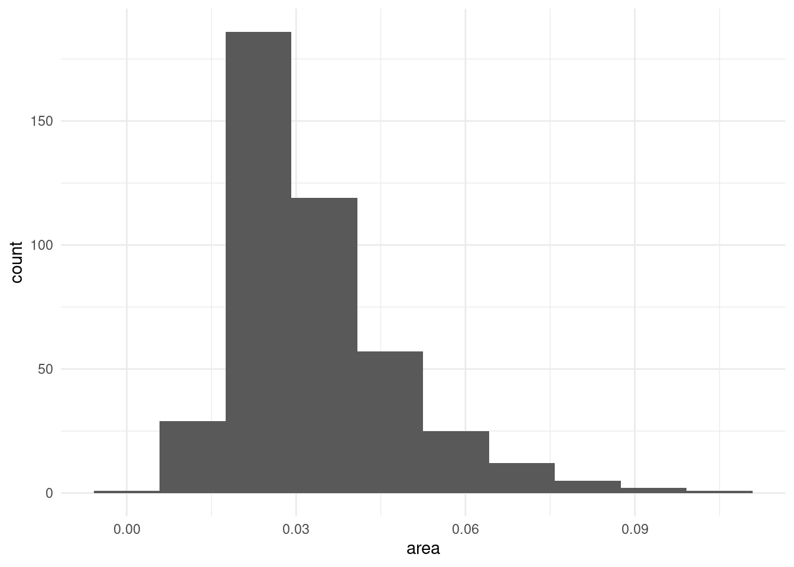

```r
ggplot(
  data = subset(midwest, state %in% c("OH", "IN")),
  mapping = aes(x = percollege, fill = state)
) +
  geom_histogram(alpha = 0.7, bins = 20) +
  scale_fill_viridis_d()
```

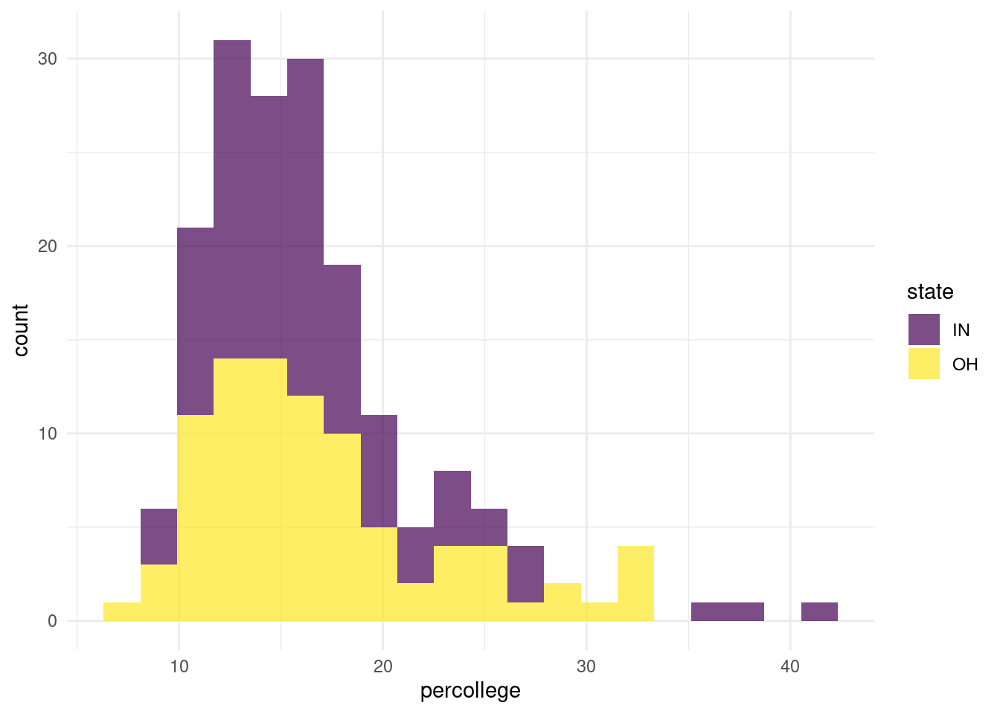

#### Density 


```r
midwest %>%
  ggplot(aes(x = area, fill = state, color = state)) +
  geom_density(alpha = 0.3) +
  scale_color_viridis_d() +
  scale_fill_viridis_d()
```


### Advanced aes (size, color)

- There's also fill argument (mostly used in `geom_bar()`). Color `aes` affects the appearance of lines and points, fill is for the filled areas of bars, polygons, and in some cases, the interior of a smoother's standard error ribbon.

- The property size/color/fill represents... 


```r
ggplot(
  data = gapminder,
  mapping = aes(
    x = gdpPercap, y = lifeExp,
    size = pop
  )
) +
  geom_point() 
```

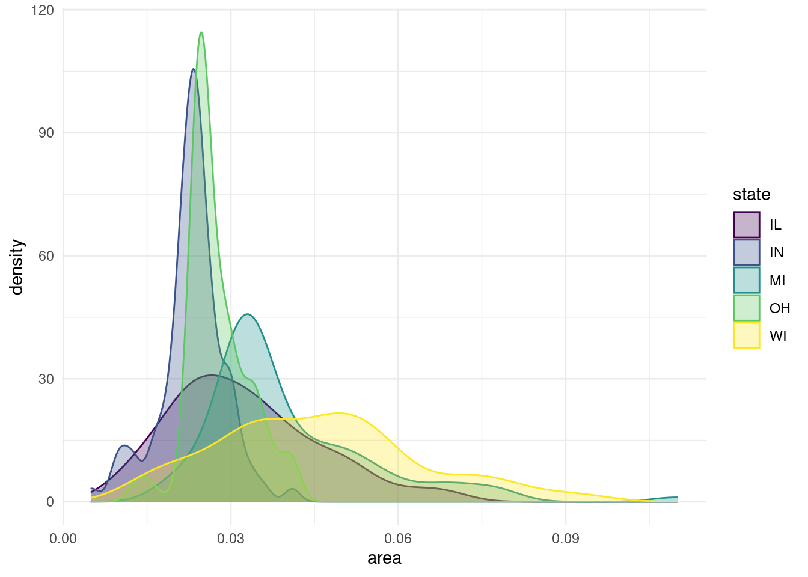


```r
ggplot(
  data = gapminder,
  mapping = aes(
    x = gdpPercap, y = lifeExp,
    size = pop,
    color = continent
  )
) +
  geom_point() +
  scale_color_viridis_d()
```


```r
# try red instead of "red"
ggplot(
  data = gapminder,
  mapping = aes(
    x = gdpPercap, y = lifeExp,
    size = pop,
    color = "red"
  )
) +
  geom_point() 
```

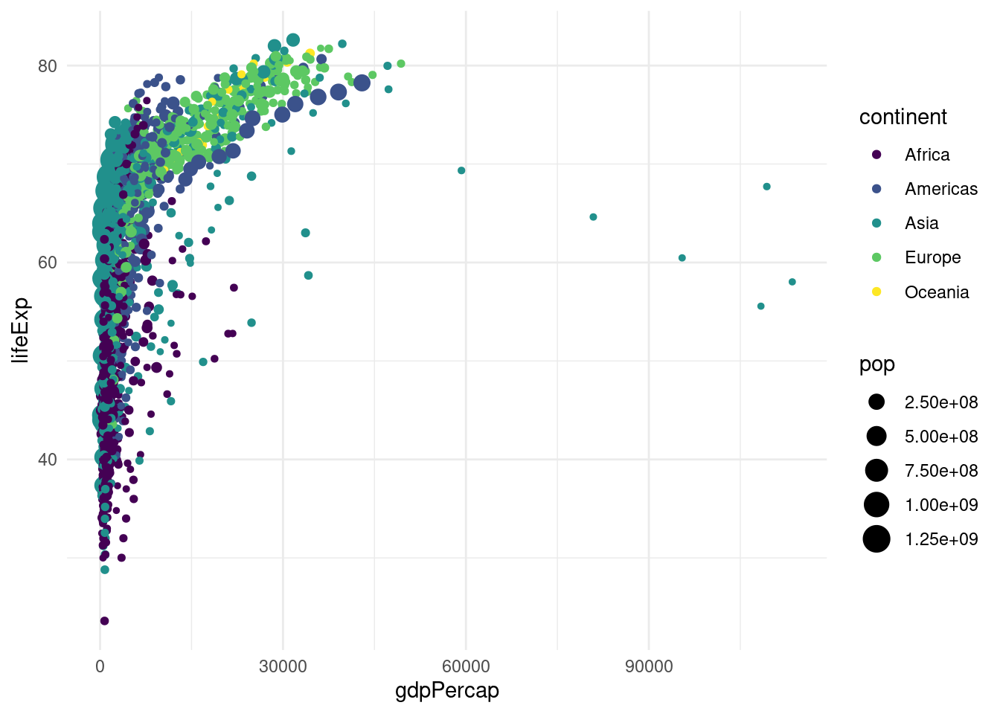

Aesthetics also can be mapped per Geom. 


```r
p + geom_point() +
  geom_smooth()
```

```
## `geom_smooth()` using method = 'gam' and formula 'y ~ s(x, bs = "cs")'
```

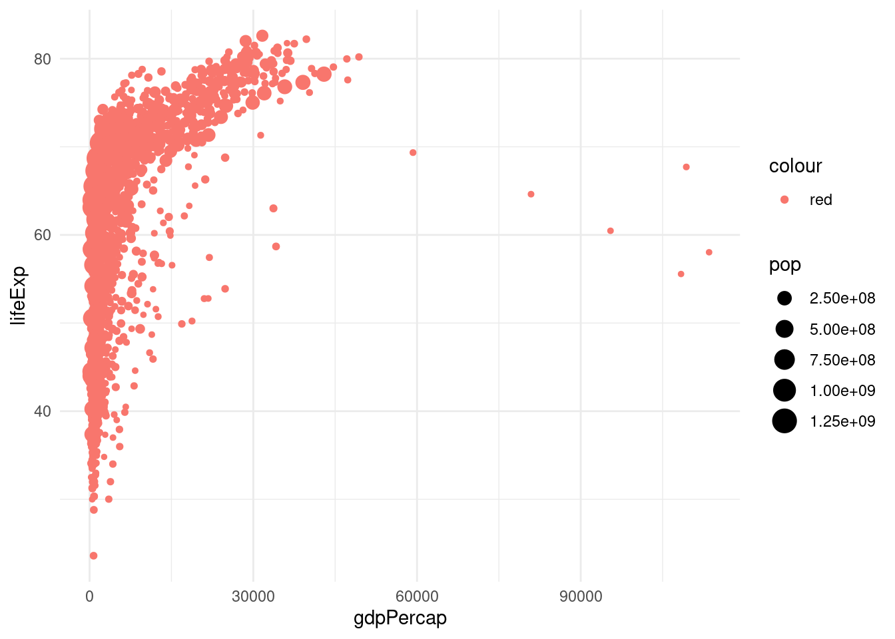

```r
p + geom_point(alpha = 0.3) + # alpha controls transparency
  geom_smooth(color = "red", se = FALSE, size = 2)
```

```
## `geom_smooth()` using method = 'gam' and formula 'y ~ s(x, bs = "cs")'
```

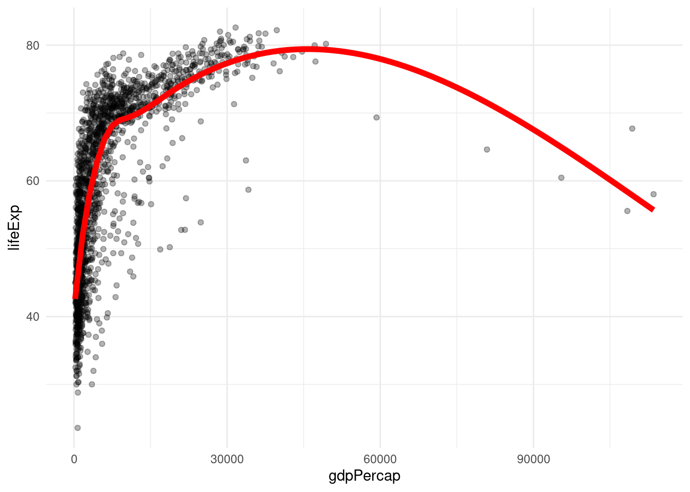

```r
p + geom_point(alpha = 0.3) + # alpha controls transparency
  geom_smooth(color = "red", se = FALSE, size = 2, method = "lm")
```

```
## `geom_smooth()` using formula 'y ~ x'
```


```r
ggplot(
  data = gapminder,
  mapping = aes(
    x = gdpPercap, y = lifeExp,
    color = continent
  )
) +
  geom_point(alpha = 0.3) +
  geom_smooth(method = "loess", color = "red") +
  labs(
    x = "log GDP",
    y = "Life Expectancy",
    title = "A Gapminder Plot",
    subtitle = "Data points are country-years",
    caption = "Source: Gapminder"
  )
```

```
## `geom_smooth()` using formula 'y ~ x'
```


```r
ggplot(
  data = gapminder,
  mapping = aes(
    x = gdpPercap, y = lifeExp,
    color = continent,
    fill = continent
  )
) +
  geom_point(alpha = 0.3) +
  geom_smooth(method = "loess", color = "red") +
  labs(
    x = "log GDP",
    y = "Life Expectancy",
    title = "A Gapminder Plot",
    subtitle = "Data points are country-years",
    caption = "Source: Gapminder"
  ) +
  scale_color_viridis_d() +
  scale_fill_viridis_d()
```

```
## `geom_smooth()` using formula 'y ~ x'
```


### Co-ordinates and scales 


```r
p + geom_point() +
  coord_flip() # coord_type
```


The data is heavily bunched up against the left side. 

```r
p + geom_point() # without scaling
```


```r
p + geom_point() +
  scale_x_log10() # scales the axis of a plot to a log 10 basis
```


```r
p + geom_point() +
  geom_smooth(method = "lm") +
  scale_x_log10()
```

```
## `geom_smooth()` using formula 'y ~ x'
```


### Labels and guides 

`scales` package has some useful premade formatting functions. You can either load scales or just grab the function you need from the library using `scales::` 


```r
p + geom_point(alpha = 0.3) +
  geom_smooth(method = "loess", color = "red") +
  scale_x_log10(labels = scales::dollar) +
  labs(
    x = "log GDP",
    y = "Life Expectancy",
    title = "A Gapminder Plot",
    subtitle = "Data points are country-years",
    caption = "Source: Gapminder"
  )
```

```
## `geom_smooth()` using formula 'y ~ x'
```


6. Themes

```r
p + geom_point(alpha = 0.3) +
  geom_smooth(method = "loess", color = "red") +
  scale_x_log10(labels = scales::dollar) +
  labs(
    x = "log GDP",
    y = "Life Expectancy",
    title = "A Gapminder Plot",
    subtitle = "Data points are country-years",
    caption = "Source: Gapminder"
  ) +
  theme_economist()
```

```
## `geom_smooth()` using formula 'y ~ x'
```

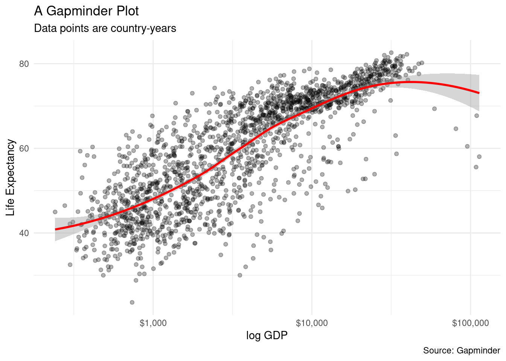

### ggsave 


```r
figure_example <- p + geom_point(alpha = 0.3) +
  geom_smooth(method = "gam", color = "red") +
  scale_x_log10(labels = scales::dollar) +
  labs(
    x = "log GDP",
    y = "Life Expectancy",
    title = "A Gapminder Plot",
    subtitle = "Data points are country-years",
    caption = "Source: Gapminder"
  ) +
  theme_economist()

ggsave(figure_example, here("outputs", "figure_example.png"))
```

### Many plots 

Basic ideas:

- Grouping: tell `ggplot2` about the structure of your data 
- Facetting: break up your data into pieces for a plot 

#### Grouping

- Can you guess what's wrong?


```r
p <- ggplot(gapminder, aes(x = year, y = gdpPercap))

p + geom_point()
```


```r
p + geom_line()
```

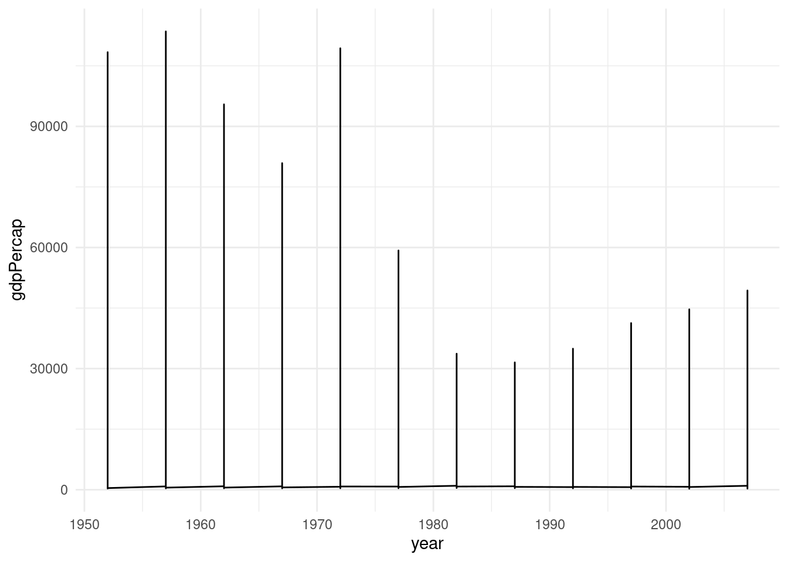

`geom_line` joins up all the lines for each particular year in the order they appear in the dataset. `ggplot2` does not know the yearly observations in your data are grouped by country. 

Note that you need grouping when the grouping information you need to tell is not built into the varaibles being mapped (like continent).


```r
gapminder
```

```
## # A tibble: 1,704 x 6
##    country     continent  year lifeExp      pop gdpPercap
##    <fct>       <fct>     <int>   <dbl>    <int>     <dbl>
##  1 Afghanistan Asia       1952    28.8  8425333      779.
##  2 Afghanistan Asia       1957    30.3  9240934      821.
##  3 Afghanistan Asia       1962    32.0 10267083      853.
##  4 Afghanistan Asia       1967    34.0 11537966      836.
##  5 Afghanistan Asia       1972    36.1 13079460      740.
##  6 Afghanistan Asia       1977    38.4 14880372      786.
##  7 Afghanistan Asia       1982    39.9 12881816      978.
##  8 Afghanistan Asia       1987    40.8 13867957      852.
##  9 Afghanistan Asia       1992    41.7 16317921      649.
## 10 Afghanistan Asia       1997    41.8 22227415      635.
## # … with 1,694 more rows
```

#### Facetting 

Facetting is to make small multiples. 

- `facet_wrap`: based on a single categorical variable like `facet_wrap(~single_categorical_variable)`. Your panels will be laid out in order and then wrapped into a grid.

- `facet_grid`: when you want to cross-classify some data by two categorical variables like `facet_grid(one_cat_variable ~ two_cat_variable)`. 


```r
p <- ggplot(gapminder, aes(x = year, y = gdpPercap))

p + geom_line(aes(group = country)) # group by, # The outlier is Kuwait.
```


```r
p + geom_line(aes(group = country)) + facet_wrap(~continent) # facetting
```

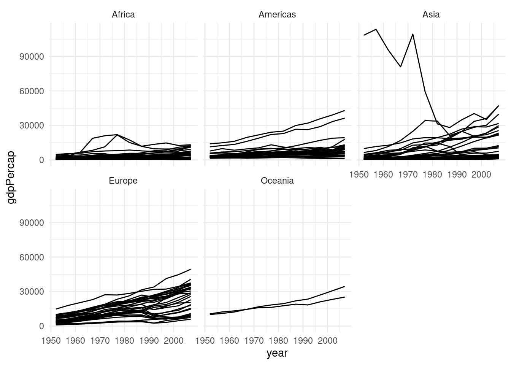

```r
p + geom_line(aes(group = country), color = "gray70") +
  geom_smooth(size = 1.1, method = "loess", se = FALSE) +
  scale_y_log10(labels = scales::dollar) +
  facet_wrap(~continent, ncol = 5) + # for single categorical variable; for multiple categorical variables use facet_grid()
  labs(
    x = "Year",
    y = "GDP per capita",
    title = "GDP per capita on Five continents"
  ) +
  theme(axis.text.x = element_text(angle = 90, hjust = 1))
```

```
## `geom_smooth()` using formula 'y ~ x'
```


```r
p + geom_line(aes(group = country), color = "gray70") +
  geom_smooth(size = 1.1, method = "loess", se = FALSE) +
  scale_y_log10(labels = scales::dollar) +
  facet_grid(~continent) + # for single categorical variable; for multiple categorical variables use facet_grid()
  labs(
    x = "Year",
    y = "GDP per capita",
    title = "GDP per capita on Five continents"
  ) +
  theme(axis.text.x = element_text(angle = 90, hjust = 1))
```

```
## `geom_smooth()` using formula 'y ~ x'
```


### Transforming

- Transforming: perform some calculations on or summarize your data before producing the plot 

#### Use pipes to summarize data

Also, we experiment bar charts here. By default, `geom_bar` [uses](https://www.rdocumentation.org/packages/ggplot2/versions/1.0.1/topics/geom_bar) stat = "bins", which makes the height of each bar equal to the number of cases in each group. If you have a y column, then you should use `stat = "identity"` argument. Alternatively, you can use `geom_col()`.


```r
gapminder_formatted <- gapminder %>%
  group_by(continent, year) %>%
  summarize(
    gdp_mean = mean(gdpPercap),
    lifeExp_mean = mean(lifeExp)
  )
```

```
## `summarise()` regrouping output by 'continent' (override with `.groups` argument)
```

```r
ggplot(data = gapminder_formatted, aes(x = year, y = lifeExp_mean, color = continent)) +
  geom_point() +
  labs(
    x = "Year",
    y = "Life expectancy",
    title = "Life expectancy on Five continents"
  )
```


```r
gapminder %>%
  filter(continent == "Europe") %>%
  group_by(country, year) %>%
  summarize(
    gdp_mean = mean(gdpPercap),
    lifeExp_mean = mean(lifeExp)
  ) %>%
  ggplot(aes(x = year, y = lifeExp_mean, color = country)) +
  geom_point() +
  labs(
    x = "Year",
    y = "Life expectancy",
    title = "Life expectancy in Europe"
  )
```

```
## `summarise()` regrouping output by 'country' (override with `.groups` argument)
```


```r
# geom point
gapminder %>%
  filter(continent == "Europe") %>%
  group_by(country, year) %>%
  summarize(
    gdp_mean = mean(gdpPercap),
    lifeExp_mean = mean(lifeExp)
  ) %>%
  ggplot(aes(x = year, y = lifeExp_mean)) +
  geom_point() +
  labs(
    x = "Year",
    y = "Life expectancy",
    title = "Life expectancy in Europe"
  ) +
  facet_wrap(~country)
```

```
## `summarise()` regrouping output by 'country' (override with `.groups` argument)
```

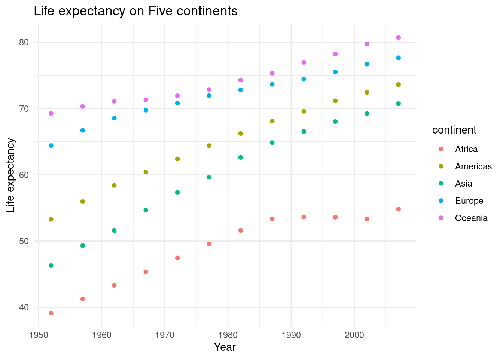

```r
# geom bar
gapminder %>%
  filter(continent == "Europe") %>%
  group_by(country, year) %>%
  summarize(
    gdp_mean = mean(gdpPercap),
    lifeExp_mean = mean(lifeExp)
  ) %>%
  ggplot(aes(x = year, y = lifeExp_mean)) +
  geom_bar(stat = "identity") +
  labs(
    x = "Year",
    y = "Life expectancy",
    title = "Life expectancy in Europe"
  ) +
  facet_wrap(~country)
```

```
## `summarise()` regrouping output by 'country' (override with `.groups` argument)
```

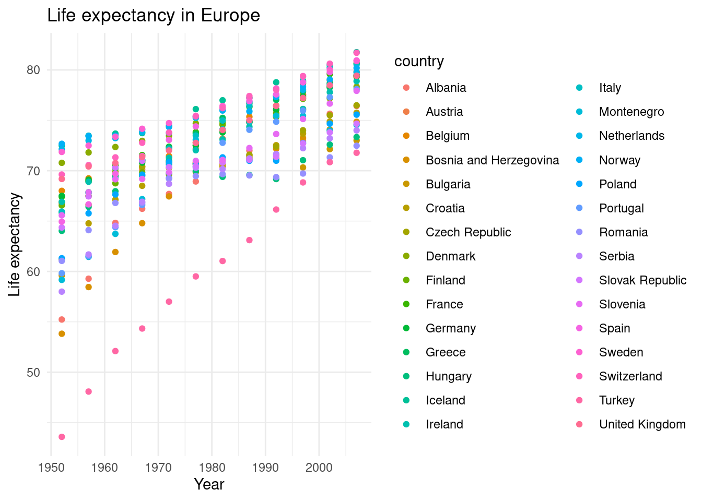

```r
# no facet
gapminder %>%
  filter(continent == "Europe") %>%
  group_by(country, year) %>%
  summarize(
    gdp_mean = mean(gdpPercap),
    lifeExp_mean = mean(lifeExp)
  ) %>%
  ggplot(aes(x = year, y = lifeExp_mean, fill = country)) +
  geom_bar(stat = "identity") + # even if you not stack, still the plot looks messy or you can use geom_col()
  labs(
    x = "Year",
    y = "Life expectancy",
    title = "Life expectancy in Europe"
  )
```

```
## `summarise()` regrouping output by 'country' (override with `.groups` argument)
```

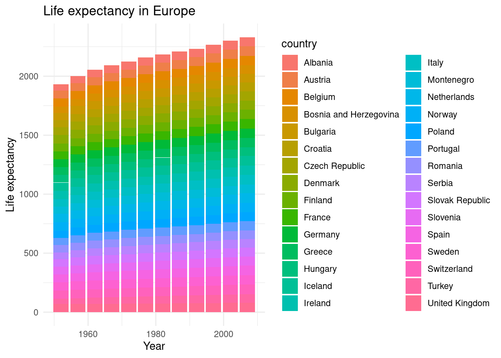


```r
gapminder %>%
  filter(continent == "Europe") %>%
  group_by(country, year) %>%
  summarize(
    gdp_mean = mean(gdpPercap),
    lifeExp_mean = mean(lifeExp)
  ) %>%
  ggplot(aes(x = country, y = lifeExp_mean)) +
  geom_boxplot() +
  labs(
    x = "Country",
    y = "Life expectancy",
    title = "Life expectancy in Europe"
  ) +
  coord_flip()
```

```
## `summarise()` regrouping output by 'country' (override with `.groups` argument)
```


```r
# without ordering
gapminder %>%
  filter(continent == "Europe") %>%
  group_by(country, year) %>%
  summarize(
    gdp_mean = mean(gdpPercap),
    lifeExp_mean = mean(lifeExp)
  ) %>%
  ggplot(aes(x = reorder(country, lifeExp_mean), y = lifeExp_mean)) +
  geom_boxplot() +
  labs(
    x = "Country",
    y = "Life expectancy",
    title = "Life expectancy in Europe"
  ) +
  coord_flip()
```

```
## `summarise()` regrouping output by 'country' (override with `.groups` argument)
```

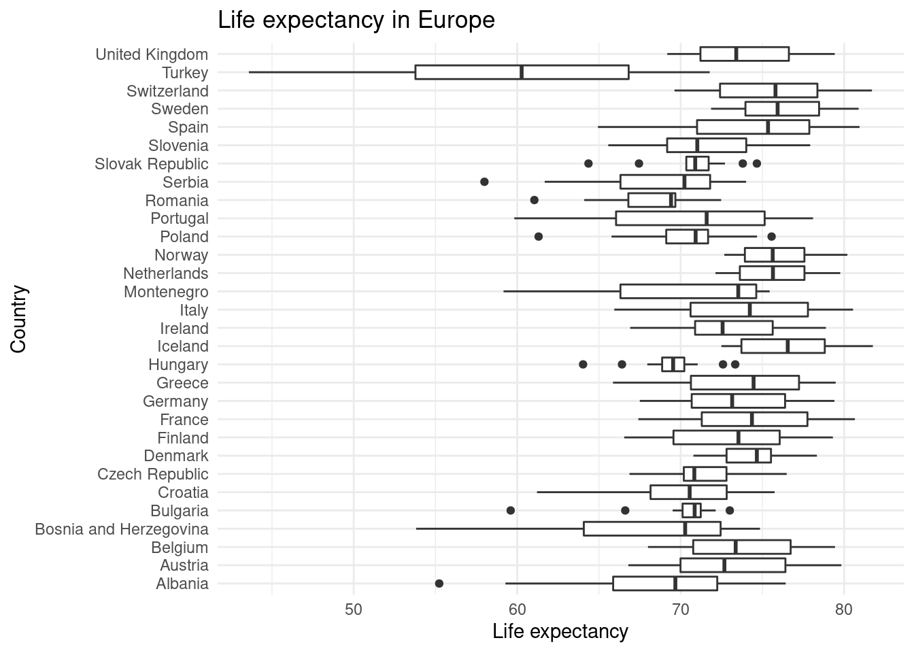

```r
# reorder
gapminder %>%
  filter(continent == "Europe") %>%
  group_by(country, year) %>%
  summarize(
    gdp_mean = mean(gdpPercap),
    lifeExp_mean = mean(lifeExp)
  ) %>%
  ggplot(aes(x = reorder(country, -lifeExp_mean), y = lifeExp_mean)) +
  geom_boxplot() +
  labs(
    x = "Country",
    y = "Life expectancy",
    title = "Life expectancy in Europe"
  ) +
  coord_flip()
```

```
## `summarise()` regrouping output by 'country' (override with `.groups` argument)
```

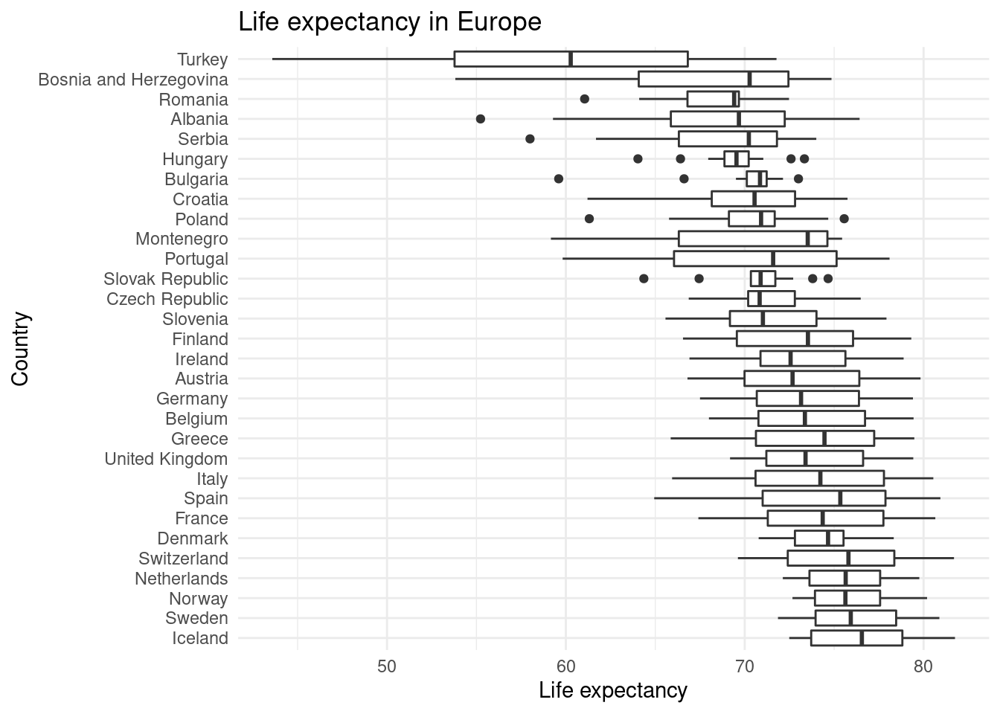

#### Plotting text


```r
gapminder %>%
  filter(continent == "Asia" | continent == "Americas") %>%
  group_by(continent, country) %>%
  summarize(
    gdp_mean = mean(gdpPercap),
    lifeExp_mean = mean(lifeExp)
  ) %>%
  ggplot(aes(x = gdp_mean, y = lifeExp_mean)) +
  geom_point() +
  geom_text(aes(label = country)) +
  scale_x_log10() +
  facet_grid(~continent)
```

```
## `summarise()` regrouping output by 'continent' (override with `.groups` argument)
```


```r
# with label
gapminder %>%
  filter(continent == "Asia" | continent == "Americas") %>%
  group_by(continent, country) %>%
  summarize(
    gdp_mean = mean(gdpPercap),
    lifeExp_mean = mean(lifeExp)
  ) %>%
  ggplot(aes(x = gdp_mean, y = lifeExp_mean)) +
  geom_point() +
  geom_label(aes(label = country)) +
  scale_x_log10() +
  facet_grid(~continent)
```

```
## `summarise()` regrouping output by 'continent' (override with `.groups` argument)
```


```r
# no overlaps
gapminder %>%
  filter(continent == "Asia" | continent == "Americas") %>%
  group_by(continent, country) %>%
  summarize(
    gdp_mean = mean(gdpPercap),
    lifeExp_mean = mean(lifeExp)
  ) %>%
  ggplot(aes(x = gdp_mean, y = lifeExp_mean)) +
  geom_point() +
  geom_text_repel(aes(label = country)) + # there's also geom_label_repel
  scale_x_log10() +
  facet_grid(~continent)
```

```
## `summarise()` regrouping output by 'continent' (override with `.groups` argument)
```

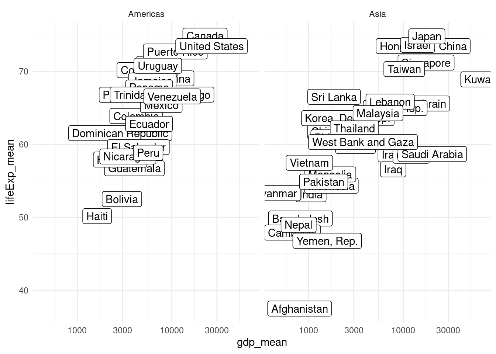

### Ploting models 

In plotting models, we extensively use David Robinson's [broom package](https://cran.r-project.org/web/packages/broom/vignettes/broom.html) in R. The idea is to transform model outputs (i.e., predictions and estimations) into tidy objects so that we can easily combine, separate, and visualize these elements. 

#### Plotting several fits at the same time

```r
model_colors <- RColorBrewer::brewer.pal(3, "Set1") # select three qualitatively different colors from a larger palette.

gapminder %>%
  ggplot(aes(x = log(gdpPercap), y = lifeExp)) +
  geom_point(alpha = 0.2) +
  geom_smooth(method = "lm", aes(color = "OLS", fill = "OLS")) +
  geom_smooth(
    method = "lm", formula = y ~ splines::bs(x, df = 3),
    aes(color = "Cubic Spline", fill = "Cubic Spline")
  ) +
  geom_smooth(method = "loess", aes(color = "LOESS", fill = "LOESS")) +
  theme(legend.position = "top") +
  scale_color_manual(name = "Models", values = model_colors) +
  scale_fill_manual(name = "Models", values = model_colors)
```

```
## `geom_smooth()` using formula 'y ~ x'
## `geom_smooth()` using formula 'y ~ x'
```


#### Extracting model outcomes 

```r
# regression model
out <- lm(
  formula = lifeExp ~ gdpPercap + pop + continent,
  data = gapminder
)
```

`tidy()` is a method in the `broom` package. It "constructs a dataframe that summarizes the model's statistical findings". As the description states, tidy is a function that can be used for various models. For instance, a tidy can extract following information from a regression model.

- `Term`: a term being estimated 
- `p.value`
- `statistic`: a test statistic used to compute p-value
- `estimate` 
- `conf.low`: the low end of a confidence interval 
- `conf.high`: the high end of a confidence interval
- `df`: degrees of freedom

**Challege**

Try glance(out), what did you get from these commands? If you're curious, you can try ?glance.

The followings are to show your degree of confidence.

##### Coeffficients

```r
# estimates
out_comp <- tidy(out)

p <- out_comp %>%
  ggplot(aes(x = term, y = estimate))

p + geom_point() +
  coord_flip() +
  theme_bw()
```


##### Confidence intervals


```r
# plus confidence intervals
out_conf <- tidy(out, conf.int = TRUE)

# plotting coefficients using ggplot2 (pointrange)
out_conf %>%
  ggplot(aes(x = reorder(term, estimate), y = estimate, ymin = conf.low, ymax = conf.high)) +
  geom_pointrange() +
  coord_flip() +
  labs(x = "", y = "OLS Estimate") +
  theme_bw()
```

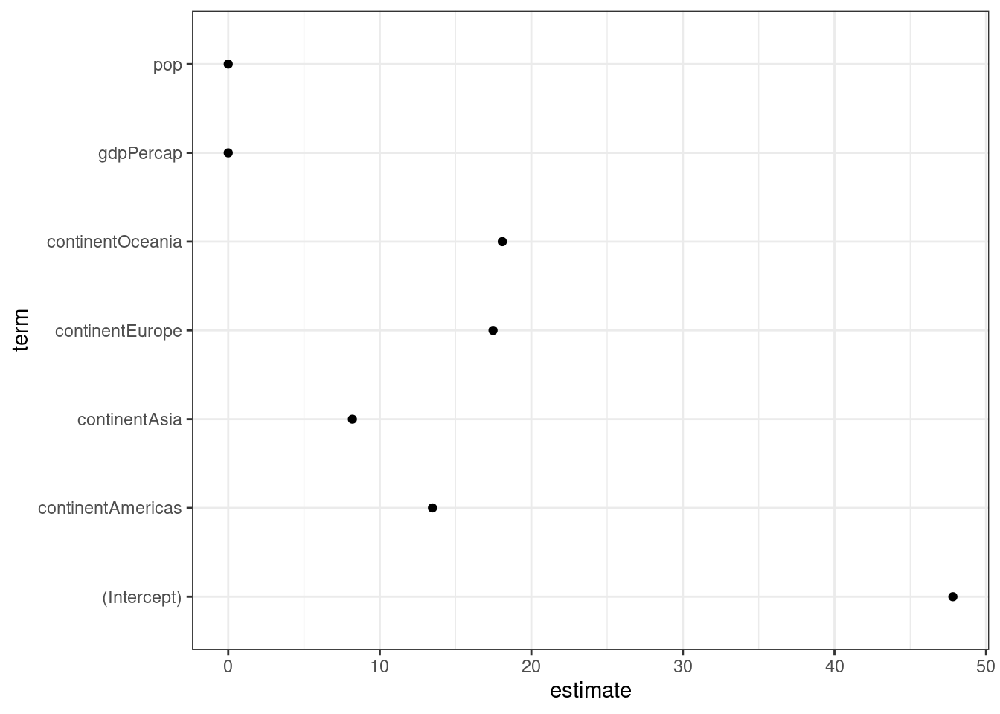

```r
# another way to do it (errorbar)
out_conf %>%
  ggplot(aes(x = estimate, y = reorder(term, estimate))) +
  geom_point() +
  geom_errorbarh(aes(xmin = conf.low, xmax = conf.high)) +
  labs(y = "", x = "OLS Estimate") +
  theme_bw()
```

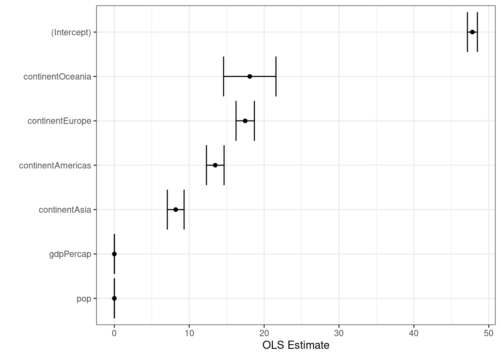

You can calculate marginal effects using `margins` package. For the sake of time, I'm not covering that here.

<!--chapter:end:02_tidy_data.Rmd-->

# Automating repeated things {#functional_programming}

> Anything that can be automated should be automated. Do as little as possible by hand. Do as much as possible with functions. 
- Hadley Wickham

## Flow control 

Almost all the conditional operators used in Python also work in R.  The basic loop set up is also very similar, with some small syntax adjustments.  Note that ```if()``` is a function whose arguments must be specified inside parentheses.  ```else```, however, is a reserved operator that takes no arguments.  Note that there is no ```elif``` option --- one simply writes ```else if()```.  Whereas operations to be executed after conditional evaluations in Python come after a ```:```, R operations must only be enclosed in curly brackets: ```{}```.  Furthermore, there is no requirement for indentation.  The only thing to keep in mind is that **each new operation must be on a separate line**.


```r
x <- 5

if(x < 0){
  print("x is negative")
} 

x <- -5

if(x < 0){
  print("x is negative")
}
```

```
## [1] "x is negative"
```

```r
x <- 5

if(x < 0){
  print("x is negative")
} else{
  print("x is positive")
}
```

```
## [1] "x is positive"
```

```r
x <- 0

if(x < 0){
  print("x is negative")
} else if(x == 0){
  print("x is zero")
} else{
  print("x is positive")
}
```

```
## [1] "x is zero"
```

R also does some class coercion that makes Boolean evaluations harder to break than in Python.  But be careful --- R has a set of special coercion used for fast logical evaluation and subsetting.  Specifically, ```TRUE``` is considered equal to ```1```, while ```FALSE``` is equal to ```0```. The Boolean logicals can also be specified as a full word in all caps, or simply as ```T``` or ```F```.


```r
1 < 2
```

```
## [1] TRUE
```

```r
"1" < 2
```

```
## [1] TRUE
```

```r
"a" < 2
```

```
## [1] FALSE
```

```r
TRUE < 2
```

```
## [1] TRUE
```

```r
TRUE == "TRUE"
```

```
## [1] TRUE
```

```r
T == "TRUE"
```

```
## [1] TRUE
```

```r
TRUE == "T"
```

```
## [1] FALSE
```

```r
TRUE == "FALSE"
```

```
## [1] FALSE
```

```r
TRUE == 0
```

```
## [1] FALSE
```

```r
TRUE == 1
```

```
## [1] TRUE
```

```r
FALSE == 0
```

```
## [1] TRUE
```

```r
FALSE <= 1
```

```
## [1] TRUE
```

## Functions 

While functions are defined in Python using the ```def``` reserved operator, R sees functions as just another type of named object.  Thus, they require explicit assignment to an object.  This is done using the function ```function()```, which creates a function taking the arguments specified in parentheses.  


```r
simple.function <- function(x){
  print(x + 1)
}

simple.function(x = 2)
```

```
## [1] 3
```

```r
less.simple.function <- function(x, y){
  print(x - y + 1)
}

less.simple.function(x = 2, y = 10)
```

```
## [1] -7
```

With respect to returning function output, most of the same rules apply as with Python. Be sure to remember that ```return()``` will only process a single object, so multiple items must usually be returned as a list. Note that your ordering of the functions matters, too. 


```r
dumbfun <- function(x){
  return(x)
  print("This will never print :(")
}

dumbfun(x = "something")
```

```
## [1] "something"
```

```r
dumbfun <- function(x){
  print("Why did I print?")
  return(x)
}

dumbfun(x = "something")
```

```
## [1] "Why did I print?"
```

```
## [1] "something"
```

```r
dumbfun <- function(x,y){
  thing1 <- x
  thing2 <- y
  return(list(thing1, thing2))
}

dumbfun(x = "some text", y = "some data")
```

```
## [[1]]
## [1] "some text"
## 
## [[2]]
## [1] "some data"
```

```r
dumbfun(x = c(5,10,15), y = "some data")
```

```
## [[1]]
## [1]  5 10 15
## 
## [[2]]
## [1] "some data"
```

R functions also allow you to set default argument values:


```r
less.simple.function <- function(x, y = 0){
  print(x - y + 1)
}

less.simple.function(x = 2)
```

```
## [1] 3
```

```r
less.simple.function(x = 2, y = 10)
```

```
## [1] -7
```

With respect to specifying arguments, one can either use argument **position** specifications (i.e., the order) or argument **name** specifications.  The latter is strongly preferred, as it is very easy to accidentally specify incorrect argument values.


```r
send <- function(message, recipient, cc=NULL, bcc=NULL){
  print(paste(message, recipient, sep = ", "))
  print(paste("CC:", cc, sep = " "))
  print(paste("BCC:", bcc, sep = " "))
}

send(message = "Hello", recipient = "World", cc = "Sun", bcc = "Jane")
```

```
## [1] "Hello, World"
## [1] "CC: Sun"
## [1] "BCC: Jane"
```

```r
send("Hello", "World", "Sun", "Jane")
```

```
## [1] "Hello, World"
## [1] "CC: Sun"
## [1] "BCC: Jane"
```

```r
send("Hello", "Sun", "Jane", "World")
```

```
## [1] "Hello, Sun"
## [1] "CC: Jane"
## [1] "BCC: World"
```

```r
send(message = "Hello", cc = "Sun", bcc = c("Jane", "Rochelle"), recipient = "World")
```

```
## [1] "Hello, World"
## [1] "CC: Sun"
## [1] "BCC: Jane"     "BCC: Rochelle"
```

Also, note that functions don't have what CS people called side-effects. Functions only define local variables = They don't change objects stored in the global environment. (Consider the difference between `<-` and `=` for assignments.) That's why you can use functions for reusable tasks since it does not interrupt other important things in your system.

See [the following example](https://darrenjw.wordpress.com/2011/11/23/lexical-scope-and-function-closures-in-r/) from Wilkinson.


```r
a = 1 
b = 2

f <- function(x)
{
  a*x + b
}

f(2)
```

```
## [1] 4
```

```r
g <- function(x)
{
  a = 2
  b = 1
  f(x)
}

g(2) # a equals still 1 
```

```
## [1] 4
```

## for loop 

Loops in R also work basically the same way as in Python, with just a few adjustments.  First, recall that index positions in R start at 1.  Second, ```while()``` and ```for()``` are functions rather than reserved operators, meaning they must take arguments in parentheses.  Third, just like ```else```, the ```in``` operator *is* reserved and takes no arguments in parentheses.  Fourth, the conditional execution must appear between curly brackets.  Finally, indentation is meaningless, but each new operation must appear on a new line.

- `while()`: when we have no idea how many times loop needs to be executed.
- `for()`: when we know how many times loop needs to be executed.


```r
fruits <- c("apples", "oranges", "pears", "bananas")

# a while loop
i <- 1
while(i <= length(fruits)){
  print(fruits[i])
  i <- i + 1
}
```

```
## [1] "apples"
## [1] "oranges"
## [1] "pears"
## [1] "bananas"
```

```r
# a for loop
for(i in 1:length(fruits)){
  print(fruits[i])
}
```

```
## [1] "apples"
## [1] "oranges"
## [1] "pears"
## [1] "bananas"
```

## apply family 

While and for loops in R can be very slow. For this reason, R has a number of built-in iteration methods to speed up execution times. In many cases, packages will have "behind-the-scenes" ways to avoid for loops, but what if you need to write your own function? 

A common method of getting around for loops is the **apply** family of functions. These take a data structure and a function, and applies a function over all the elements in the object.


```r
fruit <- c("apple", "orange", "pear", "banana")

# make function that takes in only one element
make.plural <- function(x){
   plural <- paste(x, 's', sep = '') # sep is for collapse, so collpase ''
   return(plural)
}

make.plural('apple')
```

```
## [1] "apples"
```

```r
# apply that function to every element
lapply(fruit, make.plural) # returns a list
```

```
## [[1]]
## [1] "apples"
## 
## [[2]]
## [1] "oranges"
## 
## [[3]]
## [1] "pears"
## 
## [[4]]
## [1] "bananas"
```

```r
sapply(fruit, make.plural) # returns a named vector
```

```
##     apple    orange      pear    banana 
##  "apples" "oranges"   "pears" "bananas"
```

```r
library(purrr) # load package
map(fruit, make.plural) # type consistent
```

```
## [[1]]
## [1] "apples"
## 
## [[2]]
## [1] "oranges"
## 
## [[3]]
## [1] "pears"
## 
## [[4]]
## [1] "bananas"
```


```r
# Why sapply is bad 

sapply(1:100, paste) # return character 
```

```
##   [1] "1"   "2"   "3"   "4"   "5"   "6"   "7"   "8"   "9"   "10"  "11"  "12" 
##  [13] "13"  "14"  "15"  "16"  "17"  "18"  "19"  "20"  "21"  "22"  "23"  "24" 
##  [25] "25"  "26"  "27"  "28"  "29"  "30"  "31"  "32"  "33"  "34"  "35"  "36" 
##  [37] "37"  "38"  "39"  "40"  "41"  "42"  "43"  "44"  "45"  "46"  "47"  "48" 
##  [49] "49"  "50"  "51"  "52"  "53"  "54"  "55"  "56"  "57"  "58"  "59"  "60" 
##  [61] "61"  "62"  "63"  "64"  "65"  "66"  "67"  "68"  "69"  "70"  "71"  "72" 
##  [73] "73"  "74"  "75"  "76"  "77"  "78"  "79"  "80"  "81"  "82"  "83"  "84" 
##  [85] "85"  "86"  "87"  "88"  "89"  "90"  "91"  "92"  "93"  "94"  "95"  "96" 
##  [97] "97"  "98"  "99"  "100"
```

```r
sapply(integer(), paste) # return list!
```

```
## list()
```

```r
library(purrr)
map(1:100, paste) # return list
```

```
## [[1]]
## [1] "1"
## 
## [[2]]
## [1] "2"
## 
## [[3]]
## [1] "3"
## 
## [[4]]
## [1] "4"
## 
## [[5]]
## [1] "5"
## 
## [[6]]
## [1] "6"
## 
## [[7]]
## [1] "7"
## 
## [[8]]
## [1] "8"
## 
## [[9]]
## [1] "9"
## 
## [[10]]
## [1] "10"
## 
## [[11]]
## [1] "11"
## 
## [[12]]
## [1] "12"
## 
## [[13]]
## [1] "13"
## 
## [[14]]
## [1] "14"
## 
## [[15]]
## [1] "15"
## 
## [[16]]
## [1] "16"
## 
## [[17]]
## [1] "17"
## 
## [[18]]
## [1] "18"
## 
## [[19]]
## [1] "19"
## 
## [[20]]
## [1] "20"
## 
## [[21]]
## [1] "21"
## 
## [[22]]
## [1] "22"
## 
## [[23]]
## [1] "23"
## 
## [[24]]
## [1] "24"
## 
## [[25]]
## [1] "25"
## 
## [[26]]
## [1] "26"
## 
## [[27]]
## [1] "27"
## 
## [[28]]
## [1] "28"
## 
## [[29]]
## [1] "29"
## 
## [[30]]
## [1] "30"
## 
## [[31]]
## [1] "31"
## 
## [[32]]
## [1] "32"
## 
## [[33]]
## [1] "33"
## 
## [[34]]
## [1] "34"
## 
## [[35]]
## [1] "35"
## 
## [[36]]
## [1] "36"
## 
## [[37]]
## [1] "37"
## 
## [[38]]
## [1] "38"
## 
## [[39]]
## [1] "39"
## 
## [[40]]
## [1] "40"
## 
## [[41]]
## [1] "41"
## 
## [[42]]
## [1] "42"
## 
## [[43]]
## [1] "43"
## 
## [[44]]
## [1] "44"
## 
## [[45]]
## [1] "45"
## 
## [[46]]
## [1] "46"
## 
## [[47]]
## [1] "47"
## 
## [[48]]
## [1] "48"
## 
## [[49]]
## [1] "49"
## 
## [[50]]
## [1] "50"
## 
## [[51]]
## [1] "51"
## 
## [[52]]
## [1] "52"
## 
## [[53]]
## [1] "53"
## 
## [[54]]
## [1] "54"
## 
## [[55]]
## [1] "55"
## 
## [[56]]
## [1] "56"
## 
## [[57]]
## [1] "57"
## 
## [[58]]
## [1] "58"
## 
## [[59]]
## [1] "59"
## 
## [[60]]
## [1] "60"
## 
## [[61]]
## [1] "61"
## 
## [[62]]
## [1] "62"
## 
## [[63]]
## [1] "63"
## 
## [[64]]
## [1] "64"
## 
## [[65]]
## [1] "65"
## 
## [[66]]
## [1] "66"
## 
## [[67]]
## [1] "67"
## 
## [[68]]
## [1] "68"
## 
## [[69]]
## [1] "69"
## 
## [[70]]
## [1] "70"
## 
## [[71]]
## [1] "71"
## 
## [[72]]
## [1] "72"
## 
## [[73]]
## [1] "73"
## 
## [[74]]
## [1] "74"
## 
## [[75]]
## [1] "75"
## 
## [[76]]
## [1] "76"
## 
## [[77]]
## [1] "77"
## 
## [[78]]
## [1] "78"
## 
## [[79]]
## [1] "79"
## 
## [[80]]
## [1] "80"
## 
## [[81]]
## [1] "81"
## 
## [[82]]
## [1] "82"
## 
## [[83]]
## [1] "83"
## 
## [[84]]
## [1] "84"
## 
## [[85]]
## [1] "85"
## 
## [[86]]
## [1] "86"
## 
## [[87]]
## [1] "87"
## 
## [[88]]
## [1] "88"
## 
## [[89]]
## [1] "89"
## 
## [[90]]
## [1] "90"
## 
## [[91]]
## [1] "91"
## 
## [[92]]
## [1] "92"
## 
## [[93]]
## [1] "93"
## 
## [[94]]
## [1] "94"
## 
## [[95]]
## [1] "95"
## 
## [[96]]
## [1] "96"
## 
## [[97]]
## [1] "97"
## 
## [[98]]
## [1] "98"
## 
## [[99]]
## [1] "99"
## 
## [[100]]
## [1] "100"
```

```r
map(integer(), paste) # return list
```

```
## list()
```

The multivariate version of `sapply` is `mapply`. Use this if you have a function that takes in 2 or more arguments.

## purrr

- Setup 


```r
# Install packages
if (!require("pacman")) {
  install.packages("pacman")
}
```

```
## Loading required package: pacman
```

```r
pacman::p_load(
  tidyverse, # tidyverse pkgs including purrr
  tictoc, # performance test
  broom, # tidy modeling
  glue, # paste string and objects
  furrr, # parallel processing
  rvest, # web scraping
  devtools, # dev tools 
  usethis, # workflow     
  roxygen2, # documentation 
            
  testthat) # testing 
```

### Why map? 

#### Objectives 

- How to use `purrr` to automate workflow in a cleaner, faster, and more extendable way

#### Copy-and-paste programming 

> Copy-and-paste programming, sometimes referred to as just pasting, is the production of highly repetitive computer programming code, as produced by copy and paste operations. It is primarily a pejorative term; those who use the term are often implying a lack of programming competence. It may also be the result of technology limitations (e.g., an insufficiently expressive development environment) as subroutines or libraries would normally be used instead. However, there are occasions when copy-and-paste programming is considered acceptable or necessary, such as for boilerplate, loop unrolling (when not supported automatically by the compiler), or certain programming idioms, and it is supported by some source code editors in the form of snippets. - Wikipedia 

- The following exercise was inspired by [Wickham's example](http://adv-r.had.co.nz/Functional-programming.html).

- Let's imagine `df` is a survey dataset. 

    - `a, b, c, d` = Survey questions 

    - `-99`: non-responses 
    
    - Your goal: replace `-99` with `NA` 
    

```r
# Data

set.seed(1234) # for reproducibility

df <- tibble(
  "a" = sample(c(-99, 1:3), size = 5, replace = TRUE),
  "b" = sample(c(-99, 1:3), size = 5, replace = TRUE),
  "c" = sample(c(-99, 1:3), size = 5, replace = TRUE),
  "d" = sample(c(-99, 1:3), size = 5, replace = TRUE)
)
```


```r
# Copy and paste
df$a[df$a == -99] <- NA
df$b[df$b == -99] <- NA
df$c[df$c == -99] <- NA
df$d[df$d == -99] <- NA

df
```

```
## # A tibble: 5 x 4
##       a     b     c     d
##   <dbl> <dbl> <dbl> <dbl>
## 1     3     3     3     1
## 2     3     2     3     1
## 3     1    NA     1     2
## 4     1    NA     2     1
## 5    NA     1     1     3
```

- **Challenge**. Explain why this solution is not very efficient (Hint: If `df$a[df$a == -99] <- NA` has an error, how are you going to fix it? A solution is not scalable if it's not automatable.

#### Using a function 

- Let's recall what's function in R: `input + computation + output` 

- If you write a function, you gain efficiency because you don't need to copy and paste the computation part. 

`
function(input){
  
  computation 
  
  return(output)
}
`


```r
# Function

fix_missing <- function(x) {
  x[x == -99] <- NA
  x
}

# Apply function to each column (vector)

df$a <- fix_missing(df$a)
df$b <- fix_missing(df$b)
df$c <- fix_missing(df$c)
df$d <- fix_missing(df$d)

df
```

```
## # A tibble: 5 x 4
##       a     b     c     d
##   <dbl> <dbl> <dbl> <dbl>
## 1     3     3     3     1
## 2     3     2     3     1
## 3     1    NA     1     2
## 4     1    NA     2     1
## 5    NA     1     1     3
```

- **Challenge** Why using function is more efficient than 100% copying and pasting? Can you think about a way we can automate the process?

- Many options for automation in R: `for loop`, `apply` family, etc. 

- Here's a tidy solution comes from `purrr` package.

- The power and joy of one-liner. 


```r
df <- purrr::map_df(df, fix_missing)

df
```

```
## # A tibble: 5 x 4
##       a     b     c     d
##   <dbl> <dbl> <dbl> <dbl>
## 1     3     3     3     1
## 2     3     2     3     1
## 3     1    NA     1     2
## 4     1    NA     2     1
## 5    NA     1     1     3
```

`map()` is a [higher-order function](https://en.wikipedia.org/wiki/Map_(higher-order_function)) that applies a given function to each element of a list/vector. 


    - Input: Takes a vector/list. 
    
    - Computation: Calls the function once for each element of the vector 
  
    - Output: Returns in a list or whatever data format you prefer (e.g., `_df helper: dataframe`)

- **Challenge** If you run the code below, what's going to be the data type of the output?


```r
map(df, fix_missing)
```

```
## $a
## [1]  3  3  1  1 NA
## 
## $b
## [1]  3  2 NA NA  1
## 
## $c
## [1] 3 3 1 2 1
## 
## $d
## [1] 1 1 2 1 3
```

- Why `map()` is a good alternative to `for loop`. 

```{=html}

<iframe width="560" height="315" src="https://www.youtube.com/embed/bzUmK0Y07ck" frameborder="0" allow="accelerometer; autoplay; clipboard-write; encrypted-media; gyroscope; picture-in-picture" allowfullscreen></iframe>

<p>The Joy of Functional Programming (for Data Science) - Hadley Wickham</p>
```


```r
# Built-in data
data("airquality")

tic()

# Placeholder
out1 <- vector("double", ncol(airquality))
# Sequence variable
for (i in seq_along(airquality)) { #

  # Assign a computation result to each element
  out1[[i]] <- mean(airquality[[i]], na.rm = TRUE)
}
toc()
```

```
## 0.005 sec elapsed
```


```r
tic()
out1 <- airquality %>% map_dbl(mean, na.rm = TRUE)
toc()
```

```
## 0.002 sec elapsed
```

- In short, `map()` is more readable, faster, and easily extendable with other data science tasks (e.g., wrangling, modeling, and visualization) using `%>%`. 

- Final point: Why not base R `apply` family? 

- Short answer: `purrr::map()` is simpler to write. For instance, 

`map_dbl(x, mean, na.rm = TRUE)` = `vapply(x, mean, na.rm = TRUE, FUN.VALUE = double(1))`

#### Application (many models)

- One popular application of `map()` is to run regression models (or whatever model you want to run) on list-columns. No more copying and pasting for running many regression models on subgroups!


```r
# Have you ever tried this?
lm_A <- lm(y ~ x, subset(data, subgroup == "group_A"))
lm_B <- lm(y ~ x, subset(data, subgroup == "group_B"))
lm_C <- lm(y ~ x, subset(data, subgroup == "group_C"))
lm_D <- lm(y ~ x, subset(data, subgroup == "group_D"))
lm_E <- lm(y ~ x, subset(data, subgroup == "group_E"))
```

- For more information on this technique, read the Many Models subchapter of the [R for Data Science](https://r4ds.had.co.nz/many-models.html#creating-list-columns).


```r
# Function
lm_model <- function(df) {
  lm(Temp ~ Ozone, data = df)
}

# Map
models <- airquality %>%
  group_by(Month) %>%
  nest() %>% # Create list-columns
  mutate(ols = map(data, lm_model)) # Map
models$ols[1]
```

```
## [[1]]
## 
## Call:
## lm(formula = Temp ~ Ozone, data = df)
## 
## Coefficients:
## (Intercept)        Ozone  
##     62.8842       0.1629
```

```r
# Add tidying
tidy_lm_model <- purrr::compose( # compose multiple functions
  broom::tidy, # convert lm objects into tidy tibbles
  lm_model
)

tidied_models <- airquality %>%
  group_by(Month) %>%
  nest() %>% # Create list-columns
  mutate(ols = map(data, tidy_lm_model))

tidied_models$ols[1]
```

```
## [[1]]
## # A tibble: 2 x 5
##   term        estimate std.error statistic  p.value
##   <chr>          <dbl>     <dbl>     <dbl>    <dbl>
## 1 (Intercept)   62.9      1.61       39.2  2.88e-23
## 2 Ozone          0.163    0.0500      3.26 3.31e- 3
```

## Automote 2 or 2+ tasks

### Objectives 

- Learning how to use `map2()` and `pmap()` to avoid writing nested loops.

### Problem 

- Problem: How can you create something like below?

[1] "University =  Berkeley | Department =  waterbenders"

[1] "University =  Berkeley | Department =  earthbenders"

[1] "University =  Berkeley | Department =  firebenders"

[1] "University =  Berkeley | Department =  airbenders"

[1] "University =  Stanford | Department =  waterbenders"

[1] "University =  Stanford | Department =  earthbenders"

[1] "University =  Stanford | Department =  firebenders"

[1] "University =  Stanford | Department =  airbenders"

- The most manual way: You can copy and paste eight times.


```r
paste("University = Berkeley | Department = CS")
```

```
## [1] "University = Berkeley | Department = CS"
```

### For loop 

- A slightly more efficient way: using a for loop. 

- Think about which part of the statement is constant and which part varies ( = parameters).  
    
- Do we need a placeholder? No. We don't need a placeholder because we don't store the result of iterations.
    
- **Challenge**: How many parameters do you need to solve the problem below?
  

```r
# Outer loop

for (univ in c("Berkeley", "Stanford")) {

  # Inner loop

  for (dept in c("waterbenders", "earthbenders", "firebenders", "airbenders")) {
    print(paste("University = ", univ, "|", "Department = ", dept))
  }
}
```

```
## [1] "University =  Berkeley | Department =  waterbenders"
## [1] "University =  Berkeley | Department =  earthbenders"
## [1] "University =  Berkeley | Department =  firebenders"
## [1] "University =  Berkeley | Department =  airbenders"
## [1] "University =  Stanford | Department =  waterbenders"
## [1] "University =  Stanford | Department =  earthbenders"
## [1] "University =  Stanford | Department =  firebenders"
## [1] "University =  Stanford | Department =  airbenders"
```

- This is not bad, but ... `n` arguments -> `n-nested for loops`. As a scale of your problem grows, your code gets really complicated.

> To become significantly more reliable, code must become more transparent. In particular, nested conditions and loops must be viewed with great suspicion. Complicated control flows confuse programmers. Messy code often hides bugs. — [Bjarne Stroustrup](https://en.wikipedia.org/wiki/Bjarne_Stroustrup)

### map2 & pmap

- Step 1: Define inputs and a function.

- **Challenge** Why are we using `rep()` to create input vectors? For instance, for `univ_list` why not just use `c("Berkeley", "Stanford")`?


```r
# Inputs (remember the length of these inputs should be identical)

univ_list <- rep(c("Berkeley", "Stanford"), 4)
dept_list <- rep(c("waterbenders", "earthbenders", "firebenders", "airbenders"), 2)

# Function

print_lists <- function(univ, dept) {
  print(paste(
    "University = ", univ, "|",
    "Department = ", dept
  ))
}

# Test

print_lists(univ_list[1], dept_list[1])
```

```
## [1] "University =  Berkeley | Department =  waterbenders"
```

- Step2: Using `map2()` or `pmap()`


```r
# 2 arguments
map2_output <- map2(univ_list, dept_list, print_lists)
```

```
## [1] "University =  Berkeley | Department =  waterbenders"
## [1] "University =  Stanford | Department =  earthbenders"
## [1] "University =  Berkeley | Department =  firebenders"
## [1] "University =  Stanford | Department =  airbenders"
## [1] "University =  Berkeley | Department =  waterbenders"
## [1] "University =  Stanford | Department =  earthbenders"
## [1] "University =  Berkeley | Department =  firebenders"
## [1] "University =  Stanford | Department =  airbenders"
```


```r
# 3+ arguments
pmap_output <- pmap(list(univ_list, dept_list), print_lists)
```

```
## [1] "University =  Berkeley | Department =  waterbenders"
## [1] "University =  Stanford | Department =  earthbenders"
## [1] "University =  Berkeley | Department =  firebenders"
## [1] "University =  Stanford | Department =  airbenders"
## [1] "University =  Berkeley | Department =  waterbenders"
## [1] "University =  Stanford | Department =  earthbenders"
## [1] "University =  Berkeley | Department =  firebenders"
## [1] "University =  Stanford | Department =  airbenders"
```

- **Challenge** Have you noticed that we used a slightly different input for `pmap()` compared to `map()` or `map2()`? What is the difference?

## Automate plotting

### Objective 

- Learning how to use `map()` and `glue()` to automate creating multiple plots

### Problem 

- Making the following data visualization process more efficient. 


```r
data("airquality")

airquality %>%
  ggplot(aes(x = Ozone, y = Solar.R)) +
  geom_point() +
  labs(
    title = "Relationship between Ozone and Solar.R",
    y = "Solar.R"
  )
```

```
## Warning: Removed 42 rows containing missing values (geom_point).
```


```r
airquality %>%
  ggplot(aes(x = Ozone, y = Wind)) +
  geom_point() +
  labs(
    title = "Relationship between Ozone and Wind",
    y = "Wind"
  )
```

```
## Warning: Removed 37 rows containing missing values (geom_point).
```


```r
airquality %>%
  ggplot(aes(x = Ozone, y = Temp)) +
  geom_point() +
  labs(
    title = "Relationship between Ozone and Temp",
    y = "Temp"
  )
```

```
## Warning: Removed 37 rows containing missing values (geom_point).
```


### Solution 

- Learn how `glue()` works. 

- `glue()` combines strings and objects and it works simpler and faster than `paste()` or `sprintif()`. 


```r
names <- c("Jae", "Aniket", "Avery")

fields <- c("Political Science", "Law", "Public Health")

glue("{names} studies {fields}.")
```

```
## Jae studies Political Science.
## Aniket studies Law.
## Avery studies Public Health.
```

- So, our next step is to combine `glue()` and `map()`. 

- Let's first think about writing a function that includes `glue()`.

- **Challenge**
How can you create the character vector of column names? 

- **Challenge**
How can you make `ggplot2()` take strings as x and y variable names? (Hint: Type `?aes_string()`) 


```r
airquality %>%
  ggplot(aes_string(x = names(airquality)[1], y = names(airquality)[2])) +
  geom_point() +
  labs(
    title = glue("Relationship between Ozone and {names(airquality)[2]}"),
    y = glue("{names(airquality)[2]}")
  )
```

```
## Warning: Removed 42 rows containing missing values (geom_point).
```


- The next step is to write an automatic plotting function. 

    - Note that in the function argument `i` (abstract) replaced 2 (specific): abstraction  


```r
create_point_plot <- function(i) {
  airquality %>%
    ggplot(aes_string(x = names(airquality)[1], y = names(airquality)[i])) +
    geom_point() +
    labs(
      title = glue("Relationship between Ozone and {names(airquality)[i]}"),
      y = glue("{names(airquality)[i]}")
    )
}
```

- The final step is to put the function in `map()`.


```r
map(2:ncol(airquality), create_point_plot)
```

```
## [[1]]
```

```
## Warning: Removed 42 rows containing missing values (geom_point).
```


```
## 
## [[2]]
```

```
## Warning: Removed 37 rows containing missing values (geom_point).
```


```
## 
## [[3]]
```

```
## Warning: Removed 37 rows containing missing values (geom_point).
```


```
## 
## [[4]]
```

```
## Warning: Removed 37 rows containing missing values (geom_point).
```


```
## 
## [[5]]
```

```
## Warning: Removed 37 rows containing missing values (geom_point).
```

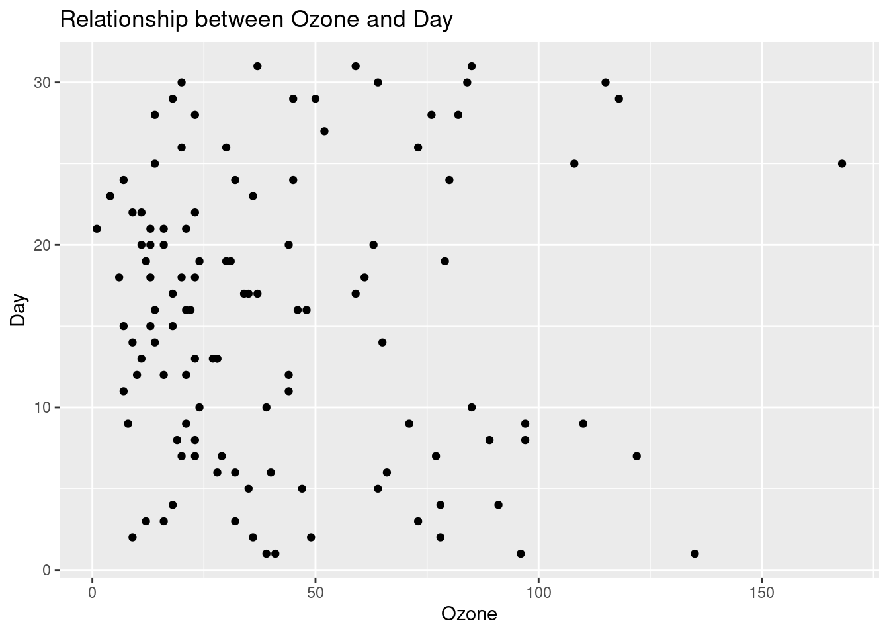

## Automate joining

### Objective 

- Learning how to use `reduce()` to automate joining multiple dataframes

### Problem 

- How can you make joining multiple dataframes more efficient?

- Note that we will use `dplyr::left_join() = merge(x, y, all.x = TRUE)`.


```r
df1 <- tibble(
  x = sample(1:10, size = 3, replace = TRUE),
  y = sample(1:10, size = 3, replace = TRUE),
  z = sample(1:10, size = 3, replace = TRUE)
)

df2 <- tibble(
  x = sample(1:10, size = 3, replace = TRUE),
  y = sample(1:10, size = 3, replace = TRUE),
  z = sample(1:10, size = 3, replace = TRUE)
)

df3 <- tibble(
  x = sample(1:10, size = 3, replace = TRUE),
  y = sample(1:10, size = 3, replace = TRUE),
  z = sample(1:10, size = 3, replace = TRUE)
)
```

### Copy and paste


```r
first_join <- left_join(df1, df2)
```

```
## Joining, by = c("x", "y", "z")
```

```r
second_join <- left_join(first_join, df3)
```

```
## Joining, by = c("x", "y", "z")
```

```r
second_join
```

```
## # A tibble: 3 x 3
##       x     y     z
##   <int> <int> <int>
## 1     8     5     8
## 2     4     8     3
## 3     4     4     4
```

- **Challenge**
Why the above solution is not efficient?

### reduce 


    - Input: Takes a vector of length n
  
    - Computation: Calls a function with a pair of values at a time
  
    - Output: Returns a vector of length 1
    

```r
reduced <- reduce(list(df1, df2, df3), left_join)
```

```
## Joining, by = c("x", "y", "z")
## Joining, by = c("x", "y", "z")
```

```r
reduced
```

```
## # A tibble: 3 x 3
##       x     y     z
##   <int> <int> <int>
## 1     8     5     8
## 2     4     8     3
## 3     4     4     4
```

## Make automation slower or faster 

### Objectives 

- Learning how to use `slowly()` and `future_` to make automation process either slower or faster

### How to make automation slower

- Scraping 50 pages from a website and you don't want to overload the server. How can you do that?

### For loop 


### Map 

- `walk()` works same as `map()` but doesn't store its output. 


- If you're web scraping, one problem with this approach is it's too fast by human standards.


- If you want to make the function run slowly ... 

> slowly() takes a function and modifies it to wait a given amount of time between each call. - `purrr` package vignette 
- If a function is a verb, then a helper function is an adverb (modifying the behavior of the verb). 


### How to make automation Faster 

In a different situation, you want to make your function run faster. This is a common situation when you collect and analyze data at large-scale. You can solve this problem using parallel processing. For more on the parallel processing in R, read [this review](https://yxue-me.com/post/2019-05-12-a-glossary-of-parallel-computing-packages-in-r-2019/).

- Parallel processing setup 

    - Step1: Determine the number of max workers (`availableCores()`)
    
    - Step2: Determine the parallel processing mode (`plan()`) 


## Make error handling easier

### Learning objective 

- Learning how to use `safely()` and `possibly()` to make error handling easier 
### Problem 

- **Challenge**

- Explain why we can't run `map(url_lists, read_html)`


```r
url_lists <- c(
  "https://en.wikipedia.org/wiki/University_of_California,_Berkeley",
  "https://en.wikipedia.org/wiki/Stanford_University",
  "https://en.wikipedia.org/wiki/Carnegie_Mellon_University",
  "https://DLAB"
)
```


```r
map(url_lists, read_html)
```

- This is a very simple problem so it's easy to tell where the problem is. How can you make your error more informative? 

### Solution 

#### Try-catch 

- There are three kinds of messages you will run into, if your code has an error based on the following functions.  

    - `stop()`: errors; Functions must stop. 
    - `warning()`: warnings; Functions may still work. Nonetheless, something is possibly messed up. 
    - `message()`: messages; Some actions happened. 
    
- The basic logic of `try-catch`, R's basic error handling function, works like the following. 


```r
tryCatch(
  {
    map(url_lists, read_html)
  },
  warning = function(w) {
    "Warning"
  },
  error = function(e) {
    "Error"
  },
  finally = {
    "Message"
  }
)
```

```
## [1] "Error"
```

- Here's `purrr` version of the `try-catch` mechanism (evaluates code and assigns exception handlers). 

#### safely

**Outputs** 

- result: result or `NULL`
- error: `NULL` or `error` 


```r
map(url_lists, safely(read_html))
```

```
## [[1]]
## [[1]]$result
## NULL
## 
## [[1]]$error
## <simpleError in open.connection(x, "rb"): Timeout was reached: [en.wikipedia.org] Connection timed out after 10001 milliseconds>
## 
## 
## [[2]]
## [[2]]$result
## NULL
## 
## [[2]]$error
## <simpleError in open.connection(x, "rb"): Timeout was reached: [en.wikipedia.org] Connection timed out after 10002 milliseconds>
## 
## 
## [[3]]
## [[3]]$result
## NULL
## 
## [[3]]$error
## <simpleError in open.connection(x, "rb"): Timeout was reached: [en.wikipedia.org] Connection timed out after 10001 milliseconds>
## 
## 
## [[4]]
## [[4]]$result
## NULL
## 
## [[4]]$error
## <simpleError in open.connection(x, "rb"): Could not resolve host: DLAB>
```

- The easier way to solve this problem is just avoiding the error.


```r
map(url_lists, safely(read_html)) %>%
  map("result") %>% 
  # = map(function(x) x[["result"]]) = map(~.x[["name"]])
  purrr::compact() # Remove empty elements
```

```
## list()
```

#### possibly 

What if the best way to solve the problem is not ignoring the error ... 


```r
# If error occurred, "The URL is broken." will be stored in that element(s).
out <- map(
  url_lists,
  possibly(read_html,
    otherwise = "The URL is broken."
  )
)

# Let's find the broken URL.
url_lists[out[seq(out)] == "The URL is broken."]
```

```
## [1] "https://en.wikipedia.org/wiki/University_of_California,_Berkeley"
## [2] "https://en.wikipedia.org/wiki/Stanford_University"               
## [3] "https://en.wikipedia.org/wiki/Carnegie_Mellon_University"        
## [4] "https://DLAB"
```

## Developing your own data tools

### Why developing R packages? 

1. Reuse your code 
2. Automate your workflow 
3. Help others (be part of an open source development community)

### Workflow 

1. Write code in `\R`
2. Document code in `\man` (automated by `roxygen2` package)
  - `devtools::document()` 
3. Check dependencies in `NAMESPACE`
  - `devtools::update()` updates the documentation 
  - `devtools::check()` to see whether your package is ready to be submitted to CRAN
4. Build a package (for more information, read [this section](http://r-pkgs.had.co.nz/package.html) in Hadley's R package development book)
  - `devtools::build()` 
5. (Optional) Test (`devtools::test()`), teach in `\vignettes`, and add data in `\data`
6. Distribute the package either via CRAN or GitHub  

![]http://r-pkgs.had.co.nz/diagrams/package-files.png

### Developing an R package 

The 4 required components are necessary to build and distribute a minimally viable R package. The other steps are optional.

### Required Components

- Package 
  - `\R`: R functions 
  - `\man`: function documentations 
  - DESCRIPTION: provides meta data about the package (e.g., author)
  - LICENSE
    - GNU, MIT, etc.
  - NAMESPACE: package dependencies (to make your package self-contained)
  - README (optional)
  
1. Setup (**DESCRIPTION**)


```r
# This function creates DESCRIPTION file 
usethis::create_package(here("mypkg"))

# Initialize git repo 
usethis::use_git()

# License the package 
# You can use the MIT license by typing devtools::use_mit_license("author name"). The function produces MIT license related files (LICENSE, LICENSE.md).
use_mit_license("Jae Yeon Kim")

# Add README (optional)
# Makes the package more use-friendly 
use_readme_md()

# Add news (optional) 
# Helps track changes 
use_news_md() 
```

2. Write code (**R**)


```r
usethis::use_r("rbind_mutate")
```

```r
#' Add two numbers
#'
#' @param x A number
#' @param y A number
#' @return The sum of x and y 
#' @export

add <- function(x, y){
  
  x + y
  
}
```

3. Document (**man**)


```r
# Document 
# The function creates documentation related files (NAMESPACE, function_name.rd)
devtools::document()

# Load all 
devtools::load_all()

# Check 
devtools::check()
```

4. Organize (**NAMESPACE**)


```r
usethis::use_package("dplyr")
```

### Optional Components  
1. Test (**test**)


```r
usethis::use_testthat()

usethis::use_test("rbind_mutate")
```

3. Add data (**data**)


```r
x <- "Jae"
y <- "Sun"
z <- "Jane"

usethis::use_data(x, y, z, overwrite = TRUE)
```

4. Teach (**vignetts**)


```r
usethis::use_vignette("rbind_mutate")
```

```r
title: "Vignette title"
author: "Vignette author"
date: "2020-10-09"
output: rmarkdown::html_vignette
vignette: blah blah
``` 

- You can build a package website using `pkgdown`


```r
# install.packages("pkgdown")
usethis::use_pkgdown()
pkgdown::build_site()
```

- A package site includes information on METADATA, Function references, Articles, News, etc. 

### Building an R package 

- CMD (in the terminal)

You can run R commands in the terminal using R CMD.

```sh
R CMD build mypkg 
R CMD INSTALL mypkg 
```

- devtools 


```r
# Build 
devtools::build()

# Install 
devtools::install()
```

### Distributing an R package 


```r
# Version update 
usethis::use_version()

# Spell check
usethis::use_spell_check()
```

1. [CRAN (The Comprehensive R Archive Network)](https://cran.r-project.org/)
  - R package submission should comply with [the CRAN Repository Policy](https://cran.r-project.org/)
2. GitHub 
  - Push everything to the Git repository (you can do it using command-line interface or RStudio).

```sh 
git add . 
git commit -m "first push"
git push 
```
  - Don't forget that your repository should be `public`.
  - I highly recommend connecting GitHub with SSH. For more information, visit [this link](https://docs.github.com/en/github/authenticating-to-github/connecting-to-github-with-ssh).
  
```sh
git remote set-url origin git@github.com:user/repo 
```

<!--chapter:end:03_functional_programming.Rmd-->

# Semi-structured data {#semi_structured_data}

## Objectives

-   Automating the process of turning semi-structured data (input) into structured data (output)

## What is semi-structured data?

> Semi-structured data is a form of structured data that does not obey the tabular structure of data models associated with relational databases or other forms of data tables, but nonetheless contains tags or other markers to separate semantic elements and enforce hierarchies of records and fields within the data. Therefore, it is also known as self-describing structure. - [Wikipedia](https://en.wikipedia.org/wiki/Semi-structured_data#:~:text=Semi%2Dstructured%20data%20is%20a,and%20fields%20within%20the%20data.)

-   Examples: `HTML (Hypertext Markup Language)` files (e.g., websites) and `JSON (JavaScript Object Notation)` files (e.g., tweets)

-   Why should we care semi-structured data?

    -   Because this is what the data frontier looks like: \# of unstructured data \> \# of semi-structured data \> \# of structured data
    -   There are easy and fast ways to turn semi-structured data into structured data (ideally in a tidy format) using R, Python, and command-line tools. See my own examples ([tidyethnicnews](https://github.com/jaeyk/tidyethnicnews) and [tidytweetjson](https://github.com/jaeyk/tidytweetjson)).

## Workflow

1.  Import/connect to a semi-structured file using `rvest,` `jsonlite,` `xml2,` `pdftools,` `tidyjson`, etc.

2.  Define target elements in the single file and extract them

-   [`readr`](https://readr.tidyverse.org/) package providers `parse_` functions that are useful for vector parsing.

-   [`stringr`](https://stringr.tidyverse.org/) package for string manipulations (e.g., using regular expressions in a tidy way). Quite useful for parsing PDF files (see [this example](https://themockup.blog/posts/2020-04-03-beer-and-pdftools-a-vignette/)).

-   [`rvest`](https://github.com/tidyverse/rvest) package for parsing HTML (R equivalent to `beautiful soup` in Python)

-   [`tidyjson`](https://github.com/sailthru/tidyjson) package for parsing JSON data

3.  Create a list of files (in this case URLs) to parse

4.  Write a parsing function

5.  Automate parsing process

## HTML/CSS: web scraping

## XML/JSON: social media scraping

### API

#### Objectives

-   Learning what kind of social media data are accessible through application programming interfaces (APIs)

**Review question**

In the previous session, we learned the difference between semi-structured data and structured data. Can anyone tell us the difference between them?

#### The big picture for digital data collection

1.  Input: semi-structured data

2.  Output: structured data

3.  Process:

    -   Getting **target data** from a remote server

        -   The target data is usually huge (\>10GB) by the traditional social science standard.

    -   Parsing the target data your laptop/database

        -   Laptop (sample-parse): Downsamle the large target data and parse it on your laptop. This is just one option to [deal with big data in R](https://rviews.rstudio.com/2019/07/17/3-big-data-strategies-for-r/). It's a simple strategy as it doesn't require storing target data in your own database.

    -   Database (push-parse): Push the large target data to a database, then explore, select, and filter it. If you were interested in using this option, then check out my [SQL for R Users](https://github.com/dlab-berkeley/sql-for-r-users) workshop.


-   But what exactly is this target data?

    -   When you scrape websites, you mostly deal with HTML (defines a structure of a website), CSS (its style), and JavaScript (its dynamic interactions).

    -   When you access social media data through API, you deal with either XML or JSON (major formats for storing and transporting data; they are light and flexible).

    -   XML and JSON have tree-like (nested; a root and branches) structures and keys and values (or elements and attributes).

    -   If HTML, CSS, and JavaScript are storefronts, then XML and JSON are warehouses.


#### Opportunities and challenges for parsing social media data

This explanation draws on Pablo Barbara's [LSE social media workshop slides](http://pablobarbera.com/social-media-workshop/social-media-slides.pdf).

**Basic information**

-   What is an API?: An interface (you can think of it as something akin to a restaurant menu. API parameters are menu items.)

    -   [REST](https://en.wikipedia.org/wiki/Representational_state_transfer) (Representational state transfer) API: static information (e.g., user profiles, list of followers and friends)

        -   R packages: [tweetscores](https://github.com/pablobarbera/twitter_ideology/tree/master/pkg/tweetscores), [twitteR](https://cran.r-project.org/web/packages/twitteR/twitteR.pdf), [rtweet](https://github.com/ropensci/rtweet)

    -   [Streaming API](https://blog.axway.com/amplify/api-management/streaming-apis#:~:text=Streaming%20APIs%20are%20used%20to,a%20subset%20of%20Streaming%20APIS.): dynamic information (e..g, new tweets)

        -   This streaming data is filtered by (1) keywords, (2) location, and (3) sample (1% of the total tweets)
        -   R packages: [streamR](https://github.com/pablobarbera/streamR)

**Status**

-   Twitter API is still widely accessible ([v2](https://developer.twitter.com/en/docs/twitter-api/early-access) recently released; new fields available such as [conversation threads](https://developer.twitter.com/en/docs/twitter-api/conversation-id)).

> Twitter data is unique from data shared by most other social platforms because it reflects information that users *choose* to share publicly. Our API platform provides broad access to public Twitter data that users have chosen to share with the world. - Twitter Help Center

-   What does this policy mean? If Twitter users don't share the locations of their tweets (e.g., GPS), you can't collect them.

-   Facebook API access has become much constrained with [the exception of Social Science One](https://socialscience.one/blog/unprecedented-facebook-urls-dataset-now-available-research-through-social-science-one) since the 2016 U.S. election.

-   [YouTube API](https://developers.google.com/youtube/v3) access is somewhat limited (but you need to check as I'm not updated on this).

**Upside**

-   Legal and well-documented.

Web scraping (Wild Wild West) \<\> API (Big Gated Garden)

-   You have legal but limited access to (growing) big data that can be divided into text, image, and video and transformed into cross-sectional (geocodes), longitudinal (timestamps), and event historical data (hashtags). For more information, see Zachary C. Steinert-Threlkeld's [2020 APSA Short Course Generating Event Data From Social Media](https://github.com/ZacharyST/APSA2020_EventDataFromSocialMedia).

-   Social media data are also well-organized, managed, and curated data. It's easy to navigate because XML and JSON have keys and values. If you find keys, you will find observations you look for.

**Downside**

1.  Rate-limited.

2.  If you want to access to more and various data than those available, you need to pay for premium access.

#### Next steps

-   If you want to know how to sign up a new Twitter developer account and access Twitter API, then see Steinert-Threlkeld's [APSA workshop slides](https://github.com/ZacharyST/APSA2020_EventDataFromSocialMedia/blob/master/Presentation/02_AccessTwitter.pdf).

-   If you want to know about how to use `tweetscore` package, then see Pablo Barbara's R markdown file for [scraping data from Twitter's REST API](http://pablobarbera.com/social-media-workshop/code/02-twitter-REST-data-collection.html)

### Hydrating

#### Objectives

-   Learning how hydrating works
-   Learning how to use [Twarc](https://github.com/DocNow/twarc) to communicate with Twitter's API

**Review question**

What are the main two types of Twitter's API?

#### Hydrating: An Alternative Way to Collect Historical Twitter Data

-   You can collect Twitter data using Twitter's API or you can hydrate Tweet IDs collected by other researchers. This is a good resource to collect historical Twitter data.

-   [Covid-19 Twitter chatter dataset for scientic use](http://www.panacealab.org/covid19/) by Panacealab

-   [Women's March Dataset](https://dataverse.harvard.edu/dataset.xhtml?persistentId=doi:10.7910/DVN/5ZVMOR) by Littman and Park

-   Harvard Dataverse has a number of dehydrated Tweet IDs that could be of interest to social scientists.


#### Twarc: one solution to (almost) all Twitter's API problems

-   Why Twarc?

    -   A command-line tool and Python library that works for almost every Twitter's API related problem.

    -   It's really well-documented, tested, and maintained.

        -   [Twarc documentation](https://scholarslab.github.io/learn-twarc/06-twarc-command-basics) covers basic commands.
        -   [Tward-cloud documentation](https://twarc-cloud.readthedocs.io/_/downloads/en/stable/pdf/) explains how to collect data from Twitter's API using Twarc running in [Amazon Web Services](https://aws.amazon.com/) (AWS).

    -   Twarc was developed as part of the [Documenting the Now](https://www.docnow.io/) project which was funded by the Mellon Foundation.


-   There's no reason to be afraid of using a command-line tool and Python library, even though you primarily use R. It's easy to embed [Python code](https://bookdown.org/yihui/rmarkdown/language-engines.html#python) and [shell scripts](https://bookdown.org/yihui/rmarkdown/language-engines.html#shell-scripts) in R Markdown.

-   Even though you don't know how to write Python code or shell scripts, it's really useful to know how to integrate them in your R workflow.

-   I assume that you have already installed [Python 3](https://www.python.org/download/releases/3.0/).


```bash
pip3 install twarc
```

##### Applications

The following examples are created by [the University of Virginia library](http://digitalcollecting.lib.virginia.edu/toolkit/docs/social-media/twarc-commands/).

###### Search

-   Download pre-existing tweets (7-day window) matching certain conditions

-   In command-line, `>` = Create a file

-   I recommend running the following commands in the terminal because it's more stable than doing so in R Markdown.


```bash
# Key word 
twarc search blacklivesmatter > blm_tweets.jsonl
```


```bash
# Hashtag 
twarc search '#blacklivesmatter' > blm_tweets_hash.jsonl
```


```bash
# Hashtag + Language 
twarc search '#blacklivesmatter' --lang en > blm_tweets_hash.jsonl
```

-   It is really important to **save these tweets into a `jsonl` format;** `jsonl` extension refers to JSON **Lines** files. This structure is useful for splitting JSON data into smaller chunks, if it is too large.

###### Filter

-   Download tweets meeting certain conditions as they happen.


```bash
# Key word
twarc filter blacklivesmatter > blm_tweets.jsonl
```

###### Sample

-   Use Twitter's random sample of recent tweets.


```bash
twarc sample > tweets.jsonl 
```

###### Hydrate

-   Tweet IDs -\> Tweets


```bash
twarc hydrate tweet_ids.txt > tweets.jsonl 
```

###### Dehydrate

-   Hydrate \<\> Dehydrate
-   Tweets -\> Tweet IDs


```bash
twarc dehydrate tweets.jsonl > tweet_ids.txt
```

**Challenge**

1.  Collect tweets contain some key words of your choice using `twarc search` and save them as `tweets.jsonl`.

2.  Using `less` command in the terminal, inspect `twarc.log`.

3.  Using `less` command in the terminal, inspect `tweets.json`.

### Parsing JSON


```r
# Install packages 
if (!require("pacman")) install.packages("pacman")
```

```
## Loading required package: pacman
```

```r
pacman::p_load(tidyverse, # tidyverse pkgs including purrr
               furrr, # parallel processing 
               tictoc, # performance test  
               tcltk, # GUI for choosing a dir path 
               tidyjson) # tidying JSON files 

## Install the current development version from GitHub
devtools::install_github("jaeyk/tidytweetjson",
                         dependencies = TRUE)
```

```
## Skipping install of 'tidytweetjson' from a github remote, the SHA1 (a1d9cf14) has not changed since last install.
##   Use `force = TRUE` to force installation
```

```r
library(tidytweetjson)
```

#### Objectives

-   Learning chunk and pull strategy
-   Learning how `tidyjson` works
-   Learning how to apply `tidyjson` to tweets

#### Chunk and Pull

##### Problem

-   What if the size of the Twitter data you downloaded is too big (e.g., \>10GB) to do complex wrangling in R?

##### Solution


Step1: Split the large JSON file in small chunks.


```bash
#Divide the JSON file by 100 lines (tweets)

# Linux and Windows (in Bash)
$ split -100 search.jsonl

# macOS
$ gsplit -100 search.jsonl
```

-   After that, you will see several files appeared in the directory. Each of these files should have 100 tweets or fewer. All of these file names **should start with "x", as in "xaa".**

Step 2: Apply the parsing function to each chunk and pull all of these chunks together.


```r
# You need to choose a Tweet JSON file
filepath <- file.choose()

# Assign the parsed result to the `df` object
# 11.28 sec elapsed to parse 17,928 tweets 
tic()
df <- jsonl_to_df(filepath)
toc()
```


```r
# Setup 
n_cores <- availableCores() - 1

n_cores # This number depends on your computer spec.

plan(multiprocess, # multicore, if supported, otherwise multisession
     workers = n_cores) # the maximum number of workers

# You need to designate a directory path where you saved the list of JSON files.

# 9.385 sec elapsed to parse 17,928 tweets 

dirpath <- tcltk::tk_choose.dir()

tic()
df_all <- tidytweetjson::jsonl_to_df_all(dirpath)
toc()
```

##### tidyjson

The [`tidyjson`](https://cran.r-project.org/web/packages/tidyjson/vignettes/introduction-to-tidyjson.html) package helps to use tidyverse framework to JSON data.

-   toy example


```r
# JSON collection; nested structure + keys and values 
worldbank[1]
```

```
## [1] "{\"_id\":{\"$oid\":\"52b213b38594d8a2be17c780\"},\"boardapprovaldate\":\"2013-11-12T00:00:00Z\",\"closingdate\":\"2018-07-07T00:00:00Z\",\"countryshortname\":\"Ethiopia\",\"majorsector_percent\":[{\"Name\":\"Education\",\"Percent\":46},{\"Name\":\"Education\",\"Percent\":26},{\"Name\":\"Public Administration, Law, and Justice\",\"Percent\":16},{\"Name\":\"Education\",\"Percent\":12}],\"project_name\":\"Ethiopia General Education Quality Improvement Project II\",\"regionname\":\"Africa\",\"totalamt\":130000000}"
```

```r
# Check out keys (objects)
worldbank %>% 
  as.tbl_json() %>%
  gather_object() %>%
  filter(document.id == 1)
```

```
## # A tbl_json: 8 x 3 tibble with a "JSON" attribute
##   ..JSON                  document.id name               
##   <chr>                         <int> <chr>              
## 1 "{\"$oid\":\"52b213..."           1 _id                
## 2 "\"2013-11-12T00:..."             1 boardapprovaldate  
## 3 "\"2018-07-07T00:..."             1 closingdate        
## 4 "\"Ethiopia\""                    1 countryshortname   
## 5 "[{\"Name\":\"Educa..."           1 majorsector_percent
## 6 "\"Ethiopia Gener..."             1 project_name       
## 7 "\"Africa\""                      1 regionname         
## 8 "130000000"                       1 totalamt
```


```r
# Get the values associated with the keys 
worldbank %>% 
  as.tbl_json() %>% # Turn JSON into tbl_json object 
  enter_object("project_name") %>% # Enter the objects 
  append_values_string() %>% # Append the values 
  as_tibble() # To reduce the size of the file 
```

```
## # A tibble: 500 x 2
##    document.id string                                                           
##          <int> <chr>                                                            
##  1           1 Ethiopia General Education Quality Improvement Project II        
##  2           2 TN: DTF Social Protection Reforms Support                        
##  3           3 Tuvalu Aviation Investment Project - Additional Financing        
##  4           4 Gov't and Civil Society Organization Partnership                 
##  5           5 Second Private Sector Competitiveness and Economic Diversificati…
##  6           6 Additional Financing for Cash Transfers for Orphans and Vulnerab…
##  7           7 National Highways Interconnectivity Improvement Project          
##  8           8 China Renewable Energy Scale-Up Program Phase II                 
##  9           9 Rajasthan Road Sector Modernization Project                      
## 10          10 MA Accountability and Transparency DPL                           
## # … with 490 more rows
```

-   The following example draws on my [tidytweetjson](https://github.com/jaeyk/tidytweetjson) R package. The package applies `tidyjson` to Tweets.

###### Individual file


```r
jsonl_to_df <- function(file_path){

# Save file name 

file_name <- strsplit(x = file_path, 
                     split = "[/]") 

file_name <- file_name[[1]][length(file_name[[1]])]

# Import a Tweet JSON file

listed <- read_json(file_path, format = c("jsonl"))

# IDs of the tweets with country codes

ccodes <- listed %>%
  enter_object("place") %>%
  enter_object("country_code") %>%
  append_values_string() %>%
  as_tibble() %>%
  rename("country_code" = "string")

# IDs of the tweets with location

locations <- listed %>%
  enter_object("user") %>%
  enter_object("location") %>%
  append_values_string() %>%
  as_tibble() %>%
  rename(location = "string")

# Extract other key elements from the JSON file

df <- listed %>%
  spread_values(
    id = jnumber("id"),
    created_at = jstring("created_at"),
    full_text = jstring("full_text"),
    retweet_count = jnumber("retweet_count"),
    favorite_count = jnumber("favorite_count"),
    user.followers_count = jnumber("user.followers_count"),
    user.friends_count = jnumber("user.friends_count")
  ) %>%
	  as_tibble

message(paste("Parsing", file_name, "done."))

# Full join
outcome <- full_join(ccodes, df) %>% full_join(locations)

# Or you can write this way: outcome <- reduce(list(df, ccodes, locations), full_join)

# Select
outcome %>% select(-c("document.id"))}
```

###### Many files

-   Set up parallel processing.


```r
n_cores <- availableCores() - 1

n_cores # This number depends on your computer spec.
```

```
## system 
##      7
```

```r
plan(multiprocess, # multicore, if supported, otherwise multisession
     workers = n_cores) # the maximum number of workers
```

```
## Warning: [ONE-TIME WARNING] Forked processing ('multicore') is disabled
## in future (>= 1.13.0) when running R from RStudio, because it is
## considered unstable. Because of this, plan("multicore") will fall
## back to plan("sequential"), and plan("multiprocess") will fall back to
## plan("multisession") - not plan("multicore") as in the past. For more details,
## how to control forked processing or not, and how to silence this warning in
## future R sessions, see ?future::supportsMulticore
```

-   Parsing in parallel.

**Review**

There are at least three ways you can use function + `purrr::map()`.


```r
squared <- function(x){
  x*2 
}

# Named function 
map(1:3, squared)

# Anonymous function 
map(1:3, function(x){ x *2 })

# Using formula; ~ = formula, .x = input 
map(1:3,~.x*2)
```


```r
# Create a list of file paths 
filename <- list.files(dir_path,
          pattern = '^x',
          full.names = TRUE)

df <- filename %>%

# Apply jsonl_to_df function to items on the list
future_map(~jsonl_to_df(.)) %>%

# Full join the list of dataframes
reduce(full_join,
       by = c("id",
              "location",
              "country_code",
              "created_at",
              "full_text",
              "retweet_count",
              "favorite_count",
              "user.followers_count",
              "user.friends_count"))

# Output
df
```

<!--chapter:end:04_semi_structured_data.Rmd-->

# High-dimensional data {#machine_learning}

## Overview 

- The rise of high-dimensional data. The new data frontiers in social sciences---text ([Gentzkow et al. 2019](https://web.stanford.edu/~gentzkow/research/text-as-data.pdf); [Grimmer and Stewart 2013](https://www.jstor.org/stable/pdf/24572662.pdf?casa_token=SQdSI4R_VdwAAAAA:4QiVLhCXqr9f0qNMM9U75EL5JbDxxnXxUxyIfDf0U8ZzQx9szc0xVqaU6DXG4nHyZiNkvcwGlgD6H0Lxj3y0ULHwgkf1MZt8-9TPVtkEH9I4AHgbTg)) and and image ([Joo and Steinert-Threlkeld 2018](https://arxiv.org/pdf/1810.01544))---are all high-dimensional data. 

    - 1000 common English words for 30-word tweets: $1000^{30}$ similar to N of atoms in the universe ([Gentzkow et al. 2019](https://web.stanford.edu/~gentzkow/research/text-as-data.pdf))

    - Belloni, Alexandre, Victor Chernozhukov, and Christian Hansen. ["High-dimensional methods and inference on structural and treatment effects."](https://pubs.aeaweb.org/doi/pdfplus/10.1257/jep.28.2.29) *Journal of Economic Perspectives 28*, no. 2 (2014): 29-50.

- The rise of new approach: statistics + computer science = machine learning 

- Statistical inference 

    - $y$ <- some probability models (e.g., linear regression, logistic regression) <- $x$
       
    - $y$ = $X\beta$ + $\epsilon$
        
    - The goal is to estimate $\beta$

- Machine learning 

    - $y$ <- unknown <- $x$ 
    
    - $y$ <-> decision trees, neutral nets <-> $x$
        
    - For the main idea behind prediction modeling, see Breiman, Leo (Berkeley stat faculty who passed away in 2005). ["Statistical modeling: The two cultures (with comments and a rejoinder by the author)."](https://projecteuclid.org/euclid.ss/1009213726) *Statistical science* 16, no. 3 (2001): 199-231.
    
    - "The problem is to find an algorithm $f(x)$ such that for future $x$ in a test set, $f(x)$ will be a good predictor of $y$."
    
    - "There are **two cultures** in the use of statistical modeling to reach conclusions from data. One assumes that the data are generated by a **given** **stochastic data model**. The other uses **algorithmic models** and treats the data mechanism as **unknown**."

> Algorithmic models, both in theory and practice, has developed rapidly in fields of outside statistics. It can be used on large complex data sets and as a more accurate and informative alternative to data modeling on smaller data sets. - Leo Breiman

- How ML differs from econometrics? 

- A review by Athey, Susan, and Guido W. Imbens. ["Machine learning methods that economists should know about."](https://www.annualreviews.org/doi/full/10.1146/annurev-economics-080217-053433) *Annual Review of Economics* 11 (2019): 685-725.
        
- Stat:
  
    - Specifying a target (i.e., an estimand)

    - Fitting a model to data using an objective function (e.g., the sum of squared errors)

    - Reporting point estimates (effect size) and standard errors (uncertainty)

    - Validation by yes-no using goodness-of-fit tests and residual examination

- ML: 

    - Developing algorithms (estimating *f(x)*)

    - Prediction power not structural/causal parameters

    - Basically, high-dimensional data statistics (N < P)

    - The major problem is to avoid ["the curse of dimensionality"](https://en.wikipedia.org/wiki/Curse_of_dimensionality) ([too many features - > overfitting](https://towardsdatascience.com/the-curse-of-dimensionality-50dc6e49aa1e))

    - Validation: out-of-sample comparisons (cross-validation) not in-sample goodness-of-fit measures

    - So, it's curve-fitting but the primary focus is unseen (test data) not seen data (training data)

- A quick review on ML lingos for those trained in econometrics 

    - Sample to estimate parameters = Training sample
  
    - Estimating the model = Being trained 
    - Regressors, covariates, or predictors = Features 
  
    - Regression parameters = weights 
  
    - Prediction problems = Supervised (some $y$ are known) + Unsupervised ($y$ unknown)
    
. Many images in this chapter come from vas3k blog.](https://i.vas3k.ru/7w9.jpg)

](https://i.vas3k.ru/7vz.jpg)

](https://i.vas3k.ru/7vx.jpg)

](https://i.vas3k.ru/7w1.jpg)

## Dataset  

- [Heart disease data from UCI](https://archive.ics.uci.edu/ml/datasets/heart+Disease)

- One of the popular datasets used in machine learning competitions 


```r
# Load packages 

## CRAN packages 
pacman::p_load(here,
               tidyverse, 
               tidymodels,
               doParallel, # parallel processing 
               patchwork) # arranging ggplots 

## Jae's custom functions 
source(here("functions", "ml_utils.r"))

# Import the dataset 

data_original <- read_csv(here("data", "heart.csv"))
```

```
## 
## ── Column specification ───────────────────────────────────
## cols(
##   age = col_double(),
##   sex = col_double(),
##   cp = col_double(),
##   trestbps = col_double(),
##   chol = col_double(),
##   fbs = col_double(),
##   restecg = col_double(),
##   thalach = col_double(),
##   exang = col_double(),
##   oldpeak = col_double(),
##   slope = col_double(),
##   ca = col_double(),
##   thal = col_double(),
##   target = col_double()
## )
```

```r
glimpse(data_original)
```

```
## Rows: 303
## Columns: 14
## $ age      <dbl> 63, 37, 41, 56, 57, 57, 56, 44, 52, 57, 54, 48, 49, 64, 58, …
## $ sex      <dbl> 1, 1, 0, 1, 0, 1, 0, 1, 1, 1, 1, 0, 1, 1, 0, 0, 0, 0, 1, 0, …
## $ cp       <dbl> 3, 2, 1, 1, 0, 0, 1, 1, 2, 2, 0, 2, 1, 3, 3, 2, 2, 3, 0, 3, …
## $ trestbps <dbl> 145, 130, 130, 120, 120, 140, 140, 120, 172, 150, 140, 130, …
## $ chol     <dbl> 233, 250, 204, 236, 354, 192, 294, 263, 199, 168, 239, 275, …
## $ fbs      <dbl> 1, 0, 0, 0, 0, 0, 0, 0, 1, 0, 0, 0, 0, 0, 1, 0, 0, 0, 0, 0, …
## $ restecg  <dbl> 0, 1, 0, 1, 1, 1, 0, 1, 1, 1, 1, 1, 1, 0, 0, 1, 1, 1, 1, 1, …
## $ thalach  <dbl> 150, 187, 172, 178, 163, 148, 153, 173, 162, 174, 160, 139, …
## $ exang    <dbl> 0, 0, 0, 0, 1, 0, 0, 0, 0, 0, 0, 0, 0, 1, 0, 0, 0, 0, 0, 0, …
## $ oldpeak  <dbl> 2.3, 3.5, 1.4, 0.8, 0.6, 0.4, 1.3, 0.0, 0.5, 1.6, 1.2, 0.2, …
## $ slope    <dbl> 0, 0, 2, 2, 2, 1, 1, 2, 2, 2, 2, 2, 2, 1, 2, 1, 2, 0, 2, 2, …
## $ ca       <dbl> 0, 0, 0, 0, 0, 0, 0, 0, 0, 0, 0, 0, 0, 0, 0, 0, 0, 0, 0, 2, …
## $ thal     <dbl> 1, 2, 2, 2, 2, 1, 2, 3, 3, 2, 2, 2, 2, 2, 2, 2, 2, 2, 2, 2, …
## $ target   <dbl> 1, 1, 1, 1, 1, 1, 1, 1, 1, 1, 1, 1, 1, 1, 1, 1, 1, 1, 1, 1, …
```

```r
# Createa a copy 
data <- data_original

theme_set(theme_minimal())
```

- For more information on the Iowa housing data, read [Cook (2011)](http://jse.amstat.org/v19n3/decock.pdf). This is one of the famous datastets used in many prediction modeling competitions.

## Workflow 

- 1. Preprocessing
- 2. Model building
- 3. Model fitting
- 4. Model evaluation
- 5. Model tuning
- 6. Prediction


## tidymodels 

- Like `tidyverse`, `tidymodels` is a collection of packages.

    - [`rsample`](https://rsample.tidymodels.org/): for data splitting 
    
    - [`recipes`](https://recipes.tidymodels.org/index.html): for pre-processing
    
    - [`parsnip`](https://www.tidyverse.org/blog/2018/11/parsnip-0-0-1/): for model building 
    
        - [`tune`](https://github.com/tidymodels/tune): parameter tuning 
    
    - [`yardstick`](https://github.com/tidymodels/yardstick): for model evaluations 
    
    - [`workflows`](https://github.com/tidymodels/workflows): for bundling a pieplne that bundles together pre-processing, modeling, and post-processing requests 
    
- Why taking a tidyverse approach to machine learning?

- Benefits 

    - Readable code 
    
    - Reusable data structures 
    
    - Extendable code


> tidymodels are an **integrated, modular, extensible** set of packages that implement a framework that facilitates creating predicative stochastic models. - Joseph Rickert@RStudio

- Currently, 238 models are [available](https://topepo.github.io/caret/available-models.html) 

- The following materials are based on [the machine learning with tidymodels workshop](https://github.com/dlab-berkeley/Machine-Learning-with-tidymodels) I developed for D-Lab. [The original workshop](https://github.com/dlab-berkeley/Machine-Learning-in-R) was designed by [Chris Kennedy](https://ck37.com/) and [Evan Muzzall](https://dlab.berkeley.edu/people/evan-muzzall.

## Pre-processing

- [`recipes`](https://recipes.tidymodels.org/index.html): for pre-processing

- [`textrecipes`](https://github.com/tidymodels/textrecipes) for text pre-processing

- Step 1: `recipe()` defines target and predictor variables (ingredients).

- Step 2: `step_*()` defines preprocessing steps to be taken (recipe).

    The list of the preprocessing steps draws on the vignette of the [`parsnip`](https://www.tidymodels.org/find/parsnip/) package.

    - dummy: Also called one-hot encoding

    - zero variance: Removing columns (or features) with a single unique value  

    - impute: Imputing missing values

    - decorrelate: Mitigating correlated predictors (e.g., principal component analysis)

    - normalize: Centering and/or scaling predictors (e.g., log scaling)

    - transform: Making predictors symmetric 

- Step 3: `prep()` prepares a dataset to base each step on.

- Step 4: `bake()` applies the pre-processing steps to your datasets. 

In this course, we focus on two preprocessing tasks. 

- One-hot encoding (creating dummy/indicator variables)


```r
# Turn selected numeric variables into factor variables 
data <- data %>%
  dplyr::mutate(across(c("sex", "ca", "cp", "slope", "thal"), as.factor)) 

glimpse(data) 
```

```
## Rows: 303
## Columns: 14
## $ age      <dbl> 63, 37, 41, 56, 57, 57, 56, 44, 52, 57, 54, 48, 49, 64, 58, …
## $ sex      <fct> 1, 1, 0, 1, 0, 1, 0, 1, 1, 1, 1, 0, 1, 1, 0, 0, 0, 0, 1, 0, …
## $ cp       <fct> 3, 2, 1, 1, 0, 0, 1, 1, 2, 2, 0, 2, 1, 3, 3, 2, 2, 3, 0, 3, …
## $ trestbps <dbl> 145, 130, 130, 120, 120, 140, 140, 120, 172, 150, 140, 130, …
## $ chol     <dbl> 233, 250, 204, 236, 354, 192, 294, 263, 199, 168, 239, 275, …
## $ fbs      <dbl> 1, 0, 0, 0, 0, 0, 0, 0, 1, 0, 0, 0, 0, 0, 1, 0, 0, 0, 0, 0, …
## $ restecg  <dbl> 0, 1, 0, 1, 1, 1, 0, 1, 1, 1, 1, 1, 1, 0, 0, 1, 1, 1, 1, 1, …
## $ thalach  <dbl> 150, 187, 172, 178, 163, 148, 153, 173, 162, 174, 160, 139, …
## $ exang    <dbl> 0, 0, 0, 0, 1, 0, 0, 0, 0, 0, 0, 0, 0, 1, 0, 0, 0, 0, 0, 0, …
## $ oldpeak  <dbl> 2.3, 3.5, 1.4, 0.8, 0.6, 0.4, 1.3, 0.0, 0.5, 1.6, 1.2, 0.2, …
## $ slope    <fct> 0, 0, 2, 2, 2, 1, 1, 2, 2, 2, 2, 2, 2, 1, 2, 1, 2, 0, 2, 2, …
## $ ca       <fct> 0, 0, 0, 0, 0, 0, 0, 0, 0, 0, 0, 0, 0, 0, 0, 0, 0, 0, 0, 2, …
## $ thal     <fct> 1, 2, 2, 2, 2, 1, 2, 3, 3, 2, 2, 2, 2, 2, 2, 2, 2, 2, 2, 2, …
## $ target   <dbl> 1, 1, 1, 1, 1, 1, 1, 1, 1, 1, 1, 1, 1, 1, 1, 1, 1, 1, 1, 1, …
```
- Imputation 


```r
# Check missing values 

map_df(data, ~ is.na(.) %>% sum())
```

```
## # A tibble: 1 x 14
##     age   sex    cp trestbps  chol   fbs restecg thalach exang oldpeak slope
##   <int> <int> <int>    <int> <int> <int>   <int>   <int> <int>   <int> <int>
## 1     0     0     0        0     0     0       0       0     0       0     0
## # … with 3 more variables: ca <int>, thal <int>, target <int>
```

```r
# Add missing values 

data$oldpeak[sample(seq(data), size = 10)] <- NA

# Check missing values 

# Check the number of missing values 
data %>%
  map_df(~is.na(.) %>% sum())
```

```
## # A tibble: 1 x 14
##     age   sex    cp trestbps  chol   fbs restecg thalach exang oldpeak slope
##   <int> <int> <int>    <int> <int> <int>   <int>   <int> <int>   <int> <int>
## 1     0     0     0        0     0     0       0       0     0      10     0
## # … with 3 more variables: ca <int>, thal <int>, target <int>
```

```r
# Check the rate of missing values
data %>%
  map_df(~is.na(.) %>% mean())
```

```
## # A tibble: 1 x 14
##     age   sex    cp trestbps  chol   fbs restecg thalach exang oldpeak slope
##   <dbl> <dbl> <dbl>    <dbl> <dbl> <dbl>   <dbl>   <dbl> <dbl>   <dbl> <dbl>
## 1     0     0     0        0     0     0       0       0     0  0.0330     0
## # … with 3 more variables: ca <dbl>, thal <dbl>, target <dbl>
```
 
### Regression setup 

#### Outcome variable 


```r
# Continuous variable 
data$age %>% class()
```

```
## [1] "numeric"
```
#### Data splitting using random sampling 


```r
# for reproducibility 
set.seed(1234) 

# split 
split_reg <- initial_split(data, prop = 0.7)

# training set 
raw_train_x_reg <- training(split_reg)

# test set 
raw_test_x_reg <- testing(split_reg)
```

#### recipe 


```r
# Regression recipe 
rec_reg <- raw_train_x_reg %>%
  # Define the outcome variable 
  recipe(age ~ .) %>%
  # Median impute oldpeak column 
  step_medianimpute(oldpeak) %>%
  # Expand "sex", "ca", "cp", "slope", and "thal" features out into dummy variables (indicators). 
  step_dummy(c("sex", "ca", "cp", "slope", "thal"))

# Prepare a dataset to base each step on
prep_reg <- rec_reg %>% prep(retain = TRUE) 
```


```r
# x features 
train_x_reg <- juice(prep_reg, all_predictors())

test_x_reg <- bake(object = prep_reg, 
                   new_data = raw_test_x_reg, all_predictors())

# y variables 
train_y_reg <- juice(prep_reg, all_outcomes())$age %>% as.numeric()
test_y_reg <- bake(prep_reg, raw_test_x_reg, all_outcomes())$age %>% as.numeric()

# Checks
names(train_x_reg) # Make sure there's no age variable!
```

```
##  [1] "trestbps" "chol"     "fbs"      "restecg"  "thalach"  "exang"   
##  [7] "oldpeak"  "target"   "sex_X1"   "ca_X1"    "ca_X2"    "ca_X3"   
## [13] "ca_X4"    "cp_X1"    "cp_X2"    "cp_X3"    "slope_X1" "slope_X2"
## [19] "thal_X1"  "thal_X2"  "thal_X3"
```

```r
class(train_y_reg) # Make sure this is a continuous variable!
```

```
## [1] "numeric"
```
- Note that other imputation methods are also available. 


```r
grep("impute", ls("package:recipes"), value = TRUE)
```

```
##  [1] "step_bagimpute"          "step_knnimpute"         
##  [3] "step_lowerimpute"        "step_meanimpute"        
##  [5] "step_medianimpute"       "step_modeimpute"        
##  [7] "step_rollimpute"         "tunable.step_bagimpute" 
##  [9] "tunable.step_knnimpute"  "tunable.step_meanimpute"
## [11] "tunable.step_rollimpute"
```

- You can also create your own `step_` functions. For more information, see [tidymodels.org](https://www.tidymodels.org/learn/develop/recipes/).

### Classification setup 

#### Outcome variable 


```r
data$target %>% class() 
```

```
## [1] "numeric"
```

```r
data$target <- as.factor(data$target)

data$target %>% class()
```

```
## [1] "factor"
```

#### Data splitting using stratified random sampling


```r
# split 
split_class <- initial_split(data %>%
                             mutate(target = as.factor(target)), 
                             prop = 0.7, 
                             strata = target)

# training set 
raw_train_x_class <- training(split_class)

# testing set 
raw_test_x_class <- testing(split_class)
```

#### recipe 


```r
# Classification recipe 
rec_class <- raw_train_x_class %>% 
  # Define the outcome variable 
  recipe(target ~ .) %>%
  # Median impute oldpeak column 
  step_medianimpute(oldpeak) %>%
  # Expand "sex", "ca", "cp", "slope", and "thal" features out into dummy variables (indicators).
  step_normalize(age) %>%
  step_dummy(c("sex", "ca", "cp", "slope", "thal")) 

# Prepare a dataset to base each step on
prep_class <- rec_class %>%prep(retain = TRUE) 
```


```r
# x features 
train_x_class <- juice(prep_class, all_predictors()) 
test_x_class <- bake(prep_class, raw_test_x_class, all_predictors())

# y variables 
train_y_class <- juice(prep_class, all_outcomes())$target %>% as.factor()
test_y_class <- bake(prep_class, raw_test_x_class, all_outcomes())$target %>% as.factor()

# Checks 
names(train_x_class) # Make sure there's no target variable!
```

```
##  [1] "age"      "trestbps" "chol"     "fbs"      "restecg"  "thalach" 
##  [7] "exang"    "oldpeak"  "sex_X1"   "ca_X1"    "ca_X2"    "ca_X3"   
## [13] "ca_X4"    "cp_X1"    "cp_X2"    "cp_X3"    "slope_X1" "slope_X2"
## [19] "thal_X1"  "thal_X2"  "thal_X3"
```

```r
class(train_y_class) # Make sure this is a factor variable!
```

```
## [1] "factor"
```

## Supervised learning

x -> f - > y (defined)

### OLS and Lasso

#### parsnip 

- Build models (`parsnip`)

1. Specify a model 
2. Specify an engine 
3. Specify a mode 


```r
# OLS spec 
ols_spec <- linear_reg() %>% # Specify a model 
  set_engine("lm") %>% # Specify an engine: lm, glmnet, stan, keras, spark 
  set_mode("regression") # Declare a mode: regression or classification 

# Lasso spec 
lasso_spec <- linear_reg(penalty = 0.1, # tuning parameter 
                         mixture = 1) %>% # 1 = lasso, 0 = ridge 
  set_engine("glmnet") %>%
  set_mode("regression") 

# If you don't understand parsnip arguments 
lasso_spec %>% translate() # See the documentation
```

```
## Linear Regression Model Specification (regression)
## 
## Main Arguments:
##   penalty = 0.1
##   mixture = 1
## 
## Computational engine: glmnet 
## 
## Model fit template:
## glmnet::glmnet(x = missing_arg(), y = missing_arg(), weights = missing_arg(), 
##     alpha = 1, family = "gaussian")
```

- Fit models 


```r
ols_fit <- ols_spec %>%
  fit_xy(x = train_x_reg, y= train_y_reg) 
  # fit(train_y_reg ~ ., train_x_reg) # When you data are not preprocessed 

lasso_fit <- lasso_spec %>%
  fit_xy(x = train_x_reg, y= train_y_reg) 
```

#### yardstick 

- Visualize model fits 


```r
map2(list(ols_fit, lasso_fit), c("OLS", "Lasso"), visualize_fit) 
```

```
## [[1]]
```

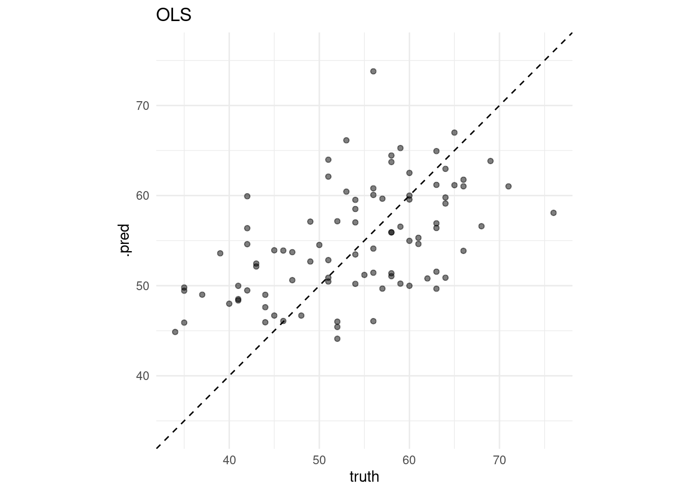

```
## 
## [[2]]
```


```r
# Define performance metrics 
metrics <- yardstick::metric_set(rmse, mae, rsq)

# Evaluate many models 
evals <- purrr::map(list(ols_fit, lasso_fit), evaluate_reg) %>%
  reduce(bind_rows) %>%
  mutate(type = rep(c("OLS", "Lasso"), each = 3))

# Visualize the test results 
evals %>%
  ggplot(aes(x = fct_reorder(type, .estimate), y = .estimate)) +
    geom_point() +
    labs(x = "Model",
         y = "Estimate") +
    facet_wrap(~glue("{toupper(.metric)}"), scales = "free_y") 
```

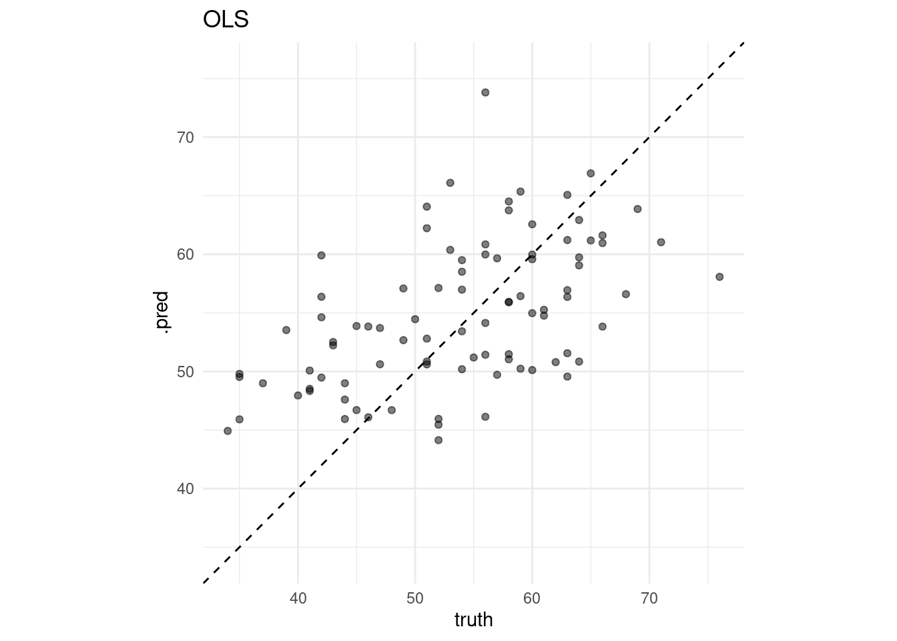
- For more information, read [Tidy Modeling with R](https://www.tmwr.org/) by Max Kuhn and Julia Silge.

#### tune 

##### tune ingredients 


```r
# tune() = placeholder 

tune_spec <- linear_reg(penalty = tune(), # tuning parameter 
                         mixture = 1) %>% # 1 = lasso, 0 = ridge 
  set_engine("glmnet") %>%
  set_mode("regression") 

tune_spec
```

```
## Linear Regression Model Specification (regression)
## 
## Main Arguments:
##   penalty = tune()
##   mixture = 1
## 
## Computational engine: glmnet
```

```r
# penalty() searches 50 possible combinations 

lambda_grid <- grid_regular(penalty(), levels = 50)

# 10-fold cross-validation

set.seed(1234) # for reproducibility 

rec_folds <- vfold_cv(train_x_reg %>% bind_cols(tibble(age = train_y_reg)))
```

##### Add these elements to a workflow 


```r
# Workflow 
rec_wf <- workflow() %>%
  add_model(tune_spec) %>%
  add_formula(age~.)
```


```r
# Tuning results 
rec_res <- rec_wf %>%
  tune_grid(
    resamples = rec_folds, 
    grid = lambda_grid
  )
```

##### Visualize 


```r
# Visualize

rec_res %>%
  collect_metrics() %>%
  ggplot(aes(penalty, mean, col = .metric)) +
  geom_errorbar(aes(
    ymin = mean - std_err,
    ymax = mean + std_err
  ),
  alpha = 0.3
  ) +
  geom_line(size = 2) +
  scale_x_log10() +
  labs(x = "log(lambda)") +
  facet_wrap(~glue("{toupper(.metric)}"), 
             scales = "free",
             nrow = 2) +
  theme(legend.position = "none")
```


##### Select 


```r
top_rmse <- show_best(rec_res, metric = "rmse")

best_rmse <- select_best(rec_res, metric = "rmse")

best_rmse 
```

```
## # A tibble: 1 x 2
##   penalty .config
##     <dbl> <chr>  
## 1   0.153 Model46
```

```r
glue('The RMSE of the intiail model is 
     {evals %>%
  filter(type == "Lasso", .metric == "rmse") %>%
  select(.estimate) %>%
  round(2)}')
```

```
## The RMSE of the intiail model is 
##    7.87
```

```r
glue('The RMSE of the tuned model is {rec_res %>%
  collect_metrics() %>%
  filter(.metric == "rmse") %>%
  arrange(mean) %>%
  dplyr::slice(1) %>%
  select(mean) %>%
  round(2)}')
```

```
## The RMSE of the tuned model is 7.71
```

- Finalize your workflow and visualize [variable importance](https://koalaverse.github.io/vip/articles/vip.html)


```r
finalize_lasso <- rec_wf %>%
  finalize_workflow(best_rmse)

finalize_lasso %>%
  fit(train_x_reg %>% bind_cols(tibble(age = train_y_reg))) %>%
  pull_workflow_fit() %>%
  vip::vip()
```


##### Test fit 

- Apply the tuned model to the test dataset 


```r
test_fit <- finalize_lasso %>% 
  fit(test_x_reg %>% bind_cols(tibble(age = test_y_reg)))

evaluate_reg(test_fit)
```

```
## # A tibble: 3 x 3
##   .metric .estimator .estimate
##   <chr>   <chr>          <dbl>
## 1 rmse    standard       7.09 
## 2 mae     standard       5.84 
## 3 rsq     standard       0.414
```
### Decision tree 

#### parsnip 

- Build a model 

1. Specify a model 
2. Specify an engine 
3. Specify a mode 


```r
# workflow 
tree_wf <- workflow() %>% add_formula(target~.)

# spec 
tree_spec <- decision_tree(
  
           # Mode 
           mode = "classification",
           
           # Tuning parameters
           cost_complexity = NULL, 
           tree_depth = NULL) %>%
  set_engine("rpart") # rpart, c5.0, spark

tree_wf <- tree_wf %>% add_model(tree_spec)
```

- Fit a model


```r
tree_fit <- tree_wf %>% fit(train_x_class %>% bind_cols(tibble(target = train_y_class)))
```

#### yardstick 

- Let's formally test prediction performance. 

**Metrics**

- `accuracy`: The proportion of the data predicted correctly 

- `precision`: Positive predictive value

- `recall` (specificity): True positive rate (e.g., healthy people really healthy)


- To learn more about other metrics, check out the yardstick package [references](https://yardstick.tidymodels.org/reference/index.html). 


```r
# Define performance metrics 

metrics <- yardstick::metric_set(accuracy, precision, recall)

# Visualize

tree_fit_viz_metr <- visualize_class_eval(tree_fit)

tree_fit_viz_metr
```


```r
tree_fit_viz_mat <- visualize_class_conf(tree_fit)

tree_fit_viz_mat
```


#### tune 

##### tune ingredients 

- **complexity parameter**: a high CP means a simple decision tree with few splits. 

- **tree_depth** 


```r
tune_spec <- 
  decision_tree(
    cost_complexity = tune(), 
    tree_depth = tune(),
    mode = "classification"
  ) %>%
  set_engine("rpart")

tree_grid <- grid_regular(cost_complexity(),
                          tree_depth(),
                          levels = 5) # 2 parameters -> 5*5 = 25 combinations 

tree_grid %>%
  count(tree_depth)
```

```
## # A tibble: 5 x 2
##   tree_depth     n
##        <int> <int>
## 1          1     5
## 2          4     5
## 3          8     5
## 4         11     5
## 5         15     5
```

```r
# 10-fold cross-validation

set.seed(1234) # for reproducibility 

tree_folds <- vfold_cv(train_x_class %>% bind_cols(tibble(target = train_y_class)),
                       strata = target)
```

##### Add these elements to a workflow 


```r
# Update workflow 
tree_wf <- tree_wf %>% update_model(tune_spec)

# Determine the number of cores
no_cores <- detectCores() - 1

# Initiate
cl <- makeCluster(no_cores)

registerDoParallel(cl)

# Tuning results 
tree_res <- tree_wf %>%
  tune_grid(
    resamples = tree_folds, 
    grid = tree_grid,
    metrics = metrics
  )
```

##### Visualize 

- The following plot draws on the [vignette](https://www.tidymodels.org/start/tuning/) of the tidymodels package. 


```r
tree_res %>%
  collect_metrics() %>%
  mutate(tree_depth = factor(tree_depth)) %>%
  ggplot(aes(cost_complexity, mean, col = .metric)) +
  geom_point(size = 3) +
  # Subplots 
  facet_wrap(~ tree_depth, 
             scales = "free", 
             nrow = 2) +
  # Log scale x 
  scale_x_log10(labels = scales::label_number()) +
  # Discrete color scale 
  scale_color_viridis_d(option = "plasma", begin = .9, end = 0) +
  labs(x = "Cost complexity",
       col = "Tree depth",
       y = NULL) +
  coord_flip()
```


##### Select 


```r
# Optimal parameter
best_tree <- select_best(tree_res, "recall")

# Add the parameter to the workflow 
finalize_tree <- tree_wf %>%
  finalize_workflow(best_tree)
```


```r
tree_fit_tuned <- finalize_tree %>% 
  fit(train_x_class %>% bind_cols(tibble(target = train_y_class)))

# Metrics 
(tree_fit_viz_metr + labs(title = "Non-tuned")) / (visualize_class_eval(tree_fit_tuned) + labs(title = "Tuned"))
```


```r
# Confusion matrix 
(tree_fit_viz_mat + labs(title = "Non-tuned")) / (visualize_class_conf(tree_fit_tuned) + labs(title = "Tuned"))
```


- Visualize variable importance 


```r
tree_fit_tuned %>%
  pull_workflow_fit() %>%
  vip::vip()
```


##### Test fit

- Apply the tuned model to the test dataset 


```r
test_fit <- finalize_tree %>% 
  fit(test_x_class %>% bind_cols(tibble(target = test_y_class)))

evaluate_class(test_fit)
```

```
## # A tibble: 3 x 3
##   .metric   .estimator .estimate
##   <chr>     <chr>          <dbl>
## 1 accuracy  binary         0.744
## 2 precision binary         0.705
## 3 recall    binary         0.756
```

### Random forest 


#### parsnip 

- Build a model 

1. Specify a model 
2. Specify an engine 
3. Specify a mode 


```r
# workflow 
rand_wf <- workflow() %>% add_formula(target~.)

# spec 
rand_spec <- rand_forest(
  
           # Mode 
           mode = "classification",
           
           # Tuning parameters
           mtry = NULL, # The number of predictors to available for splitting at each node  
           min_n = NULL, # The minimum number of data points needed to keep splitting nodes
           trees = 500) %>% # The number of trees
  set_engine("ranger", 
             # We want the importance of predictors to be assessed.
             seed = 1234, 
             importance = "permutation") 

rand_wf <- rand_wf %>% add_model(rand_spec)
```

- Fit a model


```r
rand_fit <- rand_wf %>% fit(train_x_class %>% bind_cols(tibble(target = train_y_class)))
```

#### yardstick 

- Let's formally test prediction performance. 

**Metrics**

- `accuracy`: The proportion of the data predicted correctly 

- `precision`: Positive predictive value

- `recall` (specificity): True positive rate (e.g., healthy people really healthy)


```r
# Define performance metrics 
metrics <- yardstick::metric_set(accuracy, precision, recall)

rand_fit_viz_metr <- visualize_class_eval(rand_fit)

rand_fit_viz_metr
```


- Visualize the confusion matrix. 
  

```r
rand_fit_viz_mat <- visualize_class_conf(rand_fit)

rand_fit_viz_mat
```


#### tune 

##### tune ingredients 

We focus on the following two parameters:

- `mtry`: The number of predictors to available for splitting at each node.

- `min_n`: The minimum number of data points needed to keep splitting nodes. 


```r
tune_spec <- 
  rand_forest(
           mode = "classification",
           
           # Tuning parameters
           mtry = tune(), 
           min_n = tune()) %>%
  set_engine("ranger",
             seed = 1234, 
             importance = "permutation")

rand_grid <- grid_regular(mtry(range = c(1, 10)),
                          min_n(range = c(2, 10)),
                          levels = 5)

rand_grid %>%
  count(min_n)
```

```
## # A tibble: 5 x 2
##   min_n     n
##   <int> <int>
## 1     2     5
## 2     4     5
## 3     6     5
## 4     8     5
## 5    10     5
```


```r
# 10-fold cross-validation

set.seed(1234) # for reproducibility 

rand_folds <- vfold_cv(train_x_class %>% bind_cols(tibble(target = train_y_class)),
                       strata = target)
```

##### Add these elements to a workflow 


```r
# Update workflow 
rand_wf <- rand_wf %>% update_model(tune_spec)

# Tuning results 
rand_res <- rand_wf %>%
  tune_grid(
    resamples = rand_folds, 
    grid = rand_grid,
    metrics = metrics
  )
```

##### Visualize 


```r
rand_res %>%
  collect_metrics() %>%
  mutate(min_n = factor(min_n)) %>%
  ggplot(aes(mtry, mean, color = min_n)) +
  # Line + Point plot 
  geom_line(size = 1.5, alpha = 0.6) +
  geom_point(size = 2) +
  # Subplots 
  facet_wrap(~ .metric, 
             scales = "free", 
             nrow = 2) +
  # Log scale x 
  scale_x_log10(labels = scales::label_number()) +
  # Discrete color scale 
  scale_color_viridis_d(option = "plasma", begin = .9, end = 0) +
  labs(x = "The number of predictors to be sampled",
       col = "The minimum number of data points needed for splitting",
       y = NULL) +
  theme(legend.position="bottom")
```


```r
# Optimal parameter
best_tree <- select_best(rand_res, "accuracy")

best_tree
```

```
## # A tibble: 1 x 3
##    mtry min_n .config
##   <int> <int> <chr>  
## 1     1     2 Model01
```

```r
# Add the parameter to the workflow 
finalize_tree <- rand_wf %>%
  finalize_workflow(best_tree)
```


```r
rand_fit_tuned <- finalize_tree %>% 
  fit(train_x_class %>% bind_cols(tibble(target = train_y_class)))

# Metrics 
(rand_fit_viz_metr + labs(title = "Non-tuned")) / (visualize_class_eval(rand_fit_tuned) + labs(title = "Tuned"))
```


```r
# Confusion matrix 
(rand_fit_viz_mat + labs(title = "Non-tuned")) / (visualize_class_conf(rand_fit_tuned) + labs(title = "Tuned"))
```


- Visualize variable importance 


```r
rand_fit_tuned %>%
  pull_workflow_fit() %>%
  vip::vip()
```

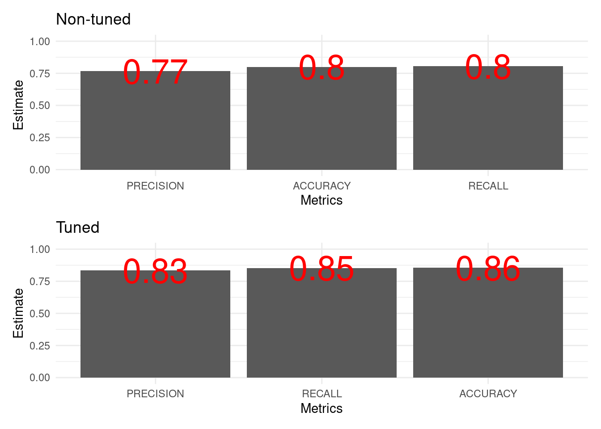

##### Test fit

- Apply the tuned model to the test dataset 


```r
test_fit <- finalize_tree %>%
  fit(test_x_class %>% bind_cols(tibble(target = test_y_class)))

evaluate_class(test_fit)
```

```
## # A tibble: 3 x 3
##   .metric   .estimator .estimate
##   <chr>     <chr>          <dbl>
## 1 accuracy  binary         0.933
## 2 precision binary         0.973
## 3 recall    binary         0.878
```

### XGboost 

#### parsnip 

- Build a model 

1. Specify a model 
2. Specify an engine 
3. Specify a mode 


```r
# workflow 
xg_wf <- workflow() %>% add_formula(target~.)

# spec 
xg_spec <- boost_tree(
  
           # Mode 
           mode = "classification",
           
           # Tuning parameters
           
           # The number of trees to fit, aka boosting iterations
           trees = c(100, 300, 500, 700, 900),
           # The depth of the decision tree (how many levels of splits).
	         tree_depth = c(1, 6), 
           # Learning rate: lower means the ensemble will adapt more slowly.
           learn_rate = c(0.0001, 0.01, 0.2),
           # Stop splitting a tree if we only have this many obs in a tree node.
	         min_n = 10L
          ) %>% 
  set_engine("xgboost") 

xg_wf <- xg_wf %>% add_model(xg_spec)
```

- Fit a model


```r
xg_fit <- xg_wf %>% fit(train_x_class %>% bind_cols(tibble(target = train_y_class)))
```

```
## Warning in begin_iteration:end_iteration: numerical expression has 5 elements:
## only the first used
```

#### yardstick 

- Let's formally test prediction performance. 

**Metrics**

- `accuracy`: The proportion of the data predicted correctly 

- `precision`: Positive predictive value

- `recall` (specificity): True positive rate (e.g., healthy people really healthy)


```r
metrics <- metric_set(yardstick::accuracy, 
                      yardstick::precision, 
                      yardstick::recall)

evaluate_class(xg_fit)
```

```
## # A tibble: 3 x 3
##   .metric   .estimator .estimate
##   <chr>     <chr>          <dbl>
## 1 accuracy  binary         0.733
## 2 precision binary         0.730
## 3 recall    binary         0.659
```


```r
xg_fit_viz_metr <- visualize_class_eval(xg_fit)

xg_fit_viz_metr
```


- Visualize the confusion matrix. 
  

```r
xg_fit_viz_mat <- visualize_class_conf(xg_fit)

xg_fit_viz_mat
```


#### tune 

##### tune ingredients 

- We focus on the following parameters: `trees,` `tree_depth,` `learn_rate,` `min_n,` `mtry,` `loss_reduction,` and `sample_size`


```r
tune_spec <- 
  xg_spec <- boost_tree(
  
           # Mode 
           mode = "classification",
           
           # Tuning parameters
           
           # The number of trees to fit, aka boosting iterations
           trees = tune(),
           # The depth of the decision tree (how many levels of splits).
	         tree_depth = tune(), 
           # Learning rate: lower means the ensemble will adapt more slowly.
           learn_rate = tune(),
           # Stop splitting a tree if we only have this many obs in a tree node.
	         min_n = tune(),
           loss_reduction = tune(),
           # The number of randomly selected parameters 
           mtry = tune(), 
           # The size of the data set used for modeling within an iteration
           sample_size = tune()
          ) %>% 
  set_engine("xgboost") 

# Space-filling parameter grids 
xg_grid <- grid_latin_hypercube(
  trees(),
  tree_depth(),
  learn_rate(),
  min_n(),
  loss_reduction(), 
  sample_size = sample_prop(),
  finalize(mtry(), train_x_class),
  size = 30
  )

# 10-fold cross-validation

set.seed(1234) # for reproducibility 

xg_folds <- vfold_cv(train_x_class %>% bind_cols(tibble(target = train_y_class)),
                     strata = target)
```

##### Add these elements to a workflow 


```r
# Update workflow 
xg_wf <- xg_wf %>% update_model(tune_spec)

# Tuning results 
xg_res <- xg_wf %>%
  tune_grid(
    resamples = xg_folds, 
    grid = xg_grid,
    control = control_grid(save_pred = TRUE)
  )
```

##### Visualize 


```r
xg_res %>%
  collect_metrics() %>% 
  filter(.metric == "roc_auc") %>%
  pivot_longer(mtry:sample_size,
               values_to = "value",
               names_to = "parameter") %>%
  ggplot(aes(x = value, y = mean, color = parameter)) +
    geom_point(alpha = 0.8, show.legend = FALSE) +
    facet_wrap(~parameter, scales = "free_x") +
    labs(y = "AUC",
         x = NULL)
```

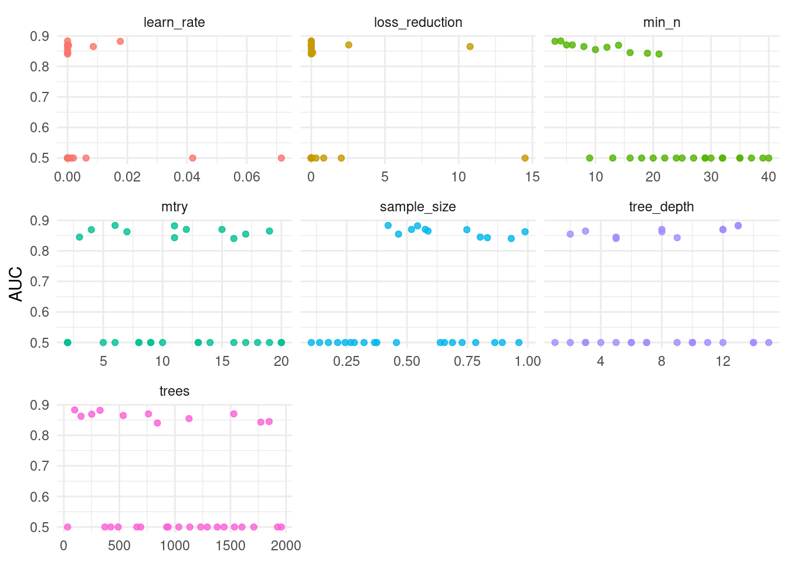


```r
# Optimal parameter
best_xg <- select_best(xg_res, "roc_auc")

best_xg 
```

```
## # A tibble: 1 x 8
##    mtry trees min_n tree_depth  learn_rate loss_reduction sample_size .config
##   <int> <int> <int>      <int>       <dbl>          <dbl>       <dbl> <chr>  
## 1     6    98     4         13 0.000000211  0.00000000336       0.422 Model26
```

```r
# Add the parameter to the workflow 
finalize_xg <- xg_wf %>%
  finalize_workflow(best_xg)
```


```r
xg_fit_tuned <- finalize_xg %>% 
  fit(train_x_class %>% bind_cols(tibble(target = train_y_class)))

# Metrics 
(xg_fit_viz_metr + labs(title = "Non-tuned")) / (visualize_class_eval(xg_fit_tuned) + labs(title = "Tuned"))
```


```r
# Confusion matrix 
(xg_fit_viz_mat + labs(title = "Non-tuned")) / (visualize_class_conf(xg_fit_tuned) + labs(title = "Tuned"))
```


- Visualize variable importance 


```r
xg_fit_tuned %>%
  pull_workflow_fit() %>%
  vip::vip()
```

```
## Warning: `as.tibble()` is deprecated as of tibble 2.0.0.
## Please use `as_tibble()` instead.
## The signature and semantics have changed, see `?as_tibble`.
## This warning is displayed once every 8 hours.
## Call `lifecycle::last_warnings()` to see where this warning was generated.
```


##### Test fit

- Apply the tuned model to the test dataset 


```r
test_fit <- finalize_xg %>%
  fit(test_x_class %>% bind_cols(tibble(target = test_y_class)))

evaluate_class(test_fit)
```

```
## # A tibble: 3 x 3
##   .metric   .estimator .estimate
##   <chr>     <chr>          <dbl>
## 1 accuracy  binary         0.8  
## 2 precision binary         0.795
## 3 recall    binary         0.756
```

### Applications 

#### Bandit algorithm (optimizing an experiment)

#### Causal forest (estimating heterogeneous treatment effect)

## Unsupervised learning

x -> f - > y (not defined)

### Dimension reduction


#### Correlation analysis 

- Notice some problems? 

    - NAs 
    
    - Scaling issues 
    

```r
data_original %>%
  corrr::correlate()
```

```
## 
## Correlation method: 'pearson'
## Missing treated using: 'pairwise.complete.obs'
```

```
## # A tibble: 14 x 15
##    rowname     age     sex      cp trestbps     chol      fbs restecg  thalach
##    <chr>     <dbl>   <dbl>   <dbl>    <dbl>    <dbl>    <dbl>   <dbl>    <dbl>
##  1 age     NA      -0.0984 -0.0687   0.279   0.214    0.121   -0.116  -0.399  
##  2 sex     -0.0984 NA      -0.0494  -0.0568 -0.198    0.0450  -0.0582 -0.0440 
##  3 cp      -0.0687 -0.0494 NA        0.0476 -0.0769   0.0944   0.0444  0.296  
##  4 trestb…  0.279  -0.0568  0.0476  NA       0.123    0.178   -0.114  -0.0467 
##  5 chol     0.214  -0.198  -0.0769   0.123  NA        0.0133  -0.151  -0.00994
##  6 fbs      0.121   0.0450  0.0944   0.178   0.0133  NA       -0.0842 -0.00857
##  7 restecg -0.116  -0.0582  0.0444  -0.114  -0.151   -0.0842  NA       0.0441 
##  8 thalach -0.399  -0.0440  0.296   -0.0467 -0.00994 -0.00857  0.0441 NA      
##  9 exang    0.0968  0.142  -0.394    0.0676  0.0670   0.0257  -0.0707 -0.379  
## 10 oldpeak  0.210   0.0961 -0.149    0.193   0.0540   0.00575 -0.0588 -0.344  
## 11 slope   -0.169  -0.0307  0.120   -0.121  -0.00404 -0.0599   0.0930  0.387  
## 12 ca       0.276   0.118  -0.181    0.101   0.0705   0.138   -0.0720 -0.213  
## 13 thal     0.0680  0.210  -0.162    0.0622  0.0988  -0.0320  -0.0120 -0.0964 
## 14 target  -0.225  -0.281   0.434   -0.145  -0.0852  -0.0280   0.137   0.422  
## # … with 6 more variables: exang <dbl>, oldpeak <dbl>, slope <dbl>, ca <dbl>,
## #   thal <dbl>, target <dbl>
```

#### Preprocessing 

`recipe` is essential for preprocesssing multiple features at once.


```r
pca_recipe <- recipe(~., data = data_original) %>%
  # Imputing NAs using mean 
  step_meanimpute(all_predictors()) %>%
  # Normalize some numeric variables 
  step_normalize(c("age", "trestbps", "chol", "thalach", "oldpeak")) 
```

#### PCA analysis 


```r
pca_res <- pca_recipe %>% 
  step_pca(all_predictors(), 
           id = "pca") %>% # id argument identifies each PCA step 
  prep()

pca_res %>%
  tidy(id = "pca") 
```

```
## # A tibble: 196 x 4
##    terms        value component id   
##    <chr>        <dbl> <chr>     <chr>
##  1 age      -0.00101  PC1       pca  
##  2 sex       0.216    PC1       pca  
##  3 cp        0.321    PC1       pca  
##  4 trestbps  0.00118  PC1       pca  
##  5 chol     -0.000292 PC1       pca  
##  6 fbs       0.0468   PC1       pca  
##  7 restecg   0.166    PC1       pca  
##  8 thalach   0.0137   PC1       pca  
##  9 exang     0.0962   PC1       pca  
## 10 oldpeak  -0.00863  PC1       pca  
## # … with 186 more rows
```

##### Screeplot


```r
pca_recipe %>%
  step_pca(all_predictors(), 
           id = "pca") %>% # id argument identifies each PCA step 
  prep() %>%
  tidy(id = "pca", type = "variance") %>%
  filter(terms == "percent variance") %>% 
  ggplot(aes(x = component, y = value)) +
    geom_col() +
    labs(x = "PCAs of heart disease",
         y = "% of variance",
         title = "Scree plot")
```


##### View factor loadings 


```r
pca_recipe %>%
  step_pca(all_predictors(), 
           id = "pca") %>% # id argument identifies each PCA step 
  prep() %>%
  tidy(id = "pca") %>%
  filter(component %in% c("PC1", "PC2")) %>%
  ggplot(aes(x = fct_reorder(terms, value), y = value, 
             fill = component)) +
    geom_col(position = "dodge") +
    coord_flip() +
    labs(x = "Terms",
         y = "Contribtutions",
         fill = "PCAs") 
```

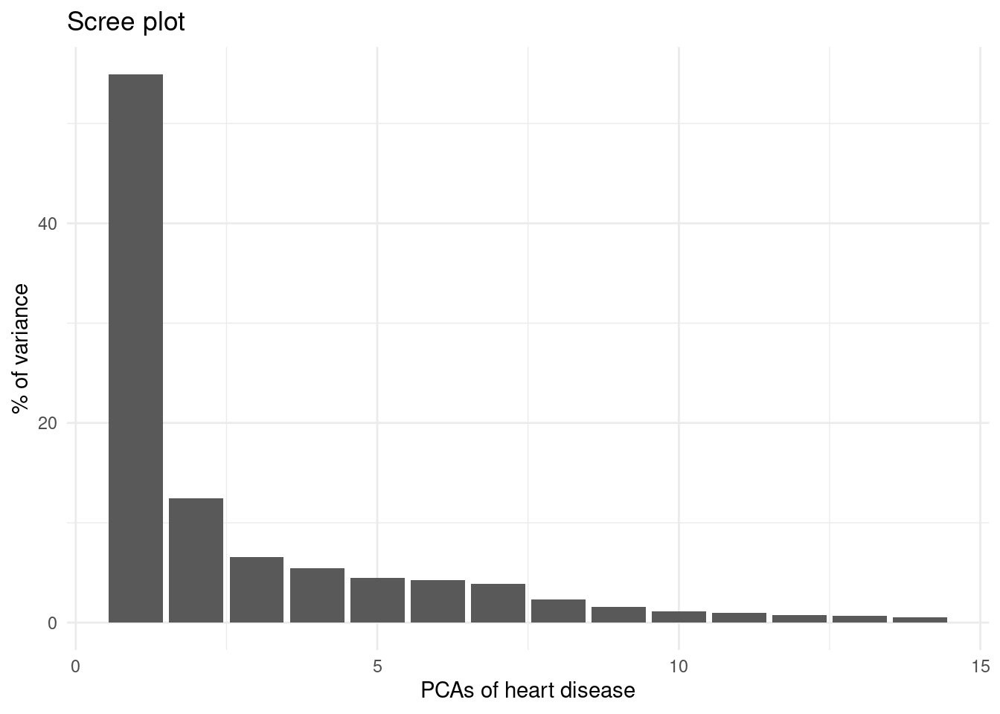

### Topic modeling 

#### Setup 


```r
pacman::p_load(tidytext, # tidy text analysis
               glue, # paste string and objects                
               stm, # structural topic modeling
               gutenbergr) # toy datasets 
```

#### Dataset 

The data munging process draws on [Julia Silge's blog post](https://juliasilge.com/blog/sherlock-holmes-stm/).


```r
sherlock_raw <- gutenberg_download(1661)
```

```
## Determining mirror for Project Gutenberg from http://www.gutenberg.org/robot/harvest
```

```
## Using mirror http://aleph.gutenberg.org
```

```r
glimpse(sherlock_raw)
```

```
## Rows: 12,648
## Columns: 2
## $ gutenberg_id <int> 1661, 1661, 1661, 1661, 1661, 1661, 1661, 1661, 1661, 16…
## $ text         <chr> "THE ADVENTURES OF SHERLOCK HOLMES", "", "by", "", "SIR …
```

```r
sherlock <- sherlock_raw %>%
  # Mutate story using a conditional statement 
  mutate(story = ifelse(str_starts(text, "ADVENTURE"), 
                                   text, NA)) %>%
  # Fill in missing values with next value  
  tidyr::fill(story, .direction = "down") %>%
  # Filter 
  filter(story != "THE ADVENTURES OF SHERLOCK HOLMES") %>%
  # Factor 
  mutate(story = factor(story, levels = unique(story)))

sherlock <- sherlock[,2:3]
```

#### Key ideas 

- Topics as **distributions** of words 

- Documents as **distributions** of topics 

- What distributions?

    - Probability 

    - Multinominal (e.g., Latent Dirichlet Distribution)

- Words lie on a lower dimensional space (dimension reduction)

- Co-occurrence of words (clustering)

- Bag of words (feature engineering)
    - Upside: easy and fast (also quite working well)
    - Downside: ignored grammatical structures and rich interactions among words (Alternative: word embeddings. Please check out [text2vec](http://text2vec.org/))

#### Exploratory data analysis 


```r
sherlock_n <- sherlock %>%
  unnest_tokens(output = word,
                input = text) %>%
  count(story, word, sort = TRUE)

sherlock_total_n <- sherlock_n %>%
  group_by(story) %>%
  summarise(total = sum(n))
```

```
## `summarise()` ungrouping output (override with `.groups` argument)
```

```r
sherlock_words <- sherlock_n %>% left_join(sherlock_total_n)
```

```
## Joining, by = "story"
```

```r
sherlock_words %>%
  mutate(freq = n/total) %>%
  group_by(story) %>%
  top_n(10) %>%
  ggplot(aes(x = fct_reorder(word, freq), 
             y = freq, 
             fill = story)) +
  geom_col() +
  coord_flip() +
  facet_wrap(~story, 
             ncol = 2, 
             scales = "free_y") +
  scale_fill_viridis_d() +
  labs(x = "")
```

```
## Selecting by freq
```


#### STM 

##### Turn text into document-term matrix

`stm` package has its own preprocessing function.


```r
dtm <- textProcessor(documents = sherlock$text,
                     metadata = sherlock, 
                     removestopwords = TRUE,
                     verbose = FALSE)
```

##### Tuning K

- K is the number of topics. 
- Let's try K = 5, 10, 15.


```r
test_res <- searchK(dtm$documents, dtm$vocab, 
                   K = c(5, 10, 15),
                   prevalence =~ story, 
                   data = dtm$meta)
```

```
## Beginning Spectral Initialization 
## 	 Calculating the gram matrix...
## 	 Finding anchor words...
##  	.....
## 	 Recovering initialization...
##  	........................................................
## Initialization complete.
## ....................................................................................................
## Completed E-Step (1 seconds). 
## Completed M-Step. 
## Completing Iteration 1 (approx. per word bound = -7.570) 
## ....................................................................................................
## Completed E-Step (1 seconds). 
## Completed M-Step. 
## Completing Iteration 2 (approx. per word bound = -7.481, relative change = 1.176e-02) 
## ....................................................................................................
## Completed E-Step (1 seconds). 
## Completed M-Step. 
## Completing Iteration 3 (approx. per word bound = -7.400, relative change = 1.090e-02) 
## ....................................................................................................
## Completed E-Step (1 seconds). 
## Completed M-Step. 
## Completing Iteration 4 (approx. per word bound = -7.381, relative change = 2.581e-03) 
## ....................................................................................................
## Completed E-Step (1 seconds). 
## Completed M-Step. 
## Completing Iteration 5 (approx. per word bound = -7.375, relative change = 8.290e-04) 
## Topic 1: come, time, might, know, must 
##  Topic 2: one, said, well, matter, came 
##  Topic 3: holm, upon, said, may, just 
##  Topic 4: littl, will, man, see, think 
##  Topic 5: case, yes, remark, noth, put 
## ....................................................................................................
## Completed E-Step (1 seconds). 
## Completed M-Step. 
## Completing Iteration 6 (approx. per word bound = -7.371, relative change = 4.271e-04) 
## ....................................................................................................
## Completed E-Step (1 seconds). 
## Completed M-Step. 
## Completing Iteration 7 (approx. per word bound = -7.370, relative change = 2.175e-04) 
## ....................................................................................................
## Completed E-Step (1 seconds). 
## Completed M-Step. 
## Completing Iteration 8 (approx. per word bound = -7.369, relative change = 7.176e-05) 
## ....................................................................................................
## Completed E-Step (1 seconds). 
## Completed M-Step. 
## Model Converged 
## Beginning Spectral Initialization 
## 	 Calculating the gram matrix...
## 	 Finding anchor words...
##  	..........
## 	 Recovering initialization...
##  	........................................................
## Initialization complete.
## ....................................................................................................
## Completed E-Step (1 seconds). 
## Completed M-Step. 
## Completing Iteration 1 (approx. per word bound = -7.651) 
## ....................................................................................................
## Completed E-Step (1 seconds). 
## Completed M-Step. 
## Completing Iteration 2 (approx. per word bound = -7.480, relative change = 2.234e-02) 
## ....................................................................................................
## Completed E-Step (1 seconds). 
## Completed M-Step. 
## Completing Iteration 3 (approx. per word bound = -7.378, relative change = 1.356e-02) 
## ....................................................................................................
## Completed E-Step (1 seconds). 
## Completed M-Step. 
## Completing Iteration 4 (approx. per word bound = -7.354, relative change = 3.251e-03) 
## ....................................................................................................
## Completed E-Step (1 seconds). 
## Completed M-Step. 
## Completing Iteration 5 (approx. per word bound = -7.347, relative change = 1.040e-03) 
## Topic 1: holm, one, will, eye, across 
##  Topic 2: may, upon, case, shall, remark 
##  Topic 3: well, know, father, call, mind 
##  Topic 4: littl, see, like, yes, might 
##  Topic 5: said, man, see, watson, hard 
##  Topic 6: hous, room, hand, man, without 
##  Topic 7: come, came, even, back, tell 
##  Topic 8: upon, day, door, look, may 
##  Topic 9: said, ask, matter, noth, answer 
##  Topic 10: sherlock, hand, glanc, howev, anoth 
## ....................................................................................................
## Completed E-Step (1 seconds). 
## Completed M-Step. 
## Completing Iteration 6 (approx. per word bound = -7.344, relative change = 3.512e-04) 
## ....................................................................................................
## Completed E-Step (1 seconds). 
## Completed M-Step. 
## Completing Iteration 7 (approx. per word bound = -7.342, relative change = 2.888e-04) 
## ....................................................................................................
## Completed E-Step (1 seconds). 
## Completed M-Step. 
## Completing Iteration 8 (approx. per word bound = -7.340, relative change = 2.464e-04) 
## ....................................................................................................
## Completed E-Step (1 seconds). 
## Completed M-Step. 
## Completing Iteration 9 (approx. per word bound = -7.339, relative change = 1.991e-04) 
## ....................................................................................................
## Completed E-Step (1 seconds). 
## Completed M-Step. 
## Completing Iteration 10 (approx. per word bound = -7.338, relative change = 1.230e-04) 
## Topic 1: holm, one, will, eye, chair 
##  Topic 2: may, case, shall, say, remark 
##  Topic 3: know, well, never, thought, cri 
##  Topic 4: littl, yes, like, might, see 
##  Topic 5: said, man, see, can, watson 
##  Topic 6: hous, room, young, ladi, without 
##  Topic 7: come, came, back, even, just 
##  Topic 8: upon, door, day, open, look 
##  Topic 9: ask, matter, must, take, noth 
##  Topic 10: hand, howev, sherlock, glanc, head 
## ....................................................................................................
## Completed E-Step (1 seconds). 
## Completed M-Step. 
## Completing Iteration 11 (approx. per word bound = -7.337, relative change = 5.576e-05) 
## ....................................................................................................
## Completed E-Step (1 seconds). 
## Completed M-Step. 
## Model Converged 
## Beginning Spectral Initialization 
## 	 Calculating the gram matrix...
## 	 Finding anchor words...
##  	...............
## 	 Recovering initialization...
##  	........................................................
## Initialization complete.
## ....................................................................................................
## Completed E-Step (2 seconds). 
## Completed M-Step. 
## Completing Iteration 1 (approx. per word bound = -7.737) 
## ....................................................................................................
## Completed E-Step (2 seconds). 
## Completed M-Step. 
## Completing Iteration 2 (approx. per word bound = -7.500, relative change = 3.056e-02) 
## ....................................................................................................
## Completed E-Step (1 seconds). 
## Completed M-Step. 
## Completing Iteration 3 (approx. per word bound = -7.388, relative change = 1.494e-02) 
## ....................................................................................................
## Completed E-Step (1 seconds). 
## Completed M-Step. 
## Completing Iteration 4 (approx. per word bound = -7.356, relative change = 4.344e-03) 
## ....................................................................................................
## Completed E-Step (1 seconds). 
## Completed M-Step. 
## Completing Iteration 5 (approx. per word bound = -7.345, relative change = 1.583e-03) 
## Topic 1: holm, know, well, can, might 
##  Topic 2: small, lay, known, form, power 
##  Topic 3: time, seen, two, sherlock, anyth 
##  Topic 4: said, man, shall, miss, word 
##  Topic 5: look, face, man, first, eye 
##  Topic 6: room, man, must, open, took 
##  Topic 7: back, ask, came, way, come 
##  Topic 8: littl, said, noth, last, sir 
##  Topic 9: now, see, yes, like, think 
##  Topic 10: street, hand, found, sudden, pass 
##  Topic 11: someth, sure, went, mind, live 
##  Topic 12: come, call, busi, gentleman, may 
##  Topic 13: will, may, case, littl, find 
##  Topic 14: one, side, two, year, famili 
##  Topic 15: upon, tabl, finger, depend, wrist 
## ....................................................................................................
## Completed E-Step (1 seconds). 
## Completed M-Step. 
## Completing Iteration 6 (approx. per word bound = -7.340, relative change = 5.712e-04) 
## ....................................................................................................
## Completed E-Step (1 seconds). 
## Completed M-Step. 
## Completing Iteration 7 (approx. per word bound = -7.338, relative change = 2.704e-04) 
## ....................................................................................................
## Completed E-Step (1 seconds). 
## Completed M-Step. 
## Completing Iteration 8 (approx. per word bound = -7.336, relative change = 2.640e-04) 
## ....................................................................................................
## Completed E-Step (1 seconds). 
## Completed M-Step. 
## Completing Iteration 9 (approx. per word bound = -7.335, relative change = 1.952e-04) 
## ....................................................................................................
## Completed E-Step (1 seconds). 
## Completed M-Step. 
## Completing Iteration 10 (approx. per word bound = -7.333, relative change = 2.106e-04) 
## Topic 1: holm, know, well, can, might 
##  Topic 2: small, work, told, lay, fire 
##  Topic 3: time, howev, day, sherlock, turn 
##  Topic 4: said, man, miss, young, word 
##  Topic 5: look, face, eye, tell, first 
##  Topic 6: room, must, open, father, made 
##  Topic 7: back, came, door, ask, way 
##  Topic 8: littl, noth, last, paper, read 
##  Topic 9: now, see, think, yes, like 
##  Topic 10: found, street, hand, sudden, light 
##  Topic 11: went, place, someth, mind, son 
##  Topic 12: come, away, busi, call, reason 
##  Topic 13: will, may, case, find, interest 
##  Topic 14: one, side, year, thing, two 
##  Topic 15: upon, tabl, besid, finger, bear 
## ....................................................................................................
## Completed E-Step (1 seconds). 
## Completed M-Step. 
## Completing Iteration 11 (approx. per word bound = -7.332, relative change = 2.243e-04) 
## ....................................................................................................
## Completed E-Step (1 seconds). 
## Completed M-Step. 
## Completing Iteration 12 (approx. per word bound = -7.331, relative change = 1.713e-04) 
## ....................................................................................................
## Completed E-Step (1 seconds). 
## Completed M-Step. 
## Completing Iteration 13 (approx. per word bound = -7.330, relative change = 1.282e-04) 
## ....................................................................................................
## Completed E-Step (1 seconds). 
## Completed M-Step. 
## Completing Iteration 14 (approx. per word bound = -7.329, relative change = 1.167e-04) 
## ....................................................................................................
## Completed E-Step (1 seconds). 
## Completed M-Step. 
## Completing Iteration 15 (approx. per word bound = -7.328, relative change = 6.326e-05) 
## Topic 1: holm, know, well, can, might 
##  Topic 2: small, work, told, lay, fire 
##  Topic 3: time, day, much, howev, turn 
##  Topic 4: said, man, miss, say, right 
##  Topic 5: look, face, eye, tell, first 
##  Topic 6: must, room, open, made, morn 
##  Topic 7: door, came, back, ask, way 
##  Topic 8: littl, noth, last, paper, sir 
##  Topic 9: now, see, think, yes, like 
##  Topic 10: found, street, hand, long, light 
##  Topic 11: place, went, someth, mind, son 
##  Topic 12: come, away, busi, call, certain 
##  Topic 13: will, may, case, find, take 
##  Topic 14: one, side, year, thing, two 
##  Topic 15: upon, tabl, besid, sever, finger 
## ....................................................................................................
## Completed E-Step (1 seconds). 
## Completed M-Step. 
## Completing Iteration 16 (approx. per word bound = -7.328, relative change = 5.296e-05) 
## ....................................................................................................
## Completed E-Step (1 seconds). 
## Completed M-Step. 
## Completing Iteration 17 (approx. per word bound = -7.328, relative change = 3.663e-05) 
## ....................................................................................................
## Completed E-Step (1 seconds). 
## Completed M-Step. 
## Model Converged
```

##### Evaludating models 

There are several metrics to assess the performance of topic models: the held-out likelihood, residuals, semantic coherence, and exclusivity. In this course, we examine the relationship between semantic coherence and exclusivity to understand the trade-off involved in selecting K.


```r
test_res$results %>%
  unnest(K, exclus, semcoh) %>%
  dplyr::select(K, exclus, semcoh) %>%
  mutate(K = as.factor(K)) %>%
  ggplot(aes(x = exclus, y = semcoh)) +
    geom_text(label = glue("K = {test_res$results$K}"),
              size = 5,
              color = "red")
```

```
## Warning: unnest() has a new interface. See ?unnest for details.
## Try `df %>% unnest(c(K, exclus, semcoh))`, with `mutate()` if needed
```


##### Finalize 


```r
final_stm <- stm(dtm$documents, 
                 dtm$vocab, 
                 K = 10, prevalence =~ story,
                 max.em.its = 75, 
                 data = dtm$meta, 
                 init.type="Spectral",
                 seed = 1234567,
                 verbose = FALSE)
```

##### Explore the results 

- Using the `stm` pacakge. 


```r
# plot
plot(final_stm)
```

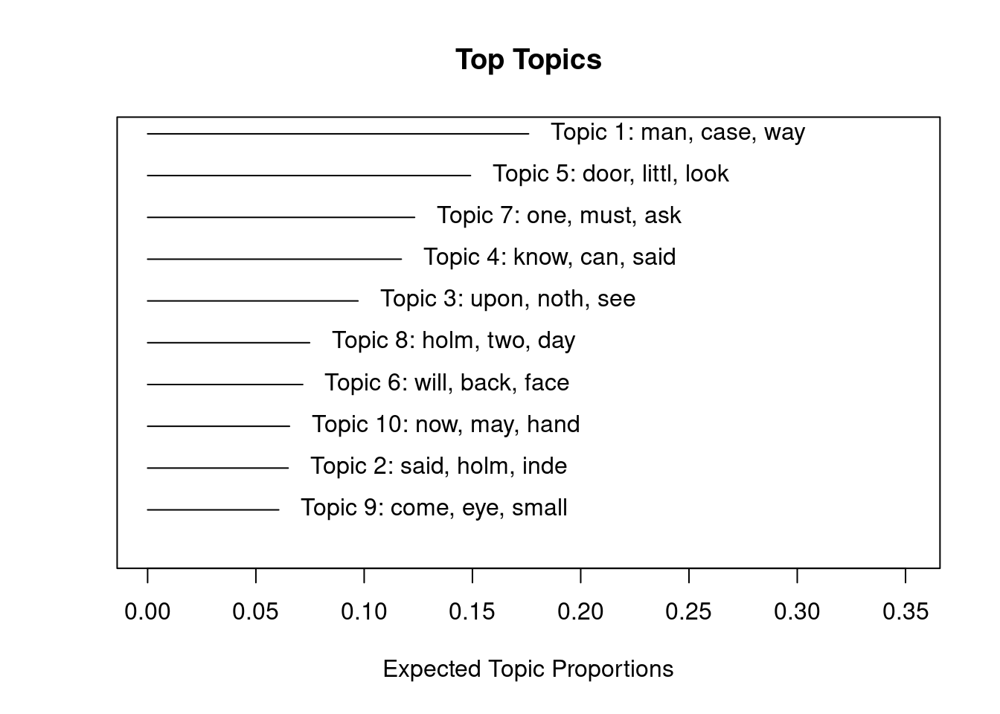

- Using ggplot2 


```r
# tidy  
tidy_stm <- tidy(final_stm)

# top terms
tidy_stm %>%
    group_by(topic) %>%
    top_n(10, beta) %>%
    ungroup() %>%
    ggplot(aes(fct_reorder(term, beta), beta, fill = as.factor(topic))) +
    geom_col(alpha = 0.8, show.legend = FALSE) +
    facet_wrap(~ topic, scales = "free_y") +
    coord_flip() +
    scale_y_continuous(labels = scales::percent) +
    scale_fill_viridis_d()
```


## Bias and fairness in machine learning 

## Resources

### Books 

- *An Introduction to Statistical Learning - with Applications in R (2013)* by Gareth James, Daniela Witten, Trevor Hastie, Robert Tibshirani. Springer: New York. [Amazon](https://www.amazon.com/Introduction-Statistical-Learning-Applications-Statistics/dp/1461471370) or [free PDF](http://www-bcf.usc.edu/~gareth/ISL/). 

- *Hands-On Machine Learning with R (2020)* by Bradley Boehmke & Brandon Greenwell. [CRC Press](https://www.routledge.com/Hands-On-Machine-Learning-with-R/Boehmke-Greenwell/p/book/9781138495685) or [Amazon](https://www.amazon.com/gp/product/1138495689?pf_rd_p=ab873d20-a0ca-439b-ac45-cd78f07a84d8&pf_rd_r=JBRX0ZJ1WFSR9T3JPTQE)

- *Applied Predictive Modeling (2013)* by Max Kuhn and Kjell Johnson. Springer: New York. [Amazon](https://www.amazon.com/Applied-Predictive-Modeling-Max-Kuhn/dp/1461468485?SubscriptionId=0ENGV10E9K9QDNSJ5C82&tag=apm0a-20&linkCode=xm2&camp=2025&creative=165953&creativeASIN=1461468485) 

- *Feature Engineering and Selection: A Practical Approach for Predictive Models (2019)* by Kjell Johnson and Max Kuhn. Taylor & Francis. [Amazon](http://www.feat.engineering/) or [free HTML](http://www.feat.engineering/). 
- *[Tidy Modeling with R](https://www.tmwr.org/) (2020)* by Max Kuhn and Julia Silge (work-in-progress)

### Lecture slides 

- [An introduction to supervised and unsupervised learning (2015)](https://www.nber.org/econometrics_minicourse_2015/nber_slides11.pdf) by Susan Athey and Guido Imbens 

- [Introduction Machine Learning with the Tidyverse](https://education.rstudio.com/blog/2020/02/conf20-intro-ml/) by Alison Hill

### Blog posts 

- ["Using the recipes package for easy pre-processing"](http://www.rebeccabarter.com/blog/2019-06-06_pre_processing/) by Rebecca Barter

<!--chapter:end:05_high_dimensional_data.Rmd-->

# Big data {#big_data}

## Motivation

- Big data problem: data is too big to fit into memory (=local environment).
- R reads data into random-access memory (RAM) at once and this object lives in memory entirely. So, object > memory will crash R. 
- So, the key to deal with big data in R is reducing the size of data you want to bring into it.

**Techniques to deal with big data**

- Medium sized file (1-2 GB)
   - Try to reduce the size of the file using slicing and dicing
   - Tools: 
      - R:`data.table::fread(file path, select = c("column 1", "column 2"))`. This command imports data faster than `read.csv()` does.
      - Command line: [`csvkit`](https://csvkit.readthedocs.io/en/latest/) - a suite of command-line tools to and working with CSV 
- Large file (> 2-10 GB)
   - Put the data into a database and **ACCESS** it 
   - Explore the data and pull the objects of interest 
   - Types of databases
      - Relational database = a collection of tables (fixed columns and rows): SQL is a staple tool to define and **query** (focus of the workshop today) this type of database
      - Non-relational database = a collection of documents (MongoDB), key-values (Redis and DyanoDB), wide-column stores (Cassandra and HBase), or graph (Neo4j and JanusGraph). This type of database does not preclude SQL. Note that NoSQL stands for ["not only SQL."](https://www.mongodb.com/nosql-explained)
     
**Relational database**


## What is SQL? 

- Structured Query Language. Called SEQUEL and developed by IBM Corporation in the 1970s.

- Remains the standard language for a relational database management system.

- It's a DECLARATIVE language ([what to do > how to do](https://www.sqlite.org/queryplanner.html))
  - Database management systems figures optimal way to execute query (query optimization)
    
```sql
SELECT COLUMN FROM TABLE 
```

## Learning objectives 
* Embracing a new mindset: shifting from ownership (opening CSVs in your laptop) to access (accessing data stored in a database)

* Learning how to use R and SQL to access and query a database

## Quick overview 

* SQL and R

SQL           | R
------------- | --------------------------------------------------------------------------
SELECT        | select() for columns, mutate() for expressions, summarise() for aggregates
FROM          | which data frame 
WHERE         | filter()
GROUP BY      | group_by()
HAVING        | filter() **after group_by()**
ORDER BY      | arrange()
LIMIT         | head()
  
**Challenge 1**
1. Can you tell me the difference in the order in which the following `R` and `SQL` code were written to wrangle data? For instance, in R, what command comes first? In contrast, in SQL, what command comes first?

- R example 

```r

data %>% # Data 
  select() %>% # Column
  filter() %>% # Row 
  group_by() %>% # Group by 
  summarise(n = n()) %>% # Aggregation
  filter() %>% # Row 
  order_by() # Arrange 

```

- SQL example 

```sql 

SELECT column, aggregation (count())` # Column

FROM data # Data 

WHERE condition # Row 

GROUP BY column # Group by

HAVING condition # Row  

ORDER BY column # Arrange 

```

](https://wizardzines.com/zines/sql/samples/from.png)

## Setup

Let's get to work. 

## Packages 

- `pacman::p_load()` reduces steps for installing and loading several packages simultaneously. 


```r
# pacman 
if (!require("pacman")) install.packages("pacman")
```

```
## Loading required package: pacman
```

```r
# The rest of pkgs 
pacman::p_load(
 
 tidyverse, # tidyverse packages 
 
 DBI, # using SQL queries
 
 RSQLite, # SQLite
 
 dbplyr, # use database with dplyr 
 
 glue, # glue to automate workflow 
 
 nycflights13 # toy data 
)
```

## Datasets 

- [The flight on-time performance data](https://www.transtats.bts.gov/DL_SelectFields.asp?Table_ID=236) from the Bureau of Transpiration Statistics of the U.S. government. The data goes back to 1987 and its size is more than 20 gigabytes. For practice, we only use a small subset of the original data (flight data departing NYC in 2013) provided by RStudio.


## Workflow 

1. Create/connect to a database 

- Note that server also can be your laptop (called [localhost](https://en.wikipedia.org/wiki/Localhost#:~:text=In%20computer%20networking%2C%20localhost%20is,via%20the%20loopback%20network%20interface.)).

- Short answer: To do so, you need interfaces between R and a database. We use [`RSQLite`](https://github.com/r-dbi/RSQLite) in this tutorial because it's easy to set up. 

- Long answer: The `DBI` package in R provides a client-side interface that allows `dplyr` to work with databases. DBI is automatically installed when you installed `dbplyr`. However, you need to install a specific backend engine (a tool for communication between R and a database management system) for the database (e.g., `RMariaDB`, `RPostgres`, `RSQLite`). In this workshop, we use SQLite because it is the easiest to get started with. Personally, I love PostgreSQL because it's an open-source and also powerful to do [many amazing things](https://www.postgresql.org/docs/current/functions.html) (e.g., text mining, geospatial analysis).

2. Copy a table to the database 

- Option 1: You can create a table and insert rows manually.

- Table
    - Collection of rows 
    - Collection of columns (fields or attributes)
    - Each col has a type:
        - String: `VARCHAR(20)`
        - Integer: `INTEGER`
        - Floating-point: `FLOAT`, `DOUBLE`
        - Date/time: `DATE`, `TIME`, `DATETIME`
    - **Schema**: the structure of the database
        - The table name
        - The names and types of its columns
        - Various optional additional information (e.g., constraints)
        
```sql

CREATE TABLE students (
    id INT AUTO_INCREMENT,
    name VARCHAR(30),
    birth DATE,
    gpa FLOAT,
    grad INT,
    PRIMARY KEY(id));
    
INSERT INTO students(name, birth, gpa, grad)
      VALUES ('Adam', '2000-08-04', 4.0, 2020);

```

- Option 2: Copy a file (object) to a table in a database using `copy_to`). We take this option as it's fast and we would like to focus on querying in this workshop. 

3. Query the table 

- Main focus 

4. Pull the results of interests (**data**) using `collect()`

5. Disconnect the database 

### Create a database 


```r
# Define a backend engine 

drv <- RSQLite::SQLite()

# Create an empty in-memory database 
con <- DBI::dbConnect(drv, 
                      dbname = ":memory:")

# Connect to an existing database 
#con <- DBI::dbConnect(RMariaDB::MariaDB(), 
 # host = "database.rstudio.com",
 # user = "hadley",
 # password = rstudioapi::askForPassword("Database password")
#)

dbListTables(con)
```

```
## character(0)
```

- Note that con is empty at this stage.

### Copy an object as a table to the database (push)


```r
# Copy objects to the data 
copy_to(dest = con, 
        df = flights)

copy_to(dest = con, 
        df = airports)

copy_to(dest = con,
        df = planes)

copy_to(dest = con, 
        df = weather)

# If you want you can also decide what columns you want to copy:

# copy_to(dest = con, 
#          df = flights, 
#          name = "flights",
#          indexes = list(c("year", "tailnum", "dest")))
```


```r
# Show two tables in the database 

dbListTables(con)
```

```
## [1] "airports"     "flights"      "planes"       "sqlite_stat1" "sqlite_stat4"
## [6] "weather"
```

```r
# Show the columns/attributes/fields of a table 

dbListFields(con, "flights")
```

```
##  [1] "year"           "month"          "day"            "dep_time"      
##  [5] "sched_dep_time" "dep_delay"      "arr_time"       "sched_arr_time"
##  [9] "arr_delay"      "carrier"        "flight"         "tailnum"       
## [13] "origin"         "dest"           "air_time"       "distance"      
## [17] "hour"           "minute"         "time_hour"
```

```r
dbListFields(con, "weather")
```

```
##  [1] "origin"     "year"       "month"      "day"        "hour"      
##  [6] "temp"       "dewp"       "humid"      "wind_dir"   "wind_speed"
## [11] "wind_gust"  "precip"     "pressure"   "visib"      "time_hour"
```

### Quick demonstrations:

- SELECT desired columns 
- FROM tables 

- Select all columns (*) from `flights` table and show the `first ten rows`
- Note that you can combine SQL and R commands thanks to `dbplyr`.

- Option 1 


```r
DBI::dbGetQuery(con, "SELECT * FROM flights;") %>%
  head(10) 
```

```
##    year month day dep_time sched_dep_time dep_delay arr_time sched_arr_time
## 1  2013     1   1      517            515         2      830            819
## 2  2013     1   1      533            529         4      850            830
## 3  2013     1   1      542            540         2      923            850
## 4  2013     1   1      544            545        -1     1004           1022
## 5  2013     1   1      554            600        -6      812            837
## 6  2013     1   1      554            558        -4      740            728
## 7  2013     1   1      555            600        -5      913            854
## 8  2013     1   1      557            600        -3      709            723
## 9  2013     1   1      557            600        -3      838            846
## 10 2013     1   1      558            600        -2      753            745
##    arr_delay carrier flight tailnum origin dest air_time distance hour minute
## 1         11      UA   1545  N14228    EWR  IAH      227     1400    5     15
## 2         20      UA   1714  N24211    LGA  IAH      227     1416    5     29
## 3         33      AA   1141  N619AA    JFK  MIA      160     1089    5     40
## 4        -18      B6    725  N804JB    JFK  BQN      183     1576    5     45
## 5        -25      DL    461  N668DN    LGA  ATL      116      762    6      0
## 6         12      UA   1696  N39463    EWR  ORD      150      719    5     58
## 7         19      B6    507  N516JB    EWR  FLL      158     1065    6      0
## 8        -14      EV   5708  N829AS    LGA  IAD       53      229    6      0
## 9         -8      B6     79  N593JB    JFK  MCO      140      944    6      0
## 10         8      AA    301  N3ALAA    LGA  ORD      138      733    6      0
##     time_hour
## 1  1357034400
## 2  1357034400
## 3  1357034400
## 4  1357034400
## 5  1357038000
## 6  1357034400
## 7  1357038000
## 8  1357038000
## 9  1357038000
## 10 1357038000
```

- Option 2 (works faster)


```sql

SELECT * 
FROM flights 
LIMIT 5

```


<div class="knitsql-table">


Table: (\#tab:unnamed-chunk-5)5 records

| year| month| day| dep_time| sched_dep_time| dep_delay| arr_time| sched_arr_time| arr_delay|carrier | flight|tailnum |origin |dest | air_time| distance| hour| minute|  time_hour|
|----:|-----:|---:|--------:|--------------:|---------:|--------:|--------------:|---------:|:-------|------:|:-------|:------|:----|--------:|--------:|----:|------:|----------:|
| 2013|     1|   1|      517|            515|         2|      830|            819|        11|UA      |   1545|N14228  |EWR    |IAH  |      227|     1400|    5|     15| 1357034400|
| 2013|     1|   1|      533|            529|         4|      850|            830|        20|UA      |   1714|N24211  |LGA    |IAH  |      227|     1416|    5|     29| 1357034400|
| 2013|     1|   1|      542|            540|         2|      923|            850|        33|AA      |   1141|N619AA  |JFK    |MIA  |      160|     1089|    5|     40| 1357034400|
| 2013|     1|   1|      544|            545|        -1|     1004|           1022|       -18|B6      |    725|N804JB  |JFK    |BQN  |      183|     1576|    5|     45| 1357034400|
| 2013|     1|   1|      554|            600|        -6|      812|            837|       -25|DL      |    461|N668DN  |LGA    |ATL  |      116|      762|    6|      0| 1357038000|

</div>

- Option 3 (automating workflow)

  - When local variables are updated, the SQL query is also automatically updated.


```r
# Local variables 
tbl <- "flights"
var <- "dep_delay"
num <- 5

# Glue SQL query string 
# Note that to indicate a numeric value, you don't need ``

sql_query <- glue_sql("
  SELECT {`var`}
  FROM {`tbl`}
  LIMIT {num} 
  ", .con = con)

# Run the query 
dbGetQuery(con, sql_query)
```

```
##   dep_delay
## 1         2
## 2         4
## 3         2
## 4        -1
## 5        -6
```

**Challenge 2** 
Can you rewrite the above code using `LIMIT` instead of `head(10)`

- You may notice that using only SQL code makes querying faster.

- Select dep_delay and arr_delay from flights table, show the first ten rows, then turn the result into a tibble.

**Challenge 3**
Could you remind me how to see the list of attributes of a table? Let's say you want to see the attributes of `flights` table. 

- Collect the selected columns and filtered rows 


```r
df <- dbGetQuery(con, "SELECT dep_delay, arr_delay FROM flights;") %>%
  head(10) %>%
  collect()
```
  
- Counting rows 

  - Count all (*)
  

```r
dbGetQuery(con, 
          "SELECT COUNT(*) 
           FROM flights;") 
```

```
##   COUNT(*)
## 1   336776
```
  

```r
dbGetQuery(con, 
           "SELECT COUNT(dep_delay)
           FROM flights;")
```

```
##   COUNT(dep_delay)
## 1           328521
```

  - Count distinct values 
  

```r
dbGetQuery(con, 
           "SELECT COUNT(DISTINCT dep_delay)
           FROM flights;")
```

```
##   COUNT(DISTINCT dep_delay)
## 1                       527
```

### Tidy-way: dplyr -> SQL

Thanks to the `dbplyr` package you can use the `dplyr` syntax to query SQL. 

- Note that pipe (%) works.


```r
# tbl select tables
flights <- con %>% tbl("flights")
airports <- con %>% tbl("airports")
planes <- con %>% tbl("planes")
weather <- con %>% tbl("weather")
```

- `select` = `SELECT`


```r
flights %>% 
  select(contains("delay"))
```

```
## # Source:   lazy query [?? x 2]
## # Database: sqlite 3.33.0 [:memory:]
##    dep_delay arr_delay
##        <dbl>     <dbl>
##  1         2        11
##  2         4        20
##  3         2        33
##  4        -1       -18
##  5        -6       -25
##  6        -4        12
##  7        -5        19
##  8        -3       -14
##  9        -3        -8
## 10        -2         8
## # … with more rows
```

**Challenge 4** 
Your turn: write the same code in SQL 

- `mutate` = `SELECT` `AS`


```r
flights %>%
  select(distance, air_time) %>%  
  mutate(speed = distance / (air_time / 60)) 
```

```
## # Source:   lazy query [?? x 3]
## # Database: sqlite 3.33.0 [:memory:]
##    distance air_time speed
##       <dbl>    <dbl> <dbl>
##  1     1400      227  370.
##  2     1416      227  374.
##  3     1089      160  408.
##  4     1576      183  517.
##  5      762      116  394.
##  6      719      150  288.
##  7     1065      158  404.
##  8      229       53  259.
##  9      944      140  405.
## 10      733      138  319.
## # … with more rows
```

**Challenge 5** 
Your turn: write the same code in SQL (hint: `mutate(new_var = var 1 * var2` = `SELECT var1 * var2 AS near_var`)

- `filter` = `WHERE` 


```r
flights %>% 
  filter(month == 1, day == 1)
```

```
## # Source:   lazy query [?? x 19]
## # Database: sqlite 3.33.0 [:memory:]
##     year month   day dep_time sched_dep_time dep_delay arr_time sched_arr_time
##    <int> <int> <int>    <int>          <int>     <dbl>    <int>          <int>
##  1  2013     1     1      517            515         2      830            819
##  2  2013     1     1      533            529         4      850            830
##  3  2013     1     1      542            540         2      923            850
##  4  2013     1     1      544            545        -1     1004           1022
##  5  2013     1     1      554            600        -6      812            837
##  6  2013     1     1      554            558        -4      740            728
##  7  2013     1     1      555            600        -5      913            854
##  8  2013     1     1      557            600        -3      709            723
##  9  2013     1     1      557            600        -3      838            846
## 10  2013     1     1      558            600        -2      753            745
## # … with more rows, and 11 more variables: arr_delay <dbl>, carrier <chr>,
## #   flight <int>, tailnum <chr>, origin <chr>, dest <chr>, air_time <dbl>,
## #   distance <dbl>, hour <dbl>, minute <dbl>, time_hour <dbl>
```

**Challenge 6** 
Your turn: write the same code in SQL (hint: `filter(condition1, condition2)` = `WHERE condition1 and condition2`)

- Note that R and SQL operators are not exactly alike. R uses `!=` for `Not equal to`. SQL uses `<>` or `!=`. Furthermore, there are some cautions about using `NULL` (NA; unknown or missing): it should be `IS NULL` or `IS NOT NULL` not `=NULL` or `!=NULL`. 

- `arrange` = `ORDER BY`


```r
flights %>% 
  arrange(carrier, desc(arr_delay)) %>%
  show_query()
```

```
## <SQL>
## SELECT *
## FROM `flights`
## ORDER BY `carrier`, `arr_delay` DESC
```

**Challenge 7** 
Your turn: write the same code in SQL (hint: `arrange(var1, desc(var2)) = ORDER BY var1, var2 DESC`)

- `summarise` = `SELECT` `AS` and `group by` = `GROUP BY`


```r
flights %>%
  group_by(month, day) %>%
  summarise(delay = mean(dep_delay)) 
```

```
## Warning: Missing values are always removed in SQL.
## Use `mean(x, na.rm = TRUE)` to silence this warning
## This warning is displayed only once per session.
```

```
## # Source:   lazy query [?? x 3]
## # Database: sqlite 3.33.0 [:memory:]
## # Groups:   month
##    month   day delay
##    <int> <int> <dbl>
##  1     1     1 11.5 
##  2     1     2 13.9 
##  3     1     3 11.0 
##  4     1     4  8.95
##  5     1     5  5.73
##  6     1     6  7.15
##  7     1     7  5.42
##  8     1     8  2.55
##  9     1     9  2.28
## 10     1    10  2.84
## # … with more rows
```

**Challenge 8** 
Your turn: write the same code in SQL (hint: in SQL the order should be `SELECT group_var1, group_var2, AVG(old_var) AS new_var` -> `FROM` -> `GROUP BY`)

- If you feel too much challenged, here's a help.


```r
flights %>%
  group_by(month, day) %>%
  summarise(delay = mean(dep_delay)) %>%
  show_query() # Show the SQL equivalent!
```

```
## <SQL>
## SELECT `month`, `day`, AVG(`dep_delay`) AS `delay`
## FROM `flights`
## GROUP BY `month`, `day`
```

- Joins 

- Using joins is simpler in R than it is in SQL.

- However, more flexible joins exist in SQL and they are not available in R. 

  - Joins involving 3+ tables are not supported.
  - Some advanced joins available in SQL are not supported. 
  - For more information, check out [`tidyquery`](https://github.com/ianmcook/tidyquery/issues) to see the latest developments.

  

```r
flights %>% 
  left_join(weather, by = c("year", "month")) %>%
  show_query()
```

```
## <SQL>
## SELECT `LHS`.`year` AS `year`, `LHS`.`month` AS `month`, `LHS`.`day` AS `day.x`, `LHS`.`dep_time` AS `dep_time`, `LHS`.`sched_dep_time` AS `sched_dep_time`, `LHS`.`dep_delay` AS `dep_delay`, `LHS`.`arr_time` AS `arr_time`, `LHS`.`sched_arr_time` AS `sched_arr_time`, `LHS`.`arr_delay` AS `arr_delay`, `LHS`.`carrier` AS `carrier`, `LHS`.`flight` AS `flight`, `LHS`.`tailnum` AS `tailnum`, `LHS`.`origin` AS `origin.x`, `LHS`.`dest` AS `dest`, `LHS`.`air_time` AS `air_time`, `LHS`.`distance` AS `distance`, `LHS`.`hour` AS `hour.x`, `LHS`.`minute` AS `minute`, `LHS`.`time_hour` AS `time_hour.x`, `RHS`.`origin` AS `origin.y`, `RHS`.`day` AS `day.y`, `RHS`.`hour` AS `hour.y`, `RHS`.`temp` AS `temp`, `RHS`.`dewp` AS `dewp`, `RHS`.`humid` AS `humid`, `RHS`.`wind_dir` AS `wind_dir`, `RHS`.`wind_speed` AS `wind_speed`, `RHS`.`wind_gust` AS `wind_gust`, `RHS`.`precip` AS `precip`, `RHS`.`pressure` AS `pressure`, `RHS`.`visib` AS `visib`, `RHS`.`time_hour` AS `time_hour.y`
## FROM `flights` AS `LHS`
## LEFT JOIN `weather` AS `RHS`
## ON (`LHS`.`year` = `RHS`.`year` AND `LHS`.`month` = `RHS`.`month`)
```

### Collect (pull)

* `collect()` is used to pull the data. Depending on the data size, it may take a long time to run.

- The following code won't work.

> Error in UseMethod("collect") : no applicable method for 'collect' applied to an object of class "c('LayerInstance', 'Layer', 'ggproto', 'gg')"


```r
origin_flights_plot <- flights %>%
  group_by(origin) %>%
  tally() %>%
  ggplot() +
  geom_col(aes(x = origin, y = n)) %>%
  collect()
```

- This works. 


```r
df <- flights %>%
  group_by(origin) %>%
  tally() %>%
  collect()

origin_flights_plot <- ggplot(df) +
  geom_col(aes(x = origin, y = n))

origin_flights_plot
```


### Disconnect 


```r
DBI::dbDisconnect(con)
```

## References 

- [csv2db](https://github.com/csv2db/csv2db) - for loading large CSV files in to a database 
- R Studio, [Database using R](https://db.rstudio.com/)
- Ian Cook, ["Bridging the Gap between SQL and R"](https://github.com/ianmcook/rstudioconf2020/blob/master/bridging_the_gap_between_sql_and_r.pdf) rstudio::conf 2020 slides
  - [Video recording](https://www.youtube.com/watch?v=JwP5KdWSgqE&ab_channel=RStudio)
- Data Carpentry contributors, [SQL database and R](https://datacarpentry.org/R-ecology-lesson/05-r-and-databases.html), Data Carpentry, September 10, 2019.
- [Introduction to dbplyr](https://cran.r-project.org/web/packages/dbplyr/vignettes/dbplyr.html)
- Josh Erickson, [SQL in R](http://dept.stat.lsa.umich.edu/~jerrick/courses/stat701/notes/sql.html), STAT 701, University of Michigan
- [SQL zine](https://wizardzines.com/zines/sql/) by Julia Evans
- [q](http://harelba.github.io/q/) - a command line tool that allows direct execution of SQL-like queries on CSVs/TSVs (and any other tabular text files) 

<!--chapter:end:06_big_data.Rmd-->

