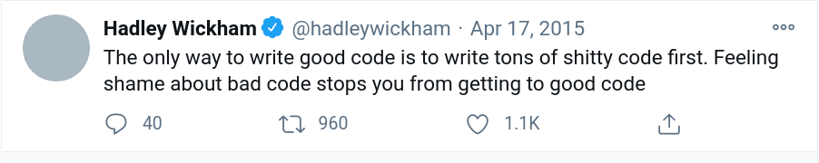

# Computational thinking {#motivation}


## Why computational thinking

-   If social scientists want to know how to work smart and not just hard, they need to take full advantage of the power of modern programming languages, and that power is **automation**.

-   Let's think about the following two cases (these examples come from [the column](https://dlab.berkeley.edu/blog/why-teaching-social-scientists-how-code-professional-important) I contributed to the D-Lab website).

    -   Case 1: Suppose a social scientist needs to collect data on civic organizations in the United States from websites, Internal Revenue Service reports, and social media posts. As the number of these organizations is large, the researcher could not collect a large volume of data from diverse sources, so they would hire undergraduates and distribute tasks. This is a typical data collection plan in social science research, and it is labor-intensive. Automation is not part of the game plan. Yet, it is critical for so many reasons. Because the process is costly, no one is likely to either replicate or update the data collection effort. Put differently, without making the process efficient, it is difficult for it to be reproducible and scalable.

    -   Case 2: An alternative is to write computer programs that collect such data automatically, parse them, and store them in interconnected databases. Additionally, someone may need to maintain and validate the quality of the data infrastructure. Nevertheless, this approach lowers the cost of the data collection process, thereby substantially increasing the **reproducibility** and **scalability**. Furthermore, the researcher can document their code and publicly share it using their GitHub repository or even gather some of the functions they used and distribute them as open-source libraries.

-   Programming is as valuable a skill as writing in social science research. The extent to which a researcher can automate the research process can determine its efficiency, reproducibility, and scalability.

> Every modern statistical and data analysis problem needs code to solve it. You shouldn't learn just the basics of programming, spend some time gaining mastery. Improving your programming skills pays off because code is a **force multiplier**: once you've solved a problem once, code allows you to solve it much faster in the future. As your programming skill increases, the generality of your solutions improves: you solve not just the precise problem you encountered, but a wider class of related problems (in this way programming skill is very much like mathematical skill). Finally, sharing your code with others allows them to benefit from your experience. - [Hadley Wickham](https://imstat.org/2014/12/16/hadley-wickham-impact-the-world-by-being-useful/)

-   What aspects of the social science research process can be automated? How can we teach a machine to perform these tasks for us?


-   This question touches the essence of computational thinking: "formulating a problem and expressing its solution in a way that a computer—human or machine—can effectively carry out" (defined by [Jeannette M. Wing](http://www.cs.cmu.edu/afs/cs/usr/wing/www/publications/Wing06.pdf))

This book teaches how you to do that in R in incremental steps.

-   From graphic user interface to command-line interface (ch 3)

-   From short programs to long programs (ch 4-5)

-   The ultimate goal is to solve complex problems at scale using computation (ch 6-7)

> "[W]e wanted users to be able to begin in an interactive environment, where they did not consciously think of themselves as programming. Then as their needs became clearer and their sophistication increased, they should be able to slide gradually into programming, when the language and system aspects would become more important." - *Stages in the Evolution of S* by John Chambers (S is the progenitor of R)

-   Beginners! Learning programming is a long game. The most important learning method (for almost any training) is consistency. Never stop writing code even though your current code may fall far short of the perfection.
    

-   Intermediate programmers! Try to empower, not intimidate, newbies. The most important rule in the computational social science community (at least, in my opinion) is being nice. Read David Robinson's ["A Million Lines of Bad Code"](http://varianceexplained.org/programming/bad-code/) for more insights.


## Computational way of thinking about data

-   Berkeley's widely praised data science undergraduate education is built upon inferential (statistics) and computational thinking. [The textbook](https://www.inferentialthinking.com/chapters/intro) used for teaching its most fundamental course (Data8) underscores computational thinking because "programming allows us to apply analysis techniques to the large and diverse data sets that arise in real-world applications: not just numbers, but text, images, videos, and sensor readings." This is also precisely the point of this textbook and explains how its content is organized.

### Structure

-   Fixed number of columns and rows?

    -   Yes!: Structured data (e.g., Excel spreadsheets, CSVs)

        -   Tidy data (a special case of structured data)

    -   No!: semi-structured data (e.g., PDFs, websites, and social media posts) unstructured data (e.g., plain texts)

### Dimension

Suppose n = the number of observations and p = the number of variables.

-   Low-dimensional data (n \> p)

    -   Most survey, experimental, and administrative data

-   High-dimensional data (n \< p)

    -   Text, speech, image, video, etc

### Size

-   Small and medium data: Data fit in your laptop's memory
-   Big data: Data don't fit in your laptop's memory

## Computational way of thinking about the research process

Computational tools and techniques make ...

-   Doing traditional research easier, faster, and scalable

    -   Data wrangling
    -   Modeling
    -   Visualization

-   Documentation and collaboration easier, faster and more scalable

    -   Dynamic reporting (markdown)
    -   Version control system (Git and GitHub)

-   Collecting and analyzing large and complex data feasible

    -   Digital data collection (web scraping and API)

        -   Building a data infrastructure (SQL)

    -   Machine learning

        -   Text as data, image as data, etc
        -   Machine learning applications to surveys and experiments

## References

Here are a couple of useful videos that introduce the main concepts of computational social science. Matthew Salganik (Professor of Sociology at Princeton) is co-founder of the [Summer Institute in Computational Social Science](https://sicss.io/), and Rayid Ghani (Professor of Machine Learning and Public Policy at Carnegie Mellon) is founder of the [Data Science for Social Good](https://www.dssgfellowship.org/). (Full disclaimer: I'm a former participant (Princeton 2019) and local organizer ([Bay Area 2020](https://sicss.io/2020/bay_area/)) of the Summer Institute in Computational Social Science. If you become interested in computational social science and wonder what should be your next step, I would highly recommend applying for the program.) Data Science for Social Good is another cool program that deserves your attention.

```{=html}
<iframe width="560" height="315" src="https://www.youtube.com/embed/zGG9wPl1C5E" frameborder="0" allow="accelerometer; autoplay; clipboard-write; encrypted-media; gyroscope; picture-in-picture" allowfullscreen></iframe>

<p An Introduction to Computational Social Science, Summer Institute in Computational Social Science /p>
```
```{=html}
<iframe width="560" height="315" src="https://www.youtube.com/embed/GTUozT9qxVw" frameborder="0" allow="accelerometer; autoplay; clipboard-write; encrypted-media; gyroscope; picture-in-picture" allowfullscreen></iframe>

<p Rayid Ghani | Keynote: Using Data Science for Social Good: Examples, Opportunities, and Challenges /p>
```

I also recommend looking at [the pedagogy article]((https://osf.io/preprints/socarxiv/pf7n6/?fbclid=IwAR2ZI0yw_pehS0mxAmeUBOGpzIhiO2LMUPGBzBLTLNo4C2HrJSoH9uZhgTY)) (forthcoming in *PS: Political Science and Politics*), I wrote with my colleague Margaret Ng, for those interested in more effective ways of learning and teaching computational methods. 
