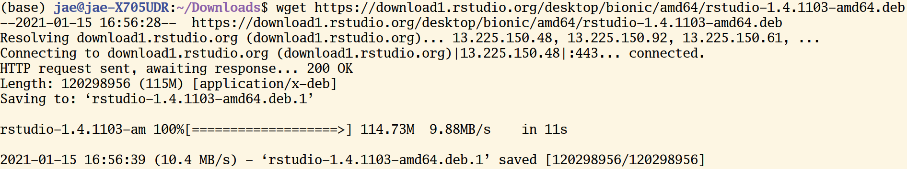
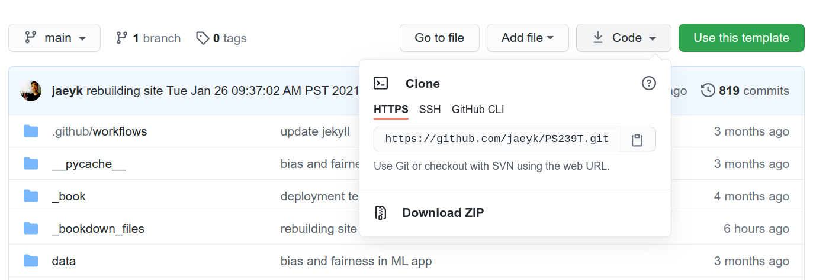

# Managing data and code {#git_bash}


## The Command Line 

### The Big Picture

As William Shotts the author of *[The Linux Command Line](http://linuxcommand.org/tlcl.php)* put it: 

> graphical user interfaces make easy tasks easy, while command-line interfaces make difficult tasks possible.

### Why bother using the command line?

Suppose that we want to create a plain text file that contains the word "test." If we want to do this in the command line, you need to know the following commands. 

1. `echo`: "Write arguments to the standard output" This is equivalent to using a text editor (e.g., nano, vim, emacs) and writing something.
2. `> test` Save the expression in a file named test.   

We can put these commands together like the following: 

```sh
echo "sth" > test 
```

Don't worry if you are worried about memorizing these and more commands. Memorization is a far less important aspect of learning programming. In general, if you don't know what a command does, just type `<command name> --help.` You can do `man <command name>` to obtain further information. Here, `man` stands for manual. If you need more user-friendly information, please consider using [`tldr`](https://tldr.sh/). 

Let's make this simple case complex by scaling up. Suppose we want to make 100 duplicates of the `test` file. Below is the one-line code that performs the task!

```sh
for i in {1..100}; do cp test "test_$i"; done  
```

Let me break down the seemingly complex workflow. 
1. `for i in {1..100}.` This is for loop. The numbers 1..100 inside the curly braces `{}` indicates the range of integers from 1 to 100. In R, this is equivalent to for (i in 1:100) {}  
2. `;` is used to use multiple commands without making line breaks. ; works in the same way in R. 
3. `$var` returns the value associated with a variable. Type `name=<Your name>`. Then, type `echo $name.` You should see your name printed. Variable assignment is one of the most basic things you'll learn in any programming. In R, we do this by using -> 

If you have zero experience in programming, I might have provided too many concepts too early, like variable assignment and for loop. However, you don't need to worry about them at this point. We will cover them in the next chapter. 

I will give you one more example to illustrate how powerful the command line is. Suppose we want to find which file contains the character "COVID." This is equivalent to finding a needle in a haystack. It's a daunting task for humans, but not for computers. Commands are verbs. So, to express this problem in a language that computers could understand, let's first find what command we should use. Often, a simple Google or [Stack Overflow](https://stackoverflow.com/) search leads to an answer. 

In this case, `grep` is the answer (there's also grep in R). This command finds PATTERNS in each FIEL. What follows - are options (called flags): `r` (recursive), `n` (line number), `w` (match only whole words), `e` (use patterns for matching). `rnw` are for output control and `e` is for pattern selection. 

So, to perform the task above, you just need one-line code: `grep -r -n -w -e "COVID''`

**Quick reminders**
- `grep`: command 
- `-rnw -e`: flags 
- `COVID`: argument (usually file or file paths)

Let's remove (=`rm`) all the duplicate files and the original file. `*` (any number of characters) is a wildcard (if you want to identify a single number of characters, use `?`). It finds every file whose name starts with `test_`.

```sh
rm test_* test 
```

Enough with demonstrations. What is this black magic? Can you do the same thing using a graphical interface? Which method is more efficient? I hope that my demonstrations give you enough sense of why learning the command line could be incredibly useful. In my experience, mastering the command line helps automate your research process from end to end. For instance, you don't need to write files from a website using your web browser. Instead, you can run the `wget` command in the terminal. Better yet, you don't even need to run the command for the second time. You can write a Shell script (`*.sh`) that automates downloading, moving, and sorting multiple files. 

### UNIX Shell 

The other thing you might have noticed is that there are many overlaps between the commands and base R functions (R functions that can be used without installing additional packages). This connection is not coincident. UNIX preceded and influenced many programming languages, including R. 

The following materials on UNIX and Shell are adapted from [the software carpentry](https://bids.GitHub.io/2015-06-04-berkeley/shell/00-intro.html.

#### Unix

UNIX is an **operating system + a set of tools (utilities)**. It was developed by AT & T employees at Bell Labs (1969-1971). From Mac OS X to Linux, many of the current operation systems are some versions of UNIX. Command-line INTERFACE is a way to communicate with your OS by typing, not pointing, and clicking. 

For this reason, if you're using Max OS, then you don't need to do anything else to experience UNIX. You're already all set. 

If you're using Windows, you need to install either GitBash (a good option if you only use Bash for Git and GitHub) or Windows Subsystem (highly recommended if your use case goes beyond Git and GitHub). For more information, see [this installation guideline](https://GitHub.com/PS239T/spring_2021/blob/main/B_Install.md) from the course repo. If you're a Windows user and don't use Windows 10, I recommend installing [VirtualBox](https://www.virtualbox.org/).

UNIX is old, but it is still mainstream, and it will be. Moreover, [the UNIX philosophy](https://en.wikipedia.org/wiki/Unix_philosophy) ("Do One Thing And Do It Well")---minimalist, modular software development---is highly and widely influential.  


```{=html}

<iframe width="560" height="315" src="https://www.youtube.com/embed/tc4ROCJYbm0" frameborder="0" allow="accelerometer; autoplay; clipboard-write; encrypted-media; gyroscope; picture-in-picture" allowfullscreen></iframe>
  
<p>AT&T Archives: The UNIX Operating System</p>
```

```{=html}

<iframe width="560" height="315" src="https://www.youtube.com/embed/xnCgoEyz31M" frameborder="0" allow="accelerometer; autoplay; clipboard-write; encrypted-media; gyroscope; picture-in-picture" allowfullscreen></iframe>

<p>Unix50 - Unix Today and Tomorrow: The Languages </p>
```

#### Kernel

The kernel of UNIX is the hub of the operating system: it allocates time and memory to programs. It handles the [filestore](http://users.ox.ac.uk/~martinw/unix/chap3.html) (e.g., files and directories) and communications in response to system calls. 

#### Shell

The shell is an interactive program that provides an interface between the user and the kernel. The shell interprets commands entered by the user or supplied by a Shell script and passes them to the kernel for execution. 

#### Human-Computer interfaces

At a high level, computers do four things:

- run programs
- store data
- communicate with each other
- interact with us (through either CLI or GUI)

#### The Command Line 

This kind of interface is called a **command-line interface**, or CLI,
to distinguish it from the **graphical user interface**, or GUI, that most people now use.

The heart of a CLI is a **read-evaluate-print loop**, or REPL: when the user types a command and then presses the enter (or return) key, the computer reads it, executes it, and prints its output. The user then types another command, and so on until the user logs off.

If you're using RStudio, you can use terminal inside RStudio (next to the "Console"). (For instance, type Alt + Shift + M)

#### The Shell 

This description makes it sound as though the user sends commands directly to the computer and sends the output directly to the user. In fact, there is usually a program in between called a **command shell**.


What the user types go into the shell; it figures out what commands to run and orders the computer to execute them. 

Note, the shell is called *the shell*: it encloses the operating system to hide some of its complexity and make it simpler to interact with. 

A shell is a program like any other. What's special about it is that its job is to run other programs rather than do calculations itself. The commands are themselves programs: when they terminate, the shell gives the user another prompt ($ on our systems).

#### Bash

The most popular Unix shell is **Bash**, the Bourne Again Shell (so-called because it's derived from a shell written by Stephen Bourne --- this is what passes for wit among programmers). Bash is the default shell on most modern implementations of **Unix** and in most packages that provide Unix-like tools for Windows.

#### Why Shell?

Using Bash or any other shell sometimes feels more like programming than like using a mouse. Commands are terse (often only a couple of characters long), their names are frequently cryptic, and their output is lines of text rather than something visual like a graph. 

On the other hand, the shell allows us to combine existing tools in powerful ways with only a few keystrokes and set up pipelines to handle large volumes of data automatically.

In addition, the command line is often the easiest way to interact with remote machines (explains why we learn Bash before learning Git and GitHub). If you work in a team and your team manages data in a remote server, you will likely need to get access the server via something like `ssh` (I will explain this when I explain `git`) and access a SQL database (this is the subject of the final chapter). 

#### Our first command

The part of the operating system responsible for managing files and directories is called the **file system**. It organizes our data into files, which hold information, and directories (also called "folders"), which hold files or other directories.

Several commands are frequently used to create, inspect, rename, and delete files and directories. To start exploring them, let's open a shell window:

```sh
jae@jae-X705UDR:~$ 
```

Let's demystify the output above. There's nothing complicated. 

- jae: a specific user name 
- jae-X705UDR: your computer/server name 
- `~`: current directory (`~` = home)
- `$`: a **prompt**, which shows us that the shell is waiting for input; your shell may show something more elaborate.

Type the command `whoami,` then press the Enter key (sometimes marked Return) to send the command to the shell.

The command's output is the ID of the current user, i.e., it shows us who the shell thinks we are:

```sh
$ whoami

# Should be your user name 
jae 
```

More specifically, when we type `whoami` the shell, the following sequence of events occurs behind the screen. 

1.  Finds a program called `whoami`,
2.  Runs that program,
3.  Displays that program's output, then
4.  Displays a new prompt to tell us that it's ready for more commands.

#### Communicating to other systems

In the next unit, we'll focus on the structure of our own operating systems. But our operating systems rarely work in isolation; we often rely on the Internet to communicate with others! You can visualize this sort of communication within your own shell by asking your computer to `ping` (based on the old term for submarine sonar) an IP address provided by Google (8.8.8.8); in effect, this will test whether your Internet is working. 

```sh
$ ping 8.8.8.8
```

Note: Windows users may have to try a slightly different alternative:

```sh
$ ping -t 8.8.8.8
```

(Thanks [Paul Thissen](http://www.paulthissen.org/) for the suggestion!)

#### File system organization

Next, let's find out where we are by running a `pwd` command (**print working directory**).

At any moment, our **current working directory** is our current default directory, i.e., the directory that the computer assumes we want to run commands in unless we explicitly specify something else.

Here, the computer's response is `/home/jae,` which is the **home directory**:

```sh
$ pwd

/home/jae
```

**Additional tips**

You can also download files to your computer in the terminal. 

1. Install wget utility 

```sh
# sudo = super user 
sudo apt-get install wget 
```

2. Download target files 

```sh 
wget https://download1.rstudio.org/desktop/bionic/amd64/rstudio-1.4.1103-amd64.deb
```



> #### Home Directory
>
> The home directory path will look different on different operating systems. For example, on Linux, it will look like `/home/jae,` and on Windows, it will be similar to `C:\Documents and Settings\jae.` Note that it may look slightly different for different versions of Windows.

> ####  whoami
>
> If the command to find out who we are is `whoami,` the command to find out where we are ought to be called `whereami,` so why is it `pwd` instead? The usual answer is that in the early 1970s, when Unix was first being developed, every keystroke counted: the devices of the day were slow, and backspacing on a teletype was so painful that cutting the number of keystrokes to cut the number of typing mistakes was a win for usability. The reality is that commands were added to Unix one by one, without any master plan, by people who were immersed in its jargon. 
>
> The good news: because these basic commands were so integral to the development of early Unix, they have stuck around and appear (in some form) in almost all programming languages.

> If you're working on a Mac, the file structure will look similar, but not identical. The following image shows a file system graph for the typical Mac.


We know that our current working directory `/home/jae` is stored inside `/home` because `/home` is the first part of its name. Similarly, we know that `/home` is stored inside the root directory `/` because its name begins with `/`.

#### Listing

Let's see what's in your home directory by running `ls` (**list files and directories):

```sh
$ ls

Applications		Dropbox			Pictures
Creative Cloud Files	Google Drive		Public
Desktop			Library			Untitled.ipynb
Documents		Movies			anaconda
Downloads		Music			file.txt
```

`ls` prints the names of the files and directories in the current directory in alphabetical order, arranged neatly into columns.

We can make `ls` more useful by adding flags. For instance, you can make your computer show only directories in the file system using the following command. Here `-F` flag classifies files based on some types. For example, `/` indicates directories. 

```sh
ls -F /
```

The leading `/` tells the computer to follow the path from the file system's root, so it always refers to exactly one directory, no matter where we are when we run the command.

If you want to see only directories in the current working directory, you can do the following. (Remember `^`? This wildcard identifies a single number of characters. In this case, `d'.)

```sh
ls -l | grep "^d"
```

What if we want to change our current working directory? Before we do this, `pwd` shows us that we're in `/home/jae,` and `ls` without any arguments shows us that directory's contents:

```sh
$ pwd

/home/jae

$ ls

Applications		Dropbox			Pictures
Creative Cloud Files	Google Drive		Public
Desktop			Library			Untitled.ipynb
Documents		Movies			anaconda
Downloads		Music			file.txt
```

Use relative paths (e.g., `../spring_2021/references.md`) whenever it's possible so that your code is not dependable on how your system is configured. 

**Additional tips**

How can I find pdf files in `Downloads` using the terminal? Remember `*` wildcard?

```sh
cd Downloads/ 

find *.pdf
```

Also, note that you don't need to type every character. Type the first few characters, then press TAB (autocomplete). This is called **tab-completion**, and we will see it in R as we go on.

#### Moving around

We can use `cd` (**change directory**) followed by a directory name to change our working directory. 

```sh
$ cd Desktop
```

`cd` doesn't print anything, but if we run `pwd` after it, we can see that we are now in `/home/jae/Desktop.`

If we run `ls` without arguments now, it lists the contents of `/home/jae/Desktop,` because that's where we now are:

```sh
$ pwd

/home/jae/Desktop
```

We now know how to go down the directory tree: how do we go up? We could use an absolute path:

```sh
$ cd /home/jae/
```

but it's almost always simpler to use `cd ..` to go up one level:

```sh
$ pwd

/home/jae/Desktop

$ cd ..
```

`..` is a special directory name meaning "the directory containing this one," or more succinctly, the **parent** of the current directory. Sure enough, if we run `pwd` after running `cd ..`, we're back in `/home/jae/`:

```sh
$ pwd

/home/jae/
```

The special directory `..` doesn't usually show up when we run `ls`. If we want to display it, we can give `ls` the `-a' flag:

```sh
$ ls -a

.		.localized	Shared
..		Guest		rachel
```

`-a' stands for "show all"; it forces `ls` to show us file and directory names that begin with `.`, such as `..`.

> #### Hidden Files: For Your Own Protection
> 
> As you can see, many other items just appeared when we enter `ls -a'. These files and directories begin with `.` followed by a name. Usually, files and directories hold important programmatic information. They are kept hidden so that users don't accidentally delete or edit them without knowing what they're doing.

As you can see, it also displays another special directory that's just called `.`, which means "the current working directory". It may seem redundant to have a name for it, but we'll see some uses for it soon.

**Additional tips**

The above navigating exercises help us know about `cd` command, but not very exciting. So let's do something more concrete and potentially useful. Let's say you downloaded a file using your web browser and locate that file. How could you do that?

Your first step should be learning more about the `ls` command. You can do that by Googling or typing `ls --help.` By looking at the documentation, you can recognize that you need to add `-t` (sort by time). Then, what's `|`? It's called pipe, and it chains commands. For instance, if `<command 1> | <command 2>`, then command1's output will be command2's input. `head` list the first ten lines of a file. `-n1` flag makes it show only the first line of the output (n1).

```sh
# Don't forget to use TAB completion
cd Downloads/ 

ls -t | head -n1
```

Yeah! We can do more cool things. For example, how can you find the most recently downloaded PDF file? You can do this by combining the two neat tricks you learned earlier. 

```sh
ls -t | find *.pdf | head -n1 
```

#### Creating, copying, removing, and renaming files 

##### Creating files 

1. First, let's create an empty directory named exercise 

```sh

mkdir exercise 

```

2. You can check whether the directory is created by typing `ls`. If the print format is challenging to read, add `-l` flag. Did you notice the difference?

3. Let's move to the `exercise` subdirectory and create a file named test 

```sh 

cd exercise ; touch test ; ls 

```

4. Read test 

```sh

cat test 

```

5. Hmn. It's empty. Let's add something there. `>` = overwrite 

```sh 

echo "something" > test ; cat test 

```

6. Yeah! Can you add more? `>>` = append 

```sh 

echo "anything" >> test ; cat test 

```

7. Removing "anything" from `test` is a little bit more complex because you need to know how to use `grep` (remember that we used this command in the very first example). Here, I just demonstrate that you can do this task using Bash, and let's dig into this more when we talk about working with text files.  

```sh 

grep -v 'anything' test

```

##### Copying and Removing Files 

1. Can we make a copy of `test`? Yes!

```sh

cp test test_1; cat 

```

2. Can we make 100 copies of `test?` Yes!

You can do this 

```sh

cp test test_1 
cp test test_2
cp test test_3 

... 

```

or 

```sh 

for i in {1..100}; do cp test "test_$i"; done  

```

Which one do you like? (Again, don't focus on for loop. We'll learn it and other similar tools to deal with iterations in the later chapters.)

3. Can you remove all of the `test_` files?

You can do this 

```sh 
rm test_1
rm test_2
rm test_3 

...

```

or 

```

rm test_*

```

Which one do you like?

4. Let's remove the directory. 

```sh

cd .. 

rm exercise/

```

The `rm` command should not work because `exercise` is not a file. Type `rm --help` and see which flag will be helpful. It might be `-d' (remove empty directories).

```
rm -d exercise/  
```

Oops. Still not working because the directory is not empty. Try this. Now, it works. 

```
rm -r exercise/ 
```

What's `-r`? It stands for recursion (e.g., Recursion is a very powerful idea in programming and helps solve complex problems. We'll come back to it many times (e.g., `purrr::reduce()` in R). 

```{=html}

<iframe width="560" height="315" src="https://www.youtube.com/embed/Mv9NEXX1VHc" frameborder="0" allow="accelerometer; autoplay; clipboard-write; encrypted-media; gyroscope; picture-in-picture" allowfullscreen></iframe>

<p> What on Earth is Recursion? - Computerphile </p>
```

##### Renaming files

1. Using `mv`

First, we will learn how to move files and see how it's relevant for renaming files. 

```sh

# Create two directories 
mkdir exercise_1 ; mkdir exercise_2 

# Check whether they were indeed created 
find exer*

# Create an empty file 
touch exercise_1/test 

# Move to exercise_1 and check 
cd exercise_1 ; ls 

# Move this file to exercise_2 
mv test ../exercise_2 

# Move to exercise_2 and check 
cd exercise_2 ; ls 
```

What `mv` has something to do with renaming?

* [mv] [source] [destination]

```sh

mv test new_test ; ls 

```

2. Using `rename`

`mv` is an excellent tool to rename one file. But how about renaming many files? (Note that your pwd is still `exercise_2` where you have the `new_test` file.)

```sh

for i in {1..100}; do cp new_test "test_$i.csv"; done  

```

Then install `rename`. Either `sudo apt-get install -y rename` or `brew install rename` (MacOS).

Basic syntax: rename [flags] perlexpr (Perl Expression) files. Note that [Perl](https://en.wikipedia.org/wiki/Perl) is another programming language. 

```sh
# Rename every csv file to txt file 
rename 's/.csv/.txt/' *.csv

# Check 
ls -l
```

The key part is `s/.csv/.txt/` = `s/FIND/REPLACE`

Can you perform the same task using GUI? Yes, you can, but it would be more time-consuming. Using the command line, you did this via just one-liner(!). [Keith Brandnam](http://korflab.ucdavis.edu/Bios/bio_keithb.html) wrote an excellent book titled [UNIX and Perl to the Rescue! (Cambridge University Press 2012)](https://www.amazon.com/Unix-Perl-Rescue-Keith-Bradnam/dp/0521169828) that discusses how to use UNIX and Perl to deal with massively large datasets.

#### Working with CSV and text files 

1. Download a CSV file (Forbes World's Billionaires lists from 1996-2014). For more on the data source, see [this site](https://corgis-edu.github.io/corgis/csv/billionaires/).

```sh
wget https://corgis-edu.github.io/corgis/datasets/csv/billionaires/billionaires.csv
```

2. Read the first two lines. `cat` is printing, and `head` shows the first few rows. `-n2` limits these number of rows equals 2. 

**Additional tips 1**
If you have a large text file, `cat` prints everything at once is inconvenient. The alternative is using `less.` 

```sh
cat billionaires.csv | head -n2
```

3. Check the size of the dataset (2615 rows). So, there are 2014 observations (n-1 because of the header). `wc` prints newline, word, and byte counts for each file. If you run `wc` without `-l` flag, you get the following: `2615 (line) 20433 (word) 607861 (byte) billionaires.csv`

```sh
wc -l billionaires.csv
```

4. How about the number of columns? `sed` is a stream editor and very powerful when it's used to filter text in a pipeline. For more information, see [this article](https://www.gnu.org/software/sed/manual/sed.html). You've already seen `s/FIND/REPLACE.` Here, the pattern we are using is `s/delimiter/\n/g.` We've seen that the delimiter is `,` so that's what I plugged in the command below. 

```sh
head -1 billionaires.csv | sed 's/,/\n/g' | nl
```

**Additional tips 2**
The other cool command for text parsing is `awk.` This command is handy for filtering.

1. This is the same as using `cat.` So, what's new? 

```sh
awk '{print}' billionaires.csv 
```

2. This is new. 

```sh
awk '/China/ {print}' billionaires.csv
```

3. Let's see only the five rows. We filtered rows so that every row in the final dataset contains 'China.' 

```sh
awk '/China/ {print}' billionaires.csv | head -n5 
```

4. You can also get the numbers of these rows. 

```sh
awk '/China/ {print NR}' billionaires.csv 
```

#### User roles and file permissions

1. If you need admin access, use `sudo.` For instance, `sudo apt-get install <package name>` installs the package. 

2. To run a Shell script (.sh), you need to change its file mode. You can make the script executable by typing `chmod +x <Shell script>.` Then, you can run it by typing `./pdf_copy_sh.` `.` refers to the current working directory. Other options: `sh pdf_copy_sh.` or `bash pdf_copy_sh.` I use `./pdf_copy_sh.`

#### Writing your first Shell script (.sh)

Finally, we're learning how to write a Shell script (a file that ends with .sh). Here I show how to write a Shell script that creates a subdirectory called `/pdfs` under `/Download` directory, then find PDF files in `/Download` and copy those files to `pdfs.` Essentially, this Shell script creates a backup. Name this Shell script as 'pdf_copy.sh.'

```sh

#!/bin/sh # Stating this is a Shell script. 

mkdir /home/jae/Downloads/pdfs # Obviously, in your case, this file path should be incorrect.

cd Download

cp *.pdf pdfs/ 

echo "Copied pdfs"

```

**Additional tips**

Using Make [TBD]

```{=html}

<iframe width="560" height="315" src="https://www.youtube.com/embed/aw9wHbFTnAQ" frameborder="0" allow="accelerometer; autoplay; clipboard-write; encrypted-media; gyroscope; picture-in-picture" allowfullscreen></iframe>

<p> Using make and writing Makefile (in C++ or C) by Programming Knowledge </p>
```

### References 

- [The Unix Workbench](https://seankross.com/the-unix-workbench/) by Sean Kross 

- [The Unix Shell](http://swcarpentry.GitHub.io/shell-novice/), Software Carpentry 

- [Data Science at the Command Line](https://www.datascienceatthecommandline.com/1e/) by Jeroen Janssens 

```{=html}

<iframe width="560" height="315" src="https://www.youtube.com/embed/QxpOKbv-KQU" frameborder="0" allow="accelerometer; autoplay; clipboard-write; encrypted-media; gyroscope; picture-in-picture" allowfullscreen></iframe>

<p> Obtaining, Scrubbing, and Exploring Data at the Command Line by Jeroen Janssens from YPlan, Data Council </p>
```

- [Shell Tools and Scripting](https://missing.csail.mit.edu/2020/shell-tools/), ./missing-semester, MIT  

- [Command-line Environment](https://missing.csail.mit.edu/2020/command-line/), ./missing-semester, MIT


## Git and GitHub

### The Big Picture

**The most important point**

* Backup != Version control

* If you do version control, you need to save your **raw data** in your hard disk, external drive, or cloud, but nothing else. In other words, anything you are going to change should be subject to version control (also, it's not the same as saving your code with names like 20200120_Kim or something like that). Below, I will explain what version control is and how to do it using Git and GitHub. 


### Version control system 

According to [GitHub Guides](https://guides.GitHub.com), a version control system "tracks the history of changes as people and teams collaborate on projects together." Specifically, it helps to track the following information:

* Which changes were made?
* Who made the changes?
* When were the changes made?
* Why were changes needed?

Git is a case of a [distributed version control system](https://en.wikipedia.org/wiki/Distributed_version_control), common in open source and commercial software development. This is no surprise given that Git [was originally created](https://lkml.org/lkml/2005/4/6/121) to deal with Linux kernel development. 

The following images, from [Pro Git](git-scm.com), show how a centralized (e.g., CVS, Subversion, and Perforce) and decentralized VCS (e.g., Git, Mercurial, Bazzar or Darcs) works differently. 


Figure 2. Centralized VCS.


Figure 3. Decentralized VCS.

For more information on the varieties of version control systems, please read [Petr Baudis's review](https://pdfs.semanticscholar.org/4490/4c70bc91e1bed4fe02b9e2282f031b7c90ea.pdf) on that subject.


```{=html}

<iframe width="560" height="315" src="https://www.youtube.com/embed/PFwUHTE6mFc" frameborder="0" allow="accelerometer; autoplay; clipboard-write; encrypted-media; gyroscope; picture-in-picture" allowfullscreen></iframe>

<p> Webcast • Introduction to Git and GitHub • Featuring Mehan Jayasuriya, GitHub Training & Guides </p>
```


For more information, watch the following video:

```{=html}

<iframe width="560" height="315" src="https://www.youtube.com/embed/u6G3fbmpWr8" frameborder="0" allow="accelerometer; autoplay; clipboard-write; encrypted-media; gyroscope; picture-in-picture" allowfullscreen></iframe>

<p> The Basics of Git and GitHub, GitHub Training & Guides </p>
```

### Setup 

#### Signup 

1. Make sure you have installed Git ([[tutorial]](https://happygitwithr.com/install-git.html#install-git)). 

```sh
git --version 
# git version 2.xx.x
```

2. If you haven't, please sign up for a GitHub account: https://github.com/
  - If you're a student, please also sign up for GitHub Student Developer Pack: https://education.github.com/pack Basically, you can get a GitHub pro account for free (so why not?).
  
3. Access GitHub using Hypertext Transfer Protocol Secure (HTTPS) or Secure Shell (SSH).

**HTTPS**

1. Create a personal access token. Follow this guideline: https://docs.github.com/en/github/authenticating-to-github/creating-a-personal-access-token

2. Store your credential somewhere safe. You can use an R package like this [gitcreds](https://gitcreds.r-lib.org/) and [credentials](https://docs.ropensci.org/credentials/) to do so.


```r
pacman::p_load(gitcreds)

# First time only 
gitcreds_set()

# Check 
gitcreds_get()
```
3. If you get asked to provide your password when you pull or push, the password should be your GitHub token (to be precise, personal access token). 

**SSH**

If possible, I highly recommend using SSH. Using SSH is safer and also makes connecting GitHub easier. SSH has two keys (public and private). The public key could be stored on any server (e.g., GitHub) and the private key could be saved in your client (e.g., your laptop). Only when the two are matched, the system unlocks. 

1. First, read [this tutorial](https://docs.github.com/en/github/authenticating-to-github/connecting-to-github-with-ssh ) and create SSH keys.

2. Second, read [this tutorial](https://happygitwithr.com/ssh-keys.html) and check the keys and provide the public key to GitHub and add the private key to ssh-agent.

Next time, if you want to use SSH, remember the following.

```sh
# SSH
git@github.com:<user>/<repo>.git

# HTTPS
https://github.com/<user>/<repo>.git
```

**Additional tips**

When you try to clone a git repo, you can get the links like the above by clicking the CODE action button on GitHub.



#### Configurations 

1. Method 1: using the terminal 

```sh

# User name and email 
$ git config --global user.name "Firstname Lastname"
$ git config --global user.email username@school.extension

```

2. Method 2: using RStudio (if you insist on using R)


```r
pacman::p_load(usethis)
use_git_config(user.name = "<Firstname Lastname>",
               user.email = "<username@school.extension>")
```

You're all set!

### Cloning a repository 

Let's clone a repository. The following address is the course I co-taught in Spring 2021.

```sh
git clone https://github.com/PS239T/spring_2021
```

If you `cd spring_2021/` you can move to the cloned course repository. Cloning: copying a public GitHub repo (remote) -> Your machine 

If I made some changes in the remote repo, you can apply them to your local copy by typing `git pull.` You may get promoted to provide a password. Then type the following to switch the remote URL's address from HTTPS to SSH.

```sh
git remote set-url origin git@github.com:[user]/[repo]
```

If this doesn't work and get the following error, try the following (assuming that your SSH key was removed). If you're using Mac, try this instead: `ssh-add -k ~/.ssh/id_rsa` 

```sh
ssh-add ~/.ssh/id_rsa
```

If you still face difficulties, see [this stack overflow thread](https://stackoverflow.com/questions/13509293/git-fatal-could-not-read-from-remote-repository).

If you screwed something up in your local copy, you can just overwrite the local copy using the remote repo and make it exactly looks like the latter. 

```sh
# Download content from a remote repo 
git fetch origin

# Going back to origin/main
git reset --hard origin/main 

# Remove local files 
git clean -f
```

Note that the default branch name changed from master to main: https://github.com/github/renaming (Finally!) For this reason, if you're interacting with old repositories, the main branch name is likely to master.

**Additional tips**
You can see cloning and forking on GitHub, and they sound similar. Let me differentiate them.

* Cloning: creating a local copy of a **public** GitHub repo. In this case, you have writing access to the repo.

* Forking (for open source projects): creating a copy of a **public** GitHub repo to your GitHub account, then you can clone it. In this case, you don't have writing access to the repo. You need to create pull requests if you want your changes reflected in the original repo. Don't worry about pull requests, as I will explain the concept shortly. For more information, see [this documentation](https://docs.github.com/en/desktop/contributing-and-collaborating-using-github-desktop/cloning-and-forking-repositories-from-github-desktop). 

### Making a repository 

Create a new directory and move there. 
Then initialize 

```sh 
# new directory 
$ mkdir code_exercise
# move 
$ cd code_exercise 
# initialize
$ git init 
```

Alternatively, you can create a Git repository via GitHub and then clone it on your local machine. Perhaps, it is an easier path for new users (I also do this all the time). I highly recommend adding README (more on why we do this in the following subsection).

```sh
$ git clone /path/to/repository
```

**Additional tips**
If you're unfamiliar with basic Git commands, please refer to [this Git cheat sheet](http://rogerdudler.GitHub.io/git-guide/files/git_cheat_sheet.pdf).

### Commit changes 

These features show how Git works as a version control system. 

If you edited files or added new ones, you need to update your repository. In Git terms, this action is called committing changes. 

My current pwd is `spring_2021`. I created a text file named `test` containing text `jae.` You can check the file exists by typing `find "test```.

The following is a typical workflow to reflect this change to the remote. 

```sh
$ git status # check what's changed. 
$ git add . # update every change. In Git terms, you're staging. 
$ git add file_name # or stage a specific file.
$ git commit -m "your comment" # your comment for the commit. 
$ git push origin main # commit the change. Origin is a default name given to a server by Git. `origin main` are optional. 
```

Another image from [Pro Git](https://git-scm.com/about/staging-area) nicely illustrates this process.


If you made a mistake, don't panic. You can't revert the process.

```sh
git reset --soft HEAD~1 # if you still want to keep the change, but you go back to t-1 
git reset --hard HEAD~1 # if you're sure the change is unnecessary 
```

Writing an informative commit is essential. To learn how to do this better, see the following video: 

```{=html}

<iframe width="560" height="315" src="https://www.youtube.com/embed/m0t1mOeAJgs" frameborder="0" allow="accelerometer; autoplay; clipboard-write; encrypted-media; gyroscope; picture-in-picture" allowfullscreen></iframe>

<p> Your Commits Should Tell a Story • Featuring Eliza Brock Marcum, GitHub Training & Guides </p>

```

### Push and pull (or fetch)

These features show how Git works as a collaboration tool. 

If you have not already done it, let's clone the PS239T directory on your local machine.

```sh
$ git clone https://github.com/PS239T/spring_2021 # clone 
```

**Additional tips 1**

If you try to remove `spring_2021` using `rm -r spring_2021/`, you will get an error about the write-protected regular file. Then, try `rm -rf spring_2021/`. 

Then, let's learn more about the repository.

```sh
$ git remote -v 
```

You should see something like the following:

```sh
origin	git@github.com:PS239T/spring_2021 (fetch)
origin	git@github.com:PS239T/spring_2021 (push)
```

If you want to see more information, then type `git remote show origin.`

Previously, we learned how to send your data to save in the local machine to the remote (the GitHub server). You can do that by editing or creating files, committing, and typing **git push**. 

Instead, if you want to update your local data with the remote data, you can type **git pull origin** (something like pwd in bash). Alternatively, you can use fetch (retrieve data from a remote). Git retrieves the data and merges it into your local data when you do that.

```sh
$ git fetch origin
```

**Additional tips 2**

Developers usually use PR to refer pull requests. When you are making PRs, it's recommended to scope down (small PRs) because they are easier on reviewers and to test. To learn about how to accomplish this, see [this blog post](https://www.netlify.com/blog/2020/03/31/how-to-scope-down-prs/) by Sarah Drasner.

### Branching 

It's an advanced feature of Git's version control system that allows developers to "diverge from the main line of development and continue to do work without messing with that main line," according to [Scott Chacon and Ben Straub](https://git-scm.com/book/en/v1/Git-Branching). 

If you start working on a new feature, create a new branch. 

```sh
$ git branch new_features
$ git checkout new_features
```

You can see the newly created branch by typing **git branch**.

In short, branching makes Git [works like](https://git-scm.com/book/en/v2/Getting-Started-Git-Basics) a mini file system.


### Other useful commands 

1. For tracking history

```sh
$ git diff # to see what changed (e.g., inside a file)
$ git log # to track who committed what
$ git log -S <pattern> # you can find a log that contains the pattern 
$ git checkout # to recover old files 
$ git revert # revert to the previous commit 
```

2. For removing and renaming files 

```sh
$ git rm file_name # remove 
$ git mv old_file_name new_file_name # rename a file 
```

How about removing a directory only from GitHub but not local?

```sh
git rm -r --cached <directory>
git commit -m "<message>"
git push
```

### Collaborations 

Two options. 

* Sharing a repository (suitable for a private project).
* Fork and pull (suitable for an open-source project). 
    ​    * The one who maintains the repository becomes the maintainer. 
    ​    * The others can [fork](https://help.GitHub.com/articles/about-forks/), make changes, and even [pull](https://help.GitHub.com/articles/about-pull-requests/) them back.

### Deployment: GitHub Pages 

Useful to deploy websites. I used the GitHub page to deploy this book. 

```{=html}

<iframe width="560" height="315" src="https://www.youtube.com/embed/4TrOCv5Kukk" frameborder="0" allow="accelerometer; autoplay; clipboard-write; encrypted-media; gyroscope; picture-in-picture" allowfullscreen></iframe>

<p> Webcast • Get Started with GitHub Pages • Featuring Dani Traphagen, GitHub Training & Guides </p>

```

### Tracking progress: GitHub Issues 

Useful to collect and respond to questions and suggestions (e.g., bug reports and feature suggestions) on the projects on which you're working.

```{=html}

<iframe width="560" height="315" src="https://www.youtube.com/embed/TJlYiMp8FuY" frameborder="0" allow="accelerometer; autoplay; clipboard-write; encrypted-media; gyroscope; picture-in-picture" allowfullscreen></iframe>

<p> Webcast • GitHub Issues • A Quick Look, GitHub Training & Guides </p>

```

### Project management: GitHub Dashboards

I use GitHub dashboards for almost every project that I have done. 

```{=html}

<iframe width="560" height="315" src="https://www.youtube.com/embed/YxKhb3fxtsU" frameborder="0" allow="accelerometer; autoplay; clipboard-write; encrypted-media; gyroscope; picture-in-picture" allowfullscreen></iframe>

<p> GitHub Projects Demo: Automation, Kanban, Scrum, Issues, Pull Request, Milestones, Issues, Tasks by Brandan Jones </p>
```

### Using Git clients

Okay. Using command-line Git helps you understand how Git works. Also, you know that I'd love to do almost everything in the terminal if possible. However, using the command-line Git is sometimes too complicated or too buggy. An alternative is using Git clients (GUI). 

I use [Git Kraken](https://www.gitkraken.com/) because it's free, works on almost every OS (Windows, Mac, and Linux), and is quite versatile. It's instrumental in tracing and understanding your development process (e.g., commits, branches, pull requests, comments). I also heard positive things about [GitHub Desktop](https://desktop.github.com/) (Windows and Mac) and [Sourcetree](https://www.sourcetreeapp.com/) (Windows). 
## Getting started in R 

### The Big Picture 

When you are reading this section, please note that you've already grasped some key concepts behind R programming language (functions and objects). 

UNIX Commands (`cat`) = R Functions (`print`) 
Files = R Objects 

### RStudio 

There are two main ways of interacting with R: using the console or using script files (plain text files containing your code).

If R is ready to accept commands, the R console shows a `>` prompt. If it receives a command (by typing, copy-pasting, or sent from the script editor using `Ctrl-Enter`; `Command-Enter` will also work on Macs), R will try to execute it, and when ready, show the results and come back with a new `>`-prompt to wait for further commands. This is the equivalent of the `$` in your terminal. 

### Basic Syntax

**Comments**

Use `#` signs to comment. Comment liberally in your R scripts. Anything to the right of a `#` is ignored by R. For those of you familiar with other languages, there is no doc string, or equivalent to `""``` in R.

**Assignment operator**

`<-` is the assignment operator. It assigns values on the right to objects on the left. So, after executing `x <- 3`, `x` value is `3`. The arrow can be read as 3 **goes into** `x`.  You can also use `=` for assignments. 


```r
USweird <- "Why use lb for pound!" # Use this

"Why use lb for pound!" = USweird
```

Nonetheless, *can* does not mean you *should*. It is good practice to use `<-` for assignments. `=` should only be used to specify the values of arguments of functions. This is what Google and Hadley Wickham recommend as well. If they don't convince you enough, here's [a real example](https://csgillespie.wordpress.com/2010/11/16/assignment-operators-in-r-vs/).


```r
mean(x = 1:10) # Does it save x?
```

```
## [1] 5.5
```

```r
rm(x)
```

```
## Warning in rm(x): object 'x' not found
```

```r
mean(x <- 1:10) # Does it save x?
```

```
## [1] 5.5
```

```r
rm(x)
```

**Printing**

In R, an object's contents can be printed by simply executing the object name or calling the ```print()``` function.

**Help**

* `?` + object opens a help page for that specific object
* `??` + object searches help pages containing the name of the object


```r
?mean
??mean
help(mean)

# The above three will do the same. 

example(ls) # provides an example(s) for how to use ls 

help.search("visualization") # search functions and packages that have "visualization" in their descriptions
```

### Environment 

Environment = a collection of pairs 

#### Objects 

- List objects in your current environment


```r
# Create a numeric object 
x <- c(1,2,3,4,5)

# List the object 
ls()

# Remove the object 
rm(x)
```

- Remove objects from your current environment


```r
# Create an object 
x <- 5

# Remove the object 
rm(x)
```

- Remove all objects from your current environment


```r
# Create an object 
a <- 7

b <- 3

# Remove the object 
rm(list = ls())
```

- Force memory release 


```r
# Garbage collect; for more information, type ?gc() 

gc()
```

#### Packages 

`install.packages(package-name)` will download a package from one of the CRAN mirrors, assuming that a binary is available for your operating system. 


```r
# From CRAN
install.packages("dplyr") 

# Load package 
library(dplyr)

# From GitHub 
devtools::install_GitHub("jaeyk/tidytweetjson") # my own package 

# Unload package 
# detach("package:stats", unload=TRUE)
```

**Tips**

If you have multiple packages to install, then please consider using the `pacman` package. The following is an example. First, you install `pacman`. Then, you load several libraries by using `p_load()` method.


```r
install.packages("pacman")

pacman::p_load(
  ggplot2,
  dplyr, 
  broom
)
```

If you don't like to use `pacman,` the other option is to create a list (we're going to learn what is list soon).


```r
pkgs <- c("ggplot2", "dplyr", "broom")

install.packages(pkgs)
```
  
Still, we have to write two lines. The more straightforward, the better, right? Here's another approach that can simplify the code further.

Note that `lapply()` applies (there's a family of apply functions) a function to a list. In this case, library to pkgs. `apply` is an advanced concept related to anonymous functions. We will learn about it later when we study functions.


```r
inst <- lapply(pkgs, library, 
               character.only = TRUE)
```

## Project-oriented research

### The Big Picture 

**Computational reproducibility**

* Replication = code + data 

* Computational reproduciblity = code + data + environment + distribution 

* Reproducibility checklist by [Roger Peng](http://www.biostat.jhsph.edu/~rpeng/)

    1. Start with science (avoid vague questions and concepts)
    
    2. Don't do things by hand (not only about automation but also documentation)
    
    3. Don't point and click (same problem)
    
    4. Teach a computer (automation also solves documentation to some extent)
    
    5. Use some version control 
    
    6. Don't save output (instead, keep the input and code)
    
    7. Set your seed 
    
    8. Think about the entire pipeline 

#### Setup


```r
pacman::p_load(
  tidyverse, # tidyverse
  here # computational reproducibility
)
```

#### Motivation 

Why do you need to make your research computationally reproducible?: for your self-interest and public benefits. 


#### How to organize files in a project 

You won't be able to reproduce your project unless it is efficiently organized. 

Step 1. [**Environment**](https://environments.rstudio.com/) is part of your project. If someone can't reproduce your environment, they won't be able to run your code.

- Launch R Studio. Tools > Global Options. You **should not** check Restore .RData into workspace at startup. Also, set the saving workspace option to **NEVER.**

Step 2. For each project, create a project directory named after the project. 

name_of_the_project 

- data: 
  - raw 
  - processed (all processed, cleaned, and tided)
- figures 
- packrat (optional) 
- reports (PDF, HTML, TEX, etc.,) 
- results (model outcomes, etc.,)
- scripts (i.e., functions)
- .gitignore (for Git)
- name_of_project.Rproj (for R)
- README.md (for Git) 


```r
# Don't name it a project. Instead, use a more informative name. For instance, `us_election`, not `my_project.`

dir.create("../us_election")
```

Step 3. Launch R Studio. Choose File > New project > Browse existing directories > Create project. This allows each project has its workspace. 

Step 4. Organize files by putting them in separate subdirectories and sensibly naming them.

- Treat raw data as read-only (raw data should be RAW!) and put it in the `data` subdirectory.

    - Again, note that version control does not need to replace backup. You still need to back up your raw data. 


```r
dir.create(here::here("us_election", "data"))
```

- Separate read-only data from processed data and put in the `processed_data` subdirectory.


```r
dir.create(here::here("us_election", "processed_data"))
```

- Put your code in the `src` subdirectory. 


```r
dir.create(here::here("us_election", "src"))
```

- Put generated outputs (e.g., tables, figures) in the `outputs` subdirectory and treat them as disposable.


```r
dir.create(here::here("us_election", "outputs"))
```

- Put your custom functions in the `functions` subdirectory. Then, you can gather some of these functions and distribute them as an open-source library. 


```r
dir.create(here::here("us_election", "functions"))
```

Are you tired of creating these directories one by one? Why not automate? See the following example. You can save this function as a rscript (e.g., `setup.r`) and run it in the terminal using `Rscript <script name>.`


```r
if (!require(pacman)) install.packages("pacman")

# Load here
pacman::p_load(
  purrr, # functional programming
  here # computational reproducibility
)

# Custom function
create_dirs <- function(name) {
  dir.create(here(name))
}

# Apply function 
purrr::map(c("data", "processed_data", "src", "outputs", "functions"), create_dirs)
```

**Challenge**

Set a project structure for a project named "starwars." 

#### How to organize code in an R markdown file 

- In addition to environment, **workflow** is an essential component of project efficiency and reproducibility. 

- What is R markdown? An R package, developed by [Yihui Xie](https://yihui.org/en/), provides an authoring framework for data science. Xie is also a developer of many widely popular R packages such as `knitr,` [`xaringan`](https://GitHub.com/yihui/xaringan) (cool kids use xaringan not [Beamer](https://en.wikipedia.org/wiki/Beamer_(LaTeX)) these days), `blogdown` (used to create [my personal website](https://jaeyk.GitHub.io/)), and `bookdown` (used to create this book) among many others.

  - Many applications: [reports](https://rstudio.GitHub.io/distill/basics.html), [presentations](https://bookdown.org/yihui/rmarkdown/xaringan.html), [dashboards](https://rmarkdown.rstudio.com/flexdashboard/), [websites](https://bookdown.org/yihui/rmarkdown/websites.html)  
  - Check out [Communicating with R markdown workshop](https://ysc-rmarkdown.netlify.app/) by [Alison Hill](https://alison.rbind.io/) (RStudio)
    - Alison Hill is a co-author of [`blogdown: Creating Websites with R Markdown.`](https://bookdown.org/yihui/blogdown/) 
  - Key strengths: dynamic reporting + reproducible science + easy deployment


```{=html}
<iframe width="560" height="315" src="https://www.youtube.com/embed/s9aWmU0atlQ" frameborder="0" allow="accelerometer; autoplay; clipboard-write; encrypted-media; gyroscope; picture-in-picture" allowfullscreen></iframe>

<p>R Markdown The bigger picture - Garrett Grolemund</p>
```

```{=html}
<iframe width="560" height="315" src="https://www.youtube.com/embed/Xn5AmUf7gDQ" frameborder="0" allow="accelerometer; autoplay; clipboard-write; encrypted-media; gyroscope; picture-in-picture" allowfullscreen></iframe>

<p>R-Ladies Oslo (English) - Reports to impress your boss! Rmarkdown magic - Athanasia Mowinckel</p>
```

- R Markdown basic syntax 


```r
# Header 1
## Header 2
### Header 3
```

- Use these section headers to indicate workflow.


```r
# Import packages and data
# Tidy data
# Wrangle data
# Model data
# Visualize data
```

Press `ctrl + shift + o`. You can see a document outline based on these headers. This is a nice feature for finding the code you need to focus on. 

If your project's scale is large, divide these sections into files and numbers and save them in the `code` subdirectory. 

   - 01_wrangling.Rmd
   - 02_modeling.Rmd 
   ... 

#### Making a project computationally reproducible

- `setwd()`: set a working directory. 

- Note that using `setwd()` is not a reproducible way to set up your project. For instance, none will be able to run the following code except me.


```r
# Set a working directory 
setwd("/home/jae/starwars")

# Do something 
ggplot(mtcars, aes(x = mpg, y = wt)) +
   geom_point()

# Export the object. 
# dot means the working directory set by setwd()
ggsave("./outputs/example.png") # This is called relative path 
```

- Instead, learn how to use `here()`'.

   - Key idea: separate workflow (e.g., workspace information) from products (code and data). For more information, please read Jenny Bryan's excellent piece on [project-oriented workflow](https://www.tidyverse.org/blog/2017/12/workflow-vs-script/).

   - Example 


```r
# New: Reproducible 

ggplot(mtcars, aes(x = mpg, y = wt)) +
   geom_point()

ggsave(here("project", "outputs", "example.png"))
```

   - How `here` works 

   `here()` function shows what's the top-level project directory. 


```r
here::here()
```
   - Build a path including subdirectories 


```r
here::here("project", "outputs")
           #depth 1   #depth 2
```
   - How `here` defines the top-level project directory. For example, the following list came from [the here package vignette](https://GitHub.com/jennybc/here_here)).

      - Is a file named .here present?
      - Is this an RStudio Project? (**Note that we already set up an RStudio Project!** So, if you use RStudio's project feature, then you are ready to use `here`.)
      - Is this an R package? Does it have a DESCRIPTION file?
      - Is this a remake project? Does it have a file named `remake.yml`?
      - Is this a projectile project? Does it have a file named `.projectile`?
      - Is this a checkout from a version control system? Does it have a directory named `.git` or `.svn`? Currently, only Git and Subversion are supported.

      - If there's no match then use `set_here()` to create an empty `.here` file. 

**Challenge**

1. Can you define computational reproducibility? 
2. Can you explain why sharing code and data is not enough for computational reproducibility

### References 

- Code and data management 

  - ["Code and Data for the Social Sciences: A Practitioner's Guide"](https://web.stanford.edu/~gentzkow/research/CodeAndData.pdf) by Matthew Gentkow and Jesse M. Shapiro 
  
- Project-oriented research
   
  - Computational reproducibility 

    - ["Good Enough Practices in Scientific Computing"](https://GitHub.com/swcarpentry/good-enough-practices-in-scientific-computing/blob/gh-pages/good-enough-practices-for-scientific-computing.pdf) by PLOS
      
    - [Project Management with RStudio](https://swcarpentry.GitHub.io/r-novice-gapminder/02-project-intro/) by Software Carpentry
      
    - [Initial steps toward reproducible research](https://kbroman.org/steps2rr/) by Karl Broman
      
  - Version control 
   
    - [Version Control with Git](https://swcarpentry.GitHub.io/git-novice/) by Software Carpentry
   
    - [The Plain Person’s Guide to Plain Text Social Science](http://plain-text.co/) by Kieran Healy 


## Writing code: How to code like a professional

### The Bic Piture 

- What is code style?

> Every major open-source project has its style guide: a set of conventions (sometimes arbitrary) about writing code for that project. It is much easier to understand a large codebase when all the code in it is in a consistent style. - [Google Style Guides](https://google.GitHub.io/styleguide/) 

```{=html}

<iframe width="560" height="315" src="https://www.youtube.com/embed/UjhX2sVf0eg" frameborder="0" allow="accelerometer; autoplay; clipboard-write; encrypted-media; gyroscope; picture-in-picture" 
allowfullscreen></iframe>

<p>10 Tips For Clean Code - Michael Toppa</p>

```

- How to avoid smelly code? 

  - Check out [the code-smells Git repository](https://GitHub.com/jennybc/code-smells-and-feels#readme) by Jenny Bryan. 
  
```{=html}
<iframe width="560" height="315" src="https://www.youtube.com/embed/7oyiPBjLAWY" frameborder="0" allow="accelerometer; autoplay; clipboard-write; encrypted-media; gyroscope; picture-in-picture" allowfullscreen></iframe>

<p> Code smells and feels - Jenny Bryan</p>

<p> "Code smell" is an evocative term for that vague feeling of unease we get when reading certain bits of code. It's not necessarily wrong, but neither is it obviously correct. We may be reluctant to work on such code because past experience suggests it's going to be fiddly and bug-prone. In contrast, there's another type of code that just feels good to read and work on. What's the difference? If we can be more precise about code smells and feels, we can be intentional about writing code that is easier and more pleasant to work on. I've been fortunate to spend the last couple of years embedded in a group of developers working on the tidyverse and r-lib packages. Based on this experience, I'll talk about specific code smells and deodorizing strategies for R. - Jenny Bryan</p>
```

### Write readable code

- Naming matters 

  - When naming files, remember the following three rules:
      - Machine-readable (avoid spaces, punctuation, periods, and any other special characters except _ and -)
      - Human readable (should be meaningful. No text1, image1, etc.,)
      - Ordering (e.g., 01, 02, 03,  ... )
    


```r
# Good
fit_models.R

# Bad
fit models.R
```

  - When naming objects:
      - Don't use special characters.
      - Don't capitalize.


```r
# Good 
day_one
    
# Bad 
DayOne
```

  - When naming functions:
      - Don't use special characters.
      - Don't capitalize.
      - Use `verbs` instead of `nouns`. (Functions do something!)
    

```r
# Good 
run_rdd 

# Bad 
rdd
```
    
- Spacing 

Some people do spacing by pressing the Tab key, and others do it by pressing the Space key multiple times (and this is a serious subject).

```{=html}

<iframe width="560" height="315" src="https://www.youtube.com/embed/SsoOG6ZeyUI" frameborder="0" allow="accelerometer; autoplay; clipboard-write; encrypted-media; gyroscope; picture-in-picture" allowfullscreen></iframe>

<p> Tabs versus Spaces </p>

```


```r
# Good
x[, 1] 

mean(x, na.rm = TRUE) 

# Bad

x[,1]

mean (x, na.rm = TRUE)
```

- Indenting 

Indent at least 4 spaces. Note that some people, including none other than [Roger Peng](https://simplystatistics.org/2018/07/27/why-i-indent-my-code-8-spaces/), indent 8 spaces. The below example shows how you can change the default indentation setting using the RStudio configuration.
    


```r
# Good
if (y < 0) {
  message("y is negative")
}

# Bad
if (y < 0) {
message("Y is negative")}
```

- Long lines


```r
# Good
do_something_very_complicated(
  something = "that",
  requires = many,
  arguments = "some of which may be long"
)

# Bad
do_something_very_complicated("that", requires = many, arguments =
                              "some of which may be long"
                              )
```

- Comments 
   - Use comments to explain your decisions. 
   - But, show your code; Do not try to explain your code by comments.
   - Also, try to comment out rather than delete the code you experiment with. 


```r
# Average sleep hours of Jae
jae %>%
  # By week
  group_by(week) %>%
  # Mean sleep hours 
  summarise(week_sleep = mean(sleep, na.rm = TRUE))
```

- Pipes (chaining commands)


```r
# Good
iris %>%
  group_by(Species) %>%
  summarize_if(is.numeric, mean) %>%
  ungroup() %>%
  gather(measure, value, -Species) %>%
  arrange(value)

# Bad
iris %>% group_by(Species) %>% summarize_all(mean) %>%
ungroup %>% gather(measure, value, -Species) %>%
arrange(value)
```

- Additional tips 

- Use `lintr` to check whether your code complies with a recommended style guideline (e.g., `tidyverse`) and `styler` package to format your code according to the style guideline.


### Write reusable code 

- Pasting 

> Copy-and-paste programming, sometimes referred to as just pasting, is the production of highly repetitive computer programming code, as produced by copy and paste operations. It is primarily a pejorative term; those who use the term are often implying a lack of programming competence. It may also be the result of technology limitations (e.g., an insufficiently expressive development environment) as subroutines or libraries would normally be used instead. However, there are occasions when copy-and-paste programming is considered acceptable or necessary, such as for boilerplate, loop unrolling (when not supported automatically by the compiler), or certain programming idioms, and it is supported by some source code editors in the form of snippets. - [Wikipedia](https://en.wikipedia.org/wiki/Copy-and-paste_programming) 

- It's okay for pasting for the first attempt to solve a problem. But if you copy and paste three times (a.k.a. [Rule of Three](https://en.wikipedia.org/wiki/Rule_of_three_(computer_programming)) in programming), something's wrong. You're working too hard. You need to be lazy. What do I mean, and how can you do that?

- The following exercise was inspired by [Wickham's example](http://adv-r.had.co.nz/Functional-programming.html).

- Let's imagine `df` is a survey dataset. 

    - `a, b, c, d` = Survey questions 

    - `-99`: non-responses 
    
    - Your goal: replace `-99` with `NA` 
    

```r
# Data

set.seed(1234) # for reproducibility 

df <- tibble("a" = sample(c(-99, 1:3), size = 5 , replace= TRUE),
             "b" = sample(c(-99, 1:3), size = 5 , replace= TRUE),
             "c" = sample(c(-99, 1:3), size = 5 , replace= TRUE),
             "d" = sample(c(-99, 1:3), size = 5 , replace= TRUE))
```


```r
# Copy and paste 
df$a[df$a == -99] <- NA
df$b[df$b == -99] <- NA
df$c[df$c == -99] <- NA
df$d[df$d == -99] <- NA

df
```

```
## # A tibble: 5 x 4
##       a     b     c     d
##   <dbl> <dbl> <dbl> <dbl>
## 1     3     3     3     1
## 2     3     2     3     1
## 3     1    NA     1     2
## 4     1    NA     2     1
## 5    NA     1     1     3
```

- Using a function 
   - function: input + computation + output 
   - If you write a function, you gain efficiency because you don't need to copy and paste the computation part. 


```r
# Create a custom function
fix_missing <- function(x) { # INPUT
  x[x == -99] <- NA # COMPUTATION
  x # OUTPUT 
}

# Apply the function to each column (vector)
# This iterated part can and should be automated.
df$a <- fix_missing(df$a)
df$b <- fix_missing(df$b)
df$c <- fix_missing(df$c)
df$d <- fix_missing(df$d)

df
```

- Automation
   - Many options for automation in R: `for loop`, `apply` family, etc. 
   - Here's a tidy solution that comes from the `purrr` package.
   - The power and joy of one-liner. 


```r
df <- purrr::map_df(df, fix_missing) # What is this magic? We will unpack the blackbox (`map_df()`) later.

df
```

- Takeaways

1. Your code becomes more reusable when it would be easier to **change, debug, and scale-up**. Don't repeat yourself and embrace the power of lazy programming. 

> Lazy, because only lazy programmers will want to write the kind of tools that might replace them in the end. Lazy, because only a lazy programmer will avoid writing monotonous, repetitive code—thus avoiding redundancy, the enemy of software maintenance and flexible refactoring. Mostly, the tools and processes that come out of this endeavor fired by laziness will speed up the production. -  [Philipp Lenssen](http://blogoscoped.com/archive/2005-08-24-n14.html)
  
2. Only when your code becomes **reusable**, you would become **efficient** in your data work. Otherwise, you need to start from scratch or copy and paste, when you work on a new project.

> Code reuse aims to save time and resources and reduce redundancy by taking advantage of assets that have already been created in some form within the software product development process.[2] The key idea in reuse is that parts of a computer program written at one time can be or should be used in the construction of other programs written at a later time. - Wikipedia 

### Test your code systematically 

I strongly recommend switching from adhoc testing to formal automated testing (i.e., unit testing).

> Whenever you are tempted to type something into a print statement or a debugger expression, write it as a test instead. — Martin Fowler the author of *Refactoring* 

```{=html}

<iframe width="560" height="315" src="https://www.youtube.com/embed/bx92oCMxUhg" frameborder="0" allow="accelerometer; autoplay; clipboard-write; encrypted-media; gyroscope; picture-in-picture" allowfullscreen></iframe>

<p> R language tip: Test your code with testthat by InfoWorld /p>
```


```r
if (!require(testthat)) install.packages("testthat")
```

```
## Loading required package: testthat
```

```
## 
## Attaching package: 'testthat'
```

```
## The following object is masked from 'package:dplyr':
## 
##     matches
```

```
## The following object is masked from 'package:purrr':
## 
##     is_null
```

```
## The following objects are masked from 'package:readr':
## 
##     edition_get, local_edition
```

```
## The following object is masked from 'package:tidyr':
## 
##     matches
```

```r
pacman::p_load(testthat)

context("Variable check")

test_that("Check whether instructor variable is setup correctly", {
  
  instructors <- c("Jae", "Nick")

  expect_equal(class(instructors), "character")

}
)
```

```
## Test passed
```

Inspired by an example in Hadley Wickham's [R Journal paper](https://journal.r-project.org/archive/2011-1/RJournal_2011-1_Wickham.pdf
) (2011).


```r
context("Model check")

test_that("Check whether the model is lm", {
  
  model <- lm(mpg ~ wt, data = mtcars)
  
  # Passes
  expect_that(model, is_a("lm"))

  # Fails
  expect_that(model, is_a("glm"))

})
```

## Run tests 


```r
test_file(file.choose()) # file 

test_dir() # directory

auto_test() # the test code tested when you save the file 
```

### Asking questions: Minimal reproducible example

- Chances are you're going to use StackOverflow a lot to solve a pressing problem you face. However, others can't understand/be interested in your problem unless you provide an example that they can understand with minimal effort. Such an example is called a minimal reproducible example. 

- Read [this StackOverFlow post](https://stackoverflow.com/questions/5963269/how-to-make-a-great-r-reproducible-example) to understand the concept and best practices.

- Simply put, an MRE consists of the following items:

    - A minimal dataset 
    - The minimal burnable code
    - The necessary information on package, R version, system (use `sessionInfo()`)
    - A seed for reproducibility (`set.seed()`), if you used a random process. 

In practice, use the `reprex` package to create the code component of the MRE.


```r
if (!require(reprex)) install.packages("reprex")
```

Copy the following code and type `reprex()` in the console.


```r
gpa <- c(3, 4, 4, 3)
mean(gpa)
```

### References

- Writing code 

   - Style guides 
      - R 
         - [Google's R style guide](https://google.GitHub.io/styleguide/Rguide.xml)
         - [R code style guide](http://r-pkgs.had.co.nz/r.html) by Hadley Wickham 
         - [The tidyverse style guide](http://style.tidyverse.org/) by Hadley Wickham
      - Python 
         - [Google Python Style Guide](https://GitHub.com/google/styleguide/blob/gh-pages/pyguide.md)
         - [Code Style](https://docs.python-guide.org/writing/style/#zen-of-python) by the Hitchhiker's Guide to Python
