# High-dimensional data {#machine_learning}


## Overview 

- The rise of high-dimensional data. The new data frontiers in social sciences---text ([Gentzkow et al. 2019](https://web.stanford.edu/~gentzkow/research/text-as-data.pdf); [Grimmer and Stewart 2013](https://www.jstor.org/stable/pdf/24572662.pdf?casa_token=SQdSI4R_VdwAAAAA:4QiVLhCXqr9f0qNMM9U75EL5JbDxxnXxUxyIfDf0U8ZzQx9szc0xVqaU6DXG4nHyZiNkvcwGlgD6H0Lxj3y0ULHwgkf1MZt8-9TPVtkEH9I4AHgbTg)) and and image ([Joo and Steinert-Threlkeld 2018](https://arxiv.org/pdf/1810.01544))---are all high-dimensional data. 

    - 1000 common English words for 30-word tweets: $1000^{30}$ similar to N of atoms in the universe ([Gentzkow et al. 2019](https://web.stanford.edu/~gentzkow/research/text-as-data.pdf))

    - Belloni, Alexandre, Victor Chernozhukov, and Christian Hansen. ["High-dimensional methods and inference on structural and treatment effects."](https://pubs.aeaweb.org/doi/pdfplus/10.1257/jep.28.2.29) *Journal of Economic Perspectives 28*, no. 2 (2014): 29-50.

- The rise of new approach: statistics + computer science = machine learning 

- Statistical inference 

    - $y$ <- some probability models (e.g., linear regression, logistic regression) <- $x$
       
    - $y$ = $X\beta$ + $\epsilon$
        
    - The goal is to estimate $\beta$

- Machine learning 

    - $y$ <- unknown <- $x$ 
    
    - $y$ <-> decision trees, neutral nets <-> $x$
        
    - For the main idea behind prediction modeling, see Breiman, Leo (Berkeley stat faculty who passed away in 2005). ["Statistical modeling: The two cultures (with comments and a rejoinder by the author)."](https://projecteuclid.org/euclid.ss/1009213726) *Statistical science* 16, no. 3 (2001): 199-231.
    
    - "The problem is to find an algorithm $f(x)$ such that for future $x$ in a test set, $f(x)$ will be a good predictor of $y$."
    
    - "There are **two cultures** in the use of statistical modeling to reach conclusions from data. One assumes that the data are generated by a **given** **stochastic data model**. The other uses **algorithmic models** and treats the data mechanism as **unknown**."

> Algorithmic models, both in theory and practice, has developed rapidly in fields of outside statistics. It can be used on large complex data sets and as a more accurate and informative alternative to data modeling on smaller data sets. - Leo Breiman

- How ML differs from econometrics? 

- A review by Athey, Susan, and Guido W. Imbens. ["Machine learning methods that economists should know about."](https://www.annualreviews.org/doi/full/10.1146/annurev-economics-080217-053433) *Annual Review of Economics* 11 (2019): 685-725.
        
- Stat:
  
    - Specifying a target (i.e., an estimand)

    - Fitting a model to data using an objective function (e.g., the sum of squared errors)

    - Reporting point estimates (effect size) and standard errors (uncertainty)

    - Validation by yes-no using goodness-of-fit tests and residual examination

- ML: 

    - Developing algorithms (estimating *f(x)*)

    - Prediction power not structural/causal parameters

    - Basically, high-dimensional data statistics (N < P)

    - The major problem is to avoid ["the curse of dimensionality"](https://en.wikipedia.org/wiki/Curse_of_dimensionality) ([too many features - > overfitting](https://towardsdatascience.com/the-curse-of-dimensionality-50dc6e49aa1e))

    - Validation: out-of-sample comparisons (cross-validation) not in-sample goodness-of-fit measures

    - So, it's curve-fitting but the primary focus is unseen (test data) not seen data (training data)

- A quick review on ML lingos for those trained in econometrics 

    - Sample to estimate parameters = Training sample
  
    - Estimating the model = Being trained 
    - Regressors, covariates, or predictors = Features 
  
    - Regression parameters = weights 
  
    - Prediction problems = Supervised (some $y$ are known) + Unsupervised ($y$ unknown)
    
. Many images in this chapter come from vas3k blog.](https://i.vas3k.ru/7w9.jpg)

](https://i.vas3k.ru/7vz.jpg)

](https://i.vas3k.ru/7vx.jpg)

](https://i.vas3k.ru/7w1.jpg)

## Dataset  

- [Heart disease data from UCI](https://archive.ics.uci.edu/ml/datasets/heart+Disease)

- One of the popular datasets used in machine learning competitions 


```r
# Load packages 

## CRAN packages 
pacman::p_load(here,
               tidyverse, 
               tidymodels,
               doParallel, # parallel processing 
               patchwork) # arranging ggplots 

## Jae's custom functions 
source(here("functions", "ml_utils.r"))

# Import the dataset 

data_original <- read_csv(here("data", "heart.csv"))
```

```
## 
## ── Column specification ─────────────────────────────
## cols(
##   age = col_double(),
##   sex = col_double(),
##   cp = col_double(),
##   trestbps = col_double(),
##   chol = col_double(),
##   fbs = col_double(),
##   restecg = col_double(),
##   thalach = col_double(),
##   exang = col_double(),
##   oldpeak = col_double(),
##   slope = col_double(),
##   ca = col_double(),
##   thal = col_double(),
##   target = col_double()
## )
```

```r
glimpse(data_original)
```

```
## Rows: 303
## Columns: 14
## $ age      <dbl> 63, 37, 41, 56, 57, 57, 56, 44, 52, 57, 54, 48, 49, 64, 58, …
## $ sex      <dbl> 1, 1, 0, 1, 0, 1, 0, 1, 1, 1, 1, 0, 1, 1, 0, 0, 0, 0, 1, 0, …
## $ cp       <dbl> 3, 2, 1, 1, 0, 0, 1, 1, 2, 2, 0, 2, 1, 3, 3, 2, 2, 3, 0, 3, …
## $ trestbps <dbl> 145, 130, 130, 120, 120, 140, 140, 120, 172, 150, 140, 130, …
## $ chol     <dbl> 233, 250, 204, 236, 354, 192, 294, 263, 199, 168, 239, 275, …
## $ fbs      <dbl> 1, 0, 0, 0, 0, 0, 0, 0, 1, 0, 0, 0, 0, 0, 1, 0, 0, 0, 0, 0, …
## $ restecg  <dbl> 0, 1, 0, 1, 1, 1, 0, 1, 1, 1, 1, 1, 1, 0, 0, 1, 1, 1, 1, 1, …
## $ thalach  <dbl> 150, 187, 172, 178, 163, 148, 153, 173, 162, 174, 160, 139, …
## $ exang    <dbl> 0, 0, 0, 0, 1, 0, 0, 0, 0, 0, 0, 0, 0, 1, 0, 0, 0, 0, 0, 0, …
## $ oldpeak  <dbl> 2.3, 3.5, 1.4, 0.8, 0.6, 0.4, 1.3, 0.0, 0.5, 1.6, 1.2, 0.2, …
## $ slope    <dbl> 0, 0, 2, 2, 2, 1, 1, 2, 2, 2, 2, 2, 2, 1, 2, 1, 2, 0, 2, 2, …
## $ ca       <dbl> 0, 0, 0, 0, 0, 0, 0, 0, 0, 0, 0, 0, 0, 0, 0, 0, 0, 0, 0, 2, …
## $ thal     <dbl> 1, 2, 2, 2, 2, 1, 2, 3, 3, 2, 2, 2, 2, 2, 2, 2, 2, 2, 2, 2, …
## $ target   <dbl> 1, 1, 1, 1, 1, 1, 1, 1, 1, 1, 1, 1, 1, 1, 1, 1, 1, 1, 1, 1, …
```

```r
# Createa a copy 
data <- data_original

theme_set(theme_minimal())
```

- For more information on the Iowa housing data, read [Cook (2011)](http://jse.amstat.org/v19n3/decock.pdf). This is one of the famous datastets used in many prediction modeling competitions.

## Workflow 

- 1. Preprocessing
- 2. Model building
- 3. Model fitting
- 4. Model evaluation
- 5. Model tuning
- 6. Prediction


## tidymodels 

- Like `tidyverse`, `tidymodels` is a collection of packages.

    - [`rsample`](https://rsample.tidymodels.org/): for data splitting 
    
    - [`recipes`](https://recipes.tidymodels.org/index.html): for pre-processing
    
    - [`parsnip`](https://www.tidyverse.org/blog/2018/11/parsnip-0-0-1/): for model building 
    
        - [`tune`](https://github.com/tidymodels/tune): parameter tuning 
    
    - [`yardstick`](https://github.com/tidymodels/yardstick): for model evaluations 
    
    - [`workflows`](https://github.com/tidymodels/workflows): for bundling a pieplne that bundles together pre-processing, modeling, and post-processing requests 
    
- Why taking a tidyverse approach to machine learning?

- Benefits 

    - Readable code 
    
    - Reusable data structures 
    
    - Extendable code


> tidymodels are an **integrated, modular, extensible** set of packages that implement a framework that facilitates creating predicative stochastic models. - Joseph Rickert@RStudio

- Currently, 238 models are [available](https://topepo.github.io/caret/available-models.html) 

- The following materials are based on [the machine learning with tidymodels workshop](https://github.com/dlab-berkeley/Machine-Learning-with-tidymodels) I developed for D-Lab. [The original workshop](https://github.com/dlab-berkeley/Machine-Learning-in-R) was designed by [Chris Kennedy](https://ck37.com/) and [Evan Muzzall](https://dlab.berkeley.edu/people/evan-muzzall.

## Pre-processing

- [`recipes`](https://recipes.tidymodels.org/index.html): for pre-processing

- [`textrecipes`](https://github.com/tidymodels/textrecipes) for text pre-processing

- Step 1: `recipe()` defines target and predictor variables (ingredients).

- Step 2: `step_*()` defines preprocessing steps to be taken (recipe).

    The list of the preprocessing steps draws on the vignette of the [`parsnip`](https://www.tidymodels.org/find/parsnip/) package.

    - dummy: Also called one-hot encoding

    - zero variance: Removing columns (or features) with a single unique value  

    - impute: Imputing missing values

    - decorrelate: Mitigating correlated predictors (e.g., principal component analysis)

    - normalize: Centering and/or scaling predictors (e.g., log scaling)

    - transform: Making predictors symmetric 

- Step 3: `prep()` prepares a dataset to base each step on.

- Step 4: `bake()` applies the pre-processing steps to your datasets. 

In this course, we focus on two preprocessing tasks. 

- One-hot encoding (creating dummy/indicator variables)


```r
# Turn selected numeric variables into factor variables 
data <- data %>%
  dplyr::mutate(across(c("sex", "ca", "cp", "slope", "thal"), as.factor)) 

glimpse(data) 
```

```
## Rows: 303
## Columns: 14
## $ age      <dbl> 63, 37, 41, 56, 57, 57, 56, 44, 52, 57, 54, 48, 49, 64, 58, …
## $ sex      <fct> 1, 1, 0, 1, 0, 1, 0, 1, 1, 1, 1, 0, 1, 1, 0, 0, 0, 0, 1, 0, …
## $ cp       <fct> 3, 2, 1, 1, 0, 0, 1, 1, 2, 2, 0, 2, 1, 3, 3, 2, 2, 3, 0, 3, …
## $ trestbps <dbl> 145, 130, 130, 120, 120, 140, 140, 120, 172, 150, 140, 130, …
## $ chol     <dbl> 233, 250, 204, 236, 354, 192, 294, 263, 199, 168, 239, 275, …
## $ fbs      <dbl> 1, 0, 0, 0, 0, 0, 0, 0, 1, 0, 0, 0, 0, 0, 1, 0, 0, 0, 0, 0, …
## $ restecg  <dbl> 0, 1, 0, 1, 1, 1, 0, 1, 1, 1, 1, 1, 1, 0, 0, 1, 1, 1, 1, 1, …
## $ thalach  <dbl> 150, 187, 172, 178, 163, 148, 153, 173, 162, 174, 160, 139, …
## $ exang    <dbl> 0, 0, 0, 0, 1, 0, 0, 0, 0, 0, 0, 0, 0, 1, 0, 0, 0, 0, 0, 0, …
## $ oldpeak  <dbl> 2.3, 3.5, 1.4, 0.8, 0.6, 0.4, 1.3, 0.0, 0.5, 1.6, 1.2, 0.2, …
## $ slope    <fct> 0, 0, 2, 2, 2, 1, 1, 2, 2, 2, 2, 2, 2, 1, 2, 1, 2, 0, 2, 2, …
## $ ca       <fct> 0, 0, 0, 0, 0, 0, 0, 0, 0, 0, 0, 0, 0, 0, 0, 0, 0, 0, 0, 2, …
## $ thal     <fct> 1, 2, 2, 2, 2, 1, 2, 3, 3, 2, 2, 2, 2, 2, 2, 2, 2, 2, 2, 2, …
## $ target   <dbl> 1, 1, 1, 1, 1, 1, 1, 1, 1, 1, 1, 1, 1, 1, 1, 1, 1, 1, 1, 1, …
```
- Imputation 


```r
# Check missing values 

map_df(data, ~ is.na(.) %>% sum())
```

```
## # A tibble: 1 x 14
##     age   sex    cp trestbps  chol   fbs restecg thalach exang oldpeak slope
##   <int> <int> <int>    <int> <int> <int>   <int>   <int> <int>   <int> <int>
## 1     0     0     0        0     0     0       0       0     0       0     0
## # … with 3 more variables: ca <int>, thal <int>, target <int>
```

```r
# Add missing values 

data$oldpeak[sample(seq(data), size = 10)] <- NA

# Check missing values 

# Check the number of missing values 
data %>%
  map_df(~is.na(.) %>% sum())
```

```
## # A tibble: 1 x 14
##     age   sex    cp trestbps  chol   fbs restecg thalach exang oldpeak slope
##   <int> <int> <int>    <int> <int> <int>   <int>   <int> <int>   <int> <int>
## 1     0     0     0        0     0     0       0       0     0      10     0
## # … with 3 more variables: ca <int>, thal <int>, target <int>
```

```r
# Check the rate of missing values
data %>%
  map_df(~is.na(.) %>% mean())
```

```
## # A tibble: 1 x 14
##     age   sex    cp trestbps  chol   fbs restecg thalach exang oldpeak slope
##   <dbl> <dbl> <dbl>    <dbl> <dbl> <dbl>   <dbl>   <dbl> <dbl>   <dbl> <dbl>
## 1     0     0     0        0     0     0       0       0     0  0.0330     0
## # … with 3 more variables: ca <dbl>, thal <dbl>, target <dbl>
```
 
### Regression setup 

#### Outcome variable 


```r
# Continuous variable 
data$age %>% class()
```

```
## [1] "numeric"
```
#### Data splitting using random sampling 


```r
# for reproducibility 
set.seed(1234) 

# split 
split_reg <- initial_split(data, prop = 0.7)

# training set 
raw_train_x_reg <- training(split_reg)

# test set 
raw_test_x_reg <- testing(split_reg)
```

#### recipe 


```r
# Regression recipe 
rec_reg <- raw_train_x_reg %>%
  # Define the outcome variable 
  recipe(age ~ .) %>%
  # Median impute oldpeak column 
  step_medianimpute(oldpeak) %>%
  # Expand "sex", "ca", "cp", "slope", and "thal" features out into dummy variables (indicators). 
  step_dummy(c("sex", "ca", "cp", "slope", "thal"))

# Prepare a dataset to base each step on
prep_reg <- rec_reg %>% prep(retain = TRUE) 
```


```r
# x features 
train_x_reg <- juice(prep_reg, all_predictors())

test_x_reg <- bake(object = prep_reg, 
                   new_data = raw_test_x_reg, all_predictors())

# y variables 
train_y_reg <- juice(prep_reg, all_outcomes())$age %>% as.numeric()
test_y_reg <- bake(prep_reg, raw_test_x_reg, all_outcomes())$age %>% as.numeric()

# Checks
names(train_x_reg) # Make sure there's no age variable!
```

```
##  [1] "trestbps" "chol"     "fbs"      "restecg"  "thalach"  "exang"   
##  [7] "oldpeak"  "target"   "sex_X1"   "ca_X1"    "ca_X2"    "ca_X3"   
## [13] "ca_X4"    "cp_X1"    "cp_X2"    "cp_X3"    "slope_X1" "slope_X2"
## [19] "thal_X1"  "thal_X2"  "thal_X3"
```

```r
class(train_y_reg) # Make sure this is a continuous variable!
```

```
## [1] "numeric"
```
- Note that other imputation methods are also available. 


```r
grep("impute", ls("package:recipes"), value = TRUE)
```

```
##  [1] "step_bagimpute"          "step_knnimpute"         
##  [3] "step_lowerimpute"        "step_meanimpute"        
##  [5] "step_medianimpute"       "step_modeimpute"        
##  [7] "step_rollimpute"         "tunable.step_bagimpute" 
##  [9] "tunable.step_knnimpute"  "tunable.step_meanimpute"
## [11] "tunable.step_rollimpute"
```

- You can also create your own `step_` functions. For more information, see [tidymodels.org](https://www.tidymodels.org/learn/develop/recipes/).

### Classification setup 

#### Outcome variable 


```r
data$target %>% class() 
```

```
## [1] "numeric"
```

```r
data$target <- as.factor(data$target)

data$target %>% class()
```

```
## [1] "factor"
```

#### Data splitting using stratified random sampling


```r
# split 
split_class <- initial_split(data %>%
                             mutate(target = as.factor(target)), 
                             prop = 0.7, 
                             strata = target)

# training set 
raw_train_x_class <- training(split_class)

# testing set 
raw_test_x_class <- testing(split_class)
```

#### recipe 


```r
# Classification recipe 
rec_class <- raw_train_x_class %>% 
  # Define the outcome variable 
  recipe(target ~ .) %>%
  # Median impute oldpeak column 
  step_medianimpute(oldpeak) %>%
  # Expand "sex", "ca", "cp", "slope", and "thal" features out into dummy variables (indicators).
  step_normalize(age) %>%
  step_dummy(c("sex", "ca", "cp", "slope", "thal")) 

# Prepare a dataset to base each step on
prep_class <- rec_class %>%prep(retain = TRUE) 
```


```r
# x features 
train_x_class <- juice(prep_class, all_predictors()) 
test_x_class <- bake(prep_class, raw_test_x_class, all_predictors())

# y variables 
train_y_class <- juice(prep_class, all_outcomes())$target %>% as.factor()
test_y_class <- bake(prep_class, raw_test_x_class, all_outcomes())$target %>% as.factor()

# Checks 
names(train_x_class) # Make sure there's no target variable!
```

```
##  [1] "age"      "trestbps" "chol"     "fbs"      "restecg"  "thalach" 
##  [7] "exang"    "oldpeak"  "sex_X1"   "ca_X1"    "ca_X2"    "ca_X3"   
## [13] "ca_X4"    "cp_X1"    "cp_X2"    "cp_X3"    "slope_X1" "slope_X2"
## [19] "thal_X1"  "thal_X2"  "thal_X3"
```

```r
class(train_y_class) # Make sure this is a factor variable!
```

```
## [1] "factor"
```

## Supervised learning

x -> f - > y (defined)

### OLS and Lasso

#### parsnip 

- Build models (`parsnip`)

1. Specify a model 
2. Specify an engine 
3. Specify a mode 


```r
# OLS spec 
ols_spec <- linear_reg() %>% # Specify a model 
  set_engine("lm") %>% # Specify an engine: lm, glmnet, stan, keras, spark 
  set_mode("regression") # Declare a mode: regression or classification 

# Lasso spec 
lasso_spec <- linear_reg(penalty = 0.1, # tuning parameter 
                         mixture = 1) %>% # 1 = lasso, 0 = ridge 
  set_engine("glmnet") %>%
  set_mode("regression") 

# If you don't understand parsnip arguments 
lasso_spec %>% translate() # See the documentation
```

```
## Linear Regression Model Specification (regression)
## 
## Main Arguments:
##   penalty = 0.1
##   mixture = 1
## 
## Computational engine: glmnet 
## 
## Model fit template:
## glmnet::glmnet(x = missing_arg(), y = missing_arg(), weights = missing_arg(), 
##     alpha = 1, family = "gaussian")
```

- Fit models 


```r
ols_fit <- ols_spec %>%
  fit_xy(x = train_x_reg, y= train_y_reg) 
  # fit(train_y_reg ~ ., train_x_reg) # When you data are not preprocessed 

lasso_fit <- lasso_spec %>%
  fit_xy(x = train_x_reg, y= train_y_reg) 
```

#### yardstick 

- Visualize model fits 


```r
map2(list(ols_fit, lasso_fit), c("OLS", "Lasso"), visualize_fit) 
```

```
## [[1]]
```

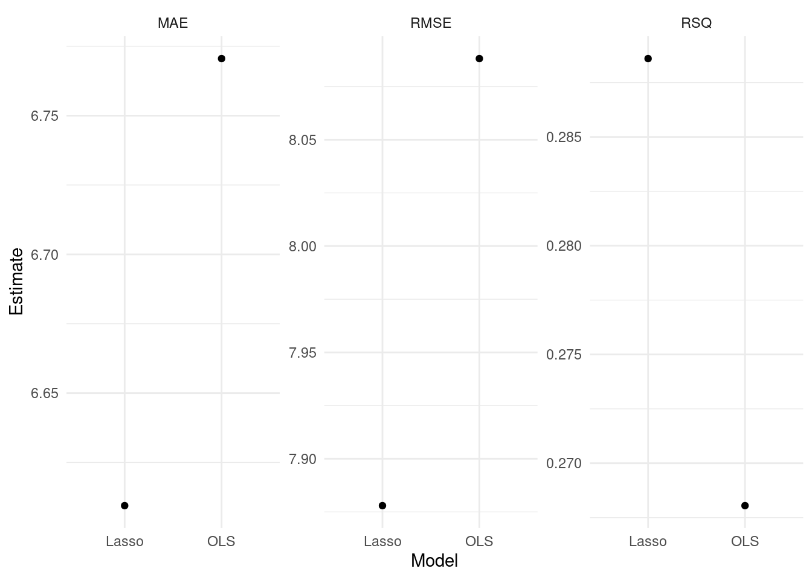

```
## 
## [[2]]
```


```r
# Define performance metrics 
metrics <- yardstick::metric_set(rmse, mae, rsq)

# Evaluate many models 
evals <- purrr::map(list(ols_fit, lasso_fit), evaluate_reg) %>%
  reduce(bind_rows) %>%
  mutate(type = rep(c("OLS", "Lasso"), each = 3))

# Visualize the test results 
evals %>%
  ggplot(aes(x = fct_reorder(type, .estimate), y = .estimate)) +
    geom_point() +
    labs(x = "Model",
         y = "Estimate") +
    facet_wrap(~glue("{toupper(.metric)}"), scales = "free_y") 
```

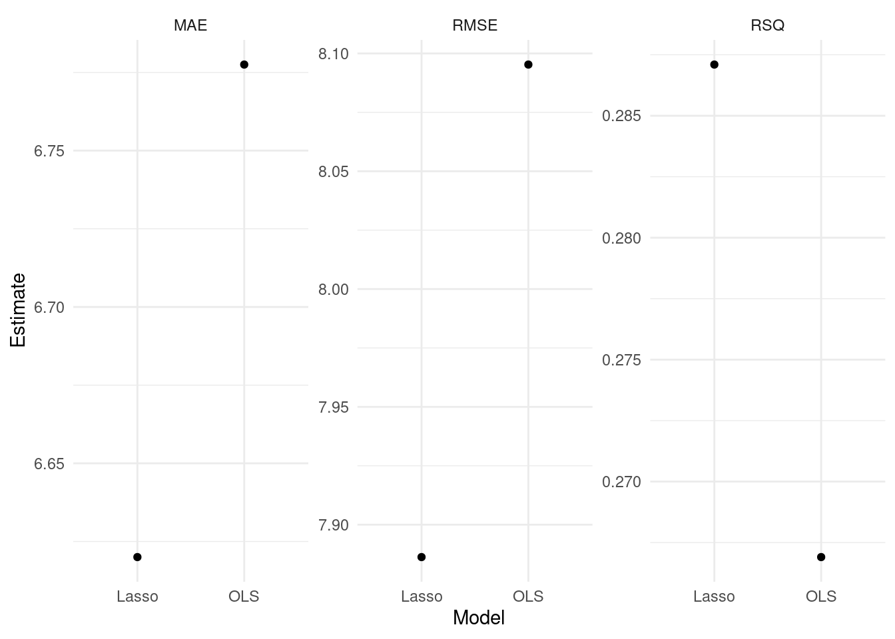
- For more information, read [Tidy Modeling with R](https://www.tmwr.org/) by Max Kuhn and Julia Silge.

#### tune 

##### tune ingredients 


```r
# tune() = placeholder 

tune_spec <- linear_reg(penalty = tune(), # tuning parameter 
                         mixture = 1) %>% # 1 = lasso, 0 = ridge 
  set_engine("glmnet") %>%
  set_mode("regression") 

tune_spec
```

```
## Linear Regression Model Specification (regression)
## 
## Main Arguments:
##   penalty = tune()
##   mixture = 1
## 
## Computational engine: glmnet
```

```r
# penalty() searches 50 possible combinations 

lambda_grid <- grid_regular(penalty(), levels = 50)

# 10-fold cross-validation

set.seed(1234) # for reproducibility 

rec_folds <- vfold_cv(train_x_reg %>% bind_cols(tibble(age = train_y_reg)))
```

##### Add these elements to a workflow 


```r
# Workflow 
rec_wf <- workflow() %>%
  add_model(tune_spec) %>%
  add_formula(age~.)
```


```r
# Tuning results 
rec_res <- rec_wf %>%
  tune_grid(
    resamples = rec_folds, 
    grid = lambda_grid
  )
```

##### Visualize 


```r
# Visualize

rec_res %>%
  collect_metrics() %>%
  ggplot(aes(penalty, mean, col = .metric)) +
  geom_errorbar(aes(
    ymin = mean - std_err,
    ymax = mean + std_err
  ),
  alpha = 0.3
  ) +
  geom_line(size = 2) +
  scale_x_log10() +
  labs(x = "log(lambda)") +
  facet_wrap(~glue("{toupper(.metric)}"), 
             scales = "free",
             nrow = 2) +
  theme(legend.position = "none")
```


##### Select 


```r
top_rmse <- show_best(rec_res, metric = "rmse")

best_rmse <- select_best(rec_res, metric = "rmse")

best_rmse 
```

```
## # A tibble: 1 x 2
##   penalty .config
##     <dbl> <chr>  
## 1   0.153 Model46
```

```r
glue('The RMSE of the intiail model is 
     {evals %>%
  filter(type == "Lasso", .metric == "rmse") %>%
  select(.estimate) %>%
  round(2)}')
```

```
## The RMSE of the intiail model is 
##    7.89
```

```r
glue('The RMSE of the tuned model is {rec_res %>%
  collect_metrics() %>%
  filter(.metric == "rmse") %>%
  arrange(mean) %>%
  dplyr::slice(1) %>%
  select(mean) %>%
  round(2)}')
```

```
## The RMSE of the tuned model is 7.7
```

- Finalize your workflow and visualize [variable importance](https://koalaverse.github.io/vip/articles/vip.html)


```r
finalize_lasso <- rec_wf %>%
  finalize_workflow(best_rmse)

finalize_lasso %>%
  fit(train_x_reg %>% bind_cols(tibble(age = train_y_reg))) %>%
  pull_workflow_fit() %>%
  vip::vip()
```


##### Test fit 

- Apply the tuned model to the test dataset 


```r
test_fit <- finalize_lasso %>% 
  fit(test_x_reg %>% bind_cols(tibble(age = test_y_reg)))

evaluate_reg(test_fit)
```

```
## # A tibble: 3 x 3
##   .metric .estimator .estimate
##   <chr>   <chr>          <dbl>
## 1 rmse    standard       7.09 
## 2 mae     standard       5.84 
## 3 rsq     standard       0.414
```
### Decision tree 

#### parsnip 

- Build a model 

1. Specify a model 
2. Specify an engine 
3. Specify a mode 


```r
# workflow 
tree_wf <- workflow() %>% add_formula(target~.)

# spec 
tree_spec <- decision_tree(
  
           # Mode 
           mode = "classification",
           
           # Tuning parameters
           cost_complexity = NULL, 
           tree_depth = NULL) %>%
  set_engine("rpart") # rpart, c5.0, spark

tree_wf <- tree_wf %>% add_model(tree_spec)
```

- Fit a model


```r
tree_fit <- tree_wf %>% fit(train_x_class %>% bind_cols(tibble(target = train_y_class)))
```

#### yardstick 

- Let's formally test prediction performance. 

**Metrics**

- `accuracy`: The proportion of the data predicted correctly 

- `precision`: Positive predictive value

- `recall` (specificity): True positive rate (e.g., healthy people really healthy)


- To learn more about other metrics, check out the yardstick package [references](https://yardstick.tidymodels.org/reference/index.html). 


```r
# Define performance metrics 

metrics <- yardstick::metric_set(accuracy, precision, recall)

# Visualize

tree_fit_viz_metr <- visualize_class_eval(tree_fit)

tree_fit_viz_metr
```


```r
tree_fit_viz_mat <- visualize_class_conf(tree_fit)

tree_fit_viz_mat
```


#### tune 

##### tune ingredients 

- **complexity parameter**: a high CP means a simple decision tree with few splits. 

- **tree_depth** 


```r
tune_spec <- 
  decision_tree(
    cost_complexity = tune(), 
    tree_depth = tune(),
    mode = "classification"
  ) %>%
  set_engine("rpart")

tree_grid <- grid_regular(cost_complexity(),
                          tree_depth(),
                          levels = 5) # 2 parameters -> 5*5 = 25 combinations 

tree_grid %>%
  count(tree_depth)
```

```
## # A tibble: 5 x 2
##   tree_depth     n
##        <int> <int>
## 1          1     5
## 2          4     5
## 3          8     5
## 4         11     5
## 5         15     5
```

```r
# 10-fold cross-validation

set.seed(1234) # for reproducibility 

tree_folds <- vfold_cv(train_x_class %>% bind_cols(tibble(target = train_y_class)),
                       strata = target)
```

##### Add these elements to a workflow 


```r
# Update workflow 
tree_wf <- tree_wf %>% update_model(tune_spec)

# Determine the number of cores
no_cores <- detectCores() - 1

# Initiate
cl <- makeCluster(no_cores)

registerDoParallel(cl)

# Tuning results 
tree_res <- tree_wf %>%
  tune_grid(
    resamples = tree_folds, 
    grid = tree_grid,
    metrics = metrics
  )
```

##### Visualize 

- The following plot draws on the [vignette](https://www.tidymodels.org/start/tuning/) of the tidymodels package. 


```r
tree_res %>%
  collect_metrics() %>%
  mutate(tree_depth = factor(tree_depth)) %>%
  ggplot(aes(cost_complexity, mean, col = .metric)) +
  geom_point(size = 3) +
  # Subplots 
  facet_wrap(~ tree_depth, 
             scales = "free", 
             nrow = 2) +
  # Log scale x 
  scale_x_log10(labels = scales::label_number()) +
  # Discrete color scale 
  scale_color_viridis_d(option = "plasma", begin = .9, end = 0) +
  labs(x = "Cost complexity",
       col = "Tree depth",
       y = NULL) +
  coord_flip()
```


##### Select 


```r
# Optimal parameter
best_tree <- select_best(tree_res, "recall")

# Add the parameter to the workflow 
finalize_tree <- tree_wf %>%
  finalize_workflow(best_tree)
```


```r
tree_fit_tuned <- finalize_tree %>% 
  fit(train_x_class %>% bind_cols(tibble(target = train_y_class)))

# Metrics 
(tree_fit_viz_metr + labs(title = "Non-tuned")) / (visualize_class_eval(tree_fit_tuned) + labs(title = "Tuned"))
```

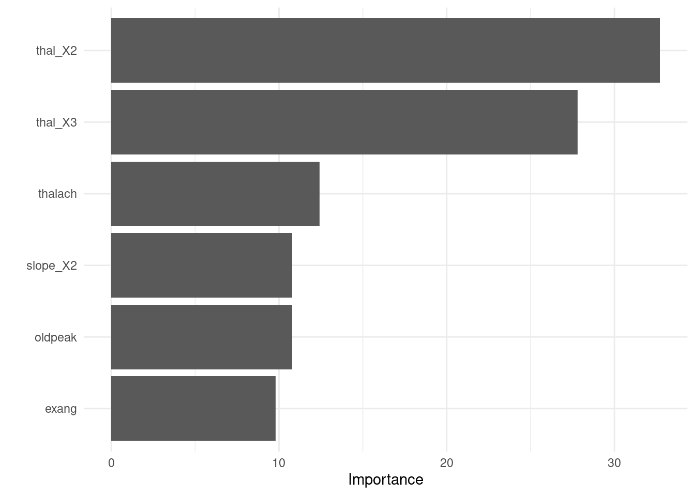

```r
# Confusion matrix 
(tree_fit_viz_mat + labs(title = "Non-tuned")) / (visualize_class_conf(tree_fit_tuned) + labs(title = "Tuned"))
```


- Visualize variable importance 


```r
tree_fit_tuned %>%
  pull_workflow_fit() %>%
  vip::vip()
```


##### Test fit

- Apply the tuned model to the test dataset 


```r
test_fit <- finalize_tree %>% 
  fit(test_x_class %>% bind_cols(tibble(target = test_y_class)))

evaluate_class(test_fit)
```

```
## # A tibble: 3 x 3
##   .metric   .estimator .estimate
##   <chr>     <chr>          <dbl>
## 1 accuracy  binary         0.744
## 2 precision binary         0.705
## 3 recall    binary         0.756
```

### Random forest 


#### parsnip 

- Build a model 

1. Specify a model 
2. Specify an engine 
3. Specify a mode 


```r
# workflow 
rand_wf <- workflow() %>% add_formula(target~.)

# spec 
rand_spec <- rand_forest(
  
           # Mode 
           mode = "classification",
           
           # Tuning parameters
           mtry = NULL, # The number of predictors to available for splitting at each node  
           min_n = NULL, # The minimum number of data points needed to keep splitting nodes
           trees = 500) %>% # The number of trees
  set_engine("ranger", 
             # We want the importance of predictors to be assessed.
             seed = 1234, 
             importance = "permutation") 

rand_wf <- rand_wf %>% add_model(rand_spec)
```

- Fit a model


```r
rand_fit <- rand_wf %>% fit(train_x_class %>% bind_cols(tibble(target = train_y_class)))
```

#### yardstick 

- Let's formally test prediction performance. 

**Metrics**

- `accuracy`: The proportion of the data predicted correctly 

- `precision`: Positive predictive value

- `recall` (specificity): True positive rate (e.g., healthy people really healthy)


```r
# Define performance metrics 
metrics <- yardstick::metric_set(accuracy, precision, recall)

rand_fit_viz_metr <- visualize_class_eval(rand_fit)

rand_fit_viz_metr
```

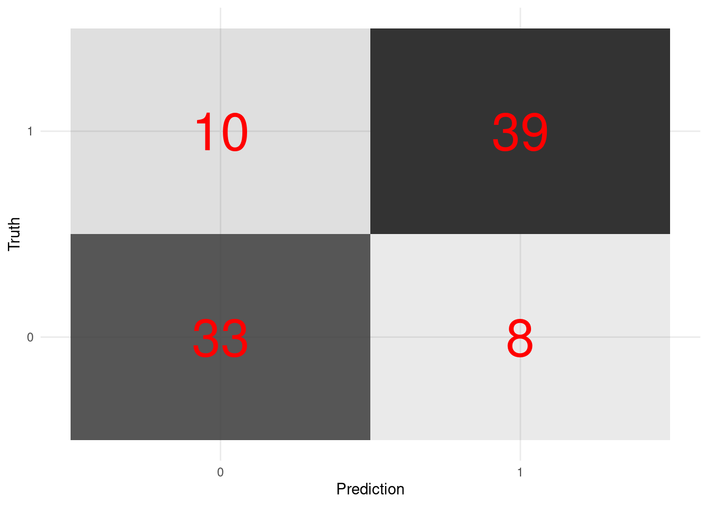

- Visualize the confusion matrix. 
  

```r
rand_fit_viz_mat <- visualize_class_conf(rand_fit)

rand_fit_viz_mat
```

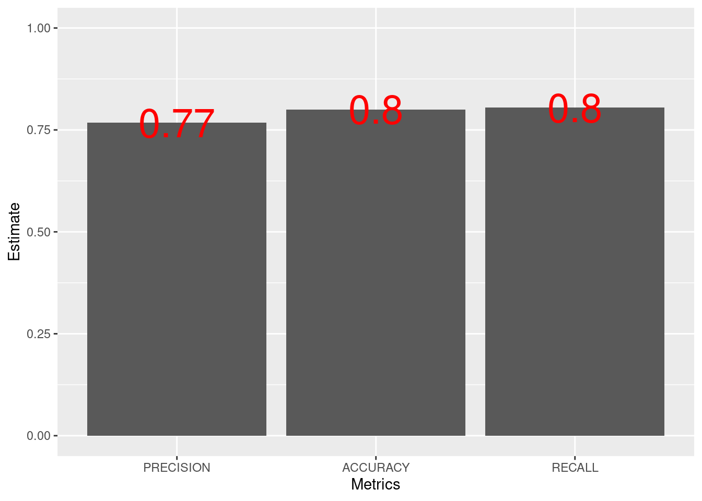

#### tune 

##### tune ingredients 

We focus on the following two parameters:

- `mtry`: The number of predictors to available for splitting at each node.

- `min_n`: The minimum number of data points needed to keep splitting nodes. 


```r
tune_spec <- 
  rand_forest(
           mode = "classification",
           
           # Tuning parameters
           mtry = tune(), 
           min_n = tune()) %>%
  set_engine("ranger",
             seed = 1234, 
             importance = "permutation")

rand_grid <- grid_regular(mtry(range = c(1, 10)),
                          min_n(range = c(2, 10)),
                          levels = 5)

rand_grid %>%
  count(min_n)
```

```
## # A tibble: 5 x 2
##   min_n     n
##   <int> <int>
## 1     2     5
## 2     4     5
## 3     6     5
## 4     8     5
## 5    10     5
```


```r
# 10-fold cross-validation

set.seed(1234) # for reproducibility 

rand_folds <- vfold_cv(train_x_class %>% bind_cols(tibble(target = train_y_class)),
                       strata = target)
```

##### Add these elements to a workflow 


```r
# Update workflow 
rand_wf <- rand_wf %>% update_model(tune_spec)

# Tuning results 
rand_res <- rand_wf %>%
  tune_grid(
    resamples = rand_folds, 
    grid = rand_grid,
    metrics = metrics
  )
```

##### Visualize 


```r
rand_res %>%
  collect_metrics() %>%
  mutate(min_n = factor(min_n)) %>%
  ggplot(aes(mtry, mean, color = min_n)) +
  # Line + Point plot 
  geom_line(size = 1.5, alpha = 0.6) +
  geom_point(size = 2) +
  # Subplots 
  facet_wrap(~ .metric, 
             scales = "free", 
             nrow = 2) +
  # Log scale x 
  scale_x_log10(labels = scales::label_number()) +
  # Discrete color scale 
  scale_color_viridis_d(option = "plasma", begin = .9, end = 0) +
  labs(x = "The number of predictors to be sampled",
       col = "The minimum number of data points needed for splitting",
       y = NULL) +
  theme(legend.position="bottom")
```


```r
# Optimal parameter
best_tree <- select_best(rand_res, "accuracy")

best_tree
```

```
## # A tibble: 1 x 3
##    mtry min_n .config
##   <int> <int> <chr>  
## 1     1     2 Model01
```

```r
# Add the parameter to the workflow 
finalize_tree <- rand_wf %>%
  finalize_workflow(best_tree)
```


```r
rand_fit_tuned <- finalize_tree %>% 
  fit(train_x_class %>% bind_cols(tibble(target = train_y_class)))

# Metrics 
(rand_fit_viz_metr + labs(title = "Non-tuned")) / (visualize_class_eval(rand_fit_tuned) + labs(title = "Tuned"))
```

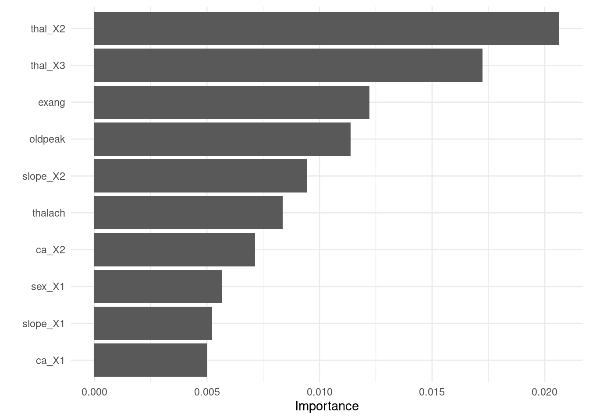

```r
# Confusion matrix 
(rand_fit_viz_mat + labs(title = "Non-tuned")) / (visualize_class_conf(rand_fit_tuned) + labs(title = "Tuned"))
```


- Visualize variable importance 


```r
rand_fit_tuned %>%
  pull_workflow_fit() %>%
  vip::vip()
```

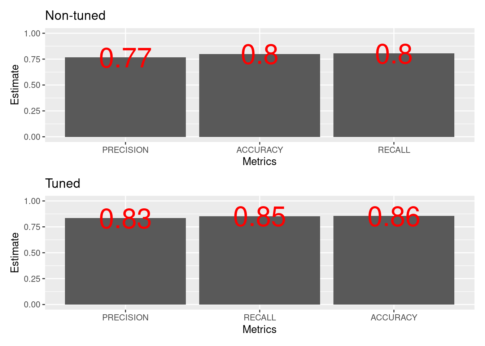

##### Test fit

- Apply the tuned model to the test dataset 


```r
test_fit <- finalize_tree %>%
  fit(test_x_class %>% bind_cols(tibble(target = test_y_class)))

evaluate_class(test_fit)
```

```
## # A tibble: 3 x 3
##   .metric   .estimator .estimate
##   <chr>     <chr>          <dbl>
## 1 accuracy  binary         0.933
## 2 precision binary         0.973
## 3 recall    binary         0.878
```

### XGboost 

#### parsnip 

- Build a model 

1. Specify a model 
2. Specify an engine 
3. Specify a mode 


```r
# workflow 
xg_wf <- workflow() %>% add_formula(target~.)

# spec 
xg_spec <- boost_tree(
  
           # Mode 
           mode = "classification",
           
           # Tuning parameters
           
           # The number of trees to fit, aka boosting iterations
           trees = c(100, 300, 500, 700, 900),
           # The depth of the decision tree (how many levels of splits).
	         tree_depth = c(1, 6), 
           # Learning rate: lower means the ensemble will adapt more slowly.
           learn_rate = c(0.0001, 0.01, 0.2),
           # Stop splitting a tree if we only have this many obs in a tree node.
	         min_n = 10L
          ) %>% 
  set_engine("xgboost") 

xg_wf <- xg_wf %>% add_model(xg_spec)
```

- Fit a model


```r
xg_fit <- xg_wf %>% fit(train_x_class %>% bind_cols(tibble(target = train_y_class)))
```

```
## Warning in begin_iteration:end_iteration: numerical expression has 5 elements:
## only the first used
```

#### yardstick 

- Let's formally test prediction performance. 

**Metrics**

- `accuracy`: The proportion of the data predicted correctly 

- `precision`: Positive predictive value

- `recall` (specificity): True positive rate (e.g., healthy people really healthy)


```r
metrics <- metric_set(yardstick::accuracy, 
                      yardstick::precision, 
                      yardstick::recall)

evaluate_class(xg_fit)
```

```
## # A tibble: 3 x 3
##   .metric   .estimator .estimate
##   <chr>     <chr>          <dbl>
## 1 accuracy  binary         0.733
## 2 precision binary         0.730
## 3 recall    binary         0.659
```


```r
xg_fit_viz_metr <- visualize_class_eval(xg_fit)

xg_fit_viz_metr
```


- Visualize the confusion matrix. 
  

```r
xg_fit_viz_mat <- visualize_class_conf(xg_fit)

xg_fit_viz_mat
```


#### tune 

##### tune ingredients 

- We focus on the following parameters: `trees,` `tree_depth,` `learn_rate,` `min_n,` `mtry,` `loss_reduction,` and `sample_size`


```r
tune_spec <- 
  xg_spec <- boost_tree(
  
           # Mode 
           mode = "classification",
           
           # Tuning parameters
           
           # The number of trees to fit, aka boosting iterations
           trees = tune(),
           # The depth of the decision tree (how many levels of splits).
	         tree_depth = tune(), 
           # Learning rate: lower means the ensemble will adapt more slowly.
           learn_rate = tune(),
           # Stop splitting a tree if we only have this many obs in a tree node.
	         min_n = tune(),
           loss_reduction = tune(),
           # The number of randomly selected parameters 
           mtry = tune(), 
           # The size of the data set used for modeling within an iteration
           sample_size = tune()
          ) %>% 
  set_engine("xgboost") 

# Space-filling parameter grids 
xg_grid <- grid_latin_hypercube(
  trees(),
  tree_depth(),
  learn_rate(),
  min_n(),
  loss_reduction(), 
  sample_size = sample_prop(),
  finalize(mtry(), train_x_class),
  size = 30
  )

# 10-fold cross-validation

set.seed(1234) # for reproducibility 

xg_folds <- vfold_cv(train_x_class %>% bind_cols(tibble(target = train_y_class)),
                     strata = target)
```

##### Add these elements to a workflow 


```r
# Update workflow 
xg_wf <- xg_wf %>% update_model(tune_spec)

# Tuning results 
xg_res <- xg_wf %>%
  tune_grid(
    resamples = xg_folds, 
    grid = xg_grid,
    control = control_grid(save_pred = TRUE)
  )
```

##### Visualize 


```r
xg_res %>%
  collect_metrics() %>% 
  filter(.metric == "roc_auc") %>%
  pivot_longer(mtry:sample_size,
               values_to = "value",
               names_to = "parameter") %>%
  ggplot(aes(x = value, y = mean, color = parameter)) +
    geom_point(alpha = 0.8, show.legend = FALSE) +
    facet_wrap(~parameter, scales = "free_x") +
    labs(y = "AUC",
         x = NULL)
```

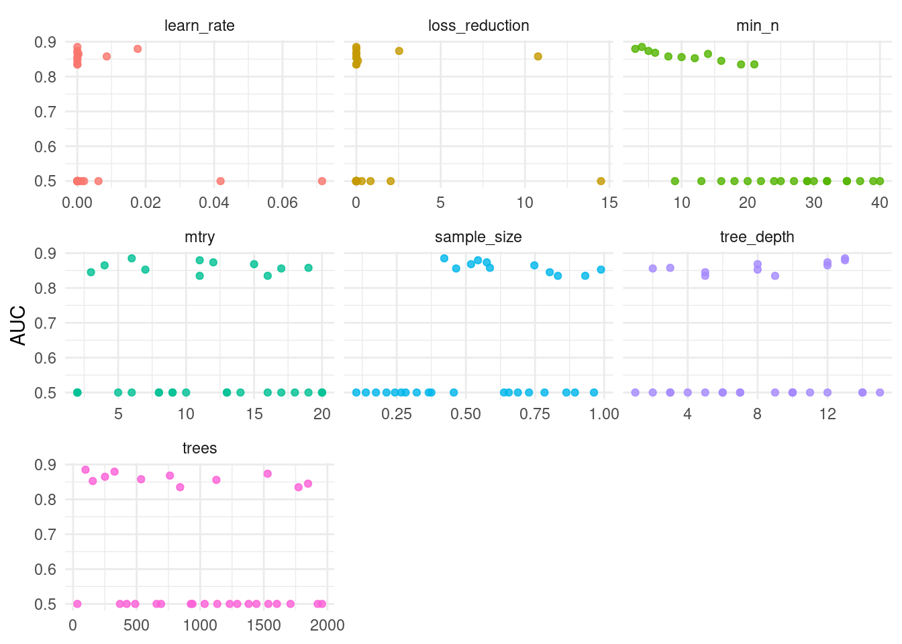


```r
# Optimal parameter
best_xg <- select_best(xg_res, "roc_auc")

best_xg 
```

```
## # A tibble: 1 x 8
##    mtry trees min_n tree_depth  learn_rate loss_reduction sample_size .config
##   <int> <int> <int>      <int>       <dbl>          <dbl>       <dbl> <chr>  
## 1     6    98     4         13 0.000000211  0.00000000336       0.422 Model26
```

```r
# Add the parameter to the workflow 
finalize_xg <- xg_wf %>%
  finalize_workflow(best_xg)
```


```r
xg_fit_tuned <- finalize_xg %>% 
  fit(train_x_class %>% bind_cols(tibble(target = train_y_class)))

# Metrics 
(xg_fit_viz_metr + labs(title = "Non-tuned")) / (visualize_class_eval(xg_fit_tuned) + labs(title = "Tuned"))
```

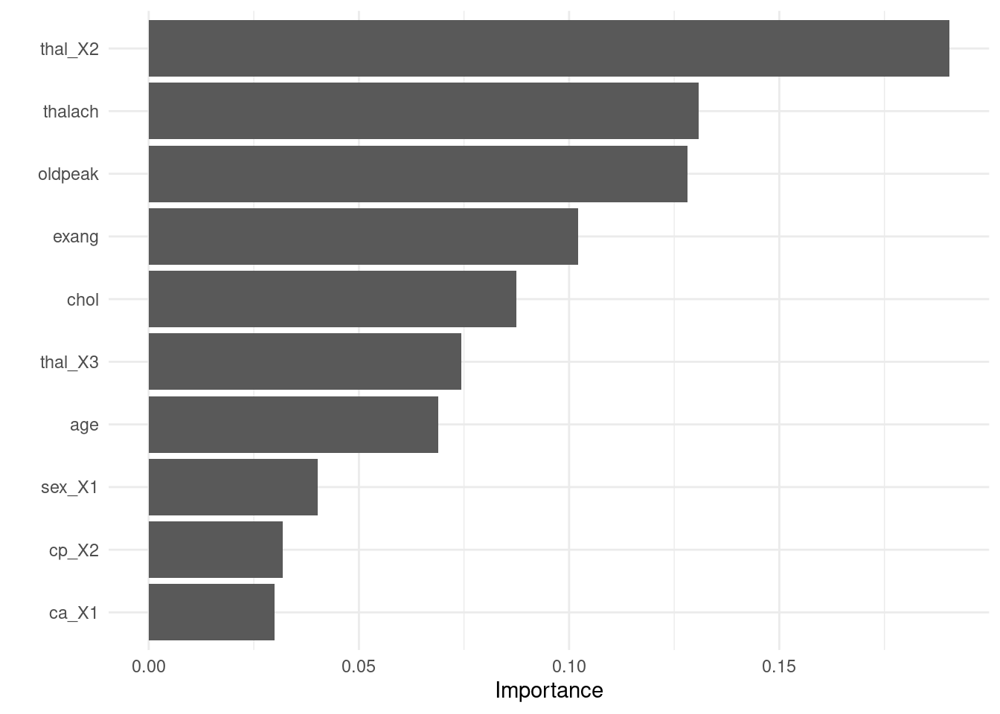

```r
# Confusion matrix 
(xg_fit_viz_mat + labs(title = "Non-tuned")) / (visualize_class_conf(xg_fit_tuned) + labs(title = "Tuned"))
```


- Visualize variable importance 


```r
xg_fit_tuned %>%
  pull_workflow_fit() %>%
  vip::vip()
```

```
## Warning: `as.tibble()` is deprecated as of tibble 2.0.0.
## Please use `as_tibble()` instead.
## The signature and semantics have changed, see `?as_tibble`.
## This warning is displayed once every 8 hours.
## Call `lifecycle::last_warnings()` to see where this warning was generated.
```


##### Test fit

- Apply the tuned model to the test dataset 


```r
test_fit <- finalize_xg %>%
  fit(test_x_class %>% bind_cols(tibble(target = test_y_class)))

evaluate_class(test_fit)
```

```
## # A tibble: 3 x 3
##   .metric   .estimator .estimate
##   <chr>     <chr>          <dbl>
## 1 accuracy  binary         0.8  
## 2 precision binary         0.795
## 3 recall    binary         0.756
```

### Applications 

#### Bandit algorithm (optimizing an experiment)

#### Causal forest (estimating heterogeneous treatment effect)

## Unsupervised learning

x -> f - > y (not defined)

### Dimension reduction


#### Correlation analysis 

- Notice some problems? 

    - NAs 
    
    - Scaling issues 
    

```r
data_original %>%
  corrr::correlate()
```

```
## 
## Correlation method: 'pearson'
## Missing treated using: 'pairwise.complete.obs'
```

```
## # A tibble: 14 x 15
##    rowname     age     sex      cp trestbps     chol      fbs restecg  thalach
##    <chr>     <dbl>   <dbl>   <dbl>    <dbl>    <dbl>    <dbl>   <dbl>    <dbl>
##  1 age     NA      -0.0984 -0.0687   0.279   0.214    0.121   -0.116  -0.399  
##  2 sex     -0.0984 NA      -0.0494  -0.0568 -0.198    0.0450  -0.0582 -0.0440 
##  3 cp      -0.0687 -0.0494 NA        0.0476 -0.0769   0.0944   0.0444  0.296  
##  4 trestb…  0.279  -0.0568  0.0476  NA       0.123    0.178   -0.114  -0.0467 
##  5 chol     0.214  -0.198  -0.0769   0.123  NA        0.0133  -0.151  -0.00994
##  6 fbs      0.121   0.0450  0.0944   0.178   0.0133  NA       -0.0842 -0.00857
##  7 restecg -0.116  -0.0582  0.0444  -0.114  -0.151   -0.0842  NA       0.0441 
##  8 thalach -0.399  -0.0440  0.296   -0.0467 -0.00994 -0.00857  0.0441 NA      
##  9 exang    0.0968  0.142  -0.394    0.0676  0.0670   0.0257  -0.0707 -0.379  
## 10 oldpeak  0.210   0.0961 -0.149    0.193   0.0540   0.00575 -0.0588 -0.344  
## 11 slope   -0.169  -0.0307  0.120   -0.121  -0.00404 -0.0599   0.0930  0.387  
## 12 ca       0.276   0.118  -0.181    0.101   0.0705   0.138   -0.0720 -0.213  
## 13 thal     0.0680  0.210  -0.162    0.0622  0.0988  -0.0320  -0.0120 -0.0964 
## 14 target  -0.225  -0.281   0.434   -0.145  -0.0852  -0.0280   0.137   0.422  
## # … with 6 more variables: exang <dbl>, oldpeak <dbl>, slope <dbl>, ca <dbl>,
## #   thal <dbl>, target <dbl>
```

#### Preprocessing 

`recipe` is essential for preprocesssing multiple features at once.


```r
pca_recipe <- recipe(~., data = data_original) %>%
  # Imputing NAs using mean 
  step_meanimpute(all_predictors()) %>%
  # Normalize some numeric variables 
  step_normalize(c("age", "trestbps", "chol", "thalach", "oldpeak")) 
```

#### PCA analysis 


```r
pca_res <- pca_recipe %>% 
  step_pca(all_predictors(), 
           id = "pca") %>% # id argument identifies each PCA step 
  prep()

pca_res %>%
  tidy(id = "pca") 
```

```
## # A tibble: 196 x 4
##    terms        value component id   
##    <chr>        <dbl> <chr>     <chr>
##  1 age      -0.00101  PC1       pca  
##  2 sex       0.216    PC1       pca  
##  3 cp        0.321    PC1       pca  
##  4 trestbps  0.00118  PC1       pca  
##  5 chol     -0.000292 PC1       pca  
##  6 fbs       0.0468   PC1       pca  
##  7 restecg   0.166    PC1       pca  
##  8 thalach   0.0137   PC1       pca  
##  9 exang     0.0962   PC1       pca  
## 10 oldpeak  -0.00863  PC1       pca  
## # … with 186 more rows
```

##### Screeplot


```r
pca_recipe %>%
  step_pca(all_predictors(), 
           id = "pca") %>% # id argument identifies each PCA step 
  prep() %>%
  tidy(id = "pca", type = "variance") %>%
  filter(terms == "percent variance") %>% 
  ggplot(aes(x = component, y = value)) +
    geom_col() +
    labs(x = "PCAs of heart disease",
         y = "% of variance",
         title = "Scree plot")
```


##### View factor loadings 


```r
pca_recipe %>%
  step_pca(all_predictors(), 
           id = "pca") %>% # id argument identifies each PCA step 
  prep() %>%
  tidy(id = "pca") %>%
  filter(component %in% c("PC1", "PC2")) %>%
  ggplot(aes(x = fct_reorder(terms, value), y = value, 
             fill = component)) +
    geom_col(position = "dodge") +
    coord_flip() +
    labs(x = "Terms",
         y = "Contribtutions",
         fill = "PCAs") 
```

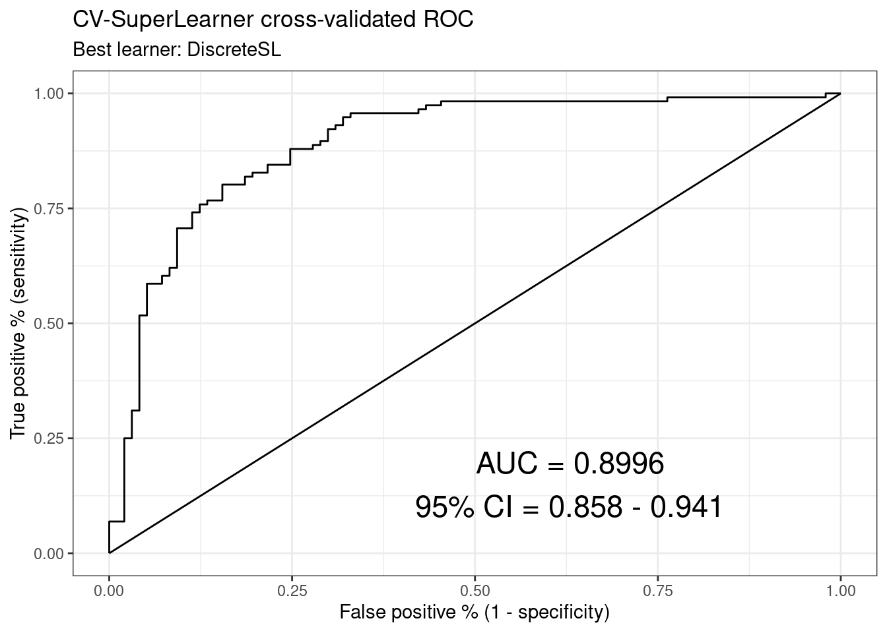

### Topic modeling 

#### Setup 


```r
pacman::p_load(tidytext, # tidy text analysis
               glue, # paste string and objects                
               stm, # structural topic modeling
               gutenbergr) # toy datasets 
```

#### Dataset 

The data munging process draws on [Julia Silge's blog post](https://juliasilge.com/blog/sherlock-holmes-stm/).


```r
sherlock_raw <- gutenberg_download(1661)
```

```
## Determining mirror for Project Gutenberg from http://www.gutenberg.org/robot/harvest
```

```
## Using mirror http://aleph.gutenberg.org
```

```r
glimpse(sherlock_raw)
```

```
## Rows: 12,648
## Columns: 2
## $ gutenberg_id <int> 1661, 1661, 1661, 1661, 1661, 1661, 1661, 1661, 1661, 16…
## $ text         <chr> "THE ADVENTURES OF SHERLOCK HOLMES", "", "by", "", "SIR …
```

```r
sherlock <- sherlock_raw %>%
  # Mutate story using a conditional statement 
  mutate(story = ifelse(str_starts(text, "ADVENTURE"), 
                                   text, NA)) %>%
  # Fill in missing values with next value  
  tidyr::fill(story, .direction = "down") %>%
  # Filter 
  filter(story != "THE ADVENTURES OF SHERLOCK HOLMES") %>%
  # Factor 
  mutate(story = factor(story, levels = unique(story)))

sherlock <- sherlock[,2:3]
```

#### Key ideas 

- Topics as **distributions** of words 

- Documents as **distributions** of topics 

- What distributions?

    - Probability 

    - Multinominal (e.g., Latent Dirichlet Distribution)

- Words lie on a lower dimensional space (dimension reduction)

- Co-occurrence of words (clustering)

- Bag of words (feature engineering)
    - Upside: easy and fast (also quite working well)
    - Downside: ignored grammatical structures and rich interactions among words (Alternative: word embeddings. Please check out [text2vec](http://text2vec.org/))

#### Exploratory data analysis 


```r
sherlock_n <- sherlock %>%
  unnest_tokens(output = word,
                input = text) %>%
  count(story, word, sort = TRUE)

sherlock_total_n <- sherlock_n %>%
  group_by(story) %>%
  summarise(total = sum(n))
```

```
## `summarise()` ungrouping output (override with `.groups` argument)
```

```r
sherlock_words <- sherlock_n %>% left_join(sherlock_total_n)
```

```
## Joining, by = "story"
```

```r
sherlock_words %>%
  mutate(freq = n/total) %>%
  group_by(story) %>%
  top_n(10) %>%
  ggplot(aes(x = fct_reorder(word, freq), 
             y = freq, 
             fill = story)) +
  geom_col() +
  coord_flip() +
  facet_wrap(~story, 
             ncol = 2, 
             scales = "free_y") +
  scale_fill_viridis_d() +
  labs(x = "")
```

```
## Selecting by freq
```


#### STM 

##### Turn text into document-term matrix

`stm` package has its own preprocessing function.


```r
dtm <- textProcessor(documents = sherlock$text,
                     metadata = sherlock, 
                     removestopwords = TRUE,
                     verbose = FALSE)
```

##### Tuning K

- K is the number of topics. 
- Let's try K = 5, 10, 15.


```r
test_res <- searchK(dtm$documents, dtm$vocab, 
                   K = c(5, 10, 15),
                   prevalence =~ story, 
                   data = dtm$meta)
```

```
## Beginning Spectral Initialization 
## 	 Calculating the gram matrix...
## 	 Finding anchor words...
##  	.....
## 	 Recovering initialization...
##  	........................................................
## Initialization complete.
## ....................................................................................................
## Completed E-Step (1 seconds). 
## Completed M-Step. 
## Completing Iteration 1 (approx. per word bound = -7.570) 
## ....................................................................................................
## Completed E-Step (1 seconds). 
## Completed M-Step. 
## Completing Iteration 2 (approx. per word bound = -7.481, relative change = 1.176e-02) 
## ....................................................................................................
## Completed E-Step (1 seconds). 
## Completed M-Step. 
## Completing Iteration 3 (approx. per word bound = -7.400, relative change = 1.090e-02) 
## ....................................................................................................
## Completed E-Step (1 seconds). 
## Completed M-Step. 
## Completing Iteration 4 (approx. per word bound = -7.381, relative change = 2.581e-03) 
## ....................................................................................................
## Completed E-Step (1 seconds). 
## Completed M-Step. 
## Completing Iteration 5 (approx. per word bound = -7.375, relative change = 8.290e-04) 
## Topic 1: come, time, might, know, must 
##  Topic 2: one, said, well, matter, came 
##  Topic 3: holm, upon, said, may, just 
##  Topic 4: littl, will, man, see, think 
##  Topic 5: case, yes, remark, noth, put 
## ....................................................................................................
## Completed E-Step (1 seconds). 
## Completed M-Step. 
## Completing Iteration 6 (approx. per word bound = -7.371, relative change = 4.271e-04) 
## ....................................................................................................
## Completed E-Step (1 seconds). 
## Completed M-Step. 
## Completing Iteration 7 (approx. per word bound = -7.370, relative change = 2.175e-04) 
## ....................................................................................................
## Completed E-Step (1 seconds). 
## Completed M-Step. 
## Completing Iteration 8 (approx. per word bound = -7.369, relative change = 7.176e-05) 
## ....................................................................................................
## Completed E-Step (1 seconds). 
## Completed M-Step. 
## Model Converged 
## Beginning Spectral Initialization 
## 	 Calculating the gram matrix...
## 	 Finding anchor words...
##  	..........
## 	 Recovering initialization...
##  	........................................................
## Initialization complete.
## ....................................................................................................
## Completed E-Step (2 seconds). 
## Completed M-Step. 
## Completing Iteration 1 (approx. per word bound = -7.651) 
## ....................................................................................................
## Completed E-Step (2 seconds). 
## Completed M-Step. 
## Completing Iteration 2 (approx. per word bound = -7.480, relative change = 2.234e-02) 
## ....................................................................................................
## Completed E-Step (2 seconds). 
## Completed M-Step. 
## Completing Iteration 3 (approx. per word bound = -7.378, relative change = 1.356e-02) 
## ....................................................................................................
## Completed E-Step (2 seconds). 
## Completed M-Step. 
## Completing Iteration 4 (approx. per word bound = -7.354, relative change = 3.251e-03) 
## ....................................................................................................
## Completed E-Step (2 seconds). 
## Completed M-Step. 
## Completing Iteration 5 (approx. per word bound = -7.347, relative change = 1.040e-03) 
## Topic 1: holm, one, will, eye, across 
##  Topic 2: may, upon, case, shall, remark 
##  Topic 3: well, know, father, call, mind 
##  Topic 4: littl, see, like, yes, might 
##  Topic 5: said, man, see, watson, hard 
##  Topic 6: hous, room, hand, man, without 
##  Topic 7: come, came, even, back, tell 
##  Topic 8: upon, day, door, look, may 
##  Topic 9: said, ask, matter, noth, answer 
##  Topic 10: sherlock, hand, glanc, howev, anoth 
## ....................................................................................................
## Completed E-Step (1 seconds). 
## Completed M-Step. 
## Completing Iteration 6 (approx. per word bound = -7.344, relative change = 3.512e-04) 
## ....................................................................................................
## Completed E-Step (2 seconds). 
## Completed M-Step. 
## Completing Iteration 7 (approx. per word bound = -7.342, relative change = 2.888e-04) 
## ....................................................................................................
## Completed E-Step (2 seconds). 
## Completed M-Step. 
## Completing Iteration 8 (approx. per word bound = -7.340, relative change = 2.464e-04) 
## ....................................................................................................
## Completed E-Step (1 seconds). 
## Completed M-Step. 
## Completing Iteration 9 (approx. per word bound = -7.339, relative change = 1.991e-04) 
## ....................................................................................................
## Completed E-Step (1 seconds). 
## Completed M-Step. 
## Completing Iteration 10 (approx. per word bound = -7.338, relative change = 1.230e-04) 
## Topic 1: holm, one, will, eye, chair 
##  Topic 2: may, case, shall, say, remark 
##  Topic 3: know, well, never, thought, cri 
##  Topic 4: littl, yes, like, might, see 
##  Topic 5: said, man, see, can, watson 
##  Topic 6: hous, room, young, ladi, without 
##  Topic 7: come, came, back, even, just 
##  Topic 8: upon, door, day, open, look 
##  Topic 9: ask, matter, must, take, noth 
##  Topic 10: hand, howev, sherlock, glanc, head 
## ....................................................................................................
## Completed E-Step (1 seconds). 
## Completed M-Step. 
## Completing Iteration 11 (approx. per word bound = -7.337, relative change = 5.576e-05) 
## ....................................................................................................
## Completed E-Step (1 seconds). 
## Completed M-Step. 
## Model Converged 
## Beginning Spectral Initialization 
## 	 Calculating the gram matrix...
## 	 Finding anchor words...
##  	...............
## 	 Recovering initialization...
##  	........................................................
## Initialization complete.
## ....................................................................................................
## Completed E-Step (2 seconds). 
## Completed M-Step. 
## Completing Iteration 1 (approx. per word bound = -7.737) 
## ....................................................................................................
## Completed E-Step (2 seconds). 
## Completed M-Step. 
## Completing Iteration 2 (approx. per word bound = -7.500, relative change = 3.056e-02) 
## ....................................................................................................
## Completed E-Step (2 seconds). 
## Completed M-Step. 
## Completing Iteration 3 (approx. per word bound = -7.388, relative change = 1.494e-02) 
## ....................................................................................................
## Completed E-Step (2 seconds). 
## Completed M-Step. 
## Completing Iteration 4 (approx. per word bound = -7.356, relative change = 4.344e-03) 
## ....................................................................................................
## Completed E-Step (2 seconds). 
## Completed M-Step. 
## Completing Iteration 5 (approx. per word bound = -7.345, relative change = 1.583e-03) 
## Topic 1: holm, know, well, can, might 
##  Topic 2: small, lay, known, form, power 
##  Topic 3: time, seen, two, sherlock, anyth 
##  Topic 4: said, man, shall, miss, word 
##  Topic 5: look, face, man, first, eye 
##  Topic 6: room, man, must, open, took 
##  Topic 7: back, ask, came, way, come 
##  Topic 8: littl, said, noth, last, sir 
##  Topic 9: now, see, yes, like, think 
##  Topic 10: street, hand, found, sudden, pass 
##  Topic 11: someth, sure, went, mind, live 
##  Topic 12: come, call, busi, gentleman, may 
##  Topic 13: will, may, case, littl, find 
##  Topic 14: one, side, two, year, famili 
##  Topic 15: upon, tabl, finger, depend, wrist 
## ....................................................................................................
## Completed E-Step (2 seconds). 
## Completed M-Step. 
## Completing Iteration 6 (approx. per word bound = -7.340, relative change = 5.712e-04) 
## ....................................................................................................
## Completed E-Step (2 seconds). 
## Completed M-Step. 
## Completing Iteration 7 (approx. per word bound = -7.338, relative change = 2.704e-04) 
## ....................................................................................................
## Completed E-Step (2 seconds). 
## Completed M-Step. 
## Completing Iteration 8 (approx. per word bound = -7.336, relative change = 2.640e-04) 
## ....................................................................................................
## Completed E-Step (1 seconds). 
## Completed M-Step. 
## Completing Iteration 9 (approx. per word bound = -7.335, relative change = 1.952e-04) 
## ....................................................................................................
## Completed E-Step (2 seconds). 
## Completed M-Step. 
## Completing Iteration 10 (approx. per word bound = -7.333, relative change = 2.106e-04) 
## Topic 1: holm, know, well, can, might 
##  Topic 2: small, work, told, lay, fire 
##  Topic 3: time, howev, day, sherlock, turn 
##  Topic 4: said, man, miss, young, word 
##  Topic 5: look, face, eye, tell, first 
##  Topic 6: room, must, open, father, made 
##  Topic 7: back, came, door, ask, way 
##  Topic 8: littl, noth, last, paper, read 
##  Topic 9: now, see, think, yes, like 
##  Topic 10: found, street, hand, sudden, light 
##  Topic 11: went, place, someth, mind, son 
##  Topic 12: come, away, busi, call, reason 
##  Topic 13: will, may, case, find, interest 
##  Topic 14: one, side, year, thing, two 
##  Topic 15: upon, tabl, besid, finger, bear 
## ....................................................................................................
## Completed E-Step (1 seconds). 
## Completed M-Step. 
## Completing Iteration 11 (approx. per word bound = -7.332, relative change = 2.243e-04) 
## ....................................................................................................
## Completed E-Step (1 seconds). 
## Completed M-Step. 
## Completing Iteration 12 (approx. per word bound = -7.331, relative change = 1.713e-04) 
## ....................................................................................................
## Completed E-Step (2 seconds). 
## Completed M-Step. 
## Completing Iteration 13 (approx. per word bound = -7.330, relative change = 1.282e-04) 
## ....................................................................................................
## Completed E-Step (1 seconds). 
## Completed M-Step. 
## Completing Iteration 14 (approx. per word bound = -7.329, relative change = 1.167e-04) 
## ....................................................................................................
## Completed E-Step (2 seconds). 
## Completed M-Step. 
## Completing Iteration 15 (approx. per word bound = -7.328, relative change = 6.326e-05) 
## Topic 1: holm, know, well, can, might 
##  Topic 2: small, work, told, lay, fire 
##  Topic 3: time, day, much, howev, turn 
##  Topic 4: said, man, miss, say, right 
##  Topic 5: look, face, eye, tell, first 
##  Topic 6: must, room, open, made, morn 
##  Topic 7: door, came, back, ask, way 
##  Topic 8: littl, noth, last, paper, sir 
##  Topic 9: now, see, think, yes, like 
##  Topic 10: found, street, hand, long, light 
##  Topic 11: place, went, someth, mind, son 
##  Topic 12: come, away, busi, call, certain 
##  Topic 13: will, may, case, find, take 
##  Topic 14: one, side, year, thing, two 
##  Topic 15: upon, tabl, besid, sever, finger 
## ....................................................................................................
## Completed E-Step (2 seconds). 
## Completed M-Step. 
## Completing Iteration 16 (approx. per word bound = -7.328, relative change = 5.296e-05) 
## ....................................................................................................
## Completed E-Step (1 seconds). 
## Completed M-Step. 
## Completing Iteration 17 (approx. per word bound = -7.328, relative change = 3.663e-05) 
## ....................................................................................................
## Completed E-Step (1 seconds). 
## Completed M-Step. 
## Model Converged
```

##### Evaludating models 

There are several metrics to assess the performance of topic models: the held-out likelihood, residuals, semantic coherence, and exclusivity. In this course, we examine the relationship between semantic coherence and exclusivity to understand the trade-off involved in selecting K.


```r
test_res$results %>%
  unnest(K, exclus, semcoh) %>%
  dplyr::select(K, exclus, semcoh) %>%
  mutate(K = as.factor(K)) %>%
  ggplot(aes(x = exclus, y = semcoh)) +
    geom_text(label = glue("K = {test_res$results$K}"),
              size = 5,
              color = "red")
```

```
## Warning: unnest() has a new interface. See ?unnest for details.
## Try `df %>% unnest(c(K, exclus, semcoh))`, with `mutate()` if needed
```

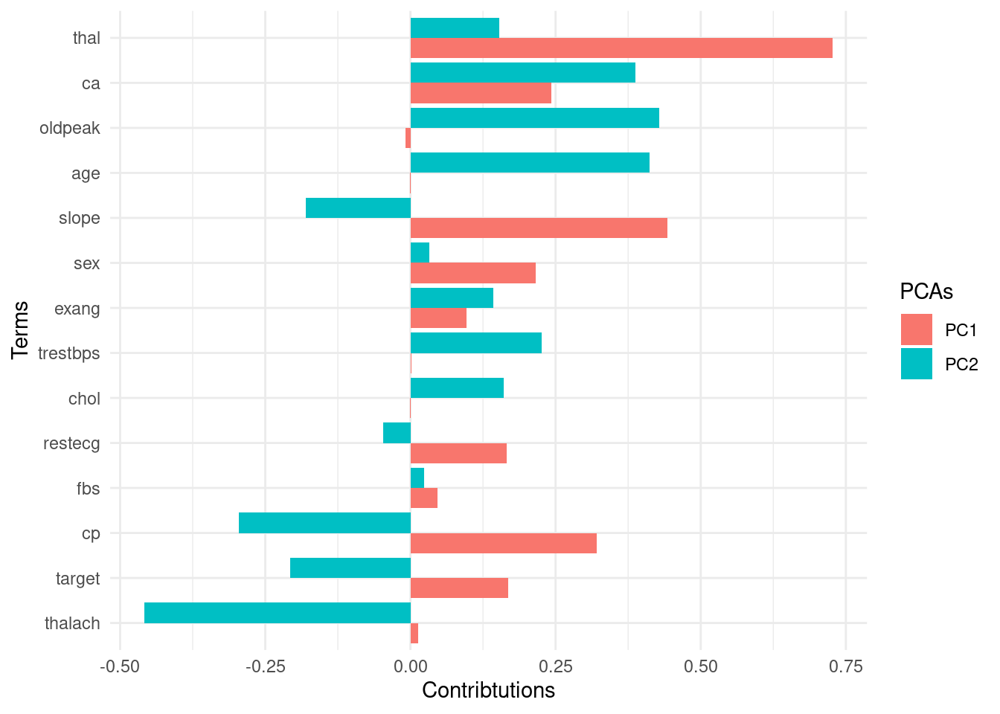

##### Finalize 


```r
final_stm <- stm(dtm$documents, 
                 dtm$vocab, 
                 K = 10, prevalence =~ story,
                 max.em.its = 75, 
                 data = dtm$meta, 
                 init.type="Spectral",
                 seed = 1234567,
                 verbose = FALSE)
```

##### Explore the results 

- Using the `stm` pacakge. 


```r
# plot
plot(final_stm)
```


- Using ggplot2 


```r
# tidy  
tidy_stm <- tidy(final_stm)

# top terms
tidy_stm %>%
    group_by(topic) %>%
    top_n(10, beta) %>%
    ungroup() %>%
    ggplot(aes(fct_reorder(term, beta), beta, fill = as.factor(topic))) +
    geom_col(alpha = 0.8, show.legend = FALSE) +
    facet_wrap(~ topic, scales = "free_y") +
    coord_flip() +
    scale_y_continuous(labels = scales::percent) +
    scale_fill_viridis_d()
```


## Bias and fairness in machine learning 

This section introduces the issues surrounding the fairness and bias in machine learning applications with a focus on the ProPublica's Analysis of the COMPAS algorithm. I revised [the ProPublica's original R and Python code](https://github.com/propublica/compas-analysis/blob/master/Compas%20Analysis.ipynb) to increase its code readability.


**Outline** 

1. Bias in the data 
  - Risk of Recidivism Data
  - Risk of Violent Recidivism Data

2. Bias in the algorithm 

**References**

For more information on the ProPublica's Machine Bias project, we encourage to check out the following references.

* [Argument](https://www.propublica.org/article/machine-bias-risk-assessments-in-criminal-sentencing/) by Julia Angwin, Jeff Larson, Surya Mattu and Lauren Kirchner

* [Counterargument](https://www.washingtonpost.com/news/monkey-cage/wp/2016/10/17/can-an-algorithm-be-racist-our-analysis-is-more-cautious-than-propublicas/) by Sam Corbett-Davies, Emma Pierson, Avi Feller and Sharad Goel

* [Methodology](https://www.propublica.org/article/how-we-analyzed-the-compas-recidivism-algorithm/)

### Bias in the Data (Risk of Recidivism Analysis)

#### Setup 


```r
if (!require("pacman")) install.packages("pacman")
```

```
## Loading required package: pacman
```

```r
pacman::p_load(
 tidyverse, # tidyverse packages 
 conflicted, # an alternative conflict resolution strategy 
 ggthemes, # other themes for ggplot2 
 patchwork, # arranging ggplots
 scales, # rescaling 
 survival, # survival analysis
 broom, # for modeling
 here, # reproducibility 
 glue # pasting strings and objects 
)

# To avoid conflicts 
conflict_prefer("filter", "dplyr") 
```

```
## [conflicted] Will prefer dplyr::filter over any other package
```

```r
conflict_prefer("select", "dplyr") 
```

```
## [conflicted] Will prefer dplyr::select over any other package
```

```r
# Set themes 
theme_set(ggthemes::theme_fivethirtyeight())
```

#### Load data 

We select fields for severity of charge, number of priors, demographics, age, sex, COMPAS scores, and whether each person was accused of a crime within two years.


```r
two_years <- read_csv(here("data", "compas-scores-two-years.csv"))
```

```
## Warning: Duplicated column names deduplicated: 'decile_score' =>
## 'decile_score_1' [40], 'priors_count' => 'priors_count_1' [49]
```

```r
glue("N of observations (rows): {nrow(two_years)}
      N of variables (columns): {ncol(two_years)}")
```

```
## N of observations (rows): 7214
## N of variables (columns): 53
```

#### Wrangling 

- Not all of the observations are useable for the first round of analysis.
- There are a number of reasons to remove rows because of missing data:
    - If the charge date of a defendants COMPAS scored crime was not within 30 days from when the person was arrested, we assume that because of data quality reasons, that we do not have the right offense.
    - We coded the recidivist flag -- is_recid -- to be -1 if we could not find a COMPAS case at all.
    - In a similar vein, ordinary traffic offenses -- those with a c_charge_degree of 'O' -- will not result in Jail time are removed (only two of them).
    - We filtered the underlying data from Broward county to include only those rows representing people who had either recidivated in two years, or had at least two years outside of a correctional facility.

- Create a function 


```r
wrangle_data <- function(data){

df <- data %>% 
    
    # Select variables 
    select(age, c_charge_degree, race, age_cat, score_text, sex, priors_count, days_b_screening_arrest, decile_score, is_recid, two_year_recid, 
         c_jail_in, c_jail_out) %>% 
    # Filter rows 
    filter(days_b_screening_arrest <= 30,
           days_b_screening_arrest >= -30, 
           is_recid != -1,
           c_charge_degree != "O",
           score_text != 'N/A') %>% 
    # Mutate variables 
    mutate(length_of_stay = as.numeric(as.Date(c_jail_out) - as.Date(c_jail_in)),
           c_charge_degree = factor(c_charge_degree),
           age_cat = factor(age_cat),
           race = factor(race, levels = c("Caucasian","African-American","Hispanic","Other","Asian","Native American")),
           sex = factor(sex, levels = c("Male","Female")),
           score_text = factor(score_text, levels = c("Low", "Medium", "High")),
           score = score_text,
# I added this new variable to test whether measuring the DV as a binary or continuous var makes a difference 
           score_num = as.numeric(score_text)) %>% 
    # Rename variables 
    rename(crime = c_charge_degree,
           gender = sex)
        
return(df)}
```

- Apply the function to the data 


```r
df <- wrangle_data(two_years)

names(df)
```

```
##  [1] "age"                     "crime"                  
##  [3] "race"                    "age_cat"                
##  [5] "score_text"              "gender"                 
##  [7] "priors_count"            "days_b_screening_arrest"
##  [9] "decile_score"            "is_recid"               
## [11] "two_year_recid"          "c_jail_in"              
## [13] "c_jail_out"              "length_of_stay"         
## [15] "score"                   "score_num"
```

```r
# Check whether the function works as expected
head(df, 5)
```

```
## # A tibble: 5 x 16
##     age crime race  age_cat score_text gender priors_count days_b_screenin…
##   <dbl> <fct> <fct> <fct>   <fct>      <fct>         <dbl>            <dbl>
## 1    69 F     Other Greate… Low        Male              0               -1
## 2    34 F     Afri… 25 - 45 Low        Male              0               -1
## 3    24 F     Afri… Less t… Low        Male              4               -1
## 4    44 M     Other 25 - 45 Low        Male              0                0
## 5    41 F     Cauc… 25 - 45 Medium     Male             14               -1
## # … with 8 more variables: decile_score <dbl>, is_recid <dbl>,
## #   two_year_recid <dbl>, c_jail_in <dttm>, c_jail_out <dttm>,
## #   length_of_stay <dbl>, score <fct>, score_num <dbl>
```

#### Descriptive analysis 

- Higher COMPAS scores are slightly correlated with a longer length of stay.


```r
cor(df$length_of_stay, df$decile_score)
```

```
## [1] 0.2073297
```

```r
df %>%
  group_by(score) %>%
  count() %>%
  ggplot(aes(x = score, y = n)) +
    geom_col() +
    labs(x = "Score",
         y = "Count",
         title = "Score distribution")
```


Judges are often presented with two sets of scores from the COMPAS system -- one that classifies people into High, Medium and Low risk, and a corresponding decile score. There is a clear downward trend in the decile scores as those scores increase for white defendants.


```r
df %>%
  ggplot(aes(ordered(decile_score))) + 
          geom_bar() +
          facet_wrap(~race, nrow = 2) +
          labs(x = "Decile Score",
               y = "Count",
               Title = "Defendant's Decile Score")
```


#### Modeling 

After filtering out bad rows, our first question is whether there is a significant difference in COMPAS scores between races. To do so we need to change some variables into factors, and run a logistic regression, comparing low scores to high scores.

- Model building 


```r
model_data <- function(data){

# Logistic regression model
lr_model <- glm(score ~ gender + age_cat + race + priors_count + crime + two_year_recid, 
             family = "binomial", data = data)

# OLS, DV = score_num
ols_model1 <- lm(score_num ~ gender + age_cat + race + priors_count + crime + two_year_recid, data = data)

# OLS, DV = decile_score 
ols_model2 <- lm(decile_score ~ gender + age_cat + race + priors_count + crime + two_year_recid, data = data)

# Extract model outcomes with confidence intervals 
lr_est <- lr_model %>% 
    tidy(conf.int = TRUE) 

ols_est1 <- ols_model1 %>%
    tidy(conf.int = TRUE) 

ols_est2 <- ols_model2 %>%
    tidy(conf.int = TRUE) 

# AIC scores 
lr_AIC <- AIC(lr_model)
ols_AIC1 <- AIC(ols_model1)
ols_AIC2 <- AIC(ols_model2)
    
list(lr_est, ols_est1, ols_est2, 
     lr_AIC, ols_AIC1, ols_AIC2)

}
```

- Model comparisons 


```r
glue("AIC score of logistic regression: {model_data(df)[4]} 
      AIC score of OLS regression (with categorical DV):  {model_data(df)[5]}
      AIC score of OLS regression (with continuous DV): {model_data(df)[6]}")
```

```
## AIC score of logistic regression: 6192.40169473357 
## AIC score of OLS regression (with categorical DV):  11772.1148541111
## AIC score of OLS regression (with continuous DV): 26779.9512226999
```

- Logistic regression model 


```r
lr_model <- model_data(df)[1] %>% data.frame()

lr_model %>%
  filter(term != "(Intercept)") %>%
  mutate(term = gsub("race|age_cat|gender|M","", term)) %>%
  ggplot(aes(x = fct_reorder(term, estimate), y = estimate, ymax = conf.high, ymin = conf.low)) +
  geom_pointrange() +
  coord_flip() +
  labs(y = "Estimate", x = "",
      title = "Logistic regression") +
  geom_hline(yintercept = 0, linetype = "dashed")
```


```r
interpret_estimate <- function(model){
    
    # Control 
    intercept <- model$estimate[model$term == "(Intercept)"]
    control <- exp(intercept) / (1 + exp(intercept))
    
    # Likelihood 
    model <- model %>% filter(term != "(Intercept)")
    
    model$likelihood <- (exp(model$estimate) / (1 - control + (control * exp(model$estimate))))
    
    return(model)
}
```


```r
interpret_estimate(lr_model) %>%
    mutate(term = gsub("race|age_cat|gender","", term)) %>% 
    ggplot(aes(x = fct_reorder(term, likelihood), y = likelihood)) +
        geom_point(size = 3) +
        coord_flip() +
        labs(y = "Likelihood", x = "",
            title ="Logistic regression") +
        scale_y_continuous(labels = scales::percent_format(accuracy = 1)) +
        geom_hline(yintercept = 1, linetype = "dashed")
```


### Bias in the Data (Risk of Violent Recidivism Analysis)

#### Setup 


```r
if (!require("pacman")) install.packages("pacman")
pacman::p_load(
 tidyverse, # tidyverse packages 
 conflicted, # an alternative conflict resolution strategy 
 ggthemes, # other themes for ggplot2 
 patchwork, # arranging ggplots
 scales, # rescaling 
 survival, # survival analysis
 broom, # for modeling
 here, # reproducibility 
 glue # pasting strings and objects 
)

# To avoid conflicts 
conflict_prefer("filter", "dplyr") 
```

```
## [conflicted] Removing existing preference
```

```
## [conflicted] Will prefer dplyr::filter over any other package
```

```r
conflict_prefer("select", "dplyr") 
```

```
## [conflicted] Removing existing preference
```

```
## [conflicted] Will prefer dplyr::select over any other package
```

```r
# Set themes 
theme_set(ggthemes::theme_fivethirtyeight())
```

#### Load data 


```r
two_years_violent <- read_csv(here("data" ,"compas-scores-two-years-violent.csv"))
```

```
## Warning: Duplicated column names deduplicated: 'decile_score' =>
## 'decile_score_1' [40], 'priors_count' => 'priors_count_1' [49], 'two_year_recid'
## => 'two_year_recid_1' [54]
```

```
## 
## ── Column specification ────────────────────────────────────────────────────────
## cols(
##   .default = col_double(),
##   name = col_character(),
##   first = col_character(),
##   last = col_character(),
##   compas_screening_date = col_date(format = ""),
##   sex = col_character(),
##   dob = col_date(format = ""),
##   age_cat = col_character(),
##   race = col_character(),
##   c_jail_in = col_datetime(format = ""),
##   c_jail_out = col_datetime(format = ""),
##   c_case_number = col_character(),
##   c_offense_date = col_date(format = ""),
##   c_arrest_date = col_date(format = ""),
##   c_charge_degree = col_character(),
##   c_charge_desc = col_character(),
##   r_case_number = col_character(),
##   r_charge_degree = col_character(),
##   r_offense_date = col_date(format = ""),
##   r_charge_desc = col_character(),
##   r_jail_in = col_date(format = "")
##   # ... with 14 more columns
## )
## ℹ Use `spec()` for the full column specifications.
```

```r
glue("N of observations (rows): {nrow(two_years_violent)}
      N of variables (columns): {ncol(two_years_violent)}")
```

```
## N of observations (rows): 4743
## N of variables (columns): 54
```

#### Wrangling

- Create a function 


```r
wrangle_data <- function(data){

df <- data %>% 
    
    # Select variables 
    select(age, c_charge_degree, race, age_cat, v_score_text, sex, priors_count, 
         days_b_screening_arrest, v_decile_score, is_recid, two_year_recid) %>%            
    # Filter rows 
    filter(days_b_screening_arrest <= 30,
           days_b_screening_arrest >= -30, 
           is_recid != -1,
           c_charge_degree != "O",
           v_score_text != 'N/A') %>% 
    # Mutate variables 
    mutate(c_charge_degree = factor(c_charge_degree),
           age_cat = factor(age_cat),
           race = factor(race, levels = c("Caucasian","African-American","Hispanic","Other","Asian","Native American")),
           sex = factor(sex, levels = c("Male","Female")),
           v_score_text = factor(v_score_text, levels = c("Low", "Medium", "High")),
# I added this new variable to test whether measuring the DV as a binary or continuous var makes a difference 
           score_num = as.numeric(v_score_text)) %>%
    # Rename variables 
    rename(crime = c_charge_degree,
           gender = sex,
           score = v_score_text)
        
return(df)}
```

- Apply the function to the data 


```r
df <- wrangle_data(two_years_violent)

names(df)
```

```
##  [1] "age"                     "crime"                  
##  [3] "race"                    "age_cat"                
##  [5] "score"                   "gender"                 
##  [7] "priors_count"            "days_b_screening_arrest"
##  [9] "v_decile_score"          "is_recid"               
## [11] "two_year_recid"          "score_num"
```

```r
head(df, 5) # Check whether the function works as expected 
```

```
## # A tibble: 5 x 12
##     age crime race  age_cat score gender priors_count days_b_screenin…
##   <dbl> <fct> <fct> <fct>   <fct> <fct>         <dbl>            <dbl>
## 1    69 F     Other Greate… Low   Male              0               -1
## 2    34 F     Afri… 25 - 45 Low   Male              0               -1
## 3    44 M     Other 25 - 45 Low   Male              0                0
## 4    43 F     Other 25 - 45 Low   Male              3               -1
## 5    39 M     Cauc… 25 - 45 Low   Female            0               -1
## # … with 4 more variables: v_decile_score <dbl>, is_recid <dbl>,
## #   two_year_recid <dbl>, score_num <dbl>
```

#### Descriptive analysis 

- Score distribution 


```r
df %>%
  group_by(score) %>%
  count() %>%
  ggplot(aes(x = score, y = n)) +
    geom_col() +
    labs(x = "Score",
         y = "Count",
         title = "Score distribution")
```


- Score distribution by race


```r
df %>%
  ggplot(aes(ordered(v_decile_score))) + 
          geom_bar() +
          facet_wrap(~race, nrow = 2) +
          labs(x = "Decile Score",
               y = "Count",
               Title = "Defendant's Decile Score")
```


#### Modeling 

After filtering out bad rows, our first question is whether there is a significant difference in COMPAS scores between races. To do so we need to change some variables into factors, and run a logistic regression, comparing low scores to high scores.


```r
model_data <- function(data){

# Logistic regression model
lr_model <- glm(score ~ gender + age_cat + race + priors_count + crime + two_year_recid, 
             family = "binomial", data = data)

# OLS
ols_model1 <- lm(score_num ~ gender + age_cat + race + priors_count + crime + two_year_recid, 
             data = data)

ols_model2 <- lm(v_decile_score ~ gender + age_cat + race + priors_count + crime + two_year_recid, 
             data = data)

# Extract model outcomes with confidence intervals 
lr_est <- lr_model %>% 
    tidy(conf.int = TRUE) 

ols_est1 <- ols_model1 %>%
    tidy(conf.int = TRUE) 

ols_est2 <- ols_model2 %>%
    tidy(conf.int = TRUE) 

# AIC scores 
lr_AIC <- AIC(lr_model)
ols_AIC1 <- AIC(ols_model1)
ols_AIC2 <- AIC(ols_model2)
    
list(lr_est, ols_est1, ols_est2, lr_AIC, ols_AIC1, ols_AIC2)
}
```

- Model comparisons 


```r
glue("AIC score of logistic regression: {model_data(df)[4]} 
      AIC score of OLS regression (with categorical DV):  {model_data(df)[5]}
      AIC score of OLS regression (with continuous DV): {model_data(df)[6]}")
```

```
## AIC score of logistic regression: 3022.77943765996 
## AIC score of OLS regression (with categorical DV):  5414.49127581608
## AIC score of OLS regression (with continuous DV): 15458.3861723106
```

- Logistic regression model 


```r
lr_model <- model_data(df)[1] %>% 
  data.frame()

lr_model %>%
  filter(term != "(Intercept)") %>%
  mutate(term = gsub("race|age_cat|gender","", term)) %>%
  ggplot(aes(x = fct_reorder(term, estimate), y = estimate, ymax = conf.high, ymin = conf.low)) +
  geom_pointrange() +
  coord_flip() +
  labs(y = "Estimate", x = "",
      title = "Logistic regression") +
  geom_hline(yintercept = 0, linetype = "dashed")
```


```r
interpret_estimate(lr_model) %>%
    mutate(term = gsub("race|age_cat|gender","", term)) %>% 
    ggplot(aes(x = fct_reorder(term, likelihood), y = likelihood)) +
        geom_point(size = 3) +
        coord_flip() +
        labs(y = "Likelihood", x = "",
            title ="Logistic regression") +
        scale_y_continuous(labels = scales::percent_format(accuracy = 1)) +
        geom_hline(yintercept = 1, linetype = "dashed")
```


### Bias in the algorithm 

- In order to test whether COMPAS scores do an accurate job of deciding whether an offender is Low, Medium or High risk, we ran a Cox Proportional Hazards model. Northpointe, the company that created COMPAS and markets it to Law Enforcement, also ran a Cox model in [their validation study](https://journals.sagepub.com/doi/abs/10.1177/0093854808326545).

- We used the counting model and removed people when they were incarcerated. Due to errors in the underlying jail data, we need to filter out 32 rows that have an end date more than the start date. Considering that there are 13,334 total rows in the data, such a small amount of errors will not affect the results.

#### Setup 


```r
if (!require("pacman")) install.packages("pacman")
pacman::p_load(
 tidyverse, # tidyverse packages 
 conflicted, # an alternative conflict resolution strategy 
 ggthemes, # other themes for ggplot2 
 patchwork, # arranging ggplots
 scales, # rescaling 
 survival, # survival analysis
 broom, # for modeling
 here, # reproducibility 
 glue, # pasting strings and objects 
 reticulate # source python codes
)

# To avoid conflicts 
conflict_prefer("filter", "dplyr") 
```

```
## [conflicted] Removing existing preference
```

```
## [conflicted] Will prefer dplyr::filter over any other package
```

```r
conflict_prefer("select", "dplyr") 
```

```
## [conflicted] Removing existing preference
```

```
## [conflicted] Will prefer dplyr::select over any other package
```

```r
# Set themes 
theme_set(ggthemes::theme_fivethirtyeight())
```

#### Load data 


```r
cox_data <- read_csv(here("data" ,"cox-parsed.csv"))
```

```
## Warning: Duplicated column names deduplicated: 'decile_score' =>
## 'decile_score_1' [40], 'priors_count' => 'priors_count_1' [49]
```

```
## 
## ── Column specification ────────────────────────────────────────────────────────
## cols(
##   .default = col_character(),
##   id = col_double(),
##   compas_screening_date = col_date(format = ""),
##   dob = col_date(format = ""),
##   age = col_double(),
##   juv_fel_count = col_double(),
##   decile_score = col_double(),
##   juv_misd_count = col_double(),
##   juv_other_count = col_double(),
##   priors_count = col_double(),
##   days_b_screening_arrest = col_double(),
##   c_jail_in = col_datetime(format = ""),
##   c_jail_out = col_datetime(format = ""),
##   c_offense_date = col_date(format = ""),
##   c_arrest_date = col_date(format = ""),
##   c_days_from_compas = col_double(),
##   is_recid = col_double(),
##   r_days_from_arrest = col_double(),
##   r_offense_date = col_date(format = ""),
##   r_jail_in = col_date(format = ""),
##   r_jail_out = col_date(format = "")
##   # ... with 13 more columns
## )
## ℹ Use `spec()` for the full column specifications.
```

```r
glue("N of observations (rows): {nrow(cox_data)}
      N of variables (columns): {ncol(cox_data)}")
```

```
## N of observations (rows): 13419
## N of variables (columns): 52
```

#### Wrangling


```r
df <- cox_data %>% 
    filter(score_text != "N/A") %>%
    filter(end > start) %>%
    mutate(c_charge_degree = factor(c_charge_degree),
           age_cat = factor(age_cat),
           race = factor(race, levels = c("Caucasian","African-American","Hispanic","Other","Asian","Native American")),
           sex = factor(sex, levels = c("Male","Female")),
           score_factor = factor(score_text, levels = c("Low", "Medium", "High")))

grp <- df[!duplicated(df$id),]
```

#### Descriptive analysis 

- Score distribution 


```r
grp %>% 
    group_by(score_factor) %>%
      count() %>%
      ggplot(aes(x = score_factor, y = n)) +
        geom_col() +
        labs(x = "Score",
             y = "Count",
             title = "Score distribution")
```

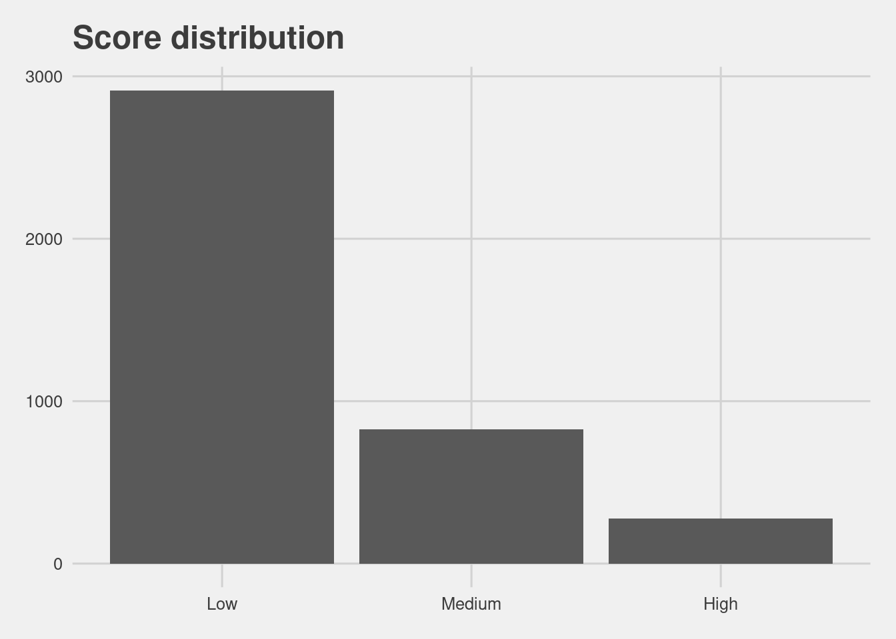

- Score distribution by race


```r
df %>%
  ggplot(aes(ordered(score_factor))) + 
          geom_bar() +
          facet_wrap(~race, nrow = 2) +
          labs(x = "Decile Score",
               y = "Count",
               Title = "Defendant's Decile Score")
```


#### Modeling 


```r
f2 <- Surv(start, end, event, type="counting") ~ race + score_factor + race * score_factor

model <- coxph(f2, data = df)

model %>%
  broom::tidy(conf.int = TRUE) %>%
  mutate(term = gsub("race|score_factor","", term)) %>% 
  filter(term != "<chr>") %>%
  ggplot(aes(x = fct_reorder(term, estimate), y = estimate, ymax = conf.high, ymin = conf.low)) +
  geom_pointrange() +
  coord_flip() +
  labs(y = "Estimate", x = "")
```


The interaction term shows a similar disparity as the logistic regression above.

High risk white defendants are 3.61 more likely than low risk white defendants, while High risk black defendants are 2.99 more likely than low.


```r
visualize_surv <- function(input){
  
f <- Surv(start, end, event, type="counting") ~ score_factor

fit <- survfit(f, data = input)

fit %>%
    tidy(conf.int = TRUE) %>%
    mutate(strata = gsub("score_factor=","", strata)) %>%
    mutate(strata = factor(strata, levels = c("High","Medium","Low"))) %>%
    ggplot(aes(x = time, y = estimate, ymax = conf.high, ymin = conf.low, group = strata, col = strata)) +
    geom_pointrange(alpha = 0.1) +
    guides(colour = guide_legend(override.aes = list(alpha = 1))) +
    ylim(c(0, 1)) +
    labs(x = "Time", y = "Estimated survival rate", col = "Strata")}
```


```r
visualize_surv(df) + ggtitle("Overall")
```


Black defendants do recidivate at higher rates according to race specific Kaplan Meier plots.


```r
(df %>% filter(race == "Caucasian") %>% visualize_surv() + ggtitle("Caucasian")) /
(df %>% filter(race == "African-American") %>% visualize_surv() + ggtitle("African-American")) 
```


In terms of underlying recidivism rates, we can look at gender specific Kaplan Meier estimates. There is a striking difference between women and men.


```r
(df %>% filter(sex == "Female") %>% visualize_surv() + ggtitle("Female")) /

(df %>% filter(sex == "Male") %>% visualize_surv() + ggtitle("Male"))
```


As these plots show, the COMPAS score treats a High risk women the same as a Medium risk man.

#### Risk of Recidivism accuracy 

The above analysis shows that the COMPAS algorithm does overpredict African-American defendant's future recidivism, but we haven't yet explored the direction of the bias. We can discover fine differences in overprediction and underprediction by comparing COMPAS scores across racial lines.


```r
# create a new environment 
conda_create("r-reticulate")
```

```
## [1] "/home/jae/.local/share/r-miniconda/envs/r-reticulate/bin/python"
```

```r
# install libs 
conda_install("r-reticulate", c("pandas"))

# indicate that we want to use a specific condaenv
use_condaenv("r-reticulate")
```


```python

from truth_tables import PeekyReader, Person, table, is_race, count, vtable, hightable, vhightable
from csv import DictReader

people = []
```


```python

with open("./data/cox-parsed.csv") as f:
    reader = PeekyReader(DictReader(f))
    try:
        while True:
            p = Person(reader)
            if p.valid:
                people.append(p)
    except StopIteration:
        pass
```


```python

pop = list(filter(lambda i: ((i.recidivist == True and i.lifetime <= 730) or
                              i.lifetime > 730), list(filter(lambda x: x.score_valid, people))))

recid = list(filter(lambda i: i.recidivist == True and i.lifetime <= 730, pop))

rset = set(recid)

surv = [i for i in pop if i not in rset]
```

- Define a function for a table.


```python

import pandas as pd 

def create_table(x, y):

  t = table(list(x), list(y))
  
  df = pd.DataFrame(t.items(), 
             columns = ['Metrics', 'Scores'])
             
  return(df)
             
```

- All defenders 


```python

create_table(list(recid), list(surv)).to_csv("data/table_recid.csv")
```


```r
read.csv(here("data", "table_recid.csv"))[,-1] %>%
  ggplot(aes(x = Metrics, y = Scores)) +
  geom_col() +
  labs(title = "Recidivism")
```

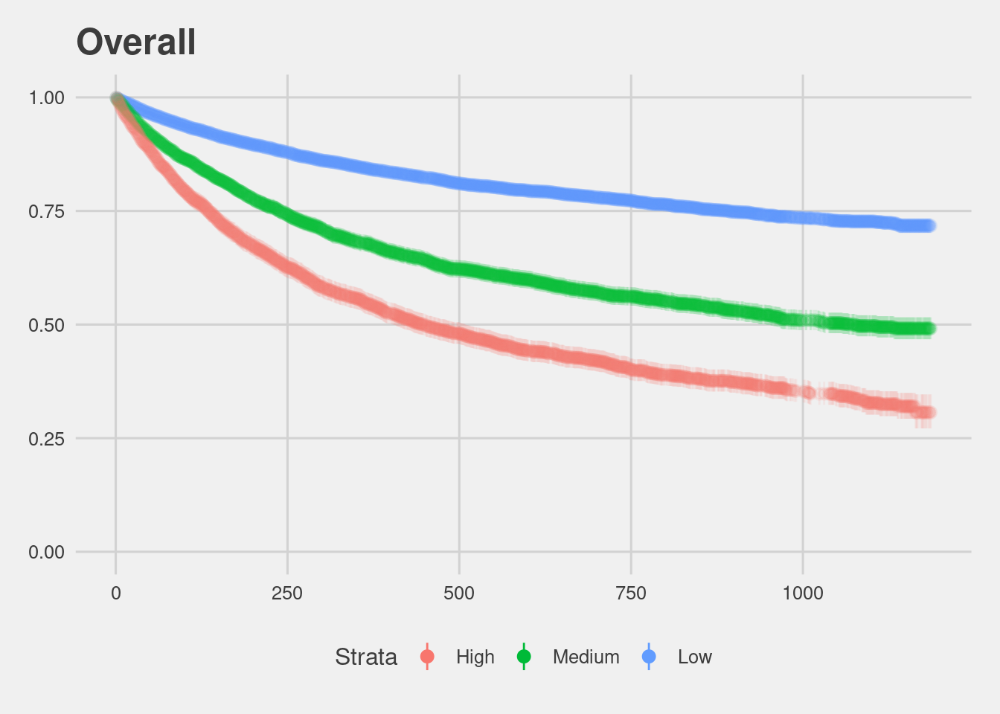

That number is higher for African Americans at 44.85% and lower for whites at 23.45%.


```python

def create_comp_tables(recid_data, surv_data):
  
    # filtering variables 
    is_afam = is_race("African-American")
    is_white = is_race("Caucasian")
  
    # dfs 
    df1 = create_table(filter(is_afam, recid_data),
                       filter(is_afam, surv_data))
  
    df2 = create_table(filter(is_white, recid_data), 
                       filter(is_white, surv_data))
  
    # concat 
    dfs = pd.concat([df1, df2])
    
    dfs['Group'] = ['African Americans','African Americans','Whites','Whites']
    
    return(dfs)
    
```


```python

create_comp_tables(recid, surv).to_csv("data/comp_tables_recid.csv")
```


```r
read.csv(here("data", "comp_tables_recid.csv"))[,-1] %>%
  ggplot(aes(x = Metrics, y = Scores, fill = Group)) +
  geom_col(position = "dodge") +
  coord_flip() +
  labs(title = "Recidivism")
```

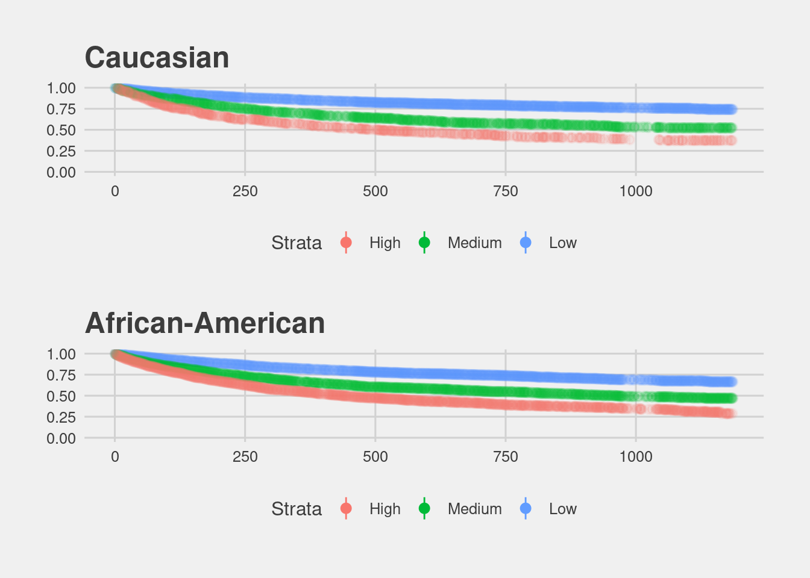

#### Risk of Violent Recidivism accuracy

COMPAS also offers a score that aims to measure a persons risk of violent recidivism, which has a similar overall accuracy to the Recidivism score.


```python

vpeople = []

with open("./data/cox-violent-parsed.csv") as f:
    reader = PeekyReader(DictReader(f))
    try:
        while True:
            p = Person(reader)
            if p.valid:
                vpeople.append(p)
    except StopIteration:
        pass

vpop = list(filter(lambda i: ((i.violent_recidivist == True and i.lifetime <= 730) or
                              i.lifetime > 730), list(filter(lambda x: x.vscore_valid, vpeople))))

vrecid = list(filter(lambda i: i.violent_recidivist == True and i.lifetime <= 730, vpeople))

vrset = set(vrecid)

vsurv = [i for i in vpop if i not in vrset]
```


```python

create_table(vrecid, vsurv).to_csv("data/table_vrecid.csv")
```


```r
read.csv(here("data", "table_vrecid.csv"))[,-1] %>%
  ggplot(aes(x = Metrics, y = Scores)) +
  geom_col() +
  labs(title = "Violent recidivism")
```


Even more so for Black defendants.


```python

create_comp_tables(vrecid, vsurv).to_csv("data/comp_tables_vrecid.csv")
```


```r
read.csv(here("data", "comp_tables_vrecid.csv"))[,-1] %>%
  ggplot(aes(x = Metrics, y = Scores, fill = Group)) +
  geom_col(position = "dodge") +
  coord_flip() +
  labs(title = "Violent recidivism")
```


## Resources

### Books 

- *An Introduction to Statistical Learning - with Applications in R (2013)* by Gareth James, Daniela Witten, Trevor Hastie, Robert Tibshirani. Springer: New York. [Amazon](https://www.amazon.com/Introduction-Statistical-Learning-Applications-Statistics/dp/1461471370) or [free PDF](http://www-bcf.usc.edu/~gareth/ISL/). 

- *Hands-On Machine Learning with R (2020)* by Bradley Boehmke & Brandon Greenwell. [CRC Press](https://www.routledge.com/Hands-On-Machine-Learning-with-R/Boehmke-Greenwell/p/book/9781138495685) or [Amazon](https://www.amazon.com/gp/product/1138495689?pf_rd_p=ab873d20-a0ca-439b-ac45-cd78f07a84d8&pf_rd_r=JBRX0ZJ1WFSR9T3JPTQE)

- *Applied Predictive Modeling (2013)* by Max Kuhn and Kjell Johnson. Springer: New York. [Amazon](https://www.amazon.com/Applied-Predictive-Modeling-Max-Kuhn/dp/1461468485?SubscriptionId=0ENGV10E9K9QDNSJ5C82&tag=apm0a-20&linkCode=xm2&camp=2025&creative=165953&creativeASIN=1461468485) 

- *Feature Engineering and Selection: A Practical Approach for Predictive Models (2019)* by Kjell Johnson and Max Kuhn. Taylor & Francis. [Amazon](http://www.feat.engineering/) or [free HTML](http://www.feat.engineering/). 
- *[Tidy Modeling with R](https://www.tmwr.org/) (2020)* by Max Kuhn and Julia Silge (work-in-progress)

### Lecture slides 

- [An introduction to supervised and unsupervised learning (2015)](https://www.nber.org/econometrics_minicourse_2015/nber_slides11.pdf) by Susan Athey and Guido Imbens 

- [Introduction Machine Learning with the Tidyverse](https://education.rstudio.com/blog/2020/02/conf20-intro-ml/) by Alison Hill

### Blog posts 

- ["Using the recipes package for easy pre-processing"](http://www.rebeccabarter.com/blog/2019-06-06_pre_processing/) by Rebecca Barter
