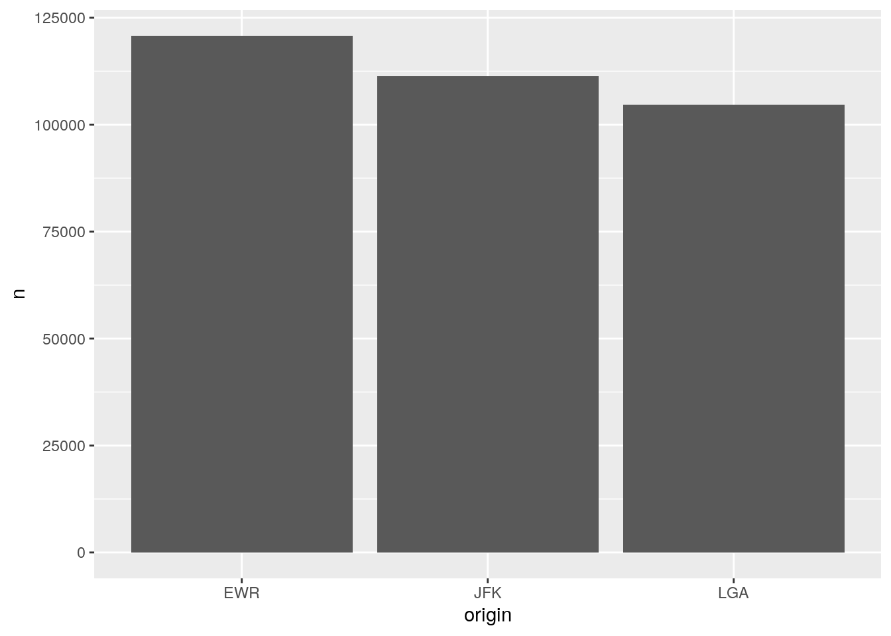

# Big data {#big_data}


## Overview

- Big data problem: data is too big to fit into memory (=local environment).
- R reads data into random-access memory (RAM) at once and this object lives in memory entirely. So, if object.size > memory.size, the process will crash R. 
- Therefore, the key to deal with big data in R is reducing the size of data you want to bring into it.

**Techniques to deal with big data**

- Medium sized file (1-2 GB)
   - Try to reduce the size of the file using slicing and dicing
   - Tools: 
      - R:`data.table::fread(file path, select = c("column 1", "column 2"))`. This command imports data faster than `read.csv()` does.
      - Command line: [`csvkit`](https://csvkit.readthedocs.io/en/latest/) - a suite of command-line tools to and working with CSV 
- Large file (> 2-10 GB)
   - Put the data into a database and **ACCESS** it 
   - Explore the data and pull the objects of interest 
   
**Databases**

- Types of databases
   - Relational database = a **collection** of **tables** (fixed columns and rows): SQL is a staple tool to define, **query** (focus of the workshop today), control, and manipulate this type of database
   - Non-relational database = a collection of documents (MongoDB), key-values (Redis and DyanoDB), wide-column stores (Cassandra and HBase), or graph (Neo4j and JanusGraph). Note that this type of database does not preclude SQL. NoSQL stands for ["not only SQL."](https://www.mongodb.com/nosql-explained)
  
**Relational database example**


## SQL

- Structured Query Language. Called SEQUEL and developed by IBM Corporation in the 1970s.

- Remains the standard language for a relational database management system.

- It's a DECLARATIVE language ([what to do > how to do](https://www.sqlite.org/queryplanner.html))
  - Database management systems figures optimal way to execute query (query optimization)
    
```sql
SELECT COLUMN FROM TABLE 
```

### Learning objectives 

* Embracing a new mindset: shifting from ownership (opening CSVs stored in your laptop) to access (accessing data stored in a database)

* Learning how to use R and SQL to access and query a database

### SQL and R

* SQL and R

SQL           | R
------------- | --------------------------------------------------------------------------
SELECT        | select() for columns, mutate() for expressions, summarise() for aggregates
FROM          | which data frame 
WHERE         | filter()
GROUP BY      | group_by()
HAVING        | filter() **after group_by()**
ORDER BY      | arrange()
LIMIT         | head()
  
**Challenge 1**
1. Can you tell me the difference in the order in which the following `R` and `SQL` code were written to manipulate data? For instance, in R, what command comes first? In contrast, in SQL, what command comes first?

- R example 

```r

data %>% # Data 
  select() %>% # Column
  filter() %>% # Row 
  group_by() %>% # Group by 
  summarise(n = n()) %>% # n() is one of the aggregate functions in r; it's count() used inside summarise() function 
  filter() %>% # Row 
  order_by() # Arrange 

```

- SQL example (in a SQL chunk, use `--` instead of `#` to comment) 

```sql 

SELECT column, aggregation (count())` -- Column

FROM data # Data 

WHERE condition -- Filter rows 

GROUP BY column -- Group by

HAVING condition -- Filter rows after group by  

ORDER BY column -- Arrange 

```

](https://wizardzines.com/zines/sql/samples/from.png)

### Setup

Let's get to work. 

### Packages 

- `pacman::p_load()` reduces steps for installing and loading several packages simultaneously. 


```r
# pacman 
if (!require("pacman")) install.packages("pacman")
```

```
## Loading required package: pacman
```

```r
# The rest of pkgs 
pacman::p_load(
 
 tidyverse, # tidyverse packages 
 
 DBI, # using SQL queries
 
 RSQLite, # SQLite
 
 dbplyr, # use database with dplyr 
 
 glue, # glue to automate workflow 
 
 nycflights13 # toy data 
)
```

### NYC flights data 

- [The flight on-time performance data](https://www.transtats.bts.gov/DL_SelectFields.asp?Table_ID=236) from the Bureau of Transportation Statistics of the U.S. government. The data goes back to 1987 and its size is more than 20 gigabytes. For practice, we only use a small subset of the original data (flight data departing NYC in 2013) provided by RStudio.


### Workflow 

1. Create/connect to a database 

- Note that server also can be your laptop (called [localhost](https://en.wikipedia.org/wiki/Localhost#:~:text=In%20computer%20networking%2C%20localhost%20is,via%20the%20loopback%20network%20interface.)).

- Short answer: To do so, you need interfaces between R and a database. We use [`RSQLite`](https://github.com/r-dbi/RSQLite) in this tutorial because it's easy to set up. 

- Long answer: The `DBI` package in R provides a client-side interface that allows `dplyr` to work with databases. DBI is automatically installed when you installed `dbplyr`. However, you need to install a specific backend engine (a tool for communication between R and a database management system) for the database (e.g., `RMariaDB`, `RPostgres`, `RSQLite`). In this workshop, we use SQLite because it is the easiest to get started with. Personally, I love PostgreSQL because it's an open-source and also powerful to do [many amazing things](https://www.postgresql.org/docs/current/functions.html) (e.g., text mining, geospatial analysis). If you want to not only build a data warehouse, but an anlytical platform then consider using Spark (Hadoop).

2. Copy a table to the database 

- Option 1: You can create a table and insert rows manually. In order to do that, you also need to define data schema (the structure of the database). 

- Table
    - Collection of rows 
    - Collection of columns (fields or attributes)
    - Each col has a type:
        - String: `VARCHAR(20)`
        - Integer: `INTEGER`
        - Floating-point: `FLOAT`, `DOUBLE`
        - Date/time: `DATE`, `TIME`, `DATETIME`
    - **Schema**: the structure of the database
        - The table name
        - The names and types of its columns
        - Various optional additional information 
            - [Constraints](https://www.w3schools.com/sql/sql_constraints.asp)
                - Syntax: `column datatype constraint`
                - Examples: `NOT NULL`, `UNIQUE`, `INDEX`
        
```sql

-- Create table 

CREATE TABLE students (
    id INT AUTO_INCREMENT,
    name VARCHAR(30),
    birth DATE,
    gpa FLOAT,
    grad INT,
    PRIMARY KEY(id));

-- Insert one additional row 

INSERT INTO students(name, birth, gpa, grad)
      VALUES ('Adam', '2000-08-04', 4.0, 2020);

```

- Option 2: Copy a file (object) to a table in a database using `copy_to`). We take this option as it's fast and we would like to focus on querying in this workshop. 

3. Query the table 

- Main focus 

4. Pull the results of interests (**data**) using `collect()`

5. Disconnect the database 

#### Create a database 


```r
# Define a backend engine 

drv <- RSQLite::SQLite()

# Create an empty in-memory database 
con <- DBI::dbConnect(drv, 
                      dbname = ":memory:")

# Connect to an existing database 
#con <- DBI::dbConnect(RMariaDB::MariaDB(), 
 # host = "database.rstudio.com",
 # user = "hadley",
 # password = rstudioapi::askForPassword("Database password")
#)

dbListTables(con)
```

```
## character(0)
```

```r
# character(0) = NULL
```

- Note that con is empty at this stage.

#### Copy an object as a table to the database (push)


```r
# Copy objects to the data 
# copy_to() comes from dplyr
copy_to(dest = con, 
        df = flights)

copy_to(dest = con, 
        df = airports)

copy_to(dest = con,
        df = planes)

copy_to(dest = con, 
        df = weather)

# If you need, you can also select which columns you would like to copy:

# copy_to(dest = con, 
#          df = flights, 
#          name = "flights",
#          indexes = list(c("year", "tailnum", "dest")))
```


```r
# Show two tables in the database 

dbListTables(con)
```

```
## [1] "airports"     "flights"      "planes"       "sqlite_stat1" "sqlite_stat4"
## [6] "weather"
```

```r
# Show the columns/attributes/fields of a table 

dbListFields(con, "flights")
```

```
##  [1] "year"           "month"          "day"            "dep_time"      
##  [5] "sched_dep_time" "dep_delay"      "arr_time"       "sched_arr_time"
##  [9] "arr_delay"      "carrier"        "flight"         "tailnum"       
## [13] "origin"         "dest"           "air_time"       "distance"      
## [17] "hour"           "minute"         "time_hour"
```

```r
dbListFields(con, "weather")
```

```
##  [1] "origin"     "year"       "month"      "day"        "hour"      
##  [6] "temp"       "dewp"       "humid"      "wind_dir"   "wind_speed"
## [11] "wind_gust"  "precip"     "pressure"   "visib"      "time_hour"
```

#### Quick demonstrations:

- SELECT desired columns 
- FROM tables 

- Select all columns (*) from `flights` table and show the `first ten rows`
- Note that you can combine SQL and R commands thanks to `dbplyr`.

- Option 1 


```r
DBI::dbGetQuery(con, 
                "SELECT * FROM flights;") %>% # SQL
  head(10) # dplyr 
```

```
##    year month day dep_time sched_dep_time dep_delay arr_time sched_arr_time
## 1  2013     1   1      517            515         2      830            819
## 2  2013     1   1      533            529         4      850            830
## 3  2013     1   1      542            540         2      923            850
## 4  2013     1   1      544            545        -1     1004           1022
## 5  2013     1   1      554            600        -6      812            837
## 6  2013     1   1      554            558        -4      740            728
## 7  2013     1   1      555            600        -5      913            854
## 8  2013     1   1      557            600        -3      709            723
## 9  2013     1   1      557            600        -3      838            846
## 10 2013     1   1      558            600        -2      753            745
##    arr_delay carrier flight tailnum origin dest air_time distance hour minute
## 1         11      UA   1545  N14228    EWR  IAH      227     1400    5     15
## 2         20      UA   1714  N24211    LGA  IAH      227     1416    5     29
## 3         33      AA   1141  N619AA    JFK  MIA      160     1089    5     40
## 4        -18      B6    725  N804JB    JFK  BQN      183     1576    5     45
## 5        -25      DL    461  N668DN    LGA  ATL      116      762    6      0
## 6         12      UA   1696  N39463    EWR  ORD      150      719    5     58
## 7         19      B6    507  N516JB    EWR  FLL      158     1065    6      0
## 8        -14      EV   5708  N829AS    LGA  IAD       53      229    6      0
## 9         -8      B6     79  N593JB    JFK  MCO      140      944    6      0
## 10         8      AA    301  N3ALAA    LGA  ORD      138      733    6      0
##     time_hour
## 1  1357034400
## 2  1357034400
## 3  1357034400
## 4  1357034400
## 5  1357038000
## 6  1357034400
## 7  1357038000
## 8  1357038000
## 9  1357038000
## 10 1357038000
```

- Option 2 (works faster)


- Option 3 (automating workflow)

  - When local variables are updated, the SQL query is also automatically updated. This approach is called [parameterized query](https://www.php.net/manual/en/pdo.prepared-statements.php) (or prepared statement).


```r
######################## PREPARATION ########################

# Local variables 
tbl <- "flights"
var <- "dep_delay"
num <- 10

# Glue SQL query string 
# Note that to indicate a numeric value, you don't need ``

sql_query <- glue_sql("
  SELECT {`var`}
  FROM {`tbl`}
  LIMIT {num} 
  ", .con = con)

######################## EXECUTION ########################

# Run the query 
dbGetQuery(con, sql_query)
```

```
##    dep_delay
## 1          2
## 2          4
## 3          2
## 4         -1
## 5         -6
## 6         -4
## 7         -5
## 8         -3
## 9         -3
## 10        -2
```

**Challenge 2** 
Can you rewrite the above code using `LIMIT` instead of `head(10)`? 

- You may notice that using only SQL code makes querying faster.

- Select `dep_delay` and `arr_delay` from flights table, show the first ten rows, then turn the result into a tibble.

**Challenge 3**
Could you remind me how to see the list of attributes of a table? Let's say you want to see the attributes of `flights` table. How can you do it?

- Collect the selected columns and filtered rows 


```r
df <- dbGetQuery(con, 
  "SELECT dep_delay, arr_delay FROM flights;") %>%
  head(10) %>%
  collect()
```
  
- Counting rows 

  - Count all (*)
  

```r
dbGetQuery(con, 
          "SELECT COUNT(*) 
           FROM flights;") 
```

```
##   COUNT(*)
## 1   336776
```
  

```r
dbGetQuery(con, 
           "SELECT COUNT(dep_delay)
           FROM flights;")
```

```
##   COUNT(dep_delay)
## 1           328521
```

  - Count distinct values 
  

```r
dbGetQuery(con, 
           "SELECT COUNT(DISTINCT dep_delay)
           FROM flights;")
```

```
##   COUNT(DISTINCT dep_delay)
## 1                       527
```

#### Tidy-way: dplyr -> SQL

Thanks to the `dbplyr` package you can use the `dplyr` syntax to query SQL. 

- Note that pipe (%) works.


```r
# tbl select tables
flights <- con %>% tbl("flights")
airports <- con %>% tbl("airports")
planes <- con %>% tbl("planes")
weather <- con %>% tbl("weather")
```

- `select` = `SELECT`


```r
flights %>% 
  select(contains("delay"))
```

```
## # Source:   lazy query [?? x 2]
## # Database: sqlite 3.34.1 [:memory:]
##    dep_delay arr_delay
##        <dbl>     <dbl>
##  1         2        11
##  2         4        20
##  3         2        33
##  4        -1       -18
##  5        -6       -25
##  6        -4        12
##  7        -5        19
##  8        -3       -14
##  9        -3        -8
## 10        -2         8
## # … with more rows
```

**Challenge 4** 
Your turn: write the same code in SQL. Don't forget to add `connection` argument to your SQL code chunk.

- `mutate` = `SELECT` `AS`


```r
flights %>%
  select(distance, air_time) %>%  
  mutate(speed = distance / (air_time / 60)) 
```

```
## # Source:   lazy query [?? x 3]
## # Database: sqlite 3.34.1 [:memory:]
##    distance air_time speed
##       <dbl>    <dbl> <dbl>
##  1     1400      227  370.
##  2     1416      227  374.
##  3     1089      160  408.
##  4     1576      183  517.
##  5      762      116  394.
##  6      719      150  288.
##  7     1065      158  404.
##  8      229       53  259.
##  9      944      140  405.
## 10      733      138  319.
## # … with more rows
```

**Challenge 5** 
Your turn: write the same code in SQL. (
Hint: `mutate(new_var = var 1 * var2` (R) = `SELECT var1 * var2 AS near_var` (SQL)

- `filter` = `WHERE` 


```r
flights %>% 
  filter(month == 1, day == 1) # filter(month ==1 & day == 1) Both work in the same way.
```

```
## # Source:   lazy query [?? x 19]
## # Database: sqlite 3.34.1 [:memory:]
##     year month   day dep_time sched_dep_time dep_delay arr_time sched_arr_time
##    <int> <int> <int>    <int>          <int>     <dbl>    <int>          <int>
##  1  2013     1     1      517            515         2      830            819
##  2  2013     1     1      533            529         4      850            830
##  3  2013     1     1      542            540         2      923            850
##  4  2013     1     1      544            545        -1     1004           1022
##  5  2013     1     1      554            600        -6      812            837
##  6  2013     1     1      554            558        -4      740            728
##  7  2013     1     1      555            600        -5      913            854
##  8  2013     1     1      557            600        -3      709            723
##  9  2013     1     1      557            600        -3      838            846
## 10  2013     1     1      558            600        -2      753            745
## # … with more rows, and 11 more variables: arr_delay <dbl>,
## #   carrier <chr>, flight <int>, tailnum <chr>, origin <chr>, dest <chr>,
## #   air_time <dbl>, distance <dbl>, hour <dbl>, minute <dbl>,
## #   time_hour <dbl>
```

**Challenge 6** 
Your turn: write the same code in SQL (hint: `filter(condition1, condition2)` = `WHERE condition1 and condition2`)

**Additional tips**

Note that R and SQL operators are not exactly alike. R uses `!=` for `Not equal to`. SQL uses `<>` or `!=`. Furthermore, there are some cautions about using `NULL` (NA; unknown or missing): it should be `IS NULL` or `IS NOT NULL` not `=NULL` or `!=NULL` (this makes sense because NULL represents an absence of a value). 

Another pro-tip is [`LIKE` operator](https://www.w3schools.com/sql/sql_like.asp), which is used in a `WHERE` statement to find values based on string patterns.


```sql
SELECT DISTINCT(origin) -- Distinct values from origin column
FROM flights
WHERE origin LIKE 'J%'; -- Find any origin values that start with "J"
```


<div class="knitsql-table">


Table: (\#tab:unnamed-chunk-16)1 records

|origin |
|:------|
|JFK    |

</div>

`%` is one of the wildcards that you can use for string matching. `%` matches any number of characters. So, `J%` matches Jae, JFK, Joseph, etc. `_` is another useful wildcard and it matches exactly one character. So `J_` matches only JA, JE, etc. If wildcards are not enough, then you should consider using regular expressions.

- `arrange` = `ORDER BY`


```r
flights %>% 
  arrange(carrier, desc(arr_delay)) %>%
  show_query()
```

```
## <SQL>
## SELECT *
## FROM `flights`
## ORDER BY `carrier`, `arr_delay` DESC
```

**Challenge 7** 
Your turn: write the same code in SQL.
Hint: `arrange(var1, desc(var2)` (R) = `ORDER BY var1, var2 DESC` (SQL)

- `summarise` = `SELECT` `AS` and `group by` = `GROUP BY`


```r
flights %>%
  group_by(month, day) %>%
  summarise(delay = mean(dep_delay)) 
```

```
## Warning: Missing values are always removed in SQL.
## Use `mean(x, na.rm = TRUE)` to silence this warning
## This warning is displayed only once per session.
```

```
## `summarise()` has grouped output by 'month'. You can override using the `.groups` argument.
```

```
## # Source:   lazy query [?? x 3]
## # Database: sqlite 3.34.1 [:memory:]
## # Groups:   month
##    month   day delay
##    <int> <int> <dbl>
##  1     1     1 11.5 
##  2     1     2 13.9 
##  3     1     3 11.0 
##  4     1     4  8.95
##  5     1     5  5.73
##  6     1     6  7.15
##  7     1     7  5.42
##  8     1     8  2.55
##  9     1     9  2.28
## 10     1    10  2.84
## # … with more rows
```

**Challenge 8** 
Your turn: write the same code in SQL (hint: in SQL the order should be `SELECT group_var1, group_var2, AVG(old_var) AS new_var` -> `FROM` -> `GROUP BY`)

- If you feel too much challenged, here's a help.


```r
flights %>%
  group_by(month, day) %>%
  summarise(delay = mean(dep_delay)) %>%
  show_query() # Show the SQL equivalent!
```

```
## `summarise()` has grouped output by 'month'. You can override using the `.groups` argument.
```

```
## <SQL>
## SELECT `month`, `day`, AVG(`dep_delay`) AS `delay`
## FROM `flights`
## GROUP BY `month`, `day`
```

- Joins 

- Using joins is simpler in R than it is in SQL.

- However, more flexible joins exist in SQL and they are not available in R. 

  - Joins involving 3+ tables are not supported.
  - Some advanced joins available in SQL are not supported. 
  - For more information, check out [`tidyquery`](https://github.com/ianmcook/tidyquery/issues) to see the latest developments.

- SQL command 

`FROM one table LEFT JOIN another table ON condition = condition` (`ON` in SQL = `BY` in R)


```sql
SELECT *
FROM flights AS f
LEFT JOIN weather AS w 
ON f.year = w.year AND f.month = w.month
```


<div class="knitsql-table">


Table: (\#tab:unnamed-chunk-20)Displaying records 1 - 10

| year| month| day| dep_time| sched_dep_time| dep_delay| arr_time| sched_arr_time| arr_delay|carrier | flight|tailnum |origin |dest | air_time| distance| hour| minute|  time_hour|origin | year| month| day| hour|  temp|  dewp| humid| wind_dir| wind_speed| wind_gust| precip| pressure| visib|  time_hour|
|----:|-----:|---:|--------:|--------------:|---------:|--------:|--------------:|---------:|:-------|------:|:-------|:------|:----|--------:|--------:|----:|------:|----------:|:------|----:|-----:|---:|----:|-----:|-----:|-----:|--------:|----------:|---------:|------:|--------:|-----:|----------:|
| 2013|     1|   1|      517|            515|         2|      830|            819|        11|UA      |   1545|N14228  |EWR    |IAH  |      227|     1400|    5|     15| 1357034400|EWR    | 2013|     1|   1|    1| 39.02| 26.06| 59.37|      270|   10.35702|        NA|      0|   1012.0|    10| 1357020000|
| 2013|     1|   1|      517|            515|         2|      830|            819|        11|UA      |   1545|N14228  |EWR    |IAH  |      227|     1400|    5|     15| 1357034400|EWR    | 2013|     1|   1|    2| 39.02| 26.96| 61.63|      250|    8.05546|        NA|      0|   1012.3|    10| 1357023600|
| 2013|     1|   1|      517|            515|         2|      830|            819|        11|UA      |   1545|N14228  |EWR    |IAH  |      227|     1400|    5|     15| 1357034400|EWR    | 2013|     1|   1|    3| 39.02| 28.04| 64.43|      240|   11.50780|        NA|      0|   1012.5|    10| 1357027200|
| 2013|     1|   1|      517|            515|         2|      830|            819|        11|UA      |   1545|N14228  |EWR    |IAH  |      227|     1400|    5|     15| 1357034400|EWR    | 2013|     1|   1|    4| 39.92| 28.04| 62.21|      250|   12.65858|        NA|      0|   1012.2|    10| 1357030800|
| 2013|     1|   1|      517|            515|         2|      830|            819|        11|UA      |   1545|N14228  |EWR    |IAH  |      227|     1400|    5|     15| 1357034400|EWR    | 2013|     1|   1|    5| 39.02| 28.04| 64.43|      260|   12.65858|        NA|      0|   1011.9|    10| 1357034400|
| 2013|     1|   1|      517|            515|         2|      830|            819|        11|UA      |   1545|N14228  |EWR    |IAH  |      227|     1400|    5|     15| 1357034400|EWR    | 2013|     1|   1|    6| 37.94| 28.04| 67.21|      240|   11.50780|        NA|      0|   1012.4|    10| 1357038000|
| 2013|     1|   1|      517|            515|         2|      830|            819|        11|UA      |   1545|N14228  |EWR    |IAH  |      227|     1400|    5|     15| 1357034400|EWR    | 2013|     1|   1|    7| 39.02| 28.04| 64.43|      240|   14.96014|        NA|      0|   1012.2|    10| 1357041600|
| 2013|     1|   1|      517|            515|         2|      830|            819|        11|UA      |   1545|N14228  |EWR    |IAH  |      227|     1400|    5|     15| 1357034400|EWR    | 2013|     1|   1|    8| 39.92| 28.04| 62.21|      250|   10.35702|        NA|      0|   1012.2|    10| 1357045200|
| 2013|     1|   1|      517|            515|         2|      830|            819|        11|UA      |   1545|N14228  |EWR    |IAH  |      227|     1400|    5|     15| 1357034400|EWR    | 2013|     1|   1|    9| 39.92| 28.04| 62.21|      260|   14.96014|        NA|      0|   1012.7|    10| 1357048800|
| 2013|     1|   1|      517|            515|         2|      830|            819|        11|UA      |   1545|N14228  |EWR    |IAH  |      227|     1400|    5|     15| 1357034400|EWR    | 2013|     1|   1|   10| 41.00| 28.04| 59.65|      260|   13.80936|        NA|      0|   1012.4|    10| 1357052400|

</div>

Can anyone explain why SQL query using `dplyr` then translated by `show_query()` looks so complex compared to the above? ([Hint](https://stackoverflow.com/questions/36808295/how-to-remove-duplicate-columns-from-join-in-sql))


```r
flights %>% 
  left_join(weather, by = c("year", "month")) %>%
  show_query()
```

```
## <SQL>
## SELECT `LHS`.`year` AS `year`, `LHS`.`month` AS `month`, `LHS`.`day` AS `day.x`, `dep_time`, `sched_dep_time`, `dep_delay`, `arr_time`, `sched_arr_time`, `arr_delay`, `carrier`, `flight`, `tailnum`, `LHS`.`origin` AS `origin.x`, `dest`, `air_time`, `distance`, `LHS`.`hour` AS `hour.x`, `minute`, `LHS`.`time_hour` AS `time_hour.x`, `RHS`.`origin` AS `origin.y`, `RHS`.`day` AS `day.y`, `RHS`.`hour` AS `hour.y`, `temp`, `dewp`, `humid`, `wind_dir`, `wind_speed`, `wind_gust`, `precip`, `pressure`, `visib`, `RHS`.`time_hour` AS `time_hour.y`
## FROM `flights` AS `LHS`
## LEFT JOIN `weather` AS `RHS`
## ON (`LHS`.`year` = `RHS`.`year` AND `LHS`.`month` = `RHS`.`month`)
```

#### Collect (pull)

* `collect()` is used to pull the data. Depending on the data size, it may take a long time to run.

- The following code won't work.

> Error in UseMethod("collect") : no applicable method for 'collect' applied to an object of class "c('LayerInstance', 'Layer', 'ggproto', 'gg')"


```r
origin_flights_plot <- flights %>%
  group_by(origin) %>%
  tally() %>%
  ggplot() +
  geom_col(aes(x = origin, y = n)) %>%
  collect()
```

- This works. 


```r
df <- flights %>%
  group_by(origin) %>%
  tally() %>%
  collect()

origin_flights_plot <- ggplot(df) +
  geom_col(aes(x = origin, y = n))

origin_flights_plot
```



#### Disconnect 


```r
DBI::dbDisconnect(con)
```

### Things we didn't cover 

#### Subquery

Subquery = a query nested inside a query 

This is a hypothetical example inspired by [dofactory blog post](https://www.dofactory.com/sql/subquery).


```sql
SELECT names  -- Outer query 
FROM consultants
WHERE Id IN (SELECT ConsultingId
                FROM consulting_cases 
                WHERE category = 'r' AND category = 'sql'); -- Subquery 
```

#### Common table expression (WITH clauses)

This is just a hypothetical example inspired by [James LeDoux's blog post](https://jamesrledoux.com/code/sql-cte-common-table-expressions.


```sql
-- cases about R and SQL from dlab-database 
WITH r_sql_consulting_cases AS ( -- The name of the CTE expression 
  -- The CTE query 
  SELECT
    id 
  FROM 
    dlab 
  WHERE
    tags LIKE '%sql%'
  AND
    tags LIKE '%r%'
),
-- count the number of open cases about this consulting category 
-- The outer query 
SELECT status, COUNT(status) AS open_status_count
FROM dlab as d 
INNER JOIN r_sql_consulting_cases as r
  ON d.id = r.id 
WHERE status = 'open'; 
```

### References 

- [csv2db](https://github.com/csv2db/csv2db) - for loading large CSV files in to a database 
- R Studio, [Database using R](https://db.rstudio.com/)
- Ian Cook, ["Bridging the Gap between SQL and R"](https://github.com/ianmcook/rstudioconf2020/blob/master/bridging_the_gap_between_sql_and_r.pdf) rstudio::conf 2020 slides
  - [Video recording](https://www.youtube.com/watch?v=JwP5KdWSgqE&ab_channel=RStudio)
- Data Carpentry contributors, [SQL database and R](https://datacarpentry.org/R-ecology-lesson/05-r-and-databases.html), Data Carpentry, September 10, 2019.
- [Introduction to dbplyr](https://cran.r-project.org/web/packages/dbplyr/vignettes/dbplyr.html)
- Josh Erickson, [SQL in R](http://dept.stat.lsa.umich.edu/~jerrick/courses/stat701/notes/sql.html), STAT 701, University of Michigan
- [SQL zine](https://wizardzines.com/zines/sql/) by Julia Evans
- [q](http://harelba.github.io/q/) - a command line tool that allows direct execution of SQL-like queries on CSVs/TSVs (and any other tabular text files) 

## Spark 

### Setup 

1. Install `sparklyr` package 
2. Install `spark` using `sparklyr` package 
3. (If you haven't) install Java 8 (see [this guideline](https://www.java.com/en/download/manual.jsp) from the Java website)


```r
# if(!require("sparklyr")) install.packages("sparklyr")

# sparklyr::spark_install(version = "3.0.0")
```

