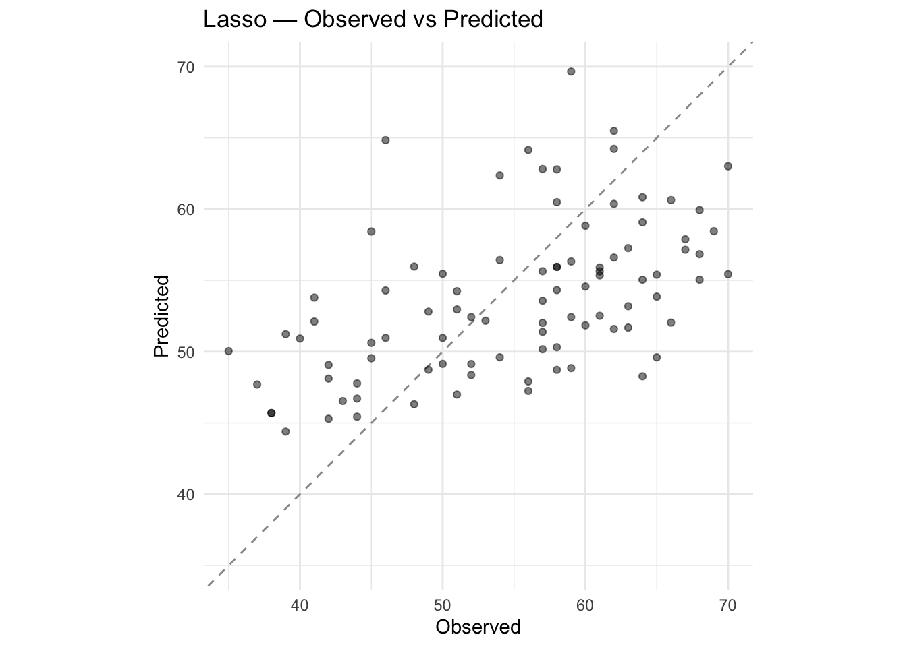
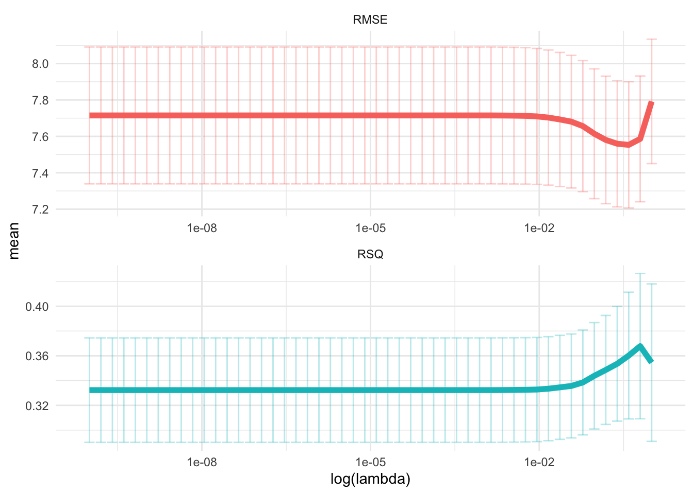
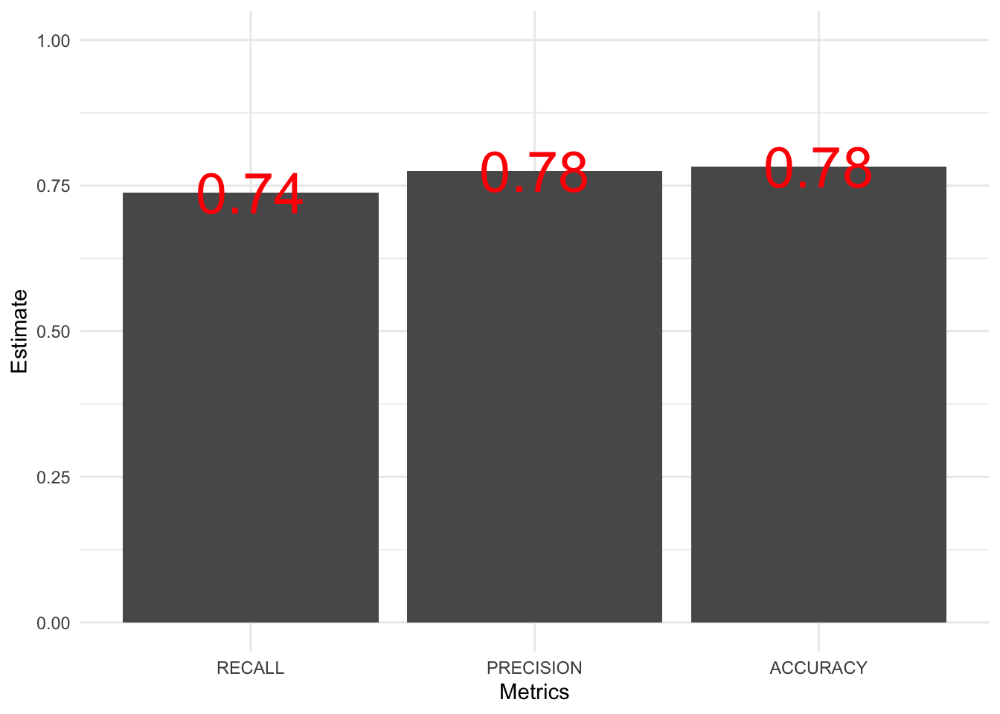
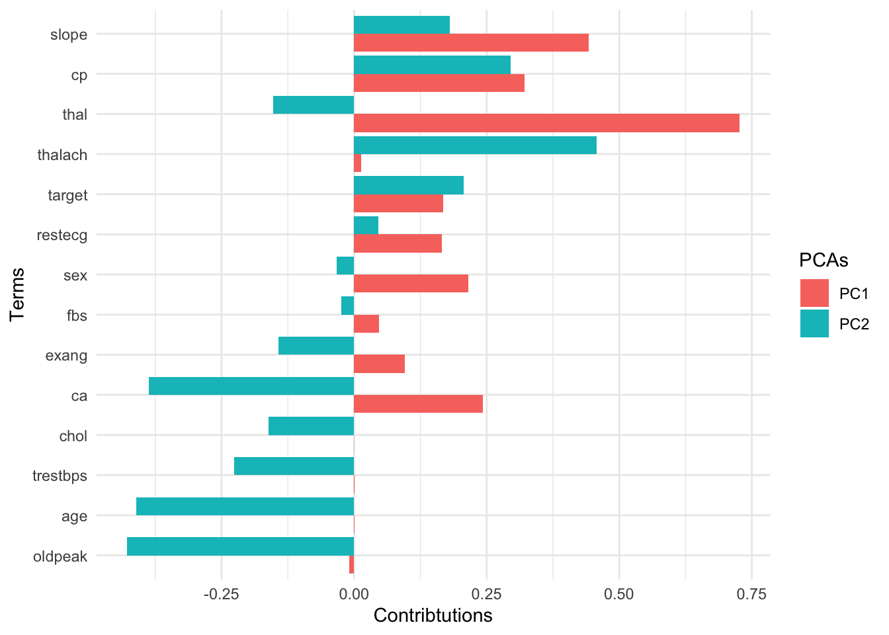

# High-dimensional data {#machine_learning}


## The Big Picture

- The rise of high-dimensional data. The new data frontiers in social sciences---text ([Gentzkow et al. 2019](https://web.stanford.edu/~gentzkow/research/text-as-data.pdf); [Grimmer and Stewart 2013](https://www.jstor.org/stable/pdf/24572662.pdf?casa_token=SQdSI4R_VdwAAAAA:4QiVLhCXqr9f0qNMM9U75EL5JbDxxnXxUxyIfDf0U8ZzQx9szc0xVqaU6DXG4nHyZiNkvcwGlgD6H0Lxj3y0ULHwgkf1MZt8-9TPVtkEH9I4AHgbTg)) and and image ([Joo and Steinert-Threlkeld 2018](https://arxiv.org/pdf/1810.01544))---are all high-dimensional data. 

    - 1000 common English words for 30-word tweets: $1000^{30}$ similar to N of atoms in the universe ([Gentzkow et al. 2019](https://web.stanford.edu/~gentzkow/research/text-as-data.pdf))

    - Belloni, Alexandre, Victor Chernozhukov, and Christian Hansen. ["High-dimensional methods and inference on structural and treatment effects."](https://pubs.aeaweb.org/doi/pdfplus/10.1257/jep.28.2.29) *Journal of Economic Perspectives 28*, no. 2 (2014): 29-50.

- The rise of the new approach: statistics + computer science = machine learning 

- Statistical inference 

    - $y$ <- some probability models (e.g., linear regression, logistic regression) <- $x$
       
    - $y$ = $X\beta$ + $\epsilon$
        
    - The goal is to estimate $\beta$

- Machine learning 

    - $y$ <- unknown <- $x$ 
    
    - $y$ <-> decision trees, neutral nets <-> $x$
        
    - For the main idea behind prediction modeling, see Breiman, Leo (Berkeley stat faculty who passed away in 2005). ["Statistical modeling: The two cultures (with comments and a rejoinder by the author)."](https://projecteuclid.org/euclid.ss/1009213726) *Statistical science* 16, no. 3 (2001): 199-231.
    
    - "The problem is to find an algorithm $f(x)$ such that for future $x$ in a test set, $f(x)$ will be a good predictor of $y$."
    
    - "There are **two cultures** in the use of statistical modeling to reach conclusions from data. One assumes that the data are generated by a **given** **stochastic data model**. The other uses **algorithmic models** and treats the data mechanism as **unknown**."


- How ML differs from econometrics? 

- A review by Athey, Susan, and Guido W. Imbens. ["Machine learning methods that economists should know about."](https://www.annualreviews.org/doi/full/10.1146/annurev-economics-080217-053433) *Annual Review of Economics* 11 (2019): 685-725.
        
- Stat:
  
    - Specifying a target (i.e., an estimand)

    - Fitting a model to data using an objective function (e.g., the sum of squared errors)

    - Reporting point estimates (effect size) and standard errors (uncertainty)

    - Validation by yes-no using goodness-of-fit tests and residual examination

- ML: 

    - Developing algorithms (estimating *f(x)*)

    - Prediction power, not structural/causal parameters

    - Basically, high-dimensional data statistics (N < P)

    - The major problem is to avoid ["the curse of dimensionality"](https://en.wikipedia.org/wiki/Curse_of_dimensionality) ([too many features - > overfitting](https://towardsdatascience.com/the-curse-of-dimensionality-50dc6e49aa1e))

    - Validation: out-of-sample comparisons (cross-validation) not in-sample goodness-of-fit measures

    - So, it's curve-fitting, but the primary focus is unseen (test data), not seen data (training data)

- A quick review on ML lingos for those trained in econometrics 

    - Sample to estimate parameters = Training sample
  
    - Estimating the model = Being trained 
    
    - Regressors, covariates, or predictors = Features 
  
    - Regression parameters = weights 
  
    - Prediction problems = Supervised (some $y$ are known) + Unsupervised ($y$ unknown)
    
. Many images in this chapter come from vas3k blog.](https://i.vas3k.ru/7w9.jpg)

](https://i.vas3k.ru/7vz.jpg)

](https://i.vas3k.ru/7vx.jpg)

](https://i.vas3k.ru/7w1.jpg)

## Dataset  

- [Heart disease data from UCI](https://archive.ics.uci.edu/ml/datasets/heart+Disease)

- One of the popular datasets used in machine learning competitions 


``` r
# Install pacman if needed, then load packages
if (!requireNamespace("pacman", quietly = TRUE)) {
  install.packages("pacman")
}
pacman::p_load(
  here,         # Project‐root file paths
  tidyverse,    # Data manipulation & visualization (dplyr, ggplot2, etc.)
  tidymodels,   # Modeling ecosystem (parsnip, recipes, yardstick, etc.)
  doParallel,   # Parallel backend for modeling (foreach, caret, tidymodels)
  patchwork,    # Compose multiple ggplots into one layout
  remotes,      # Install packages from GitHub and other remote sources
  SuperLearner, # Ensemble learning via stacked generalization
  vip,          # Variable importance plots (model‐agnostic)
  glmnet,       # Regularized regression (lasso, ridge, elastic net)
  finetune,     # Advanced hyperparameter tuning (race methods, etc.)
  glue,         # String interpolation
  xgboost,      # Gradient boosting (XGBoost)
  rpart,        # Recursive partitioning trees
  ranger,       # Fast random forests with C++ backend
  conflicted    # Explicit conflict resolution for masking functions
)

remotes::install_github("ck37/ck37r")

conflicted::conflict_prefer("filter", "dplyr")
```


``` r
## Jae's custom functions
source(here("functions", "ml_utils.r"))

# Import the dataset

data_original <- read_csv(here("data", "heart.csv"))

glimpse(data_original)
```

```
## Rows: 303
## Columns: 14
## $ age      <dbl> 63, 37, 41, 56, 57, 57, 56, 44, 52, 57, 54, 48, 49, 64, 58, 5…
## $ sex      <dbl> 1, 1, 0, 1, 0, 1, 0, 1, 1, 1, 1, 0, 1, 1, 0, 0, 0, 0, 1, 0, 1…
## $ cp       <dbl> 3, 2, 1, 1, 0, 0, 1, 1, 2, 2, 0, 2, 1, 3, 3, 2, 2, 3, 0, 3, 0…
## $ trestbps <dbl> 145, 130, 130, 120, 120, 140, 140, 120, 172, 150, 140, 130, 1…
## $ chol     <dbl> 233, 250, 204, 236, 354, 192, 294, 263, 199, 168, 239, 275, 2…
## $ fbs      <dbl> 1, 0, 0, 0, 0, 0, 0, 0, 1, 0, 0, 0, 0, 0, 1, 0, 0, 0, 0, 0, 0…
## $ restecg  <dbl> 0, 1, 0, 1, 1, 1, 0, 1, 1, 1, 1, 1, 1, 0, 0, 1, 1, 1, 1, 1, 1…
## $ thalach  <dbl> 150, 187, 172, 178, 163, 148, 153, 173, 162, 174, 160, 139, 1…
## $ exang    <dbl> 0, 0, 0, 0, 1, 0, 0, 0, 0, 0, 0, 0, 0, 1, 0, 0, 0, 0, 0, 0, 0…
## $ oldpeak  <dbl> 2.3, 3.5, 1.4, 0.8, 0.6, 0.4, 1.3, 0.0, 0.5, 1.6, 1.2, 0.2, 0…
## $ slope    <dbl> 0, 0, 2, 2, 2, 1, 1, 2, 2, 2, 2, 2, 2, 1, 2, 1, 2, 0, 2, 2, 1…
## $ ca       <dbl> 0, 0, 0, 0, 0, 0, 0, 0, 0, 0, 0, 0, 0, 0, 0, 0, 0, 0, 0, 2, 0…
## $ thal     <dbl> 1, 2, 2, 2, 2, 1, 2, 3, 3, 2, 2, 2, 2, 2, 2, 2, 2, 2, 2, 2, 3…
## $ target   <dbl> 1, 1, 1, 1, 1, 1, 1, 1, 1, 1, 1, 1, 1, 1, 1, 1, 1, 1, 1, 1, 1…
```

``` r
# Createa a copy
data <- data_original

theme_set(theme_minimal())
```

## Workflow 

- 1. Preprocessing
- 2. Model building
- 3. Model fitting
- 4. Model evaluation
- 5. Model tuning
- 6. Prediction

## tidymodels 

- Like `tidyverse`, `tidymodels` is a collection of packages.

    - [`rsample`](https://rsample.tidymodels.org/): for data splitting 
    
    - [`recipes`](https://recipes.tidymodels.org/index.html): for pre-processing
    
    - [`parsnip`](https://www.tidyverse.org/blog/2018/11/parsnip-0-0-1/): for model building 
    
        - [`tune`](https://github.com/tidymodels/tune): hyperparameter tuning 
    
    - [`yardstick`](https://github.com/tidymodels/yardstick): for model evaluations 
    
    - [`workflows`](https://github.com/tidymodels/workflows): for bundling a pieplne that bundles together preprocessing, modeling, and post-processing requests 
    
- Why taking a tidyverse approach to machine learning?

- Benefits 

    - Readable code 
    
    - Reusable data structures 
    
    - Extendable code


> tidymodels are an **integrated, modular, extensible** set of packages that implement a framework that facilitates creating predicative stochastic models. - Joseph Rickert@RStudio

- Currently, 238 models are [available](https://topepo.github.io/caret/available-models.html) 

- The following materials are based on [the machine learning with tidymodels workshop](https://github.com/dlab-berkeley/Machine-Learning-with-tidymodels) I developed for D-Lab. [The original workshop](https://github.com/dlab-berkeley/Machine-Learning-in-R) was designed by [Chris Kennedy](https://ck37.com/) and [Evan Muzzall](https://dlab.berkeley.edu/people/evan-muzzall.

## Pre-processing

- [`recipes`](https://recipes.tidymodels.org/index.html): for pre-processing

- [`textrecipes`](https://github.com/tidymodels/textrecipes) for text pre-processing

- Step 1: `recipe()` defines target and predictor variables (ingredients).

- Step 2: `step_*()` defines preprocessing steps to be taken (recipe).

    The preprocessing steps list draws on the vignette of the [`parsnip`](https://www.tidymodels.org/find/parsnip/) package.

    - dummy: Also called one-hot encoding

    - zero variance: Removing columns (or features) with a single unique value  

    - impute: Imputing missing values

    - decorrelate: Mitigating correlated predictors (e.g., principal component analysis)

    - normalize: Centering and/or scaling predictors (e.g., log scaling). Scaling matters because many algorithms (e.g., lasso) are scale-variant (except tree-based algorithms). Remind you that normalization (sensitive to outliers) = $\frac{X - X_{min}}{X_{max} - X_{min}}$ and standardization (not sensitive to outliers) = $\frac{X - \mu}{\sigma}$

    - transform: Making predictors symmetric 

- Step 3: `prep()` prepares a dataset to base each step on.

- Step 4: `bake()` applies the preprocessing steps to your datasets. 

In this course, we focus on two preprocessing tasks. 

- One-hot encoding (creating dummy/indicator variables)


``` r
# Turn selected numeric variables into factor variables
data <- data %>%
  dplyr::mutate(across(c("sex", "ca", "cp", "slope", "thal"), as.factor))

glimpse(data)
```

```
## Rows: 303
## Columns: 14
## $ age      <dbl> 63, 37, 41, 56, 57, 57, 56, 44, 52, 57, 54, 48, 49, 64, 58, 5…
## $ sex      <fct> 1, 1, 0, 1, 0, 1, 0, 1, 1, 1, 1, 0, 1, 1, 0, 0, 0, 0, 1, 0, 1…
## $ cp       <fct> 3, 2, 1, 1, 0, 0, 1, 1, 2, 2, 0, 2, 1, 3, 3, 2, 2, 3, 0, 3, 0…
## $ trestbps <dbl> 145, 130, 130, 120, 120, 140, 140, 120, 172, 150, 140, 130, 1…
## $ chol     <dbl> 233, 250, 204, 236, 354, 192, 294, 263, 199, 168, 239, 275, 2…
## $ fbs      <dbl> 1, 0, 0, 0, 0, 0, 0, 0, 1, 0, 0, 0, 0, 0, 1, 0, 0, 0, 0, 0, 0…
## $ restecg  <dbl> 0, 1, 0, 1, 1, 1, 0, 1, 1, 1, 1, 1, 1, 0, 0, 1, 1, 1, 1, 1, 1…
## $ thalach  <dbl> 150, 187, 172, 178, 163, 148, 153, 173, 162, 174, 160, 139, 1…
## $ exang    <dbl> 0, 0, 0, 0, 1, 0, 0, 0, 0, 0, 0, 0, 0, 1, 0, 0, 0, 0, 0, 0, 0…
## $ oldpeak  <dbl> 2.3, 3.5, 1.4, 0.8, 0.6, 0.4, 1.3, 0.0, 0.5, 1.6, 1.2, 0.2, 0…
## $ slope    <fct> 0, 0, 2, 2, 2, 1, 1, 2, 2, 2, 2, 2, 2, 1, 2, 1, 2, 0, 2, 2, 1…
## $ ca       <fct> 0, 0, 0, 0, 0, 0, 0, 0, 0, 0, 0, 0, 0, 0, 0, 0, 0, 0, 0, 2, 0…
## $ thal     <fct> 1, 2, 2, 2, 2, 1, 2, 3, 3, 2, 2, 2, 2, 2, 2, 2, 2, 2, 2, 2, 3…
## $ target   <dbl> 1, 1, 1, 1, 1, 1, 1, 1, 1, 1, 1, 1, 1, 1, 1, 1, 1, 1, 1, 1, 1…
```
- Imputation 


``` r
# Check missing values

map_df(data, ~ is.na(.) %>% sum())
```

```
## # A tibble: 1 × 14
##     age   sex    cp trestbps  chol   fbs restecg thalach exang oldpeak slope
##   <int> <int> <int>    <int> <int> <int>   <int>   <int> <int>   <int> <int>
## 1     0     0     0        0     0     0       0       0     0       0     0
## # ℹ 3 more variables: ca <int>, thal <int>, target <int>
```

``` r
# Add missing values

data$oldpeak[sample(seq(data), size = 10)] <- NA

# Check missing values

# Check the number of missing values
data %>%
  map_df(~ is.na(.) %>% sum())
```

```
## # A tibble: 1 × 14
##     age   sex    cp trestbps  chol   fbs restecg thalach exang oldpeak slope
##   <int> <int> <int>    <int> <int> <int>   <int>   <int> <int>   <int> <int>
## 1     0     0     0        0     0     0       0       0     0      10     0
## # ℹ 3 more variables: ca <int>, thal <int>, target <int>
```

``` r
# Check the rate of missing values
data %>%
  map_df(~ is.na(.) %>% mean())
```

```
## # A tibble: 1 × 14
##     age   sex    cp trestbps  chol   fbs restecg thalach exang oldpeak slope
##   <dbl> <dbl> <dbl>    <dbl> <dbl> <dbl>   <dbl>   <dbl> <dbl>   <dbl> <dbl>
## 1     0     0     0        0     0     0       0       0     0  0.0330     0
## # ℹ 3 more variables: ca <dbl>, thal <dbl>, target <dbl>
```
 
### Regression setup 

#### Outcome variable 


``` r
# Continuous variable
data$age %>% class()
```

```
## [1] "numeric"
```

#### Data splitting using random sampling 


``` r
# for reproducibility
set.seed(1234)

# split
split_reg <- initial_split(data, prop = 0.7)

# training set
raw_train_x_reg <- training(split_reg)

# test set
raw_test_x_reg <- testing(split_reg)
```

#### recipe 


``` r
# Regression recipe
rec_reg <- raw_train_x_reg %>%
  # Define the outcome variable
  recipe(age ~ .) %>%
  # Median impute oldpeak column
  step_impute_median(oldpeak) %>%
  # Expand "sex", "ca", "cp", "slope", and "thal" features out into dummy variables (indicators).
  step_dummy(c("sex", "ca", "cp", "slope", "thal"))

# Prepare a dataset to base each step on
prep_reg <- rec_reg %>% prep(retain = TRUE)
```


``` r
# x features
train_x_reg <- juice(prep_reg, all_predictors())

test_x_reg <- bake(
  object = prep_reg,
  new_data = raw_test_x_reg, all_predictors()
)

# y variables
train_y_reg <- juice(prep_reg, all_outcomes())$age %>% as.numeric()
test_y_reg <- bake(prep_reg, raw_test_x_reg, all_outcomes())$age %>% as.numeric()

# Checks
names(train_x_reg) # Make sure there's no age variable!
```

```
##  [1] "trestbps" "chol"     "fbs"      "restecg"  "thalach"  "exang"   
##  [7] "oldpeak"  "target"   "sex_X1"   "ca_X1"    "ca_X2"    "ca_X3"   
## [13] "ca_X4"    "cp_X1"    "cp_X2"    "cp_X3"    "slope_X1" "slope_X2"
## [19] "thal_X1"  "thal_X2"  "thal_X3"
```

``` r
class(train_y_reg) # Make sure this is a continuous variable!
```

```
## [1] "numeric"
```
- Note that other imputation methods are also available. 


``` r
grep("impute", ls("package:recipes"), value = TRUE)
```

```
##  [1] "step_bagimpute"     "step_impute_bag"    "step_impute_knn"   
##  [4] "step_impute_linear" "step_impute_lower"  "step_impute_mean"  
##  [7] "step_impute_median" "step_impute_mode"   "step_impute_roll"  
## [10] "step_knnimpute"     "step_lowerimpute"   "step_meanimpute"   
## [13] "step_medianimpute"  "step_modeimpute"    "step_rollimpute"
```

- You can also create your own `step_` functions. For more information, see [tidymodels.org](https://www.tidymodels.org/learn/develop/recipes/).

### Classification setup 

#### Outcome variable 


``` r
data$target %>% class()
```

```
## [1] "numeric"
```

``` r
data$target <- as.factor(data$target)

data$target %>% class()
```

```
## [1] "factor"
```

#### Data splitting using stratified random sampling


``` r
# split
split_class <- initial_split(data %>%
  mutate(target = as.factor(target)),
prop = 0.7,
strata = target
)

# training set
raw_train_x_class <- training(split_class)

# testing set
raw_test_x_class <- testing(split_class)
```

#### recipe 


``` r
# Classification recipe
rec_class <- raw_train_x_class %>%
  # Define the outcome variable
  recipe(target ~ .) %>%
  # Median impute oldpeak column
  step_impute_median(oldpeak) %>%
  # Expand "sex", "ca", "cp", "slope", and "thal" features out into dummy variables (indicators).
  step_normalize(age) %>%
  step_dummy(c("sex", "ca", "cp", "slope", "thal"))

# Prepare a dataset to base each step on
prep_class <- rec_class %>% prep(retain = TRUE)
```


``` r
# x features
train_x_class <- juice(prep_class, all_predictors())
test_x_class <- bake(prep_class, raw_test_x_class, all_predictors())

# y variables
train_y_class <- juice(prep_class, all_outcomes())$target %>% as.factor()
test_y_class <- bake(prep_class, raw_test_x_class, all_outcomes())$target %>% as.factor()

# Checks
names(train_x_class) # Make sure there's no target variable!
```

```
##  [1] "age"      "trestbps" "chol"     "fbs"      "restecg"  "thalach" 
##  [7] "exang"    "oldpeak"  "sex_X1"   "ca_X1"    "ca_X2"    "ca_X3"   
## [13] "ca_X4"    "cp_X1"    "cp_X2"    "cp_X3"    "slope_X1" "slope_X2"
## [19] "thal_X1"  "thal_X2"  "thal_X3"
```

``` r
class(train_y_class) # Make sure this is a factor variable!
```

```
## [1] "factor"
```

## Supervised learning

x -> f - > y (defined)

### OLS and Lasso

#### parsnip 

- Build models (`parsnip`)

1. Specify a model 
2. Specify an engine 
3. Specify a mode 


``` r
# OLS spec
ols_spec <- linear_reg() %>% # Specify a model
  set_engine("lm") %>% # Specify an engine: lm, glmnet, stan, keras, spark
  set_mode("regression") # Declare a mode: regression or classification
```


Lasso is one of the regularization techniques along with ridge and elastic-net. 


``` r
# Lasso spec
lasso_spec <- linear_reg(
  penalty = 0.1, # tuning hyperparameter
  mixture = 1
) %>% # 1 = lasso, 0 = ridge
  set_engine("glmnet") %>%
  set_mode("regression")

# If you don't understand parsnip arguments
lasso_spec %>% translate() # See the documentation
```

```
## Linear Regression Model Specification (regression)
## 
## Main Arguments:
##   penalty = 0.1
##   mixture = 1
## 
## Computational engine: glmnet 
## 
## Model fit template:
## glmnet::glmnet(x = missing_arg(), y = missing_arg(), weights = missing_arg(), 
##     alpha = 1, family = "gaussian")
```

- Fit models 


``` r
ols_fit <- ols_spec %>%
  fit_xy(x = train_x_reg, y = train_y_reg)
# fit(train_y_reg ~ ., train_x_reg) # When you data are not preprocessed

lasso_fit <- lasso_spec %>%
  fit_xy(x = train_x_reg, y = train_y_reg)
```

#### yardstick 

- Visualize model fits 


``` r
map2(list(ols_fit, lasso_fit), c("OLS", "Lasso"), visualize_fit)
```

```
## [[1]]
```


```
## 
## [[2]]
```




``` r
# Define performance metrics
metrics <- yardstick::metric_set(rmse, mae, rsq)

# Evaluate many models
evals <- purrr::map(list(ols_fit, lasso_fit), evaluate_reg) %>%
  reduce(bind_rows) %>%
  mutate(type = rep(c("OLS", "Lasso"), each = 3))

# Visualize the test results
evals %>%
  ggplot(aes(x = fct_reorder(type, .estimate), y = .estimate)) +
  geom_point() +
  labs(
    x = "Model",
    y = "Estimate"
  ) +
  facet_wrap(~ glue("{toupper(.metric)}"), scales = "free_y")
```


- For more information, read [Tidy Modeling with R](https://www.tmwr.org/) by Max Kuhn and Julia Silge.

#### tune 

**Hyper**parameters are parameters that control the learning process.

##### tune ingredients 

-   Search space for hyperparameters

1. Grid search: a grid of hyperparameters 

2. Random search: random sample points from a bounded domain


``` r
# tune() = placeholder

tune_spec <- linear_reg(
  penalty = tune(), # tuning hyperparameter
  mixture = 1
) %>% # 1 = lasso, 0 = ridge
  set_engine("glmnet") %>%
  set_mode("regression")

tune_spec
```

```
## Linear Regression Model Specification (regression)
## 
## Main Arguments:
##   penalty = tune()
##   mixture = 1
## 
## Computational engine: glmnet
```

``` r
# penalty() searches 50 possible combinations

lambda_grid <- grid_regular(penalty(), levels = 50)
```


``` r
# 10-fold cross-validation

set.seed(1234) # for reproducibility

rec_folds <- vfold_cv(train_x_reg %>% bind_cols(tibble(age = train_y_reg)))
```

##### Add these elements to a workflow 


``` r
# Workflow
rec_wf <- workflow() %>%
  add_model(tune_spec) %>%
  add_formula(age ~ .)
```


``` r
# Tuning results
rec_res <- rec_wf %>%
  tune_grid(
    resamples = rec_folds,
    grid      = lambda_grid,
    control   = control_grid(parallel_over = "resamples")
  )
```

##### Visualize 


``` r
# Visualize

rec_res %>%
  collect_metrics() %>%
  ggplot(aes(penalty, mean, col = .metric)) +
  geom_errorbar(aes(
    ymin = mean - std_err,
    ymax = mean + std_err
  ),
  alpha = 0.3
  ) +
  geom_line(size = 2) +
  scale_x_log10() +
  labs(x = "log(lambda)") +
  facet_wrap(~ glue("{toupper(.metric)}"),
    scales = "free",
    nrow = 2
  ) +
  theme(legend.position = "none")
```



##### Select 


``` r
conflict_prefer("filter", "dplyr")

top_rmse <- show_best(rec_res, metric = "rmse")

best_rmse <- select_best(rec_res, metric = "rmse")

best_rmse
```

```
## # A tibble: 1 × 2
##   penalty .config              
##     <dbl> <chr>                
## 1   0.391 Preprocessor1_Model48
```

``` r
glue('The RMSE of the intiail model is
     {evals %>%
  filter(type == "Lasso", .metric == "rmse") %>%
  select(.estimate) %>%
  round(2)}')
```

```
## The RMSE of the intiail model is
##    7.82
```

``` r
glue('The RMSE of the tuned model is {rec_res %>%
  collect_metrics() %>%
  filter(.metric == "rmse") %>%
  arrange(mean) %>%
  dplyr::slice(1) %>%
  select(mean) %>%
  round(2)}')
```

```
## The RMSE of the tuned model is 7.55
```

- Finalize your workflow and visualize [variable importance](https://koalaverse.github.io/vip/articles/vip.html)


``` r
finalize_lasso <- rec_wf %>%
  finalize_workflow(best_rmse)

finalize_lasso %>%
  fit(train_x_reg %>% bind_cols(tibble(age = train_y_reg))) %>%
  pull_workflow_fit() %>%
  vip::vip()
```


##### Test fit 

- Apply the tuned model to the test dataset 


``` r
test_fit <- finalize_lasso %>%
  fit(test_x_reg %>% bind_cols(tibble(age = test_y_reg)))

evaluate_reg(test_fit)
```

```
## # A tibble: 3 × 3
##   .metric .estimator .estimate
##   <chr>   <chr>          <dbl>
## 1 rmse    standard       7.06 
## 2 mae     standard       5.80 
## 3 rsq     standard       0.407
```

### Decision tree 

#### parsnip 

- Build a model 

1. Specify a model 
2. Specify an engine 
3. Specify a mode 


``` r
# workflow
tree_wf <- workflow() %>% add_formula(target ~ .)

# spec
tree_spec <- decision_tree(

  # Mode
  mode = "classification",

  # Tuning hyperparameters
  cost_complexity = NULL,
  tree_depth = NULL
) %>%
  set_engine("rpart") # rpart, c5.0, spark

tree_wf <- tree_wf %>% add_model(tree_spec)
```

- Fit a model


``` r
tree_fit <- tree_wf %>% fit(train_x_class %>% bind_cols(tibble(target = train_y_class)))
```

#### yardstick 

- Let's formally test prediction performance. 

1.  Confusion matrix

A confusion matrix is often used to describe the performance of a classification model. The below example is based on a binary classification model.

|                 | Predicted: YES      | Predicted: NO       |
|-----------------|---------------------|---------------------|
| **Actual: YES** | True positive (TP)  | False negative (FN) |
| **Actual: NO**  | False positive (FP) | True negative (TN)  |

2.  Metrics

-   `accuracy`: The proportion of the data predicted correctly ($\frac{TP + TN}{total}$). 1 - accuracy = misclassification rate.

-   `precision`: Positive predictive value. *When the model predicts yes, how correct is it?* ($\frac{TP}{TP + FP}$)

-   `recall` (sensitivity): True positive rate (e.g., healthy people healthy). *When the actual value is yes, how often does the model predict yes?* ($\frac{TP}{TP + FN}$)

-   `F-score`: A weighted average between precision and recall. 

-   `ROC Curve` (receiver operating characteristic curve): a plot that shows the relationship between true and false positive rates at different classification thresholds. y-axis indicates the true positive rate and x-axis indicates the false positive rate. What matters is the AUC (Area under the ROC Curve), which is a cumulative probability function of ranking a random "positive" - "negative" pair (for the probability of AUC, see [this blog post](https://www.alexejgossmann.com/auc/)).


-   To learn more about other metrics, check out the yardstick package [references](https://yardstick.tidymodels.org/reference/index.html).


``` r
# Define performance metrics

metrics <- yardstick::metric_set(accuracy, precision, recall)

# Visualize

tree_fit_viz_metr <- visualize_class_eval(tree_fit)

tree_fit_viz_metr
```


``` r
tree_fit_viz_mat <- visualize_class_conf(tree_fit)

tree_fit_viz_mat
```


#### tune 

##### tune ingredients 

Decisions trees tend to overfit. We need to consider two things to reduce this problem: how to split and when to stop a tree.

- **complexity parameter**: a high CP means a simple decision tree with few splits. 

- **tree_depth** 


``` r
tune_spec <- decision_tree(
  cost_complexity = tune(), # how to split
  tree_depth = tune(), # when to stop
  mode = "classification"
) %>%
  set_engine("rpart")

tree_grid <- grid_regular(cost_complexity(),
  tree_depth(),
  levels = 5
) # 2 hyperparameters -> 5*5 = 25 combinations

tree_grid %>%
  count(tree_depth)
```

```
## # A tibble: 5 × 2
##   tree_depth     n
##        <int> <int>
## 1          1     5
## 2          4     5
## 3          8     5
## 4         11     5
## 5         15     5
```

``` r
# 10-fold cross-validation

set.seed(1234) # for reproducibility

tree_folds <- vfold_cv(train_x_class %>% bind_cols(tibble(target = train_y_class)),
  strata = target
)
```

##### Add these elements to a workflow 


``` r
# Update workflow
tree_wf <- tree_wf %>% update_model(tune_spec)

# Determine the number of cores
no_cores <- detectCores() - 1

# Initiate
cl <- makeCluster(no_cores)

registerDoParallel(cl)

# Tuning results
tree_res <- tree_wf %>%
  tune_grid(
    resamples = tree_folds,
    grid = tree_grid,
    metrics = metrics
  )
```

##### Visualize 

- The following plot draws on the [vignette](https://www.tidymodels.org/start/tuning/) of the tidymodels package. 


``` r
tree_res %>%
  collect_metrics() %>%
  mutate(tree_depth = factor(tree_depth)) %>%
  ggplot(aes(cost_complexity, mean, col = .metric)) +
  geom_point(size = 3) +
  # Subplots
  facet_wrap(~tree_depth,
    scales = "free",
    nrow = 2
  ) +
  # Log scale x
  scale_x_log10(labels = scales::label_number()) +
  # Discrete color scale
  scale_color_viridis_d(option = "plasma", begin = .9, end = 0) +
  labs(
    x = "Cost complexity",
    col = "Tree depth",
    y = NULL
  ) +
  coord_flip()
```


##### Select 


``` r
# Optimal hyperparameter
best_tree <- tune::select_best(tree_res, metric = "recall")

# Add the hyperparameter to the workflow
finalize_tree <- tree_wf %>%
  finalize_workflow(best_tree)
```


``` r
tree_fit_tuned <- finalize_tree %>%
  fit(train_x_class %>% bind_cols(tibble(target = train_y_class)))

# Metrics
(tree_fit_viz_metr + labs(title = "Non-tuned")) / (visualize_class_eval(tree_fit_tuned) + labs(title = "Tuned"))
```


``` r
# Confusion matrix
(tree_fit_viz_mat + labs(title = "Non-tuned")) / (visualize_class_conf(tree_fit_tuned) + labs(title = "Tuned"))
```


- Visualize variable importance 


``` r
tree_fit_tuned %>%
  pull_workflow_fit() %>%
  vip::vip()
```


##### Test fit

- Apply the tuned model to the test dataset 


``` r
test_fit <- finalize_tree %>%
  fit(test_x_class %>% bind_cols(tibble(target = test_y_class)))

evaluate_class(test_fit)
```

```
## # A tibble: 3 × 3
##   .metric   .estimator .estimate
##   <chr>     <chr>          <dbl>
## 1 accuracy  binary         0.761
## 2 precision binary         0.778
## 3 recall    binary         0.667
```

In the next subsection, we will learn variants of ensemble models that improve decision tree models by putting models together.

### Bagging (Random forest)

Key idea applied across all ensemble models (bagging, boosting, and stacking): 
single learner -> N learners (N > 1) 

Many learners could perform better than a single learner as this approach reduces the **variance** of a single estimate and provides more stability.

Here we focus on the difference between bagging and boosting. In short, boosting may reduce bias while increasing variance. On the other hand, bagging may reduce variance but has nothing to do with bias. Please check out [What is the difference between Bagging and Boosting?](https://quantdare.com/what-is-the-difference-between-bagging-and-boosting/) by aporras.

**bagging**

- Data: Training data will be randomly sampled with replacement (bootstrapping samples + drawing random **subsets** of features for training individual trees)

- Learning: Building models in parallel (independently)

- Prediction: Simple average of the estimated responses (majority vote system)


**boosting** 


- Data: Weighted training data will be random sampled

- Learning: Building models sequentially (mispredicted cases would receive more weights) 

- Prediction: Weighted average of the estimated responses 


#### parsnip 

- Build a model 

1. Specify a model 
2. Specify an engine 
3. Specify a mode 


``` r
# workflow
rand_wf <- workflow() %>% add_formula(target ~ .)

# spec
rand_spec <- rand_forest(

  # Mode
  mode = "classification",

  # Tuning hyperparameters
  mtry = NULL, # The number of predictors to available for splitting at each node
  min_n = NULL, # The minimum number of data points needed to keep splitting nodes
  trees = 500
) %>% # The number of trees
  set_engine("ranger",
    # We want the importance of predictors to be assessed.
    seed = 1234,
    importance = "permutation"
  )

rand_wf <- rand_wf %>% add_model(rand_spec)
```

- Fit a model


``` r
rand_fit <- rand_wf %>% fit(train_x_class %>% bind_cols(tibble(target = train_y_class)))
```

#### yardstick 


``` r
# Define performance metrics
metrics <- yardstick::metric_set(accuracy, precision, recall)

rand_fit_viz_metr <- visualize_class_eval(rand_fit)

rand_fit_viz_metr
```


- Visualize the confusion matrix. 
  

``` r
rand_fit_viz_mat <- visualize_class_conf(rand_fit)

rand_fit_viz_mat
```


#### tune 

##### tune ingredients 

We focus on the following two hyperparameters:

- `mtry`: The number of predictors available for splitting at each node.

- `min_n`: The minimum number of data points needed to keep splitting nodes. 


``` r
tune_spec <-
  rand_forest(
    mode = "classification",

    # Tuning hyperparameters
    mtry = tune(),
    min_n = tune()
  ) %>%
  set_engine("ranger",
    seed = 1234,
    importance = "permutation"
  )

rand_grid <- grid_regular(mtry(range = c(1, 10)),
  min_n(range = c(2, 10)),
  levels = 5
)

rand_grid %>%
  count(min_n)
```

```
## # A tibble: 5 × 2
##   min_n     n
##   <int> <int>
## 1     2     5
## 2     4     5
## 3     6     5
## 4     8     5
## 5    10     5
```


``` r
# 10-fold cross-validation

set.seed(1234) # for reproducibility

rand_folds <- vfold_cv(train_x_class %>% bind_cols(tibble(target = train_y_class)),
  strata = target
)
```

##### Add these elements to a workflow 


``` r
# Update workflow
rand_wf <- rand_wf %>% update_model(tune_spec)

# Tuning results
rand_res <- rand_wf %>%
  tune_grid(
    resamples = rand_folds,
    grid = rand_grid,
    metrics = metrics
  )
```

##### Visualize 


``` r
rand_res %>%
  collect_metrics() %>%
  mutate(min_n = factor(min_n)) %>%
  ggplot(aes(mtry, mean, color = min_n)) +
  # Line + Point plot
  geom_line(size = 1.5, alpha = 0.6) +
  geom_point(size = 2) +
  # Subplots
  facet_wrap(~.metric,
    scales = "free",
    nrow = 2
  ) +
  # Log scale x
  scale_x_log10(labels = scales::label_number()) +
  # Discrete color scale
  scale_color_viridis_d(option = "plasma", begin = .9, end = 0) +
  labs(
    x = "The number of predictors to be sampled",
    col = "The minimum number of data points needed for splitting",
    y = NULL
  ) +
  theme(legend.position = "bottom")
```


``` r
# Optimal hyperparameter
best_tree <- tune::select_best(rand_res, metric = "accuracy")

best_tree
```

```
## # A tibble: 1 × 3
##    mtry min_n .config              
##   <int> <int> <chr>                
## 1     1     4 Preprocessor1_Model06
```

``` r
# Add the hyperparameter to the workflow
finalize_tree <- rand_wf %>%
  finalize_workflow(best_tree)
```


``` r
rand_fit_tuned <- finalize_tree %>%
  fit(train_x_class %>% bind_cols(tibble(target = train_y_class)))

# Metrics
(rand_fit_viz_metr + labs(title = "Non-tuned")) / (visualize_class_eval(rand_fit_tuned) + labs(title = "Tuned"))
```


``` r
# Confusion matrix
(rand_fit_viz_mat + labs(title = "Non-tuned")) / (visualize_class_conf(rand_fit_tuned) + labs(title = "Tuned"))
```


- Visualize variable importance 


``` r
rand_fit_tuned %>%
  pull_workflow_fit() %>%
  vip::vip()
```


##### Test fit

- Apply the tuned model to the test dataset 


``` r
test_fit <- finalize_tree %>%
  fit(test_x_class %>%
    bind_cols(tibble(target = test_y_class)))

evaluate_class(test_fit)
```

```
## # A tibble: 3 × 3
##   .metric   .estimator .estimate
##   <chr>     <chr>          <dbl>
## 1 accuracy  binary         0.946
## 2 precision binary         0.930
## 3 recall    binary         0.952
```

### Boosting (XGboost)

#### parsnip: Model specification and tuning

- **Build and tune a model**  
  1. Define a workflow with your formula  
  2. Add a tunable model spec (with `tune()` placeholders)  
  3. Set the engine and mode  
  4. Create resamples (e.g. stratified 5‑fold CV)  
  5. Design a hyperparameter grid  
  6. Tune across the grid  


``` r
# 1) Define the workflow
xg_wf <- workflow() %>%
  add_formula(target ~ .) %>% 
  add_model(
    boost_tree(
      trees      = tune(),      # to be tuned
      tree_depth = tune(),
      learn_rate = tune()
    ) %>% 
    set_engine("xgboost") %>% 
    set_mode("classification")
  )

# 2) Create resamples (5-fold CV, stratified by target)
set.seed(123)
cv_splits <- vfold_cv(
  data %>% mutate(target = as.factor(target)),
  v = 5, 
  strata = target
)

# 3) Specify a tuning grid
xg_grid <- grid_latin_hypercube(
  trees(range = c(50, 500)),
  tree_depth(range = c(1, 10)),
  learn_rate(range = c(0.01, 0.3)),
  size = 8
)

# 4) Run tuning
xg_res <- tune_race_anova(
  xg_wf, resamples = cv_splits, grid = xg_grid,
  metrics = metric_set(accuracy, recall),
  control = control_race(verbose = FALSE, parallel_over = "resamples")
)
```

- **Fit the final model**  

  1. Select the best parameters
  2. Finalize the workflow
  3. Fit to the training set


``` r
# Select best metrics (name the metric argument explicitly)
best_params <- select_best(xg_res, metric = "accuracy")

# Finalize the workflow with those parameters
xg_wf_final <- finalize_workflow(xg_wf, best_params)

# Fit the finalized workflow
xg_fit <- fit(
  xg_wf_final,
  train_x_class %>%
    bind_cols(tibble(target = train_y_class))
)
```

#### yardstick 


``` r
metrics <- metric_set(
  yardstick::accuracy,
  yardstick::precision,
  yardstick::recall
)

evaluate_class(xg_fit)
```

```
## # A tibble: 3 × 3
##   .metric   .estimator .estimate
##   <chr>     <chr>          <dbl>
## 1 accuracy  binary         0.783
## 2 precision binary         0.775
## 3 recall    binary         0.738
```


``` r
xg_fit_viz_metr <-
  visualize_class_eval(xg_fit)

xg_fit_viz_metr
```



- Visualize the confusion matrix. 
  

``` r
xg_fit_viz_mat <-
  visualize_class_conf(xg_fit)

xg_fit_viz_mat
```


#### tune 

##### tune ingredients 

- We focus on the following hyperparameters: `trees,` `tree_depth,` `learn_rate,` `min_n,` `mtry,` `loss_reduction,` and `sample_size`


``` r
tune_spec <-
  xg_spec <- boost_tree(

    # Mode
    mode = "classification",

    # Tuning hyperparameters

    # The number of trees to fit, aka boosting iterations
    trees = tune(),
    # The depth of the decision tree (how many levels of splits).
    tree_depth = tune(),
    # Learning rate: lower means the ensemble will adapt more slowly.
    learn_rate = tune(),
    # Stop splitting a tree if we only have this many obs in a tree node.
    min_n = tune(),
    loss_reduction = tune(),
    # The number of randomly selected hyperparameters
    mtry = tune(),
    # The size of the data set used for modeling within an iteration
    sample_size = tune()
  ) %>%
  set_engine("xgboost")

# Space-filling hyperparameter grids
xg_grid <- grid_latin_hypercube(
  trees(),
  tree_depth(),
  learn_rate(),
  min_n(),
  loss_reduction(),
  sample_size = sample_prop(),
  finalize(mtry(), train_x_class),
  size = 30
)

# 10-fold cross-validation

set.seed(1234) # for reproducibility

xg_folds <- vfold_cv(train_x_class %>% bind_cols(tibble(target = train_y_class)),
  strata = target
)
```

##### Add these elements to a workflow 


``` r
# Update workflow
xg_wf <- xg_wf %>% update_model(tune_spec)

# Tuning results
xg_res <- xg_wf %>%
  tune_grid(
    resamples = xg_folds,
    grid = xg_grid,
    control = control_grid(save_pred = TRUE)
  )
```

##### Visualize 


``` r
conflict_prefer("filter", "dplyr")

xg_res %>%
  collect_metrics() %>%
  filter(.metric == "roc_auc") %>%
  pivot_longer(mtry:sample_size,
    values_to = "value",
    names_to = "parameter"
  ) %>%
  ggplot(aes(x = value, y = mean, color = parameter)) +
  geom_point(alpha = 0.8, show.legend = FALSE) +
  facet_wrap(~parameter, scales = "free_x") +
  labs(
    y = "AUC",
    x = NULL
  )
```


``` r
# Optimal hyperparameter
best_xg <- select_best(xg_res, metric = "roc_auc")

best_xg
```

```
## # A tibble: 1 × 8
##    mtry trees min_n tree_depth learn_rate loss_reduction sample_size .config    
##   <int> <int> <int>      <int>      <dbl>          <dbl>       <dbl> <chr>      
## 1     5   399     6          7     0.0250        0.00125       0.588 Preprocess…
```

``` r
# Add the hyperparameter to the workflow
finalize_xg <- xg_wf %>%
  finalize_workflow(best_xg)
```


``` r
xg_fit_tuned <- finalize_xg %>%
  fit(train_x_class %>% bind_cols(tibble(target = train_y_class)))

# Metrics
(xg_fit_viz_metr + labs(title = "Non-tuned")) / (visualize_class_eval(xg_fit_tuned) + labs(title = "Tuned"))
```


``` r
# Confusion matrix
(xg_fit_viz_mat + labs(title = "Non-tuned")) / (visualize_class_conf(xg_fit_tuned) + labs(title = "Tuned"))
```


- Visualize variable importance 


``` r
xg_fit_tuned %>%
  pull_workflow_fit() %>%
  vip::vip()
```


##### Test fit

- Apply the tuned model to the test dataset 


``` r
test_fit <- finalize_xg %>%
  fit(test_x_class %>% bind_cols(tibble(target = test_y_class)))

evaluate_class(test_fit)
```

```
## # A tibble: 3 × 3
##   .metric   .estimator .estimate
##   <chr>     <chr>          <dbl>
## 1 accuracy  binary         0.707
## 2 precision binary         0.692
## 3 recall    binary         0.643
```

### Stacking (SuperLearner)

This stacking part of the book heavily relies on [Chris Kennedy's notebook](https://github.com/dlab-berkeley/Machine-Learning-in-R/blob/master/07-ensembles.Rmd).

#### Overview

##### Stacking

Wolpert, D.H., 1992. [Stacked generalization](http://citeseerx.ist.psu.edu/viewdoc/summary?doi=10.1.1.56.1533). *Neural networks*, 5(2), pp.241-259.

Breiman, L., 1996. [Stacked regressions]((https://statistics.berkeley.edu/sites/default/files/tech-reports/367.pdf). *Machine learning*, 24(1), pp.49-64.

##### SuperLearner 

The ["SuperLearner" R package](https://cran.r-project.org/web/packages/SuperLearner/index.html) is a method that simplifies ensemble learning by allowing you to simultaneously evaluate the cross-validated performance of multiple algorithms and/or a single algorithm with differently tuned hyperparameters. This is a generally advisable approach to machine learning instead of fitting single algorithms.

Let's see how the four classification algorithms you learned in this workshop (1-lasso, 2-decision tree, 3-random forest, and 4-gradient boosted trees) compare to each other and also to 5-binary logistic regression (`glm`) and the 6-mean of Y as a benchmark algorithm, in terms of their cross-validated error!

A "wrapper" is a short function that adapts an algorithm for the SuperLearner package. Check out the different algorithm wrappers offered by SuperLearner:

#### Choose algorithms


``` r
# Review available models
SuperLearner::listWrappers()
```

```
##  [1] "SL.bartMachine"      "SL.bayesglm"         "SL.biglasso"        
##  [4] "SL.caret"            "SL.caret.rpart"      "SL.cforest"         
##  [7] "SL.earth"            "SL.gam"              "SL.gbm"             
## [10] "SL.glm"              "SL.glm.interaction"  "SL.glmnet"          
## [13] "SL.ipredbagg"        "SL.kernelKnn"        "SL.knn"             
## [16] "SL.ksvm"             "SL.lda"              "SL.leekasso"        
## [19] "SL.lm"               "SL.loess"            "SL.logreg"          
## [22] "SL.mean"             "SL.nnet"             "SL.nnls"            
## [25] "SL.polymars"         "SL.qda"              "SL.randomForest"    
## [28] "SL.ranger"           "SL.ridge"            "SL.rpart"           
## [31] "SL.rpartPrune"       "SL.speedglm"         "SL.speedlm"         
## [34] "SL.step"             "SL.step.forward"     "SL.step.interaction"
## [37] "SL.stepAIC"          "SL.svm"              "SL.template"        
## [40] "SL.xgboost"
```

```
## [1] "All"
## [1] "screen.corP"           "screen.corRank"        "screen.glmnet"        
## [4] "screen.randomForest"   "screen.SIS"            "screen.template"      
## [7] "screen.ttest"          "write.screen.template"
```


``` r
# Compile the algorithm wrappers to be used.
sl_lib <- c(
  "SL.mean", # Marginal mean of the outcome ()
  "SL.glmnet", # GLM with lasso/elasticnet regularization
  "SL.rpart", # Decision tree
  "SL.ranger", # Random forest
  "SL.xgboost"
) # Xgbboost
```

#### Fit model

Fit the ensemble!


``` r
# This is a seed that is compatible with multicore parallel processing.
# See ?set.seed for more information.
set.seed(1, "L'Ecuyer-CMRG")

# This will take a few minutes to execute - take a look at the .html file to see the output!
cv_sl <- SuperLearner::CV.SuperLearner(
  Y = as.numeric(as.character(train_y_class)),
  X = train_x_class,
  family = binomial(),
  # For a real analysis we would use V = 10.
  cvControl = list(V = 5L, stratifyCV = TRUE),
  SL.library = sl_lib,
  verbose = FALSE
)
```

#### Risk

Risk is the average loss, and loss is how far off the prediction was for an individual observation. The lower the risk, the fewer errors the model makes in its prediction. SuperLearner's default loss metric is squared error $(y_{actual} - y_{predicted})^2$, so the risk is the mean-squared error (just like in ordinary least *squares* regression). View the summary, plot results, and compute the Area Under the ROC Curve (AUC)!

##### Summary 

* `Discrete SL` chooses the best single learner (in this case, `SL.glmnet` or `lasso`).
* `SuperLearner` takes a weighted average of the **models** using the coefficients (importance of each learner in the overall ensemble). Coefficient 0 means that learner is not used at all.
* `SL.mean_All` (the weighted mean of $Y$) is a benchmark algorithm (ignoring features). 


``` r
summary(cv_sl)
```

```
## 
## Call:  
## SuperLearner::CV.SuperLearner(Y = as.numeric(as.character(train_y_class)),  
##     X = train_x_class, family = binomial(), SL.library = sl_lib, verbose = FALSE,  
##     cvControl = list(V = 5L, stratifyCV = TRUE)) 
## 
## Risk is based on: Mean Squared Error
## 
## All risk estimates are based on V =  5 
## 
##       Algorithm     Ave        se      Min     Max
##   Super Learner 0.11351 0.0135381 0.076355 0.14359
##     Discrete SL 0.11881 0.0144947 0.075055 0.16282
##     SL.mean_All 0.24798 0.0030968 0.247743 0.24895
##   SL.glmnet_All 0.10761 0.0135766 0.075055 0.14412
##    SL.rpart_All 0.16942 0.0196963 0.111990 0.23162
##   SL.ranger_All 0.12469 0.0118153 0.097683 0.15397
##  SL.xgboost_All 0.12971 0.0148822 0.098472 0.16282
```

##### Plot


``` r
# Plot the cross-validated risk estimate with 95% CIs.

plot(cv_sl)
```


#### Compute AUC for all estimators

**ROC**

ROC: a ROC (receiver operating characteristic curve) plots the relationship between True Positive Rate (Y-axis) and FALSE Positive Rate (X-axis). 


**AUC** 

AUC: Area Under the ROC Curve 

1 = perfect 

0.5 = no better than chance 


``` r
ck37r::auc_table(cv_sl)
```

```
##                      auc         se  ci_lower  ci_upper      p-value
## SL.mean_All    0.5000000 0.06912305 0.3645213 0.6354787 4.812252e-10
## SL.rpart_All   0.8178146 0.03940971 0.7405730 0.8950563 3.883950e-03
## SL.xgboost_All 0.8850572 0.02439939 0.8372353 0.9328791 6.132768e-02
## DiscreteSL     0.9073913 0.02042505 0.8673590 0.9474237 2.264354e-01
## SL.ranger_All  0.9076201 0.02042003 0.8675976 0.9476427 2.297666e-01
## SuperLearner   0.9167735 0.01949192 0.8785700 0.9549769 3.800928e-01
## SL.glmnet_All  0.9227231 0.01897696 0.8855290 0.9599173 5.000000e-01
```

##### Plot the ROC curve for the best estimator (DiscretSL)


``` r
ck37r::plot_roc(cv_sl)
```


##### Review weight distribution for the SuperLearner


``` r
print(ck37r::cvsl_weights(cv_sl), row.names = FALSE)
```

```
##  # Learner    Mean      SD     Min     Max
##  1  glmnet 0.76420 0.24570 0.44705 0.99058
##  2 xgboost 0.13366 0.20161 0.00000 0.47300
##  3  ranger 0.08615 0.19263 0.00000 0.43074
##  4   rpart 0.01599 0.03575 0.00000 0.07995
##  5    mean 0.00000 0.00000 0.00000 0.00000
```

The general stacking approach is available in the tidymodels framework through [`stacks`](https://github.com/tidymodels/stacks) package (developmental stage). 

However, SuperLearner is currently not available in the tidymodels framework. You can easily build and add a parsnip model if you'd like to. If you are interested in knowing more about it, please look at [this vignette](https://www.tidymodels.org/learn/develop/models/) of the tidymodels.

### Applications 

#### Bandit algorithm (optimizing an experiment)

#### Causal forest (estimating heterogeneous treatment effect)

## Unsupervised learning

x -> f - > y (not defined)

### Dimension reduction


#### Correlation analysis 

This dataset is a good problem for PCA as some features are highly correlated. 

Again, think about what the dataset is about. The following data dictionary comes from [this site](http://rstudio-pubs-static.s3.amazonaws.com/24341_184a58191486470cab97acdbbfe78ed5.html).

* age - age in years
* sex - sex (1 = male; 0 = female)
* cp - chest pain type (1 = typical angina; 2 = atypical angina; 3 = non-anginal pain; 4 = asymptomatic)
* trestbps - resting blood pressure (in mm Hg on admission to the hospital)
* chol - serum cholestoral in mg/dl
* fbs - fasting blood sugar > 120 mg/dl (1 = true; 0 = false)
* restecg - resting electrocardiographic results (0 = normal; 1 = having ST-T; 2 = hypertrophy)
* thalach - maximum heart rate achieved
* exang - exercise induced angina (1 = yes; 0 = no)
* oldpeak - ST depression induced by exercise relative to rest
slope - the slope of the peak exercise ST segment (1 = upsloping; 2 = flat; 3 = downsloping)
* ca - number of major vessels (0-3) colored by flourosopy
* thal - 3 = normal; 6 = fixed defect; 7 = reversable defect
* num - the predicted attribute - diagnosis of heart disease (angiographic disease status) (Value 0 = < 50% diameter narrowing; Value 1 = > 50% diameter narrowing)


``` r
data_original %>%
  select(-target) %>%
  corrr::correlate()
```

```
## # A tibble: 13 × 14
##    term         age     sex      cp trestbps     chol      fbs restecg  thalach
##    <chr>      <dbl>   <dbl>   <dbl>    <dbl>    <dbl>    <dbl>   <dbl>    <dbl>
##  1 age      NA      -0.0984 -0.0687   0.279   0.214    0.121   -0.116  -0.399  
##  2 sex      -0.0984 NA      -0.0494  -0.0568 -0.198    0.0450  -0.0582 -0.0440 
##  3 cp       -0.0687 -0.0494 NA        0.0476 -0.0769   0.0944   0.0444  0.296  
##  4 trestbps  0.279  -0.0568  0.0476  NA       0.123    0.178   -0.114  -0.0467 
##  5 chol      0.214  -0.198  -0.0769   0.123  NA        0.0133  -0.151  -0.00994
##  6 fbs       0.121   0.0450  0.0944   0.178   0.0133  NA       -0.0842 -0.00857
##  7 restecg  -0.116  -0.0582  0.0444  -0.114  -0.151   -0.0842  NA       0.0441 
##  8 thalach  -0.399  -0.0440  0.296   -0.0467 -0.00994 -0.00857  0.0441 NA      
##  9 exang     0.0968  0.142  -0.394    0.0676  0.0670   0.0257  -0.0707 -0.379  
## 10 oldpeak   0.210   0.0961 -0.149    0.193   0.0540   0.00575 -0.0588 -0.344  
## 11 slope    -0.169  -0.0307  0.120   -0.121  -0.00404 -0.0599   0.0930  0.387  
## 12 ca        0.276   0.118  -0.181    0.101   0.0705   0.138   -0.0720 -0.213  
## 13 thal      0.0680  0.210  -0.162    0.0622  0.0988  -0.0320  -0.0120 -0.0964 
## # ℹ 5 more variables: exang <dbl>, oldpeak <dbl>, slope <dbl>, ca <dbl>,
## #   thal <dbl>
```

#### Descriptive statistics 

Notice the scaling issues? PCA is not scale-invariant. So, we need to fix this problem.


``` r
min_max <- list(
  min = ~ min(.x, na.rm = TRUE),
  max = ~ max(.x, na.rm = TRUE)
)

data_original %>%
  select(-target) %>%
  summarise(across(where(is.numeric), min_max))
```

```
## # A tibble: 1 × 26
##   age_min age_max sex_min sex_max cp_min cp_max trestbps_min trestbps_max
##     <dbl>   <dbl>   <dbl>   <dbl>  <dbl>  <dbl>        <dbl>        <dbl>
## 1      29      77       0       1      0      3           94          200
## # ℹ 18 more variables: chol_min <dbl>, chol_max <dbl>, fbs_min <dbl>,
## #   fbs_max <dbl>, restecg_min <dbl>, restecg_max <dbl>, thalach_min <dbl>,
## #   thalach_max <dbl>, exang_min <dbl>, exang_max <dbl>, oldpeak_min <dbl>,
## #   oldpeak_max <dbl>, slope_min <dbl>, slope_max <dbl>, ca_min <dbl>,
## #   ca_max <dbl>, thal_min <dbl>, thal_max <dbl>
```

#### Preprocessing 

`recipe` is essential for preprocessing multiple features at once.


``` r
pca_recipe <- recipe(~., data = data_original) %>%
  # Imputing NAs using mean
  step_impute_mean(all_predictors()) %>%
  # Normalize some numeric variabless
  step_normalize(c("age", "trestbps", "chol", "thalach", "oldpeak"))
```

#### PCA analysis 


``` r
pca_res <- pca_recipe %>%
  step_pca(all_predictors(),
    id = "pca"
  ) %>% # id argument identifies each PCA step
  prep()

pca_res %>%
  tidy(id = "pca")
```

```
## # A tibble: 196 × 4
##    terms        value component id   
##    <chr>        <dbl> <chr>     <chr>
##  1 age      -0.00101  PC1       pca  
##  2 sex       0.216    PC1       pca  
##  3 cp        0.321    PC1       pca  
##  4 trestbps  0.00118  PC1       pca  
##  5 chol     -0.000292 PC1       pca  
##  6 fbs       0.0468   PC1       pca  
##  7 restecg   0.166    PC1       pca  
##  8 thalach   0.0137   PC1       pca  
##  9 exang     0.0962   PC1       pca  
## 10 oldpeak  -0.00863  PC1       pca  
## # ℹ 186 more rows
```

##### Screeplot


``` r
# To avoid conflicts
conflict_prefer("filter", "dplyr")
conflict_prefer("select", "dplyr")

pca_recipe %>%
  step_pca(all_predictors(),
    id = "pca"
  ) %>% # id argument identifies each PCA step
  prep() %>%
  tidy(id = "pca", type = "variance") %>%
  filter(terms == "percent variance") %>%
  ggplot(aes(x = component, y = value)) +
  geom_col() +
  labs(
    x = "PCAs of heart disease",
    y = "% of variance",
    title = "Scree plot"
  )
```


##### View factor loadings 

Loadings are the covariances between the features and the principal components (=eigenvectors).


``` r
pca_recipe %>%
  step_pca(all_predictors(),
    id = "pca"
  ) %>% # id argument identifies each PCA step
  prep() %>%
  tidy(id = "pca") %>%
  filter(component %in% c("PC1", "PC2")) %>%
  ggplot(aes(
    x = fct_reorder(terms, value), y = value,
    fill = component
  )) +
  geom_col(position = "dodge") +
  coord_flip() +
  labs(
    x = "Terms",
    y = "Contribtutions",
    fill = "PCAs"
  )
```



**The key lesson**

You can use these low-dimensional data to solve the curse of dimensionality problem. Compressing feature space via dimension reduction techniques is called feature extraction. PCA is one way of doing this.

### Topic modeling 

#### Setup 


``` r
pacman::p_load(
  janeaustenr, # example text
  tidytext, # tidy text analysis
  glue, # paste string and objects
  stm, # structural topic modeling
  gutenbergr
) # toy datasets
```

#### Dataset 


``` r
# 1. Load all of Jane Austen's novels
austen_raw <- austen_books()

# 2. Add a chapter index (so you can facet or group by chapter if desired)
austen_chapters <- austen_raw %>%
  group_by(book) %>%
  mutate(
    linenumber = row_number(),
    chapter    = cumsum(str_detect(text, regex("^chapter [0-9ivxlc]+", ignore_case = TRUE)))
  ) %>%
  ungroup()

# 3. Tokenize and count words by book
austen_words <- austen_chapters %>%
  unnest_tokens(word, text) %>%
  count(book, word, sort = TRUE) %>%
  group_by(book) %>%
  mutate(
    total = sum(n),
    freq  = n / total
  ) %>%
  ungroup()

head(austen_words)
```

```
## # A tibble: 6 × 5
##   book           word      n  total   freq
##   <fct>          <chr> <int>  <int>  <dbl>
## 1 Mansfield Park the    6206 160460 0.0387
## 2 Mansfield Park to     5475 160460 0.0341
## 3 Mansfield Park and    5438 160460 0.0339
## 4 Emma           to     5239 160996 0.0325
## 5 Emma           the    5201 160996 0.0323
## 6 Emma           and    4896 160996 0.0304
```

#### Key ideas 


-   Main papers: See [Latent Dirichlet Allocation](https://proceedings.neurips.cc/paper/2001/file/296472c9542ad4d4788d543508116cbc-Paper.pdf) by David M. Blei, Andrew Y. Ng and Michael I. Jordan (then all Berkeley) and this [follow-up paper](http://www.cse.cuhk.edu.hk/irwin.king/_media/presentations/latent_dirichlet_allocation.pdf) with the same title.

-   Topics as **distributions** of words ($\beta$ distribution)

-   Documents as **distributions** of topics ($\alpha$ distribution)

-   What distributions?

    -   Probability

    -   Multinominal

-   Words lie on a lower-dimensional space (dimension reduction akin to PCA)

-   Co-occurrence of words (clustering)

-   Bag of words (feature engineering)

    -   Upside: easy and fast (also working quite well)
    -   Downside: ignored grammatical structures and rich interactions among words (Alternative: word embeddings. Please check out [text2vec](http://text2vec.org/))

-   Documents are exchangeable (sequencing won't matter).

-   Topics are independent (uncorrelated). If you don't think this assumption holds, use Correlated Topics Models by [Blei and Lafferty (2007)](https://arxiv.org/pdf/0708.3601.pdf#:~:text=The%20correlated%20topic%20model%20(CTM)%20is%20a%20hierarchical%20model%20of,are%20document%2D%20specific%20random%20variables.).

#### Exploratory data analysis 


``` r
# 1) Tokenize, remove stop words, & count
austen_words <- austen_chapters %>%
  unnest_tokens(word, text) %>%
  anti_join(stop_words, by = "word") %>%   # remove common stop words
  count(book, word, sort = TRUE) %>%
  group_by(book) %>%
  mutate(
    total = sum(n),
    freq  = n / total
  ) %>%
  ungroup()

# 2) Pick top 10 words per book
top_words <- austen_words %>%
  group_by(book) %>%
  slice_max(order_by = freq, n = 10) %>%
  ungroup()

# 3) Plot the top words
ggplot(top_words, aes(x = fct_reorder(word, freq), y = freq)) +
  geom_col() +
  facet_wrap(~book, scales = "free_y", ncol = 2) +
  coord_flip() +
  labs(
    x = NULL,
    y = "Relative frequency"
  ) +
  theme_minimal(base_size = 14) +
  theme(legend.position = "none")
```


#### STM

[Structural Topic Modeling](https://www.structuraltopicmodel.com/) by Roberts, Stewart, and Tingley helps estimate how topics' proportions vary by covariates. If you don't use covariates, this approach is close to CTM. The other useful (and very recent) topic modeling package is Keyword Assisted Topic Models ([keyATM](https://keyatm.github.io/keyATM/)) by Shusei, Imai, and Sasaki.

Also, note that we didn't cover other important techniques in topic modeling, such as dynamic and hierarchical topic modeling.


##### Turn text into document-term matrix

`stm` package has its preprocessing function.


``` r
dtm <- textProcessor(
  documents = austen_chapters$text,
  metadata = austen_chapters,
  removestopwords = TRUE,
  verbose = FALSE
)
```

##### Tuning K

- K is the number of topics. 
- Let's try K = 5, 10, 15.


``` r
test_res <- searchK(
  dtm$documents,
  dtm$vocab,
  K = c(5, 10),
  prevalence = ~book,
  data = dtm$meta
)
```

```
## Beginning Spectral Initialization 
## 	 Calculating the gram matrix...
## 	 Using only 10000 most frequent terms during initialization...
## 	 Finding anchor words...
##  	.....
## 	 Recovering initialization...
##  	...................................................................................................
## Initialization complete.
## ....................................................................................................
## Completed E-Step (4 seconds). 
## Completed M-Step. 
## Completing Iteration 1 (approx. per word bound = -7.638) 
## ....................................................................................................
## Completed E-Step (3 seconds). 
## Completed M-Step. 
## Completing Iteration 2 (approx. per word bound = -7.517, relative change = 1.595e-02) 
## ....................................................................................................
## Completed E-Step (3 seconds). 
## Completed M-Step. 
## Completing Iteration 3 (approx. per word bound = -7.472, relative change = 5.930e-03) 
## ....................................................................................................
## Completed E-Step (4 seconds). 
## Completed M-Step. 
## Completing Iteration 4 (approx. per word bound = -7.439, relative change = 4.387e-03) 
## ....................................................................................................
## Completed E-Step (4 seconds). 
## Completed M-Step. 
## Completing Iteration 5 (approx. per word bound = -7.417, relative change = 3.013e-03) 
## Topic 1: much, time, soon, without, noth 
##  Topic 2: might, say, littl, good, feel 
##  Topic 3: will, think, everi, can, first 
##  Topic 4: mrs, must, miss, one, never 
##  Topic 5: said, know, well, see, now 
## ....................................................................................................
## Completed E-Step (3 seconds). 
## Completed M-Step. 
## Completing Iteration 6 (approx. per word bound = -7.402, relative change = 2.013e-03) 
## ....................................................................................................
## Completed E-Step (4 seconds). 
## Completed M-Step. 
## Completing Iteration 7 (approx. per word bound = -7.392, relative change = 1.370e-03) 
## ....................................................................................................
## Completed E-Step (3 seconds). 
## Completed M-Step. 
## Completing Iteration 8 (approx. per word bound = -7.385, relative change = 9.556e-04) 
## ....................................................................................................
## Completed E-Step (3 seconds). 
## Completed M-Step. 
## Completing Iteration 9 (approx. per word bound = -7.380, relative change = 6.824e-04) 
## ....................................................................................................
## Completed E-Step (3 seconds). 
## Completed M-Step. 
## Completing Iteration 10 (approx. per word bound = -7.376, relative change = 4.980e-04) 
## Topic 1: much, time, soon, without, made 
##  Topic 2: might, say, littl, good, feel 
##  Topic 3: will, think, everi, can, first 
##  Topic 4: mrs, must, miss, one, never 
##  Topic 5: said, know, well, now, see 
## ....................................................................................................
## Completed E-Step (3 seconds). 
## Completed M-Step. 
## Completing Iteration 11 (approx. per word bound = -7.373, relative change = 3.706e-04) 
## ....................................................................................................
## Completed E-Step (3 seconds). 
## Completed M-Step. 
## Completing Iteration 12 (approx. per word bound = -7.371, relative change = 2.808e-04) 
## ....................................................................................................
## Completed E-Step (3 seconds). 
## Completed M-Step. 
## Completing Iteration 13 (approx. per word bound = -7.370, relative change = 2.160e-04) 
## ....................................................................................................
## Completed E-Step (3 seconds). 
## Completed M-Step. 
## Completing Iteration 14 (approx. per word bound = -7.368, relative change = 1.685e-04) 
## ....................................................................................................
## Completed E-Step (3 seconds). 
## Completed M-Step. 
## Completing Iteration 15 (approx. per word bound = -7.367, relative change = 1.331e-04) 
## Topic 1: much, time, soon, without, made 
##  Topic 2: might, say, littl, good, feel 
##  Topic 3: will, think, everi, can, first 
##  Topic 4: mrs, must, miss, one, never 
##  Topic 5: said, know, well, now, see 
## ....................................................................................................
## Completed E-Step (3 seconds). 
## Completed M-Step. 
## Completing Iteration 16 (approx. per word bound = -7.367, relative change = 1.059e-04) 
## ....................................................................................................
## Completed E-Step (3 seconds). 
## Completed M-Step. 
## Completing Iteration 17 (approx. per word bound = -7.366, relative change = 8.447e-05) 
## ....................................................................................................
## Completed E-Step (3 seconds). 
## Completed M-Step. 
## Completing Iteration 18 (approx. per word bound = -7.365, relative change = 6.734e-05) 
## ....................................................................................................
## Completed E-Step (3 seconds). 
## Completed M-Step. 
## Completing Iteration 19 (approx. per word bound = -7.365, relative change = 5.392e-05) 
## ....................................................................................................
## Completed E-Step (2 seconds). 
## Completed M-Step. 
## Completing Iteration 20 (approx. per word bound = -7.365, relative change = 4.322e-05) 
## Topic 1: much, time, soon, without, made 
##  Topic 2: might, say, littl, good, feel 
##  Topic 3: will, think, everi, can, first 
##  Topic 4: mrs, must, miss, one, never 
##  Topic 5: said, know, now, well, see 
## ....................................................................................................
## Completed E-Step (2 seconds). 
## Completed M-Step. 
## Completing Iteration 21 (approx. per word bound = -7.364, relative change = 3.470e-05) 
## ....................................................................................................
## Completed E-Step (2 seconds). 
## Completed M-Step. 
## Completing Iteration 22 (approx. per word bound = -7.364, relative change = 2.796e-05) 
## ....................................................................................................
## Completed E-Step (2 seconds). 
## Completed M-Step. 
## Completing Iteration 23 (approx. per word bound = -7.364, relative change = 2.268e-05) 
## ....................................................................................................
## Completed E-Step (2 seconds). 
## Completed M-Step. 
## Completing Iteration 24 (approx. per word bound = -7.364, relative change = 1.858e-05) 
## ....................................................................................................
## Completed E-Step (2 seconds). 
## Completed M-Step. 
## Completing Iteration 25 (approx. per word bound = -7.364, relative change = 1.538e-05) 
## Topic 1: much, time, soon, without, give 
##  Topic 2: might, say, littl, good, feel 
##  Topic 3: will, think, everi, can, first 
##  Topic 4: mrs, must, miss, one, never 
##  Topic 5: said, know, now, well, see 
## ....................................................................................................
## Completed E-Step (2 seconds). 
## Completed M-Step. 
## Completing Iteration 26 (approx. per word bound = -7.364, relative change = 1.288e-05) 
## ....................................................................................................
## Completed E-Step (2 seconds). 
## Completed M-Step. 
## Completing Iteration 27 (approx. per word bound = -7.364, relative change = 1.096e-05) 
## ....................................................................................................
## Completed E-Step (2 seconds). 
## Completed M-Step. 
## Model Converged 
## Beginning Spectral Initialization 
## 	 Calculating the gram matrix...
## 	 Using only 10000 most frequent terms during initialization...
## 	 Finding anchor words...
##  	..........
## 	 Recovering initialization...
##  	...................................................................................................
## Initialization complete.
## ....................................................................................................
## Completed E-Step (5 seconds). 
## Completed M-Step. 
## Completing Iteration 1 (approx. per word bound = -7.692) 
## ....................................................................................................
## Completed E-Step (4 seconds). 
## Completed M-Step. 
## Completing Iteration 2 (approx. per word bound = -7.602, relative change = 1.164e-02) 
## ....................................................................................................
## Completed E-Step (4 seconds). 
## Completed M-Step. 
## Completing Iteration 3 (approx. per word bound = -7.526, relative change = 9.978e-03) 
## ....................................................................................................
## Completed E-Step (4 seconds). 
## Completed M-Step. 
## Completing Iteration 4 (approx. per word bound = -7.478, relative change = 6.434e-03) 
## ....................................................................................................
## Completed E-Step (4 seconds). 
## Completed M-Step. 
## Completing Iteration 5 (approx. per word bound = -7.446, relative change = 4.230e-03) 
## Topic 1: mrs, will, littl, sister, wish 
##  Topic 2: must, think, say, feel, give 
##  Topic 3: miss, even, soon, quit, walk 
##  Topic 4: now, thought, seem, appear, call 
##  Topic 5: much, thing, fanni, almost, moment 
##  Topic 6: might, without, ladi, emma, long 
##  Topic 7: said, one, know, never, look 
##  Topic 8: see, good, though, friend, well 
##  Topic 9: time, everi, first, day, two 
##  Topic 10: like, certain, parti, well, someth 
## ....................................................................................................
## Completed E-Step (4 seconds). 
## Completed M-Step. 
## Completing Iteration 6 (approx. per word bound = -7.425, relative change = 2.894e-03) 
## ....................................................................................................
## Completed E-Step (3 seconds). 
## Completed M-Step. 
## Completing Iteration 7 (approx. per word bound = -7.409, relative change = 2.120e-03) 
## ....................................................................................................
## Completed E-Step (3 seconds). 
## Completed M-Step. 
## Completing Iteration 8 (approx. per word bound = -7.397, relative change = 1.605e-03) 
## ....................................................................................................
## Completed E-Step (3 seconds). 
## Completed M-Step. 
## Completing Iteration 9 (approx. per word bound = -7.388, relative change = 1.257e-03) 
## ....................................................................................................
## Completed E-Step (3 seconds). 
## Completed M-Step. 
## Completing Iteration 10 (approx. per word bound = -7.381, relative change = 9.623e-04) 
## Topic 1: mrs, will, littl, sister, make 
##  Topic 2: must, think, say, feel, give 
##  Topic 3: miss, even, soon, quit, walk 
##  Topic 4: now, thought, seem, appear, call 
##  Topic 5: much, thing, fanni, moment, almost 
##  Topic 6: might, ladi, without, come, emma 
##  Topic 7: said, one, know, never, look 
##  Topic 8: see, good, well, though, friend 
##  Topic 9: time, everi, day, first, two 
##  Topic 10: like, certain, someth, parti, sure 
## ....................................................................................................
## Completed E-Step (3 seconds). 
## Completed M-Step. 
## Completing Iteration 11 (approx. per word bound = -7.375, relative change = 7.316e-04) 
## ....................................................................................................
## Completed E-Step (3 seconds). 
## Completed M-Step. 
## Completing Iteration 12 (approx. per word bound = -7.371, relative change = 5.581e-04) 
## ....................................................................................................
## Completed E-Step (3 seconds). 
## Completed M-Step. 
## Completing Iteration 13 (approx. per word bound = -7.368, relative change = 4.326e-04) 
## ....................................................................................................
## Completed E-Step (3 seconds). 
## Completed M-Step. 
## Completing Iteration 14 (approx. per word bound = -7.365, relative change = 3.391e-04) 
## ....................................................................................................
## Completed E-Step (3 seconds). 
## Completed M-Step. 
## Completing Iteration 15 (approx. per word bound = -7.363, relative change = 2.730e-04) 
## Topic 1: mrs, will, littl, sister, make 
##  Topic 2: must, think, say, feel, give 
##  Topic 3: miss, even, soon, quit, walk 
##  Topic 4: now, thought, seem, appear, mariann 
##  Topic 5: much, thing, fanni, moment, crawford 
##  Topic 6: might, ladi, without, come, emma 
##  Topic 7: said, one, know, never, look 
##  Topic 8: well, see, good, though, friend 
##  Topic 9: time, everi, day, first, two 
##  Topic 10: like, sure, certain, someth, parti 
## ....................................................................................................
## Completed E-Step (3 seconds). 
## Completed M-Step. 
## Completing Iteration 16 (approx. per word bound = -7.362, relative change = 2.236e-04) 
## ....................................................................................................
## Completed E-Step (3 seconds). 
## Completed M-Step. 
## Completing Iteration 17 (approx. per word bound = -7.360, relative change = 1.824e-04) 
## ....................................................................................................
## Completed E-Step (3 seconds). 
## Completed M-Step. 
## Completing Iteration 18 (approx. per word bound = -7.359, relative change = 1.483e-04) 
## ....................................................................................................
## Completed E-Step (3 seconds). 
## Completed M-Step. 
## Completing Iteration 19 (approx. per word bound = -7.358, relative change = 1.221e-04) 
## ....................................................................................................
## Completed E-Step (3 seconds). 
## Completed M-Step. 
## Completing Iteration 20 (approx. per word bound = -7.358, relative change = 1.034e-04) 
## Topic 1: mrs, will, littl, sister, make 
##  Topic 2: must, think, say, feel, give 
##  Topic 3: miss, even, soon, quit, walk 
##  Topic 4: now, thought, seem, appear, mariann 
##  Topic 5: much, thing, fanni, moment, crawford 
##  Topic 6: might, ladi, without, come, emma 
##  Topic 7: said, one, know, never, look 
##  Topic 8: well, see, good, though, friend 
##  Topic 9: time, everi, day, first, two 
##  Topic 10: like, sure, certain, someth, parti 
## ....................................................................................................
## Completed E-Step (3 seconds). 
## Completed M-Step. 
## Completing Iteration 21 (approx. per word bound = -7.357, relative change = 9.018e-05) 
## ....................................................................................................
## Completed E-Step (3 seconds). 
## Completed M-Step. 
## Completing Iteration 22 (approx. per word bound = -7.356, relative change = 7.833e-05) 
## ....................................................................................................
## Completed E-Step (3 seconds). 
## Completed M-Step. 
## Completing Iteration 23 (approx. per word bound = -7.356, relative change = 6.688e-05) 
## ....................................................................................................
## Completed E-Step (3 seconds). 
## Completed M-Step. 
## Completing Iteration 24 (approx. per word bound = -7.356, relative change = 5.677e-05) 
## ....................................................................................................
## Completed E-Step (3 seconds). 
## Completed M-Step. 
## Completing Iteration 25 (approx. per word bound = -7.355, relative change = 4.807e-05) 
## Topic 1: mrs, will, littl, sister, make 
##  Topic 2: must, think, say, feel, give 
##  Topic 3: miss, even, soon, quit, love 
##  Topic 4: now, thought, seem, appear, mariann 
##  Topic 5: much, thing, fanni, believ, moment 
##  Topic 6: might, ladi, without, come, emma 
##  Topic 7: said, one, know, never, look 
##  Topic 8: well, see, good, though, friend 
##  Topic 9: time, everi, day, first, two 
##  Topic 10: like, sure, certain, someth, find 
## ....................................................................................................
## Completed E-Step (3 seconds). 
## Completed M-Step. 
## Completing Iteration 26 (approx. per word bound = -7.355, relative change = 4.082e-05) 
## ....................................................................................................
## Completed E-Step (3 seconds). 
## Completed M-Step. 
## Completing Iteration 27 (approx. per word bound = -7.355, relative change = 3.526e-05) 
## ....................................................................................................
## Completed E-Step (3 seconds). 
## Completed M-Step. 
## Completing Iteration 28 (approx. per word bound = -7.354, relative change = 3.129e-05) 
## ....................................................................................................
## Completed E-Step (3 seconds). 
## Completed M-Step. 
## Completing Iteration 29 (approx. per word bound = -7.354, relative change = 2.815e-05) 
## ....................................................................................................
## Completed E-Step (3 seconds). 
## Completed M-Step. 
## Completing Iteration 30 (approx. per word bound = -7.354, relative change = 2.525e-05) 
## Topic 1: mrs, will, littl, sister, make 
##  Topic 2: must, think, say, feel, give 
##  Topic 3: miss, even, soon, quit, love 
##  Topic 4: now, thought, seem, appear, mariann 
##  Topic 5: much, thing, fanni, believ, moment 
##  Topic 6: might, ladi, without, come, emma 
##  Topic 7: said, one, know, never, look 
##  Topic 8: well, see, good, though, friend 
##  Topic 9: time, everi, day, first, two 
##  Topic 10: like, sure, certain, someth, find 
## ....................................................................................................
## Completed E-Step (3 seconds). 
## Completed M-Step. 
## Completing Iteration 31 (approx. per word bound = -7.354, relative change = 2.240e-05) 
## ....................................................................................................
## Completed E-Step (3 seconds). 
## Completed M-Step. 
## Completing Iteration 32 (approx. per word bound = -7.354, relative change = 1.999e-05) 
## ....................................................................................................
## Completed E-Step (3 seconds). 
## Completed M-Step. 
## Completing Iteration 33 (approx. per word bound = -7.354, relative change = 1.820e-05) 
## ....................................................................................................
## Completed E-Step (3 seconds). 
## Completed M-Step. 
## Completing Iteration 34 (approx. per word bound = -7.353, relative change = 1.659e-05) 
## ....................................................................................................
## Completed E-Step (3 seconds). 
## Completed M-Step. 
## Completing Iteration 35 (approx. per word bound = -7.353, relative change = 1.515e-05) 
## Topic 1: mrs, will, littl, sister, make 
##  Topic 2: must, think, say, feel, give 
##  Topic 3: miss, even, soon, quit, love 
##  Topic 4: now, thought, seem, appear, mariann 
##  Topic 5: much, thing, fanni, believ, moment 
##  Topic 6: might, ladi, without, come, emma 
##  Topic 7: said, one, know, never, look 
##  Topic 8: well, see, good, though, friend 
##  Topic 9: time, everi, day, first, two 
##  Topic 10: like, sure, certain, someth, find 
## ....................................................................................................
## Completed E-Step (3 seconds). 
## Completed M-Step. 
## Completing Iteration 36 (approx. per word bound = -7.353, relative change = 1.408e-05) 
## ....................................................................................................
## Completed E-Step (3 seconds). 
## Completed M-Step. 
## Completing Iteration 37 (approx. per word bound = -7.353, relative change = 1.322e-05) 
## ....................................................................................................
## Completed E-Step (3 seconds). 
## Completed M-Step. 
## Completing Iteration 38 (approx. per word bound = -7.353, relative change = 1.249e-05) 
## ....................................................................................................
## Completed E-Step (3 seconds). 
## Completed M-Step. 
## Completing Iteration 39 (approx. per word bound = -7.353, relative change = 1.177e-05) 
## ....................................................................................................
## Completed E-Step (3 seconds). 
## Completed M-Step. 
## Completing Iteration 40 (approx. per word bound = -7.353, relative change = 1.106e-05) 
## Topic 1: mrs, will, littl, sister, make 
##  Topic 2: must, think, say, feel, give 
##  Topic 3: miss, even, soon, quit, love 
##  Topic 4: now, thought, seem, appear, mariann 
##  Topic 5: much, thing, fanni, believ, moment 
##  Topic 6: might, ladi, without, come, emma 
##  Topic 7: said, one, know, never, look 
##  Topic 8: well, see, good, though, friend 
##  Topic 9: time, everi, day, first, two 
##  Topic 10: like, sure, certain, someth, find 
## ....................................................................................................
## Completed E-Step (3 seconds). 
## Completed M-Step. 
## Completing Iteration 41 (approx. per word bound = -7.353, relative change = 1.045e-05) 
## ....................................................................................................
## Completed E-Step (3 seconds). 
## Completed M-Step. 
## Model Converged
```

##### Evaludating models 

Several metrics assess topic models' performance: the held-out likelihood, residuals, semantic coherence, and exclusivity. Here we examine the relationship between semantic coherence and exclusivity to understand the trade-off involved in selecting K.

-   Semantic coherence: high probability words for a topic co-occur in documents

-   Exclusivity: keywords of one topic are not likely to appear as keywords in other topics.

> In Roberts et al. (2014), the authors introduce the semantic coherence metric of Mimno et al. (2011) as a criterion for topic‐model selection. They observe, however, that maximizing semantic coherence alone can be trivial—by allowing a small number of topics to capture the most frequent words. To counteract this, they also develop an **exclusivity** measure.  
>
> This exclusivity measure incorporates word‐frequency information via the FREX metric (implemented in `calcfrex`), with a default weight of 0.7 placed on exclusivity.  


``` r
test_res$results %>%
  unnest(c(K, exclus, semcoh)) %>%
  select(K, exclus, semcoh) %>%
  mutate(K = as.factor(K)) %>%
  ggplot(aes(x = exclus, y = semcoh)) +
  geom_point() +
  geom_text(
    label = glue("K = {test_res$results$K}"),
    size = 5,
    color = "red",
    position = position_jitter(width = 0.05, height = 0.05)
  ) +
  labs(
    x = "Exclusivity",
    y = "Semantic coherence",
    title = "Exclusivity and semantic coherence"
  )
```


##### Finalize 


``` r
final_stm <- stm(
  dtm$documents, dtm$vocab,
  K          = 5,
  prevalence = ~book,
  data       = dtm$meta,
  init.type  = "Spectral",
  max.em.its = 75,
  seed       = 1234567,
  verbose    = FALSE
)
```

##### Explore the results 

- Using the `stm` package. 


``` r
plot(final_stm)
```


- Using ggplot2 

In LDA distribution, $\alpha$ represents document-topic density and $\beta$ represents topic-word density. 


``` r
# tidy
tidy_stm <- tidy(final_stm)

# top terms
tidy_stm %>%
  group_by(topic) %>%
  top_n(10, beta) %>%
  ungroup() %>%
  ggplot(aes(fct_reorder(term, beta), beta, fill = as.factor(topic))) +
  geom_col(alpha = 0.8, show.legend = FALSE) +
  facet_wrap(~topic, scales = "free_y") +
  coord_flip() +
  scale_y_continuous(labels = scales::percent) +
  scale_fill_viridis_d()
```


## References

### Books 

- *An Introduction to Statistical Learning - with Applications in R (2013)* by Gareth James, Daniela Witten, Trevor Hastie, Robert Tibshirani. Springer: New York. [Amazon](https://www.amazon.com/Introduction-Statistical-Learning-Applications-Statistics/dp/1461471370) or [free PDF](http://www-bcf.usc.edu/~gareth/ISL/). 

- *Hands-On Machine Learning with R (2020)* by Bradley Boehmke & Brandon Greenwell. [CRC Press](https://www.routledge.com/Hands-On-Machine-Learning-with-R/Boehmke-Greenwell/p/book/9781138495685) or [Amazon](https://www.amazon.com/gp/product/1138495689?pf_rd_p=ab873d20-a0ca-439b-ac45-cd78f07a84d8&pf_rd_r=JBRX0ZJ1WFSR9T3JPTQE)

- *Applied Predictive Modeling (2013)* by Max Kuhn and Kjell Johnson. Springer: New York. [Amazon](https://www.amazon.com/Applied-Predictive-Modeling-Max-Kuhn/dp/1461468485?SubscriptionId=0ENGV10E9K9QDNSJ5C82&tag=apm0a-20&linkCode=xm2&camp=2025&creative=165953&creativeASIN=1461468485) 

- *Feature Engineering and Selection: A Practical Approach for Predictive Models (2019)* by Kjell Johnson and Max Kuhn. Taylor & Francis. [Amazon](http://www.feat.engineering/) or [free HTML](http://www.feat.engineering/). 
- *[Tidy Modeling with R](https://www.tmwr.org/) (2020)* by Max Kuhn and Julia Silge (work-in-progress)

### Lecture slides 

- [An introduction to supervised and unsupervised learning (2015)](https://www.nber.org/econometrics_minicourse_2015/nber_slides11.pdf) by Susan Athey and Guido Imbens 

- [Introduction Machine Learning with the Tidyverse](https://education.rstudio.com/blog/2020/02/conf20-intro-ml/) by Alison Hill

### Blog posts 

- ["Using the recipes package for easy pre-processing"](http://www.rebeccabarter.com/blog/2019-06-06_pre_processing/) by Rebecca Barter
